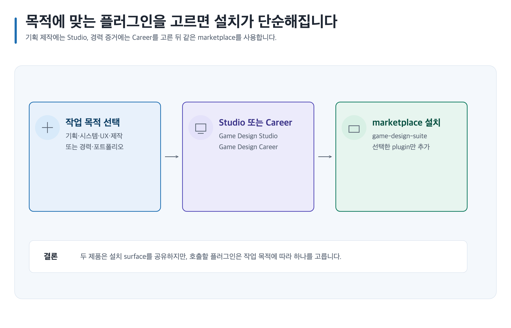
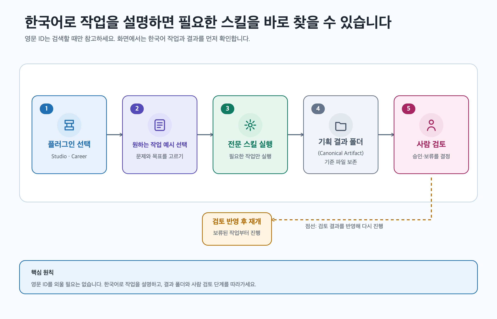
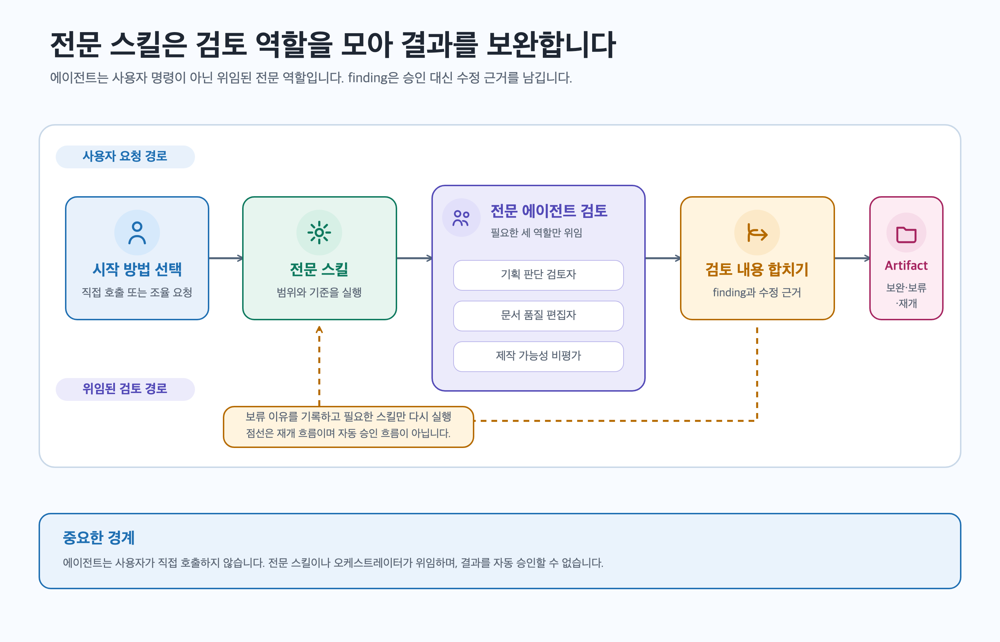
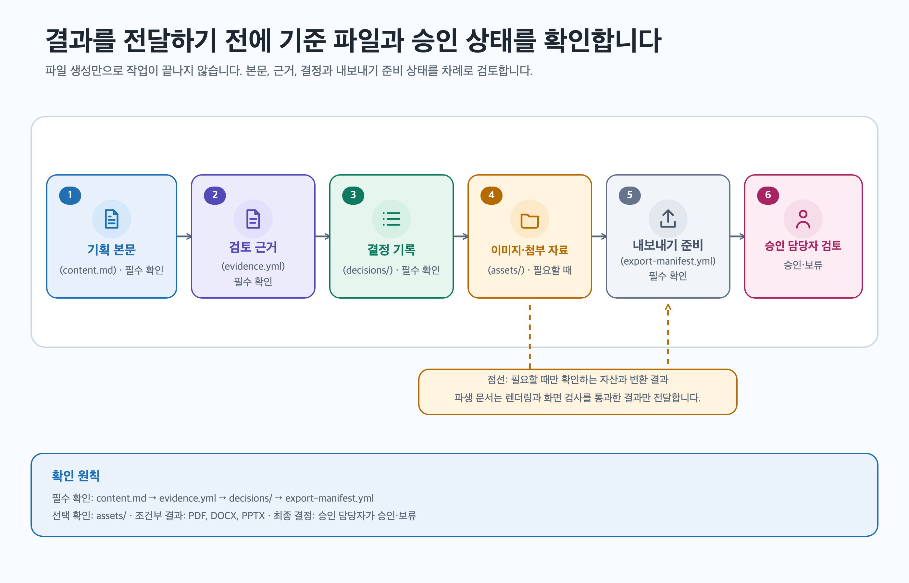
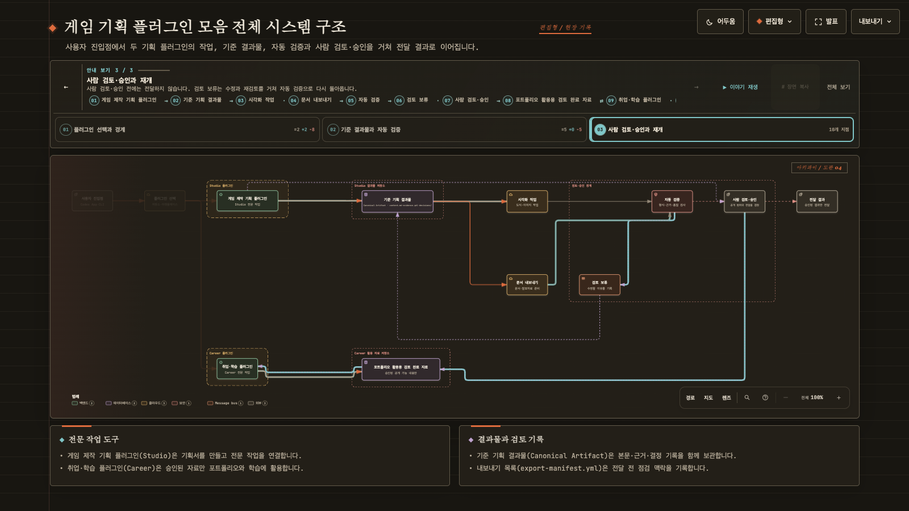

# 게임 기획 플러그인 모음 (Game Design Plugin Suite)

게임을 기획하는 학생·기획자·멘토가 **아이디어를 검토 가능한 기획 문서로 만들고**, 그 결과를 학습·포트폴리오 작업까지 연결하는 두 개의 독립 플러그인입니다. **Game Design Studio**는 게임의 규칙·콘텐츠·UX·제작 범위를 설계하고, **Game Design Career**는 역할 탐색·역기획·포트폴리오·면접·성장 계획을 돕습니다.

**기준 기획 결과물 (Canonical Artifact)**은 한 작업의 기준이 되는 결과 폴더입니다. `content.md`에 기획 본문을, `evidence.yml`에 근거를, `decisions/`에 선택 이유를 보존하므로 다음 수정·검토·내보내기에서 같은 기준을 다시 사용할 수 있습니다.

이 도구는 판단과 근거 관리를 돕지만 재미, 흥행, 매출, 채용·합격, 법률 준수, 플랫폼 승인 또는 사람 승인을 보장하지 않습니다. 결과를 사용하거나 공개하기 전에 이름 있는 사람이 사실, 범위, 권리와 품질을 검토해야 합니다.

## 목차

아래 순서대로 제품을 고르고 설치한 뒤 첫 결과와 상세 작업 경로를 확인하세요.

1. [30초 안에 플러그인 선택하기](#30초-안에-플러그인-선택하기)
2. [설치하기](#설치하기)
3. [5분 안에 첫 결과 만들기](#5분-안에-첫-결과-만들기)
4. [케이스별 프롬프트로 시작하기](#케이스별-프롬프트로-시작하기)
5. [스킬별로 바로 실행하기](#스킬별로-바로-실행하기)
6. [요청 뒤에 생성되는 결과물](#요청-뒤에-생성되는-결과물)
7. [플러그인 구조와 전체 시스템 아키텍처](#플러그인-구조와-전체-시스템-아키텍처)
8. [이미지·도식·문서 내보내기](#이미지도식문서-내보내기)
9. [상세 가이드에서 더 알아보기](#상세-가이드에서-더-알아보기)
10. [안전·권리·사람 승인 경계](#안전권리사람-승인-경계)
11. [문제를 해결하고 작업 재개하기](#문제를-해결하고-작업-재개하기)
12. [기술 문서·기여·라이선스](#기술-문서기여라이선스)

## 30초 안에 플러그인 선택하기

만들 결과와 사용할 사람을 기준으로 Studio, Career 또는 두 제품을 선택하세요.

| 선택 | 사용하는 사람 | 첫 요청 유형 | 처음 받는 결과물 | 상세 가이드 |
| --- | --- | --- | --- | --- |
| Studio | 게임 기획 학생, 현업 기획자, 팀 리드 | 비전·규칙·콘텐츠·UX·경제·제작 범위 설계 | 게임 기획 브리프 (`game-design-brief`) | [Studio 사용자 가이드](guides/game-design-studio/README.md) |
| Career | 취업 준비생, 주니어, 직무 전환자, 멘토 | 역할 탐색·역기획·포트폴리오·면접·성장 계획 | 게임 기획 경력 계획 (`game-design-career-plan`) | [Career 사용자 가이드](guides/game-design-career/README.md) |
| 둘 다 | 완성한 기획서를 취업용 포트폴리오 사례로 정리할 기획자 | Studio 검토 뒤 Career 포트폴리오 사례로 정리 | 제품별 기준 기획 결과물 2개 (Canonical Artifact) | [전체 사용자 가이드](guides/README.md) |

[](guides/assets/shared/plugin-selection-flow.svg)

[편집 가능한 선택 흐름 SVG](guides/assets/shared/plugin-selection-flow.svg)에서 레이블과 관계를 확인할 수 있습니다.

## 설치하기

App에서는 Plugins 화면을 사용하고, Codex CLI에서는 marketplace와 제품 ID를 사용합니다. 필요한 제품만 설치하세요.

### Codex App에 설치하기

ChatGPT 데스크톱 앱의 Work 또는 Codex에서 저장소와 플러그인을 연결합니다.

1. 저장소 루트를 로컬 프로젝트 또는 작업 폴더로 엽니다.
2. `.agents/plugins/marketplace.json`의 marketplace 이름이 `game-design-suite`인지 확인합니다.
3. 앱을 다시 시작하고 **Codex**를 선택하거나 **ChatGPT → Work**를 켭니다.
4. **Plugins**에서 marketplace를 열고 필요한 제품을 설치합니다.
5. 설치 직후 **새 채팅**을 열고 Studio 또는 Career를 선택합니다.

제품별 화면 절차는 [Studio 설치 가이드](guides/game-design-studio/installation.md)와 [Career 설치 가이드](guides/game-design-career/installation.md)를 따르세요.

### Codex CLI에 설치하기

저장소 루트에서 marketplace를 등록하고 설치할 제품을 하나씩 선택합니다.

```bash
codex plugin marketplace add .
codex plugin marketplace list
```

Studio가 필요하면 다음 명령만 실행합니다.

```bash
codex plugin add game-design-studio@game-design-suite
```

Career가 필요하면 다음 명령만 실행합니다.

```bash
codex plugin add game-design-career@game-design-suite
```

둘 다 필요하면 위의 두 설치 코드 블록을 모두 실행합니다. 설치 뒤 상태를 확인하고 **새 세션**을 시작하세요.

```bash
codex plugin list
```

### 업데이트·재설치하기

Marketplace refresh와 설치 패키지 교체는 서로 다른 작업입니다.

#### Codex App

1. 로컬 checkout을 갱신하고 저장소 루트에서 `npm run build`와 `npm run validate`를 실행합니다.
2. ChatGPT 데스크톱 앱을 다시 시작해 로컬 marketplace를 다시 읽습니다.
3. **Plugins**의 설치된 Studio 또는 Career 상세 화면에서 **Uninstall plugin**을 선택합니다.
4. **Plugins Directory**의 `game-design-suite`에서 제거한 제품을 다시 설치합니다.
5. Plugins 목록에서 설치 확인을 마친 뒤 **새 채팅**을 열고 제품을 선택합니다.

관리자가 제공한 기본 플러그인처럼 제거할 수 없는 항목은 관리자에게 업데이트를 요청하세요.

#### Codex CLI

1. 로컬 checkout을 갱신하고 저장소 루트에서 package를 빌드·검증합니다.

```bash
npm run build
npm run validate
```

2. 설치한 제품만 제거합니다. 둘 다 설치했다면 두 명령을 모두 실행합니다.

```bash
codex plugin remove game-design-studio@game-design-suite
codex plugin remove game-design-career@game-design-suite
```

3. 제거한 제품만 다시 설치합니다.

```bash
codex plugin add game-design-studio@game-design-suite
codex plugin add game-design-career@game-design-suite
```

4. 설치 상태를 확인한 뒤 **새 세션**을 시작합니다.

```bash
codex plugin list
```

Git marketplace를 등록했다면 재설치 전에 `codex plugin marketplace upgrade game-design-suite`로 설치 가능한 snapshot을 refresh할 수 있습니다. 이 명령은 설치된 플러그인을 교체하지 않으므로 위 제거·재설치 단계를 계속 수행해야 합니다.

## 5분 안에 첫 결과 만들기

모르는 정보는 미정으로 남깁니다. 아래 세 경로는 첫 기준 결과 폴더 (Artifact)와 먼저 읽을 파일을 함께 지정합니다.

### Studio에서 첫 게임 기획 브리프 만들기

예상 첫 결과는 **게임 기획 브리프** (`game-design-brief`)입니다. `content.md`,
`evidence.yml`, `export-manifest.yml` 순서로 먼저 읽으세요. App 또는 CLI 중
**하나만 골라** 아래 요청문을 새 채팅 또는 새 세션에 복사하세요.

```text
@Game Design Studio 모바일 협동 RPG의 대상 플레이어와 핵심
재미를
미정 항목과 함께 game-design-brief로 작성해.

$game-design-studio:orchestrate-game-design-project
모바일 협동 RPG의 대상 플레이어와 핵심 재미를
미정 항목과 함께 game-design-brief로 작성해.
```

### Career에서 첫 경력 계획 만들기

예상 첫 결과는 **게임 기획 경력 계획** (`game-design-career-plan`)입니다.
`content.md`, `evidence.yml`, `export-manifest.yml` 순서로 먼저 읽으세요. App 또는
CLI 중 **하나만 골라** 아래 요청문을 새 채팅 또는 새 세션에 복사하세요.

```text
@Game Design Career 시스템 기획과 콘텐츠 기획의 교환조건을
비교하고
주 8시간 기준 12주 증거 계획을 미정 항목과 함께 작성해.

$game-design-career:orchestrate-game-design-career
시스템 기획과 콘텐츠 기획의 교환조건을 비교하고
주 8시간 기준 12주 증거 계획을 미정 항목과 함께 작성해.
```

### 완성한 게임 기획을 취업용 포트폴리오 사례로 정리하기

Studio에서 사람이 검토한 기획서 하나를 바탕으로, 내가 해결한 문제와
기여를 보여 주는 취업용 포트폴리오 사례를 만듭니다.

**이럴 때 사용:** 수업·개인 프로젝트에서 완성한 기획서를 포트폴리오와
면접 준비에 활용하고 싶을 때 사용합니다.

**준비물:** Studio에서 작성하고 검토한 기획서 1개와 내가 실제로 맡은
범위, 공개 가능한 정보입니다.

**실행 순서:** 먼저 Studio 기획 검토(`review-game-design`)로 공개할
내용을 구분한 뒤, Career 포트폴리오 작성(`build-game-design-portfolio`)으로
사례를 재구성합니다.

```text
App
@Game Design Studio에서 기획 검토(review-game-design)를 먼저 실행해,
완성한 기획서에서 공개할 수 있는 문제, 내가 맡은 범위,
선택 이유와 검증 결과를 구분해 줘.

그다음 @Game Design Career에서 포트폴리오 작성
(build-game-design-portfolio)을 실행해 검토된 내용만 사용하여
포트폴리오 사례 본문, 개인 기여와 선택 근거, 주요
의사결정 기록과
공개 전 확인 목록을 작성해 줘.

CLI
$game-design-studio:review-game-design
완성한 기획서에서 공개할 수 있는 문제, 내가 맡은 범위,
선택 이유와 검증 결과를 구분해 줘.

$game-design-career:build-game-design-portfolio
검토된 내용만 사용해 포트폴리오 사례 본문, 개인 기여와
선택 근거,
주요 의사결정 기록과 공개 전 확인 목록을 만들어 줘.
```

**얻게 되는 결과:**

- **포트폴리오 사례 본문** (`creative-design-portfolio/content.md`):
  문제, 내 역할, 판단과 검증 결과를 읽는 사람이 따라갈 수 있게 정리합니다.
- **개인 기여와 선택 근거** (`creative-design-portfolio/evidence.yml`):
  내가 한 일과 그 선택을 뒷받침하는 내용을 분리해 기록합니다.
- **주요 의사결정 기록** (`creative-design-portfolio/decisions/`):
  선택한 판단, 대안과 다음 결정을 바꿀 조건을 기록합니다. 이 기록은
  이후 별도 면접 연습(`practice-game-design-interview`)에서 질문과 답변을
  준비할 때 참고할 수 있습니다.
- **공개 전 확인 목록** (`creative-design-portfolio/export-manifest.yml`):
  공개할 파일, 보류 항목과 내보내기 상태를 확인합니다.

**공개 전 확인:** 작성자가 실제 기여 범위와 공개 권한을 직접 확인합니다.
이 플러그인은 공개를 자동 승인하지 않으며, 미정·제외 내용은 보존합니다.

## 케이스별 프롬프트로 시작하기

제작용 요청문 목록 (Production catalog)의 대표 카드 18개를 Studio 7개, Career 7개, 연계 4개 순서로 제공합니다. 카드를 열어 입력, 실행 흐름, 결과와 사람 검토 경계를 확인하세요.

[](guides/assets/readme/prompt-to-result-flow.svg)

### Studio 기획 사례 7개

게임의 규칙, 콘텐츠, 경험과 제작 범위를 설계하려는 기획자가 Studio 사례를 고릅니다. 각 사례는 검토 가능한 기획 결과 폴더 (Artifact)와 사람 검토 지점을 남깁니다.

<details data-prompt-id="studio:case:ST-C01">
<summary>게임의 방향과 핵심 재미 정의 (studio:case:ST-C01)</summary>

게임의 방향을 정하지 못했을 때 대상 플레이어와 검증 기준을 기획 브리프로 정리합니다.

#### 사용 시점

아이디어의 대상 플레이어와 핵심 재미를 아직 한 문장으로 설명하기 어려울 때
사용합니다.

#### 준비 입력

게임 한 줄 소개, 예상 플레이 시간, 대상 플레이어와 확인한 사실·미정 항목을
적습니다.

#### 복사할 요청문

```text
App
@Game Design Studio [프로젝트 ID] [공개 정보]의 fact, inference,
recommendation을 분리해
ST-C01를 작성해.

채운 예시 (App)
@Game Design Studio 바람섬-협동RPG 공개 가능한 플레이테스트
메모의 사실 (fact),
추론 (inference), 제안 (recommendation)을 분리해 ST-C01를 작성해.

CLI
$game-design-studio:apply-document-quality-profile
$game-design-studio:define-game-vision
$game-design-studio:orchestrate-game-design-project
$game-design-studio:review-game-design [프로젝트 ID] [공개 정보]
ST-C01의 fact,
inference, recommendation을 분리해.

채운 예시 (CLI)
$game-design-studio:apply-document-quality-profile
$game-design-studio:define-game-vision
$game-design-studio:orchestrate-game-design-project
$game-design-studio:review-game-design 바람섬-협동RPG 공개 가능한
플레이테스트 메모
ST-C01의 사실 (fact), 추론 (inference), 제안 (recommendation)을 분리해.
```

#### 실행 흐름

`apply-document-quality-profile` → `define-game-vision` → `orchestrate-game-design-project` → `review-game-design`

비전 기준을 세우고 기획 브리프로 묶은 뒤 검토하는 순서입니다.

#### 예상 결과

`vision-pillars` → `game-design-brief` → `game-design-review`

비전 기둥은 지켜야 할 약속, 기획 브리프는 다음 설계의 출발점입니다.

#### 읽는 순서

`game-design/[프로젝트 ID]/vision-pillars/content.md` → `game-design/[프로젝트 ID]/vision-pillars/evidence.yml` → `game-design/[프로젝트 ID]/vision-pillars/export-manifest.yml`

본문의 플레이어 약속, 근거의 확인·추정, 보류 항목 순서로 확인합니다.

#### 사람 검토

**읽는 순서:** `content.md → evidence.yml → decisions/ → assets/ → export-manifest.yml`. 중간 결과에서는 player promise와 각 pillar가 verb·decision·feedback에 연결되는지 먼저 봅니다. **사람 결정:** 실제 design owner가 대상, pillar, anti-pillar, non-goal과 다음 prototype 범위를 승인·수정·보류합니다. 스킬 실행, reviewer finding과 파일 생성은 자동 승인하지 않습니다.

사람이 만들지 않을 재미와 다음 시제품 범위를 결정합니다.

#### 다음 요청

ST-C01의 보존 결과 폴더 (artifact)와 중단 기록 (blocker receipt)을 읽고 공개 정보만으로 재개해.

예: “바람섬 협동 RPG의 첫 15분 전투 시제품 범위를 추가해 줘.”

</details>

<details data-prompt-id="studio:case:ST-C02">
<summary>핵심 플레이 루프와 선택 설계 (studio:case:ST-C02)</summary>

플레이어가 반복할 행동과 의미 있는 선택을 시스템 명세로 만들 때 사용합니다.

#### 사용 시점

반복 플레이가 단순 작업처럼 느껴지거나 보상과 선택의 연결이 약할 때
사용합니다.

#### 준비 입력

반복 행동, 성공·실패 조건, 보상, 중단 행동과 관찰할 플레이어 반응을 적습니다.

#### 복사할 요청문

```text
App
@Game Design Studio [프로젝트 ID] [공개 정보]의 fact, inference,
recommendation을 분리해
ST-C02를 작성해.

채운 예시 (App)
@Game Design Studio 별빛원정대 4인 협동 전투의 공개 테스트
규칙의 사실 (fact),
추론 (inference), 제안 (recommendation)을 분리해 ST-C02를 작성해.

CLI
$game-design-studio:define-game-vision $game-design-studio:design-game-systems
$game-design-studio:design-player-experience
$game-design-studio:review-game-design [프로젝트 ID] [공개 정보]
ST-C02의 fact,
inference, recommendation을 분리해.

채운 예시 (CLI)
$game-design-studio:define-game-vision
$game-design-studio:design-game-systems
$game-design-studio:design-player-experience
$game-design-studio:review-game-design 별빛원정대 4인 협동 전투의
공개 테스트 규칙
ST-C02의 사실 (fact), 추론 (inference), 제안 (recommendation)을 분리해.
```

#### 실행 흐름

`define-game-vision` → `design-game-systems` → `design-player-experience` → `review-game-design`

비전의 약속을 규칙과 화면 피드백으로 옮긴 뒤 선택을 검토합니다.

#### 예상 결과

`core-motivation-loop` → `system-specification` → `game-design-review`

핵심 루프는 행동 순서, 시스템 명세서는 규칙, 검토 문서는 막힌 선택을 보여 줍니다.

#### 읽는 순서

`game-design/[프로젝트 ID]/core-motivation-loop/content.md` → `game-design/[프로젝트 ID]/core-motivation-loop/evidence.yml` → `game-design/[프로젝트 ID]/core-motivation-loop/export-manifest.yml`

본문의 루프·규칙, 관찰 근거, 대안 기록 순서로 확인합니다.

#### 사람 검토

**읽는 순서:** `content.md`의 loop와 rule ID, `evidence.yml`의 관찰, `decisions/`의 대안 순서입니다. 중간 결과에서 모든 단계가 입력과 feedback을 갖고 실패 뒤 복구 가능한지 확인합니다. **사람 결정:** design owner와 player-protection owner가 의미 있는 선택, stop condition과 다음 prototype을 승인하거나 보류합니다. 자동화는 재미나 retention을 승인하지 않습니다.

사람이 보상·손실·복구 선택이 공정한지 정합니다.

#### 다음 요청

ST-C02의 보존 결과 폴더 (artifact)와 중단 기록 (blocker receipt)을 읽고 공개 정보만으로 재개해.

예: “정찰-협동전투-제작 루프의 실패 복구 선택 2개를 비교해 줘.”

</details>

<details data-prompt-id="studio:case:ST-C03">
<summary>규칙과 예외를 시스템 명세로 정리 (studio:case:ST-C03)</summary>

규칙이 충돌하거나 예외가 늘어날 때 상태와 데이터를 검토 가능한 표로 정리합니다.

#### 사용 시점

예외가 늘어 규칙을 다르게 해석하거나 구현 전달 기준이 흔들릴 때 사용합니다.

#### 준비 입력

상태, 기본 규칙, 예외, 우선순위, 저장 데이터와 테스트 사례를 적습니다.

#### 복사할 요청문

```text
App
@Game Design Studio [프로젝트 ID] [공개 정보]의 fact, inference,
recommendation을 분리해
ST-C03를 작성해.

채운 예시 (App)
@Game Design Studio 고대유적-레이드 파티 보상 규칙의 공개
명세의 사실 (fact),
추론 (inference), 제안 (recommendation)을 분리해 ST-C03를 작성해.

CLI
$game-design-studio:apply-document-quality-profile
$game-design-studio:design-game-systems
$game-design-studio:design-player-experience
$game-design-studio:review-game-design [프로젝트 ID] [공개 정보]
ST-C03의 fact,
inference, recommendation을 분리해.

채운 예시 (CLI)
$game-design-studio:apply-document-quality-profile
$game-design-studio:design-game-systems
$game-design-studio:design-player-experience
$game-design-studio:review-game-design 고대유적-레이드 파티 보상
규칙의 공개 명세
ST-C03의 사실 (fact), 추론 (inference), 제안 (recommendation)을 분리해.
```

#### 실행 흐름

`apply-document-quality-profile` → `design-game-systems` → `design-player-experience` → `review-game-design`

규칙과 화면 상태를 맞추고 충돌과 누락을 검토합니다.

#### 예상 결과

`system-specification` → `rule-exception-matrix` → `data-schema-table-contract`

시스템 명세서는 기준 규칙, 예외 표는 충돌 처리, 데이터 표는 구현 항목입니다.

#### 읽는 순서

`game-design/[프로젝트 ID]/system-specification/content.md` → `game-design/[프로젝트 ID]/system-specification/evidence.yml` → `game-design/[프로젝트 ID]/system-specification/export-manifest.yml`

본문의 경계, 근거의 예외, 내보내기 전 전달 항목을 확인합니다.

#### 사람 검토

**읽는 순서:** system boundary → rule table → exception matrix → data mapping → evidence·decisions입니다. 중간 결과에서 rule ID마다 state, feedback, failure와 test case가 있는지 봅니다. **사람 결정:** design owner와 engineering owner가 authority, precedence, migration과 rollback을 승인합니다. reviewer finding과 lint는 자동 승인하지 않습니다.

사람이 최종 권한과 되돌릴 수 있는 변경인지 정합니다.

#### 다음 요청

ST-C03의 보존 결과 폴더 (artifact)와 중단 기록 (blocker receipt)을 읽고 공개 정보만으로 재개해.

예: “파티 탈퇴 중 보상 수령 예외의 우선순위와 테스트를 추가해 줘.”

</details>

<details data-prompt-id="studio:case:ST-C04">
<summary>화면 흐름과 접근성 점검 (studio:case:ST-C04)</summary>

온보딩과 UI 흐름이 헷갈릴 때 화면 상태와 접근성 기준을 함께 점검합니다.

#### 사용 시점

튜토리얼 첫 화면에서 목표 행동을 찾지 못하거나 모바일과 PC에서 입력 방식이
달라질 때 사용합니다. 로딩·빈 상태·오류·중단 후 복귀까지 설계해야 할 때
특히 유용합니다.

#### 준비 입력

첫 세션의 핵심 행동 2~3개, 지원 플랫폼과 입력 방식, 화면별 현재 문제,
접근성 요구(키보드 조작·자막·색상 외 신호 등)를 준비합니다.

#### 복사할 요청문

```text
App
@Game Design Studio [프로젝트 ID] [공개 정보]의 fact, inference,
recommendation을 분리해
ST-C04를 작성해.

CLI
$game-design-studio:apply-document-quality-profile
$game-design-studio:design-player-experience
$game-design-studio:review-game-design
$game-design-studio:visualize-game-design [프로젝트 ID] [공개 정보]
ST-C04의 fact,
inference, recommendation을 분리해.

채운 예시 (App)
@Game Design Studio 달빛항구-모바일RPG 첫 세션의
길찾기·자동전투·보상수령
흐름과 공개 가능한 접근성 요구를 바탕으로 ST-C04를 작성해.

채운 예시 (CLI)
$game-design-studio:apply-document-quality-profile
$game-design-studio:design-player-experience
$game-design-studio:review-game-design 달빛항구-모바일RPG 첫 세션의
길찾기·자동전투·보상수령 흐름과 접근성 요구를 ST-C04로
검토해.
$game-design-studio:visualize-game-design 달빛항구-모바일RPG ST-C04의
화면 상태와 오류 복구 흐름을 도식화해.
```

#### 실행 흐름

`apply-document-quality-profile` → `design-player-experience` → `review-game-design` → `visualize-game-design`

#### 예상 결과

`화면 흐름·상태 명세 (ui-ux-flow-state)` → `접근성·플랫폼 매트릭스
(accessibility-platform-matrix)` → `게임 기획 검토 (game-design-review)`

채운 예시에서는 첫 세션 화면 목록, 상태별 입력·피드백 표, 플랫폼별 대체
입력 경로, 검토 의견 (finding)과 화면 전환·오류 복구 도식이 생성됩니다.

#### 읽는 순서

`game-design/[프로젝트 ID]/ui-ux-flow-state/content.md` → `game-design/[프로젝트 ID]/ui-ux-flow-state/evidence.yml` → `game-design/[프로젝트 ID]/ui-ux-flow-state/export-manifest.yml`

#### 사람 검토

**읽는 순서:** 사용자 목표 (user goal) → 핵심 행동 표 (critical action table) → 상태 범위 (state coverage) → 플랫폼 표 (platform matrix) → 근거·결정 (evidence·decision)입니다. 중간 결과에서 로딩·빈 화면·오류·중단 (loading·empty·error·interruption)과 대체 입력 누락을 먼저 봅니다. **사람 결정:** 접근성 책임자와 기획 책임자 (accessibility owner·design owner)가 지원 플랫폼, 검증 방법과 중단 항목 (blocker)을 승인·수정·보류합니다. 시안·렌더러·검토자 (mockup·renderer·reviewer)는 자동 승인하지 않습니다.

#### 다음 요청

ST-C04의 보존 결과 폴더 (artifact)와 중단 기록 (blocker receipt)을 읽고 공개 정보만으로 재개해.

예: “보상 수령 화면의 색상 외 피드백과 키보드 대체 입력을 추가하고,
오류 상태에서 재시도·나가기 선택을 비교해 줘.”

</details>

<details data-prompt-id="studio:case:ST-C05">
<summary>퀘스트와 캐릭터 콘텐츠 설계 (studio:case:ST-C05)</summary>

퀘스트, NPC, 전투 요소가 얽힐 때 선택과 결과가 보이는 콘텐츠 명세를 만듭니다.

#### 사용 시점

퀘스트의 선택이 대사만 바꾸고 플레이 결과로 이어지지 않거나, 캐릭터·스킬·
몬스터의 역할과 제작 범위가 서로 어긋날 때 사용합니다. 선택 전후 상태와
재플레이 가능성까지 한 번에 정리할 때 적합합니다.

#### 준비 입력

퀘스트 목표와 진입 조건, NPC 상태, 플레이어 선택, 결과·보상, 연결할 전투
요소, 반복 여부, 제작 예산과 공개 가능한 저작권·출처 범위를 준비합니다.

#### 복사할 요청문

```text
App
@Game Design Studio [프로젝트 ID] [공개 정보]의 fact, inference,
recommendation을 분리해
ST-C05를 작성해.

CLI
$game-design-studio:apply-document-quality-profile
$game-design-studio:design-game-content
$game-design-studio:design-game-systems
$game-design-studio:plan-game-production
$game-design-studio:review-game-design [프로젝트 ID] [공개 정보]
ST-C05의 fact,
inference, recommendation을 분리해.

채운 예시 (App)
@Game Design Studio 유리숲-구조대장 퀘스트에서 NPC 신뢰도
선택이 전투와
보상에 미치는 결과, 공개 가능한 출처 범위를 바탕으로
ST-C05를 작성해.

채운 예시 (CLI)
$game-design-studio:apply-document-quality-profile
$game-design-studio:design-game-content
$game-design-studio:design-game-systems
$game-design-studio:plan-game-production
$game-design-studio:review-game-design 유리숲-구조대장 퀘스트의
선택·전투·보상
연결과 공개 가능한 출처 범위를 ST-C05로 검토해.
```

#### 실행 흐름

`apply-document-quality-profile` → `design-game-content` → `design-game-systems` → `plan-game-production` → `review-game-design`

#### 예상 결과

`내러티브·퀘스트·NPC 명세 (narrative-quest-npc)` → `캐릭터·스킬·전투·몬스터
명세 (character-skill-combat-monster)` → `게임 기획 검토 (game-design-review)`

채운 예시에서는 NPC 상태와 선택·결과 표, 전투 역할·텔레그래프·카운터플레이
명세, 제작 의존성, 권리 확인 항목과 검토 의견 (finding)이 생성됩니다.

#### 읽는 순서

`game-design/[프로젝트 ID]/narrative-quest-npc/content.md` → `game-design/[프로젝트 ID]/narrative-quest-npc/evidence.yml` → `game-design/[프로젝트 ID]/narrative-quest-npc/export-manifest.yml`

#### 사람 검토

**읽는 순서:** 목적 (purpose) → 진입·상태 (entry/state) → 선택·결과 (choice·consequence) → 의존성 (dependency) → 제작·권리 근거 (production·rights evidence) → 결정 기록 (decisions)입니다. 중간 결과에서 연결되지 않은 시스템·데이터 ID와 근거 없는 제작 비용을 중단 항목 (blocker)으로 봅니다. **사람 결정:** 콘텐츠·시스템·제작 책임자와 권리 담당자 (content owner·system owner·production owner)가 분기, 범위, 출처·동의 (provenance·consent)를 승인합니다. 생성된 서사나 이미지가 자동 승인되지는 않습니다.

#### 다음 요청

ST-C05의 보존 결과 폴더 (artifact)와 중단 기록 (blocker receipt)을 읽고 공개 정보만으로 재개해.

예: “신뢰도 2단계의 협상·전투 분기를 비교하고, 각 분기에 필요한 NPC 대사,
스킬 텔레그래프와 제작 리소스의 최소 범위를 정리해 줘.”

</details>

<details data-prompt-id="studio:case:ST-C07">
<summary>성장·경제·라이브 운영 설계 (studio:case:ST-C07)</summary>

성장 보상과 이벤트 운영이 필요한 프로젝트에서 재화 흐름과 측정 기준을 정리합니다.

#### 사용 시점

성장 보상이 과도하게 쌓이거나 부족하고 이벤트가 경제를 흔들 수 있을 때
사용합니다. 재화의 유입·소비·보유량과 실험 중단·되돌리기 기준을 함께
설계해야 하는 라이브 서비스 기획에 적합합니다.

#### 준비 입력

재화 종류와 현재 유입·소비량, 성장 목표, 이벤트 가설과 대조군, 기간·대상
세그먼트, 보호 지표와 중단·되돌리기 기준 (rollback)을 준비합니다.

#### 복사할 요청문

```text
App
@Game Design Studio [프로젝트 ID] [공개 정보]의 fact, inference,
recommendation을 분리해
ST-C07를 작성해.

CLI
$game-design-studio:apply-document-quality-profile
$game-design-studio:design-game-economy-and-liveops
$game-design-studio:design-game-systems $game-design-studio:review-game-design
[프로젝트 ID] [공개 정보] ST-C07의 fact, inference, recommendation을
분리해.

채운 예시 (App)
@Game Design Studio 별빛농장 시즌 이벤트의 씨앗·골드 유입과
소비, 신규·복귀
플레이어 보호 지표를 공개 가능한 가정으로 분리해
ST-C07를 작성해.

채운 예시 (CLI)
$game-design-studio:apply-document-quality-profile
$game-design-studio:design-game-economy-and-liveops
$game-design-studio:design-game-systems
$game-design-studio:review-game-design 별빛농장 시즌 이벤트의 재화
흐름,
보호 지표와 되돌리기 기준 (rollback)을 ST-C07로 검토해.
```

#### 실행 흐름

`apply-document-quality-profile` → `design-game-economy-and-liveops` → `design-game-systems` → `review-game-design`

#### 예상 결과

`경제·밸런스 명세 (economy-balance)` → `LiveOps 실험·이벤트 계획
(liveops-experiment-event)` → `게임 기획 검토 (game-design-review)`

채운 예시에서는 재화 유입·소비 (source/sink)와 목표 보유량 표, 이벤트 가설·대조군·
보호 지표·중단·되돌리기 계획 (rollback), 그리고 수치 근거에 대한 검토 의견 (finding)이
생성됩니다.

#### 읽는 순서

`game-design/[프로젝트 ID]/economy-balance/content.md` → `game-design/[프로젝트 ID]/economy-balance/evidence.yml` → `game-design/[프로젝트 ID]/economy-balance/export-manifest.yml`

#### 사람 검토

**읽는 순서:** 재화 흐름 (resource flow) → 성장·복구 (progression/recovery) → 가격·확률 근거 (price·probability evidence) → 실험 (experiment) → 보호 기준·되돌리기 (guardrail·rollback) → 결정 기록 (decisions)입니다. 중간 결과에서 유입 근거 없는 수치 (source 없는 수치), 다중 변수, 복구 불가 변경을 중단 항목 (blocker)으로 봅니다. **사람 결정:** 경제·라이브 운영·정책·접근성 책임자 (economy·LiveOps·policy·accessibility owner)가 실험 실행·중단·되돌리기를 승인합니다. 시뮬레이션·원격 측정 수집·검토자 권고 (simulation·telemetry·reviewer)는 자동 승인하지 않습니다.

사람이 가격·확률·보호 지표의 실제 기준과 실험 중단 여부를 확정합니다.

#### 다음 요청

ST-C07의 보존 결과 폴더 (artifact)와 중단 기록 (blocker receipt)을 읽고 공개 정보만으로 재개해.

예: “신규·복귀 플레이어의 7일 보유량을 보호하는 상한을 제안하고,
실험 중단 조건과 이전 설정으로 되돌리는 절차를 추가해 줘.”

</details>

<details data-prompt-id="studio:case:ST-C08">
<summary>제작 범위와 출시 위험 점검 (studio:case:ST-C08)</summary>

일정과 인력이 불확실할 때 제작 범위, 의존성, 중단 기준을 검토합니다.

#### 사용 시점

핵심 시제품 (vertical slice)의 범위가 계속 늘거나 일정·인력·외주·권리 의존성이 출시를
위협할 때 사용합니다. 무엇을 먼저 만들고 무엇을 중단할지, 이미지와 문서를
어떤 형식으로 검수할지 함께 정해야 할 때 적합합니다.

#### 준비 입력

목표 경험과 팀 역할, 일정·기술 제약, 기능 의존성, 필수·선택 범위, 이미지
제작 계획, 출시 형식과 각 단계의 완료 기준·중단 기준을 준비합니다.

#### 복사할 요청문

```text
App
@Game Design Studio [프로젝트 ID] [공개 정보]의 fact, inference,
recommendation을 분리해
ST-C08를 작성해.

CLI
$game-design-studio:plan-game-production
$game-design-studio:review-game-design $game-design-studio:plan-image-assets
$game-design-studio:visualize-game-design
$game-design-studio:export-game-design-documents [프로젝트 ID] [공개
정보] ST-C08의
fact, inference, recommendation을 분리해.

채운 예시 (App)
@Game Design Studio 해류도시-협동RPG 핵심 시제품 (vertical slice)의 8주 일정, 3인
팀,
핵심 전투와 최소 이미지 산출물만 공개 가능한 가정으로
분리해 ST-C08을 작성해.

채운 예시 (CLI)
$game-design-studio:plan-game-production
$game-design-studio:review-game-design
$game-design-studio:plan-image-assets
$game-design-studio:visualize-game-design
$game-design-studio:export-game-design-documents 해류도시-협동RPG 8주
slice의
필수 범위, 중단 기준과 MD·PDF·DOCX 출력 준비를 ST-C08로
정리해.
```

#### 실행 흐름

`plan-game-production` → `review-game-design` → `plan-image-assets` → `visualize-game-design` → `export-game-design-documents`

#### 예상 결과

`제작 범위·리스크 명세 (production-scope-risk)` → `게임 기획 검토
(game-design-review)` → `출력 준비 매니페스트 (export-preparation-manifest)`

채운 예시에서는 우선순위 범위표 (MoSCoW), 의존성·역량 공백·중단 기준 (kill criteria), 이미지 작업
목록과 문서 형식별 품질 확인 (QA) 항목, 최종 출력 준비 상태가 생성됩니다.

#### 읽는 순서

`game-design/[프로젝트 ID]/production-scope-risk/content.md` → `game-design/[프로젝트 ID]/production-scope-risk/evidence.yml` → `game-design/[프로젝트 ID]/production-scope-risk/export-manifest.yml`

#### 사람 검토

**읽는 순서:** `content.md → evidence.yml → decisions/ → assets/ → export-manifest.yml`. 중간 결과에서 중단 항목·역량 공백·이미지 수명 주기·렌더러 사용 가능 여부·형식별 품질 확인 (blocker·capacity gap·image lifecycle·renderer capability·QA)을 따로 봅니다. **사람 결정:** 제작 책임자 (production owner)가 범위·중단 여부 (scope·kill), 검토 결정 책임자가 의견 처리 (review decision owner·finding disposition), 권리·자산 책임자가 이미지 전환 (rights/asset owner·transition), 내보내기 책임자가 실제 형식 품질 확인 (export owner·format QA)을 승인합니다. 생성·렌더링·린트·검토 의견·상태 문자열 (render·lint·reviewer finding·state)은 자동 승인하지 않습니다.

#### 다음 요청

ST-C08의 보존 결과 폴더 (artifact)와 중단 기록 (blocker receipt)을 읽고 공개 정보만으로 재개해.

예: “8주 안에 전투 한 판을 검증해야 한다면 NPC 장식과 추가 이벤트를
후순위로 미루고, 이미지 생성 실패와 PDF 변환 실패의 대체 경로를 추가해 줘.”

</details>

### Career 학습·취업 사례 7개

게임 기획을 배우거나 취업을 준비하는 사람은 Career 사례로 역할, 근거와 다음
과제를 정리합니다. 각 사례는 멘토와 함께 검토할 수 있는 학습 또는 포트폴리오
결과물을 만듭니다.

<details data-prompt-id="career:case:CA-C01">
<summary>기획 직무와 전문 분야 탐색 (career:case:CA-C01)</summary>

어떤 기획 직무를 목표로 할지 고민할 때 역할 후보와 학습 과제를 비교합니다.

#### 사용 시점

시스템·콘텐츠·레벨 등 어떤 기획 직무부터 학습할지 비교하고, 다음 연습 과제를 정할 때 사용합니다.

#### 준비 입력

현재 해 본 작업 목록, 관심 직무 2~3개, 공개된 채용 공고 또는 학습 자료와
멘토에게 물어볼 질문을 준비합니다. 비공개 회사 자료나 개인정보는 넣지 않습니다.

#### 복사할 요청문

```text
App
@Game Design Career [경력 ID] [공개 정보]의 fact, inference,
recommendation을 분리해
CA-C01를 작성해.

채운 예시 (App)
@Game Design Career 민서-첫기획 공개된 시스템 기획 공고 2개와
내 튜토리얼
분석 메모를 비교해 fact, inference, recommendation을 분리하고
CA-C01을 작성해.

CLI
$game-design-career:apply-document-quality-profile
$game-design-career:map-game-design-career
$game-design-career:research-game-design-jobs [경력 ID] [공개 정보]
CA-C01의 fact,
inference, recommendation을 작성해.

채운 예시 (CLI)
$game-design-career:apply-document-quality-profile
$game-design-career:map-game-design-career
$game-design-career:research-game-design-jobs 민서-첫기획 공개 공고
2개의
요구 역량과 내 튜토리얼 분석 메모를 비교해 CA-C01을
작성해.
```

#### 실행 흐름

`apply-document-quality-profile` → `map-game-design-career` →
`research-game-design-jobs`

작성 기준을 맞춘 뒤 역할 후보를 비교하고, 현재 자료로 확인할 수 없는 부분은
추가 조사나 학습 과제로 남깁니다.

#### 예상 결과

`게임 기획 역할 비교표 (game-design-role-map)` →
`학습 로드맵 (learning-roadmap)`

역할별 핵심 역량, 내 현재 근거, 부족한 근거, 1~2주 안에 해 볼 작은 과제가
생성됩니다.

#### 읽는 순서

`game-design-career/[경력 ID]/career-stage-goal/content.md` →
`game-design-career/[경력 ID]/career-stage-goal/evidence.yml` →
`game-design-career/[경력 ID]/career-stage-goal/export-manifest.yml`

#### 사람 검토

**읽는 순서:** 목표 → 근거 → 격차 → 연습 과제 → 결정 기록입니다.
**검토 체크포인트:** 역할 비교표의 각 주장에 출처가 있고 학습 과제가
실행 가능한지 확인합니다. **사람 결정:** 사용자와 멘토가 목표 역할과 공개
범위를 승인·수정·보류합니다. 도구 실행과 결과물은 자동 승인하지 않습니다.

#### 다음 요청

CA-C01의 보존 결과물과 중단 기록을 읽고, 역할 비교에 필요한 공개 자료를
보완한 뒤 재개해.

</details>

<details data-prompt-id="career:case:CA-C04">
<summary>12주 역량 증거 계획 만들기 (career:case:CA-C04)</summary>

목표 직무에 필요한 역량을 12주 동안 증명할 과제로 나눌 때 사용합니다.

#### 사용 시점

목표 직무의 부족한 역량을 12주 동안 관찰 가능한 연습과 검토 일정으로 바꿀 때 사용합니다.

#### 준비 입력

현재 포트폴리오의 역량별 근거, 주당 학습 가능 시간, 목표 기간, 피드백을 줄
멘토와 공개 가능한 학습 자료를 준비합니다.

#### 복사할 요청문

```text
App
@Game Design Career [경력 ID] [공개 정보]의 fact, inference,
recommendation을 분리해
CA-C04를 작성해.

채운 예시 (App)
@Game Design Career 민서-12주 시스템기획 공개 포트폴리오의
규칙 명세 1개와
주당 6시간 학습 가능 조건으로 부족한 역량과 12주
증거 과제 (proof task)를 작성해.

CLI
$game-design-career:apply-document-quality-profile
$game-design-career:map-game-design-career
$game-design-career:visualize-career-roadmap
$game-design-career:export-career-documents [경력 ID] [공개 정보]
CA-C04의 fact,
inference, recommendation을 작성해.

채운 예시 (CLI)
$game-design-career:apply-document-quality-profile
$game-design-career:map-game-design-career
$game-design-career:visualize-career-roadmap
$game-design-career:export-career-documents 민서-12주 시스템기획의
역량 격차,
주차별 증거 과제 (proof task)와 멘토 검토 지점을 CA-C04로 정리해.
```

#### 실행 흐름

`apply-document-quality-profile` → `map-game-design-career` →
`visualize-career-roadmap` → `export-career-documents`

#### 예상 결과

`역량 매트릭스 (competency-matrix)` → `학습 로드맵 (learning-roadmap)`

역량별 현재 상태, 부족한 근거, 주차별 증거 결과물 (proof artifact), 피드백 일정과 보류된
가정을 얻습니다.

#### 읽는 순서

`game-design-career/[경력 ID]/competency-matrix/content.md` →
`game-design-career/[경력 ID]/competency-matrix/evidence.yml` →
`game-design-career/[경력 ID]/competency-matrix/export-manifest.yml`

#### 사람 검토

**읽는 순서:** 현재 근거 → 격차 → 증거 과제 (proof task) → 피드백 주기 → 결정입니다.
**검토 체크포인트:** 각 주차 과제가 실제로 제출 가능한 크기인지, 멘토 피드백
시점이 있는지 확인합니다. 사람은 우선순위와 공개 범위를 승인·수정·보류하며
계획 생성은 자동 승인을 하지 않고 성장을 보장하지 않습니다.

#### 다음 요청

CA-C04의 보존 결과물과 중단 기록을 읽고, 미완료 증거 과제 (proof task)와 다음 피드백
시점을 확인한 뒤 재개해.

</details>

<details data-prompt-id="career:case:CA-C05">
<summary>관찰을 근거로 역기획하기 (career:case:CA-C05)</summary>

공개 플레이 경험을 분석해 관찰과 추론을 구분한 역기획 문서를 만들 때 사용합니다.

#### 사용 시점

플레이 화면·튜토리얼·공개 패치노트에서 관찰한 사실과 자신의 해석을 분리해 역기획 사례를 만들 때 사용합니다.

#### 준비 입력

직접 플레이한 구간, 버전·날짜, 캡처 또는 공개 링크, 관찰 메모와 분석할
기능 범위를 준비합니다. 보지 못한 구현을 사실처럼 적지 않습니다.

#### 복사할 요청문

```text
App
@Game Design Career [경력 ID] [공개 정보]의 fact, inference,
recommendation을 분리해
CA-C05를 작성해.

채운 예시 (App)
@Game Design Career 별빛원정대 튜토리얼 공개 플레이 메모와
패치노트 링크를
사용해 관찰·추론·제안과 개인 기여 범위를 분리한
CA-C05를 작성해.

CLI
$game-design-career:apply-document-quality-profile
$game-design-career:reverse-engineer-game-design
$game-design-career:export-career-documents [경력 ID] [공개 정보]
CA-C05의 fact,
inference, recommendation을 작성해.

채운 예시 (CLI)
$game-design-career:apply-document-quality-profile
$game-design-career:reverse-engineer-game-design
$game-design-career:export-career-documents 별빛원정대 튜토리얼의
관찰 ID,
추론의 반례, 개선 제안을 역기획 사례로 정리해.
```

#### 실행 흐름

`apply-document-quality-profile` → `reverse-engineer-game-design` →
`export-career-documents`

#### 예상 결과

`역기획 문서 (reverse-design-document)` →
`게임 분석 보고서 (game-analysis-report)`

관찰 증거 ID, 관찰과 추론의 경계, 반례, 개선 제안과 공개 권리 확인 목록을
얻습니다.

#### 읽는 순서

`game-design-career/[경력 ID]/reverse-design-document/content.md` →
`game-design-career/[경력 ID]/reverse-design-document/evidence.yml` →
`game-design-career/[경력 ID]/reverse-design-document/export-manifest.yml`

#### 사람 검토

**읽는 순서:** 관찰 증거 ID → 추론 → 제안 → 개인 기여 → 공개 권리 검토입니다.
관찰과 해석이 섞이지 않았는지, 캡처·인용 권리가 확인됐는지 사람이 승인·수정·
보류합니다. 분석은 자동 승인하지 않으며 채용이나 공개를 보장하지 않습니다.

#### 다음 요청

CA-C05의 보존 결과물과 중단 기록을 읽고 누락된 관찰 링크나 권리 확인부터 보완해 재개해.

</details>

<details data-prompt-id="career:case:CA-C06">
<summary>창작 기획 포트폴리오 만들기 (career:case:CA-C06)</summary>

개인 기여를 보여 줄 새 기획 프로젝트를 포트폴리오 사례로 만들 때 사용합니다.

#### 사용 시점

개인 아이디어를 실제로 설명 가능한 창작 기획 사례로 만들고, 내 판단과 근거를 포트폴리오에 담을 때 사용합니다.

#### 준비 입력

문제와 대상 플레이어, 핵심 루프 초안, 직접 만든 규칙·화면·도식, 개인 기여
범위와 공개 가능한 이미지·문서만 준비합니다.

#### 복사할 요청문

```text
App
@Game Design Career [경력 ID] [공개 정보]의 fact, inference,
recommendation을 분리해
CA-C06를 작성해.

채운 예시 (App)
@Game Design Career 해류도시-첫시즌 협동 RPG의 대상 플레이어,
핵심 루프,
전투 규칙 초안과 내 판단 근거를 연결해 CA-C06 포트폴리오
사례로 작성해.

CLI
$game-design-career:apply-document-quality-profile
$game-design-career:build-game-design-portfolio
$game-design-career:review-game-design-portfolio [경력 ID] [공개 정보]
CA-C06의 fact,
inference, recommendation을 작성해.

채운 예시 (CLI)
$game-design-career:apply-document-quality-profile
$game-design-career:build-game-design-portfolio
$game-design-career:review-game-design-portfolio 해류도시-첫시즌의
문제,
선택한 규칙, 대안 비교와 개인 기여를 검토 가능한 사례로
정리해.
```

#### 실행 흐름

`apply-document-quality-profile` → `build-game-design-portfolio` →
`review-game-design-portfolio`

#### 예상 결과

`포트폴리오 프로젝트 브리프 (portfolio-project-brief)` →
`창작 기획 포트폴리오 (creative-design-portfolio)`

문제 정의, 설계 선택과 대안, 개인 기여, evidence 링크, 공개 전 수정 목록을
얻습니다. 5축 검토를 선택하면 발표 전 보완할 항목도 함께 나옵니다.

#### 읽는 순서

`game-design-career/[경력 ID]/portfolio-project-brief/content.md` →
`game-design-career/[경력 ID]/portfolio-project-brief/evidence.yml` →
`game-design-career/[경력 ID]/portfolio-project-brief/export-manifest.yml`

#### 사람 검토

**읽는 순서:** evidence ID → 관찰 → 추론 → 제안 → 개인 기여 → 공개 권리 검토입니다.
작성자와 포트폴리오 검토자가 실제로 만든 부분과 팀·가정 부분을 구분하고,
공개 가능한 주장과 이미지를 승인·수정·보류합니다. 결과물은 자동 승인하지
않으며 포트폴리오 품질이나 채용을 보장하지 않습니다.

#### 다음 요청

CA-C06의 보존 결과물과 중단 기록을 읽고 미완성 evidence와 공개 권리 확인부터 재개해.

</details>

<details data-prompt-id="career:case:CA-C07">
<summary>포트폴리오를 다섯 축으로 점검 (career:case:CA-C07)</summary>

포트폴리오의 빈틈을 찾아 수정 순서와 발표 문장을 정리할 때 사용합니다.

#### 사용 시점

완성한 포트폴리오를 발표·지원 전에 점검하고, 가장 효과적인 수정 순서를 정할 때 사용합니다.

#### 준비 입력

포트폴리오 섹션 ID, 각 주장에 연결된 evidence ID, 현재 피드백, 공개 권한과
발표 대상(멘토·채용 담당자 등)을 준비합니다.

#### 복사할 요청문

```text
App
@Game Design Career [경력 ID] [공개 정보]의 fact, inference,
recommendation을 분리해
CA-C07를 작성해.

채운 예시 (App)
@Game Design Career 시스템 기획 포트폴리오의
문제·판단·검증·개인 기여 섹션과
EVID-SYS-01을 5축으로 점검해 심각도별 (severity) 수정 목록 (backlog)과 발표
문장을 작성해.

CLI
$game-design-career:review-game-design-portfolio
$game-design-career:build-game-design-portfolio
$game-design-career:practice-game-design-interview
$game-design-career:export-career-documents [경력 ID] [공개 정보]
CA-C07의 fact,
inference, recommendation을 작성해.

채운 예시 (CLI)
$game-design-career:review-game-design-portfolio
$game-design-career:build-game-design-portfolio
$game-design-career:practice-game-design-interview
$game-design-career:export-career-documents 시스템 기획
포트폴리오의 누락
근거를 5축 finding으로 정리하고 면접용 설명까지 준비해.
```

#### 실행 흐름

`review-game-design-portfolio` → `build-game-design-portfolio` →
`practice-game-design-interview` → `export-career-documents`

#### 예상 결과

`5축 포트폴리오 검토 (five-axis-review)` →
`포트폴리오 수정 백로그 (portfolio-backlog)` →
`자기소개·지원동기 (introduction-motivation)`

발견된 문제의 심각도, 최소 수정 작업, 발표 전에 확인할 질문과 근거 기반의
자기소개 초안을 얻습니다.

#### 읽는 순서

`game-design-career/[경력 ID]/five-axis-review/content.md` →
`game-design-career/[경력 ID]/five-axis-review/evidence.yml` →
`game-design-career/[경력 ID]/five-axis-review/export-manifest.yml`

#### 사람 검토

**읽는 순서:** evidence ID → 관찰 → 추론 → 제안 → 개인 기여 → 공개 권리 →
수정 백로그입니다. 작성자와 검토자가 finding의 근거와 수정 우선순위를 승인·
수정·보류합니다. review는 자동 승인하지 않으며 합격이나 시장 반응을 보장하지 않습니다.

#### 다음 요청

CA-C07의 보존 결과물과 중단 기록을 읽고 가장 높은 심각도 (severity)의 근거와 수정부터 재개해.

</details>

<details data-prompt-id="career:case:CA-C08">
<summary>면접 답변과 성장 과제 정리 (career:case:CA-C08)</summary>

면접 답변의 근거를 보강하고 다음 성장 과제를 정할 때 사용합니다.

#### 사용 시점

포트폴리오를 설명하는 면접 답변을 근거와 연결하고, 답하지 못한 부분을 다음 성장 과제로 바꿀 때 사용합니다.

#### 준비 입력

지원할 역할의 공개 공고, 포트폴리오 evidence ID, 예상 질문, 실제 개인 기여와
멘토 피드백을 준비합니다. 경험·성과·합격을 추측해 채우지 않습니다.

#### 복사할 요청문

```text
App
@Game Design Career [경력 ID] [공개 정보]의 fact, inference,
recommendation을 분리해
CA-C08를 작성해.

채운 예시 (App)
@Game Design Career 시스템 기획 포트폴리오 EVID-SYS-01과 공고의
규칙 설계
요구를 연결해 면접 질문 4개, 정직한 부족점 (honest gap), 다음 4주 성장
과제를 작성해.

CLI
$game-design-career:practice-game-design-interview
$game-design-career:plan-junior-growth
$game-design-career:visualize-career-roadmap
$game-design-career:export-career-documents [경력 ID] [공개 정보]
CA-C08의 fact,
inference, recommendation을 작성해.

채운 예시 (CLI)
$game-design-career:practice-game-design-interview
$game-design-career:plan-junior-growth
$game-design-career:visualize-career-roadmap
$game-design-career:export-career-documents 시스템 기획 지원용
질문별 근거,
정직한 미답변과 4주 증거 과제 (proof task)를 CA-C08로 정리해.
```

#### 실행 흐름

`practice-game-design-interview` → `plan-junior-growth` →
`visualize-career-roadmap` → `export-career-documents`

#### 예상 결과

`면접 질문·답변 기록 (interview-question-answer-log)` →
`주니어 성장 검토 (junior-growth-review)` →
`전환 준비도 (transition-readiness)`

질문별 근거 링크 (evidence), 답변의 사실·추론·제안 구분, 정직한 부족점 (honest gap), 멘토 피드백과
다음 검증 과제를 얻습니다. readiness는 사람 검토 전 임시 상태입니다.

#### 읽는 순서

`game-design-career/[경력 ID]/interview-question-answer-log/content.md` →
`game-design-career/[경력 ID]/interview-question-answer-log/evidence.yml` →
`game-design-career/[경력 ID]/interview-question-answer-log/export-manifest.yml`

#### 사람 검토

**읽는 순서:** 질문·근거 (evidence) → 답변의 경계 → 정직한 부족점 (honest gap) → 피드백 → 다음
증거 과제 (proof task)입니다. 작성자와 멘토가 실제 기여와 공개 범위, 다음 과제를 승인·수정·
보류합니다. 이 기록은 자동 승인하지 않으며 채용·승진·이직을 보장하지 않습니다.

#### 다음 요청

CA-C08의 보존 결과물과 중단 기록을 읽고 질문별 최신 evidence와 피드백부터 확인해 재개해.

</details>

<details data-prompt-id="career:case:CA-T01">
<summary>역할 선택부터 학습 계획까지 설계 (career:case:CA-T01)</summary>

관심 분야를 고른 뒤 역량 격차와 학습 순서를 한 번에 정리할 때 사용합니다.

#### 사용 시점

관심 직무를 처음 고르는 단계에서 역할 비교, 역량 표와 학습 순서를 한 번에 설계할 때 사용합니다.

#### 준비 입력

관심 직무 2~3개, 해 본 작은 기획 작업, 주당 가능 시간, 목표 기간과 멘토에게
확인할 질문을 준비합니다. 적합성을 단정할 개인 정보나 비공개 자료는 넣지 않습니다.

#### 복사할 요청문

```text
App
@Game Design Career [경력 ID] [공개 정보]의 fact, inference,
recommendation을 분리해
CA-T01를 작성해.

채운 예시 (App)
@Game Design Career 신입-역할선택 시스템 기획과 콘텐츠
기획의 관심도,
튜토리얼 분석 1건, 주당 5시간 조건으로 역할 비교와 8주
학습 계획을 작성해.

CLI
$game-design-career:map-game-design-career
$game-design-career:build-game-design-portfolio
$game-design-career:plan-junior-growth [경력 ID] [공개 정보] CA-T01의
fact,
inference, recommendation을 작성해.

채운 예시 (CLI)
$game-design-career:map-game-design-career
$game-design-career:build-game-design-portfolio
$game-design-career:plan-junior-growth 신입-역할선택의 역할 후보,
역량 격차,
작은 포트폴리오 과제와 8주 학습 순서를 CA-T01로 정리해.
```

#### 실행 흐름

`map-game-design-career` → `build-game-design-portfolio` → `plan-junior-growth`

#### 예상 결과

`게임 기획 역할 비교표 (game-design-role-map)` →
`역량 매트릭스 (competency-matrix)` → `학습 로드맵 (learning-roadmap)`

역할 후보별 판단 근거, 현재·목표 역량 차이, 작은 포트폴리오 과제와 주차별
학습 순서를 얻습니다. 역할 적합성은 멘토 검토 전 확정하지 않습니다.

#### 읽는 순서

`game-design-career/[경력 ID]/game-design-role-map/content.md` →
`game-design-career/[경력 ID]/game-design-role-map/evidence.yml` →
`game-design-career/[경력 ID]/game-design-role-map/export-manifest.yml`

#### 사람 검토

**읽는 순서:** 역할 비교 → 근거와 미정 → 역량 격차 → 학습 과제입니다.
멘토가 역할 후보와 예외, 학습 가능 범위를 검토해 승인·수정·보류합니다.
스킬 실행은 자동 승인하지 않으며 실제 역할 적합성을 확정하지 않습니다.

#### 다음 요청

CA-T01의 보존 결과물과 중단 기록을 읽고 미정인 역할 근거와 멘토 질문부터 보완해 재개해.

</details>

### Studio와 Career 연계 사례 4개

제작 기획을 포트폴리오, 면접 연습, 발표 자료 또는 재개 계획으로
발전시키려면 아래에서 목적에 맞는 사례를 고릅니다. 각 사례는 공개해도
되는 자료만 골라내고, 이름과 역할을 적은 담당자의 검토를 거칩니다.

<details data-prompt-id="suite:studio-to-career-handoff:case">
<summary>완성한 기획을 포트폴리오 사례로 정리 (suite:studio-to-career-handoff:case)</summary>

완성한 시스템·콘텐츠 기획을 문제와 해결 과정이 보이는 포트폴리오 사례로 바꿀 때 사용합니다.

#### 사용 시점

기획서와 검토 결과는 있지만 포트폴리오에 넣을 이야기 구조가 없을 때
사용합니다. 실제 회사 자료나 개인정보가 섞여 있으면 먼저 제외합니다.

#### 준비 입력

공개 가능한 기획 요약, 본인이 내린 결정 2~3개, 검증 결과와 제외할 내용

#### 복사할 요청문

```text
App
@Game Design Studio와 @Game Design Career에서 [공개 정보]를 fact,
inference, recommendation으로 분리해 studio-to-career-handoff handoff를
작성해.

채운 예시 (App)
@Game Design Studio의 협동 RPG 전투 기획에서 공개 가능한
문제와 내 판단을
정리한 뒤, @Game Design Career 포트폴리오 사례로 바꿔 줘.

CLI
$game-design-studio:review-game-design
$game-design-career:build-game-design-portfolio
  [공개 정보] studio-to-career-handoff handoff의 fact, inference,
  recommendation을 작성해.

채운 예시 (CLI)
$game-design-studio:review-game-design
$game-design-career:build-game-design-portfolio \
  공개 가능한 협동 RPG 전투 기획만 포트폴리오 사례로
  정리해.
```

#### 실행 흐름

`review-game-design` → `build-game-design-portfolio` → 공개 전 사람 검토

#### 예상 결과

`포트폴리오 사례 content.md`, `주요 결정 목록`, `검증 결과 요약`,
`공개하지 않을 항목 목록`

#### 읽는 순서

`suite/studio-to-career-handoff/content.md` →
`suite/studio-to-career-handoff/evidence.yml` →
`suite/studio-to-career-handoff/export-manifest.yml`

#### 사람 검토

포트폴리오 공개 담당자(이름·역할·검토일을 기록)가 공개 범위를 검토합니다.
승인 전에는 게시용 사례로 표시하지 않으며 자동 승인하지 않습니다.

#### 다음 요청

`studio-to-career-handoff`의 보존 파일과 미해결 항목을 읽고, 공개 가능한
자료만 남겨 포트폴리오 사례 정리를 재개해. 담당자 검토 전 상태로 유지해.

</details>

<details data-prompt-id="suite:career-proof-project-interview:case">
<summary>프로젝트 증거를 면접 답변으로 연결 (suite:career-proof-project-interview:case)</summary>

시스템 기획 과제를 12주 증거 계획과 면접 답변으로 연결할 때 사용합니다.

#### 사용 시점

지원 직무 공고와 자신의 기획 결과는 있지만, 답변을 구조화하지 못했을 때
사용합니다. 아직 확인하지 않은 성과를 사실처럼 쓰지 않습니다.

#### 준비 입력

지원 공고, 자신의 시스템 명세서, 결정 이유, 테스트 결과와 멘토 피드백

#### 복사할 요청문

```text
App
@Game Design Studio와 @Game Design Career에서 [공개 정보]를 fact,
inference, recommendation으로 분리해 career-proof-project-interview
handoff를
작성해.

채운 예시 (App)
시스템 기획자 공고와 내 협동 RPG 전투 명세서를 비교해,
12주 학습 계획과
"왜 이 규칙을 선택했나요?" 답변을 사실과 보완 과제로
나눠 작성해.

CLI
$game-design-career:map-game-design-career
$game-design-studio:design-game-systems
$game-design-career:practice-game-design-interview
  [공개 정보] career-proof-project-interview handoff의 fact, inference,
  recommendation을 작성해.

채운 예시 (CLI)
$game-design-career:map-game-design-career
$game-design-studio:design-game-systems
$game-design-career:practice-game-design-interview \
  협동 RPG 전투 규칙을 근거로 시스템 기획자 모의 면접을
  작성해.
```

#### 실행 흐름

`map-game-design-career` → `design-game-systems` →
`practice-game-design-interview` → 멘토 모의 면접

#### 예상 결과

`12주 학습 계획`, `질문별 답변 초안`, `답변에 연결된 기획 근거`,
`추가 학습 과제`

#### 읽는 순서

`suite/career-proof-project-interview/content.md` →
`suite/career-proof-project-interview/evidence.yml` →
`suite/career-proof-project-interview/export-manifest.yml`

#### 사람 검토

멘토 또는 취업 담당자(이름·역할·검토일을 기록)가 답변의 사실성·공개
범위를 검토합니다. 연습 결과를 합격 판정으로 자동 표시하지 않습니다.

#### 다음 요청

`career-proof-project-interview`의 질문별 미완성 답변과 피드백을 읽고,
가장 낮은 점수의 질문 하나를 골라 답변을 다시 작성해. 멘토 검토 전으로
남겨 둬.

</details>

<details data-prompt-id="suite:gdd-image-presentation:case">
<summary>기획서와 이미지·발표 자료 함께 준비 (suite:gdd-image-presentation:case)</summary>

기획서, 승인된 이미지, 발표 자료를 같은 검토 경계 안에서 준비할 때 사용합니다.

#### 사용 시점

기획 내용은 확정됐고 발표 자료를 만들어야 하지만, 필요한 이미지 목록과
PPT 순서를 아직 정하지 못했을 때 사용합니다. 미승인 이미지는 최종 자료로
표시하지 않습니다.

#### 준비 입력

확정된 기획 본문, 필요한 이미지 목록, 이미지 생성 모드, 발표 대상과
슬라이드 수, 사용 가능한 이미지 권리 정보

#### 복사할 요청문

```text
App
@Game Design Studio와 @Game Design Career에서 [공개 정보]를 fact,
inference, recommendation으로 분리해 gdd-image-presentation handoff를
작성해.

채운 예시 (App)
협동 RPG 보스전 기획을 8장 발표 자료로 만들고, 전투 흐름
도식과 주인공
스킬·전투 배경 이미지 프롬프트를 준비해. 미승인
이미지는 표시해 둬.

CLI
$game-design-studio:orchestrate-game-design-project
$game-design-studio:plan-image-assets
$game-design-studio:review-image-assets
$game-design-studio:export-game-design-documents
  [공개 정보] gdd-image-presentation handoff의 fact, inference,
  recommendation을 작성해.

채운 예시 (CLI)
$game-design-studio:orchestrate-game-design-project
$game-design-studio:plan-image-assets
$game-design-studio:review-image-assets
$game-design-studio:export-game-design-documents \
  협동 RPG 보스전 기획의 발표 자료와 이미지 프롬프트를
  준비해.
```

#### 실행 흐름

`orchestrate-game-design-project` → `plan-image-assets` →
`review-image-assets` → `export-game-design-documents` → 사람 검토

#### 예상 결과

`기획서 content.md`, `이미지 프롬프트·생성 기록`, `검토된 이미지 목록`,
`PPTX 초안과 형식 점검 결과`

#### 읽는 순서

`suite/gdd-image-presentation/content.md` →
`suite/gdd-image-presentation/evidence.yml` →
`suite/gdd-image-presentation/export-manifest.yml`

#### 사람 검토

발표 자료 담당자(이름·역할·검토일을 기록)가 기획 일치·가독성·권리와
공개 범위를 검토합니다. 생성·렌더링 결과만으로 이미지를 자동 승인하지
않습니다.

#### 다음 요청

`gdd-image-presentation`의 이미지별 검토 상태와 PPT 점검 결과를 읽고,
가장 먼저 보류된 이미지의 프롬프트 또는 슬라이드만 수정해 재개해.
담당자 검토 전 상태를 유지해.

</details>

<details data-prompt-id="suite:resume-failed-derivatives:case">
<summary>막힌 이미지·문서 출력 안전하게 재개 (suite:resume-failed-derivatives:case)</summary>

이미지나 내보내기가 막혔을 때 보존 파일과 미해결 항목을 확인해 필요한 작업만 재개합니다.

#### 사용 시점

실패한 파일의 위치, 오류 메시지, 마지막 성공 단계와 재시도 가능 여부가
기록되어 있을 때 사용합니다. 원본 기획서가 없으면 먼저 원본부터 복구합니다.

#### 준비 입력

실패한 파일 경로, 오류 메시지, 마지막 성공 단계, 이미지 생성·내보내기
설정과 재시도하지 말아야 할 파일 목록

#### 복사할 요청문

```text
App
@Game Design Studio와 @Game Design Career에서 [공개 정보]를 fact,
inference, recommendation으로 분리해 resume-failed-derivatives handoff를
작성해.

채운 예시 (App)
협동 RPG 발표 자료의 배경 이미지와 PPT 내보내기 실패
기록을 읽고, 성공한
파일은 보존한 채 실패한 항목만 재시도 순서와 담당자
확인 목록으로 정리해.

CLI
$game-design-studio:plan-image-assets
$game-design-studio:generate-image-assets
$game-design-studio:review-image-assets
$game-design-studio:export-game-design-documents
$game-design-career:export-career-documents
  [공개 정보] canonical artifact, failed image/export blocker, retry
  receipt를
  fact, inference, recommendation으로 기록해.

채운 예시 (CLI)
$game-design-studio:plan-image-assets
$game-design-studio:generate-image-assets
$game-design-studio:review-image-assets
$game-design-studio:export-game-design-documents \
  실패한 배경 이미지와 PPT 내보내기만 재시도 기록으로
  정리해.
```

#### 실행 흐름

`plan-image-assets` → `generate-image-assets` → `review-image-assets` →
`export-game-design-documents` → `export-career-documents` → 실패 항목만 재실행

#### 예상 결과

`원본 보존 목록`, `실패 원인과 재시도 순서`, `재실행 결과 기록`,
`사람 검토 대기 목록`

#### 읽는 순서

`suite/resume-failed-derivatives/content.md` →
`suite/resume-failed-derivatives/evidence.yml` →
`suite/resume-failed-derivatives/export-manifest.yml`

#### 사람 검토

출력 복구 담당자(이름·역할·검토일을 기록)가 재실행 범위와 공개 여부를
검토합니다. 자동화는 성공 여부만 기록하고 완료 승인을 하지 않습니다.

#### 다음 요청

`resume-failed-derivatives`의 보존 목록과 실패 기록을 읽고, 재실행하지
못한 첫 번째 항목부터 원인·수정·결과를 기록하며 재개해. 담당자 검토 전
상태로 남겨 둬.

</details>

### [전체 146개 요청문 찾기](guides/prompt-templates/README.md)

사용자 유형, 난이도와 결과를 기준으로 production catalog 전체를 찾을 수 있습니다.

## 스킬별로 바로 실행하기

오케스트레이터가 필요 없는 좁은 작업에서는 설치 namespace를 붙여 스킬을 직접 호출하세요. [Studio 스킬 인덱스](guides/game-design-studio/skills/README.md)와 [Career 스킬 인덱스](guides/game-design-career/skills/README.md)에서 입력 계약을 먼저 확인할 수 있습니다.

[](guides/assets/readme/skill-agent-collaboration.svg)

### 직접 스킬 빠른 참조

작업 범위가 한 행에 머물고 필요한 입력을 제공할 수 있을 때 직접 호출합니다.

| 작업 그룹 | Studio: 언제 어떤 결과를 만드는가 | Career: 언제 어떤 결과를 만드는가 |
| --- | --- | --- |
| 전체 조율 | 게임 기획 프로젝트 조율 (`orchestrate-game-design-project`): 여러 분야를 연결할 때 호출 → 게임 기획 브리프 (`game-design-brief`) | 게임 기획 경력 조율 (`orchestrate-game-design-career`): 경력 단계와 여러 작업을 연결할 때 호출 → 경력 계획 (`game-design-career-plan`) |
| 탐색·분석 | 게임 기획 검토 (`review-game-design`): 기존 결과물의 근거와 위험을 분석할 때 호출 → 기획 검토 기록 (`game-design-review`) | 채용 조사 (`research-game-design-jobs`)·역기획 (`reverse-engineer-game-design`): 공고 또는 관찰 자료가 있을 때 호출 → 채용 근거 (`job-research-evidence`)·역기획 문서 (`reverse-design-document`) |
| 핵심 설계 | 게임 비전 정의 (`define-game-vision`)·게임 시스템 설계 (`design-game-systems`): 비전 또는 규칙 범위가 정해졌을 때 호출 → 비전 기둥 (`vision-pillars`)·시스템 명세서 (`system-specification`) | 경력 지도 만들기 (`map-game-design-career`)·주니어 성장 계획 (`plan-junior-growth`): 목표 역할 또는 성장 기간을 비교할 때 호출 → 역량표 (`competency-matrix`)·학습 경로 (`learning-roadmap`) |
| 콘텐츠·경험 | 게임 콘텐츠 설계 (`design-game-content`)·플레이어 경험 설계 (`design-player-experience`): 콘텐츠 단위나 UX 흐름이 정해졌을 때 호출 → 퀘스트·NPC 명세 (`narrative-quest-npc`)·UI·UX 흐름과 상태표 (`ui-ux-flow-state`) | 기획 포트폴리오 만들기 (`build-game-design-portfolio`)·면접 연습 (`practice-game-design-interview`): 공개 가능한 자료 또는 공고가 있을 때 호출 → 포트폴리오 (`creative-design-portfolio`)·면접 답변 기록 (`interview-question-answer-log`) |
| 검토·품질 | 게임 기획 검토 (`review-game-design`)·문서 품질 기준 적용 (`apply-document-quality-profile`): 결과물 또는 출력 목적이 있을 때 호출 → 검토 보고서·품질 기준 기록 | 포트폴리오 검토 (`review-game-design-portfolio`)·경력 문서 품질 기준 적용 (`apply-document-quality-profile`): 근거 묶음 또는 출력 목적이 있을 때 호출 → 포트폴리오 검토·품질 기준 기록 |
| 이미지·도식·출력 | 이미지 자산 계획 (`plan-image-assets`) → 이미지 자산 생성 (`generate-image-assets`) → 이미지 자산 검토 (`review-image-assets`), 게임 기획 시각화 (`visualize-game-design`)·문서 내보내기 준비 (`export-game-design-documents`): 승인된 기준 문서가 있을 때 호출 → SVG·PNG·내보내기 준비 목록 | 경력 이미지 자산 계획 (`plan-image-assets`) → 경력 이미지 자산 생성 (`generate-image-assets`) → 경력 이미지 자산 검토 (`review-image-assets`), 경력 성장 경로 시각화 (`visualize-career-roadmap`)·경력 문서 내보내기 준비 (`export-career-documents`): 승인된 기준 문서가 있을 때 호출 → SVG·PNG·내보내기 준비 목록 |

각 제품은 제품 스킬 14개와 Skillstead에서 가져온 vendored `svg-infographic` 1개를 설치하므로 총 15개가 됩니다. `svg-infographic`는 제품 디렉터리가 아니라 표준 빌드가 번들하는 설치 스킬입니다.

<details>
<summary>Studio 설치 스킬 전체 보기</summary>

### Studio 설치 스킬 15개

| 스킬 이름과 ID | 사용하는 때 | 핵심 결과 | 직접 호출 | 상세 가이드 |
| --- | --- | --- | --- | --- |
| 문서 품질 기준 적용 (`apply-document-quality-profile`) | 문서의 독자·형식·검토 기준을 먼저 고정할 때 | 문서 목적과 형식에 맞는 품질 기준을 고정하고 선택 기록을 만듭니다. | `$game-design-studio:apply-document-quality-profile` | [문서 품질 기준 적용 상세 가이드](guides/game-design-studio/skills/apply-document-quality-profile.md) |
| 게임 비전 정의 (`define-game-vision`) | 대상 플레이어와 핵심 재미를 한 문장으로 정할 때 | 대상 플레이어, 핵심 재미와 검증 기준을 정리해 비전 기둥을 만듭니다. | `$game-design-studio:define-game-vision` | [게임 비전 정의 상세 가이드](guides/game-design-studio/skills/define-game-vision.md) |
| 게임 콘텐츠 설계 (`design-game-content`) | 퀘스트·레벨·캐릭터의 선택과 결과를 설계할 때 | 퀘스트, 레벨, 조우와 캐릭터를 제작 가능한 콘텐츠 명세로 만듭니다. | `$game-design-studio:design-game-content` | [게임 콘텐츠 설계 상세 가이드](guides/game-design-studio/skills/design-game-content.md) |
| 경제와 라이브 운영 설계 (`design-game-economy-and-liveops`) | 재화·보상·이벤트의 측정 기준을 정할 때 | 재화 흐름, 성장, 보상과 운영 결정을 경제 명세로 만듭니다. | `$game-design-studio:design-game-economy-and-liveops` | [경제와 라이브 운영 설계 상세 가이드](guides/game-design-studio/skills/design-game-economy-and-liveops.md) |
| 게임 시스템 설계 (`design-game-systems`) | 규칙·상태·예외를 구현 가능한 기준으로 정리할 때 | 규칙, 상태, 우선순위, 예외와 데이터 관계를 시스템 명세로 만듭니다. | `$game-design-studio:design-game-systems` | [게임 시스템 설계 상세 가이드](guides/game-design-studio/skills/design-game-systems.md) |
| 플레이어 경험 설계 (`design-player-experience`) | 화면 흐름·입력·접근성 문제를 점검할 때 | 정보 구조, 상호작용, 온보딩과 접근성 흐름을 정리합니다. | `$game-design-studio:design-player-experience` | [플레이어 경험 설계 상세 가이드](guides/game-design-studio/skills/design-player-experience.md) |
| 기획 문서 내보내기 준비 (`export-game-design-documents`) | 검토한 기획서를 PDF·문서·발표 자료로 준비할 때 | 검증된 기준 결과 폴더의 MD, PDF, DOCX, PPTX 준비 상태를 기록합니다. | `$game-design-studio:export-game-design-documents` | [기획 문서 내보내기 준비 상세 가이드](guides/game-design-studio/skills/export-game-design-documents.md) |
| 이미지 자산 생성 (`generate-image-assets`) | 승인된 이미지 목록에서 필요한 항목만 만들 때 | 승인된 목록의 선택 작업만 생성하고 이미지 제공자 상태를 기록합니다. | `$game-design-studio:generate-image-assets` | [이미지 자산 생성 상세 가이드](guides/game-design-studio/skills/generate-image-assets.md) |
| 게임 기획 프로젝트 조율 (`orchestrate-game-design-project`) | 여러 기획 분야를 하나의 프로젝트 순서로 묶을 때 | 여러 기획 분야의 범위, 순서와 검토 지점을 프로젝트 브리프로 묶습니다. | `$game-design-studio:orchestrate-game-design-project` | [게임 기획 프로젝트 조율 상세 가이드](guides/game-design-studio/skills/orchestrate-game-design-project.md) |
| 게임 제작 계획 (`plan-game-production`) | 시제품 범위·일정·의존성과 중단 기준을 검토할 때 | 시제품 기준, 의존성, 담당자와 중단 기준을 제작 계획으로 만듭니다. | `$game-design-studio:plan-game-production` | [게임 제작 계획 상세 가이드](guides/game-design-studio/skills/plan-game-production.md) |
| 이미지 자산 계획 (`plan-image-assets`) | 기획서에 필요한 이미지와 프롬프트를 먼저 목록화할 때 | 기준 문서에서 이미지 목록, 프롬프트 묶음과 자리표시자를 만듭니다. | `$game-design-studio:plan-image-assets` | [이미지 자산 계획 상세 가이드](guides/game-design-studio/skills/plan-image-assets.md) |
| 게임 기획 검토 (`review-game-design`) | 기획서의 근거·위험·미결정을 사람 검토 전에 찾을 때 | 근거, 위험과 막힌 지점을 검토해 최소 수정이 담긴 검토 문서를 만듭니다. | `$game-design-studio:review-game-design` | [게임 기획 검토 상세 가이드](guides/game-design-studio/skills/review-game-design.md) |
| 이미지 자산 검토 (`review-image-assets`) | 이미지의 읽기 쉬움·권리·배치를 승인 전에 확인할 때 | 시각 품질, 접근성, 권리와 배치를 검토해 사람의 결정을 요청합니다. | `$game-design-studio:review-image-assets` | [이미지 자산 검토 상세 가이드](guides/game-design-studio/skills/review-image-assets.md) |
| 기획 도식 만들기 (`svg-infographic`) | 표나 설명만으로 관계를 이해하기 어려울 때 | Skillstead 0.8.3에서 번들된 스킬로 편집 가능한 SVG와 검증용 PNG를 만듭니다. | `$game-design-studio:svg-infographic` | [기획 도식 만들기 상세 가이드](guides/game-design-studio/skills/svg-infographic.md) |
| 게임 기획 시각화 (`visualize-game-design`) | 루프·상태·의존성을 기획 문서에 도식으로 넣을 때 | 루프, 상태, 흐름과 의존성을 접근 가능한 SVG와 PNG 도식으로 만듭니다. | `$game-design-studio:visualize-game-design` | [게임 기획 시각화 상세 가이드](guides/game-design-studio/skills/visualize-game-design.md) |

</details>

<details>
<summary>Career 설치 스킬 전체 보기</summary>

### Career 설치 스킬 15개

| 스킬 이름과 ID | 사용하는 때 | 핵심 결과 | 직접 호출 | 상세 가이드 |
| --- | --- | --- | --- | --- |
| 경력 문서 품질 기준 적용 (`apply-document-quality-profile`) | 지원·학습 문서의 독자와 평가 기준을 먼저 정할 때 | 경력 문서 목적과 형식에 맞는 품질 기준과 선택 기록을 만듭니다. | `$game-design-career:apply-document-quality-profile` | [경력 문서 품질 기준 적용 상세 가이드](guides/game-design-career/skills/apply-document-quality-profile.md) |
| 기획 포트폴리오 만들기 (`build-game-design-portfolio`) | 공개 가능한 기획 결과를 포트폴리오 사례로 정리할 때 | 공개 가능한 판단, 개인 기여와 검증을 포트폴리오 사례로 만듭니다. | `$game-design-career:build-game-design-portfolio` | [기획 포트폴리오 만들기 상세 가이드](guides/game-design-career/skills/build-game-design-portfolio.md) |
| 경력 문서 내보내기 준비 (`export-career-documents`) | 검토한 경력 문서를 제출·발표 형식으로 준비할 때 | 경력 기준 결과 폴더의 MD, PDF, DOCX, PPTX 준비 상태를 기록합니다. | `$game-design-career:export-career-documents` | [경력 문서 내보내기 준비 상세 가이드](guides/game-design-career/skills/export-career-documents.md) |
| 경력 이미지 자산 생성 (`generate-image-assets`) | 승인된 포트폴리오 이미지 항목만 만들 때 | 승인된 이미지 목록의 선택 작업만 생성하고 이미지 제공자 상태를 기록합니다. | `$game-design-career:generate-image-assets` | [경력 이미지 자산 생성 상세 가이드](guides/game-design-career/skills/generate-image-assets.md) |
| 게임 기획 경력 지도 만들기 (`map-game-design-career`) | 목표 직무와 현재 역량의 차이를 비교할 때 | 역할군, 목표 수준과 역량 격차를 비교해 경력 지도를 만듭니다. | `$game-design-career:map-game-design-career` | [게임 기획 경력 지도 만들기 상세 가이드](guides/game-design-career/skills/map-game-design-career.md) |
| 게임 기획 경력 조율 (`orchestrate-game-design-career`) | 역할 탐색·학습·포트폴리오 작업을 한 경로로 묶을 때 | 경력 단계, 작업 순서와 검토를 하나의 경력 계획으로 묶습니다. | `$game-design-career:orchestrate-game-design-career` | [게임 기획 경력 조율 상세 가이드](guides/game-design-career/skills/orchestrate-game-design-career.md) |
| 경력 이미지 자산 계획 (`plan-image-assets`) | 포트폴리오에 넣을 이미지와 프롬프트를 먼저 정리할 때 | 경력 기준 결과 폴더에서 이미지 목록, 프롬프트 묶음과 자리표시자를 만듭니다. | `$game-design-career:plan-image-assets` | [경력 이미지 자산 계획 상세 가이드](guides/game-design-career/skills/plan-image-assets.md) |
| 주니어 성장 계획 (`plan-junior-growth`) | 주차별 학습 과제와 멘토 피드백 일정을 세울 때 | 분기 목표, 증거 과제와 피드백 주기를 성장 계획으로 만듭니다. | `$game-design-career:plan-junior-growth` | [주니어 성장 계획 상세 가이드](guides/game-design-career/skills/plan-junior-growth.md) |
| 게임 기획 면접 연습 (`practice-game-design-interview`) | 포트폴리오 근거로 면접 질문과 답변을 연습할 때 | 공고와 포트폴리오 근거를 질문, 답변과 피드백 기록으로 연결합니다. | `$game-design-career:practice-game-design-interview` | [게임 기획 면접 연습 상세 가이드](guides/game-design-career/skills/practice-game-design-interview.md) |
| 게임 기획 채용 조사 (`research-game-design-jobs`) | 목표 회사·직무의 최근 요구사항을 조사할 때 | 최신 공고와 회사 근거를 모아 요구사항과 지원자 격차를 기록합니다. | `$game-design-career:research-game-design-jobs` | [게임 기획 채용 조사 상세 가이드](guides/game-design-career/skills/research-game-design-jobs.md) |
| 게임 기획 역기획 (`reverse-engineer-game-design`) | 공개 플레이 관찰을 기획 분석 문서로 바꿀 때 | 공개 관찰과 추론을 분리해 검토 가능한 역기획 문서를 만듭니다. | `$game-design-career:reverse-engineer-game-design` | [게임 기획 역기획 상세 가이드](guides/game-design-career/skills/reverse-engineer-game-design.md) |
| 기획 포트폴리오 검토 (`review-game-design-portfolio`) | 포트폴리오의 기여·근거·권리 누락을 찾을 때 | 증거, 개인 기여, 권리와 수정 우선순위를 포트폴리오 검토 문서로 만듭니다. | `$game-design-career:review-game-design-portfolio` | [기획 포트폴리오 검토 상세 가이드](guides/game-design-career/skills/review-game-design-portfolio.md) |
| 경력 이미지 자산 검토 (`review-image-assets`) | 공개 전 이미지의 읽기 쉬움·권리·배치를 확인할 때 | 시각 품질, 접근성, 권리와 배치를 검토해 사람의 결정을 요청합니다. | `$game-design-career:review-image-assets` | [경력 이미지 자산 검토 상세 가이드](guides/game-design-career/skills/review-image-assets.md) |
| 경력 도식 만들기 (`svg-infographic`) | 학습 경로나 포트폴리오 구조를 그림으로 설명할 때 | Skillstead 0.8.3에서 번들된 스킬로 편집 가능한 SVG와 검증용 PNG를 만듭니다. | `$game-design-career:svg-infographic` | [경력 도식 만들기 상세 가이드](guides/game-design-career/skills/svg-infographic.md) |
| 경력 성장 경로 시각화 (`visualize-career-roadmap`) | 역할·역량·학습 순서를 한눈에 보여 줄 때 | 역할, 역량, 학습 의존성과 성장 경로를 SVG와 PNG 도식으로 만듭니다. | `$game-design-career:visualize-career-roadmap` | [경력 성장 경로 시각화 상세 가이드](guides/game-design-career/skills/visualize-career-roadmap.md) |

</details>

에이전트는 사용자가 직접 호출하는 스킬 command가 아닙니다. 오케스트레이터 또는 전문 스킬이 검토·설계 질문을 위임하고, 에이전트는 finding과 권고만 반환합니다.

<details>
<summary>Studio 에이전트 전체 보기</summary>

### Studio 에이전트 9개

| 에이전트 역할과 ID | 쉬운 역할 설명 | 검토 초점 | 호출 경계 | 역할 문서 |
| --- | --- | --- | --- | --- |
| 이미지 기획 총괄 (`art-brief-director`) | 이미지 목적과 프롬프트 초안을 읽고 빠진 요구사항을 찾습니다. | 목적·가독성·프롬프트·변형안 (prompt·variant) | 이미지 전문 스킬이 전문가에게 위임 | [이미지 기획 총괄 역할 문서](plugins/game-design-studio/agents/art-brief-director.md) |
| 콘텐츠와 서사 설계자 (`content-narrative-designer`) | 콘텐츠 선택이 시스템과 제작 범위에 맞는지 검토합니다. | 시스템 의존성·선택·결과·제작 권리 | 오케스트레이터가 콘텐츠 전문가에게 위임 | [콘텐츠와 서사 설계자 역할 문서](plugins/game-design-studio/agents/content-narrative-designer.md) |
| 문서 품질 편집자 (`document-quality-editor`) | 문서 구조와 발표 흐름이 읽기 쉬운지 점검합니다. | 점검표·발표 흐름 계약·최소 구조 수정 (checklist·PPT story contract) | 품질 전문 스킬이 전문가에게 위임 | [문서 품질 편집자 역할 문서](plugins/game-design-studio/agents/document-quality-editor.md) |
| 수석 게임 기획자 (`lead-game-designer`) | 비전과 결정이 서로 어긋나지 않는지 전체 기준으로 검토합니다. | 비전·일관성·의사결정·검토 게이트 | 오케스트레이터가 수석 전문가에게 위임 | [수석 게임 기획자 역할 문서](plugins/game-design-studio/agents/lead-game-designer.md) |
| 라이브 운영 데이터 설계자 (`liveops-data-designer`) | 운영 지표와 실험이 성장·경제 설계와 연결되는지 확인합니다. | 지표·실험·세분화·중단 기준 | 경제 전문 스킬이 전문가에게 위임 | [라이브 운영 데이터 설계자 역할 문서](plugins/game-design-studio/agents/liveops-data-designer.md) |
| 제작 가능성 비평가 (`production-feasibility-critic`) | 일정, 인력과 의존성을 기준으로 제작 가능한 범위를 점검합니다. | 범위·의존성·투입 근거·중단 기준 (effort·kill criteria) | 오케스트레이터가 제작 전문가에게 위임 | [제작 가능성 비평가 역할 문서](plugins/game-design-studio/agents/production-feasibility-critic.md) |
| 시스템과 경제 설계자 (`system-economy-designer`) | 규칙, 재화와 악용 가능성을 함께 살펴 시스템 균형을 검토합니다. | 규칙·상태·재화 흐름·악용 가능성 | 시스템 또는 경제 전문 스킬이 전문가에게 위임 | [시스템과 경제 설계자 역할 문서](plugins/game-design-studio/agents/system-economy-designer.md) |
| UX와 접근성 검토자 (`ux-accessibility-reviewer`) | 입력, 피드백과 접근성 문제가 화면 흐름에 없는지 점검합니다. | 상태 누락 여부·입력·피드백·접근성 (state coverage) | 경험 설계 전문 스킬이 전문가에게 위임 | [UX와 접근성 검토자 역할 문서](plugins/game-design-studio/agents/ux-accessibility-reviewer.md) |
| 시각 자산 검토자 (`visual-asset-reviewer`) | 이미지가 읽기 쉽고 권리와 배치 기준을 지키는지 검토합니다. | 가독성·대체 텍스트·권리·배치 (alt text) | 이미지 검토 전문 스킬이 전문가에게 위임 | [시각 자산 검토자 역할 문서](plugins/game-design-studio/agents/visual-asset-reviewer.md) |

</details>

<details>
<summary>Career 에이전트 전체 보기</summary>

### Career 에이전트 9개

| 에이전트 역할과 ID | 쉬운 역할 설명 | 검토 초점 | 호출 경계 | 역할 문서 |
| --- | --- | --- | --- | --- |
| 경력 이미지 기획 총괄 (`art-brief-director`) | 포트폴리오 이미지의 근거와 프롬프트 초안을 검토합니다. | 근거 보존·가독성·프롬프트·변형안 (prompt·variant) | 이미지 전문 스킬이 전문가에게 위임 | [경력 이미지 기획 총괄 역할 문서](plugins/game-design-career/agents/art-brief-director.md) |
| 경력 전략가 (`career-strategist`) | 목표 직무와 현실적인 선택지를 비교해 경력 방향을 점검합니다. | 교환조건·제약·근거 순서·일반화 방지 (tradeoff) | 오케스트레이터가 경력 전문가에게 위임 | [경력 전략가 역할 문서](plugins/game-design-career/agents/career-strategist.md) |
| 경력 문서 품질 편집자 (`document-quality-editor`) | 증거가 빠지지 않고 문서와 발표 흐름이 읽히는지 확인합니다. | 점검표·발표 흐름 계약·근거 보존 (checklist·PPT story contract) | 품질 전문 스킬이 전문가에게 위임 | [경력 문서 품질 편집자 역할 문서](plugins/game-design-career/agents/document-quality-editor.md) |
| 근거 감사자 (`evidence-auditor`) | 출처, 최신성, 권리와 근거 연결이 충분한지 살펴봅니다. | 최신성·원문 출처·근거 이력·권리 (freshness·primary source·provenance) | 조사 또는 검토 전문 스킬이 전문가에게 위임 | [근거 감사자 역할 문서](plugins/game-design-career/agents/evidence-auditor.md) |
| 게임 기획 멘토 (`game-design-mentor`) | 학습 목표와 연습 과제가 목표 직무에 맞는지 검토합니다. | 요구 역량·연습·결과물·피드백 (artifact·feedback) | 오케스트레이터가 멘토 전문가에게 위임 | [게임 기획 멘토 역할 문서](plugins/game-design-career/agents/game-design-mentor.md) |
| 면접 코치 (`interview-coach`) | 답변의 주장과 근거가 연결되는지 확인하고 보완 질문을 남깁니다. | 주장·근거·선택·대안·정직한 부족점 (claim·evidence·gap) | 면접 전문 스킬이 전문가에게 위임 | [면접 코치 역할 문서](plugins/game-design-career/agents/interview-coach.md) |
| 포트폴리오 검토자 (`portfolio-reviewer`) | 개인 기여와 공개 가능한 증거가 선명한지 검토합니다. | 역량 근거·개인 기여·검토 가능성·권리 (inspectability) | 포트폴리오 전문 스킬이 전문가에게 위임 | [포트폴리오 검토자 역할 문서](plugins/game-design-career/agents/portfolio-reviewer.md) |
| 역기획 비평가 (`reverse-design-critic`) | 관찰과 추론을 구분하고 반례 검증이 가능한지 점검합니다. | 관찰·추론·반례·검증 방법 | 역기획 전문 스킬이 전문가에게 위임 | [역기획 비평가 역할 문서](plugins/game-design-career/agents/reverse-design-critic.md) |
| 경력 시각 자산 검토자 (`visual-asset-reviewer`) | 공개할 이미지의 가독성, 대체 텍스트와 권리를 검토합니다. | 가독성·대체 텍스트·권리·배치 (alt text) | 이미지 검토 전문 스킬이 전문가에게 위임 | [경력 시각 자산 검토자 역할 문서](plugins/game-design-career/agents/visual-asset-reviewer.md) |

</details>

## 요청 뒤에 생성되는 결과물

모든 주요 결과는 기준 결과 폴더 (Canonical Artifact)에 기준 내용, 근거, 결정, 자산과 내보내기 상태를 함께 보존합니다.

[](guides/assets/readme/artifact-review-flow.svg)

```text
project-artifact/
├── content.md
├── evidence.yml
├── decisions/
├── assets/
└── export-manifest.yml
```

### 결과 폴더의 다섯 파일을 이렇게 읽습니다

아래 이름은 모든 결과물에서 같은 역할을 합니다. 영문 파일명은 프로그램과
파일 탐색에 쓰는 고정 ID이고, 실제로는 왼쪽의 한국어 의미부터 확인하면 됩니다.

| 한국어 역할과 파일 ID | 무엇을 담는가 | 짧은 내용 예시 |
| --- | --- | --- |
| 기획 본문 (`content.md`) | 목표, 규칙, 화면, 일정처럼 결과물의 본문을 읽는 순서대로 정리합니다. | “첫 10분에는 4인 협동 전투의 역할 선택을 경험한다.” |
| 검토 근거 (`evidence.yml`) | 확인한 사실, 출처, 아직 확인하지 못한 정보와 검토 결과를 구분합니다. | “플레이테스트 8명 중 6명이 보상 선택을 이해하지 못함.” |
| 주요 의사결정 기록 (`decisions/`) | 선택한 안, 비교한 대안, 선택 이유와 다시 바꿀 조건을 남깁니다. | “자동 전투는 유지하되 보스전에서는 수동 회피를 요구한다.” |
| 이미지·첨부 자료 (`assets/`) | 도식, 이미지 프롬프트, 승인 상태와 배치할 자료를 모읍니다. | “전투 흐름 SVG, 캐릭터 이미지 프롬프트, 대체 텍스트 초안.” |
| 출력 준비표 (`export-manifest.yml`) | MD·PDF·DOCX·PPTX로 내보낼 파일, 점검 상태와 보류 사유를 기록합니다. | “PPTX는 글자 크기 검토 전이므로 보류, MD는 검토 완료.” |

| 결과 층 | 생성 조건 | 예시 | 검토 방법 |
| --- | --- | --- | --- |
| 최소 결과 | 요청 범위와 검증이 성립할 때 | `content.md`, `evidence.yml`, 결정 기록 | 내용, 근거와 미정 항목을 먼저 읽습니다. |
| 선택 결과 | 요청하거나 관계 설명이 필요할 때 | Skillstead SVG·PNG, 이미지 프롬프트 묶음 (prompt package) | 의미, 레이블, 권리와 배치를 검토합니다. |
| 확장 결과 | 렌더러와 형식별 품질 확인 (renderer·QA)이 통과할 때 | MD, PDF, DOCX, PPTX | 기준 Markdown과 내용·페이지·폰트를 대조합니다. |

MD는 항상 보존합니다. PDF, DOCX와 PPTX는 렌더러와 시각 품질 확인 (renderer·visual QA)이 모두 필요합니다.

### 결과 예시 6종

각 행의 생성 폴더는 핵심 파일 칸에 함께 표시합니다. 선택 자산과 검토 결과는 이름 있는 사람의 승인 전까지 보류합니다.

| 결과 이름과 ID | 핵심 파일 | 선택 자산 | 읽는 순서 | 승인 전 보류 경계 |
| --- | --- | --- | --- | --- |
| 게임 기획 브리프 (`game-design-brief`) | 생성 폴더 `game-design/[프로젝트 ID]/game-design-brief/`, 핵심 파일 `content.md` | 비전 도식·콘셉트 이미지 (concept) | `content.md` → `evidence.yml` → `decisions/` → `assets/` → `export-manifest.yml` | 이미지·파생 문서·검토 결과는 사람 승인 전 보류하며 자동 승인되지 않습니다. |
| 시스템 명세서 (`system-specification`) | 생성 폴더 `game-design/[프로젝트 ID]/system-specification/`, 핵심 파일 `content.md` | 상태 전이 SVG·PNG | `content.md` → `evidence.yml` → `decisions/` → `assets/` → `export-manifest.yml` | 이미지·파생 문서·검토 결과는 사람 승인 전 보류하며 자동 승인되지 않습니다. |
| UI·UX 흐름과 상태표 (`ui-ux-flow-state`) | 생성 폴더 `game-design/[프로젝트 ID]/ui-ux-flow-state/`, 핵심 파일 `content.md` | 사용자 경험 흐름 (UX flow)·화면 이미지 | `content.md` → `evidence.yml` → `decisions/` → `assets/` → `export-manifest.yml` | 이미지·파생 문서·검토 결과는 사람 승인 전 보류하며 자동 승인되지 않습니다. |
| 관찰 기반 역기획 문서 (`reverse-design-document`) | 생성 폴더 `game-design-career/[경력 ID]/reverse-design-document/`, 핵심 파일 `content.md` | 관찰 도식·공개 화면 캡처 (screenshot) | `content.md` → `evidence.yml` → `decisions/` → `assets/` → `export-manifest.yml` | 이미지·파생 문서·검토 결과는 사람 승인 전 보류하며 자동 승인되지 않습니다. |
| 창작 기획 포트폴리오 (`creative-design-portfolio`) | 생성 폴더 `game-design-career/[경력 ID]/creative-design-portfolio/`, 핵심 파일 `content.md` | 포트폴리오 도식·발표 자산 | `content.md` → `evidence.yml` → `decisions/` → `assets/` → `export-manifest.yml` | 이미지·파생 문서·검토 결과는 사람 승인 전 보류하며 자동 승인되지 않습니다. |
| 문서 내보내기 준비 목록 (`export-preparation-manifest`) | 생성 폴더 `project-artifact/export-preparation-manifest/`, 핵심 파일 `content.md` | PDF·DOCX·PPTX 파생 후보 | `content.md` → `evidence.yml` → `decisions/` → `assets/` → `export-manifest.yml` | 이미지·파생 문서·검토 결과는 사람 승인 전 보류하며 자동 승인되지 않습니다. |

## 플러그인 구조와 전체 시스템 아키텍처

`products/<product>/plugin/`은 사람이 편집하는 원본이고 `plugins/<product>/`는
표준 빌드가 만드는 생성본 (generated snapshot)입니다. 생성본은 직접 수정하지
않으며, 파일 목록과 무결성 정보 (manifest)는 빌드에서만 갱신합니다.

### Studio 설치 패키지 구조

Studio 생성본 (snapshot)은 에이전트 9개, 설치 스킬 15개, 템플릿 15개와
지원 스크립트 14개를 포함합니다.

```text
plugins/game-design-studio/
├── .codex-plugin/plugin.json   # 플러그인 manifest
├── agents/                     # 전문 에이전트 9개
├── skills/                     # 제품 스킬 14개 + Skillstead 1개
├── assets/
│   ├── templates/              # Canonical Artifact 템플릿 15개
│   └── shared/                 # 공통 템플릿·지원 자산
├── references/
│   ├── document-quality/       # 문서 품질 profile·preset
│   ├── methods/                # 기획 방법 reference
│   ├── shared/                 # 공통 계약과 책임 설계
│   └── source/                 # 근거 문서의 설치 snapshot
├── scripts/ # 검증·이미지·내보내기 script 14개
├── hooks/hooks.json            # 중단·검토 hook
├── .env.example                # 이미지 생성 설정 예시
├── README.md
└── BUILD-MANIFEST.json         # 생성 snapshot 무결성
# assets/templates/ 및 assets/shared/는 위 assets/ 하위 경로입니다.
authoring source: products/game-design-studio/plugin/
generated snapshot: plugins/game-design-studio/
```

### Career 설치 패키지 구조

Career 생성본 (snapshot)은 에이전트 9개, 설치 스킬 15개, 템플릿 15개와
지원 스크립트 14개를 포함합니다.

```text
plugins/game-design-career/
├── .codex-plugin/plugin.json   # 플러그인 manifest
├── agents/                     # 전문 에이전트 9개
├── skills/                     # 제품 스킬 14개 + Skillstead 1개
├── assets/
│   ├── templates/              # Canonical Artifact 템플릿 15개
│   └── shared/                 # 공통 템플릿·지원 자산
├── references/
│   ├── document-quality/       # 문서 품질 profile·preset
│   ├── methods/                # 학습·취업 방법 reference
│   ├── shared/                 # 공통 계약과 책임 설계
│   └── source/                 # 근거 문서의 설치 snapshot
├── scripts/ # 검증·이미지·내보내기 script 14개
├── hooks/hooks.json            # 중단·검토 hook
├── .env.example                # 이미지 생성 설정 예시
├── README.md
└── BUILD-MANIFEST.json         # 생성 snapshot 무결성
# assets/templates/ 및 assets/shared/는 위 assets/ 하위 경로입니다.
authoring source: products/game-design-career/plugin/
generated snapshot: plugins/game-design-career/
```

### 전체 시스템 구조를 먼저 확인하기

두 플러그인을 함께 쓰는 흐름이 처음이라면, 먼저 전체 구조를 확인하세요.
**시작점부터 두 제품, 기준 기획 결과물, 자동 검증과 사람 결정을 잇는 큰 경계**를
한 화면에서 보여 줍니다. **두 플러그인을 처음 함께 사용하거나 전체 승인 경계를
확인할 때** 열면, 어느 결과가 자동 검증을 거치고 어느 결정이 사람에게 남는지
빠르게 파악할 수 있습니다.

[](guides/assets/archify/suite/suite-plugin-system-architecture.html)

미리보기는 **사람 검토·승인과 보류 후 재개 경로**를 강조합니다. 전체 연결과
다른 안내 보기는 이미지를 클릭해 HTML에서 확인하세요.

### 경로별 역할과 편집 경계

제품 source를 편집한 뒤 표준 빌드로 generated snapshot을 갱신합니다.

| 경로 | 확인하는 내용 | 직접 편집 여부 |
| --- | --- | --- |
| `.codex-plugin/` | 설치 ID와 metadata | source manifest에서만 편집 |
| `agents/` | 검토·설계에 참여하는 전문가 | 제품 source에서 편집. [Studio 기술 README](plugins/game-design-studio/README.md), [Career 기술 README](plugins/game-design-career/README.md) 참고 |
| `skills/` | 직접 호출하는 작업 단위 | 제품 source에서 편집. [Studio 스킬 가이드](guides/game-design-studio/skills/README.md), [Career 스킬 가이드](guides/game-design-career/skills/README.md) 참고 |
| `assets/templates/` | Canonical Artifact 종류 | 제품 source에서 편집. [Studio 템플릿](guides/game-design-studio/templates.md), [Career 템플릿](guides/game-design-career/templates.md) 참고 |
| `references/` | 품질·방법·근거 계약 | 제품 또는 shared source에서 편집 |
| `scripts/` | 검증·이미지·내보내기 지원 | shared source에서 편집 |
| `hooks/` | 중단·검토·재개 경계 | 제품 source에서 편집 |
| `BUILD-MANIFEST.json` | 배포 파일과 digest 증거 | 표준 빌드에서만 갱신 |

### 상황별로 열어볼 Archify 도식 4종

필요한 질문에 맞는 도식만 여세요. 각 HTML은 검증을 통과한 한국어 도식이며,
선택·검토·재개 경계를 텍스트보다 빠르게 확인하는 보조 자료입니다.

- [전체 플러그인 시스템 구조](guides/assets/archify/suite/suite-plugin-system-architecture.html):
  Studio와 Career 플러그인, 기획 결과물, 검토와 사람 승인의 전체 연결을
  설명합니다. 두 플러그인을 처음 함께 사용하거나 전체 승인 경계를 확인할 때
  엽니다.
- [Studio 기획 프로젝트 흐름](guides/assets/archify/studio/studio-project-workflow.html):
  게임 비전부터 설계, 검토와 내보내기까지의 제작 흐름을 설명합니다. 새 게임
  기획 프로젝트를 시작하거나 제작 순서를 점검할 때 엽니다.
- [Career 학습·취업 흐름](guides/assets/archify/career/career-evidence-workflow.html):
  역할 탐색, 학습 과제, 포트폴리오와 면접 준비의 연결을 설명합니다. 학습 계획이나
  취업 준비 결과를 다음 과제로 연결할 때 엽니다.
- [Studio 결과를 Career로 정리하는 흐름](guides/assets/archify/suite/suite-studio-career-handoff.html):
  검토한 제작 결과를 공개 가능한 포트폴리오 자료로 정리하는 순서를 설명합니다.
  완성한 기획서를 포트폴리오 사례나 면접 근거로 바꿀 때 엽니다.

### Archify 검증 자료

도식의 공개 상태, 원본 명세와 시각 품질 검토 근거는 아래 별도 자료에서
확인합니다. 도식 자체를 열기 전에 최신 검증 상태를 확인하고 싶을 때 사용하세요.

- [Archify 검증 상태·원본·QA 근거](guides/archify-diagrams/README.md):
  도식의 질문, 원본 명세, 공개 HTML과 품질 검토 근거를 한곳에서 확인합니다.

## 이미지·도식·문서 내보내기

이미지 생성, 편집 가능한 도식과 문서 파생본은 서로 다른 작업 경로 (lane)이며,
모두 기준 기획 결과물 (Canonical Artifact)과 사람 승인 경계를 유지합니다.

### 이미지 생성 모드

두 제품은 저장소 루트의 `.env` 설정을 공유합니다. 실제 API key는 prompt, 문서 또는 Git에 넣지 마세요.

```bash
cp .env.example .env
```

- `IMAGE_GEN_MODE=prompt-only`: 외부 호출 없이 이미지 프롬프트와 자리표시자만 보존
- `IMAGE_GEN_MODE=select`: 지정한 안정 자산 ID (stable asset ID)만 생성 후보로 전달
- `IMAGE_GEN_MODE=required`: 필수 자산만 생성하되 이미지 제공자 (provider)가 없으면 차단
- `IMAGE_GEN_MODE=all`: 목록 (manifest)의 모든 생성 가능한 자산을 후보로 전달

비어 있지 않은 `OPENAI_API_KEY`가 있으면 OpenAI Images API만 사용합니다. 키가
없고 호스트 이미지 기능 (host capability)이 `available`일 때만 호스트 대체 경로
(fallback)를 사용합니다. 그 외에는 프롬프트만 보존하는 `prompt-only`로 유지합니다.

### 편집 가능한 도식

관계 설명에는 Skillstead의 편집 가능한 SVG (editable SVG)를 기준 자산으로
사용합니다. 렌더러 (renderer)와 품질 검사 (QA)가 가능할 때만 2× PNG를 만듭니다.

[Studio 시각화 가이드](guides/game-design-studio/visualization.md)와 [Career 시각화 가이드](guides/game-design-career/visualization.md)에서 SVG·PNG 검증 경계를 확인하세요.

### 문서 내보내기 상태

MD는 렌더러 사용 가능 여부 (renderer capability)와 무관하게 항상 보존합니다.
PDF, DOCX와 PPTX는 렌더러와 형식별 시각 품질 검사 (visual QA)가 필요하며,
실패하면 안전하게 막는 방식 (fail-closed)으로 해당 형식만 차단합니다.

| 상태 | 의미 |
| --- | --- |
| `not-requested` | 요청하지 않은 형식 |
| `blocked` | 기준 결과물 검증 (Canonical validation) 또는 필수 근거가 부족한 형식 |
| `pending` | 기능 확인 (capability probe) 전이거나 검증을 기다리는 형식 |
| `unavailable` | 필요한 렌더러 사용 가능 여부 (renderer capability)가 없는 형식 |

[Studio 내보내기 가이드](guides/game-design-studio/exports.md)와 [Career 내보내기 가이드](guides/game-design-career/exports.md)에서 형식별 fallback과 QA를 확인하세요.

## 상세 가이드에서 더 알아보기

작업 이름으로 다음 문서를 선택하세요. 설치부터 문제 해결까지 제품별 경로를 같은 순서로 제공합니다.

| 하려는 작업 | Studio | Career |
| --- | --- | --- |
| 설치하고 활성화하기 | [Studio 설치](guides/game-design-studio/installation.md) | [Career 설치](guides/game-design-career/installation.md) |
| 첫 기준 결과 폴더 (Artifact) 만들기 | [Studio 빠른 시작](guides/game-design-studio/quick-start.md) | [Career 빠른 시작](guides/game-design-career/quick-start.md) |
| 전체 workflow와 재개 조건 보기 | [Studio workflow](guides/game-design-studio/workflow.md) | [Career workflow](guides/game-design-career/workflow.md) |
| 스킬을 직접 호출하기 | [Studio 스킬](guides/game-design-studio/skills/README.md) | [Career 스킬](guides/game-design-career/skills/README.md) |
| 기준 결과 폴더 (Artifact) 템플릿 고르기 | [Studio 템플릿](guides/game-design-studio/templates.md) | [Career 템플릿](guides/game-design-career/templates.md) |
| 활용 사례 (use case)로 탐색하기 | [Studio 활용 사례](guides/game-design-studio/use-cases/README.md) | [Career 활용 사례](guides/game-design-career/use-cases/README.md) |
| 자주 묻는 질문 확인하기 | [Studio FAQ](guides/game-design-studio/faq.md) | [Career FAQ](guides/game-design-career/faq.md) |
| 이미지 자산 계획·검토하기 | [Studio 이미지](guides/game-design-studio/image-assets.md) | [Career 이미지](guides/game-design-career/image-assets.md) |
| SVG·PNG로 시각화하기 | [Studio 시각화](guides/game-design-studio/visualization.md) | [Career 시각화](guides/game-design-career/visualization.md) |
| MD·PDF·DOCX·PPTX 준비하기 | [Studio 내보내기](guides/game-design-studio/exports.md) | [Career 내보내기](guides/game-design-career/exports.md) |

[공통 활용 허브](guides/use-cases/README.md), [사용자 경로](guides/use-cases/audience-paths.md), [결과물 카탈로그](guides/use-cases/output-catalog.md)에서 두 제품의 연결 경계를 비교할 수 있습니다.

## 안전·권리·사람 승인 경계

민감정보와 비공개 자료를 제외하고, 생성·검토 결과를 사람이 승인하기 전에는 전달 또는 공개하지 마세요.

- API key와 다른 secret은 prompt, 문서 또는 로그에 입력하지 않습니다.
- 개인정보, 실명, 연락처와 비공개 회사 자료는 원문 대신 익명화한 최소 정보만 사용합니다.
- 제3자 권리, 출처, 이용 목적, 공개 범위와 consent evidence를 기록합니다.
- 이미지·파생 문서·검토 결과는 자동 승인되지 않습니다.
- 권리·품질·배치·alt text는 이름 있는 사람이 근거와 함께 승인하거나 보류합니다.
- 이 도구는 재미, 흥행, 매출, 채용, 합격, 법률 준수 또는 플랫폼 승인을 보장하지 않습니다.

## 문제를 해결하고 작업 재개하기

기준 Markdown과 검증 결과를 보존한 채 실패한 설치, 이미지 또는 내보내기 작업 경로 (lane)만 복구하세요.

| 증상 | 확인할 지점 | 재개 방법 |
| --- | --- | --- |
| 플러그인이 보이지 않음 | App의 Work/Codex Plugins, CLI의 marketplace·plugin list | App은 새 채팅, CLI는 새 세션에서 다시 호출 |
| 이미지가 없음 | `IMAGE_GEN_MODE`, 이미지 제공자 사용 가능 여부 (provider capability), 권리 상태 (rights) | 이미지 프롬프트 묶음 (prompt package)과 중단 기록 (blocker receipt)을 읽고 해당 자산 ID (asset ID)만 재개 |
| PDF·DOCX·PPTX가 없음 | `blocked`, `pending`, `unavailable`, 렌더러 품질 확인 (renderer QA) | MD를 보존하고 실패한 형식만 재개 |
| 근거·권리 검토가 막힘 | 근거 공백 (evidence gap), 공개 범위, 담당자 (named owner) | 미정과 보류 항목을 유지하고 필요한 근거만 추가 |

[Studio 문제 해결](guides/game-design-studio/troubleshooting.md)과 [Career 문제 해결](guides/game-design-career/troubleshooting.md)에서 복사 가능한 재개 요청과 상태별 복구 절차를 확인하세요.

## 기술 문서·기여·라이선스

Source tree, build·release·검증 명령과 패키지 내부 계약은 기술 문서에서 확인하세요.

- [플러그인 스위트 아키텍처](architecture/plugin-suite.md)
- [지식·근거 아키텍처](architecture/knowledge-and-evidence.md)
- [내보내기 파이프라인](architecture/export-pipeline.md)
- [Studio 기술 README](plugins/game-design-studio/README.md)
- [Career 기술 README](plugins/game-design-career/README.md)

<details>
<summary>패키지 기술 inventory</summary>

표준 빌드는 각 제품에 전문 에이전트 9개, 설치 스킬 15개, Canonical Artifact 템플릿 15개와 지원 script 14개를 포함합니다. 공통 변경은 `shared/`, 제품 변경은 `products/<product>/plugin/`에서 작성합니다.

| 기술 경로 | 역할 |
| --- | --- |
| `shared/` | 두 제품이 소비하는 품질·이미지·내보내기 source |
| `products/<product>/plugin/` | 제품별 authoring source |
| `plugins/<product>/` | 표준 빌드가 생성하는 배포 snapshot |
| `plugins/<product>/BUILD-MANIFEST.json` | snapshot 파일과 digest 증거 |

</details>

기여 전 `npm test`, `npm run validate`, `npm run build`로 독립 snapshot을 검증합니다. 프로젝트 코드·템플릿·문서는 MIT License이며, vendored Skillstead는 Apache-2.0입니다. 사용자 원문과 제3자 자료의 권리는 각 권리자에게 남습니다.
