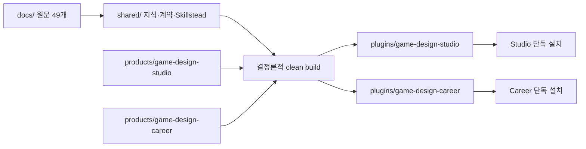
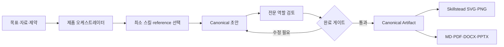

# Game Design Plugin Suite

Game Design Plugin Suite는 전문 게임 기획을 두 개의 독립 Codex 플러그인으로 제공합니다.

- **Game Design Studio**는 게임 비전, 시스템, 콘텐츠, UX, 경제·LiveOps, 제작 계획, 검토를 다룹니다.
- **Game Design Career**는 진로 탐색, 채용 조사, 역기획, 포트폴리오, 면접, 주니어 성장을 다룹니다.

두 플러그인은 `docs/`의 한국어 게임 기획 문서 49개, 검토된 Core 지식, 2026년 8월 4일 기준 Current 근거, 책임 있는 설계 게이트, Canonical Artifact, Skillstead 도식화, 문서 내보내기 계약을 공유합니다. 빌드 결과는 공통 파일을 각 패키지에 복제하므로 한 제품만 설치해도 다른 플러그인이나 저장소 원천에 의존하지 않습니다.

> 이 도구는 기획 판단과 근거 관리를 돕습니다. 흥행, 매출, 채용 합격, 법률 준수 또는 플랫폼 승인을 보장하지 않습니다.

## 어떤 플러그인을 설치할까

| 구분 | Game Design Studio | Game Design Career |
| --- | --- | --- |
| 주요 사용자 | 현업·인디 게임 기획자, 프로듀서, 개발팀 | 입문자, 취업 준비생, 주니어, 이직 준비자 |
| 대표 작업 | GDD, 규칙·상태, 콘텐츠, UI/UX, 경제, LiveOps, 범위·리스크 | 역할 맵, 채용 근거, 역기획, 포트폴리오, 면접, 성장 계획 |
| 제품 스킬 | 10개 | 10개 |
| 전문 역할 프롬프트 | 6개 | 6개 |
| Canonical Artifact 템플릿 | 15개 | 15개 |
| 제품 프로필 | `universal-core`, `live-service-rpg`, `mobile`, `pc-console` | 경력 단계 `entry`, `new-hire`, `junior-growth`, `transition` |
| 도식화 | 게임 루프, 상태, 경제, 콘텐츠, LiveOps, 의존성 | 역량 맵, 학습·경력 로드맵, 포트폴리오 구조 |
| 권장 선택 | 실제 게임을 설계·검토·운영할 때 | 게임 기획 역량과 경력 증거를 만들 때 |

두 목적이 모두 필요하면 둘 다 설치할 수 있습니다. 설치 상태와 실행 문맥은 서로 독립적입니다.

자세한 제품별 카탈로그는 [Studio 문서](plugins/game-design-studio/README.md)와 [Career 문서](plugins/game-design-career/README.md)를 참고하십시오.

## 전체 구조



```text
game-design-plugin-suite/
├── .agents/plugins/marketplace.json   # game-design-suite 로컬 marketplace
├── docs/                              # 원문 49개, 설계·아키텍처 문서
├── shared/                            # 두 제품이 공유하는 편집 원천
│   ├── knowledge/                     # Core, Current, 원문 인덱스와 정책
│   ├── responsible-design/            # 7개 책임 게이트
│   ├── export/                        # 스키마, 테마, 형식별 QA 계약
│   ├── hooks/ 및 scripts/             # capability probe, one-retry review
│   ├── templates/                     # 공통 Canonical Artifact 원형
│   └── vendor/skillstead/             # svg-infographic 0.8.3 잠금 원본
├── products/
│   ├── game-design-studio/plugin/     # Studio 전용 편집 원천
│   └── game-design-career/plugin/     # Career 전용 편집 원천
├── tooling/                           # 인덱스, 감사, 빌드, 검증, smoke
├── tests/                             # unit, contract, product, E2E, format, isolation
└── plugins/
    ├── game-design-studio/            # 독립 설치 가능한 생성 스냅샷
    └── game-design-career/            # 독립 설치 가능한 생성 스냅샷
```

`shared/`와 `products/`가 편집 원천입니다. `plugins/`는 `npm run build`가 재생성하는 배포 스냅샷이므로 직접 수정하지 마십시오. 자세한 경계와 구성 요소는 [플러그인 스위트 아키텍처](architecture/plugin-suite.md)에 있습니다.

## 요구 사항

- Codex CLI의 plugin 명령을 지원하는 버전
- Node.js 18 이상
- 로컬 설치에는 이 저장소 checkout과 `.agents/plugins/marketplace.json`
- PDF·DOCX·PPTX·PNG 생성에는 해당 renderer capability가 필요합니다. capability가 없으면 Canonical MD를 보존하고 누락 형식을 명시합니다.

현재 저장소가 사용하는 명령 문법은 Codex CLI `0.146.0`의 `codex plugin ... --help`와 repository smoke test로 확인했습니다.

## 설치

저장소 루트에서 로컬 marketplace를 등록합니다.

```bash
codex plugin marketplace add .
```

marketplace 이름 `game-design-suite`와 설치 가능한 제품을 확인합니다.

```bash
codex plugin marketplace list
codex plugin list
```

필요한 플러그인만 설치합니다.

```bash
codex plugin add game-design-studio@game-design-suite
codex plugin add game-design-career@game-design-suite
```

한 제품만 필요하면 나머지 `plugin add` 명령은 실행하지 마십시오. 설치 후 새 Codex 작업을 시작하면 새 스킬과 hook을 확실하게 로드할 수 있습니다.

`products/.../plugin`이나 `plugins/...` 경로를 `codex plugin add`에 직접 전달하지 마십시오. `plugin add`는 등록된 marketplace의 플러그인 선택자를 받습니다.

## 업데이트

로컬 marketplace는 Git snapshot을 자동으로 fetch하지 않습니다. 저장소를 갱신하고 배포 스냅샷을 검증한 뒤 설치한 제품을 재설치합니다.

```bash
npm run build
npm run validate
codex plugin remove game-design-studio@game-design-suite
codex plugin add game-design-studio@game-design-suite
```

Career도 같은 방식으로 `game-design-career@game-design-suite`를 제거한 뒤 다시 추가합니다. Git marketplace로 등록한 환경에서는 먼저 다음 명령으로 marketplace snapshot을 갱신할 수 있습니다.

```bash
codex plugin marketplace upgrade game-design-suite
```

## 제거

플러그인은 서로 독립적으로 제거합니다.

```bash
codex plugin remove game-design-studio@game-design-suite
codex plugin remove game-design-career@game-design-suite
```

두 제품을 모두 제거했고 이 marketplace를 더 이상 사용하지 않을 때만 marketplace 등록도 제거합니다.

```bash
codex plugin marketplace remove game-design-suite
```

## 실행 모델



오케스트레이터는 요청 전체를 모든 스킬에 보내지 않습니다. 필요한 최소 체인을 선택하고, 복합 검토에만 최대 3개 역할을 사용합니다. 호스트가 병렬 서브에이전트를 지원하면 서로 독립적인 검토를 병렬 실행하고, 지원하지 않으면 같은 역할·질문·정렬 규칙으로 순차 실행합니다.

`agents/*.md`는 스킬이 역할 검토에 전달하는 **이식 가능한 역할 프롬프트 자산**입니다. 플러그인 설치만으로 네이티브 에이전트 자동 발견이나 별도 프로세스 실행을 보장하지 않습니다. 병렬 실행은 성능 최적화이며, 순차 fallback도 같은 검토 계약과 결과 병합 규칙을 사용합니다.

### Hooks와 scripts

각 독립 패키지에는 같은 두 hook과 세 shared runtime script가 있습니다.

| 경로 | 역할 |
| --- | --- |
| `hooks/hooks.json`의 `SessionStart` | Node, Chromium, LibreOffice와 문서 renderer capability를 읽기 전용 점검 |
| `hooks/hooks.json`의 `Stop` | active Canonical Artifact에 한해 최대 한 번 추가 검토를 요청 |
| `scripts/capability-probe.mjs` | 사용할 수 있는 선택 capability 보고 |
| `scripts/stop-artifact-review.mjs` | 재진입을 차단하는 one-retry review |
| `scripts/validate-artifact.mjs` | Canonical Artifact 구조·근거·내보내기 계약 검증 |

제품별 helper는 각 `skills/<skill-id>/scripts/`에 있습니다. Studio는 프로필 합성, 역할 병합, 공개 재배포 가드, 시각화와 export 검증을 포함하고, Career는 역할 병합, 채용 근거, 경력 시나리오, 시각화와 export 검증을 포함합니다.

## 스킬 카탈로그

각 제품은 제품 스킬 10개와 vendored `svg-infographic` 1개, 총 11개 스킬을 포함합니다.

### Game Design Studio

| 스킬 | 핵심 작업 |
| --- | --- |
| `orchestrate-game-design-project` | 요청 정규화, 프로필 합성, 최소 워크플로, 완료 게이트 |
| `define-game-vision` | 목표 플레이어, 의도 경험, pillars, core/motivation loop |
| `design-game-systems` | 규칙, 상태, 우선순위, 예외, 데이터 계약 |
| `design-game-content` | 퀘스트, 레벨, 인카운터, 캐릭터, 적, 내러티브 단위 |
| `design-player-experience` | UI/UX 흐름, 온보딩, 입력, 접근성 |
| `design-game-economy-and-liveops` | source/sink, 확률·가격 투명성, 이벤트, 실험, 롤백 |
| `plan-game-production` | 프로토타입, 범위, 마일스톤, 위험, 중단 기준 |
| `review-game-design` | 근거·모순·실행 가능성·책임 게이트 검토 |
| `visualize-game-design` | 게임 기획 구조를 Skillstead SVG/2× PNG로 도식화 |
| `export-game-design-documents` | MD/PDF/DOCX/PPTX 파생본과 QA manifest |

### Game Design Career

| 스킬 | 핵심 작업 |
| --- | --- |
| `orchestrate-game-design-career` | 경력 단계, 목표, 자료, 제약과 완료 조건 정규화 |
| `map-game-design-career` | 역할군, 교환조건, 역량 공백과 증거 과제 비교 |
| `research-game-design-jobs` | 현재 공식 채용 근거와 표본 한계 조사 |
| `build-game-design-portfolio` | 주장-근거 색인, 기여도, 포트폴리오 사례 구성 |
| `reverse-engineer-game-design` | 관찰·사실·추론·대안·반증을 분리한 역기획 |
| `practice-game-design-interview` | 공고·포트폴리오 근거에 연결된 면접 연습 |
| `review-game-design-portfolio` | 5축 관찰 상태와 최소 수정 큐 |
| `plan-junior-growth` | 분기 증거 프로젝트, 피드백, 이직 준비도 |
| `visualize-career-roadmap` | 역량·학습·경력·포트폴리오를 Skillstead로 도식화 |
| `export-career-documents` | MD/PDF/DOCX/PPTX 파생본과 QA manifest |

`svg-infographic`은 [kyungseo/skillstead](https://github.com/kyungseo/skillstead)의 0.8.3 원본을 양쪽 패키지에 고정한 공통 스킬입니다.

## 전문 역할

| Studio 역할 | 검토 책임 | Career 역할 | 검토 책임 |
| --- | --- | --- | --- |
| `lead-game-designer` | 의도 경험, core loop, scope coherence | `career-strategist` | 복수 경로와 교환조건 |
| `system-economy-designer` | 규칙·상태·데이터·경제 투명성 | `game-design-mentor` | 연습과 검토 가능한 기획 증거 |
| `content-narrative-designer` | 콘텐츠 목적·의존·내러티브·권리 | `portfolio-reviewer` | 주장·기여·근거 위치 |
| `ux-accessibility-reviewer` | critical path, 입력, 상태, 접근성 | `reverse-design-critic` | 관찰·추론·반증 경로 |
| `liveops-data-designer` | 가설, 대조군, 지표, 가드레일, 롤백 | `interview-coach` | 사실 기반 답변과 성찰 |
| `production-feasibility-critic` | 의존성, 일정, 프로토타입, kill criteria | `evidence-auditor` | 출처, 최신성, 범위, 일반화 한계 |

역할 프롬프트는 기준 산출물 전체를 임의로 다시 쓰거나 자신의 책임 밖 게이트를 승인하지 않습니다. finding은 source ID, severity, evidence, impact, affected section, assumptions와 최소 수정안을 유지합니다.

## 지식과 근거

두 패키지는 같은 49개 원문을 `references/source/docs/`에 포함합니다.

| 범주 | 문서 수 |
| --- | ---: |
| 경력·취업 | 13 |
| 재미·기획 의도 | 10 |
| 시스템 기획 | 13 |
| 콘텐츠 기획 | 10 |
| 기획서 피드백 | 3 |

지식은 세 층으로 분리합니다.

1. **Core**: 원문 중 중복을 제거하고 적용 한계를 표시한 안정적 원칙
2. **Source**: 사례와 맥락을 확인하는 사용자 제공 원문 49개
3. **Current**: 정책, 플랫폼, 접근성, AI 권리, 경제·LiveOps, UGC, 시장처럼 시점 의존적인 공식 근거

Current register는 2026년 8월 4일에 검토한 1차 출처 14개를 기록합니다. 이 날짜는 최신성의 상한이지 영구 보증이 아닙니다. 각 주장에는 검색일, 적용 지역, 한계, 재검토 시점과 충돌 상태를 남기며, 새 1차 근거가 로컬 문서와 충돌하면 충돌을 숨기지 않고 최신 근거를 우선합니다.

원문 49개는 플러그인 MIT License로 재허가되지 않았고 공개 재배포 권리도 확립되지 않았습니다. 로컬·사설 사용 범위를 벗어난 배포 전에는 문서별 권리 근거를 확인해야 합니다. Studio 패키지는 [권리 매니페스트](plugins/game-design-studio/references/source-document-rights.json)와 공개 재배포 fail-closed 가드를 포함합니다. 자세한 정책은 [지식·근거 아키텍처](architecture/knowledge-and-evidence.md)를 참고하십시오.

## Canonical Artifact

모든 주요 결과는 하나의 기준 원본 패키지로 관리합니다.

```text
artifact-name/
├── content.md             # 유일한 내용 기준
├── evidence.yml           # 주장, 출처, 한계, 최신성
├── decisions/             # 선택, 대안, 부작용, 승인
├── assets/                # 도식·이미지, alt text, 권리
└── export-manifest.yml    # 청중, 목적, 형식, QA 상태
```

도식화나 특정 renderer가 실패해도 Canonical Artifact와 이미 검증된 출력을 덮어쓰지 않습니다.

## 도식화

제품 wrapper는 포함된 Skillstead `svg-infographic` 0.8.3을 사용해 게임 기획용 preset을 선택합니다. SVG는 편집 가능한 기준 자산이고, PNG는 Chromium 2× 렌더 후 정확한 크기와 픽셀 상태를 검증한 파생본입니다.

- Studio: core/motivation loop, 상태·규칙 흐름, 퀘스트·콘텐츠 진행, 경제 source/sink, LiveOps 로드맵, 제작 의존성
- Career: 역량 맵, 12주 학습 로드맵, 포트폴리오 정보 구조, 경력 의사결정과 피드백 루프

브라우저 renderer가 없거나 SVG lint가 실패하면 편집 가능한 SVG와 미검증 상태만 제공하며 PNG 성공을 보고하지 않습니다. 대표 검증 fixture는 [Studio 시각화](tests/formats/output/studio-live-service-rpg-economy/visualization.svg)와 [Career 시각화](tests/formats/output/career-entry-12-week-roadmap/visualization.svg)입니다.

## 문서 내보내기

| 형식 | 생성 의미 | 성공 조건 |
| --- | --- | --- |
| MD | Canonical content의 휴대 가능한 파생본 | frontmatter, H1, 링크, 로컬 자산, Unicode 검증 |
| PDF | 공유·검토용 고정 레이아웃 | 서명, 텍스트 추출, 페이지 수, 폰트와 전 페이지 렌더 QA |
| DOCX | 편집 가능한 Office 문서 | OOXML·relationship, 의미 비교, 전 페이지 렌더 QA |
| PPTX | 청중별 발표 스토리 | 독립 outline, notes 출처, overflow, 전 슬라이드 렌더 QA |
| SVG | 편집 가능한 도식 기준 | Skillstead lint, 접근성 텍스트, source mapping |
| PNG | 공유용 raster 도식 | SVG 기준 2× 렌더, 정확한 크기, 픽셀 QA |

MD/PDF/DOCX/PPTX는 문서 export lane, SVG/PNG는 시각화 lane입니다. 요청 목록에는 함께 기록할 수 있지만 PNG를 문서 renderer 결과로 취급하지 않습니다. 자세한 변환과 fail-closed 조건은 [내보내기 파이프라인](architecture/export-pipeline.md)에 있습니다.

## 사용 예시

설치 후 자연어로 요청하거나, 명확한 라우팅이 필요하면 플러그인 접두사가 붙은 오케스트레이터 스킬을 지정합니다.

### Studio: 라이브 서비스 RPG 경제

> 일일 미션에서 소프트 재화를 얻고 업그레이드에 쓰는 경제를 설계해 줘. 목표 보유량은 5,000이야. source/sink, 공개 확률, 인플레이션 가드레일, 실험 가설, 자동 롤백을 Canonical Artifact와 경제 흐름 SVG로 만들고 MD/PDF/DOCX/PPTX로 내보내 줘.

명시적 진입점은 `$game-design-studio:orchestrate-game-design-project`입니다.

### Studio: 시스템 명세 검토

> 이 전투 규칙 문서를 상태 전이, 우선순위, 동시성, 예외, 서버 권위, 데이터 테이블과 테스트 케이스 관점에서 검토해. 추정한 값은 승인된 사실과 분리해 줘.

### Career: 12주 입문 로드맵

> 시스템 기획과 콘텐츠 기획 중 목표가 아직 정해지지 않았어. 주 8시간, 솔로 프로토타입만 가능해. 두 경로의 교환조건과 공백을 비교하고 12주 증거 로드맵, 역량 SVG, MD/PDF/DOCX/PPTX를 만들어 줘.

명시적 진입점은 `$game-design-career:orchestrate-game-design-career`입니다.

### Career: 현재 채용 근거

> 한국 주니어 시스템 기획 공고를 회사 공식 채용 페이지에서 조사해. 공고별 사실과 반복 신호를 분리하고 게시일, 검색일, 표본 크기, 지역, blind spot과 일반화 한계를 기록해 줘.

## 책임 있는 설계 게이트

적용 가능한 항목은 `not-applicable`, `pending`, `blocked`, `approved` 중 하나로 기록합니다.

- AI 권리·동의와 인간 승인
- 접근성
- 경제·확률·가상 화폐 투명성
- LiveOps 실험과 롤백
- UGC 안전, 신고와 이의제기
- AI NPC 행동·기억·fallback 안전
- 범위·비용·책임자 통제

플러그인은 근거 없는 수치, 지원자 경력, 기여, 구현 상태, 승인 또는 테스트 결과를 채우지 않습니다.

## 검증

저장소 루트에서 실행합니다. 외부 npm 의존성이 없으므로 별도 `npm install` 단계가 없습니다.

```bash
npm test
npm run validate
node tests/formats/verify-formats.mjs tests/formats/output
npm run validate:release
```

- `npm test`: unit, contract, product와 대표 E2E를 실행합니다.
- `npm run validate`: reference drift, evidence, vendor hash, 전체 테스트, clean build drift, 공식 package·skill validator, isolation smoke, 준비된 format smoke를 실행합니다.
- `node tests/formats/verify-formats.mjs tests/formats/output`: 대표 Studio·Career 산출물의 형식 검증을 실행합니다.
- `npm run validate:release`: `FORMAT-RESULTS.md`와 대표 출력까지 준비된 상태에서만 release-ready로 종료합니다.
- `npm run smoke:marketplace`: 임시 격리 환경에서 각 제품의 marketplace 등록, 설치, 실제 설치 스킬 호출 증거, 제거와 정리를 검증합니다. 로컬 Codex 인증과 실행 시간이 필요하므로 일반 빠른 검증과 분리했습니다.

## 문제 해결

### 플러그인이 목록에 없다

저장소 루트에서 marketplace를 등록했는지와 manifest를 확인합니다.

```bash
codex plugin marketplace list
codex plugin list
```

`game-design-suite`가 없으면 `codex plugin marketplace add .`를 다시 실행합니다. 설치 후에는 새 Codex 작업을 시작합니다.

### 생성 스냅샷 drift가 발생한다

`plugins/`를 직접 고치지 말고 원천을 수정한 뒤 다시 빌드합니다.

```bash
npm run build
npm run validate
```

### PDF, DOCX, PPTX 또는 PNG가 생성되지 않는다

이 동작은 renderer 부재나 QA 실패 시 의도적으로 fail-closed 합니다. Canonical Artifact의 `export-manifest.yml`에서 capability와 실패 원인을 확인하고, renderer를 복구한 뒤 해당 형식을 다시 요청하십시오. 미검증 파일을 성공 결과로 간주하지 마십시오.

### 최신 주장에 출처가 없다

정책, 채용, 시장, 플랫폼, 법률·규제, 가격·확률, 도구 버전은 로컬 원문만으로 확정하지 않습니다. `references/shared/knowledge/trends/source-register.json`에 적용 가능한 최신 1차 출처와 검색일·지역·한계를 기록한 뒤 다시 검토합니다.

## 기여 워크플로

1. 공통 변경은 `shared/`, 제품 변경은 해당 `products/<product>/plugin/`에서 편집합니다.
2. 원문을 추가하거나 바꾸면 reference index와 권리·provenance 상태를 갱신합니다.
3. Skillstead를 갱신하면 upstream 버전, 라이선스, 파일별 hash lock과 wrapper 호환성을 함께 검증합니다.
4. `npm test`와 `npm run validate`를 통과시킵니다.
5. `npm run build`로 두 스냅샷을 clean build하고 drift를 다시 검사합니다.
6. 문서 또는 renderer 동작을 바꿨다면 두 제품의 MD/PDF/DOCX/PPTX/SVG/PNG 대표 fixture와 시각 QA를 갱신합니다.

## 라이선스와 제한

- 프로젝트가 작성한 코드, 템플릿, 설정과 문서는 각 패키지의 MIT License를 따릅니다.
- vendored Skillstead `svg-infographic` 0.8.3은 Apache-2.0이며 upstream 라이선스와 제3자 고지를 유지합니다.
- 사용자 제공 원문 49개와 포함된 제3자 자료는 MIT License 대상이 아니며 각 권리자에게 권리가 남습니다.
- 별도 MCP 서버, 영속 데이터베이스, 웹 협업 서비스 또는 외부 SaaS는 v1 범위가 아닙니다.
- Current 근거는 검토 스냅샷입니다. 사용 시점에 정책·시장·규제·도구 변경 여부를 다시 확인해야 합니다.
- 전문 역할, 도식화, 형식 변환은 인간 책임자와 실제 플레이테스트·접근성 테스트·법무·플랫폼 검토를 대체하지 않습니다.

각 제품의 고지는 [Studio THIRD_PARTY_NOTICES](plugins/game-design-studio/THIRD_PARTY_NOTICES.md)와 [Career THIRD_PARTY_NOTICES](plugins/game-design-career/THIRD_PARTY_NOTICES.md)를 확인하십시오.

## 상세 문서

- [플러그인 스위트 아키텍처](architecture/plugin-suite.md)
- [내보내기 파이프라인](architecture/export-pipeline.md)
- [지식·근거 아키텍처](architecture/knowledge-and-evidence.md)
- [Game Design Studio](plugins/game-design-studio/README.md)
- [Game Design Career](plugins/game-design-career/README.md)
