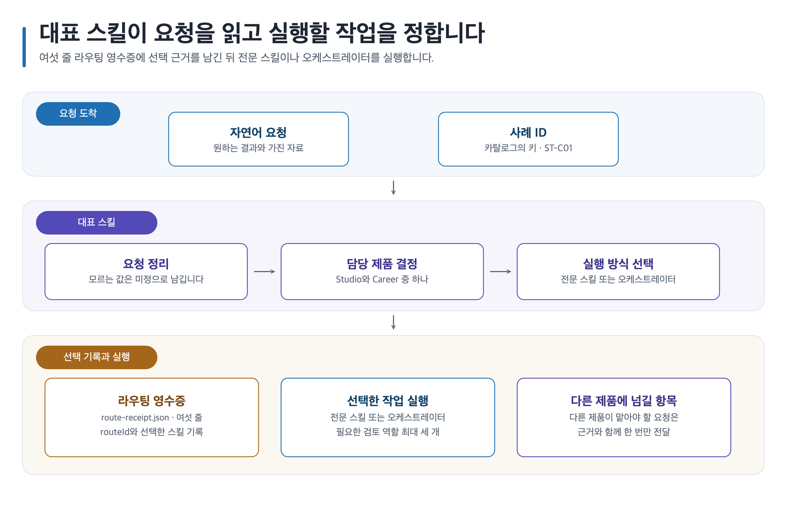
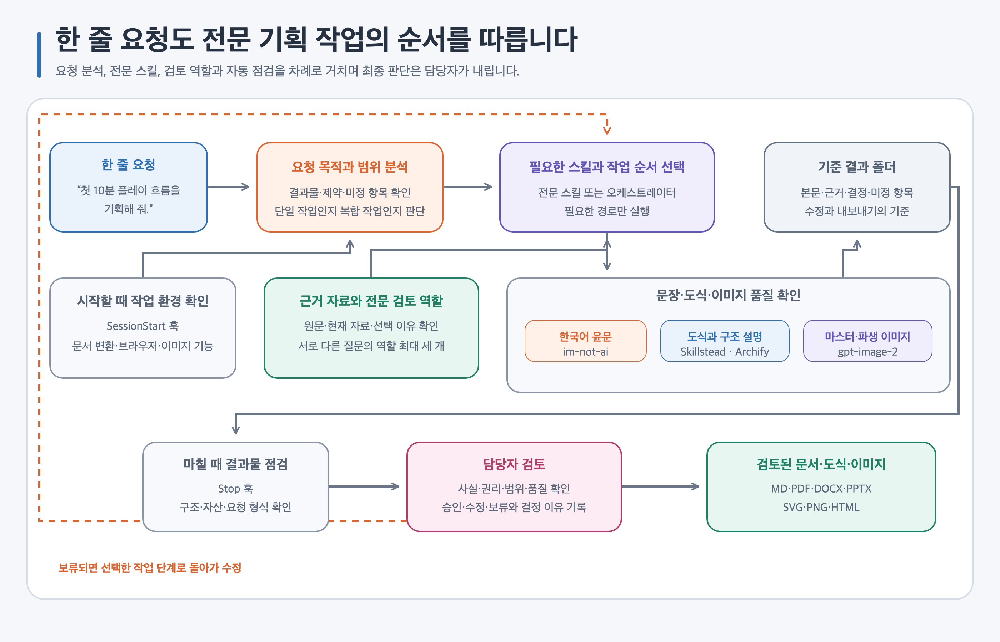
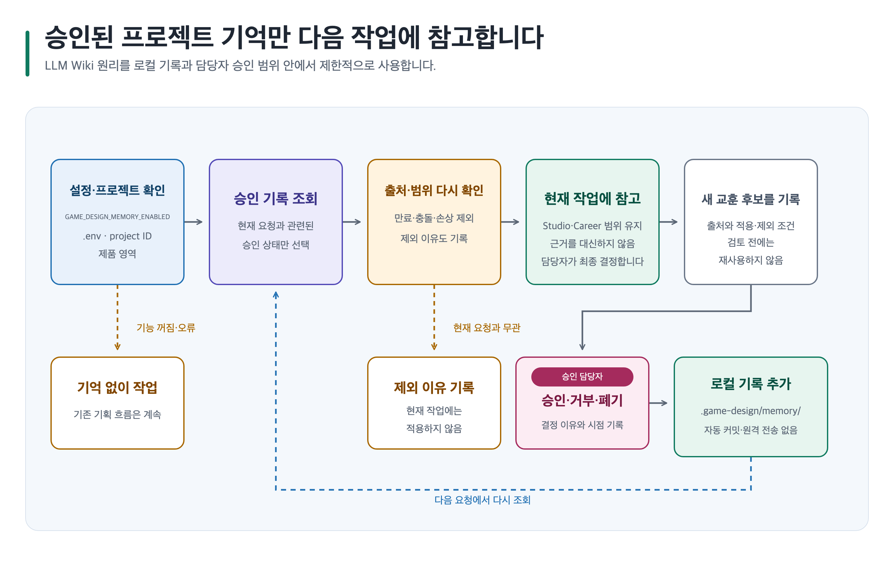
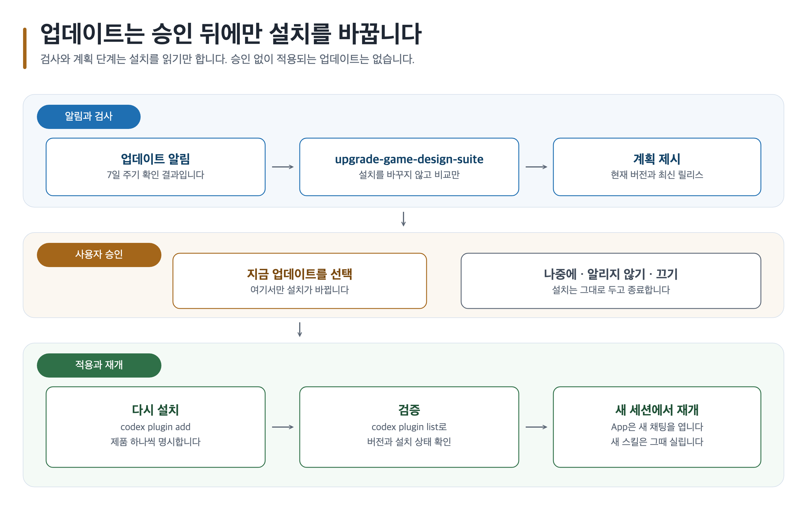
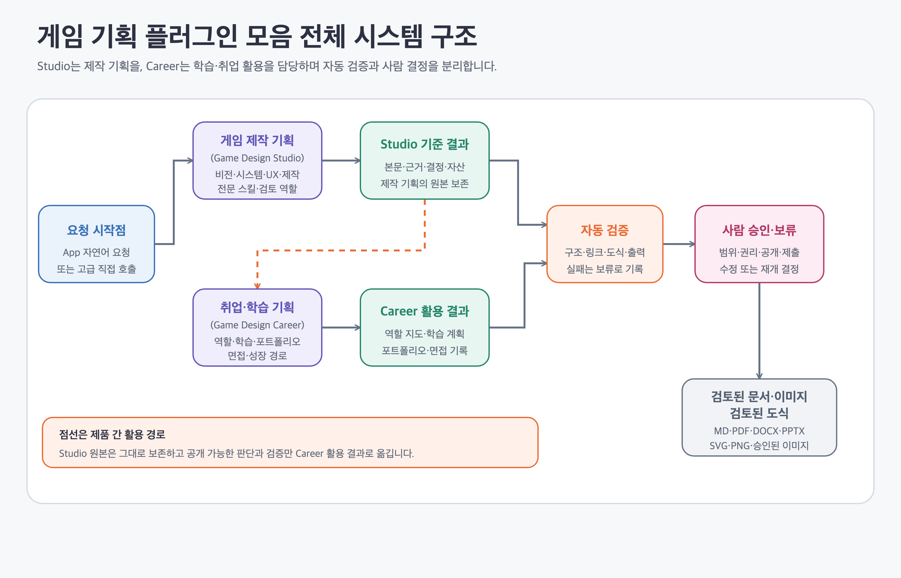

<a id="top"></a>

<div align="center">
<h1>게임 기획 플러그인 모음</h1>
<p><strong>Game Design Plugin Suite</strong><br>게임 아이디어는 전문 기획 문서로, 취업 목표는 학습·포트폴리오·면접 계획으로 구체화하는 Codex 플러그인 모음</p>
<p><strong>Game Design Studio</strong>는 아이디어를 실제 제작 과정에서 검토할 수 있는 전문 게임 기획으로 발전시킵니다. 게임의 방향과 핵심 재미를 정하고 시스템·콘텐츠·UX·경제·LiveOps·제작 범위를 구체화한 뒤, 기획 검토 문서까지 작성합니다.<br><strong>Game Design Career</strong>는 게임 기획 취업 준비생과 주니어 기획자, 직무 전환자를 위한 취업·성장 준비 플러그인입니다. 목표 직무와 채용 공고의 요구 역량을 확인하고, 현재 경험에서 보완할 부분을 찾아 역기획·학습 계획·포트폴리오·면접 준비 자료로 정리합니다.</p>
<p>
  <a href="https://github.com/freelife1191/gamedesign-plugin/releases/latest"></a>
  <a href="https://github.com/freelife1191/gamedesign-plugin/actions/workflows/release-notes.yml"></a>
  <a href="https://github.com/freelife1191/gamedesign-plugin/blob/main/LICENSE"></a>
  <a href="#1분-설치"></a>
</p>
<p><strong>2개 제품 · 설치 스킬 51개 · 전문 에이전트 22개 · 결과 템플릿 15종</strong></p>
<p><a href="#game-design-studio"><code>Game Design Studio</code></a> · <a href="#game-design-career"><code>Game Design Career</code></a> · <a href="#대표업데이트핵심-스킬"><code>대표 스킬</code></a> · <a href="#대표업데이트핵심-스킬"><code>업데이트 스킬</code></a> · <a href="#전체-아키텍처-바로보기"><code>Skillstead</code></a> · <a href="#전체-아키텍처-바로보기"><code>Archify</code></a></p>
<p><a href="#1분-설치"><strong>1분 설치</strong></a> · <a href="#대표업데이트핵심-스킬"><strong>대표 스킬 사용법</strong></a> · <a href="#전체-아키텍처-바로보기"><strong>전체 아키텍처</strong></a> · <a href="#상세-가이드에서-더-알아보기"><strong>상세 가이드</strong></a></p>
</div>

**두 핵심 플러그인 바로보기**

| 핵심 플러그인 | 이런 작업에 적합합니다 | 주요 작업·구성 | 바로가기 |
| --- | --- | --- | --- |
| 🎮 **Game Design Studio** | 게임 아이디어를 전문 기획으로 구체화하려는 학생·인디 개발자·현업 기획자·팀 리드 | 비전·시스템·콘텐츠·UX·경제·제작 검토<br>설치 스킬 26개·전문 에이전트 12개·복합 작업 조율 | [제품 상세 설명](products/game-design-studio/plugin/README.md) · [사용자 가이드](guides/game-design-studio/README.md) · [5분 빠른 시작](guides/game-design-studio/quick-start.md) |
| 🎓 **Game Design Career** | 게임 기획 취업 준비생·주니어 기획자·직무 전환자와 이를 돕는 멘토 | 직무 탐색·채용 공고 분석, 역기획, 학습·포트폴리오·면접 준비<br>설치 스킬 25개·전문 에이전트 10개·복합 작업 조율 | [제품 상세 설명](products/game-design-career/plugin/README.md) · [사용자 가이드](guides/game-design-career/README.md) · [5분 빠른 시작](guides/game-design-career/quick-start.md) |

**한눈에 보는 핵심 구성**

- **요청 분석과 작업 조율** — 한 줄 요청을 분석해 전문 스킬 또는 오케스트레이터를 고릅니다. 여러 분야가 얽히면 작업 순서를 정하고 필요한 전문 에이전트만 최대 세 개까지 검토에 참여시킵니다.
- **근거와 프로젝트 기억** — 레퍼런스 49편과 최근 확인한 1차 자료 16건을 사실·추론·가정으로 나눕니다. LLM Wiki 원리를 적용한 승인 기반 프로젝트 기억으로 검토된 기록만 다시 사용합니다.
- **이미지 제작** — image_gen 우선·승인 후 gpt-image-2 선택 원칙을 지킵니다. 자산 ID·배치·대체 텍스트·권리 상태를 먼저 정하고, 생성 결과는 담당자가 검토합니다.
- **도식과 아키텍처** — Skillstead SVG·PNG와 Archify HTML로 흐름과 관계를 설명합니다. SVG는 직접 편집하고, Archify에서는 전체 구조의 연결 관계를 따라가며 살펴봅니다.
- **한국어 문서 품질** — im-not-ai 한국어 검증과 MD·PDF·DOCX·PPTX 출력을 함께 다룹니다. 문장을 다듬은 뒤에도 사실·수치·식별자·승인 상태가 바뀌지 않았는지 다시 확인합니다.
- **검토 가능한 결과물** — 본문, 근거, 선택 이유, 이미지와 출력 상태를 하나의 기준 결과 폴더에 보존합니다. 자동 검증 뒤에도 최종 승인·수정·보류는 담당자가 결정합니다.

> [!TIP]
> 스킬 이름을 몰라도 괜찮습니다. `@Game Design Studio` 또는 `@Game Design Career` 뒤에 만들고 싶은 결과를 한 문장으로 적으면 대표 스킬이 실행 경로를 고릅니다.

<details>
<summary><strong>📑 목차 열기</strong></summary>

1. [🚀 빠른 시작](#-빠른-시작)
   - [1분 설치](#1분-설치)
   - [대표·업데이트·핵심 스킬](#대표업데이트핵심-스킬)
   - [한 문장으로 시작하기](#한-문장으로-시작하기)
   - [전체 아키텍처 바로보기](#전체-아키텍처-바로보기)
2. [🧭 제품 이해와 시작](#-제품-이해와-시작)
   - [플러그인 소개](#플러그인-소개)
   - [30초 안에 플러그인 선택하기](#30초-안에-플러그인-선택하기)
   - [설치하기](#설치하기)
   - [5분 안에 첫 결과 만들기](#5분-안에-첫-결과-만들기)
3. [🧰 활용 사례와 스킬](#-활용-사례와-스킬)
   - [케이스별 프롬프트로 시작하기](#케이스별-프롬프트로-시작하기)
   - [스킬별로 바로 실행하기](#스킬별로-바로-실행하기)
4. [🏗️ 아키텍처와 결과물](#️-아키텍처와-결과물)
   - [요청 뒤에 생성되는 결과물](#요청-뒤에-생성되는-결과물)
   - [플러그인 구조와 전체 시스템 아키텍처](#플러그인-구조와-전체-시스템-아키텍처)
   - [이미지·도식·문서 내보내기](#이미지도식문서-내보내기)
5. [📚 운영과 참고](#-운영과-참고)
   - [상세 가이드에서 더 알아보기](#상세-가이드에서-더-알아보기)
   - [안전·권리·담당자 승인 경계](#안전권리담당자-승인-경계)
   - [문제를 해결하고 작업 재개하기](#문제를-해결하고-작업-재개하기)
   - [기술 문서·기여·라이선스](#기술-문서기여라이선스)

</details>

---

## 🚀 빠른 시작

### 1분 설치

공개 GitHub 마켓플레이스를 등록한 뒤 필요한 제품만 설치하세요.

```bash
codex plugin marketplace add freelife1191/gamedesign-plugin

# 게임 제작 기획
codex plugin add game-design-studio@game-design-suite

# 취업·학습 준비
codex plugin add game-design-career@game-design-suite

codex plugin list
```

설치가 끝나면 새 채팅이나 새 CLI 세션을 시작합니다. App·Windows·로컬 checkout 절차는 [설치하기](#설치하기)에서 확인하세요.

[](guides/assets/shared/plugin-selection-flow.svg)

Studio와 Career는 필요한 제품만 따로 설치합니다. 제작 기획과 취업 준비를 연결할 때만 두 제품을 함께 설치하세요.

---

### 대표·업데이트·핵심 스킬

| 하려는 일 | Studio | Career | 처리 방식 |
| --- | --- | --- | --- |
| 무엇을 써야 할지 모를 때 | `game-design-studio` | `game-design-career` | 요청을 읽고 제품·경로·결과물과 남은 결정을 먼저 정리 |
| 여러 작업을 함께 조율할 때 | `orchestrate-game-design-project` | `orchestrate-game-design-career` | 필요한 전문 스킬과 검토 역할만 순서대로 연결 |
| 방향부터 잡을 때 | `define-game-vision` | `map-game-design-career` | 핵심 재미 또는 목표 직무와 현재 역량부터 정리 |
| 근거 있는 상세 작업이 필요할 때 | `design-game-systems` | `research-game-design-jobs` | 규칙·상태·예외를 명세하거나 최신 공개 채용 공고의 요구사항을 조사 |
| 결과를 검토·활용할 때 | `review-game-design` | `build-game-design-portfolio` | 기획 결과를 검토하거나 검토된 경험을 공개 가능한 사례로 구성 |
| 설치본과 최신 공개 릴리스를 비교할 때 | `upgrade-game-design-suite` | `upgrade-game-design-suite` | 버전과 변경 내용을 비교하고 승인 뒤에만 업데이트 |

대표 스킬은 선택한 제품·경로·결과물과 사용자가 결정할 항목을 먼저 알려 줍니다. 설치본 업데이트는 사용자가 승인한 뒤에만 진행합니다.

---

### 한 문장으로 시작하기

```text
@Game Design Studio 4인 협동 RPG의 핵심 재미와 첫 10분 플레이 흐름을 정리해 줘.

@Game Design Career 시스템 기획 취업을 위해 지금 가진 경험과 12주 준비 계획을 정리해 줘.

Studio에서 검토한 전투 시스템 기획을 Career 포트폴리오 사례와 면접 준비로 연결해 줘.
```

모르는 정보는 `미정`으로 남겨도 됩니다. 대표 스킬은 한 분야면 전문 스킬을 실행하고, 여러 분야가 얽히면 오케스트레이터에 맡깁니다.

---

### 전체 아키텍처 바로보기

[Archify 전체 플러그인 시스템 구조](guides/assets/archify/suite/suite-plugin-system-architecture.html)에서는 설치부터 대표 스킬의 경로 선택, 전문 스킬·에이전트 검토, 기준 결과물, 한국어 문장 검증과 담당자 승인까지 한 화면에서 확인합니다.

[](guides/assets/shared/suite-entry-routing-flow.svg)

정적인 작업 흐름은 Skillstead SVG·PNG로, 구성 요소의 관계는 Archify HTML로 확인하세요.

전체 처리 순서는 `요청 분석 → 전문 스킬 또는 오케스트레이터 → 필요한 에이전트 검토 → 기준 결과물 → 한국어·도식·이미지 품질 확인 → 담당자 승인`입니다.

[⬆️ TOP](#top)

---

## 🧭 제품 이해와 시작

### 플러그인 소개

Studio와 Career는 이 모음의 핵심 플러그인입니다. Studio는 게임 설계와 제작 검토를, Career는 직무 탐색과 취업 준비를 맡습니다.

<a id="game-design-studio"></a>

#### 🎮 Game Design Studio로 전문 게임 기획하기

Game Design Studio는 한두 문장의 아이디어를 제작 회의와 협업에서 검토할 수 있는 전문 게임 기획으로 구체화합니다. 게임 기획을 배우는 학생, 솔로·인디 개발자, 현업 기획자와 팀 리드가 비전·시스템·콘텐츠·UX·경제·LiveOps·제작 범위를 함께 설계하거나 검토할 때 적합합니다.

| 구성 | 핵심 역할 | 상세 문서 |
| --- | --- | --- |
| 대표 진입 스킬 | `game-design-studio`가 요청의 목적과 범위를 읽고, 한 분야면 전문 스킬을 실행합니다. 여러 분야가 얽히면 오케스트레이터를 부릅니다. | [대표 진입 스킬 설명](guides/game-design-studio/skills/game-design-studio.md) |
| 세부 스킬 | 제품 스킬 17개와 공통 스킬 9개를 합친 설치 스킬 26개가 비전, 시스템, 플레이어 경험, 콘텐츠, 경제, 제작 검토, 이미지·도식과 문서 출력을 맡습니다. | [Studio 스킬 26개](guides/game-design-studio/skills/README.md) |
| 전문 에이전트 | 전문 에이전트 12개가 수석 게임 기획, 시스템·경제, 콘텐츠·내러티브, UX·접근성, 제작 가능성과 이미지 품질을 나눠 검토합니다. 한 요청에는 필요한 역할만 최대 세 개까지 참여합니다. | [Studio 전문 역할](products/game-design-studio/plugin/README.md#전문-역할-프롬프트) |
| 복합 작업 조율(오케스트레이션) | `orchestrate-game-design-project`가 여러 기획 영역의 순서와 결과물, 검토 역할을 정합니다. 에이전트의 의견이 다르면 하나로 덮어쓰지 않고 결정할 항목으로 남깁니다. | [Studio 작업 조율 가이드](guides/game-design-studio/skills/orchestrate-game-design-project.md) |
| 대표 결과 | 게임 기획 요약서, 시스템 명세서, UI·UX 흐름과 상태표, 콘텐츠·내러티브 설계, 경제·밸런스 문서, 제작 범위와 위험 검토서를 만듭니다. | [Studio 결과 템플릿 15개](guides/game-design-studio/templates.md) |

처음이라면 [제품 상세 설명](products/game-design-studio/plugin/README.md) → [사용자 가이드](guides/game-design-studio/README.md) → [5분 빠른 시작](guides/game-design-studio/quick-start.md) → [활용 사례](guides/game-design-studio/use-cases/README.md) 순서로 읽으세요.

```text
@Game Design Studio 모바일 협동 RPG의 대상 플레이어와 핵심 재미,
첫 10분 플레이 흐름, 핵심 시스템과 8주 제작 범위를 함께 정리해 줘.
```

<a id="game-design-career"></a>

#### 🎓 Game Design Career로 게임 기획 취업 준비하기

Game Design Career는 게임 기획 취업 준비생이 목표 직무를 정하고, 현재 경험을 점검해 부족한 역량과 다음 준비 과정을 찾도록 돕습니다. 취업 준비생, 주니어 기획자, 직무 전환자와 멘토가 채용 공고 분석·역기획·학습·포트폴리오·면접·성장 준비를 하나의 계획으로 정리할 때 적합합니다.

| 구성 | 핵심 역할 | 상세 문서 |
| --- | --- | --- |
| 대표 진입 스킬 | `game-design-career`가 목표 직무, 현재 경험과 원하는 결과를 읽고, 한 단계면 전문 스킬을 실행합니다. 여러 준비 단계를 함께 다루면 오케스트레이터를 부릅니다. | [대표 진입 스킬 설명](guides/game-design-career/skills/game-design-career.md) |
| 세부 스킬 | 제품 스킬 16개와 공통 스킬 9개를 합친 설치 스킬 25개가 직무 탐색, 채용 공고 분석, 역량 진단, 역기획, 학습 계획, 포트폴리오, 면접과 성장을 맡습니다. | [Career 스킬 25개](guides/game-design-career/skills/README.md) |
| 전문 에이전트 | 전문 에이전트 10개가 경력 전략, 게임 기획 멘토링, 자료·경험 검증, 역기획 비평, 포트폴리오 검토와 면접 코칭을 나눠 맡습니다. 한 요청에는 필요한 역할만 최대 세 개까지 참여합니다. | [Career 전문 역할](products/game-design-career/plugin/README.md#전문-역할-프롬프트) |
| 복합 작업 조율(오케스트레이션) | `orchestrate-game-design-career`가 직무 탐색·학습·포트폴리오·면접 준비의 순서와 결과물을 정합니다. 실제 경험을 꾸미거나 합격 가능성을 단정하지 않고, 근거가 부족한 항목은 다음 과제로 남깁니다. | [Career 작업 조율 가이드](guides/game-design-career/skills/orchestrate-game-design-career.md) |
| 대표 결과 | 목표 역할 지도, 역량표, 학습 로드맵, 채용 공고 분석표, 역기획 문서, 창작 기획 포트폴리오, 면접 질문·답변 기록, 주니어 성장 계획과 검토 기록을 만듭니다. | [Career 결과 템플릿 15개](guides/game-design-career/templates.md) |

처음이라면 [제품 상세 설명](products/game-design-career/plugin/README.md) → [사용자 가이드](guides/game-design-career/README.md) → [5분 빠른 시작](guides/game-design-career/quick-start.md) → [활용 사례](guides/game-design-career/use-cases/README.md) 순서로 읽으세요.

```text
@Game Design Career 신입 시스템 기획 취업을 목표로 현재 경험을 진단하고,
채용 공고 분석부터 12주 학습·포트폴리오·면접 준비까지 계획해 줘.
```

두 제품은 같은 근거·문서 품질·이미지·도식·출력 계약을 사용하지만 결과 폴더와 승인 기록은 따로 관리합니다. 설계 원칙과 참고 자료는 [전체 사용자 가이드](guides/README.md)와 [지식·근거 아키텍처](architecture/knowledge-and-evidence.md)에서 확인하세요.

#### 짧은 요청이 처리되는 순서

1. 새 세션에서 설치 상태와 사용할 수 있는 기능을 확인합니다.
2. 대표 스킬이 요청의 목적, 범위와 원하는 결과를 읽습니다.
3. 한 분야가 분명하면 전문 스킬로 바로 연결하고, 여러 분야가 얽혔다면 오케스트레이터가 순서를 정합니다.
4. 서로 다른 관점이 필요할 때만 전문 에이전트를 최대 세 개 선택합니다.
5. 본문·근거·결정·자산·출력 상태를 기준 결과 폴더에 함께 보존합니다.
6. 한국어 문장과 도식·이미지·출력 검증을 마친 뒤 담당자가 승인·수정·보류합니다.

[](guides/assets/readme/simple-prompt-design-system.svg)

오케스트레이터와 에이전트는 결론을 자동 승인하지 않습니다. 의견이 엇갈리거나 근거가 부족하면 한쪽을 지우지 않고 사용자가 결정할 항목으로 남깁니다.

#### 참고 자료와 프로젝트 기억

- [원문 49편과 범주 목록](shared/knowledge/reference-index.json): 취업·경력, 재미·기획 의도, 시스템, 콘텐츠와 기획서 피드백 자료를 분류합니다.
- [최근 확인한 1차 자료 16건](shared/knowledge/trends/source-register.json): 플랫폼·시장·정책처럼 바뀔 수 있는 내용의 확인일과 원문을 기록합니다.
- [지식·근거 아키텍처](architecture/knowledge-and-evidence.md): 확인한 사실, 사실에서 나온 추론, 아직 검증하지 않은 가정을 분리합니다.
- [프로젝트 기억 공통 가이드](guides/project-memory.md): 검토와 승인을 마친 기록만 다음 요청에서 다시 쓰는 방법을 설명합니다.

프로젝트 기억은 LLM Wiki의 장기 축적 원리를 게임 기획에 맞게 제한한 기능입니다. 모든 대화나 문서를 자동으로 모으지 않으며, 출처·적용 범위·검토 시점·담당자 결정이 남은 기록만 재사용합니다.

[](guides/assets/shared/project-memory-reuse-flow.svg)

#### 이미지·도식·문서 품질

| 구성 | 하는 일 | 보호하는 경계 |
| --- | --- | --- |
| `image_gen` | 비용이 없는 호스트 이미지 기능을 먼저 사용 | 실패해도 프롬프트와 재개 지점 보존 |
| `gpt-image-2` | 한글 문자나 선택된 고품질 이미지가 필요할 때 사용 | 비용·품질 안내와 사용자 승인 뒤에만 호출 |
| Skillstead | 편집 가능한 SVG와 검증용 PNG 제작 | 의미·글자 크기·왜곡·연결 관계 검사 |
| Archify | 전체 구조와 작업 관계를 탐색하는 HTML 제작 | 원본 명세·공개 HTML·QA 근거 연결 |
| `im-not-ai` | 번역투와 기계적인 한국어 표현을 다듬음 | 사실·수치·식별자·링크·승인 상태 재검증 |
| 문서 내보내기 | MD를 기준으로 PDF·DOCX·PPTX 준비 | 형식별 렌더러와 화면 검수 실패 시 해당 형식만 보류 |

---

### 30초 안에 플러그인 선택하기

| 선택 | 주로 사용하는 사람 | 원하는 결과 | 첫 결과 |
| --- | --- | --- | --- |
| [Studio](#game-design-studio) | 게임 기획을 배우는 학생·현업 기획자·팀 리드 | 재미·규칙·콘텐츠·UX·경제·제작 범위 | 게임 기획 요약서 (`game-design-brief`) |
| [Career](#game-design-career) | 게임 기획 취업 준비생·주니어 기획자·직무 전환자·멘토 | 역할 탐색·학습·역기획·포트폴리오·면접 | 게임 기획 경력 계획 (`game-design-career-plan`) |
| 둘 다 | 검토한 기획을 취업 자료로 발전시킬 사람 | Studio 결과를 Career 사례로 정리 | 제품별 기준 결과 폴더와 인계 기록 |

결정하기 어렵다면 두 제품을 모두 설치하고 원하는 결과만 말하세요. 대표 스킬이 최종 결과를 맡을 제품을 하나 정하고, 필요한 경우에만 다른 제품에 근거를 요청합니다.

---

### 설치하기

Codex App에서는 **Plugins**에서 `game-design-suite`를 열어 Studio 또는 Career를 설치합니다. CLI에서는 [1분 설치](#1분-설치)의 명령을 사용합니다.

공개 릴리스를 따라가려면 GitHub 저장소를 마켓플레이스로 등록합니다. 저장소를 직접 수정하며 사용할 때만 로컬 checkout을 등록하세요.

```bash
# 공개 Git 마켓플레이스
codex plugin marketplace add freelife1191/gamedesign-plugin

# 현재 checkout을 로컬 마켓플레이스로 사용할 때
codex plugin marketplace add .
```

> [!NOTE]
> Windows PowerShell에서 한글이나 공백이 들어간 로컬 경로를 등록할 때는 절대 경로를 따옴표로 감싸세요. 실제 설치·업데이트·선택 제거·전체 제거 절차는 제품별 설치 가이드에 있습니다.

```powershell
$repoRoot = (Resolve-Path .).Path
codex plugin marketplace add "$repoRoot"
codex plugin add game-design-studio@game-design-suite
codex plugin add game-design-career@game-design-suite
codex plugin list
```

- [Studio 설치·업데이트·제거](guides/game-design-studio/installation.md)
- [Career 설치·업데이트·제거](guides/game-design-career/installation.md)
- [Studio 문제 해결](guides/game-design-studio/troubleshooting.md)
- [Career 문제 해결](guides/game-design-career/troubleshooting.md)

최신 공개 릴리스를 확인하려면 설치한 제품의 `upgrade-game-design-suite`를 호출하세요. 비교 단계에서는 설치본을 바꾸지 않습니다.

[](guides/assets/shared/suite-update-approval-flow.svg)

업데이트 스킬은 설치 버전과 최신 공개 릴리스를 나란히 보여 주고 바뀐 제품과 번들 구성 요소를 설명합니다. 사용자가 승인하면 필요한 제품만 다시 적용하고, 설치 상태를 확인한 뒤 새 세션에서 재개합니다.

---

### 5분 안에 첫 결과 만들기

1. Studio 또는 Career에 원하는 결과를 한 문장으로 요청합니다.
2. 대표 스킬이 선택한 경로와 만들 결과를 확인합니다.
3. 생성된 `content.md`와 `evidence.yml`을 읽고 미정·보류 항목을 검토합니다.

| 시작점 | 안내 |
| --- | --- |
| Studio 첫 결과 | [Studio 빠른 시작](guides/game-design-studio/quick-start.md) |
| Career 첫 결과 | [Career 빠른 시작](guides/game-design-career/quick-start.md) |
| Studio 결과를 Career 포트폴리오로 연결 | [제품 간 인계 가이드](guides/prompt-templates/suite/studio-to-career-handoff.md) |

#### Studio에서 게임 기획 요약서 만들기

```text
@Game Design Studio 모바일 협동 RPG의 대상 플레이어와 핵심 재미,
첫 10분 플레이 흐름을 게임 기획 요약서로 정리해 줘.
확인되지 않은 내용은 미정으로 남겨 줘.
```

`content.md`에서 방향과 플레이 흐름을 읽고, `evidence.yml`에서 근거와 미정 항목을 확인합니다.

#### Career에서 12주 준비 계획 만들기

```text
@Game Design Career 시스템 기획 취업을 위해 현재 경험을 정리하고,
12주 동안 만들 역량 증거와 포트폴리오 계획을 작성해 줘.
```

역할 지도, 역량표와 학습 계획을 받은 뒤 본인 또는 멘토가 기간과 증거 수준을 검토합니다.

#### Studio 결과를 Career 포트폴리오로 연결하기

```text
Studio에서 검토한 전투 시스템 기획을 Career 포트폴리오 사례로 정리해 줘.
실제 기여 범위와 공개 권한을 따로 확인할 수 있게 남겨 줘.
```

Studio의 검토 결과는 수정하지 않고, Career가 공개 가능한 내용과 개인 기여를 별도 결과 폴더에 정리합니다. 원본 기획과 공개용 사례는 각각 담당자가 승인합니다.

[⬆️ TOP](#top)

---

## 🧰 활용 사례와 스킬

### 케이스별 프롬프트로 시작하기

| 목적 | 요청 예시 | 자세히 보기 |
| --- | --- | --- |
| 게임 방향과 핵심 재미 | `협동 RPG의 핵심 재미와 첫 10분 흐름을 정리해 줘.` | [Studio 활용 사례](guides/game-design-studio/use-cases/README.md) |
| 플레이 루프와 선택 | `탐색·전투·보상 루프와 플레이어의 선택 지점을 정리해 줘.` | [Studio 활용 사례](guides/game-design-studio/use-cases/README.md) |
| 규칙과 예외 명세 | `전투 규칙과 상태, 실패 조건을 시스템 명세로 정리해 줘.` | [Studio 프롬프트](guides/prompt-templates/studio/design-game-systems.md) |
| 콘텐츠와 UX | `퀘스트 구조와 화면 흐름, 접근성 상태를 함께 검토해 줘.` | [Studio 활용 사례](guides/game-design-studio/use-cases/README.md) |
| 제작 범위와 위험 | `8주 프로토타입의 필수 범위와 중단 기준을 정리해 줘.` | [Studio 활용 사례](guides/game-design-studio/use-cases/README.md) |
| 직무와 학습 계획 | `시스템 기획 취업을 위한 역할과 12주 학습 계획을 정리해 줘.` | [Career 활용 사례](guides/game-design-career/use-cases/README.md) |
| 역기획 | `플레이 관찰을 사실과 추론으로 나눠 역기획 문서로 정리해 줘.` | [Career 활용 사례](guides/game-design-career/use-cases/README.md) |
| 포트폴리오와 면접 | `검토한 기획 경험을 포트폴리오와 면접 준비로 연결해 줘.` | [Career 프롬프트](guides/prompt-templates/career/build-game-design-portfolio.md) |
| 포트폴리오 검토 | `포트폴리오를 문제 정의·근거·결정·결과·기여의 다섯 축으로 검토해 줘.` | [Career 활용 사례](guides/game-design-career/use-cases/README.md) |
| 두 제품 연결 | `Studio 기획을 Career 포트폴리오 사례로 정리해 줘.` | [제품 간 인계 사례](guides/use-cases/README.md) |

[전체 146개 요청문](guides/prompt-templates/README.md)에서 사용자 유형, 난이도와 결과물별 프롬프트를 찾을 수 있습니다.

---

### 스킬별로 바로 실행하기

좁고 분명한 작업은 스킬 이름 앞에 제품 구분자(namespace)를 붙여 직접 호출하세요.

```text
$game-design-studio:define-game-vision
$game-design-studio:design-game-systems
$game-design-career:map-game-design-career
$game-design-career:build-game-design-portfolio
```

| 작업 | Studio 핵심 스킬 | Career 핵심 스킬 |
| --- | --- | --- |
| 전체 조율 | `orchestrate-game-design-project` | `orchestrate-game-design-career` |
| 방향·역할 탐색 | `define-game-vision` | `map-game-design-career` |
| 상세 분석 | `analyze-game-design-references` | `research-game-design-jobs` · `reverse-engineer-game-design` |
| 규칙·경험 설계 | `design-game-systems` · `design-player-experience` | `plan-junior-growth` |
| 검토·활용 | `review-game-design` | `build-game-design-portfolio` · `review-game-design-portfolio` |
| 이미지 | `plan-image-assets` → `generate-image-assets` → `review-image-assets` | 같은 3단계 사용 |
| 도식 | `visualize-game-design` · `svg-infographic` | `visualize-career-roadmap` · `svg-infographic` |
| 문서 출력 | `export-game-design-documents` | `export-career-documents` |
| 한국어 문장 | `polish-game-design-writing` | `polish-game-design-writing` |
| 업데이트 | `upgrade-game-design-suite` | `upgrade-game-design-suite` |

Studio에는 설치 스킬 26개와 전문 에이전트 12개, Career에는 설치 스킬 25개와 전문 에이전트 10개가 있습니다. 대표 스킬은 이 목록에서 요청에 필요한 항목만 선택합니다.

- [Studio 스킬 26개](guides/game-design-studio/skills/README.md)
- [Career 스킬 25개](guides/game-design-career/skills/README.md)
- [Studio 에이전트 12개](plugins/game-design-studio/README.md)
- [Career 에이전트 10개](plugins/game-design-career/README.md)

[⬆️ TOP](#top)

---

## 🏗️ 아키텍처와 결과물

### 요청 뒤에 생성되는 결과물

모든 주요 작업은 기준 결과 폴더(Canonical Artifact)에 본문과 근거, 선택 이유와 출력 상태를 함께 보존합니다.

```text
project-artifact/
├── content.md
├── evidence.yml
├── decisions/
├── assets/
└── export-manifest.yml
```

| 경로 | 확인할 내용 |
| --- | --- |
| `content.md` | 기획·학습·포트폴리오 본문 |
| `evidence.yml` | 사실, 출처, 추론과 미정 항목 |
| `decisions/` | 선택 이유, 대안과 다음 판단 조건 |
| `assets/` | 검토 전 이미지·도식·첨부 자료 |
| `export-manifest.yml` | MD·PDF·DOCX·PPTX 준비와 검증 상태 |

[](guides/assets/readme/artifact-review-flow.svg)

대표 결과물은 다음 여섯 종류입니다.

| 결과 | 언제 쓰나 |
| --- | --- |
| 게임 기획 요약서 (`game-design-brief`) | 대상 플레이어·핵심 재미·플레이 흐름의 기준을 잡을 때 |
| 시스템 명세서 (`system-specification`) | 규칙·상태·예외·데이터와 검증 조건을 정리할 때 |
| UI·UX 흐름과 상태표 (`ui-ux-flow-state`) | 화면 전환·오류·빈 상태·접근성을 검토할 때 |
| 역기획 문서 (`reverse-design-document`) | 플레이 관찰을 사실과 추론으로 나눠 설명할 때 |
| 창작 기획 포트폴리오 (`creative-design-portfolio`) | 문제·근거·결정·결과·개인 기여를 공개용 사례로 정리할 때 |
| 문서 내보내기 준비 목록 (`export-preparation-manifest`) | MD·PDF·DOCX·PPTX의 준비·보류·검증 상태를 기록할 때 |

[결과물 카탈로그](guides/use-cases/output-catalog.md)에서 결과 종류와 읽는 순서를 확인하세요.

---

### 플러그인 구조와 전체 시스템 아키텍처

전체 구조는 요청을 처리하는 실행 흐름과 저장소를 빌드·설치하는 배포 흐름으로 나뉩니다. 먼저 Skillstead 도식에서 두 제품과 검증·승인 경계를 확인한 뒤, Archify에서 구성 요소의 연결 관계를 살펴보세요.

[](guides/assets/readme/plugin-system-overview.svg)

▶ [Archify HTML에서 전체 시스템 구조 열기](guides/assets/archify/suite/suite-plugin-system-architecture.html)

저장소에서 수정할 위치와 Codex가 사용하는 위치는 다음과 같이 구분합니다.

| 단계 | 경로·명령 | 하는 일 | 수정 원칙 |
| --- | --- | --- | --- |
| 제품 원본 | `products/<product>/plugin/` | 제품별 스킬·에이전트·가이드와 설정을 관리 | 기능과 문서는 이곳에서 수정 |
| 공통 원본 | `shared/` | 두 제품이 함께 쓰는 계약·스크립트·지식·문서 품질 규칙을 관리 | 두 제품에 미치는 영향을 함께 검토 |
| 생성 및 검증 | `npm run build` | 원본과 공통 모듈을 합쳐 설치 패키지를 다시 만들고 스냅샷을 검사 | 명령으로 생성하며 결과를 손으로 고치지 않음 |
| 설치 패키지 | `plugins/<product>/` | 마켓플레이스가 배포하고 Codex가 설치할 패키지를 보관 | 생성본이므로 직접 수정하지 않음 |
| 설치 캐시 | `$CODEX_HOME/plugins/cache/` | 현재 세션이 읽는 설치본을 보관 | `codex plugin add`·`remove`로만 변경 |

> [!NOTE]
> `npm run build`는 저장소 안의 설치 패키지를 다시 만들지만 Codex 설치 상태는 바꾸지 않습니다. 실제 설치·업데이트는 `codex plugin add`를 실행한 뒤 새 채팅이나 새 세션에서 확인합니다.

원본·생성본·공통 모듈의 편집 경계와 검증 스크립트 32개는 [플러그인 스위트 아키텍처](architecture/plugin-suite.md)에서 확인하세요. Archify 원본 명세와 QA 근거는 [Archify 검증 자료](guides/archify-diagrams/README.md)에 있습니다.

질문에 맞는 Archify 도식을 골라 열 수 있습니다.

- [전체 플러그인 시스템 구조](guides/assets/archify/suite/suite-plugin-system-architecture.html): 설치·경로 선택·결과물·검토·승인의 전체 연결
- [Studio 기획 프로젝트 흐름](guides/assets/archify/studio/studio-project-workflow.html): 게임 비전부터 설계·검토·내보내기까지의 제작 순서
- [Career 학습·취업 흐름](guides/assets/archify/career/career-evidence-workflow.html): 역할 탐색부터 학습·포트폴리오·면접까지의 연결
- [Studio 결과를 Career로 정리하는 흐름](guides/assets/archify/suite/suite-studio-career-handoff.html): 검토한 제작 결과를 공개 가능한 사례로 바꾸는 인계 경계
- [프로젝트 기억 수명주기](guides/assets/archify/suite/suite-project-memory-lifecycle.html): 설정·조회·후보 검토·승인·재사용 순서

---

### 이미지·도식·문서 내보내기

| 작업 | 기본 경로 | 상세 가이드 |
| --- | --- | --- |
| 이미지 계획·생성·검토 | `image_gen`을 먼저 사용하고, 비용·품질 안내와 승인 뒤에만 `gpt-image-2` 선택 | [Studio 이미지](guides/game-design-studio/image-assets.md) · [Career 이미지](guides/game-design-career/image-assets.md) |
| 편집 가능한 흐름도 | Skillstead로 SVG와 검증용 PNG 생성 | [Studio 시각화](guides/game-design-studio/visualization.md) · [Career 시각화](guides/game-design-career/visualization.md) |
| 대화형 아키텍처 | Archify로 관계를 탐색할 수 있는 HTML 생성 | [Archify 도식 목록](guides/archify-diagrams/README.md) |
| 한국어 문장 검증 | `im-not-ai`로 번역투와 기계적인 표현을 다듬고 사실·수치·식별자를 재검증 | [Studio 문서 품질](guides/game-design-studio/document-quality.md) · [Career 문서 품질](guides/game-design-career/document-quality.md) |
| 문서 출력 | MD를 기준으로 보존하고 검증 가능한 환경에서 PDF·DOCX·PPTX 준비 | [Studio 내보내기](guides/game-design-studio/exports.md) · [Career 내보내기](guides/game-design-career/exports.md) |

외부 이미지 호출과 파생 문서 생성은 자동 승인되지 않습니다. 실패한 형식이나 자산만 다시 처리할 수 있도록 성공한 결과와 재개 지점을 보존합니다.

이미지 생성 범위는 `.env`의 `IMAGE_GEN_MODE`로 정합니다.

- `prompt-only`: 외부 호출 없이 프롬프트와 자리표시자만 보존
- `select`: 사용자가 고른 자산 ID만 생성 후보로 전달
- `required`: 필수 자산만 생성하고 이미지 제공 기능이 없으면 보류
- `all`: 목록에 있는 모든 생성 가능 자산을 후보로 전달

기본 제공자는 `IMAGE_PROVIDER=codex-first`이며 호스트 `image_gen`을 먼저 사용합니다. `gpt-image-2`는 `IMAGE_PROVIDER=openai`와 비용 승인을 명시한 경우에만 호출합니다. 이미지 안에 한글 문자가 반드시 필요할 때는 `IMAGE_EMBEDDED_TEXT_LOCALE=ko-KR`도 설정합니다.

문서 출력은 원본 MD를 항상 보존합니다. PDF·DOCX·PPTX는 형식별 렌더러와 화면 검사를 통과한 결과만 전달하며, `blocked`·`pending`·`unavailable` 상태는 완료로 보고하지 않습니다.

[⬆️ TOP](#top)

---

## 📚 운영과 참고

### 상세 가이드에서 더 알아보기

원하는 답에 가장 가까운 행을 고르면 필요한 가이드로 바로 이동할 수 있습니다.

| 알아보고 싶은 내용 | 가이드에서 확인할 수 있는 것 | Studio | Career |
| --- | --- | --- | --- |
| 처음 설치하고 실행하기 | Codex App·CLI 설치, Windows PowerShell 경로, 설치 확인과 첫 요청 | [Studio 설치](guides/game-design-studio/installation.md) · [빠른 시작](guides/game-design-studio/quick-start.md) | [Career 설치](guides/game-design-career/installation.md) · [빠른 시작](guides/game-design-career/quick-start.md) |
| 업데이트하거나 완전히 제거하기 | 최신 릴리스 비교, 승인 후 재설치, 선택 제거·전체 제거와 잔재 확인 | [Studio 설치·업데이트·제거](guides/game-design-studio/installation.md) | [Career 설치·업데이트·제거](guides/game-design-career/installation.md) |
| 한 줄 요청이 처리되는 순서 이해하기 | 대표 스킬의 경로 선택, 전문 스킬·에이전트 검토, 결과 확인과 재개 | [Studio 작업 흐름](guides/game-design-studio/workflow.md) | [Career 작업 흐름](guides/game-design-career/workflow.md) |
| 특정 스킬을 직접 실행하기 | 설치된 스킬의 목적, 필요한 입력, 생성 결과와 다음 검토 단계 | [Studio 스킬 26개](guides/game-design-studio/skills/README.md) | [Career 스킬 25개](guides/game-design-career/skills/README.md) |
| 결과 폴더와 파일 읽기 | 결과 템플릿, 필수 파일, 읽는 순서와 승인·보류 상태 | [Studio 결과 템플릿](guides/game-design-studio/templates.md) | [Career 결과 템플릿](guides/game-design-career/templates.md) |
| 이전 프로젝트 기록 다시 쓰기 | 기억 기능 켜기·끄기, 후보 검토, 승인·거부·폐기와 프로젝트 이동 | [Studio 프로젝트 기억](guides/game-design-studio/memory.md) | [Career 프로젝트 기억](guides/game-design-career/memory.md) |
| 근거와 최신 자료를 구분하기 | 사실·추론·가정 구분, 출처 확인일, 최신 자료 재확인과 인용 경계 | [Studio 레퍼런스 분석](guides/game-design-studio/reference-analysis.md) | [Career 레퍼런스 분석](guides/game-design-career/reference-analysis.md) |
| 한국어·영어 용어를 통일하기 | 권장 용어, 피해야 할 표현, 제품별 용어 추가와 충돌 처리 | [Studio 용어 사전](guides/game-design-studio/glossary.md) | [Career 용어 사전](guides/game-design-career/glossary.md) |
| 이미지 계획·생성·검토하기 | `prompt-only`·`select`·`required`·`all`, 비용 승인, 권리와 검토 상태 | [Studio 이미지 가이드](guides/game-design-studio/image-assets.md) | [Career 이미지 가이드](guides/game-design-career/image-assets.md) |
| 컷씬 이미지 제작을 준비하기 | 장면·샷 목록, 마스터 이미지, 비용·승인 단계와 연속성 검토 | [Studio 컷씬 이미지 사전 설계](guides/game-design-studio/cutscene-visual-preproduction.md) | Studio 전용 |
| 흐름도와 아키텍처 만들기 | Skillstead SVG·PNG 제작, Archify HTML 탐색과 시각 검증 | [Studio 시각화](guides/game-design-studio/visualization.md) | [Career 시각화](guides/game-design-career/visualization.md) |
| PDF·DOCX·PPTX로 내보내기 | MD 원본 보존, 형식별 준비 상태, 렌더링 실패와 재개 방법 | [Studio 문서 내보내기](guides/game-design-studio/exports.md) | [Career 문서 내보내기](guides/game-design-career/exports.md) |
| 설치나 작업 중 발생한 문제 해결하기 | 설치 목록·캐시 확인, Windows 경로 문제, 중단된 작업과 출력 재개 | [Studio 문제 해결](guides/game-design-studio/troubleshooting.md) · [FAQ](guides/game-design-studio/faq.md) | [Career 문제 해결](guides/game-design-career/troubleshooting.md) · [FAQ](guides/game-design-career/faq.md) |

[전체 사용자 가이드](guides/README.md), [프로젝트 기억 공통 가이드](guides/project-memory.md), [공통 활용 사례](guides/use-cases/README.md)에서 제품 간 공통 계약과 인계 경계를 확인하세요.

---

### 안전·권리·담당자 승인 경계

> [!IMPORTANT]
> 자동 검증을 통과해도 게임의 재미·흥행·매출, 채용·합격, 법률 준수나 플랫폼 승인을 보장하지 않습니다. 결과를 공개하거나 전달하기 전에는 담당자가 사실·범위·권리·품질을 확인해야 합니다.

- API key와 다른 비밀값은 프롬프트·문서·로그에 넣지 않습니다.
- 개인정보와 비공개 자료는 익명화한 최소 정보만 사용합니다.
- 제3자 자료의 출처, 이용 목적, 공개 범위와 권리 상태를 기록합니다.
- 이미지·도식·파생 문서는 담당자가 승인하기 전까지 검토 전 상태로 둡니다.

---

### 문제를 해결하고 작업 재개하기

| 증상 | 먼저 확인할 곳 |
| --- | --- |
| 플러그인이 보이지 않음 | App의 Plugins, CLI의 `codex plugin list` |
| 이미지가 생성되지 않음 | 이미지 모드, 제공 기능, 비용·권리 승인 |
| PDF·DOCX·PPTX가 없음 | `export-manifest.yml`의 `blocked`·`pending`·`unavailable` 상태 |
| 근거·권리 검토가 멈춤 | `evidence.yml`의 미정 항목과 담당자 결정 |

기준 Markdown과 성공한 결과는 보존하고 실패한 작업만 재개하세요. [Studio 문제 해결](guides/game-design-studio/troubleshooting.md)과 [Career 문제 해결](guides/game-design-career/troubleshooting.md)에 상태별 복구 절차가 있습니다.

---

### 기술 문서·기여·라이선스

- [플러그인 스위트 아키텍처](architecture/plugin-suite.md)
- [지식·근거 아키텍처](architecture/knowledge-and-evidence.md)
- [내보내기 파이프라인](architecture/export-pipeline.md)
- [버전별 릴리스 노트](release/README.md)
- [Studio 기술 README](plugins/game-design-studio/README.md)
- [Career 기술 README](plugins/game-design-career/README.md)

프로젝트 코드·템플릿·문서는 MIT License이며, 저장소에 포함된(vendored) Skillstead는 Apache-2.0입니다. 사용자 원문과 제3자 자료의 권리는 각 권리자에게 남습니다.

[⬆️ TOP](#top)
