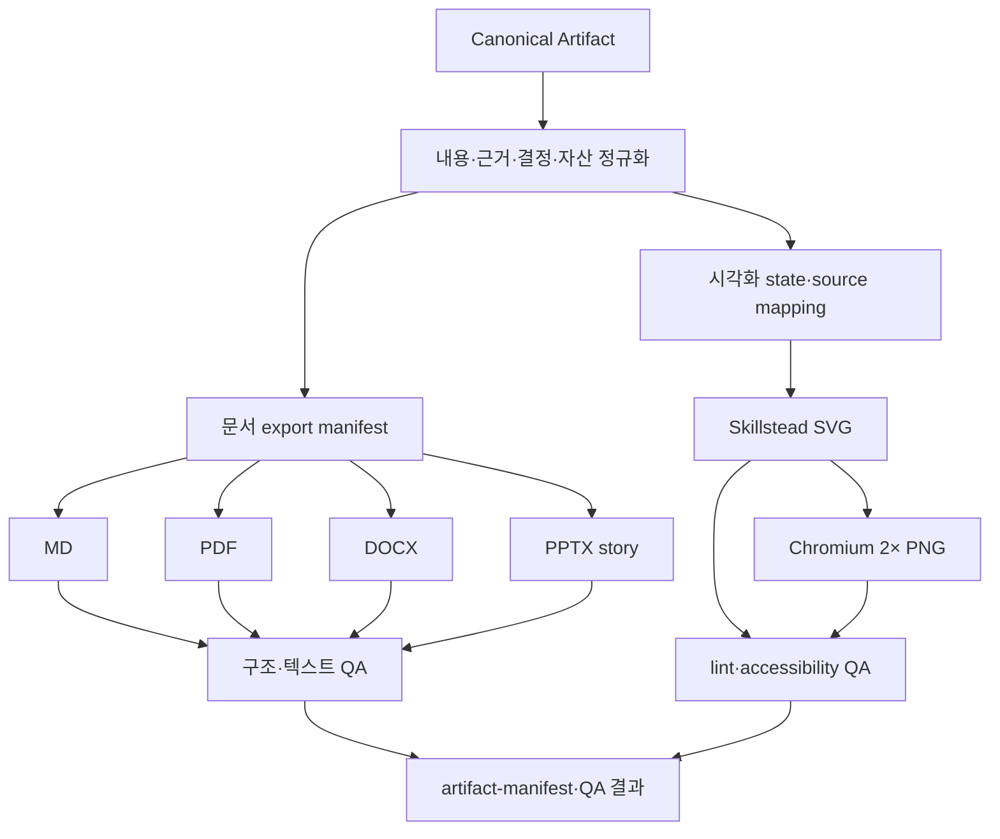

# 내보내기 파이프라인

## 원칙

문서와 도식은 모두 Canonical Artifact에서 파생합니다. `content.md`가 유일한 내용 기준이며, renderer 결과를 다시 기준 원본으로 삼지 않습니다.



MD/PDF/DOCX/PPTX는 문서 lane이고 SVG/PNG는 시각화 lane입니다. 한 요청에서 여섯 형식을 함께 지정할 수 있지만, PNG를 문서 renderer의 성공으로 계산하지 않습니다.

## Canonical Artifact 입력

```text
artifact-name/
├── content.md
├── evidence.yml
├── decisions/
├── assets/
└── export-manifest.yml
```

- `content.md`: frontmatter, 정확히 하나의 H1, 안정적 heading, 로컬 asset과 alt text
- `evidence.yml`: material claim, source, confidence, 최신성, 적용 범위와 한계
- `decisions/`: 결정, 대안, 부작용, owner, 승인과 검토 finding
- `assets/`: 도식·이미지의 source mapping, alt text, 권리와 생성 상태
- `export-manifest.yml`: 청중, 목적, 요청 형식, 테마, 페이지·슬라이드 outline, capability와 QA 상태

Canonical package 자체가 유효하지 않으면 파생 형식 생성 전에 중단합니다.

## 형식별 계약

### Markdown

MD는 renderer가 없어도 제공하는 기본 형식입니다.

- frontmatter와 H1 검증
- 로컬 링크와 자산 존재 확인
- Unicode NFC와 깨진 한글 검사
- evidence·decision reference 보존

### PDF

PDF는 공유와 승인 검토를 위한 고정 레이아웃입니다.

- PDF file signature
- 비어 있지 않은 추출 텍스트와 핵심 문구
- 예상 페이지 수
- 한글 폰트와 레이아웃
- 모든 페이지를 이미지로 렌더해 overflow, clipping, 빈 페이지, 깨진 glyph 검사

### DOCX

DOCX는 편집 가능한 Office 파생본입니다.

- ZIP/OOXML signature와 필수 part
- relationship target과 포함 자산
- 본문 의미가 Canonical content와 일치하는지 검사
- PDF 또는 이미지로 모든 페이지를 렌더해 한글 폰트, 표, 페이지 나눔과 clipping 검사

Office XML만 정상이라고 시각 품질을 승인하지 않습니다.

### PPTX

PPTX는 Markdown 페이지 복제가 아니라 청중별 발표 스토리입니다.

- `export-manifest.yml`의 audience, purpose, slide outline 필요
- OOXML, relationship, media와 notes 구조 검사
- 핵심 주장에 source note 연결
- overflow 검사
- 모든 슬라이드 이미지 렌더와 시각 QA

outline이 없으면 파일 생성보다 스토리 구조 설계를 먼저 수행합니다.

### SVG

SVG는 편집 가능한 도식 기준입니다. 제품 wrapper가 기획 의도에 맞는 preset을 선택하고 packaged Skillstead를 호출합니다.

- viewBox, 제목·설명, 읽기 순서와 텍스트 대비
- source mapping과 alt text
- connector, marker, clipping, text overflow lint
- upstream `check-svg.mjs` 통과

대표 wrapper는 Studio의 `visualize-game-design`과 Career의 `visualize-career-roadmap`입니다.

### PNG

PNG는 검증된 SVG의 공유용 raster 파생본입니다.

- Chromium으로 2× 렌더
- 예상 width와 height를 정확히 확인
- 빈 이미지, crop, connector 잘림, 깨진 한글과 대비를 픽셀 QA

Chromium이 없거나 SVG lint가 실패하면 PNG를 성공으로 보고하지 않습니다.

## Capability와 fail-closed 동작

`SessionStart` capability probe와 export 스킬은 사용 가능한 renderer를 확인합니다. renderer가 없거나 QA가 실패하면 다음 원칙을 적용합니다.

1. Canonical Artifact와 기존 검증 출력을 보존합니다.
2. 실패한 형식을 덮어쓰지 않습니다.
3. `export-manifest.yml`과 결과 보고에 `unavailable` 또는 실패 원인을 기록합니다.
4. 필요한 capability와 재시도 조건을 명시합니다.
5. 구조 검증과 시각 검증을 모두 통과하기 전에는 성공으로 표시하지 않습니다.

LibreOffice나 다른 renderer는 capability에 따른 fallback일 수 있지만, 특정 호스트의 절대 설치 경로나 bundle 버전을 플러그인 코드·문서에 고정하지 않습니다.

## 대표 검증 시나리오

`tests/formats/`는 두 제품의 실제 Canonical Artifact를 사용합니다.

| 시나리오 | 검증 대상 |
| --- | --- |
| `studio-live-service-rpg-economy` | 경제 source/sink, 공개 확률, 실험, guardrail, rollback, 경제 도식 |
| `career-entry-12-week-roadmap` | 복수 경력 경로, 12주 학습, 역량 공백, 증거 로드맵 도식 |

각 fixture는 `content.md`, `evidence.yml`, decision record, `assets/visualization.svg`, `export-manifest.yml`을 포함합니다. 생성 결과는 MD/PDF/DOCX/PPTX/SVG/PNG와 artifact manifest이고, QA 디렉터리는 모든 PDF·DOCX 페이지와 PPTX 슬라이드 렌더를 보관합니다.

대표 출력 링크:

- [Studio MD](../tests/formats/output/studio-live-service-rpg-economy/brief.md)
- [Studio SVG](../tests/formats/output/studio-live-service-rpg-economy/visualization.svg)
- [Career MD](../tests/formats/output/career-entry-12-week-roadmap/brief.md)
- [Career SVG](../tests/formats/output/career-entry-12-week-roadmap/visualization.svg)

이 파일의 존재만으로 성공을 판정하지 않습니다. 현재 결과의 구조·렌더·시각 검토 상태는 [대표 형식 검증 결과](../tests/formats/FORMAT-RESULTS.md)와 verifier 출력이 기준입니다.

## 검증 명령

저장소 루트에서 실행합니다.

```bash
node --test \
  tests/formats/archive-inspection.test.mjs \
  tests/formats/docx-qa.test.mjs \
  tests/formats/runtime-resolver.test.mjs \
  tests/formats/verify-formats.test.mjs
node tests/formats/verify-formats.mjs tests/formats/output
npm run validate:release
```

첫 명령은 OOXML archive 검사, DOCX QA 변환, runtime path 해석과 verifier 계약을, 두 번째는 대표 출력 두 세트를, release gate는 reference·package·isolation 검증과 format 준비 상태 전체를 확인합니다. `FORMAT-RESULTS.md`가 없거나 대표 형식 파일이 일부만 있으면 release gate는 완료를 보고하지 않습니다.

## 관련 문서

- [루트 README](../README.md)
- [플러그인 스위트 아키텍처](plugin-suite.md)
- [지식·근거 아키텍처](knowledge-and-evidence.md)
