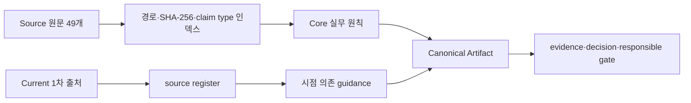

# 지식·근거 아키텍처

## 목적

이 스위트는 `docs/`의 49개 문서를 그대로 최신 사실로 취급하지 않습니다. 원문 provenance, 중복을 제거한 Core, 시점 의존 Current 근거를 분리해 오래 유지되는 기획 원칙과 계속 변하는 주장을 다른 방식으로 관리합니다.

## 원문 범위

`shared/knowledge/reference-index.json`은 49개 원문의 저장소 상대 경로, 제목, 범주, SHA-256, 단어 수, claim class와 derived Core 연결을 기록합니다.

| 범주 | 수 | 주요 내용 |
| --- | ---: | --- |
| `career` | 13 | 입문, 역할, 취업, 팀, 프로세스, 포트폴리오, 면접 |
| `fun-intent` | 10 | 재미, 동기, 몰입, 기획 의도와 설득 |
| `systems` | 13 | 규칙, 상태, flow, UI/UX, 데이터 테이블 |
| `content` | 10 | 스토리, 퀘스트, NPC, 캐릭터, 스킬, 몬스터, 액션 |
| `feedback` | 3 | 창작 기획서와 역기획서 피드백 |

build는 두 제품이 선언한 모든 범주의 원문을 각 package의 `references/source/docs/`로 복사합니다. package 내부 원문 수와 hash가 인덱스와 일치하지 않으면 검증이 실패합니다.

## 3층 reference 모델

### Core

`shared/knowledge/core/`는 원문을 종합한 비교적 안정적인 원칙을 제공합니다.

- 설계 의도와 재미
- 시스템 설계
- 콘텐츠 설계
- 플레이어 경험
- 제작과 피드백
- 경력과 포트폴리오
- evidence와 최신성

Core는 원문을 대체하지 않으며 source ID와 적용 한계를 유지합니다. 원문에서 재구성한 내용은 파생 지식으로 표시합니다.

### Source

Source는 사용자 제공 원문의 맥락, 사례와 표현을 확인할 때만 선택적으로 읽습니다. 경험담, 중복, 오탈자, 조직·시대 의존 조언을 보편 규칙으로 승격하지 않습니다.

### Current

`shared/knowledge/trends/`는 변하는 주장을 관리합니다. 현재 register는 2026년 8월 4일에 검색한 1차 출처 14개를 기록합니다.

| 주제 | 대표 1차 근거 | 적용 경계 |
| --- | --- | --- |
| 생성형 AI 위험과 권리 | NIST AI RMF GenAI Profile, U.S. Copyright Office, SAG-AFTRA | 게임 전용 법률 판정이 아니며 지역·계약별 검토 필요 |
| 접근성 | Xbox Game Accessibility Workshop Toolkit, ESA 2025 자료 | 방법론과 미국 조사 맥락을 보편 인증 기준으로 쓰지 않음 |
| LiveOps·분석 | Unity Game Overrides, Microsoft PlayFab | 제품 기능 문서는 보편 통계 표준이 아님 |
| 가상 화폐·확률 | European Commission CPC, U.S. FTC, Apple Review Guidelines | 특정 관할·사건·플랫폼 자료이며 법무 판단 대체 불가 |
| 크로스플랫폼 | Microsoft PlayFab Foundation Mode Public Preview | 제품 선택지이며 의무나 성과 보장이 아님 |
| UGC·모딩 | Steam Workshop, Apple Review Guidelines | 플랫폼별 운영 모델이며 전체 법적 기준이 아님 |
| 산업 압력 | GDC 2025·2026 State of the Game Industry | 편향 가능한 설문 신호이며 개별 수요 예측이 아님 |

원본 URL, 게시·갱신일, 검색일, 적용 지역, claim ID와 limitations는 [source register](../shared/knowledge/trends/source-register.json)에 있습니다. 종합된 현재 guidance는 [2026 current practices](../shared/knowledge/trends/2026-current-practices.md)를 참고하십시오.

`retrievedAt`은 최신성의 상한입니다. living policy나 review-after 날짜가 지난 주장은 사용 시점에 다시 검색하고, 근거가 바뀌면 기존 판단의 변경 사유를 decision record에 남깁니다.

## Claim 분류

| 분류 | 예 | 처리 |
| --- | --- | --- |
| `evergreen` | 규칙·예외를 명시하고 기획 의도를 검증한다 | Core와 source mapping으로 사용 |
| `contextual` | 특정 조직의 포트폴리오 선호, 장르 관습 | 적용 조직·상황과 반례를 기록 |
| `time-sensitive` | 채용, 정책, 플랫폼, 시장, 규제, 가격, 도구 버전 | 최신 1차 출처, 검색일, 지역, limitations 필수 |

근거 레코드는 최소한 claim ID/type, source ID/path, verified 또는 retrieved date, confidence, applicability와 limitations를 유지합니다.

## 사실·추론·가정 경계

산출물은 다음을 섞지 않습니다.

- 사용자가 제공한 사실
- 외부 출처가 직접 뒷받침하는 사실
- 관찰에서 도출한 추론
- 검증 전 가정 또는 provisional target
- 인간 승인과 실제 테스트 결과

장르 관습, 매력적인 목표 수치, 한 공고의 요구사항, AI가 만든 값은 승인된 사실이 아닙니다. 가격, 확률, retention, 표본, 일정, person-week, 비용, 기여도, 구현 상태와 승인 결과를 발명하지 않습니다.

새 1차 근거가 로컬 문서와 충돌하면 양쪽을 보존하고 `source-conflict`를 기록합니다. 적용 가능한 최신 1차 근거를 우선하되, 법률·규제 자료는 준수 판정이 아니라 법무 검토 trigger로 사용합니다.

## 책임 있는 설계 게이트

`shared/responsible-design/gates.json`에는 7개 게이트가 있습니다.

| 게이트 | blocker 예 | 요구 증거 |
| --- | --- | --- |
| `ai-rights-human-approval` | 권리·동의·인간 승인 누락 | provenance, consent, approver, date |
| `accessibility` | core path에 접근 가능한 대안 없음 | target, modality, test, limitation |
| `economy-transparency` | 가격·확률·환산·구매 결과 은폐 | disclosure, conversion, value, regional review |
| `liveops-experiment` | 가설·가드레일·롤백·owner 누락 | cohort, metric, rollback, owner |
| `ugc-safety` | 신고·moderation·연령·privacy·appeal 누락 | threat model, moderation, SLA |
| `ai-npc-safety` | 무제한 행동·기억·고위험 결과 | boundary, red team, disclosure, fallback |
| `scope-control` | 비용·owner·성공 기준 없는 범위 확장 | approved scope, cost/risk, measure, approver |

상태는 `not-applicable`, `pending`, `blocked`, `approved`만 허용합니다. AI는 필요한 근거와 owner가 없는 게이트를 자동 승인하지 않습니다.

## Provenance와 재배포

원문 49개는 사용자 제공 workspace에서 로컬 플러그인 제작·사용을 위해 포함되었습니다. 프로젝트 MIT License는 이 원문, 원문 안의 예시·스크린샷·상표와 제3자 자료를 재허가하지 않습니다.

- 로컬·사설 사용과 공개 재배포 권리는 서로 다른 상태입니다.
- 공개 또는 제3자 배포 전 문서별 명시적 라이선스나 허가 증거가 필요합니다.
- Studio package의 `references/source-document-rights.json`은 각 문서의 package path, hash, origin, 검토일, 공개 재배포 상태와 필요한 조치를 기록합니다.
- Studio의 package-local redistribution guard는 49개 모두 권리 근거가 확인되기 전 `public`·`distributable` 모드에서 fail-closed 합니다.
- Career를 포함한 어떤 snapshot도 원문 권리를 추정해 공개 배포해서는 안 됩니다.

Skillstead `svg-infographic` 0.8.3은 별도 Apache-2.0 라이선스입니다. `shared/vendor/skillstead/vendor.lock.json`은 upstream, 버전과 파일별 hash를 고정하며, 각 package는 원본 라이선스와 제3자 고지를 포함합니다.

## 갱신 절차

1. 새 주장에 `evergreen`, `contextual`, `time-sensitive`를 지정합니다.
2. 원문 기반이면 reference index의 source ID와 연결합니다.
3. 시점 의존이면 가능한 최신 1차 출처의 URL, 게시·갱신일, 검색일, 지역과 limitations를 기록합니다.
4. 기존 근거와 충돌하면 `source-conflict`와 결정 필요 항목을 남깁니다.
5. review-after 날짜와 적용 범위를 설정합니다.
6. `node tooling/index-references.mjs --check`와 `node tooling/audit-evidence.mjs --check`를 실행합니다.
7. 원문 bytes나 배포 상태가 달라지면 package provenance와 공개 재배포 경계를 다시 검토합니다.

## 관련 문서

- [루트 README](../README.md)
- [플러그인 스위트 아키텍처](plugin-suite.md)
- [내보내기 파이프라인](export-pipeline.md)
- [원문 정책](../shared/knowledge/source-policy.md)
- [책임 있는 설계](../shared/responsible-design/README.md)
