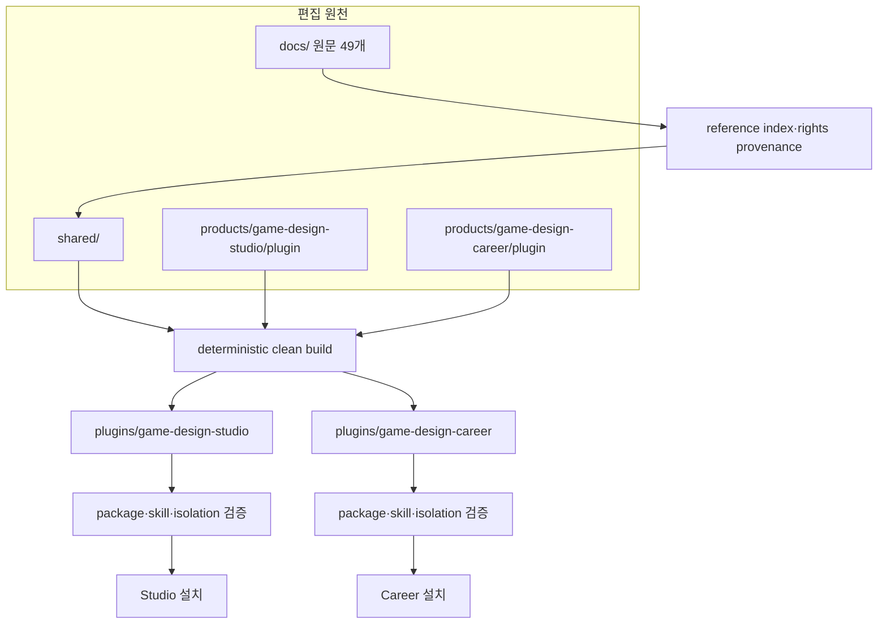
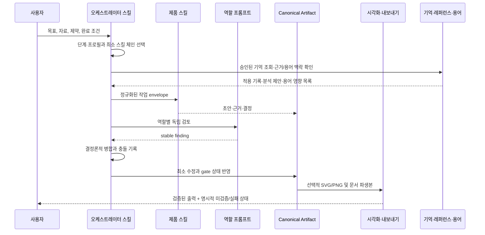

# 플러그인 스위트 아키텍처

## 결정

Game Design Plugin Suite는 하나의 거대한 플러그인이 아니라 `game-design-studio`와 `game-design-career` 두 제품을 제공합니다. 공통 지식과 계약은 저장소에서 한 번 관리하고, clean build가 각 독립 패키지에 복제합니다.

이 구조의 핵심 불변 조건은 다음과 같습니다.

- 설치된 플러그인은 sibling 플러그인, `shared/`, `products/` 또는 저장소 절대 경로에 의존하지 않습니다.
- `plugins/`에는 symlink가 없고 package-relative 링크만 있습니다.
- 같은 package 경로를 공통 원천과 제품 overlay가 다른 bytes로 제공하면 덮어쓰지 않고 빌드가 실패합니다.
- 배포 스냅샷은 현재 원천과 byte-for-byte 일치해야 합니다.
- 제품 하나를 설치·제거해도 다른 제품의 상태를 바꾸지 않습니다.

## Source에서 설치 패키지까지



### 편집 책임

| 영역 | 책임 | 직접 편집 여부 |
| --- | --- | --- |
| `docs/` | 사용자 제공 원문과 설계·아키텍처 문서 | 원문 변경은 provenance 갱신과 함께 수행 |
| `shared/` | 지식, export 계약, 책임 게이트, hook, runtime, Skillstead | 예 |
| `products/game-design-studio/plugin/` | Studio 스킬, 역할, 프로필, 템플릿, 제품 helper | 예 |
| `products/game-design-career/plugin/` | Career 스킬, 역할, rubric, 템플릿, 제품 helper | 예 |
| `plugins/game-design-*` | marketplace가 읽는 생성 스냅샷 | 아니오 |

`npm run build`는 clean staging에서 두 제품을 합성한 뒤 검증된 스냅샷을 교체합니다. 실패 시 반쪽짜리 package를 정상 결과로 남기지 않는 transaction/recovery 계약을 사용합니다.

## 독립 패키지 구조

두 패키지는 같은 상위 구조를 갖습니다.

```text
plugins/game-design-<product>/
├── .codex-plugin/plugin.json
├── skills/                         # Studio 24개 / Career 23개 설치 스킬
│   ├── <product-skill>/
│   │   ├── SKILL.md
│   │   ├── agents/openai.yaml      # 필요한 스킬에만 존재
│   │   ├── references/             # 필요한 스킬에만 존재
│   │   └── scripts/                # 필요한 스킬에만 존재
│   └── svg-infographic/            # Skillstead 0.10.0
├── agents/                         # Studio 12개 / Career 10개 역할 프롬프트
├── hooks/hooks.json
├── scripts/                        # 공통·제품 실행 스크립트 30개
├── references/
│   ├── shared/                     # Core, Current, export, 책임 게이트
│   ├── source/docs/                # 원문 49개
│   └── <product references>
├── assets/
│   ├── product-mark.svg
│   ├── templates/                  # 제품별 15개
│   └── shared/templates/
├── LICENSE
├── THIRD_PARTY_NOTICES.md
├── README.md
└── BUILD-MANIFEST.json
```

`BUILD-MANIFEST.json`은 suite distribution build 결과입니다. 파일 경로, 크기, SHA-256과 전체 tree hash로 snapshot의 재현성을 확인합니다.

## 제품별 확장점

### Studio

- 제품 스킬: 비전, 시스템, 콘텐츠, 플레이어 경험, 경제·LiveOps, 제작, 검토, 컷씬 프리프로덕션, 도식화, export와 오케스트레이션
- 역할: lead, system/economy, content/narrative, UX/accessibility, LiveOps/data, production feasibility
- 프로필: `universal-core`를 항상 먼저 적용하고 `live-service-rpg`, `mobile`, `pc-console`을 canonical order로 합성
- 제품 helper: 프로필 합성, 역할 finding 병합, 시나리오 검증, source document 공개 재배포 가드, 시각화 증거, export job 검증
- 템플릿: 비전, loop, 시스템·예외, 데이터, 콘텐츠, UX, 경제, LiveOps, 생산·검토 15개

프로필은 장르 관습을 사실로 만들지 않습니다. 추가 질문, 필수 섹션, evidence trigger와 책임 게이트를 더합니다. 프로필이 충돌하면 자동 타협 대신 decision record를 요구합니다.

### Career

- 제품 스킬: 경력 맵, 채용 조사, 포트폴리오, 역기획, 면접, 리뷰, 성장, 도식화, export와 오케스트레이션
- 역할: career strategist, mentor, portfolio reviewer, reverse-design critic, interview coach, evidence auditor
- 경력 단계: `entry`, `new-hire`, `junior-growth`, `transition`; 불명확하면 `unclear`
- 제품 helper: 역할 finding 병합, 시나리오 검증, 현재 채용 evidence, 시각화 상태, export job 검증
- 템플릿: 역할·역량, 공고 근거, 포트폴리오, 역기획, 면접, 성장·전환 15개

Career는 작은 채용 표본을 시장 전체로 일반화하지 않고, 학력·나이·전공·배경만으로 경로를 순위화하지 않습니다.

## 공통 설계 지능 모듈

두 제품은 같은 원천에서 빌드된 프로젝트 기억, 레퍼런스 분석과 용어 사전 런타임을 각 설치 패키지 안에 독립적으로 포함합니다. 이 모듈들은 Canonical Artifact나 사람 결정을 대신하지 않습니다.

| 모듈 | 입력과 처리 | 결과와 권한 경계 |
| --- | --- | --- |
| 프로젝트 기억 | 플레이테스트·검토·학습 결과에서 출처와 적용·제외 범위를 가진 후보를 만들고, 현재 출처와 만료 상태를 다시 확인 | 이름이 기록된 사람이 승인한 기억만 다음 작업에 적용. 저장소 문제나 opt-out이면 원래 작업은 기억 없이 계속 |
| 레퍼런스 인텔리전스 | 분석 브리프(brief), 증거 등록부, 시스템 지도, 핵심 반복(Core Loop)·장기 반복(Meta Loop), 경제·사용자 경험(UX)·운영 구조와 미확인 질문을 분리 | 관찰·추론·설계 전환 제안을 구분. `adopt`, `adapt`, `reject`, `hold`는 검토 대기 제안이며 자동 승인하지 않음 |
| 용어 사전 | 한국어·영어 후보, 정의, 문서별 출현 위치와 영향 목록을 계산 | 이름이 기록된 사람의 결정과 정확한 스냅샷 없이 용어집을 갱신하거나 본문을 자동 치환하지 않음 |

Studio의 컷씬 프리프로덕션은 이 공통 모듈과 별도인 제품 경로입니다. `style-master → reference-masters → keyframes → storyboard` 순서를 따르고, 프롬프트만 제공할지·비용만 계산할지·승인 뒤 생성할지를 분리합니다. 한글 픽셀 텍스트가 없으면 호스트 `image_gen`을 먼저 사용하고, 한글이 필수일 때만 explicit OpenAI `gpt-image-2`를 사용합니다. 유료 품질은 `low` 기본, `medium` 선택, `high` 예외 원칙을 따릅니다. 현재 견적, 이름이 기록된 승인과 선행 단계(wave) 완료가 없으면 생성 제공자(provider)를 호출하지 않습니다.

## 런타임 오케스트레이션



### 역할 자산의 실제 의미

`agents/*.md`는 네이티브 플러그인 component manifest가 아닙니다. 각 파일은 역할의 책임, 입력, 검토 질문, 금지 행동, blocker 경계와 출력 계약을 정의합니다. 오케스트레이터는 호스트 capability에 맞춰 이 프롬프트를 전달합니다.

- 병렬 subagent 지원: 서로 독립적인 역할을 최대 3개 병렬 실행
- 병렬 지원 없음: 같은 역할과 질문을 고정 우선순위로 순차 실행
- 두 경로 모두: finding을 도착 순서가 아니라 stable key와 role priority로 병합

따라서 네이티브 자동 발견은 성능 최적화이지 정확성의 필수 조건이 아닙니다.

## Hooks

plugin manifest에는 hook 필드를 추가하지 않고 기본 발견 경로 `hooks/hooks.json`을 사용합니다.

### SessionStart

`scripts/capability-probe.mjs`는 Node, Chromium, LibreOffice와 문서·PDF·프레젠테이션 capability를 읽기 전용으로 확인합니다. 선택 renderer가 없어도 설계 작업과 Canonical MD는 계속할 수 있습니다.

### Stop

`scripts/stop-artifact-review.mjs`는 plugin 식별자와 final artifact sentinel이 있는 active artifact만 검사합니다. 검증이 실패하면 한 번만 교정 패스를 요청하고 재진입 상태에서는 다시 차단하지 않습니다. hook이 비활성화되어도 명시적 validator와 스킬 완료 조건으로 같은 계약을 적용할 수 있습니다.

## 검증 경계

| 단계 | 증명하는 것 |
| --- | --- |
| reference/evidence audit | 원문 인덱스, 최신성, source mapping과 drift |
| vendor hash | Skillstead 0.10.0 원본과 lock의 byte 일치 |
| unit/contract/product/E2E | schema, 스킬, 역할, hook, 제품 시나리오 |
| 기억·레퍼런스·용어 안전성 | 출처 변경(drift), 승인 권한, 보수적 근거 판정, 원문 무치환과 복구(rollback) |
| 컷씬 생애주기(lifecycle) | 프롬프트 전용(prompt-only), 비용·상한(cap), 이름이 기록된 승인, 순차 단계(wave), 부분 재시도와 연속성 관문(continuity gate) |
| clean build drift | 편집 원천과 committed snapshot 일치 |
| official package/skill validation | plugin manifest와 모든 스킬 구조 |
| isolation smoke | 저장소와 sibling 없이 단독 package 실행 |
| marketplace smoke | 임시 Codex 환경에서 등록·설치·실제 installed skill 증거·제거 |
| format verification | MD/PDF/DOCX/PPTX/SVG/PNG 구조와 렌더 QA |

기본 검증은 `npm run validate`, release gate는 `npm run validate:release`입니다. marketplace smoke는 로컬 인증이 필요한 별도 장기 검증이므로 `npm run smoke:marketplace`로 분리합니다.

### CI 레인

`.github/workflows/ci.yml`이 pull request와 `main` push에서 두 레인을 실행합니다. 레인마다 결과가 의미를 갖는 운영체제가 다르므로 매트릭스도 다릅니다.

| 레인 | 내용 | 러너 | 인증 |
| --- | --- | --- | --- |
| 오프라인 게이트 | `node tooling/validate-suite.mjs`를 네 스테이지 `--skip`과 함께 실행 | `ubuntu-latest`, `windows-latest` | 불필요 |
| Windows 하드닝 게이트 | `node --test tests/unit/platform-file-hardening.test.mjs` | `windows-latest` | 불필요 |
| 설치 게이트 | `@openai/codex` 설치 후 `node tooling/install-roundtrip.mjs --require-codex` | `ubuntu-latest`, `windows-latest` | 불필요 |

설치 게이트는 한글과 공백을 포함한 `CODEX_HOME`·workspace, `LANG=C`, `LC_ALL=C` 아래에서 두 제품을 실제 설치하고 재설치한 뒤 README, `plugin.json`, 대표 스킬을 source와 SHA-256으로 대조합니다. 경로는 NFC 정규화 후 비교하며, 명령 출력에 `U+FFFD`가 있으면 실패합니다. 모델을 호출하지 않으므로 인증이 필요 없습니다. 로컬에서는 `npm run verify:install-roundtrip`으로 같은 검증을 돌리며, `codex`가 없으면 `SKIPPED`를 보고하고 종료합니다.

CI에서 실행할 수 없는 스테이지는 네 개입니다. 공식 plugin 검증기와 skill quick 검증기는 Codex 설치 산출물을 요구하고, format smoke는 `package.json`에 없는 호스트 제공 모듈을 임포트하며, diagram render drift는 headless Chromium이 호스트 폰트로 그린 PNG 바이트를 비교하므로 그 PNG를 커밋한 기계에서만 의미가 있습니다. SVG 비교는 결정적이므로 모든 환경에서 그대로 유지됩니다. `validate-suite`는 이 넷을 조용히 통과시키지 않고 `SKIPPED`로 기록하며, 스킵이 하나라도 있으면 release readiness를 `INCOMPLETE`로 끝냅니다.

**릴리스 전에 이 네 스테이지는 로컬에서 반드시 실행합니다.** `npm run validate:release`는 `--skip`을 거부하므로 스킵한 채로 release gate를 통과할 수 없습니다. 인증이 필요한 라이브 스모크 `npm run smoke:marketplace`도 로컬 수동 실행으로 남습니다.

#### 오프라인 게이트가 Windows로 돌아온 경로

Windows 오프라인 레인은 만들어 돌려 보고 결과를 읽은 뒤 한 번 뺐다가 다시 넣었습니다. 실패 272건은 한 가지 문제가 아니라 성격이 다른 세 부류였고, 셋 다 답을 받았습니다.

| 부류 | 실패 수 | 내용 | 처리 |
| --- | --- | --- | --- |
| 출하 코드 결함 | 77 | `shared/scripts/lib/load-workspace-env.mjs`는 `O_NOFOLLOW`가 정수가 아니면 즉시 거부했고, Node는 Windows에서 이 상수를 정의하지 않습니다(21건). `shared/scripts/lib/safe-memory-store.mjs`의 `syncDirectory`는 디렉터리를 열어 `fsync`했고 Windows는 `EPERM`을 돌려줍니다(56건). | 아래 «플랫폼 파일 하드닝». 코드에서 제거. |
| 테스트·도구의 POSIX 가정 | 약 65 | `/bin/sh`와 `/tmp` 하드코딩, shebang으로 만든 가짜 실행 파일, `chmod`가 무의미한 곳에서 mode 비트 변화를 기대하는 단정, `0600` 가정. | 아래 «테스트 쪽 플랫폼 가정». `tests/lib/platform-support.mjs` 한 자리로 모음. |
| 위 둘의 파급 | 나머지 | 앞의 실패가 만든 상태를 뒤 단정이 다시 읽으며 생긴 연쇄. | 원인 둘이 사라지면 함께 사라집니다. |

#### 테스트 쪽 플랫폼 가정

출하 코드의 결함과 테스트의 가정은 성격이 다릅니다. 앞은 사용자 기계에서 제품이 깨지는 일이고, 뒤는 검증이 한 플랫폼에서만 돌아가는 일입니다. 그래서 처리 방식도 다릅니다 — 제품은 Windows에서 **동작해야** 하고, 테스트는 Windows에서 **거짓말하지 않아야** 합니다.

`tests/lib/platform-support.mjs`가 그 판단을 하는 유일한 자리입니다. 규칙은 하나입니다. **단정을 약하게 만들어 통과시키지 않고, 이름 없는 스킵도 두지 않습니다.** 플랫폼이 표현할 수 없는 것은 이유를 붙여 건너뛰고, 그 단정이 원래 확인하던 것은 모든 플랫폼에서 그대로 돕니다.

| 가정 | POSIX | Windows | 대신 하는 것 |
| --- | --- | --- | --- |
| `/bin/sh`를 오라클로 사용 | 그대로 실행 | 없음 | 오라클만 내려놓습니다. 적대적 shell word를 감사기가 거부하는지는 양쪽에서 그대로 확인합니다. |
| README의 bash 레시피 실행 | 그대로 실행 | 없음 | README **본문** 단정은 양쪽에서 돌고, 실행만 bash가 있는 호스트로 한정합니다. |
| shebang으로 만든 가짜 실행 파일 | `#!/usr/bin/env node` + `0o755` | 같은 JavaScript + `.cmd` 런처 | 본문이 한 벌이라 두 플랫폼이 갈라지지 않습니다. 스폰 이음매를 받는 코드에서는 `spawnProgramSync`가 그 JavaScript를 현재 Node에 넘깁니다 — realpath·lstat·X_OK·버전 파싱·심링크 별칭 해석은 전부 실제 파일에 대해 그대로 돕니다. |
| 실행 불가 파일 | 실행 비트 해제 | 표현 불가 | `writeNonExecutableProgram`이 `null`을 돌려주고 그 케이스만 빠집니다. 나머지 두 거부 사유는 양쪽에서 돕니다. |
| `/tmp` 임시 루트 | `os.tmpdir()`와 동일 | 경로 아님 | `temporaryDirectory()`. macOS에서 첫 경로 구성 요소가 심링크여야 하는 한 케이스만 `shortOnDarwin`으로 남깁니다. |
| `chmod` 후 mode 비트 단정 | 그대로 | 무의미 | `PERMISSION_BITS_MEANINGFUL`로 감쌉니다. dev/ino 같은 플랫폼 중립 단정은 그대로 돕니다. |
| FIFO 같은 특수 파일 | `mkfifo` | 만들 수 없음 | 케이스를 이름과 함께 스킵합니다. 픽스처를 바꾸지 않은 채 거부를 단정하는 것보다 낫습니다. |
| npm 런처 스폰 | 실행 파일 | `.cmd` 심 — shell 없이는 스폰 거부 | 런처가 실행했을 스크립트를 `process.execPath`로 직접 돌리고, `package.json`의 해당 줄은 따로 단정합니다. |
| isolation smoke의 최소 환경 | Node + `/usr/bin` + `/bin`, `$TMPDIR` | System32 없이는 프로세스가 시작조차 못 함 | `minimalEnvironment`가 플랫폼을 인자로 받습니다. Windows에서는 `%USERPROFILE%`·`SystemRoot`·`%TMP%`·`PATHEXT`와 System32를 넣습니다. |

`tests/unit/platform-assumptions.test.mjs`가 이 가정들이 다시 들어오는 것을 막습니다. `tests/`와 `tooling/` 전체를 훑어 하드코딩된 shell 경로, `/tmp` 임시 루트, 맨 `O_NOFOLLOW`·`O_DIRECTORY`를 찾고, 면제는 glob이 아니라 정확한 파일 경로 목록입니다 — 면제를 추가하는 diff가 곧 이유를 적는 자리입니다. 유효하지 않게 된 면제도 같은 파일이 잡습니다.

**이 레인이 덮지 않는 것.** `tests/formats/`는 macOS Quick Look과 headless Chromium을 구동하므로 모든 CI 플랫폼에서 `SKIPPED`이고, 위 게이트의 탐색 대상에서도 빠져 있습니다. 그래서 `npm test`(트리 전체 순회)는 여전히 Windows에서 끝까지 돌지 않고, 오프라인 게이트가 실행하는 네 shard만 돕니다.

**이 수정들이 아직 받지 못한 것.** 위 표의 각 항목은 Windows에서 무엇이 왜 다른지를 근거로 고쳤고, POSIX 회귀는 네 shard 전부 로컬에서 `fail 0`으로 확인했습니다. 그러나 **레인 자체가 Windows에서 돈 적은 아직 없습니다.** Windows 판정을 내는 것은 이 CI 레인이고, 첫 실행이 곧 그 판정입니다. 첫 실행이 남은 항목을 보고하면 그것은 되돌아온 결함이 아니라 이 목록에 아직 없던 부류입니다 — 위 표에 줄을 추가하고 `tests/lib/platform-support.mjs`에 자리를 만드는 것이 그때의 처리 방식입니다. 하드닝 게이트가 별도 레인으로 남아 있는 이유도 여기에 있습니다. 넓은 레인이 첫 실행에서 무엇을 보고하든, 출하 코드의 플랫폼 면제에는 독립적인 Windows 증거가 있습니다.

#### 플랫폼 파일 하드닝

`shared/scripts/lib/platform-file-hardening.mjs`가 플랫폼별 판단을 하는 유일한 자리입니다. 이전에는 같은 질문에 두 가지 잘못된 답이 있었습니다. `load-workspace-env`는 상수가 없으면 실행 자체를 거부했고, 나머지 출하 모듈들은 `constants.O_NOFOLLOW ?? 0`이나 맨 상수를 그대로 썼습니다. 후자는 Windows에서 `flags | undefined`가 조용히 `flags`가 되므로 실패하지 않고 보증만 사라집니다 — 어느 플랫폼에서도 아무 말을 하지 않는 열화입니다.

| 보증 | POSIX | Windows | Windows에서 대신 성립하는 것 |
| --- | --- | --- | --- |
| `O_NOFOLLOW` | 상수 그대로 | `0` | 여는 쪽이 이미 수행하는 `lstat` → open → identity 재확인 |
| 디렉터리 `fsync` | 필수, 실패는 실패 | 건너뜀 | NTFS가 `$LogFile`에 메타데이터 연산을 저널링하고 마운트 시 재생 |
| `O_DIRECTORY` 디렉터리 핸들 | 상수 그대로 | 핸들 없음(`null`) | 읽기 앞뒤의 `lstat` 쌍 대조 |
| `Stats.mode` 권한 비트 | POSIX 권한 그대로 | 읽기 전용 속성으로 합성된 값 | 없음 — 검사를 하지 않습니다 |

이 예외들은 모두 **허용목록**입니다. 상수를 정의해야 마땅한 POSIX 호스트에서 상수가 없으면 예전처럼 즉시 실패합니다. `win32`만 면제됩니다.

`O_NOFOLLOW`가 하는 일은 마지막 경로 구성 요소가 심링크일 때 `open`을 실패시키는 것 하나뿐이고, Node는 Windows에서 대응 플래그를 노출하지 않습니다(`FILE_FLAG_OPEN_REPARSE_POINT`는 `fs.open`에서 닿을 수 없습니다). 이 스위트의 모든 open은 앞의 `lstat`과 뒤의 `handle.stat()` ↔ 재`lstat` 대조로 감싸여 있습니다. 심링크로 바뀐 경로는 두 번째 `lstat`이 심링크라고 보고해서 걸리고, 다른 정규 파일로 바뀐 경로는 dev/ino 대조로 걸립니다 — POSIX에서도 `O_NOFOLLOW`가 막아 준 적 없는 경우입니다. 둘 다 호출자가 한 바이트를 읽기 전에 돌아갑니다. 그래서 Windows가 잃는 것은 탐지가 아니라 원자성입니다. 바꿔치기된 심링크는 열리지 않는 대신 열렸다가 거부되고, 공격자가 지정한 대상의 바이트는 호출자에게 도달하지 않습니다. 남는 잔여 위험은 공격자가 고른 경로에 대한 일시적 핸들이며, 그래서 이것이 일반적 완화가 아니라 이름 붙은 한 플랫폼의 면제입니다.

디렉터리 `fsync`는 POSIX에서 rename이나 link를 내구화하는 수단입니다. Windows에는 사용자 모드 대응물이 없습니다. `fs.open`은 디렉터리 핸들을 돌려주지 못하고, 볼륨 핸들에 대한 `FlushFileBuffers`는 관리자 권한을 요구합니다. 이를 시도하는 것이 `EPERM`이고 design memory store를 Windows에서 무너뜨린 원인입니다. 건너뛴다고 보증이 사라지지는 않고 제공자가 바뀝니다. 커밋된 바이트는 디렉터리 항목이 생기기 전에 이미 내구화되어 있습니다 — 호출자가 claim 파일 자체를 `fsync`한 뒤에야 link로 제자리에 넣습니다.

`Stats.mode`는 Windows에서 읽기 전용 속성 하나로 합성됩니다. ACL이 무엇이든 읽을 수 있는 파일은 같은 mode를 보고하므로, group·other 비트를 검사하는 것은 그 숫자가 답할 수 없는 질문을 묻는 일입니다. 모든 파일에서 켜지고, 사용자가 취할 수 있는 조치도 없습니다 — `chmod`는 무의미하고 Node는 ACL API를 노출하지 않습니다. 그래서 추측하는 대신 검사를 포기합니다. **Windows 사용자는 `.env` 권한 경고를 아예 받지 않습니다.** 대안은 나타날 때마다 틀린 경고였습니다.

같은 계열의 세 번째 결함도 함께 고쳤습니다. design memory 진입점 셋은 `process.env.HOME`을 읽었는데 Windows는 이 변수를 정의하지 않습니다. `resolveMemoryStore`에는 `win32: ["AppData", "Local"]` 분기가 이미 있었지만 home이 workspace로 대체되면서 global scope 저장소가 엉뚱한 자리에 만들어졌습니다. 이제 셋 다 `os.homedir()`를 씁니다 — POSIX에서는 `$HOME`을, Windows에서는 `%USERPROFILE%`을 읽으므로 기존 동작의 상위집합입니다. 이 저장소의 다른 모듈들이 이미 쓰던 방식이고, `process.env.HOME`이 예외였습니다.

검증은 POSIX 호스트에서 실제 원시 함수를 Windows 입력으로 구동하고 그 결과를 실제 소비자에게 물려서 합니다. `tests/unit/platform-file-hardening.test.mjs`는 `noFollowOpenFlag`가 `0`을 돌려주고 `syncDirectory`가 아무것도 열지 않는 상태로 `load-workspace-env`와 `safe-memory-store`를 재배치해 실행합니다. dotenv는 그대로 읽히고 심링크는 그대로 거부되며, 봉인된 memory event는 커밋되고 스토어 자신의 identity 고정 리더로 되읽힙니다. 원시 함수를 우회해 맨 상수를 쓰는 출하 모듈이 하나라도 생기면 같은 파일의 소스 게이트가 잡습니다.

이 파일 자체는 이제 **Windows에서 실제로 돕니다.** 전용 레인 하나가 `windows-latest`에서 이 파일만 `node --test`로 실행합니다 — shard도 스테이지 회계도 없으므로 스킵이 숨을 자리가 없습니다. 오프라인 게이트의 Windows 절반도 같은 파일을 `unit` shard 안에서 돌리지만, 좁은 레인은 따로 남깁니다. 이것은 넓은 레인이 무슨 상태이든 성립해야 하는 바닥이고, 넓은 레인 안에 들어가는 순간 그 성질을 잃습니다.

`O_DIRECTORY`도 같은 계열이라 같은 자리로 옮겼습니다. POSIX에서 디렉터리 핸들은 `readdir` 한 번 동안 inode를 고정하는 수단이고, Windows에는 그 상수도 그 핸들도 없습니다(libuv가 `FILE_FLAG_BACKUP_SEMANTICS` 없이 열기 때문에 `fs.open`이 디렉터리에서 실패합니다). `openDirectoryHandle`은 그런 호스트에서 `null`을 돌려주고, 호출자는 이미 앞뒤로 걸어 둔 `lstat` 쌍으로 같은 대조를 합니다. 여기서도 잃는 것은 탐지가 아니라 원자성입니다.

Windows에서 실제로 성립해야 하는 계약은 Windows checkout과 설치가 다른 플랫폼과 같은 바이트를 만든다는 것이고, 이는 설치 게이트가 매 실행마다 Windows에서 직접 증명합니다.

## 번들 스킬 최신 유지

번들 스킬 셋(skillstead·archify·im-not-ai)은 제품 패키지 안에 벤더링됩니다. 사용자가 따로 설치하거나 올릴 수 있는 대상이 아니고, 새 스위트 릴리스가 실어 나릅니다.

권고와 승인은 분리되어 있습니다. 검사는 아무것도 바꾸지 않고, 적용은 사람이 답한 뒤에만 일어납니다.

| 명령 | 하는 일 |
| --- | --- |
| `npm run check:updates` | 세 상류의 최신 여부를 JSON으로. current 0, outdated 2, unknown 1 |
| `npm run check:updates:report` | 같은 검사를 사람이 읽는 권고문으로 |
| `npm run update:vendors` | 권고를 보이고 `업데이트를 진행할까요? [y/N]`를 물은 뒤, 승인 시에만 적용 |
| `npm run check:vendor-refs` | 제품 문서의 버전 표기가 벤더 락과 어긋나지 않았는지 |
| `npm run check:vendor-catalog` | Archify 카탈로그가 패키지 안의 벤더 문서와 어긋나지 않았는지 |

`update:vendors`는 승인 뒤 벤더 트리 갱신, 제품 문서 재작성(`tooling/sync-vendor-references.mjs`), 업데이트 매니페스트 재생성, 패키지 스냅샷 재빌드, Archify 카탈로그 항목 재작성(`tooling/sync-vendor-catalog-entries.mjs`)까지 한 번에 합니다. 대화형 터미널이 아니면 `--yes` 없이는 적용하지 않고 멈춥니다. `--validate`를 주면 릴리스 검증까지 이어서 돌립니다.

주간 워크플로(`.github/workflows/check-bundled-skill-updates.yml`)는 검사만 하고 요약에 권고문을 남깁니다. 상류에 새 릴리스가 있다는 사실은 빌드 실패가 아니라 권고이므로 `outdated`로는 실패하지 않고, 검사 자체가 답을 못 낸 `unknown`에서만 실패합니다. 권한은 `contents: read`로 닫혀 있고 워크플로는 어떤 업데이트 명령도 실행하지 않습니다.

버전 리터럴은 한 곳에서만 움직입니다. 벤더 락이 원천이고, 나머지는 락에서 씁니다.

| 위치 | 어떻게 따라오는가 |
| --- | --- |
| `products/*/plugin/THIRD_PARTY_NOTICES.md`, 같은 곳 `README.md`, `polish-game-design-writing/SKILL.md` | `tooling/sync-vendor-references.mjs`가 락에서 다시 씀. `validate-suite`의 `vendor references` 스테이지가 drift를 막음 |
| `visualize-*/scripts/run-skillstead.mjs`의 저장소 fallback 경로 | 락의 `tree.root`를 읽어 해석. 이 구간은 `// #region repository-only` 마커로 감싸여 있고 빌드가 패키지 사본에서 통째로 잘라냄 |
| `validate-visualization-evidence.mjs`의 `TRUSTED_RUNTIME_DIGESTS` | linter·renderer는 벤더 스크립트의 sha256, wrapper는 제품 소스에서 마커 구간을 잘라낸 바이트의 sha256. 셋 다 `sync-vendor-references.mjs`가 씀 |
| `.gitattributes`의 벤더 경로 | 버전 자리를 `*` glob으로 둠 |
| `shared/updates/installed-components.json` | `tooling/generate-update-manifest.mjs`가 락에서 생성 |
| `plugins/**` | `npm run build`가 락에서 벤더 트리를 골라 담음(`tooling/lib/vendor-components.mjs`) |
| `shared/vendor/description-overlays/<id>.json`의 `upstream.sha256` | 상류 SKILL.md의 `description` 문구를 그대로 해싱한 값. 상류가 문구를 바꾸면 빌드가 멈추고 다시 쓴 요약과 새 해시를 요구함 |
| `README.md`·`shared/contracts/README.md`·`guides/assets/diagram-manifest.json` | 같은 `sync-vendor-references.mjs` 규칙 22개에 포함 |
| `guides/archify-diagrams/catalog.json`의 벤더 mirror 항목과 digest | `tooling/sync-vendor-catalog-entries.mjs`가 패키지와 락에서 씀. `validate-suite`의 `vendor catalog entries` 스테이지가 drift를 막음 |

### 벤더 description overlay

라우팅은 카탈로그에서 결정됩니다. codex는 설치된 스킬 전체에 카탈로그 예산 하나를 나눠 쓰므로 description마다 몫이 있고, 65개 스킬 기준으로 그 몫은 119자입니다. 그 뒤는 잘립니다 — 말줄임표도 없고, 모델이 잘렸다는 사실을 알 방법도 없습니다.

벤더 3종의 상류 description은 각각 652자, 596자, 289자입니다. 잘려나가는 건 장식이 아닙니다. archify는 `Use when the user asks to visualize…` 트리거 절 전체를, svg-infographic은 `Not for photo-heavy… statistical charts` 제외 범위를, humanize-korean은 트리거 목록과 `단순 맞춤법 교정·번역은 대상 아님`을 잃습니다. 트리거를 잃으면 와야 할 일이 안 오고, 제외 범위를 잃으면 오지 말아야 할 일이 옵니다. 후자가 더 나쁩니다.

벤더 파일은 고칠 수 없습니다. 락이 상류 byte를 전부 고정하고, 패키징 게이트가 수정된 벤더 파일을 거부합니다. 그래서 소스 트리는 상류와 byte 단위로 같게 두고, 빌드가 패키지로 투영하는 순간에 frontmatter 한 필드만 다시 씁니다.

| 부분 | 어디 |
| --- | --- |
| 선언 | `shared/vendor/description-overlays/<id>.json` — 대상 경로, 상류 문구의 sha256, 저장소가 쓴 119자 이하 대체 문구 |
| 적용 | `tooling/lib/vendor-description-overlay.mjs`, `buildProduct`가 벤더 모듈 엔트리마다 호출 |
| 예산 상수 | `tooling/lib/skill-description-budget.mjs` — 라우팅 측정과 overlay가 같은 값을 봄 |
| 게이트 | `tooling/isolation-smoke.mjs`의 `verifyVendor`. overlay가 지정한 경로만 상류 소스에 overlay를 적용한 결과와 대조하고, 나머지는 종전대로 락과 byte 대조 |

overlay가 정직한 이유는 상류 문구의 해시를 함께 고정하기 때문입니다. 상류가 description을 다시 쓰면 해시가 어긋나고 빌드가 멈추면서 새 해시를 알려줍니다. 요약이 존재하지 않는 문장을 조용히 대변하는 상태로 남지 않습니다. 대체 문구는 plain YAML scalar여야 합니다 — 따옴표로 열 수 없고 `: `를 담을 수 없습니다. 인용 부호에 예산 두 자를 쓰는 것도 손해입니다.

오버레이는 벤더 루트 **밖**에 둡니다. 락 옆이 읽기는 좋지만, 벤더 루트는 패키징 게이트가 검증하는 닫힌 집합이고 im-not-ai 업그레이드는 루트를 통째로 rename으로 갈아끼웁니다. 안에 두면 저장소 소유 파일이 업그레이드에 조용히 삭제되고, 존재하기 위해 허용목록 두 곳을 넓혀야 합니다.

`tests/unit/probe-skill-routing.test.mjs`의 예산 검사에는 이제 예외가 없습니다. 예전에는 벤더 3종이 이름으로 면제돼 있었습니다.

im-not-ai만 두 번째 증인을 둡니다. `tooling/vendor-pins/im-not-ai.json`이 태그·커밋·라이선스 해시와 파일 15개의 sha256을 들고 있고, `--check`는 벤더 락을 이 핀과 대조합니다. 락이 스스로를 승인하지 못하게 하는 장치입니다. 예전에는 이 표가 `tooling/sync-im-not-ai.mjs` 소스 안에 있어서, 업그레이드를 하려면 그 업그레이드를 지키는 검사를 통과시키기 위해 해시 15개를 손으로 옮겨 적어야 했습니다. 지금은 `--update`가 핀도 함께 씁니다. 사람이 PR diff에서 해시 변화를 읽는다는 성질은 그대로입니다.

테스트 fixture도 같은 규칙을 따릅니다. `tests/unit/diagram-skill-vendor.test.mjs`는 상류 정체성(저장소·라이선스·skillPath·태그 형태)만 리터럴로 두고 태그·커밋·파일 수는 설치된 락에서 읽습니다. `tests/unit/im-not-ai-vendor.test.mjs`는 핀에서, `tests/unit/capability-probe.test.mjs`는 `installed-components.json`에서, 두 `writing-quality.test.mjs`는 im-not-ai 락에서 읽습니다. `tooling/isolation-smoke.mjs`도 기대 파일 수를 저장소 락에서 가져옵니다. 예전에는 이 값들이 전부 복사본이어서, 업그레이드 하나가 업그레이드와 무관한 이유로 여섯 파일을 깨뜨렸습니다.

im-not-ai의 벤더 파일 목록은 닫힌 allowlist입니다. 상류에 참조 파일이 새로 생겨도 업그레이드가 자동으로 가져오지 않습니다. 대신 `--update`가 상류 디렉터리를 조회해 핀에 없는 파일을 `unpinnedUpstreamFiles`로 보고하므로, 넣을지는 사람이 정합니다.

### 패키징 감사의 바이너리 레인

`tooling/lib/tree-audit.mjs`는 패키지에 들어가는 모든 파일을 UTF-8로 디코딩하고 텍스트 안전성 검사를 겁니다. 상류가 폰트나 이미지를 실어 보내면 그 바이트는 어떤 텍스트로도 디코딩되지 않습니다. skillstead `svg-infographic/v0.10.0`이 폰트 3개(HiMelody 12MB, Pretendard 2종)와 PNG 2개를 함께 배포하면서 이 경로가 필요해졌습니다.

레인은 경로 접두사도 확장자 allowlist도 아닙니다. 파일이 텍스트 디코딩을 건너뛰려면 네 가지를 동시에 만족해야 합니다.

1. 호출자가 정확한 패키지 경로로 등록했을 것. 등록부는 `tooling/lib/vendor-components.mjs`의 `packagedBinaryFiles()`가 벤더 락에서 만듭니다. 락은 상류 태그에 대조해 검증된 것이므로, 어떤 파일이 바이너리인지 말하는 주체는 상류 릴리스뿐입니다.
2. 바이트가 락이 선언한 크기와 sha256에 일치할 것.
3. 선두 바이트가 확장자가 주장하는 시그니처일 것. `.png`로 이름만 바꾼 스크립트는 여기서 걸립니다.
4. 등록됐는데 실제로 없는 경로는 실패로 보고할 것. 지나가면 나중에 생길 파일에 대한 상시 면제가 됩니다.

sibling 제품 이름과 금지된 절대 경로 검사는 바이너리에도 그대로 걸립니다. 문자열이 되지 못하는 바이트라서 raw buffer에서 찾습니다.

한 가지가 더 완화됐습니다. 패키지 밖으로 나가는 상대 경로 참조 검사는 벤더 트리 안의 파일에는 적용하지 않습니다. 이 검사는 **우리** 빌드가 저장소로 되돌아가는 파일을 싣지 않게 하려는 것인데, 상류 테스트 fixture가 탈출 import 경로를 문자열로 인용한 것은 우리가 고칠 수 있는 누수가 아닙니다. 저장소를 특정해서 지목하는 `shared/` fallback 패턴은 벤더 파일에도 여전히 실패로 남습니다. 벤더 루트 목록은 `vendorDestinationRoots()`가 락에서 만듭니다.

이 레인 덕분에 상류가 다음에 폰트나 이미지를 추가해도 코드를 고칠 일이 없습니다. 락에 들어오면 등록부에 자동으로 들어옵니다. 시그니처를 모르는 확장자가 오면 조용히 통과하지 않고 실패하므로, 그때는 사람이 봅니다.

### skillstead v0.10.0의 비용

트리가 55개 283KB에서 319개 18MB로 늘었습니다. 15.4MB가 폰트 3개이고, 늘어난 264개 파일의 대부분은 상류의 테스트 fixture(SVG 138개·YAML 107개)와 `.test.mjs`입니다. 제품 패키지 두 벌이 각각 이만큼 커집니다.

렌더 드리프트는 없습니다. v0.10.0 렌더러는 기존 도식 73장을 바이트 동일하게 재현합니다.

## 0.2.0 릴리스

두 제품이 `0.1.1`에서 `0.2.0`으로 올라갔습니다. minor를 올린 이유는 설치 스킬이 늘고 진입 경로가 바뀐 것입니다.

| 변경 | 내용 |
| --- | --- |
| 신규 스킬 3개 | `upgrade-game-design-suite`, 그리고 두 제품의 대표 진입 스킬 `game-design-studio`·`game-design-career` |
| 진입 경로 | 설치·업데이트 안내가 Git 마켓플레이스와 업그레이드 스킬을 1순위로 제시합니다. 로컬 마켓플레이스는 저장소를 직접 고칠 때의 대안입니다 |
| shared 도식 3개 추가 | `suite-entry-routing-flow`, `suite-handoff-ownership-flow`, `suite-update-approval-flow` |
| shared 도식 1개 확장 | `app-cli-install-flow`에 UTF-8 preflight와 마켓플레이스 종류 band |

버전의 유일한 원천은 `products/*/plugin/.codex-plugin/plugin.json`입니다. `plugins/**` snapshot, 두 `BUILD-MANIFEST.json`, `shared/updates/installed-components.json`은 생성물이므로 `npm run build`와 `tooling/generate-update-manifest.mjs`로만 바뀝니다. `tooling/marketplace-smoke.mjs`의 `RELEASE_PLUGIN_VERSION`과 `tooling/isolation-smoke.mjs`의 매니페스트 비교값은 그 원천을 따라가는 상수입니다.

`shared/updates/suite-release.lock.json`의 `installedTag`는 두 제품 버전과 `v` 접두사만 다르게 일치해야 하며, 어긋나면 `loadSuiteRelease`가 `SUITE_VERSION_MISMATCH`로 검증을 멈춥니다.

같은 파일의 `commit` 필드는 **릴리스 내용이 확정된 커밋**을 가리킵니다. 파일이 자기 커밋 해시를 담을 수 없으므로 태그가 붙는 커밋 자체를 적을 방법이 없기 때문입니다. `installed-components.json`의 다른 구성 요소(skillstead·archify·im-not-ai)는 `commit`이 상류 태그가 가리키는 실제 커밋이고 벤더링에 쓰이지만, `game-design-suite` 행의 `commit`은 최신 판정에 쓰이지 않고 40자 hex 형식 검사만 받습니다(`shared/scripts/check-game-design-updates.mjs`). 최신 판정은 `installedTag`만으로 합니다. 한 열이 두 뜻을 갖는다는 사실을 이 문단이 기록합니다.

## 관련 문서

- [루트 README](../README.md)
- [내보내기 파이프라인](export-pipeline.md)
- [지식·근거 아키텍처](knowledge-and-evidence.md)
- [Game Design Studio](../plugins/game-design-studio/README.md)
- [Game Design Career](../plugins/game-design-career/README.md)
