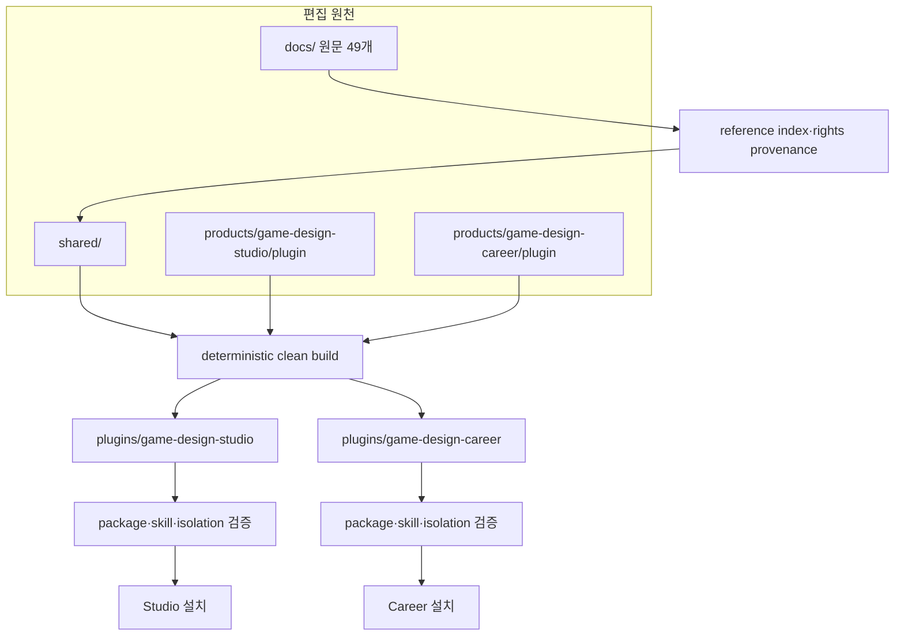
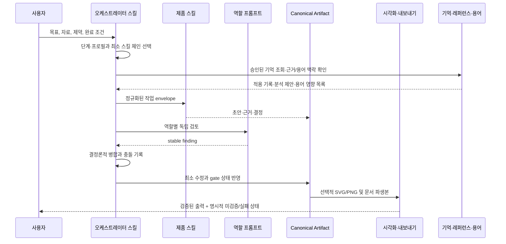

# 플러그인 스위트 아키텍처

## 결정

Game Design Plugin Suite는 하나의 거대한 플러그인이 아니라 `game-design-studio`와 `game-design-career` 두 제품을 제공합니다. 공통 지식과 계약은 저장소에서 한 번 관리하고, clean build가 각 독립 패키지에 복제합니다.

이 구조의 핵심 불변 조건은 다음과 같습니다.

- 설치된 플러그인은 sibling 플러그인, `shared/`, `products/` 또는 저장소 절대 경로에 의존하지 않습니다.
- `plugins/`에는 symlink가 없고 package-relative 링크만 있습니다.
- 같은 package 경로를 공통 원천과 제품 overlay가 다른 bytes로 제공하면 덮어쓰지 않고 빌드가 실패합니다.
- 배포 스냅샷은 현재 원천과 byte-for-byte 일치해야 합니다.
- 제품 하나를 설치·제거해도 다른 제품의 상태를 바꾸지 않습니다.

## Source에서 설치 패키지까지



### 편집 책임

| 영역 | 책임 | 직접 편집 여부 |
| --- | --- | --- |
| `docs/` | 사용자 제공 원문과 설계·아키텍처 문서 | 원문 변경은 provenance 갱신과 함께 수행 |
| `shared/` | 지식, export 계약, 책임 게이트, hook, runtime, Skillstead | 예 |
| `products/game-design-studio/plugin/` | Studio 스킬, 역할, 프로필, 템플릿, 제품 helper | 예 |
| `products/game-design-career/plugin/` | Career 스킬, 역할, rubric, 템플릿, 제품 helper | 예 |
| `plugins/game-design-*` | marketplace가 읽는 생성 스냅샷 | 아니오 |

`npm run build`는 clean staging에서 두 제품을 합성한 뒤 검증된 스냅샷을 교체합니다. 실패 시 반쪽짜리 package를 정상 결과로 남기지 않는 transaction/recovery 계약을 사용합니다.

## 독립 패키지 구조

두 패키지는 같은 상위 구조를 갖습니다.

```text
plugins/game-design-<product>/
├── .codex-plugin/plugin.json
├── skills/                         # Studio 24개 / Career 23개 설치 스킬
│   ├── <product-skill>/
│   │   ├── SKILL.md
│   │   ├── agents/openai.yaml      # 필요한 스킬에만 존재
│   │   ├── references/             # 필요한 스킬에만 존재
│   │   └── scripts/                # 필요한 스킬에만 존재
│   └── svg-infographic/            # Skillstead 0.8.3
├── agents/                         # Studio 12개 / Career 10개 역할 프롬프트
├── hooks/hooks.json
├── scripts/                        # 공통·제품 실행 스크립트 30개
├── references/
│   ├── shared/                     # Core, Current, export, 책임 게이트
│   ├── source/docs/                # 원문 49개
│   └── <product references>
├── assets/
│   ├── product-mark.svg
│   ├── templates/                  # 제품별 15개
│   └── shared/templates/
├── LICENSE
├── THIRD_PARTY_NOTICES.md
├── README.md
└── BUILD-MANIFEST.json
```

`BUILD-MANIFEST.json`은 suite distribution build 결과입니다. 파일 경로, 크기, SHA-256과 전체 tree hash로 snapshot의 재현성을 확인합니다.

## 제품별 확장점

### Studio

- 제품 스킬: 비전, 시스템, 콘텐츠, 플레이어 경험, 경제·LiveOps, 제작, 검토, 컷씬 프리프로덕션, 도식화, export와 오케스트레이션
- 역할: lead, system/economy, content/narrative, UX/accessibility, LiveOps/data, production feasibility
- 프로필: `universal-core`를 항상 먼저 적용하고 `live-service-rpg`, `mobile`, `pc-console`을 canonical order로 합성
- 제품 helper: 프로필 합성, 역할 finding 병합, 시나리오 검증, source document 공개 재배포 가드, 시각화 증거, export job 검증
- 템플릿: 비전, loop, 시스템·예외, 데이터, 콘텐츠, UX, 경제, LiveOps, 생산·검토 15개

프로필은 장르 관습을 사실로 만들지 않습니다. 추가 질문, 필수 섹션, evidence trigger와 책임 게이트를 더합니다. 프로필이 충돌하면 자동 타협 대신 decision record를 요구합니다.

### Career

- 제품 스킬: 경력 맵, 채용 조사, 포트폴리오, 역기획, 면접, 리뷰, 성장, 도식화, export와 오케스트레이션
- 역할: career strategist, mentor, portfolio reviewer, reverse-design critic, interview coach, evidence auditor
- 경력 단계: `entry`, `new-hire`, `junior-growth`, `transition`; 불명확하면 `unclear`
- 제품 helper: 역할 finding 병합, 시나리오 검증, 현재 채용 evidence, 시각화 상태, export job 검증
- 템플릿: 역할·역량, 공고 근거, 포트폴리오, 역기획, 면접, 성장·전환 15개

Career는 작은 채용 표본을 시장 전체로 일반화하지 않고, 학력·나이·전공·배경만으로 경로를 순위화하지 않습니다.

## 공통 설계 지능 모듈

두 제품은 같은 원천에서 빌드된 프로젝트 기억, 레퍼런스 분석과 용어 사전 런타임을 각 설치 패키지 안에 독립적으로 포함합니다. 이 모듈들은 Canonical Artifact나 사람 결정을 대신하지 않습니다.

| 모듈 | 입력과 처리 | 결과와 권한 경계 |
| --- | --- | --- |
| 프로젝트 기억 | 플레이테스트·검토·학습 결과에서 출처와 적용·제외 범위를 가진 후보를 만들고, 현재 출처와 만료 상태를 다시 확인 | 이름이 기록된 사람이 승인한 기억만 다음 작업에 적용. 저장소 문제나 opt-out이면 원래 작업은 기억 없이 계속 |
| 레퍼런스 인텔리전스 | 분석 브리프(brief), 증거 등록부, 시스템 지도, 핵심 반복(Core Loop)·장기 반복(Meta Loop), 경제·사용자 경험(UX)·운영 구조와 미확인 질문을 분리 | 관찰·추론·설계 전환 제안을 구분. `adopt`, `adapt`, `reject`, `hold`는 검토 대기 제안이며 자동 승인하지 않음 |
| 용어 사전 | 한국어·영어 후보, 정의, 문서별 출현 위치와 영향 목록을 계산 | 이름이 기록된 사람의 결정과 정확한 스냅샷 없이 용어집을 갱신하거나 본문을 자동 치환하지 않음 |

Studio의 컷씬 프리프로덕션은 이 공통 모듈과 별도인 제품 경로입니다. `style-master → reference-masters → keyframes → storyboard` 순서를 따르고, 프롬프트만 제공할지·비용만 계산할지·승인 뒤 생성할지를 분리합니다. 한글 픽셀 텍스트가 없으면 호스트 `image_gen`을 먼저 사용하고, 한글이 필수일 때만 explicit OpenAI `gpt-image-2`를 사용합니다. 유료 품질은 `low` 기본, `medium` 선택, `high` 예외 원칙을 따릅니다. 현재 견적, 이름이 기록된 승인과 선행 단계(wave) 완료가 없으면 생성 제공자(provider)를 호출하지 않습니다.

## 런타임 오케스트레이션



### 역할 자산의 실제 의미

`agents/*.md`는 네이티브 플러그인 component manifest가 아닙니다. 각 파일은 역할의 책임, 입력, 검토 질문, 금지 행동, blocker 경계와 출력 계약을 정의합니다. 오케스트레이터는 호스트 capability에 맞춰 이 프롬프트를 전달합니다.

- 병렬 subagent 지원: 서로 독립적인 역할을 최대 3개 병렬 실행
- 병렬 지원 없음: 같은 역할과 질문을 고정 우선순위로 순차 실행
- 두 경로 모두: finding을 도착 순서가 아니라 stable key와 role priority로 병합

따라서 네이티브 자동 발견은 성능 최적화이지 정확성의 필수 조건이 아닙니다.

## Hooks

plugin manifest에는 hook 필드를 추가하지 않고 기본 발견 경로 `hooks/hooks.json`을 사용합니다.

### SessionStart

`scripts/capability-probe.mjs`는 Node, Chromium, LibreOffice와 문서·PDF·프레젠테이션 capability를 읽기 전용으로 확인합니다. 선택 renderer가 없어도 설계 작업과 Canonical MD는 계속할 수 있습니다.

### Stop

`scripts/stop-artifact-review.mjs`는 plugin 식별자와 final artifact sentinel이 있는 active artifact만 검사합니다. 검증이 실패하면 한 번만 교정 패스를 요청하고 재진입 상태에서는 다시 차단하지 않습니다. hook이 비활성화되어도 명시적 validator와 스킬 완료 조건으로 같은 계약을 적용할 수 있습니다.

## 검증 경계

| 단계 | 증명하는 것 |
| --- | --- |
| reference/evidence audit | 원문 인덱스, 최신성, source mapping과 drift |
| vendor hash | Skillstead 0.8.3 원본과 lock의 byte 일치 |
| unit/contract/product/E2E | schema, 스킬, 역할, hook, 제품 시나리오 |
| 기억·레퍼런스·용어 안전성 | 출처 변경(drift), 승인 권한, 보수적 근거 판정, 원문 무치환과 복구(rollback) |
| 컷씬 생애주기(lifecycle) | 프롬프트 전용(prompt-only), 비용·상한(cap), 이름이 기록된 승인, 순차 단계(wave), 부분 재시도와 연속성 관문(continuity gate) |
| clean build drift | 편집 원천과 committed snapshot 일치 |
| official package/skill validation | plugin manifest와 모든 스킬 구조 |
| isolation smoke | 저장소와 sibling 없이 단독 package 실행 |
| marketplace smoke | 임시 Codex 환경에서 등록·설치·실제 installed skill 증거·제거 |
| format verification | MD/PDF/DOCX/PPTX/SVG/PNG 구조와 렌더 QA |

기본 검증은 `npm run validate`, release gate는 `npm run validate:release`입니다. marketplace smoke는 로컬 인증이 필요한 별도 장기 검증이므로 `npm run smoke:marketplace`로 분리합니다.

### CI 레인

`.github/workflows/ci.yml`이 pull request와 `main` push에서 두 레인을 실행합니다. 레인마다 결과가 의미를 갖는 운영체제가 다르므로 매트릭스도 다릅니다.

| 레인 | 내용 | 러너 | 인증 |
| --- | --- | --- | --- |
| 오프라인 게이트 | `node tooling/validate-suite.mjs`를 네 스테이지 `--skip`과 함께 실행 | `ubuntu-latest` | 불필요 |
| 설치 게이트 | `@openai/codex` 설치 후 `node tooling/install-roundtrip.mjs --require-codex` | `ubuntu-latest`, `windows-latest` | 불필요 |

설치 게이트는 한글과 공백을 포함한 `CODEX_HOME`·workspace, `LANG=C`, `LC_ALL=C` 아래에서 두 제품을 실제 설치하고 재설치한 뒤 README, `plugin.json`, 대표 스킬을 source와 SHA-256으로 대조합니다. 경로는 NFC 정규화 후 비교하며, 명령 출력에 `U+FFFD`가 있으면 실패합니다. 모델을 호출하지 않으므로 인증이 필요 없습니다. 로컬에서는 `npm run verify:install-roundtrip`으로 같은 검증을 돌리며, `codex`가 없으면 `SKIPPED`를 보고하고 종료합니다.

CI에서 실행할 수 없는 스테이지는 네 개입니다. 공식 plugin 검증기와 skill quick 검증기는 Codex 설치 산출물을 요구하고, format smoke는 `package.json`에 없는 호스트 제공 모듈을 임포트하며, diagram render drift는 headless Chromium이 호스트 폰트로 그린 PNG 바이트를 비교하므로 그 PNG를 커밋한 기계에서만 의미가 있습니다. SVG 비교는 결정적이므로 모든 환경에서 그대로 유지됩니다. `validate-suite`는 이 넷을 조용히 통과시키지 않고 `SKIPPED`로 기록하며, 스킵이 하나라도 있으면 release readiness를 `INCOMPLETE`로 끝냅니다.

**릴리스 전에 이 네 스테이지는 로컬에서 반드시 실행합니다.** `npm run validate:release`는 `--skip`을 거부하므로 스킵한 채로 release gate를 통과할 수 없습니다. 인증이 필요한 라이브 스모크 `npm run smoke:marketplace`도 로컬 수동 실행으로 남습니다.

#### 오프라인 게이트를 Linux로 한정한 이유

Windows 오프라인 레인은 만들어 돌려 보고 결과를 읽은 뒤 의도적으로 뺐습니다. 실패 272건은 한 가지 문제가 아니라 성격이 다른 세 부류이고, 그중 둘째·셋째는 CI 변경에 끼워 넣을 수 있는 성질이 아닙니다.

| 부류 | 실패 수 | 내용 |
| --- | --- | --- |
| 출하 코드 결함 | 77 | `shared/scripts/lib/load-workspace-env.mjs`는 `O_NOFOLLOW`가 정수가 아니면 즉시 거부하는데 Node는 Windows에서 이 상수를 정의하지 않습니다(21건). `shared/scripts/lib/safe-memory-store.mjs`의 `syncDirectory`는 디렉터리를 열어 `fsync`하며 Windows는 `EPERM`을 돌려줍니다(56건). |
| 테스트·도구의 POSIX 가정 | 약 65 | `/bin/sh`와 `/tmp` 하드코딩, 드라이브 문자가 겹쳐 `D:\D:\...`가 되는 경로 결합, `chmod`가 무의미한 곳에서 mode 비트 변화를 기대하는 단정, `0600` 가정. |
| 위 둘의 파급 | 나머지 | 앞의 실패가 만든 상태를 뒤 단정이 다시 읽으며 생긴 연쇄. |

첫 부류는 두 하드닝 원시 함수를 Windows에서 성립하는 형태로 재설계해야 하고, `O_NOFOLLOW`에 대응하는 플래그를 Node가 노출하지 않으므로 `lstat` 후 열고 identity를 재확인하는 방식으로 바꿔야 합니다. 이는 자체 설계 판단이 필요한 별도 작업입니다. **design memory와 image config는 그때까지 Windows에서 동작하지 않습니다.**

Windows에서 실제로 성립해야 하는 계약은 Windows checkout과 설치가 다른 플랫폼과 같은 바이트를 만든다는 것이고, 이는 설치 게이트가 매 실행마다 Windows에서 직접 증명합니다.

## 번들 스킬 최신 유지

번들 스킬 셋(skillstead·archify·im-not-ai)은 제품 패키지 안에 벤더링됩니다. 사용자가 따로 설치하거나 올릴 수 있는 대상이 아니고, 새 스위트 릴리스가 실어 나릅니다.

권고와 승인은 분리되어 있습니다. 검사는 아무것도 바꾸지 않고, 적용은 사람이 답한 뒤에만 일어납니다.

| 명령 | 하는 일 |
| --- | --- |
| `npm run check:updates` | 세 상류의 최신 여부를 JSON으로. current 0, outdated 2, unknown 1 |
| `npm run check:updates:report` | 같은 검사를 사람이 읽는 권고문으로 |
| `npm run update:vendors` | 권고를 보이고 `업데이트를 진행할까요? [y/N]`를 물은 뒤, 승인 시에만 적용 |
| `npm run check:vendor-refs` | 제품 문서의 버전 표기가 벤더 락과 어긋나지 않았는지 |

`update:vendors`는 승인 뒤 벤더 트리 갱신, 제품 문서 재작성(`tooling/sync-vendor-references.mjs`), 업데이트 매니페스트 재생성, 패키지 스냅샷 재빌드까지 한 번에 합니다. 대화형 터미널이 아니면 `--yes` 없이는 적용하지 않고 멈춥니다. `--validate`를 주면 릴리스 검증까지 이어서 돌립니다.

주간 워크플로(`.github/workflows/check-bundled-skill-updates.yml`)는 검사만 하고 요약에 권고문을 남깁니다. 상류에 새 릴리스가 있다는 사실은 빌드 실패가 아니라 권고이므로 `outdated`로는 실패하지 않고, 검사 자체가 답을 못 낸 `unknown`에서만 실패합니다. 권한은 `contents: read`로 닫혀 있고 워크플로는 어떤 업데이트 명령도 실행하지 않습니다.

버전 리터럴은 한 곳에서만 움직입니다. 벤더 락이 원천이고, 나머지는 락에서 씁니다.

| 위치 | 어떻게 따라오는가 |
| --- | --- |
| `products/*/plugin/THIRD_PARTY_NOTICES.md`, 같은 곳 `README.md`, `polish-game-design-writing/SKILL.md` | `tooling/sync-vendor-references.mjs`가 락에서 다시 씀. `validate-suite`의 `vendor references` 스테이지가 drift를 막음 |
| `visualize-*/scripts/run-skillstead.mjs`의 저장소 fallback 경로 | 락의 `tree.root`를 읽어 해석. 이 구간은 `// #region repository-only` 마커로 감싸여 있고 빌드가 패키지 사본에서 통째로 잘라냄 |
| `validate-visualization-evidence.mjs`의 `TRUSTED_RUNTIME_DIGESTS` | linter·renderer는 벤더 스크립트의 sha256, wrapper는 제품 소스에서 마커 구간을 잘라낸 바이트의 sha256. 셋 다 `sync-vendor-references.mjs`가 씀 |
| `.gitattributes`의 벤더 경로 | 버전 자리를 `*` glob으로 둠 |
| `shared/updates/installed-components.json` | `tooling/generate-update-manifest.mjs`가 락에서 생성 |
| `plugins/**` | `npm run build`가 락에서 벤더 트리를 골라 담음(`tooling/lib/vendor-components.mjs`) |

im-not-ai만 두 번째 증인을 둡니다. `tooling/vendor-pins/im-not-ai.json`이 태그·커밋·라이선스 해시와 파일 15개의 sha256을 들고 있고, `--check`는 벤더 락을 이 핀과 대조합니다. 락이 스스로를 승인하지 못하게 하는 장치입니다. 예전에는 이 표가 `tooling/sync-im-not-ai.mjs` 소스 안에 있어서, 업그레이드를 하려면 그 업그레이드를 지키는 검사를 통과시키기 위해 해시 15개를 손으로 옮겨 적어야 했습니다. 지금은 `--update`가 핀도 함께 씁니다. 사람이 PR diff에서 해시 변화를 읽는다는 성질은 그대로입니다.

테스트 fixture도 같은 규칙을 따릅니다. `tests/unit/diagram-skill-vendor.test.mjs`는 상류 정체성(저장소·라이선스·skillPath·태그 형태)만 리터럴로 두고 태그·커밋·파일 수는 설치된 락에서 읽습니다. `tests/unit/im-not-ai-vendor.test.mjs`는 핀에서, `tests/unit/capability-probe.test.mjs`는 `installed-components.json`에서, 두 `writing-quality.test.mjs`는 im-not-ai 락에서 읽습니다. `tooling/isolation-smoke.mjs`도 기대 파일 수를 저장소 락에서 가져옵니다. 예전에는 이 값들이 전부 복사본이어서, 업그레이드 하나가 업그레이드와 무관한 이유로 여섯 파일을 깨뜨렸습니다.

im-not-ai의 벤더 파일 목록은 닫힌 allowlist입니다. 상류에 참조 파일이 새로 생겨도 업그레이드가 자동으로 가져오지 않습니다. 대신 `--update`가 상류 디렉터리를 조회해 핀에 없는 파일을 `unpinnedUpstreamFiles`로 보고하므로, 넣을지는 사람이 정합니다.

### skillstead v0.10.0은 아직 못 올립니다

상류 `svg-infographic/v0.10.0`은 폰트 3개(HiMelody 12MB, Pretendard 2종)와 PNG 1개를 함께 배포합니다. 트리가 55개 283KB에서 319개 18MB로 늘어납니다.

`tooling/lib/tree-audit.mjs`는 패키지에 들어가는 **모든 파일을 UTF-8로 디코딩**하고 텍스트 안전성 검사를 겁니다. 지금 두 제품 패키지에는 바이너리가 한 개도 없고, 바이너리를 허용하는 경로도 없습니다. 그래서 v0.10.0을 벤더링하면 `npm run build`가 `skills/svg-infographic/assets/fonts/HiMelody-Regular.ttf is not valid UTF-8`로 멈춥니다.

올리려면 결정 두 개가 필요합니다.

1. 패키징 감사에 바이너리 레인을 만들 것인가. 벤더 락이 해시로 선언한 파일에 한해 텍스트 검사를 건너뛰는 형태가 될 텐데, 이는 하드닝된 게이트를 완화하는 변경입니다.
2. 제품 패키지가 제품당 18MB 늘어나는 것을 받아들일 것인가. 늘어나는 264개 파일의 대부분은 상류의 테스트 fixture와 `.test.mjs`입니다.

렌더 드리프트는 확인했습니다. v0.10.0 렌더러는 기존 도식 73장을 바이트 동일하게 재현합니다. 즉 막는 것은 렌더 결과가 아니라 패키징 계약뿐입니다.

## 0.2.0 릴리스

두 제품이 `0.1.1`에서 `0.2.0`으로 올라갔습니다. minor를 올린 이유는 설치 스킬이 늘고 진입 경로가 바뀐 것입니다.

| 변경 | 내용 |
| --- | --- |
| 신규 스킬 3개 | `upgrade-game-design-suite`, 그리고 두 제품의 대표 진입 스킬 `game-design-studio`·`game-design-career` |
| 진입 경로 | 설치·업데이트 안내가 Git 마켓플레이스와 업그레이드 스킬을 1순위로 제시합니다. 로컬 마켓플레이스는 저장소를 직접 고칠 때의 대안입니다 |
| shared 도식 3개 추가 | `suite-entry-routing-flow`, `suite-handoff-ownership-flow`, `suite-update-approval-flow` |
| shared 도식 1개 확장 | `app-cli-install-flow`에 UTF-8 preflight와 마켓플레이스 종류 band |

버전의 유일한 원천은 `products/*/plugin/.codex-plugin/plugin.json`입니다. `plugins/**` snapshot, 두 `BUILD-MANIFEST.json`, `shared/updates/installed-components.json`은 생성물이므로 `npm run build`와 `tooling/generate-update-manifest.mjs`로만 바뀝니다. `tooling/marketplace-smoke.mjs`의 `RELEASE_PLUGIN_VERSION`과 `tooling/isolation-smoke.mjs`의 매니페스트 비교값은 그 원천을 따라가는 상수입니다.

`shared/updates/suite-release.lock.json`의 `installedTag`는 두 제품 버전과 `v` 접두사만 다르게 일치해야 하며, 어긋나면 `loadSuiteRelease`가 `SUITE_VERSION_MISMATCH`로 검증을 멈춥니다.

같은 파일의 `commit` 필드는 **릴리스 내용이 확정된 커밋**을 가리킵니다. 파일이 자기 커밋 해시를 담을 수 없으므로 태그가 붙는 커밋 자체를 적을 방법이 없기 때문입니다. `installed-components.json`의 다른 구성 요소(skillstead·archify·im-not-ai)는 `commit`이 상류 태그가 가리키는 실제 커밋이고 벤더링에 쓰이지만, `game-design-suite` 행의 `commit`은 최신 판정에 쓰이지 않고 40자 hex 형식 검사만 받습니다(`shared/scripts/check-game-design-updates.mjs`). 최신 판정은 `installedTag`만으로 합니다. 한 열이 두 뜻을 갖는다는 사실을 이 문단이 기록합니다.

## 관련 문서

- [루트 README](../README.md)
- [내보내기 파이프라인](export-pipeline.md)
- [지식·근거 아키텍처](knowledge-and-evidence.md)
- [Game Design Studio](../plugins/game-design-studio/README.md)
- [Game Design Career](../plugins/game-design-career/README.md)
