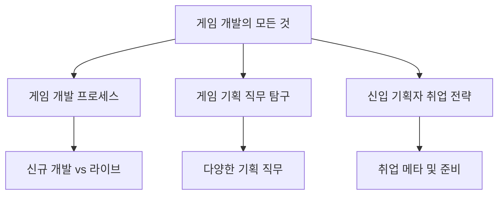

## 1. 개요

### 1.1 서론

- 게임 기획자가 되고 싶다는 꿈을 가진 당신, 어떤 게임을 만들고 싶으신가요? 혹은 어떤 게임 회사에 들어가고 싶으신가요? <mark>게임 개발의 세계는 생각보다 훨씬 넓고 다양하며, 그 안에서 자신의 꿈을 펼칠 수 있는 길은 여러 가지</mark>입니다.
- 이 보고서는 게임 개발 프로세스부터 다양한 기획 직무, 그리고 신입 기획자로 성공적으로 취업하기 위한 전략까지, 게임 기획 분야의 전반적인 내용을 종합적으로 다룹니다. 여러분이 게임 업계에서 어떤 역할을 하고 싶은지, 그리고 그 꿈을 어떻게 현실로 만들 수 있을지 구체적인 가이드라인을 제시합니다.

### 1.2 전체 구조

## 2. 게임 개발 프로세스: 아이디어에서 출시까지

### 2.1 게임 개발 단계별 이해

- 게임 개발은 크게 프리프로덕션, 프로덕션, 포스트 프로덕션 단계로 나뉩니다. 프로젝트 규모나 특성에 따라 일부 단계가 생략되거나 얼리 액세스 같은 추가 단계가 포함될 수 있습니다.

- **프리프로덕션 단계**:
  - 신규 게임의 콘셉트, 타겟 유저, 핵심 재미 요소, 핵심 모드 등을 구상합니다. 
  - 개발 환경, 필요한 인력, 전체 일정을 계획하고 준비합니다. 
  - 가장 중요한 것은 프로토타입을 제작하여 게임의 핵심 재미를 미리 검증하는 것입니다. 

- **프로덕션 단계**:
  - 마일스톤 단위로 프로그램 개발을 진행합니다. 
  - 마일스톤은 개발 진행 중 특정 기준에 따라 중간 점검을 하는 시점을 의미하며, 보통 4주에서 8주 사이로 설정됩니다. 
  - 회사 내부 인력만으로 게임의 정상 작동 여부를 검증하는 알파 테스트를 진행합니다. 
  - 제한된 유저층에게 공개하여 게임을 검증하는 포커스 그룹 테스트(FGT)를 합니다. 
  - 클로즈드 베타 테스트(CBT)를 통해 선발된 제한된 유저층에게 비공개로 게임을 선보이고 반응을 검증합니다. 
  - 오픈 베타 이전에 서버 수용 능력을 측정하는 스트레스 테스트를 진행하기도 합니다. 
  - 테스트 피드백을 바탕으로 퀄리티를 높이기 위한 추가 개발을 진행합니다. 이 단계에서는 게임의 큰 틀을 바꾸기 어렵습니다. 
  - 각 단계에서 목표한 허들을 통과하지 못하면 프로젝트가 중단될 수 있습니다. 

- **포스트 프로덕션 단계**:
  - 모든 유저를 대상으로 오픈 베타 테스트를 진행합니다. 
  - 정식 출시 이전에 유저들의 실제 이용 및 수용 형태에 대한 정보를 얻기 위해 소프트 런칭 단계를 추가하기도 합니다. 
  - 정식 출시 이후에는 추가 콘텐츠 업데이트나 시스템 개선 패치를 진행하는 업데이트 단계에 돌입합니다. 

### 2.2 마일스톤별 개발 내용 예시 (중규모 수지형 RPG 프로젝트)

- 팀 인원 40명 규모의 중규모 수지형 RPG 프로젝트를 예시로 들면, 각 마일스톤마다 다음과 같은 과정을 거쳐 게임을 완성해 나갑니다. 

- **초기 **마일스톤:
  - 개발에 필요한 뼈대를 세팅합니다. 
  - 코어한 재미 요소와 규칙을 본격적으로 구현합니다. 
  - 향후 콘텐츠 제작에 필요한 각종 툴을 제작합니다. 

- **마일스톤 중반**:
  - 코어 시스템 구현이 어느 정도 완성되면, 메타 시스템(코어 시스템 외 부분) 개발을 시작합니다. 
  - 게임의 데드루프(반복 플레이 구조)를 완성해 나갑니다. 
  - 기존 시스템 뼈대를 바탕으로 대량의 콘텐츠를 생산합니다. 

- 마일스톤** 후반**:
  - 밸런스 작업을 진행합니다. 
  - 각종 시스템 폴리싱(다듬기) 작업을 합니다. 
  - 라이브 운영에 필요한 운영 툴 등 시스템을 개발하기도 합니다. 

### 2.3 좋은 신규 게임 개발팀의 특징

- 만들고자 하는 게임에 대한 방향성이 뚜렷합니다. 
- 런칭 및 성공에 대한 확신을 뒷받침할 구체적인 근거가 있습니다. 
- 충분한 개발 비용과 합리적으로 계획된 일정이 확보되어 있습니다. 
- 효율적인 프로세스와 개발 환경을 갖추고 있습니다. 
- 우수한 인재와 개발력을 보유하고 있습니다. 
- 핵심 마일스톤마다 목표 완성도에 안정적으로 도달합니다. 
- FGT 및 CBT 반응이 좋아 런칭에 대한 기대감이 높습니다. 
- 퍼블리싱, 업데이트, 글로벌 운영 등에 대한 계획이 수립되어 있습니다. 

### 2.4 피해야 할 신규 게임 개발팀의 특징

- 게임성에 대한 확신 없이 개발에 착수하며, 주변 의견을 무시하거나 계속해서 개발 방향을 바꾸는 경우가 많습니다. 
- 목표 달성에 턱없이 부족한 개발 비용, 비현실적인 일정, 비효율적인 개발 프로세스를 가지고 있습니다. 
- 개발 능력 부족으로 인해 개발 기간 대비 퀄리티가 현저히 떨어집니다. 
- 계획된 런칭 일정을 지키지 못하고 계속 미룹니다. 
- 퍼블리셔 확보 실패, 팀 구성원 잦은 변경, 투자금 유치 실패 등의 외부 악재가 발생하기도 합니다. 
- 빠른 서비스 종료를 목표로 하는 듯한 느낌으로 런칭하는 경우가 있습니다. 

## 3. 게임 기획 직무 탐구: 어떤 일을 할까?

### 3.1 게임 기획자의 역할과 중요성

- 게임 기획자는 게임의 재미, 콘셉트, 규칙, 목표, 스토리 등을 계획하고 설계하는 핵심적인 역할을 담당합니다. 
- 플레이 경험, 흥미로운 과제, 몰입 요소를 제공하며, 아이디어 구상부터 개발, 완성, 유지보수까지 필요한 모든 것을 설계하고 집행합니다. 
- 플레이어들의 높아진 눈높이에 맞춰 게임의 재미를 전문적으로 연구하고 설계하기 위해 게임 기획자가 필요합니다. 

### 3.2 신입 게임 기획자의 업무

- 회사마다 다르지만, 처음부터 중요한 실무를 맡기기보다는 다음과 같은 업무를 수행하는 경우가 많습니다. 
  - 레퍼런스 게임, 경쟁작, 신작 게임 분석 및 문서화 
  - 게임 공식 카페, 유튜브, 포럼 등에서의 글로벌 반응 분석 및 정리 
  - 게임 내 데이터, 스크립트 입력 및 수정 등 단순 반복 작업 
  - 번역팀 등 외부 부서와의 문서 전달 역할 
  - 특정 장비 조합으로 게임 클리어 후 스탯 변경 후 재클리어 등 인간 시뮬레이터 역할 
  - 각종 버그 테스트 및 버그 리포트 작성 
  - 게임 개선 제안서 작성 (제안이 채택되지 않을 수도 있음) 
- 이러한 업무를 충실히 수행하면 신뢰가 쌓여 점차 중요한 일감을 받게 됩니다. 
- 신입 기획자를 채용하는 주된 이유는 단순 반복 업무 처리, 입맛에 맞게 키워 쓰기 위함, 그리고 팀에 젊은 피를 수혈하기 위함입니다. 

### 3.3 게임 기획 직무의 종류와 역할

- 게임 기획은 크게 시스템 기획, 콘텐츠 기획, 밸런스 기획, BM 기획, 이벤트 기획 등으로 나눌 수 있습니다. 

- 시스템** **기획자:
  - 게임이 돌아가게 하는 모든 규칙들의 세트를 정의하고 체계화합니다. 
  - 게임의 목표와 규칙을 만들고, 규칙들이 서로 잘 맞물리도록 설계합니다. 
  - 게임 내 모든 규칙들이 체계적이고 논리적이며 합리적인지 확인하고 예외 상황에 대한 대응 방안을 고민합니다. 
  - 게임 기획 관련 데이터 및 리소스 텍스트들의 장기적인 관리 방안과 데이터 구조를 설계합니다. 
  - **필요 역량**: 논리력, 사고력, 문제 해결력, 객관적 판단 능력, 추상적 개념을 구체화하는 능력, 설득 및 커뮤니케이션 능력, 컴퓨터 공학 지식. 
  - **전망**: 게임 장르와 무관하게 필수적인 포지션으로 수요가 많습니다. 콘텐츠 기획을 겸하는 경우도 많습니다. 

- 콘텐츠 기획자:
  - 시스템 기획자가 만든 뼈대 위에서 다양한 콘텐츠(장비, 캐릭터, 퀘스트 등)를 매력적이고 개성 있게 만들어냅니다. 
  - **설정, 시나리오, **내러티브 기획자: 게임 세계관, 시나리오, 캐릭터, 배경, 맵 콘셉트 등을 구상하고, 용어집 관리, 게임 내 텍스트 작성, 번역 검수, 시네마틱 콘티 제작, 성우 녹음 디렉팅 등을 담당합니다. 
  - **필요 역량**: 창의적인 장문 작성 능력, 트렌드 및 타겟 유저 취향 이해, 게임 시스템 기반 이해도, 개연성 있고 짜임새 있는 설계 능력. 
  - **전망**: 천재적인 재능이 아니라면 시스템 및 콘텐츠 기획까지 겸해야 경력 단절을 막을 수 있습니다. 
  - 캐릭터 액션 전투 기획자: 캐릭터 콘셉트, 역할, 스킬, 액션, 타격감 연출 등을 기획하고 엔진 작업을 직접 하기도 합니다. 
  - **필요 역량**: 창의력, 미적 감각, 다양한 게임 경험, 엔진 툴 사용 능력, 시각화 능력. 
  - **전망**: 프로젝트 장르에 따라 역할이 달라지며, 항상 필요한 직종으로 수요가 많습니다. 
  - **월드, 몬스터, **레벨 기획자: 플레이 공간(마을, 던전 등) 제작, 플레이 동선 설계, 몬스터 AI, 던전 기믹, 퍼즐 요소 기획 등을 담당합니다. 
  - **필요 역량**: 창의력, 3D 공간 감각, 미적 감각, 건축/토목 지식. 
  - **전망**: 신입 경쟁이 치열할 수 있으나, 거시적인 시야를 가진 레벨 기획자는 수요가 높습니다. 

- 밸런스** **기획자:
  - 전투, 경제, 성장 밸런스를 설계하고, 필요한 공식 및 숫자 산출, 데이터 테이블 설계 및 관리, 시뮬레이터 제작 등을 담당합니다. 
  - **필요 역량**: 수학적 감각, 지표 분석 능력, 엑셀, VBA, SQL 등 툴 사용 능력, 파이썬 등 데이터 핸들링 언어. 
  - **전망**: 게임 밸런스가 아주 중요한 경우가 아니라면 시스템/콘텐츠 기획자가 병행하는 경우가 많습니다. 시스템 경력 선행을 추천합니다. 

- BM** (**비즈니스 모델**) **기획자:
  - 게임 콘텐츠의 유료화 및 비즈니스 모델을 설계하고, 상품 관련 데이터 작업, 판매 촉진 이벤트 기획 등을 수행합니다. 
  - 시장 및 유저 반응 분석과 대응을 담당합니다. 
  - **필요 역량**: 게임 산업 트렌드 및 비즈니스 이해도, 서비스 중인 게임 시스템/콘텐츠 운영 이해도, 유저 심리 및 수요 예측 능력. 
  - **전망**: 복잡한 게임이 아니라면 시스템/콘텐츠 기획자와 병행하는 경우가 많아 전망은 희망적입니다. 

- **이벤트 **기획자:
  - 다양한 게임 내 이벤트를 기획하고, 이벤트 관련 데이터 작업, 지표/시장/유저 반응 분석 및 대응을 합니다. 
  - **필요 역량**: 게임 산업 및 사회 전반 트렌드 이해도, 서비스 중인 게임 시스템/콘텐츠 운영 이해도, 유저 유인 및 정착을 위한 이벤트 기획 및 일정 수립 능력. 
  - **전망**: 런칭 이후 운영이 중요해지는 요즘 트렌드에 맞춰 수요가 많습니다. 

### 3.4 게임 개발 팀 구성

- 게임 개발 팀은 크게 프로그래머, 아트, 기획, QA, PM으로 구성됩니다. 
  - **프로그래머 팀**: 서버 팀(내부 구조 담당)과 클라이언트 팀(플레이어에게 보이는 면 담당)으로 나뉩니다. 
  - **아트 팀**: 원화, 모델링, 애니메이션, 이펙트, UI 팀 등으로 나뉩니다. 
  - **기획 팀**: 회사마다 다르지만 대개 시스템, 콘텐츠, 밸런스, 시나리오 등으로 구성됩니다. 
  - QA** (Quality Assurance)**: 게임 출시 전 품질 검증 및 버그 테스트, 재미 피드백을 수행합니다. 
  - PM** (**Project Manager**)**: 개발 PM(일정 관리, 내부 커뮤니케이션 총괄)과 사업 PM(마케팅, 운영 등 외부 커뮤니케이션 담당)으로 나뉩니다. 
- 이 외에도 프로젝트 전체를 총괄하는 프로듀서(PD), 게임 기획을 총괄하는 크리에이티브 디렉터, 고도의 기술이 필요한 기획 영역을 다루는 테크니컬 디자이너, 아트 전반을 총괄하는 아트 디렉터, 개발 및 기술을 총괄하는 테크니컬 디렉터 등이 있습니다. 

## 4. 신입 게임 기획자 취업 전략

### 4.1 신입 기획자 취업 메타의 변화

- **1세대 (모바일 게임 이전)**: 게임 취향, 창의력, 열정, 가치관, 커뮤니케이션 역량을 중심으로 평가했습니다. 포트폴리오로는 게임 제안서, 재미 요소 분석 문서 등이 활용되었습니다. 
- **2세대 (모바일 게임 전성기)**: 주 단위 업데이트를 위한 대량 콘텐츠 생산 능력, 즉시 실무 투입 가능한 인재를 선호했습니다. 실무 지식, 게임 시장 이해도, 문서 작성 능력을 중심으로 판단했으며, 역기획서, 신규 콘텐츠 기획서가 포트폴리오로 주로 사용되었습니다. 
- **3세대 (현재)**: AI 발전, 게임 업계 호황기 이후 채용 인원 감소 등으로 신입에게 요구하는 능력이 다양해지고 허들이 높아졌습니다. 학원발 양산형 포트폴리오로는 합격이 어려워졌습니다. 

### 4.2 3세대 신입 기획자에게 요구되는 역량

- 게임 플레이 경험에 기반한 통찰력 
- 엔진 등 기술 활용 능력 
- 해외의 경우 프로토타입 제작 능력 
- 이러한 역량을 보여주는 포트폴리오 
- 면접 시 합리적이고 논리적인 답변 도출 과정 

### 4.3 신입 기획자 취업 준비 전략

- **1. 스펙보다 경험**:
  - 학벌, 자격증, 어학 등 스펙보다는 게임 개발 경험, 엔진 사용 경험이 중요합니다. 
  - 프로그래머 수준의 개발 경험이 아니더라도, 기획한 것을 실현하고 재미를 검증하는 과정에서 얻은 고민, 생각의 흐름, 통찰이 중요합니다. 
  - 게임 메이커, 유즈맵, 로블록스 등을 활용한 경험도 좋은 스펙이 될 수 있습니다. 
  - 중요한 것은 '만들어 봤다' 수준에서 끝나지 않고, 그 과정에서 얻은 것을 문서로 정리할 수 있어야 합니다. 

- **2. 실무 역량 강화**:
  - 유니티/언리얼 엔진 활용 능력, 그래픽 툴(포토샵, 일러스트레이터 등) 사용 능력, 프로그래밍 지식, 엑셀/VBA/쿼리 활용 능력, 지표 분석 스킬, 데이터 테이블 지식 등을 보유하면 유리합니다. 
  - 이러한 실무 스킬은 보조적인 역할이지만, 기획적 역량을 직접적으로 증명해주지는 못합니다. 

- **3. 차별화된 **포트폴리오:
  - 학원 양산형 느낌이 나지 않는 독창적이고 유니크한 기획서를 준비해야 합니다. 
  - 단순 실무 능력(UI 그리기, 테이블 만들기)보다는 분석력, 통찰력을 어필해야 합니다. 
  - 플레이한 게임들에 대한 깊은 분석과 통찰을 담은 답변을 준비해야 합니다. 
  - 자신의 포트폴리오 내용과 연계된 꼬리 질문에 논리적으로 답변할 수 있어야 합니다. 
  - **피해야 할 포트폴리오**:
  - 재미 요소에 대한 구체적이고 논리적 증명이 없는 창작 게임 제안서 
  - 현실성 없는 아이디어 나열, 디테일 없는 무책임한 기획서 
  - 깊이 없는 수박 겉핥기식 분석서 (예: "미소녀와 밀리터리의 독특한 조화") 
  - 내부 구조 이해도가 부족한 얕은 수준의 역기획서 
  - 학원에서 써 준 듯한 양산형 기획서 

### 4.4 라이브 서비스 게임 팀 취업의 장점

- **신입에게 유리한 틈새 시장**: 경력자들은 런칭 커리어를 위해 신규 개발팀을 선호하는 경향이 있어, 라이브 서비스 중인 게임 팀에는 상대적으로 경력 지원자가 적습니다. 
- **안정적인 커리어**: 신규 개발팀의 런칭 실패 경험을 첫 커리어로 삼는 것을 방지할 수 있습니다. 
- **실무 경험**: 런칭이라는 허들을 넘은 게임 팀에서 배울 수 있는 성공 전략이 있습니다. 
- **체계적인 개발 프로세스**: 일정 관리, 의사 결정 방식, 개발 프로세스 등이 체계화되어 있어 안정적으로 실무를 익힐 수 있습니다. 
- **장기적인 시야**: 라이브 이후 및 글로벌 서비스까지 내다볼 수 있는 기획 능력을 키울 수 있습니다. 

### 4.5 추천 직무 및 장르

- **추천 직무**:
  - 시스템** **기획자: 어떤 게임이든 필수적이며 수요가 많고, 장르 편차가 적어 이직 시 선택의 자유가 넓습니다. 
  - 이벤트 기획자: 라이브 운영 게임에서 수요가 많으며, 게임 비즈니스 전반을 배울 수 있어 PD를 목표로 한다면 강력 추천됩니다. 
- **추천 장르**:
  - **모바일 게임**: 국내 게임 시장에서 가장 큰 비중을 차지하며 구인 글이 많습니다. 
  - RPG: 국내 모바일 게임 시장에서 가장 큰 비중을 차지하며 유지보수가 많이 필요해 기획자를 많이 뽑아 취업문이 비교적 넓습니다. 
- **주의할 장르**: 카지노, 고포류, VR/메타버스/NFT 등 신기술 중심 소규모 회사, 퍼즐 게임, FPS/AOS/스포츠/리듬 게임 등은 이직 시 선택지가 좁아질 수 있습니다. 

### 4.6 신입 기획자 채용의 이유와 어필 전략

- **채용 이유**:
  - 단순 반복 업무 처리 (성실함, 꼼꼼함 어필) 
  - 입맛대로 키워 쓰기 위함 (열정과 의지 어필) 
  - 팀에 젊은 피 수혈 (게임 플레이 경험, 참신한 아이디어 어필) 
- **성장 가능성 어필**:
  - 게임 기획 자격증이나 학벌보다는 게임 개발 및 출시 경험, 게임 잼 입상, 프로 게이머/스트리머 경험, 게임 관련 업계 재직 경험, 게임 관련 전공 등이 눈에 띄는 스펙이 될 수 있습니다. 
  - 하지만 이러한 스펙들은 합격에 결정적인 영향을 주기보다는 이력서를 돋보이게 하는 정도입니다. 
  - 가장 효과적인 전략은 게임 기획에 대한 열정, 간절함, 배움에 대한 의지를 보여주는 포트폴리오를 만드는 것입니다. 
  - 눈에 보이는 스펙이 부족하더라도 "마인드가 좋네, 앞으로의 발전이 기대되니 한번 키워 볼까?"라는 마음을 갖게 만드는 것이 중요합니다. 
