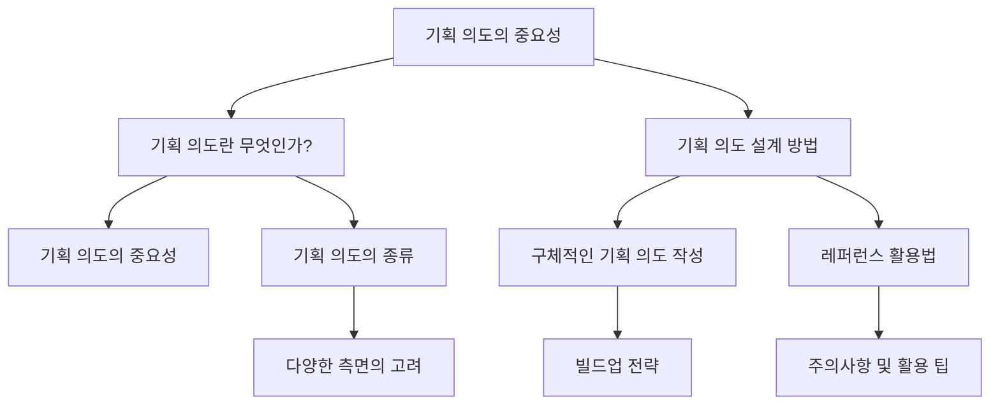

## 1. 게임 기획의 핵심: 기획 의도의 중요성과 설계 방법

### 1.1. 서론

- 게임 기획에서 '기획 의도'는 단순히 게임을 만들 이유를 넘어, 게임의 모든 시스템과 콘텐츠를 관통하는 핵심적인 나침반 역할을 한다. 
- 명확하고 구체적인 기획 의도는 게임이 '끔찍한 혼종'이 되는 것을 막고, 개발 과정에서의 혼란을 줄이며, 플레이어에게 일관된 경험을 제공하는 데 필수적이다. 
- 이 보고서는 게임 기획의 근간이 되는 기획 의도의 중요성을 강조하고, 효과적인 기획 의도 설계 및 전달 방법을 다양한 사례와 함께 제시한다.

### 1.2. 보고서 전체 구조

## 2. 기획 의도란 무엇이며 왜 중요한가?

### 2.1. 기획 의도의 정의

- 기획 의도는 단순히 '무엇을 만들고 싶은가'를 넘어, '왜 이것을 만들어야 하는가', '이것이 어떻게 작동해야 하는가'에 대한 구체적인 이유와 의미를 포함한다. 
- 게임 기획에서의 기획 의도는 '재미'라는 추상적인 개념을 구체화하고, 플레이어에게 제공하려는 가치와 경험을 명확히 하는 역할을 한다. 
- 이는 게임의 거시적인 방향성과 일치해야 하며, 게임에 긍정적인 영향을 줄 수 있어야 한다. 
- '밸류 플레이(Value Play)'라는 용어와 유사하게, 플레이어 입장에서 '이것을 해야 하는 이유'를 고민하는 것도 기획 의도의 중요한 부분이다. 

### 2.2. 기획 의도의 중요성

- **게임의 일관성 유지**: 명확한 기획 의도는 게임이 '끔찍한 혼종'이 되는 것을 방지하고, 시스템 간의 충돌과 모순을 줄여 플레이어에게 위화감 없는 경험을 제공한다. 
- **의사 결정의 기준**: 복잡하고 다양한 의견이 쏟아지는 개발 과정에서, 기획 의도는 '정답'에 가까운 결론을 내릴 수 있도록 돕는 기준점이 된다. 
- **협업 효율 증대**: 팀원들이 기획 의도에 공감하면 작업의 퀄리티가 높아지고, 기획자가 대안을 찾기 어려울 때도 함께 해결책을 모색할 수 있다. 
- **개발 **방향성** 제시**: 작업자가 개인적인 판단을 반영해도 되는 부분과 반드시 지켜야 할 부분을 명확히 구분하게 하여, 수동적인 개발을 방지하고 능동적인 참여를 유도한다. 
- **포트폴리오의 핵심**: 신입 기획 지망생에게 기획 의도는 자신의 분석력, 통찰력, 논리력을 보여주는 중요한 요소이며, 면접관들이 가장 주목하는 부분이다. 

### 2.3. 기획 의도에 대한 흔한 오해

- **단순한 제작 이유**: 기획 의도를 단순히 '내가 만들고 싶은 것을 만드는 이유'로만 생각하는 것은 오해다. 
- **포장 기술**: 기획 의도를 멋지게 포장하는 기술만을 배우려는 것도 피해야 할 부분이다. 
- **'재미'라는 추상적 목표**: '재미' 자체를 기획 의도로 삼으면 구체적인 실행 방안이 없어 오히려 재미와 멀어질 수 있다. 

### 2.4. 의도와 다르게 쓰이는 경우

- 현실의 발명품처럼 게임에서도 기획자의 의도와 다르게 플레이되거나 버그가 발생할 수 있다. 
- 이러한 의도치 않은 플레이 중 일부는 정식 기획 의도로 흡수되어 게임의 일부가 되기도 한다. (예: 스트리트 파이터의 모션 캔슬) 

## 3. 기획 의도 설계 방법

### 3.1. 기획 의도의 다양한 종류
게임 시스템이나 콘텐츠를 기획할 때 고려해야 할 다양한 측면이 있다. 

1. 구현 목적** 및 당위성**:
  - 왜 이 시스템/콘텐츠가 필요한가? 
  - 어떤 문제를 해결하기 위한 것인가? 
  - 기대되는 결과는 무엇인가? 
  - 유사 시스템/콘텐츠와의 차별점은 무엇인가? 
  - <em>사례:</em> '전설' 게임은 다른 MMO RPG와 다른 감정적 연결, 경외감, 서사적 경험, 멀티플레이 협동, 채팅 괴롭힘 방지를 기획 의도로 삼았다. 
  - <em>사례:</em> 마블 스냅은 플레이 시간이 짧은 게임을 만들고자 하는 책임감에서 시작되었다. 

2. 테마:
  - 게임 시스템/콘텐츠의 주제는 무엇인가? 
  - 플레이어에게 어떻게 전달할 것인가? 
  - <em>사례:</em> 중세 시대를 테마로 할 때, 게임 속 환경, NPC 복장, 대사 등을 통해 자연스럽게 전달한다. 
  - <em>사례:</em> 뽑기 상점 인터페이스를 NPC 주변에 버튼을 배치하는 방식으로 디자인하여 일반적인 모바일 RPG 상점 느낌에서 벗어났다. 
  - 모든 시스템에 강박적으로 테마를 녹일 필요는 없으며, 그럴 만한 이유가 있는 경우에 집중한다. 

3. 맥락** 고려**:
  - 플레이어는 누구인가? (타겟 유저) 
  - 플레이하는 이유는 무엇인가? 
  - 시스템/콘텐츠를 이용하려는 맥락은 무엇인가? (사용 시점, 의도, 직전/직후 상태) 
  - 전체 시스템/콘텐츠 중 현재 기획하는 것의 포지션과 비중은? 
  - <em>주의:</em> 모든 유저를 대상으로 설계하는 것은 피해야 한다. 특정 타겟층을 좁혀야 한다. 
  - <em>사례:</em> '트릭스터M'은 PC 온라인 게임 향수가 있는 20대 후반~30대 중반 유저를 대상으로 리니지 라이크 재미를 자연스럽게 학습시키는 것을 목표로 했다. 

4. 경험과 감정:
  - 플레이어가 무엇을 하게 되는가? 
  - 어떤 행동을 유도할 것인가? 
  - 이 경험을 통해 어떤 감정을 주고 싶은가? 
  - '재미'라는 모호한 표현 대신, 긴장감, 쾌감 등을 구체적으로 설계해야 한다. 
  - 반드시 긍정적인 감정일 필요는 없으며, 절망, 슬픔, 분노 같은 부정적인 감정을 유도할 수도 있다. 
  - <em>사례:</em> 티어 시스템을 통해 플레이어에게 어떤 경험과 감정을 주고 싶은지, 티어별 보상, 리셋 시스템 등이 의도하는 바를 구체적으로 질문한다. 

5. **의사 결정과 **도전 과제:
  - 플레이어에게 어떤 도전 과제를 줄 것인가? 
  - 언제, 어디서, 어떻게 결정을 내리게 할 것인가? 
  - 결정의 순간과 기회, 힌트는 어떻게 제시할 것인가? 
  - <em>사례:</em> '몬스터 헌터'의 장비 가공 시스템은 '지금 만들까, 나중에 만들까'와 같은 의사 결정을 유도한다. 
  - <em>사례:</em> 퀘스트 동선에 몬스터를 배치하여 '잡을까 말까' 고민하게 만드는 것도 도전 과제 설계다. 

6. 실력과 운:
  - 플레이어에게 어떤 기술을 요구할 것인가? 
  - 운이 차지하는 비중은 어느 정도인가? 
  - <em>사례:</em> '원신'의 폭염 나무 몬스터는 원소 속성 약점 이해, 충분한 레벨/장비, 보스 공격 회피 능력 등 실력을 요구한다. 
  - <em>사례:</em> '배틀그라운드'의 차량 젠 시스템은 학습된 유저에게 유리하지만, 운에 따라 다른 종류의 차량을 얻을 수도 있다. 

7. 전략 방향성**, 타 시스템/콘텐츠와의 관계 및 연계**:
  - 이 시스템/콘텐츠와 엮여 있는 것들에 대한 의도된 방향이 있는가? 
  - 기획 의도대로 작동하는지 알 수 있는 방법과 대응 방안은? 
  - 발생 가능한 부작용과 위험성은 어느 정도인가? 
  - <em>사례:</em> '원신'의 던전은 스토리 던전은 퍼즐 위주, 파밍 던전은 빠른 클리어 중심으로 설계되었다. 
  - <em>사례:</em> '오징어 게임'의 징검다리 게임은 다수 제거, 소수 생존이라는 명확한 기획 의도를 바탕으로 난이도, 선택지, 실력/운 비중, 경험/감정 등을 설계했다. 

### 3.2. 구체적인 기획 의도 작성: 빌드업 전략

- 빈약한 기획 의도는 설득 과정에서 쉽게 무산될 수 있으므로, 마치 빌드업하듯 자연스럽게 독자를 설득해야 한다. 
- **1단계: 긍정적 **레퍼런스** 제시**: 경쟁 게임의 성공 사례, 초대형 이벤트 보상 규모, 순위/매출 상승 사례 등을 제시한다. 
- **2단계: 현재 **상태** 분석 및 해결 방안 제시**: 최근 이벤트의 낮은 호응, 낮은 리텐션 사례를 분석하고, 여름 방학 등 중요한 시기에 경쟁작에 뒤처지지 않기 위한 전략을 제시한다. 
- **3단계: 예상 부작용 및 대응 계획 수립**: 예상되는 부작용(예: 기존 유저 과금액 감소, 형평성 문제)을 제시하고, 이에 대한 구체적인 대응 방안(예: 뽑기 풀 구성, 커뮤니티 동향 제시)을 마련한다. 
- 이러한 근거들을 기획서에 미리 녹여내어 반박의 여지를 줄여야 한다. 

### 3.3. 레퍼런스 활용법

- **레퍼런스의 장점**: 기획 구체화, 커뮤니케이션 비용 절감, 설득 근거 마련, 개선된 기획 가능, 유저 적응 용이. 
- **선정 시 고려사항**:
- **레퍼런스 제시 방법**:
  - **나쁜 예**: 설명 없이 사진만 나열하는 것은 무성의하며, 독자가 추측하게 만든다. 
  - **좋은 예**: 어떤 포인트를 참고하고 싶은지 텍스트로 명확히 표현한다. 
  - <em>사례:</em> '쿠키런 오븐 브레이크'의 최종 보상 아이템 슬롯 디자인, '오딘 발할라 라이징'의 레드 다이아 슬롯 배치, '에픽세븐'의 최종 보상 아이템 이름 표기 방식 등을 구체적으로 언급한다. 
  - 레퍼런스 사례들을 모아 분석한 결과를 시각화하여 보기 좋게 정리하는 것이 좋다. 
  - <em>사례:</em> 튜토리얼 트렌드 변화에 대한 주장을 뒷받침하기 위해, 과거 강제 진행 방식의 단점과 최근 선택형, 진행 상황 알림, 보상 동기 부여 등의 트렌드를 표로 정리하여 제시한다. 
- **신입 포트폴리오에서의 레퍼런스**: 다양한 게임 경험을 어필할 수 있어 좋지만, 억지로 갖다 붙이거나 잘못 제시하면 역효과가 날 수 있으니 주의해야 한다. 

### 3.4. 기획 의도의 구체화: 질문을 통한 탐구

- 강화 실패** 시 무기 파괴 의도**: 단순히 매출 증대를 넘어, 무과금 유저에게 '운에 따른 이득' 환상을 주고 게임 지속성을 높이며, 핵과금 유저의 무한한 과금을 유도하기 위함이다. 
- **이벤트 **출석부** **제작 의도: 고인물화를 막고 신규 유저 유입을 늘려 게임 망하지 않게 하며, 뉴비에게 플레이 동기를 부여하고 쉽게 보상을 받을 기회를 제공하기 위함이다. 
- **출석부 시스템의 세부 의도**: 왜 접속만 해도 보상을 줘야 하는지, 왜 출석부 화면을 보여주는지, 보상 아이콘 표기 방식, 팝업 방식, 등장 시점, 확인 버튼 방식, 우편함 전송 이유, 연속 출석 리셋 방식 등 모든 세부 사항에 대한 질문에 답할 수 있어야 한다. 
- **각 시스템별 의도**: 출석부 외에도 오프라인 보상, 일일 무료 뽑기, 상점 무료 상품 구매 등 각 시스템이 왜 따로 존재하는지에 대한 세부 기획 의도를 파악해야 한다. 

## 4. 게임의 재미와 몰입 설계

### 4.1. 재미의 본질

- 재미는 희열을 발생시키고, 순간적인 쾌락보다 오래 지속되며, 반복되기를 원하는 감정이다. 
- 게임의 재미는 동기 부여, 자발적 몰입, 선택의 기회라는 세 가지 구성 요소와 플레이어의 정신적 자원을 과도하게 초과하지 않는 선에서 발생한다. 
- 게임은 반드시 재미있어야 하는 것은 아니며, 의도적으로 부정적인 감정을 유발하여 사회적 메시지를 전달하는 게임도 존재한다. 
- 재미는 뇌가 새로운 자극과 정보를 받아들이고 패턴을 인식, 학습, 숙달하는 과정에서 엔도르핀을 분비하며 느끼는 감정이다. 
- '노잼'은 패턴이 흥미를 끌지 못하거나, 습득할 패턴이 없거나, 패턴을 이해할 수 없을 때 발생한다. 

### 4.2. 재미를 위한 요소
1. 동기 부여: 플레이어가 게임과의 상호작용 루프에 들어가도록 유도한다. 
  - **동기 부여 요인**: 액션성, 소셜 요소(협동/경쟁), 숙달, 달성, 몰입, 창조. 
  - **플레이어 유형**: 액션·소셜형, 숙달·달성형, 몰입·창조형. 
  - 타겟** 플레이어 고려**: 연령, 성별, 살아온 과정, 게임 플레이 환경(모바일, PC, 콘솔)에 따라 동기 부여 요소가 달라진다. 
  - <em>사례:</em> '라이즈 오브 킹덤즈'에서 길드원들의 도움 연출은 플레이어에게 소속감을 부여하고 게임에 대한 충성도를 높였다. 

2. 자발적 몰입: 플레이어가 스스로 몰입할 수 있는 행동들을 제공한다. 
  - **몰입 단계**: 관심 → 각성 → 몰입 → 몰입 유지. 
  - **몰입 유지**: 플레이어 행동에 대한 적절한 수준의 피드백 제공이 중요하며, 도파민, 세로토닌, 엔도르핀 등의 신경 화학 물질 분비를 조절한다. 
  - **몰입 순환**: 과도한 몰입 지속은 현타를 길게 만들 수 있으므로, 플레이의 완급 조절이 필요하다. (예: 디펜스 게임의 보스 웨이브 후 쉬운 웨이브 배치) 

3. 선택의 기회: 플레이어가 선택할 수 있는 기회를 다양하게 제공한다. 
  - **흥미로운 선택**: 어떤 선택을 해도 결과가 같거나, 선택지가 강제되거나, 의미 있는 선택이 무의미해지는 상황을 피해야 한다. 
  - 메타 순환: 무조건적인 우위 전략이 되지 않도록 메타를 순환시켜야 한다. 
  - **보상과 위험의 관계**: 위험하지만 높은 보상, 위험 없지만 낮은 보상 사이의 선택지를 제공한다. 
  - <em>사례:</em> '슈퍼 마리오'는 아래로 내려가면 위험하지만 돈을 얻을 기회가 있고, 위로 올라가면 위험을 피하지만 기회를 잃는 선택지를 제공한다. 
  - **긴장감 조절**: 모든 선택지가 생사를 가르는 결정일 필요는 없으며, 쉬운 선택과 어려운 선택을 적절히 배치해야 한다. 

### 4.3. 게임의 재미를 떨어뜨리는 요소
1. **과도한 **세부 관리: 게임의 핵심 재미 요소가 아닌 경우, 플레이어를 지루하게 만들 수 있다. 
2. 교착** **상태: 오랫동안 새로운 일이 일어나지 않거나, 명확한 목표가 제공되지 않는 상황. 
3. **극복할 수 없는 장애물**: 정보 부족, 기회 부족, 경험 부족, 실력 부족 등으로 인해 플레이어가 장애물을 극복할 수 없는 경우. 
4. 임의적 사건: 플레이 경험을 심하게 해치는, 예측 불가능하고 완화 기회를 주지 않는 재난. 
5. **뻔한 예측 경로**: 승리 방법이 단 하나뿐이거나, 단순한 일직선 전개. 

## 5. 게임 기획의 맥락: 역사, 장르, 그리고 정의

### 5.1. 게임의 역사

- **초창기**: '퐁', '스페이스 인베이더' 등 아케이드 및 콘솔 게임 등장. 
- **1980년대**: '팩맨', '슈퍼 마리오' 등장, '아타리 쇼크' 시대. 
- **1990년대 이후**: 닌텐도 게임보이, FPS '둠', '심즈', '헤일로', '리그 오브 레전드', '앵그리버드', '마인크래프트' 등 등장. 
- **모바일 게임 시장 성장**: '캔디크러시 사가' 이후 폭발적 성장, 현재 PC/콘솔 시장보다 큼. 
- 수익 모델** 변화**: 게임 자체 구매 → 인게임 과금 → NFT/코인 등 탈중앙화 흐름 예상. 
- **사용 장치 변화**: 콘솔 → 모바일 → VR/AR 시대 예상. 
- **접근 방식 변화**: CD/카트리지 → 다운로드 → 클라우드 스트리밍 방식 확대 예상. 
- **생산 주체 변화**: 개발사 → 유저 생산(로블록스) → AI 생산 예상. 
- **경험 변화**: 싱글 플레이 → 멀티 플레이 → 더욱 대규모 멀티 플레이 예상. 
- **역사적 게임**: '테트리스', '슈퍼 마리오', '월드 오브 워크래프트', '마인크래프트', '포트나이트' 등이 게임 역사에 큰 획을 그었다. 

### 5.2. 게임의 장르

- 게임의 심리적, 외형적, 기술적 특징을 통합하여 분류하며, 공식 지정 없이 시간이 지남에 따라 변형되고 하위 장르가 발생한다. 
- 장르 정의에 지나치게 집착할 필요는 없으며, 플레이어들이 흔히 생각하는 공통된 이미지에 초점을 맞춘다. 
- 여러 장르가 혼재된 경우도 많다. (예: '월드 오브 탱크' - 액션 전략 메모) 
- **주요 게임 장르**:
  - **액션**: 빠른 액션과 피드백이 주가 되는 게임 (대전 격투, 러닝 액션, 액션 어드벤처, 액션 RPG 등). 
  - **어드벤처**: 장기적인 목표를 제공하는 스토리가 큰 맥락을 형성하는 게임 (생존, 추리, 호러, 방탈출 등). 
  - 플랫포머: 발판을 딛고 점프하여 스테이지를 건너는 게임, 액션 게임의 하위 장르로 분류되기도 한다. 
  - **리듬 게임**: 음악과 관련된 센스가 기본, 박자에 맞춰 노트를 맞추는 신속한 액션과 피드백. 
  - **슈팅 게임**: 적 공격을 피하며 무기를 쏘는 게임 (FPS, TPS, 종스크롤, 횡스크롤, 타피 슈팅 등). 
  - 롤플레잉** 게임 (RPG)**: 다양한 역할을 통해 세계를 경험하고 모험 수행, 전투, 성장, 제작, 강화 등이 주된 요소. 
  - MMO** (대규모 멀티플레이어 온라인 게임)**: 수많은 플레이어가 하나의 월드에 속해 있으며, 사회적 상호작용의 중요도가 높다. 
  - 로그라이크: 한 번 죽으면 게임이 끝나는 '죽음 시스템'이 특징, 매번 다른 환경과 능력치로 시작. 
  - **디펜스 게임**: 기지나 물체를 적의 공격으로부터 지켜내는 게임, 재화 획득 및 방어 능력 강화 루프. 
  - 전략 게임: 전략적/전술적 계획을 세워 목표 달성, 액션 비중 낮고 상호작용 비용 최소화. 
  - 시뮬레이션** 게임**: 외부 세계 행위를 사실적으로 묘사 (스포츠, 농장 경영, 비행기 운항 등). 
  - 방치형 게임: 플레이어는 몇 가지 결정만 내리고 나머지는 게임이 알아서 진행, 플레이어가 떠나도 진행되며 보상 제공. 
  - 캐주얼 게임: 배우기 쉽고, 짧은 단기 루프와 목표를 가지는 게임. 

### 5.3. 게임이란 무엇인가?

- 게임은 인위적인 규칙에 합의하고, 상호작용을 통해 결과에 영향을 미칠 수 있으며, 없으면 안 되는 일이 있고, 유한한 세션을 가지며, 내제적 보상만을 가지고 즐거움과 만족감을 얻을 수 있는 활동이다. 
- **게임과 도박의 구분**: 도박은 돈이나 현실적 가치를 걸어야 하며, 재미의 대부분이 결과에서 발생하고, 노력 개입 여지가 적으며, 운에 절대적으로 의존한다. 
- 플레이투언** (Play-to-earn) 게임**: 블록체인/NFT 기반으로 가상 자산을 실제 돈으로 전환할 수 있는 게임으로, 사행성, 경제 생태 교란, 재미 부족 등의 문제점을 가질 수 있다. 
- **게임의 정의**: 몰입하게 만들고, 심각하지 않으며, 일상생활 바깥에 존재하고, 실질적 재화 보상이 없으며, 변하지 않는 규칙과 일정한 방법으로 수행되는 활동으로 정의될 수 있다. 
- **게임의 요소 (**로제 카이와**)**: 승자만 남는 경쟁, 임의 요소 의존, 역할 수행(롤 플레잉), 현기증과 유사한 감정. 
- MDA 프레임워크: 메커니즘(데이터/알고리즘), 다이나믹스(반복적 입력/출력 기반 구동), 에스테틱스(상호작용 시 감정 반응). 
