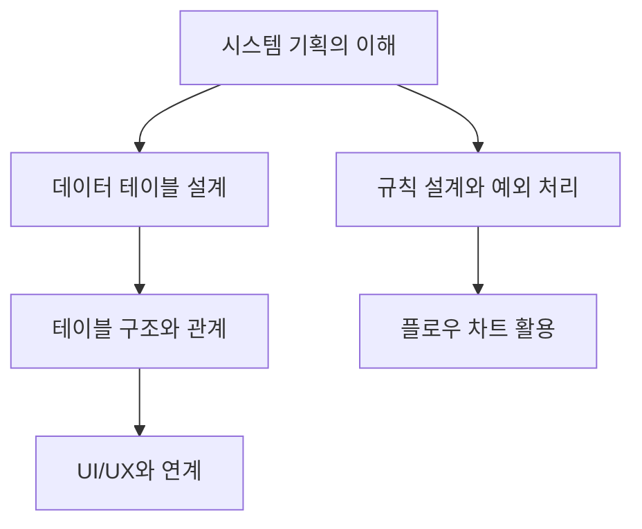

## 1. 게임 기획의 핵심: 시스템 설계와 데이터 테이블

### 1.1. 서론

- 게임 개발에서 시스템 기획은 게임의 규칙과 동작 방식을 정의하는 매우 중요한 부분이다.
- 특히 데이터 테이블<mark> 설계</mark>는 게임에 반영될 기획 데이터를 효율적으로 관리하고 구현하기 위한 핵심 도구이다.
- 이 보고서는 게임 시스템 기획의 전반적인 이해를 돕고, 데이터 테이블 설계의 중요성과 구체적인 방법론을 제시하여 독자의 실무 역량 강화에 기여하고자 한다.

### 1.2. 전체 구조

## 2. 시스템 기획의 본질: 규칙과 구조의 설계

### 2.1. 시스템 기획이란 무엇인가?

- 시스템이란 '어떤 인풋을 가지고 어떤 룰에 맞게 처리하면 어떤 아웃풋이 나타난다'는 개념이다. 
- 게임 기획에서의 규칙은 '특정한 요소들을 특정한 방법으로 사용 또는 실행하면 특정한 결과가 나오도록 하는 것'이다. 
- 이는 게임의 뼈대가 되는 규칙을 설계하고, 이를 다양한 방식으로 활용할 수 있는 기반을 기획하는 것을 의미한다. 
- 시스템 기획은 게임의 동작 방식, 기능적인 것들을 정의하며, 콘텐츠 기획이 만들어진 시스템 안에서 콘텐츠를 양적으로 쌓아 올리는 것과 구분된다. 

### 2.2. 시스템 기획의 구성 요소

- 시스템은 크게 입력(Input), 규칙(Rule), 출력(Output)으로 구성된다. 
- 입력: 사용자의 행동이나 게임 내 특정 상황 발생 등을 의미한다. (예: 야생 포켓몬에게 몬스터볼 던지기) 
- **규칙**: 입력된 정보를 바탕으로 어떤 처리를 할지 결정하는 게임의 법칙이다. (예: 몬스터볼에 맞은 포켓몬의 확률적 포획 여부 산출) 
- 출력: 규칙에 따라 결정된 결과이다. (예: 포획 성공 또는 실패) 

### 2.3. 시스템 기획의 업무 범위

- 기획 의도** 설계**: 유저에게 주고 싶은 경험과 감정, 시스템 도입을 통해 얻을 기대 효과를 설계한다. (예: 퀘스트 시스템을 통해 플레이 가이드라인 제시, 몰입감 증대) 
- 코어 시스템 규칙** 설계**: 플레이 흐름 순환 구조와 핵심적인 규칙을 설계한다. (예: 퀘스트 수락-달성-보상 수령의 순환 구조) 
- 서브 시스템 규칙 설계: 시스템을 구성하는 다양한 서브 시스템 및 속성들의 규칙을 설계한다. (예: 제한 시간 내 처치 퀘스트의 시간 카운트 및 아이템 드랍 중단 규칙) 
- 예외 처리** **규칙 설계: 예상치 못한 상황 발생 시 처리 규칙을 설계한다. (예: 귓속말 대상의 로그아웃 시 메시지 출력) 
- 유저 인터페이스**(**UI**) 설계**: 유저의 명령을 입력받고 정보를 출력하는 방법을 설계한다. (예: 보상 수령 버튼 규칙, 클리어 아이콘 규칙) 
- 툴** 및 **테이블** 구조 설계**: 콘텐츠 제작, 수정, 삭제, 추가 작업을 위한 툴이나 테이블 구조를 설계한다. (예: 퀘스트 데이터 테이블 구현) 

### 2.4. 시스템과 콘텐츠의 구분

- 시스템은 게임의 규칙, 동작 방식, 기능적인 부분을 정의하는 반면, 콘텐츠는 만들어진 시스템 안에서 유저가 즐길 수 있는 다양한 요소들을 의미한다. 
- 예를 들어, 룬 시스템, 각인 시스템 등은 성장 요소로서 시스템에 해당하며, 퀘스트, 던전, 길드전 등은 유저가 즐길 수 있는 놀거리로서 콘텐츠에 해당한다. 
- 하지만 관점에 따라 시스템이 콘텐츠가 될 수도, 콘텐츠가 시스템이 될 수도 있어 명확한 구분은 존재하지 않으며, 회사나 팀마다 구분이 달라질 수 있다. 
- 중요한 것은 하나의 기획에서 시스템과 콘텐츠의 영역을 구분할 줄 아는 능력이다. 

## 3. 데이터 테이블: 기획 데이터를 게임에 반영하는 도구

### 3.1. 데이터 테이블의 역할과 중요성

- 데이터 테이블은 게임의 기획 데이터를 입력하고 관리하기 위해 사용하는 표 형태의 도구이다. 
- 이는 단순히 기획 데이터를 보기 좋게 정리하는 것을 넘어, 기획자가 설계한 데이터를 게임에 반영하기 위한 핵심적인 도구 역할을 한다. 
- 테이블에 작성된 값들은 프로그래머가 엔진 기능을 통해 코드 형태로 변환하여 실제 게임에 구현된다. 
- 셀 병합과 같은 기능은 실제 변환된 파일에 반영되지 않으므로, 테이블 설계 시에는 사용하지 않아야 한다. 

### 3.2. 데이터 테이블과 플레이어 데이터베이스의 차이

- 플레이어 데이터베이스는 플레이어의 프로필, 계정 정보, 게임 내 통계, 아이템 보유량 등 플레이어 정보를 서버나 클라이언트에 저장한 것을 의미한다. 
- 이는 플레이어가 게임을 플레이하면서 발생하는 데이터를 저장하는 것으로, 기획자가 직접 입력하는 기획 데이터와는 다르다. 
- 기획자가 시스템 기획서에 작성해야 할 것은 시스템에 앞으로 들어가게 될 콘텐츠, 즉 기획 데이터를 어떻게 입력할 것인지에 대한 설계이다. 

### 3.3. 데이터 테이블이 필요한 상황

- 동일한 구조의 기획 콘텐츠 데이터를 대량으로 생산 및 관리해야 할 때 필요하다. (예: 몬스터, 퀘스트 대량 생산) 
- 라이브 서비스 중 기획 데이터의 잦은 추가, 수정, 삭제가 예상될 때 필요하다. (예: 출석 보상, 상점 판매 물품, 뽑기 구성품) 
- 기존 테이블로 넣기 어려운 성질의 값이 있어 기존 테이블을 개선해야 할 때도 필요하다. 

### 3.4. 테이블 설계 시 고려사항

- 데이터 관리의 편의성: 기획자의 관리 편의성이 프로그래머의 구현 난이도보다 중시되어야 한다. 
- 사용 방법의 통일성: 유사한 역할을 하는 컬럼은 비슷한 형태로 기획하여 실수 가능성을 줄여야 한다. 
- 개발 효율성: 구현하려는 기능과 비슷한 시스템이 이미 있다면, 기존 테이블을 개선하는 방식으로 접근하는 것이 좋다. 
- 미래 확장성: 추후 확장될 가능성이 있는 시스템들을 수용할 수 있는 방향으로 기획해야 한다. 

### 3.5. 테이블의 기본 구성 요소

- 속성** (Attribute)**: 테이블의 각 세로 줄(열, 컬럼)이 존재하는 이유를 정의한다. (예: 상점 아이디, 정렬 순서) 
- 행** (Row)**: 여러 속성으로 구성된 값들의 모음을 뜻한다. (예: 특정 상점에서 특정 상품을 구매하는 규칙) 

### 3.6. 주요 테이블 종류

- 스트링 테이블: 여러 문자열을 한 곳에 집중적으로 관리하며, UI, 알림, 팝업 등에 사용되는 문구를 모아 관리한다. 
  - 다국어 지원 및 메모리 절약에 용이하다. 
  - '스턴' 번역 오류 사례처럼, 스트링 키를 통해 관리되지 않으면 문제가 발생할 수 있다. 
- 다이얼로그** **테이블: 스트링 테이블에서 발급된 스트링 키를 당겨와 대사 데이터를 관리한다. 
- **상점 **테이블: 아이템 테이블에서 정의한 아이템의 키를 가져와 필요한 재화, 가격, 진열 순서 등을 정의한다. 상점은 아이템을 창조하지 않는다. 
- **캐릭터 **테이블: 캐릭터 창조에 필요한 외형 리소스, 이름, 등급, 속성 등을 지정한다. 스킬은 별도 테이블로 관리하는 경우가 많다. 
- **아이템 **테이블: 아이콘, 스트링 리소스, 숫자 등을 조합해 아이템을 생성한다. 아이템 키는 다른 테이블에서 참조된다. 

### 3.7. 테이블 간의 관계: 키(Key)

- 테이블 데이터를 연결해 주는 개념으로, 열쇠처럼 관련 값을 열어주는 역할을 한다. 
- 기본 키** (Primary Key)**: 각 테이블의 값을 대표하는 고유한 값이다. (예: 출석부 테이블의 '출석부 ID') 
- 외래 키** (Foreign Key)**: 다른 테이블의 기본 키를 참조하여 연결하는 데 사용된다. (예: 출석부 보상 테이블의 '출석부 ID') 
- 기본 키와 외래 키로 연결된 컬럼은 서로 동일한 자료형을 사용해야 한다. 

### 3.8. ER 다이어그램

- 테이블 간의 관계를 도식화한 것으로, 테이블 데이터들을 연결하는 키를 통해 관계가 완성된다. 

## 4. 규칙 설계: 게임의 동작 방식을 정의하기

### 4.1. 규칙의 정의와 중요성

- 규칙이란 '다 함께 지키기로 암묵적 또는 공개적으로 약속한 것'이며, 게임 기획에서는 '특정한 요소들을 특정한 방법으로 사용 또는 실행하면 특정한 결과가 나오도록 하는 것'이다. 
- 게임 기획에서의 규칙은 플레이가 성립되도록 하는 근간이며, 이를 지키지 않으면 게임 플레이 자체가 불가능해질 수 있다. 
- 게임을 기획하는 것은 곧 새로운 규칙을 만드는 것과 같다. 

### 4.2. 규칙의 구성 요소

- 규칙이 작동되는 상황 
- 규칙이 적용되는 범위 
- 규칙에 활용할 정보 
- 규칙의 처리 (계산, 판단, 액션) 
- 규칙의 결과 
- 예외 처리 

### 4.3. 규칙 설계 시 고려사항

- **간결성**: 사용자가 규칙을 이해하는 데 어려움이 없어야 하며, 예외 사항을 너무 많이 설명하면 오히려 혼란을 줄 수 있다. 
- 일관성: 유사한 역할을 하는 규칙들은 일관성을 유지하여 플레이어가 게임 메커니즘을 점진적으로 이해하도록 돕는다. 
- **기대와의 부합**: 플레이어가 기대한 작동 방식을 크게 벗어나지 않도록 설계해야 하며, 통상적인 기대와 다른 작동 방식은 신중하게 검토해야 한다. 
- **모순 방지**: 규칙 간 모순이 발생하지 않도록 설계해야 하며, 플레이어 입장에서 모순으로 인식될 수 있는 상황도 피해야 한다. 
- **납득 가능성**: 플레이어 대다수가 납득할 수 있는 방식으로 규칙을 설계해야 한다. 
- **선의의 피해 최소화**: 규칙 설계 시 선의의 피해자가 발생할 가능성을 최소화해야 한다. (예: 램보이 방지) 
- 어뷰징 가능성** 최소화**: 플레이어가 부정한 이득을 취할 가능성을 최소화하는 방향으로 설계해야 한다. (예: 게임 재화 암거래 방지) 
- 개발 효율성: 주어진 개발 환경, 일정, 인력, 비용 내에서 기획 의도를 만족하면서도 가장 안정적이고 효율적인 방법을 찾아야 한다. 

### 4.4. 예외 처리의 중요성

- 예외 처리란 실행 흐름상 오류가 발생했을 때, 오류에 대응하는 방법을 제시하는 것이다. 
- 버그(프로그래머 실수), 에러(플레이어의 잘못된 조작), 예외(예방하기 어렵거나 불가능한 상황)를 구분해야 한다. 
- 플레이어의 명령을 처리하지 못하거나, 처리할 수 없을 것으로 예상되는 상황, 또는 플레이어가 하지 말거나 못하는 행동을 강제로 시도하는 상황 등에서 예외 처리가 필요하다. 
- 예외 처리를 빼먹으면 의도치 않은 버그가 발생하여 유저 불편을 초래할 수 있다. 

## 5. 플로우 차트: 복잡한 규칙을 시각화하기

### 5.1. 플로우 차트의 정의와 목적

- 플로우 차트란 순서 작업의 흐름, 처리 절차를 보여주는 다이어그램의 한 종류이다. 
- 여러 종류의 상자와 화살표를 이용해 문제 해결책을 보여주며, 기획 의도를 명확하게 전달하고 가독성을 높이는 데 목적이 있다. 
- 텍스트로만 전달했을 때 발생할 수 있는 오해를 방지하는 데 효과적이다. 

### 5.2. 플로우 차트 활용 시 주의사항

- 플로우 차트는 컴퓨터가 판단, 처리, 출력해야 하는 주체를 명확히 보여주기 위해 사용하며, 플레이어나 기획자의 심리 테스트를 위한 것이 아니다. 
- 시스템 기획서에서 규칙을 설명하는 플로우 차트와 UI 흐름도는 구분되어야 한다. 
- 분기가 없는 일련의 과정이나 콘텐츠 흐름을 그리는 데는 불필요하며, 결정적인 상황에서 특정 규칙에 의한 판단이 필요할 때 그린다. 
- 작업자 입장에서 이해하기 쉬운 문서 작성이 최우선이며, 플로우 차트는 간결할수록 좋다. 
- 시작과 종료 기호를 반드시 사용하여 차트의 시작과 끝을 명확히 해야 한다. 
- 처리와 판단의 순서를 고려하여 그려야 하며, 순서 변경은 결과에 큰 영향을 미칠 수 있다. 
- 설명이 메인이며, 플로우 차트는 설명을 보충하는 역할을 한다. 

### 5.3. 플로우 차트의 기본 기호

- 시작/종료 기호: 프로세스의 시작과 끝을 나타낸다. 
- 입력** 기호**: 외부로부터 데이터를 입력받는 과정을 나타낸다. 
- 처리 기호: 데이터 처리, 계산, 액션 등의 과정을 나타낸다. (종종 출력 기호로도 사용) 
- **다이아몬드 기호**: 상황에 따라 다른 결과가 필요할 때 사용하는 판단 기호이다. (예: Yes/No 분기) 
- 프로세스 연결 기호: 복잡한 시스템을 세분화하여 플로우 차트들을 연결할 때 사용한다. 
- 딜레이 기호: 잠시 대기 후 다른 처리로 넘어갈 때 사용한다. 

## 6. UI/UX: 사용자의 경험을 설계하기

### 6.1. UI와 UX의 정의

- UX** (**User Experience**)**: 사용자가 제품, 서비스, 시스템 등을 사용하면서 느끼는 전반적인 경험, 감정, 태도, 행동을 말한다. 
- UI** (**User Interface**)**: 사용자가 제품을 사용할 때 직접적으로 상호 작용하는 화면, 버튼, 아이콘 등의 인터페이스 요소를 말한다. 
- UI는 UX 안에 포함되는 개념이며, 둘은 상호 보완적인 관계이다. 

### 6.2. UI 기획의 핵심 요소

- 레이아웃: 화면에 어떤 요소들을 담을지 결정하고, 요소들의 배치 위치, 크기, 색상, 디자인 등을 수립하는 과정이다. 
  - 화면 구성 요소는 가급적 7개를 넘지 않도록 하여 깔끔함을 유지하는 것이 좋다. 
  - 중요한 정보는 플레이어 시선을 고려해 화면 중앙에 가깝게 배치하고, 다음으로 왼쪽 상단 영역을 활용한다. 
  - 성격이 유사한 항목은 공간적으로 유사한 곳에 배치하여 일관성을 높인다. 
  - 다양한 해상도에 대응할 수 있도록 제작하고, 미래 확장성을 고려해 여유 공간을 확보한다. 
- **크기**: 크기 차이를 이용해 중요도가 높은 요소를 더 강조할 수 있다. 
  - 상호작용이 필요한 버튼 등은 터치 실수를 방지하기 위해 일정 크기 이상을 유지하는 것이 좋다. 
  - 외국어 버전을 고려해 텍스트 영역은 한글 기준보다 크게 만들어야 한다. 
- **색상**: 색상을 통해 플레이어의 상태를 직관적으로 알리거나 정보의 중요도를 인식시킬 수 있다. 
  - 한 화면에 너무 많은 색상을 사용하지 않고, 단순한 배색이 시각적 요소를 명확히 구별하는 데 도움이 된다. 
  - 배경색과 구성 요소의 색, 활성화/비활성화 요소의 색 등은 명확하게 대비되는 것이 좋다. 
  - 게임의 정체성을 나타내는 팔레트를 활용하고, 문화권별 색상 상성을 고려한다. 

### 6.3. 사용자 경험(UX) 설계의 원칙

- 메타포** 활용**: 익숙한 것을 빌려와 의미를 전달하며, 직관적이고 효율적인 메시지 전달, 조작법 학습 노력 감소, 새로운 의미 탐색 동기 부여 등의 장점이 있다. (예: 아이콘) 
- 깊이**(Depth)**: 기준 화면부터 원하는 정보에 도달하기까지의 이동 단계를 최소화한다. 주요 메뉴는 3단계를 넘지 않도록 하고, 한 화면의 구성 요소를 7개 이하로 유지하는 것이 좋다. 
- 상호작용: 사용자의 입력에 대한 시스템의 적절한 반응을 설계한다. (예: 검색창의 'x' 버튼, 최적화된 키패드 등장) 
- UI 연출: 플레이어에게 주고 싶은 감정과 경험에 대한 기획 의도를 바탕으로 시각적 연출을 기획한다. (예: 카드 뽑기, 장비 강화 연출) 
- 내러티브: 게임의 세계관과 배경에 어울리는 컨셉으로 UI를 디자인하여 몰입감을 극대화한다. (예: 카운터사이드의 사원 연봉 협상 컨셉) 

### 6.4. UI/UX 기획 시 고려사항

- 정보** 노출 방식**: 필요한 정보는 필요할 때만 노출하거나 숨기는 것이 좋다. (예: 업적 버튼을 햄버거 메뉴 내부로 이동) 
- **기기 및 **해상도 대응: 다양한 기기 및 해상도에 맞춰 레이아웃과 요소 크기를 조정해야 한다. (예: 아이폰 노치 영역 고려) 
- 기본값** 설정**: 사용자가 값을 지정하지 않아도 되는 기본값을 잘 지정하면 플레이어의 조작 깊이를 줄일 수 있다. 
- **버튼 설계**: 버튼은 누가 봐도 버튼임을 알 수 있도록 디자인하고, 상태에 따른 디자인 변환, 중요도에 따른 우선순위 설정을 고려해야 한다. 
- **긍정/부정 버튼 **배치: 긍정 버튼과 부정 버튼의 배치 순서는 논란의 여지가 있으나, 모바일 게임에서는 긍정 버튼을 오른쪽에 배치하는 추세이다. 
- **텍스트 **입력** **필드: 플레이스홀더, 최대 문자 수 제한, 콘텐츠 타입, 키패드 종류 등을 고려해야 한다. 
- **숫자 **입력** **UI: 스피너, 슬라이더, 스태퍼 등에서 조정 단위, 최소/최대값, 기본값 등을 기획적으로 고민해야 한다. 
- **정렬 **규칙: 검색 결과나 인벤토리 등에서 항목을 정렬하는 규칙을 명확히 해야 한다. 
- **내용 없을 때 화면**: 결과가 없을 때 보여줄 화면을 명확하게 디자인해야 한다. (예: "결과가 없습니다.") 
- **글자 수 고려**: UI 텍스트는 예상 글자 수를 고려하여 디자인해야 하며, 외국어 버전 대응을 위해 글자 수 초과 시 처리 방법을 마련해야 한다. 
- **화면 갱신 기준**: 실시간 또는 주기적인 화면 갱신 기준과 주기를 기획해야 한다. 

## 7. 시스템의 부분과 전체: 복잡한 시스템을 분해하는 방법

### 7.1. 시스템 기획의 막막함 극복

- 초보 기획자가 시스템 기획을 어려워하는 가장 큰 이유는 '뭐부터 해야 할지 막막함' 때문이다. 
- 완성품의 비전을 바라보되, 작업은 핵심 재료(기능 단위의 부분)를 만드는 일부터 시작해야 한다. 
- 시스템은 작은 역할들을 하는 각 부분들의 집합체이며, 이 부분들은 각자의 규칙을 가지면서도 서로 상호작용한다. 

### 7.2. 시스템을 기능 단위로 분해하기

- 시스템을 기능 단위의 부분으로 나누어 볼 줄 알아야 한다. 
- 명사가 아닌 동사를 기준으로 생각하면, 여러 시스템이 동일한 구조로 돌아가고 있음을 파악할 수 있다. (예: 상점 시스템 - '무언가를 지불하면 뭔가를 준다') 
- 핵심 시스템: 상품 구매 시스템, 상품 판매 시스템 등. 
- **보조 시스템**: 상점 인터페이스, 팝업 인터페이스, NPC 대사화 시스템, 구매 수량 선택 시스템 등. 
- 시스템의 부분들은 여러 방식으로 조합되어 다양한 콘텐츠를 만들어낸다. (예: 상점 시스템 + 구매 횟수 제한 시스템 = 제한 횟수 상점) 
- 마인드맵을 활용하여 기능 단위로 분해하는 것도 도움이 된다. 

### 7.3. 시스템을 속성 단위로 분해하기

- 속성**(Attribute)**: 사물의 성질, 특징, 본질적인 성질을 나타내며, 사물을 구별하는 데 사용되는 성질이다. 
- 개체**(Entity)**: 현실 세계에 대해 사람이 생각하는 개념이나 정보의 단위이며, 하나 이상의 속성으로 구성된다. 
- 시스템 기획자는 오브젝트가 갖게 될 속성을 기획하고, 이 속성을 연결하는 툴(테이블)을 기획해야 한다. 
- 콘텐츠 기획자는 젤리들의 컨셉과 외형을 기획하고, 시스템 기획자가 설계한 속성들 중 어울리는 것을 연결한다. 

### 7.4. 시스템 기획서 구성

- 떠오르는 시스템 부분들을 기능, 속성 단위로 분해하고, 목적어 기준으로 공통된 것끼리 재배치한다. 
- 각 챕터에는 코어 시스템, 자원 시스템, 캐릭터 시스템 등 시스템별 규칙 설계 내용이 포함된다. 

## 8. 규칙 설계 심화: 좋은 규칙을 만들기 위한 조건

### 8.1. 간결하고 일관된 규칙 설계

- 규칙은 플레이어가 이해하기 쉬워야 하며, 예외 사항을 너무 많이 설명하면 오히려 혼란을 줄 수 있다. 
- 소수의 규칙을 기반으로 다양한 행위가 가능하도록 만드는 것이 이상적이다. (예: 리그 오브 레전드의 승리 규칙) 
- 게임 경험의 일관성을 해치지 않는 방향으로 설계해야 하며, 유사한 역할을 하는 규칙들은 일관성을 유지해야 한다. 

### 8.2. 플레이어의 기대와 규칙의 부합

- 규칙은 플레이어가 기대한 작동 방식을 크게 벗어나지 않도록 설계해야 한다. (예: 프린세스 커넥트! 리다이브 캐릭터 랭크업 시스템의 문제점) 
- 통상적인 기대와 다른 방식으로 규칙이 작동되는 케이스가 없는지 꼼꼼하게 검토해야 한다. 

### 8.3. 규칙 간 모순 방지 및 우선순위 설정

- 규칙 간 모순이 발생하지 않도록 설계해야 하며, 플레이어 입장에서 모순으로 인식될 수 있는 상황도 피해야 한다. (예: 크레이지 아케이드 슈퍼 방장 vs 강퇴 반사) 
- 규칙 간 모순이 예상될 경우, 우선순위를 정하여 해결해야 한다. (예: 오버워치 루시우 넉백 vs 라인하르트 돌진) 

### 8.4. 플레이어의 납득 가능성과 합리성

- 규칙은 플레이어 대다수가 납득할 수 있는 방식으로 설계되어야 한다. (예: 경험치 배분 시스템의 다양한 안) 
- 예외적인 상황 발생 시, 최대한 기획 의도를 따르는 방향으로 처리하는 것이 좋다. (예: HP 10% 희생 실드 스킬의 예외 처리) 

### 8.5. 어뷰징 및 부정한 이득 최소화

- 규칙은 플레이어의 어뷰징 가능성을 최소화하는 방향으로 설계되어야 한다. (예: 램보이 방지, 게임 재화 암거래 방지) 
- 플레이어가 부정한 이득을 취할 가능성을 최소화하는 방향으로 설계해야 한다. (예: 부캐 생성 반복 튜토리얼 보상 악용 방지) 

## 9. 플로우 차트: 복잡한 규칙을 시각적으로 표현하기

### 9.1. 플로우 차트의 정의와 목적

- 플로우 차트는 순서 작업의 흐름, 처리 절차를 보여주는 다이어그램으로, 기획 의도를 명확하게 전달하고 가독성을 높이는 데 목적이 있다. 
- 텍스트로만 전달했을 때 발생할 수 있는 오해를 방지하는 데 효과적이다. 

### 9.2. 플로우 차트 활용 시 주의사항

- 플로우 차트는 컴퓨터가 판단, 처리, 출력해야 하는 주체를 명확히 보여주기 위해 사용하며, 플레이어나 기획자의 심리 테스트를 위한 것이 아니다. 
- 시스템 기획서에서 규칙을 설명하는 플로우 차트와 UI 흐름도는 구분되어야 한다. 
- 분기가 없는 일련의 과정이나 콘텐츠 흐름을 그리는 데는 불필요하며, 결정적인 상황에서 특정 규칙에 의한 판단이 필요할 때 그린다. 
- 작업자 입장에서 이해하기 쉬운 문서 작성이 최우선이며, 플로우 차트는 간결할수록 좋다. 
- 시작과 종료 기호를 반드시 사용하여 차트의 시작과 끝을 명확히 해야 한다. 
- 처리와 판단의 순서를 고려하여 그려야 하며, 순서 변경은 결과에 큰 영향을 미칠 수 있다. 
- 설명이 메인이며, 플로우 차트는 설명을 보충하는 역할을 한다. 

### 9.3. 플로우 차트의 기본 기호

- 시작/종료 기호: 프로세스의 시작과 끝을 나타낸다. 
- 입력** 기호**: 외부로부터 데이터를 입력받는 과정을 나타낸다. 
- 처리 기호: 데이터 처리, 계산, 액션 등의 과정을 나타낸다. (종종 출력 기호로도 사용) 
- **다이아몬드 기호**: 상황에 따라 다른 결과가 필요할 때 사용하는 판단 기호이다. (예: Yes/No 분기) 
- 프로세스 연결 기호: 복잡한 시스템을 세분화하여 플로우 차트들을 연결할 때 사용한다. 
- 딜레이 기호: 잠시 대기 후 다른 처리로 넘어갈 때 사용한다. 

## 10. UI/UX: 사용자의 경험을 설계하기

### 10.1. UI와 UX의 정의

- UX** (**User Experience**)**: 사용자가 제품, 서비스, 시스템 등을 사용하면서 느끼는 전반적인 경험, 감정, 태도, 행동을 말한다. 
- UI** (**User Interface**)**: 사용자가 제품을 사용할 때 직접적으로 상호 작용하는 화면, 버튼, 아이콘 등의 인터페이스 요소를 말한다. 
- UI는 UX 안에 포함되는 개념이며, 둘은 상호 보완적인 관계이다. 

### 10.2. UI 기획의 핵심 요소

- 레이아웃: 화면에 어떤 요소들을 담을지 결정하고, 요소들의 배치 위치, 크기, 색상, 디자인 등을 수립하는 과정이다. 
  - 화면 구성 요소는 가급적 7개를 넘지 않도록 하여 깔끔함을 유지하는 것이 좋다. 
  - 중요한 정보는 플레이어 시선을 고려해 화면 중앙에 가깝게 배치하고, 다음으로 왼쪽 상단 영역을 활용한다. 
  - 성격이 유사한 항목은 공간적으로 유사한 곳에 배치하여 일관성을 높인다. 
  - 다양한 해상도에 대응할 수 있도록 제작하고, 미래 확장성을 고려해 여유 공간을 확보한다. 
- **크기**: 크기 차이를 이용해 중요도가 높은 요소를 더 강조할 수 있다. 
  - 상호작용이 필요한 버튼 등은 터치 실수를 방지하기 위해 일정 크기 이상을 유지하는 것이 좋다. 
  - 외국어 버전을 고려해 텍스트 영역은 한글 기준보다 크게 만들어야 한다. 
- **색상**: 색상을 통해 플레이어의 상태를 직관적으로 알리거나 정보의 중요도를 인식시킬 수 있다. 
  - 한 화면에 너무 많은 색상을 사용하지 않고, 단순한 배색이 시각적 요소를 명확히 구별하는 데 도움이 된다. 
  - 배경색과 구성 요소의 색, 활성화/비활성화 요소의 색 등은 명확하게 대비되는 것이 좋다. 
  - 게임의 정체성을 나타내는 팔레트를 활용하고, 문화권별 색상 상성을 고려한다. 

### 10.3. 사용자 경험(UX) 설계의 원칙

- 메타포** 활용**: 익숙한 것을 빌려와 의미를 전달하며, 직관적이고 효율적인 메시지 전달, 조작법 학습 노력 감소, 새로운 의미 탐색 동기 부여 등의 장점이 있다. (예: 아이콘) 
- 깊이**(Depth)**: 기준 화면부터 원하는 정보에 도달하기까지의 이동 단계를 최소화한다. 주요 메뉴는 3단계를 넘지 않도록 하고, 한 화면의 구성 요소를 7개 이하로 유지하는 것이 좋다. 
- 상호작용: 사용자의 입력에 대한 시스템의 적절한 반응을 설계한다. (예: 검색창의 'x' 버튼, 최적화된 키패드 등장) 
- UI 연출: 플레이어에게 주고 싶은 감정과 경험에 대한 기획 의도를 바탕으로 시각적 연출을 기획한다. (예: 카드 뽑기, 장비 강화 연출) 
- 내러티브: 게임의 세계관과 배경에 어울리는 컨셉으로 UI를 디자인하여 몰입감을 극대화한다. (예: 카운터사이드의 사원 연봉 협상 컨셉) 

### 10.4. UI/UX 기획 시 고려사항

- 정보** 노출 방식**: 필요한 정보는 필요할 때만 노출하거나 숨기는 것이 좋다. (예: 업적 버튼을 햄버거 메뉴 내부로 이동) 
- **기기 및 **해상도 대응: 다양한 기기 및 해상도에 맞춰 레이아웃과 요소 크기를 조정해야 한다. (예: 아이폰 노치 영역 고려) 
- 기본값** 설정**: 사용자가 값을 지정하지 않아도 되는 기본값을 잘 지정하면 플레이어의 조작 깊이를 줄일 수 있다. 
- **버튼 설계**: 버튼은 누가 봐도 버튼임을 알 수 있도록 디자인하고, 상태에 따른 디자인 변환, 중요도에 따른 우선순위 설정을 고려해야 한다. 
- **긍정/부정 버튼 **배치: 긍정 버튼과 부정 버튼의 배치 순서는 논란의 여지가 있으나, 모바일 게임에서는 긍정 버튼을 오른쪽에 배치하는 추세이다. 
- **텍스트 **입력** **필드: 플레이스홀더, 최대 문자 수 제한, 콘텐츠 타입, 키패드 종류 등을 고려해야 한다. 
- **숫자 **입력** **UI: 스피너, 슬라이더, 스태퍼 등에서 조정 단위, 최소/최대값, 기본값 등을 기획적으로 고민해야 한다. 
- **정렬 **규칙: 검색 결과나 인벤토리 등에서 항목을 정렬하는 규칙을 명확히 해야 한다. 
- **내용 없을 때 화면**: 결과가 없을 때 보여줄 화면을 명확하게 디자인해야 한다. (예: "결과가 없습니다.") 
- **글자 수 고려**: UI 텍스트는 예상 글자 수를 고려하여 디자인해야 하며, 외국어 버전 대응을 위해 글자 수 초과 시 처리 방법을 마련해야 한다. 
- **화면 갱신 기준**: 실시간 또는 주기적인 화면 갱신 기준과 주기를 기획해야 한다. 
