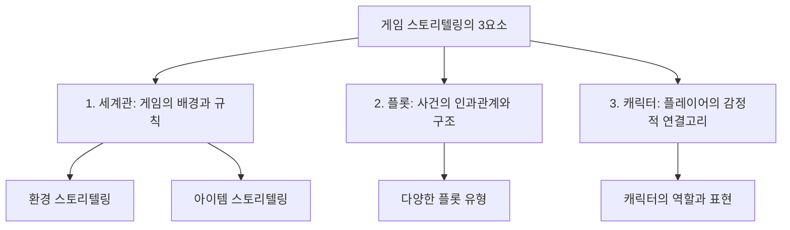

## 1. 게임 스토리텔링의 핵심 요소: 세계관, 플롯, 캐릭터

### 1.1. 서론

- 게임의 재미는 단순히 스토리가 좋아서만 나오는 것이 아니다. 게임의 핵심 메커니즘을 정립한 후, 이를 바탕으로 플레이어의 경험을 풍부하게 만드는 스토리텔링이 중요하다.
- 이 보고서는 게임 스토리텔링을 구성하는 세 가지 핵심 요소인 세계관, 플롯, 캐릭터를 심층적으로 분석하고, 각 요소가 플레이어의 몰입과 경험에 어떻게 기여하는지 살펴본다.
- 게임의 재미와 깊이를 더하는 스토리텔링 기획의 중요성을 이해하는 것이 목표다.

### 1.2. 전체 구조

## 2. 세계관: 게임의 깊이와 몰입을 더하는 배경

### 2.1. 세계관의 정의와 역할

- 세계관(LORE)은 한 세대에서 다른 세대로 전해지는 지식, 이야기, 전통의 체계를 말한다.
- 게임 세계를 풍부한 역사와 문화를 지닌 살아 숨 쉬는 장소처럼 만들어 깊이를 더한다.
- 플레이어가 만나는 캐릭터들의 동기와 행동, 게임 세계를 지배하는 사회적 구조를 이해하는 데 도움을 준다.
- 마법의 법칙이나 기술의 한계 등 게임 세계에 대한 규칙과 제약을 설정하여 사실성과 일관성을 조성한다.
- 플레이어가 게임 세상이 플레이 전부터 존재했었다는 느낌을 주어 스토리에 몰입하게 돕는다.

### 2.2. 사실성(핍진성)의 중요성

- 사실성(핍진성)은 작품의 묘사나 전개가 독자들이 신뢰하고 납득할 수 있을 정도로 배경이나 인물 설정과 어울리는 정도를 말한다.
- 현실성이 떨어지는 판타지 작품에서도 독자가 의심을 멈추고 이야기 틀 안에서 있을 수 없는 행동을 진실한 것으로 받아들이도록 유도하는 것이 중요하다.
- 사실성을 판단하는 데에는 배경 지식이 필요하다.
- 예시: 반지의 제왕 세계관에서 마법은 존재해도 괜찮지만, AK-47 총기를 사용하는 것은 핍진성에 문제가 생긴다.

### 2.3. 환경 스토리텔링: 게임 매체만의 강점 활용

- 환경 스토리텔링은 컷신이나 대화 없이 게임 플레이 시스템과 게임 세계 자체를 통해 스토리를 비선형적으로 전달하는 방식이다.
- 게임이라는 매체에서만 가능한 경험이다.
- 시각적 단서, 풍경, 소품 배치 등을 통해 세계관의 서술적 맥락 정보를 암시한다.
- 게임 시나리오 기획자는 배경 소품에도 세계관이 깃들도록 기획해야 한다.
- **환경 스토리텔링의 장점:**
  - 플레이어가 스스로 찾아내고 해결했다는 쾌감을 준다.
  - 많은 텍스트나 비싼 컷신 없이도 세계관과 스토리를 편하게 전달할 수 있다.
  - 플레이어의 호기심과 상상력을 자극하고, 게임 세계를 탐색하려는 충동을 불러일으킨다.
  - 살아 있는 듯한 게임 속 세계를 구축할 수 있다.
- 플레이어는 자신이 게임 세계의 중심이기보다는 이미 존재하던 자연스러운 세계 속을 활보하는 것을 원한다. 세상이 가짜라는 느낌과 위화감은 몰입을 깨뜨릴 수 있다.

### 2.4. 환경 스토리텔링의 재료: 공간

- 게임 속 공간은 게이머가 게임 속 이야기에 관여하게 되는 출발점이자, 게임 전체 내용을 구성하는 핵심이다.
- 게이머의 상호작용 행위에 서사적 기미를 부여하는 장치이며, 배경 이야기를 바탕으로 캐릭터, NPC, 아이템 등 다양한 장치 간의 관계 구조가 형성된다.
- 각 공간은 고유한 사건의 가능성과 이야기를 담고 있어 잠재적인 이야기 장치가 된다.
- 공간 기획** 시 고려사항:**
  - 각 지역의 크기, 모양, 구조, 지역 간의 연결.
  - 지역 물가 배치, 집중하는 장소와 휴식하는 장소.
  - 동선의 예측, 숨겨진 정보의 전달.
- 공간 그 자체가 주는 플레이 경험뿐 아니라, 시나리오, 세계관, 게임의 특성, 콘셉트 등을 극대화하는 방향으로 설계해야 한다.
- 예시: 리니지에서 직업별, 종족별 시작 지점이 달라지며, 이는 각 캐릭터가 자신의 역할에 맞는 훈련을 하는 곳이다. 이 공간을 떠나는 것은 더 넓은 세상으로 나아갈 계기를 쌓았음을 의미한다.
- 게임은 타 매체와 달리 시간 단위가 아닌 공간 단위로 이야기가 구성되는 경우가 많으며, 이야기 연결은 인과성보다는 공간적 인접성에 의해 이루어진다.
- 예시: 서울 각 구 이름의 한자 뜻을 영어로 번역한 것이 모던 판타지 게임의 배경이 될 수 있다. (블래스드 그래스, 서초, 타인 힐송 등)

### 2.5. 환경 스토리텔링의 재료: 아이템

- 게임 스토리텔링에서 아이템은 상호작용을 통해 이야기를 경험하게 하는 장치 역할을 한다.
- 플레이어가 어떤 아이템을 선택하느냐에 따라 다른 이야기 내용을 경험할 수 있다.
- NPC 또는 타 플레이어와의 상호작용 매개체가 되며, 각 개인이 가질 수 있는 독특한 이야기를 만들어 준다.
- 게임에서는 아이템이 인물 간 상호작용을 유도하는 핵심적인 맥의 장치가 된다.
- 플레이어는 아이템을 획득, 구입, 판매, 처분, 교환하기 위해 NPC 또는 다른 플레이어들과 상호작용하며 게임 속 이야기에 개입하고 자신만의 이야기를 창출한다.
- 아이템은 사회적 관계를 부여하는 역할도 한다. (MMORPG의 아이템은 플레이어들에게 위계적인 사회적 관계를 부여하는 장치)
- 아이템 기획은 단순히 능력치나 효과 부여를 넘어, 플레이어에게 더 풍부하고 몰입감 있는 게임 경험을 제공하는 장치로서 동작해야 한다.
- **아이템을 통한 **스토리텔링** 예시:**
  - 스카이림의 데이드릭 아티팩트: 아이템의 기원과 역사를 통해 세계관과 배경 스토리를 학습하게 한다.
  - 다이아쇼크의 오디오 다이어리: 아이템 간 연결 관계를 구성해 복잡한 스토리라인이나 세계관을 구축한다.
  - 젤다의 전설 시간의 오카리나 퀘스트 연계: 플레이어가 수집하고 사용하는 스토리를 진행하며 목적을 나타낸다.
  - 파이널 판타지의 버스터 소드: 인물의 성격, 과거 관계를 반영하여 플레이어가 특정 캐릭터에 대한 공감과 애착을 갖게 한다.

## 3. 플롯: 사건의 인과관계로 몰입도를 높이는 이야기 구조

### 3.1. 플롯의 정의와 중요성

- 스토리는 시간 순서를 중심으로 사건을 서술하는 것을 말한다.
- 플롯은 인물, 사건, 배경, 행동, 지점 등의 인과관계를 중심으로 서술을 구조화하는 것을 말한다.
- 작품 속에서 시간 순서에 따라 나열된 사건을 주제에 맞게 재구성하며 각각의 사건을 하나로 묶어주는 뼈대 역할을 한다.
- 스토리의 개연성, 논리성을 더해 작품의 완성도를 높이는 나침반 역할을 한다.
- 스토리를 스킵하는 플레이어들도 플롯을 통해 재미를 느끼게 만들 수 있다.

### 3.2. 재미있는 게임 스토리를 위한 플롯 유형
1. **축구 플롯:**
  - 주인공이 인생을 걸고 어떤 인물, 사물, 장소 등을 찾아다닌다.
  - 동기를 부여하는 사건이 발생하고 장애물을 헤쳐 가며 추구하지만, 발견한 것은 추구했던 대상과 다른 뜻밖의 것이다.
2. **모험 플롯:**
  - 모험을 해야 하는 동기가 발생하고, 플레이어는 넓은 세상으로 나가 신기한 사건에 휘말린다.
  - 추구는 인물 중심, 모험은 사건과 배경 중심이라는 차이가 있다.
3. **추적 플롯:**
  - 주인공은 쫓는 자일 수도, 쫓기는 자일 수도 있다. 막다른 골목에서 가까워질 때 긴장이 고조된다.
  - 쫓기는 자가 포기한 듯 보이다가 꾀를 내어 위기 상황을 벗어나는 것이 반복된다.
  - 등장인물과 상황은 자극적이어야 하며, 배경은 섬이나 폐쇄 공간처럼 설정해 긴장감을 높인다.
4. **발견 플롯:**
  - 사물, 장소, 비밀을 찾는 것이 아니라 인간의 본질과 삶에 대한 근본적인 의미를 이해하는 과정을 그린다.
  - 변화가 일어나는 의미심장한 사건이 초반에 빠르게 발생하고, 주인공은 오히려 기피하던 상황에 처하지만 이를 극복하며 내적 성장을 이룬다.
5. **탈출 플롯:**
  - 주인공이 부당하게 갇히고, 첫 탈출 시도는 좌절되며, 두 번째는 적대자에 의해, 세 번째는 위기 발생에도 극복하는 것이 주요 과정이다.
6. **복수 플롯:**
  - 주인공이 적대자에 의해 피해를 입고 행복이 파괴되지만, 전통적인 방법으로 해결되지 않아 스스로 복수를 집행한다.
  - 계획이 몇 차례 실패 후 적대자와의 대결을 하게 된다.
7. 라이벌** 플롯:**
  - 주인공과 경쟁자 또는 세력 간의 투쟁으로, 같은 목적과 비슷한 힘을 가져야 성립한다.
  - 주인공과 경쟁자는 각자 추구하는 정의가 있어 공감이 나뉜다.
  - 대등한 관계에서 시작해 라이벌이 우세해지면 주인공에게 반등의 기회가 생기고, 피할 수 없는 대결 끝에 주인공이 승리한다.
8. 언더독** 플롯:**
  - 주인공이 경쟁자와 대등하지 않고 약한 존재이다. 주인공을 의도적으로 약하게 만들어 연민의 정을 느끼게 하는 것이 핵심이다.
  - 주인공이 세력을 상실하고 바닥까지 떨어지지만, 실패를 딛고 경쟁자와 대등하게 대적해 결국 승리한다.
9. **유혹 플롯:**
  - 인간의 동기, 성격, 충동을 시험하고 유혹에 빠진 대가에 대한 메시지를 담는다.
  - 주인공의 선한 본성과 유혹에 빠지지 않으려는 투쟁을 보여주지만, 결국 유혹에 굴복하고 치명적인 대가를 치른다.
10. **희생 플롯:**
  - 희생하지 않으면 안 되는 상황에 빠지는데, 다른 해결책을 찾으려 하지만 희생이 유일한 해결책임을 알고 고뇌하다 결단한다.
  - 희생에 대한 행동을 과장하거나 지나치게 성스럽게 만들지 않고, 희생의 가치를 독자가 판단할 수 있도록 열어 두는 것이 좋다.

### 3.3. 게임 스토리 기획 시 주의할 점

- 플레이어 경험에 초점을 맞춰야 한다.
- 게임 스토리는 게임 플레이와 밀접하게 연결되어야 하며, 감정적으로 와닿도록 해야 한다.
- 감정적인 고점과 저점을 잘 배치하는 것이 중요하다.
- 플레이어의 선택이 게임 스토리나 결과에 영향을 미치거나, 영향을 주고 있다는 착각을 제공해야 몰입감이 떨어진다.
- 게임 스토리는 이해하기 쉬워야 하며, 초반에 너무 많은 정보를 제공하면 플레이어가 압도될 수 있으므로 점진적으로 제공해야 한다.
- 지나치게 복잡하거나 긴 스토리는 플레이어에게 피로감을 주고 몰입을 방해할 수 있다.
- 게임 스토리는 유연하고 변화에 수용 가능한 형태로 만들어져야 한다. (기술적 제약, 업데이트 등 고려)
- 온라인 게임의 경우, 스토리에 종결을 내지 않고 업데이트로 지속적으로 제공해야 하므로 확장성 있게 만들어야 한다.
- 스토리의 감상에는 플레이어의 노력이 요구된다는 점을 인지해야 한다. (미션 실패 시 컷신 반복 등)

## 4. 캐릭터: 플레이어의 감정적 연결고리

### 4.1. 캐릭터의 정의와 역할

- 캐릭터는 플레이어의 행동을 대신하고, 게임의 경험과 감정을 전달하여 몰입을 이끌어낸다.
- 캐릭터 설정과 기획에는 생각보다 많은 노력이 필요하며, 이는 게임의 메커니즘, 스킬, 능력치 등에 영향을 준다.
- 캐릭터는 플레이어의 여부에 따라 PC(플레이어 캐릭터)와 NPC(논플레이어 캐릭터)로 나뉜다.
- PC와 주인공은 동일한 의미가 아니며, 주인공이 아닌 캐릭터를 플레이어블하게 제공하는 경우도 많다.

### 4.2. 캐릭터 기획의 시작: 존재 의미 설계

- 캐릭터가 이루고 싶어 하는 목표, 필요한 것, 두려워하는 것을 먼저 설계해야 한다.
- 자신이 만들려는 것이 캐릭터인지, 아바타인지를 명확히 해야 한다.
  - **캐릭터:** 플레이어가 캐릭터에 대한 감성적 애착을 형성하고 캐릭터의 목표와 게임의 목표를 발견하게 해야 한다.
  - 아바타**:** 플레이어의 이야기를 끌어가는 캐릭터로서, 플레이어가 공감하고 일체감을 느낄 수 있도록 설계해야 한다.

### 4.3. 캐릭터의 역할 분류
1. 영웅**:**
  - 스토리를 이끄는 중심이며, 주어진 운명과 적대자의 방해에 맞서 싸워 명성과 불을 얻는다.
  - 복수, 분노 등 보편적인 감정을 대변하며, 하나 이상의 약점을 극복하고 성장할 때 강하게 어필된다.
  - 다면적으로 설정되어 다양한 관객에게 공감을 얻어야 한다.
  - 자발적 영웅, 비자발적 영웅, 전통적 영웅, 고독한 영웅, 상처입은 영웅 등 다양한 형태로 설계한다.
2. **적대자:**
  - 스토리의 갈등을 만들고, 주인공과의 투쟁 대상 또는 추적의 목표물이 된다.
  - 첫 등장 시 갑자기 등장했다가 사라지는 속성을 가지며, 이기기 힘든 강력한 상대임을 강조한다.
  - 초반 모습이 완전히 드러나지 않은 채, 스토리 절정에서 정체를 드러내고 화려하게 등장하는 것이 좋다.
  - 자신을 악으로 생각하지 않고 자신의 신념, 의지, 욕망을 위해 움직이도록 설계한다.
  - 조력자가 알고 보니 적대자였거나, 주인공의 다음 편에서 적대자 역할로 등장하는 반전도 흥미롭다.
3. **희생자:**
  - 적대자의 위협, 협박, 납치를 당하며, 주인공에 의해 클라이맥스에서 구출되는 역할을 한다.
  - 주인공에게 어려운 과제를 부여하고, 과제 달성 시 보상을 제공한다.
4. **사자:**
  - 영웅에게 변화에 대한 소명을 알려주어 스토리 진행 동기를 제공한다.
  - 영웅에게 긍정적, 부정적, 중도적인 입장일 수 있으며, 사람의 형태가 아닐 수도 있다.
5. **협력자, 증여자, 조원자, 원조자, 파견자:**
  - 영웅이 임무를 해결할 수 있도록 특별한 오브젝트, 정보, 충고, 마법, 열쇠 등을 제공한다.
  - 주인공이 임무를 제대로 수행할 수 있도록 준비를 해주고, 적대자의 세계로 보내거나 위험에 처한 주인공을 구해주기도 한다.
  - 주인공이 헤맬 때 사건을 일으켜 새로운 동기 부여를 하거나, 스토리 복선으로 활용될 수 있다.
  - 때로는 중요한 물건을 잃어버리는 등의 실수로 사소한 문제를 일으키는 역할도 겸한다.
6. 관문 수호자**:**
  - 영웅에게 자격이 있는지 시험하는 척하지만, 사실은 최종 보스 클리어에 도움을 주는 장비, 아이템, 셔틀 역할을 한다.
  - 사람의 형태가 아닌 자연이나 건축물일 수도 있으며, 어둠의 세력의 중간 보스 역할을 겸하기도 한다.
7. 중립 캐릭터**:**
  - 중립적 입장으로 등장했다가 영웅의 동료가 되거나, 어둠의 세력에 동조하기도 한다.
  - 스토리에 가벼운 웃음을 주고 잠시 숨을 돌리는 여유를 주는 촉매 캐릭터로 활용되기도 한다.
  - 때로는 예상 외로 강력한 힘을 발휘하기도 한다.
8. 배신자**:**
  - 선한 역할로 보이지만 실제로는 나쁜 존재였음이 밝혀져 스토리를 혼란스럽게 만든다.

### 4.4. 캐릭터 성격 표현 방법

- 외모, 옷차림, 표정, 자세 같은 외형으로 캐릭터 성격을 보여줄 수 있다.
- 아이템, 텍스트 설명, 배경 캐릭터의 목소리를 빌려 간접적으로 묘사할 수 있다.
- 행동이나 반응, 캐릭터가 내리는 선택이나 결정을 통해서도 묘사가 가능하다. (예: 플레이어가 조작을 멈추면 초조해하는 모습)
- 능력이나 전투 스타일로도 캐릭터 성격을 표현할 수 있다.
- 대사나 목소리 연기로도 캐릭터를 묘사할 수 있다.
- 예시: 하스스톤의 사제 안두인 린은 사제 컨셉임에도 스킬이 훔치고 빼앗는 행위가 많아 독특한 성격으로 인식되었다.

## 5. 퀘스트 기획: 플레이어 경험을 설계하는 핵심

### 5.1. 퀘스트의 정의와 역할

- 퀘스트는 플레이어가 게임에서 수행해야 하는 특정 임무나 과제를 말한다.
- 게임 기획자는 퀘스트 기획을 통해 플레이어의 참여가 바탕이 되는 경험 위주의 플레이를 만들어낼 수 있다.
- 퀘스트는 게임의 세계관 탐색, 스토리 진행, 캐릭터와의 연결고리 강화, 플레이 동기 부여 등 다양한 역할을 수행한다.

### 5.2. 퀘스트의 변천사

- **1980년대:** 점수, 스테이지 클리어 등 단순한 목표 위주.
- **1990년대:** 스토리텔링 수단으로 사용되기 시작 (젤다, 파이널 판타지 시리즈의 연계 퀘스트). MMORPG에서는 간단한 목표 달성, 아이템 수집, 성장에 초점.
- **2000년대:** 복잡한 분기형 스토리라인 등장 (매스 이펙트 시리즈). 플레이어에게 더 많은 자율성 부여. 월드 오브 워크래프트에서 이야기 중심의 풍부한 퀘스트로 몰입도 증진.
- **2010년대:** 퀘스트 역할 확장 (스카이림, 위처 시리즈의 오픈월드 탐험, 데스티니의 협력 퀘스트).
- **2020년대:** 플레이어가 직접 퀘스트를 만들고 공유 (마인크래프트). 온라인 게임에서 퀘스트 시스템을 지속적으로 업데이트되는 이벤트 콘텐츠로 활용.

### 5.3. 퀘스트의 목적
1. 세계관** 탐색:**
  - 게임 속 세계를 탐험하도록 독려하고 매력을 직접 발견하게 돕는다.
  - 플레이어는 퀘스트를 통해 게임 속 이야기에 직접 참여하며 세계관을 이해한다.
  - 특정 위치 탐색 또는 NPC 대화를 요구하여 플레이어 동선을 기획 의도대로 유도할 수 있다.
2. **스토리 진행:**
  - 시나리오를 실제 게임 내 콘텐츠로 바꾸고 메인 스토리 라인을 진행시키는 수단으로 활용한다.
  - 강렬하거나 감동적인 스토리 라인으로 플레이어의 감정적 몰입을 유도한다.
  - 흥분, 슬픔, 기쁨 등 감정을 자극해 게임에 몰입하게 하고, 플레이어 행동에 타당한 이유를 제공한다.
  - 연속된 전투 퀘스트 사이에 배치해 긴장감을 낮추고 몰입 사이클을 장기적으로 끌고 갈 수 있다.
3. **캐릭터와의 연결고리 강화:**
  - 다양한 게임 캐릭터들의 배경 이야기 제공으로 감정적 유대감, 애착을 강화한다.
  - 선택지, 호감도 시스템 등을 활용해 NPC와의 관계를 실감 나게 만들고 자율성과 몰입감을 제공한다.
  - 플레이어 상호작용을 통한 우발적 스토리를 창출하기도 한다.
4. **플레이 동기 부여:**
  - 명확한 목표와 도전 요소를 제공하여 플레이 가이드라인을 제공한다.
  - 중간 단계 마일스톤을 제공하여 플레이어가 길을 잃지 않고 무엇을 해야 할지 알게 한다.
  - 게임 규칙과 메커니즘을 학습시키고 새로운 플레이 스타일을 소개한다.
  - 난이도 높은 퀘스트를 통해 스킬과 전략적 사고 능력을 테스트하고 성취감을 증진시킨다.
  - 보상을 통해 플레이 지속의 목적과 동기를 만들어 준다.
  - 반복 퀘스트 형태로 정기적인 접속 동기를 부여하고 습관을 형성시킨다.
  - 게임 내 다양한 콘텐츠 활용을 촉진하고, 재화 하수구 역할을 겸하기도 한다.
  - 사이드 퀘스트나 이벤트 퀘스트로 콘텐츠 고갈을 늦추고 플레이 수명을 연장시킨다.

### 5.4. 퀘스트의 구성 요소 (콘텐츠 기획자 입력 데이터)

- **카테고리:** 업적, 시즌 패스, 미션, 자유 퀘스트 등.
- **대분류/소분류:** 전투, 전리품 업적 등.
- **정렬 순서:** UI 화면 내에서의 순서.
- **제목:** 퀘스트의 이름.
- **설명:** 퀘스트에 대한 간략한 안내.
- 달성 카운트 조건**:** 아이템 획득, 플레이 완료, 몬스터 처치 등.
- 달성 횟수**:** 조건을 몇 번 만족해야 하는지.
- 보상**:** 업적 포인트, 골드, 경험치, 아이템 해금 등.
- **목표물 대상/**이동 목적지**:** 퀘스트와 관련된 특정 NPC, 던전, 아이템 등.
- 리셋 주기**:** 시즌 패스 미션 등의 경우, 퀘스트가 초기화되는 주기.
- **인터페이스 출력 아이콘:** 퀘스트를 나타내는 시각적 요소.
- **의뢰인 **NPC** 및 대사:** 퀘스트를 주는 NPC와 그 대사.
- 참가 조건**:** 퀘스트를 시작하기 위한 레벨, 이전 퀘스트 완료 등의 조건.
- 평행 우주** 변화:** 퀘스트 수행 시 맵이나 환경이 변화하는 경우.
- **제한 시간:** 퀘스트 완료까지 주어지는 시간.
- 실패 조건**:** 퀘스트 실패로 이어지는 조건 (예: 플레이어 넉다운 횟수 초과).
- **내비게이션 지원 여부:** 퀘스트 목표물까지의 길 안내 기능 유무.

### 5.5. 퀘스트 기획 시 고려사항

- **시작 가능 조건:** 레벨 달성, 퀘스트 완료, NPC 상호작용, 특정 아이템 획득 등.
- **노출 시점 및 방식:** 퀘스트가 언제, 어떻게, 어디서 플레이어에게 노출되는가.
- **달성 조건 카운트 시작 시점:** 퀘스트 노출 시점과 일치하는가, 혹은 이전 플레이도 인정하는가.
- **퀘스트 수락 방법:** 자동 시작인가, NPC/오브젝트 상호작용이 필요한가.
- **시작 전 대사/연출:** 퀘스트 시작 시 보여지는 내용.
- **시작 시 발생하는 일:** 월드 변화, 몬스터 아이템 드랍 시작 등.
- **기존 퀘스트 진행도 계승 여부:** 이전 퀘스트 완료 후 다음 퀘스트 진행 시, 이전 진행도를 인정하는가.
- **다른 퀘스트/시스템과의 **충돌 방지**:** 충돌 시 처리 방안.
- **퀘스트 진행 중 발생하는 일:** 몬스터 출현, 호위, NPC 이동 등.
- **달성 조건의 복잡성:** 단일 조건인가, 여러 조건인가.
- **예외적인 케이스:** 달성 카운트를 인정하지 않는 경우 등.
- **결과 분기:** 퀘스트 결과가 여러 갈래로 나뉘는가.
- **실패 조건 및 처리:** 실패 시 어떻게 되는가.
- **자동 취소/재시작/중간 세이브 기준:** 퀘스트 진행 중 자동 저장 여부.
- **퀘스트 종료 조건:** 달성 조건 완료, 제한 시간 초과 등.
- **종료 시 발생하는 일:** NPC 대화, 보상 지급, 월드 지형 변화 등.
- **보상 지급 방식:** 아이템, 재화, 경험치 등.
- **플레이어에게 일어나는 변화:** 다음 맵 이동, 월드 지형 변화 등.
- 퀘스트 테이블** 설계 시 주의점:** 달성 날짜, 진행 상황 등은 시스템 기획에서 처리하며, 콘텐츠 기획자가 입력하는 값이 아님.

### 5.6. 퀘스트 생성 함수 (시스템 기획과의 연관성)

- 퀘스트 생성은 수학의 함수 개념과 유사하다. f(x, y)에서 x와 y는 입력값, f는 처리 규칙이다.
- 콘텐츠 기획자는 재미있는 x, y 값을 넣어 퀘스트를 기획한다.
- 필요한 함수가 없다면 새롭게 기획하고 개발해야 한다.
- 퀘스트 시작 조건** 함수의 종류:** 레벨 달성, 퀘스트 완료, NPC 상호작용, 특정 아이템 획득/사용, 특정 위치 도달, 게임 속 시간/현실 시간 기준 등.
- 퀘스트 달성 조건** 함수의 종류:** NPC 대화, 몬스터 처치/공격, 시간 생존, 스킬 사용, 아이템/오브젝트 획득/사용/보유/장착/상호작용, 위치 도달, 콘텐츠 플레이/클리어, 특정 카테고리 퀘스트 n개 달성 등.
- **달성 조건 기획 시 고려사항:** 기획 의도, 조건의 개수, 인정하지 않는 케이스, 기존 이력 인정 여부, 실패 조건 및 처리 방식.
- 오픈월드** 게임에서의 복잡성:** 퀘스트 A 수행 시 퀘스트 B 비활성화 처리, 맵 자체를 평행 우주로 만드는 경우 등.
- **플레이어 로그의 중요성:** 특정 조건을 저장하지 않으면 퀘스트 기획이 불가능할 수 있다.

## 6. 게임 스토리텔링의 3요소: 세계관, 플롯, 캐릭터 심층 분석

### 6.1. 게임 스토리텔링의 중요성

- 게임의 재미는 단순히 스토리가 좋아서만 나오는 것이 아니다. 게임의 핵심 메커니즘을 정립한 후, 이를 바탕으로 플레이어의 경험을 풍부하게 만드는 스토리텔링이 중요하다.
- 스토리를 스킵하는 플레이어조차 게임의 스토리에 스며들게 만드는 스토리텔링 방식이 중요하다. (소설가와 시나리오 기획자의 차이)
- 게임의 여러 장치를 활용해 스토리를 플레이어에게 자연스럽게 스며들게 만들고, 플레이어들이 그 스토리 세계 속에서 살아간다는 감정을 갖게 만드는 것이 목표다.

### 6.2. 스토리텔링의 정의

- **다하(Drama):** 단편적인 사건이 사람들의 입에서 입으로 전해지면서 목적성을 가지게 된 언어 표현.
- **스토리:** 목적을 명확히 하고 설득력을 갖추기 위해 허구의 사건을 시간적 순서에 따라 배열한 것.
- 서사**(Narrative):** 다하(Drama)와 스토리(Story)를 합친 것.
- 스토리텔링**:** 텍스트로 만들어진 스토리를 다양한 방법을 통해 표현하는 과정. 전달하고자 하는 이야기를 특정한 목적을 가지고 텍스트, 이미지, 영상, 음악 등 다양한 방법을 총동원하여 생생하고 설득력 있게 전달하는 행위.

### 6.3. 게임 스토리 기획자가 고민해야 할 부분
1. 텍스트 전달** 범위:** 플레이 도중 긴 텍스트는 플레이어를 지루하게 만들 수 있으므로, 어느 부분까지 텍스트로 전달해도 괜찮은지 고민해야 한다.
2. **텍스트 외 전달 방법:** 연출(BGM, 성우 목소리, 대사, 표정, 액션), 플레이버 텍스트, 상호작용 오브젝트 등을 활용한다. 퀘스트나 플레이 요소 배치를 통해 시나리오를 전달하는 방법도 있다.
3. **구성 요소 배치 시점 및 순서:** 게임의 각종 스토리 이벤트들을 어떤 순서로 노출시켜야 효과적일지 고민해야 한다. 게임 스토리는 플레이어의 상호작용이나 미션 클리어에 따라 시간적 흐름이 일정하지 않고 끊길 수 있음을 유의해야 한다.
4. **스토리와 **게임 메커니즘** 연결:** 이미 결정된 게임 메커니즘에 스토리를 끼워 넣는 연습이 필요하다. (예: 젤다 공주를 속편에서 또 구해야 하는 이유 설정, 고블린 사제 직업 설정, 멸망한 세상 미소녀 생존 이유 설정 등)

### 6.4. 문학, 영화, 게임 스토리텔링의 차이

- **문학:** 단어를 사용해 아이디어를 표현하고, 설명적인 언어로 감각을 불러일으킨다. 문장, 단락, 장으로 속도와 흐름을 구성한다.
- **영화:** 단어와 시청각적 감각을 동시에 활용한다. 설명이 필요한 부분을 이미지, 장면으로 표현 가능하며, 신체 언어, 목소리 톤, 촬영 기법으로 뉘앙스를 전달한다.
- **게임:** 단어, 시청각적 감각, 상호작용성(경험)을 동시에 활용한다. 플레이어가 스토리를 직접 경험하고 수행하며, 주인공의 동기와 감정을 받아들일 기회를 갖는다.
- 게임 스토리텔링 기획 시 텍스트나 연출, 컷신 의존도를 줄이는 것이 좋다. 컷신은 게임만의 상호작용성을 활용하지 못하고 영화처럼 스토리를 주입하는 것에 그친다.

### 6.5. 게임 스토리텔링의 상호작용 단계
1. 기반적 스토리**:**
  - 플레이 시작 전에 이미 완성된 과거의 스토리.
  - 오프닝 동영상, 중간 컷신 등으로 인물, 공간, 시간적 배경, 갈등을 숙지하게 한다.
  - 플레이어는 수동적으로 소비하며, 앞으로 플레이할 인물의 정보를 모으고 아바타 선택에 기대감을 갖는다.
2. 이상적 스토리**:**
  - 플레이어가 게임을 플레이하면서 전개해 나가는 스토리.
  - 기반적 스토리가 끝나는 지점에서 시작되며, 게임만의 고유한 특징이다.
  - 기획자가 제안한 영역 안에서 플레이어의 선택과 행동을 통해 스토리를 전개시키고 유도한다.
  - 플레이어는 이야기를 완전히 창조하는 것이 아니라, 정해진 이야기를 진행하고 현실화시키는 역할을 한다.
  - 부분 선형적 스토리로, 여러 경우의 수 중 하나를 선택하는 방식이다.
  - 에피소드식 구성을 가지며, 각 에피소드가 유기적으로 연결된다.
3. 우발적 스토리**:**
  - 온라인 게임에서 플레이어들 사이에서 생성되는 비선형적, 개방적, 무제한적 스토리.
  - 게임 기획자의 제한 영역을 넘어서서 발생하며, 무궁무진하고 예측이 불가능하다.
  - 자체적인 커뮤니티와 문화를 형성하기도 한다.
  - 시스템 규칙(협력, 경쟁, 경제 시스템, 영지 쟁탈 등)을 통해 자연스럽게 유도될 수 있다.
  - 예시: 리니지 라이크 장르의 PK 시스템은 원한, 복수, 정의 구현 스토리를 창출한다.

### 6.6. 게임 스토리텔링 기획이 중요한 이유
1. **게임 세계의 깊이와 맥락 제공:** 게임 내 환경, 사회, 문화, 역사 등에 대한 배경 정보를 제공해 깊이 빠져들게 한다.
2. **플레이어와 게임 **캐릭터** 간 감정적 연결 형성:** 캐릭터에 대한 공감과 애착을 불러일으킨다.
3. **행동에 대한 동기 부여:** 게임 내 목표 달성 동기를 제공하고, 플레이어 행동에 의미와 중요성을 부여한다.
4. **풍부한 경험과 감정 유발:** 전투, 탐험, 퍼즐 해결 등 플레이 요소와 결합해 기억에 남는 경험을 제공한다. 중요한 순간이나 결정은 강한 감정적 반응과 여운을 남긴다.
5. **메시지 전달:** 게임 스토리로 사회적, 문화적, 철학적 질문을 던져 의도한 메시지를 전달할 수 있다.
6. **타 게임과의 차별성 제공:** 스토리가 있는 게임은 플레이어가 웅장하고 대단한 예술 작품을 플레이하고 있다는 기분을 들게 하여 선호도를 높인다.

### 6.7. 스토리텔링 기획의 실제 적용 사례

- UI** 활용:** 원피스 게임에서 주인공 조로 플레이 시 미니맵 UI를 없애 플레이어가 고통을 체험하게 한다.
- **아이템 기획:** 먹으면 피가 깎이는 아이템을 파인애플 피자처럼 포장해 웃음을 유발한다.
- **이벤트 기획:** 보상 일부를 캐릭터가 먹어버렸다는 콘셉트로 팬들의 실드를 유도한다.
- **패키지 상품 판매:** 돈을 밝히는 NPC 성격을 부여해 가성비 나쁜 상품 판매에 대한 불만을 낮춘다.

## 7. 게임 스토리텔링의 3요소: 세계관, 플롯, 캐릭터 심층 분석 (이어서)

### 7.1. 세계관: 게임의 깊이와 몰입을 더하는 배경 (재강조)

- 세계관은 게임의 배경과 규칙을 설정하며, 플레이어가 게임 세계를 이해하고 몰입하는 데 필수적이다.
- **환경 **스토리텔링과 **아이템 **스토리텔링은 세계관을 효과적으로 전달하는 중요한 수단이다.

### 7.2. 플롯: 사건의 인과관계로 몰입도를 높이는 이야기 구조 (재강조)

- 플롯은 사건의 인과관계를 중심으로 이야기를 구조화하여 개연성과 완성도를 높인다.
- 다양한 플롯 유형(축구, 모험, 추적, 발견, 탈출, 복수, 라이벌, 언더독, 유혹, 희생)을 활용하여 플레이어의 흥미를 유발할 수 있다.

### 7.3. 캐릭터: 플레이어의 감정적 연결고리 (재강조)

- 캐릭터는 플레이어의 행동을 대신하고 게임 경험과 감정을 전달하며 몰입을 이끌어낸다.
- **캐릭터의 역할** (영웅, 적대자, 희생자 등)과 **성격 표현 방법** (외형, 행동, 대사 등)을 통해 플레이어와의 감정적 연결을 강화한다.

### 7.4. 게임 스토리텔링의 3요소 종합

- 세계관**:** 게임의 배경, 규칙, 역사, 문화를 제공하여 깊이와 몰입감을 더한다.
- 플롯**:** 사건의 인과관계를 중심으로 이야기를 구조화하여 플레이어의 흥미와 몰입을 유도한다.
- **캐릭터:** 플레이어의 감정적 연결고리가 되어 게임 경험과 감정을 전달한다.

### 7.5. 게임 스토리텔링의 3요소 간 상호작용

- 세계관은 플롯과 캐릭터의 기반이 되며, 플롯은 캐릭터의 행동과 성장을 이끌어내고, 캐릭터는 세계관 속에서 스토리를 만들어간다.
- 이 세 요소가 유기적으로 결합될 때 플레이어는 게임 세계에 깊이 몰입하고 풍부한 경험을 얻게 된다.

## 8. 게임 기획의 다양한 측면: 몬스터, 스킬, NPC, 플레이어 캐릭터

### 8.1. 몬스터 기획: 플레이어 경험을 설계하는 도전 과제

- 몬스터는 단순히 아이템을 주기 위한 존재가 아니라, 플레이어에게 게임 메커니즘 학습, 보상 제공, 도전 과제 제시 등 다양한 역할을 수행한다.
- **몬스터의 다양한 역할:**
  - **메커니즘 학습:** 특정 패턴을 이용해 클리어 가능하게 하여 패턴 습득 유도.
  - 보상 셔틀**:** 요구 스펙을 넘으면 클리어가 가능하도록 설계하여 다음 도전에 대한 보상 제공.
  - **도전 과제 제공:** 플레이어의 도전 욕구 자극, 성취감 제공. (유비 절단기, 관문 수호자, 통곡의 벽 역할)
  - 스토리텔링** 및 분위기 조성:** 보조적인 역할로 스토리와 테마, 분위기 조성.
- **긴장감과 성취감 설계:** 시간/기회 제약, 즉사 공격, 지형 파괴 등으로 긴장감을 주고, 그로기 상태, 무력화, 부위 파괴 등으로 성취감을 제공한다.
- **몬스터 **공략법** 설계:** 어떤 플레이어가 관문을 통과하길 원하는지 고민하고, 그에 맞는 공략법을 설계한다. (기획 의도 커리큘럼, 피지컬, 뇌지컬, 노력, 협동 등)
- 행동 패턴** 및 스킬 설계:** 페이즈 구조, 행동 패턴, 스킬 타입, 효과, 액션, 사용 패턴, 밸런스 등을 구체적으로 설계한다.
- 비헤이비어 트리**:** AI 행동 설계를 위한 툴로, 각종 행동들을 노드로 만들어 나뭇가지처럼 배치한다.
- **외형 기획:** 게임 테마, 아트 스타일 일관성 유지, 분위기 강조, 중요도 반영, 능력/행동/강함 반영 등을 고려한다.
- **영감의 원천:** 현실 세계 생물/물체, 혼합/과장, 인간+비인간 요소, 종교/신화/전설 등에서 영감을 얻는다.

### 8.2. 전투 스킬 기획: 플레이어의 능력을 결정하는 핵심 요소

- 스킬은 크게 액티브 스킬과 패시브 스킬로 나뉜다.
- **스킬 효과 다양화:**
  - **효과 적용 시점:** 즉시, 일정 시간 후, 주기적 도트.
  - **판정 효과:** 타게팅, 투사체 적중, 범위 내 대상.
  - **위력:** 균등 위력, 스탯 기반, 대상 스탯 기반.
  - **속성:** 물리, 마법, 불, 물 등.
  - **조건:** 체력 비율, 공중 대상 등 특정 조건 만족 시 사용 가능.
- **생존 스킬:** 무적, 면역, 슈퍼아머, 실드(피해 흡수, 타격 무효, 피해 감소), 죽음 면역(불굴, 부활, 셀프 부활), 카운터 가드, 저스트 가드/회피, 정화/해제.
- **형태 변화, 소환, 유도 스킬:** 변신, 은신, 소환수 소환, 설치형 스킬(토템, 방벽, 함정, 차원문).
- **속성 부여:** 필중, 관통/방어 무시, 즉사, 자원 증가/감소.
- **버프/**디버프** 스킬:** 스테이터스 변화, 지속 피해(도트), 효과 제약(제압형), 트루 타겟, 비전투 버프.
- **군중 제어 스킬:** 공격/행동 불가(수면, 매혹), 폴리모프, 추방, 혼란, 공포, 끌어당기기(그랩류).
- **이동 제약 스킬:** 속박, 감속, 분화, 넉백, 에어본.
- **공격 제약 스킬:** 고정, 침묵, 무장 해제, 만각.
- **조건부 발동 효과:** 연계기, 콤보, 특정 상황/상태에 따른 결과 변화.
- **스킬 **기획 의도**:** 예시 (중독 시 추가 피해 스킬, 딸피 즉사 스킬, 용 소환 후 폭발 스킬).
- **신규 스킬 효과 기획:** 피해 흡수 실드 효과를 예로 들어 역할, 활용 방법, 카운터 방법, 시스템 기획, 인터페이스 기획, 액션/사운드 리소스 기획 등을 상세히 다룬다.
- **액션 툴에서의 상세 튜닝:** 보호막 크기, 위치, 투명도, 이펙트 타이밍, 사운드 크기 등.
- **기타 정의 요소:** 자원 소모, 쿨타임(글로벌, 내부, 사전), 딜레이(선딜레이, 후딜레이), 캐스팅, 채널링, 히트수.
- **타겟팅 방식:** 타게팅, 논타게팅.
- **판정 방식:** 선판정, 후판정.
- **범위 및 사정거리:** 시각적 표현 중요.
- **컨셉 차이를 통한 스킬 다양화:** 예시 (잉어킹 튀어오르기, 아이번 스배 친구).

### 8.3. NPC 기획: 게임 세계를 풍부하게 만드는 존재

- NPC는 게임의 세계를 실감 나고 풍부하게 만들며, 정보, 세계관, 스토리, 감정을 전달하는 매개체다.
- NPC** 기획 요소:** 역할, 신상 정보(이름, 종족, 성별, 연령 등), 설정(성격, 동기, 감정, 욕구, 배경 스토리), 상호작용 규칙(대화 옵션, 행동 패턴), 아트 리소스 기획 의도(외모, 스타일, 의상, 목소리 등).
- 기획 의도** 우선 설계:** 역할, 중요도, 제공하고 싶은 경험을 먼저 정하면 일관성 있고 개성 있는 캐릭터를 만들 수 있다.
- NPC** **역할 구분**:** 기능적 역할(메인, 동료, 적대자 등), 행동적 역할(영웅, 희생자, 관문 수호자 등), 스토리상 역할(주인공, 구출 대상, 라이벌, 개그 담당 등).
- **배경 설정 고려사항:** 게임 세계관 맥락 반영, 게임 스토리 연관성, 수행 역할/기능 반영.
- **설정해야 할 배경:** 출신, 직업, 교육 수준, 다른 캐릭터와의 관계, 과거 경험, 추구하는 목표, 관심사, 가치관, 욕구, 습관.
- **성격 설정:** 역할, 의도한 플레이어 경험, 배경 설정, 외형 등과 조화를 이루어야 한다.
- 상호작용** 대사 기획:** NPC 역할, 상황, 맥락, 배경 설정, 성격, 감정 상태, 언어 스타일을 반영해야 한다.
- **이름 기획:** 게임 세계관, 문화, 역할, 성격, 발음 용이성 등을 고려한다.
- **외형 기획:** 체형, 신장, 피부색, 눈색, 머리색, 복장 등. 게임 시점(뷰), 아트 스타일, 국가 법적 이슈, 색상 팔레트, 크기/체형, 복장, 표정/자세 등을 고려한다.
- 캐릭터** 리소스 제작 파이프라인:** 컨셉 아트 → 모델링 → 맵핑/텍스처링/쉐이더 → 리깅 → 애니메이션 → 시각적 이펙트/사운드.

### 8.4. 플레이어 캐릭터 기획: 재미와 역할을 설계하는 핵심

- 플레이어 캐릭터 기획은 캐릭터 컨셉, 설정, 외형, 스킬, 액션 기획 등을 포함한다.
- **신규 캐릭터 출시 목적:** 게임 관심도 유지 및 매출 증대, 플레이 경험 다양화, 게임 스토리/세계관 확장, 팬 서비스.
- **신규 캐릭터 기획의 **논리적 근거**:** 게임 단조로움 해소, 매출 단기 증대, 신규 유저 유입, 메타 변화 유도, 엔드 콘텐츠 활용성 증대, 특정 포지션 강화 등.
- **캐릭터의 재미 요소 설계:** 뇌지컬적 재미(정보전, 심리전, 전략전), 피지컬적 재미, 혼합형 재미.
- **기획 의도의 구체성:** 추상적인 '멋진 액션', '강한 데미지' 대신, 구체적인 감정(두근거림, 떨림, 쾌감, 뽕 등)을 유발하는 기획 의도를 제시해야 한다.
- **캐릭터 역할 설계:** 기존 캐릭터 분석을 통해 비어 있는 역할(예: 기동성 좋은 공격적 탱커)을 찾거나, 활용도 떨어지는 콘텐츠/시스템을 활용할 수 있는 캐릭터를 설계한다.
- **캐릭터 역할 설계 시 고려사항:** 티어 등급, 습득 방법, 성장/파밍 의존도, 장비 의존도, 운용 파일럿 숙련도.
- **역할 다양성 유도 방법:** 특정 콘텐츠 사용 강제, 밴픽 시스템, 동일 계열 시너지 중첩 방지, 특정 조합 보너스 효과.
- **버려지는 역할 방지:** 상위/하위 호환이 눈에 띄지 않도록 설계, 파티 구성/덱 세팅 시 퍼즐 재미 제공.
- **캐릭터의 장점 설계:** 어느 상황에 활용하면 좋은지, 어떤 상대에게 유리한지, 기존 캐릭터와 차별화되는 점은 무엇인지.
- **캐릭터의 단점 설계:** 어떤 상황에 불리한지, 어떤 상대에게 취약한지, 의도한 파훼법이 있어야 한다. 단점이 없는 캐릭터는 장기적으로 밸런스 붕괴의 원흉이 될 수 있다.

## 9. 결론: 게임 기획의 종합적 이해

### 9.1. 핵심 내용 요약

- 게임 기획은 단순히 하나의 요소를 만드는 것이 아니라, 세계관, 플롯, 캐릭터, 몬스터, 스킬, NPC, 퀘스트 등 다양한 요소들이 유기적으로 결합되어 플레이어에게 풍부한 경험을 제공하는 과정이다.
- 각 요소는 플레이어의 몰입, 재미, 감정적 연결을 강화하는 데 중요한 역할을 한다.
- 특히 스토리텔링은 게임의 깊이와 맥락을 제공하고, 플레이어의 행동에 동기를 부여하며, 게임의 차별성을 만드는 핵심 요소이다.
- 퀘스트 기획은 플레이어 경험을 설계하는 데 있어 매우 중요하며, 다양한 구성 요소와 기획 의도를 고려해야 한다.
- 몬스터, 스킬, NPC, 플레이어 캐릭터 기획은 각각의 역할과 재미 요소를 명확히 설계하고, 플레이어에게 최적의 경험을 제공하는 것을 목표로 한다.

### 9.2. 게임 기획자의 역량

- 다양한 기획 요소에 대한 깊이 있는 이해와 분석 능력.
- 플레이어의 입장에서 생각하고 공감하는 능력.
- 창의적인 아이디어를 구체적인 기획으로 구현하는 능력.
- 시스템 기획, 아트, 프로그래밍 등 다른 분야와의 협업 능력.
- 논리적인 근거를 바탕으로 설득하고 소통하는 능력.

### 9.3. 향후 학습 방향

- 본 보고서에서 다룬 각 요소에 대한 심층적인 학습.
- 실제 게임들을 분석하며 각 기획 요소가 어떻게 구현되었는지 파악.
- 자신만의 독창적인 게임 아이디어를 구체화하고 기획하는 연습.
- 게임 기획 관련 서적, 강의, 커뮤니티 등을 통해 지속적인 학습과 정보 교류.
