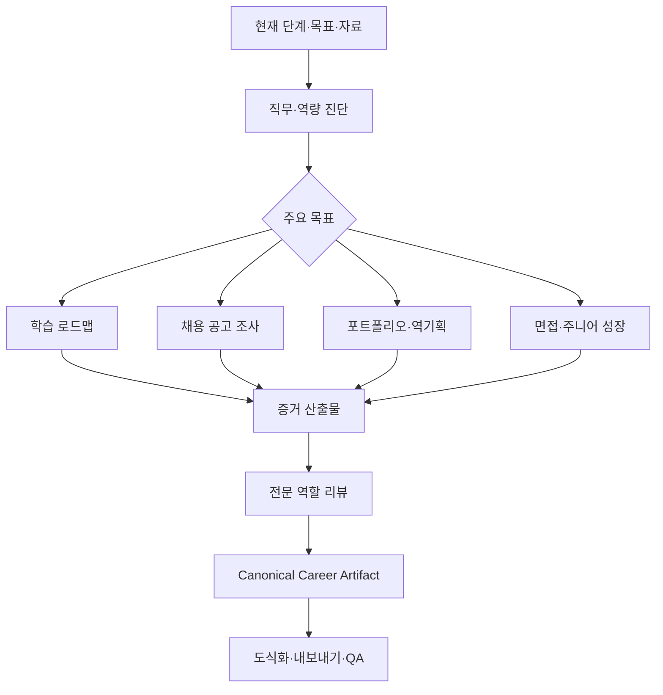

# Game Design Career Plugin 설계

## 1. 제품 정의

`game-design-career`는 게임 기획자 입문부터 신입 취업, 주니어 성장과 이직까지 지원하는 증거 중심 커리어 플러그인이다.

이 플러그인은 단순히 “열심히 하라”거나 보편적인 합격 공식을 제공하지 않는다. 사용자가 목표 직무에서 요구하는 역량을 파악하고, 자신의 프로젝트와 기획 문서에서 그 역량의 증거를 만들고, 포트폴리오와 면접에서 논리적으로 설명하도록 돕는다.

로컬 문서의 취업 조언은 작성 시점과 출처가 불명확한 항목이 많다. 따라서 직무 구조와 기획 원칙은 학습 자료로 활용하되, 채용 규모, 유망 장르, 엔진 선호, 회사 현황과 시장 전망은 최신 1차 자료로 다시 확인한다.

## 2. 지원 경력 단계

### 입문

- 게임 기획 직무와 개발 팀의 역할 이해
- 시스템, 콘텐츠, 밸런스, UX, LiveOps 등 관심 분야 탐색
- 현재 역량 진단과 6~12주 학습 계획
- 첫 분석·역기획·창작 기획 과제 선정

### 신입 취업

- 채용 공고의 요구 역량 분석
- 포트폴리오 백로그와 대표 프로젝트 선정
- 역기획·창작 기획·프로토타입의 목적과 증거 설계
- 지원 서류, 1분 소개, 지원동기와 면접 준비

### 주니어 성장

- 실제 프로젝트의 문제, 행동, 협업과 결과를 증거로 정리
- 문서 명료성, 데이터, 구현 이해, 플레이테스트와 의사결정 역량 강화
- 직무 전문화 또는 역할 확장 계획

### 이직

- 목표 회사·프로젝트·직무와 경험의 적합도 분석
- 프로젝트 임팩트와 의사결정 사례 재구성
- 부족 역량, 보완 프로젝트와 면접 리스크 관리

## 3. 스킬 구성

### 3.1 `orchestrate-game-design-career`

현재 경력 단계, 목표 직무, 희망 산업·회사, 보유 문서와 프로젝트, 기간과 제약을 진단한다. 필요한 스킬과 산출물 순서를 정하고 완료 기준을 합의한다.

### 3.2 `map-game-design-career`

게임 기획 직무 지도, 현재 역량, 목표 수준과 격차를 만든다. 결과를 학습 주제, 연습 과제, 피드백 주기와 증거 산출물로 변환한다.

### 3.3 `research-game-design-jobs`

최신 채용 공고, 회사·프로젝트, 직무 요구, 도구와 시장 정보를 조사한다. 출처 날짜, 지역, 고용 형태와 표본 한계를 기록한다. 단일 공고나 커뮤니티 의견을 업계 전체 사실로 일반화하지 않는다.

### 3.4 `build-game-design-portfolio`

포트폴리오를 형식이 아니라 “보여줄 역량 → 대상 문제 → 가설 → 기획 → 구현 또는 검증 → 결과 → 회고” 순서로 설계한다. 기존 게임의 제약, 협업 대상과 핸드오프, 데이터·플레이테스트와 의사결정 근거를 포함한다.

### 3.5 `reverse-engineer-game-design`

게임 사용 설명이 아니라 관찰 가능한 현상에서 기획 의도, 플레이어 경험, 내부 규칙, UI 상태, 데이터 구조, 예외, 운영 목적과 대안을 추론한다. 확인된 사실과 추론을 구분하고 반증 가능성을 기록한다.

### 3.6 `practice-game-design-interview`

직무, 회사, 채용 공고와 포트폴리오를 바탕으로 기본 질문, 꼬리질문, 반론과 상황 질문을 만든다. 답변은 주장, 근거, 선택 이유, 대안, 결과와 회고가 연결되는지 검토한다. 모르는 내용을 꾸미지 않고 확인 계획을 말하도록 훈련한다.

### 3.7 `review-game-design-portfolio`

포트폴리오와 기획 문서를 다음 5축으로 평가한다.

1. 기획 의도와 문제 정의
2. 플레이어 경험과 재미
3. 구현 가능성과 데이터·검증
4. 문서 가독성과 탐색성
5. 차별성, 선택 근거와 회고

모순, 무근거 단정, 중복, 범위 불명과 출처 누락은 별도 감점으로 기록한다.

### 3.8 `plan-junior-growth`

프로젝트에서 수행한 문제 해결, 협업, 우선순위, 실패와 개선을 증거로 정리한다. 다음 역할에서 요구하는 깊이와 범위를 비교하고 분기별 성장 목표, 보완 프로젝트와 이직 준비 계획을 만든다.

### 3.9 `visualize-career-roadmap`

직무 지도, 역량 맵, 학습 로드맵, 개발 프로세스, 포트폴리오 정보 구조와 성장 경로를 vendored `svg-infographic`으로 시각화한다. 통계적 수치를 표현해야 하면 SVG 인포그래픽 대신 데이터 정확성을 보장하는 차트 도구를 사용한다.

### 3.10 `export-career-documents`

학습 계획, 포트폴리오 기획, 역기획서, 리뷰 보고서, 면접 리포트와 이직 준비 자료를 MD, PDF, DOCX, PPTX로 내보낸다. 포트폴리오 PPTX는 채용 담당자가 짧은 시간에 핵심 역량과 증거를 찾을 수 있도록 별도 스토리라인을 만든다.

## 4. 전문 역할

| 역할 | 책임 | 대표 검토 질문 |
| --- | --- | --- |
| Career Strategist | 단계, 목표 직무, 우선순위와 일정 | 지금 가장 큰 취업·성장 병목은 무엇인가? |
| Game Design Mentor | 기획 학습, 과제와 실무 역량 | 연습이 실제 기획 판단과 산출물로 이어지는가? |
| Portfolio Reviewer | 구조, 증거, 명료성과 차별성 | 이 문서가 어떤 역량을 어떻게 증명하는가? |
| Reverse Design Critic | 사실·추론, 구조와 대안 | 관찰에서 내부 의도로 건너뛴 가정은 무엇인가? |
| Interview Coach | 질문, 꼬리질문, 논리와 전달 | 답변이 선택 이유와 결과를 입증하는가? |
| Evidence Auditor | 최신성, 출처와 과장 방지 | 이 주장은 언제, 어디에서, 어떤 근거로 유효한가? |

단순 로드맵은 Career Strategist와 Mentor가 순차 수행한다. 포트폴리오 리뷰는 Reviewer와 Evidence Auditor, 면접 준비는 Interview Coach와 목표 직무에 맞는 Reviewer를 함께 사용한다.

## 5. 근거·최신성 정책

모든 커리어 reference는 다음 셋 중 하나로 분류한다.

- `evergreen`: 기획 의도, 규칙·예외, 문제 해결 기록, 문서 명료성
- `contextual`: 포트폴리오 형식, 면접관 선호, 학벌·전공·자격증과 개발 경험의 가치
- `time-sensitive`: 채용 규모, 유망 직무·장르, 도구·엔진, 회사·프로젝트 현황, 보상과 근무 조건

`contextual` 조언은 저자 경험 또는 특정 조직의 관행으로 표시한다. `time-sensitive` 주장을 사용할 때는 최신 웹 또는 연결된 앱의 1차 자료를 확인한다. 확인할 수 없으면 로컬 문서의 작성 시점 불명을 명시하고 의사결정 근거로 단정하지 않는다.

채용 공고 분석은 다음을 기록한다.

- 회사, 프로젝트, 지역, 고용 형태와 게시일
- 필수·우대·업무 책임
- 반복되는 역량과 도구
- 지원자의 직접 증거와 부족한 증거
- 공고별 특수 요구와 일반화하면 안 되는 항목

## 6. 표준 산출물과 템플릿

- Career Stage & Goal Brief
- Game Design Role Map
- Competency Matrix
- 6/8/12-week Learning Roadmap
- Job Posting Evidence Matrix
- Portfolio Backlog
- Portfolio Project Brief
- Reverse Design Document
- Creative Design Portfolio Document
- Game Analysis Report
- Five-axis Portfolio Review Rubric
- Interview Question Bank and Answer Log
- One-minute Introduction and Motivation Brief
- Junior Growth Review
- Transition / Job-change Readiness Report

### 포트폴리오 프로젝트 계약

```text
목표 역량
→ 대상 게임·문제·사용자
→ 관찰과 근거
→ 가설과 기획 의도
→ 규칙·UI·데이터·콘텐츠 설계
→ 제약과 대안
→ 구현·프로토타입·플레이테스트
→ 결과와 변경 결정
→ 회고와 다음 검증
```

### 역기획 계약

- 확인된 현상과 자료
- 예상 플레이어 경험과 목적
- 내부 구조, 규칙, 상태와 데이터 추론
- UI·피드백과 예외
- 운영·경제·제작 관점의 가설
- 반례, 불확실성, 대안과 검증 방법

## 7. 작업 흐름



## 8. 문서 리뷰와 피드백 원칙

- 문서 앞부분에서 목적, 대상, 핵심 결론과 보여줄 역량을 찾을 수 있어야 한다.
- 큰 시스템은 작은 단위로 나누고 각 단위에서 규칙, UI와 데이터를 연결한다.
- 고유명사보다 기능을 드러내는 이름을 우선한다.
- 표와 플로우차트는 의사결정을 명확하게 할 때만 사용한다.
- 화면 사용법보다 UI의 목적, 상태, 편리성, 예외와 의도를 설명한다.
- 창의성은 기존 게임과 다르다는 선언이 아니라 제약 안에서 선택한 대안과 플레이 경험으로 입증한다.
- 점수만 주지 않고 가장 영향이 큰 수정 순서와 최소 수정안을 제공한다.

## 9. 오류와 안전 경계

- 사용자의 목표 직무가 불명확하면 직무 지도를 제공하되 특정 진로를 단정하지 않는다.
- 최신 채용 근거가 없으면 합격 가능성, 유망 직무, 연봉 또는 시장 전망을 확정적으로 말하지 않는다.
- 개인의 학벌, 전공, 나이 또는 공백을 단일 합격·불합격 요인으로 평가하지 않는다.
- 포트폴리오의 게임 데이터와 이미지가 제3자 저작물일 때 출처, 인용 범위와 사용 목적을 표시한다.
- 면접 답변에 허위 경험이나 수치를 만들지 않는다.
- 문서 변환 또는 시각 QA가 실패하면 Canonical Artifact를 보존하고 실패 형식을 명시한다.

## 10. E2E 완료 시나리오

### 10.1 입문 역량 진단과 12주 로드맵

입력: 게임은 많이 했지만 기획 경험이 없는 입문자.

합격 조건: 관심 직무 후보, 현재 증거, 부족 역량, 주차별 학습·과제·피드백, 첫 포트폴리오 브리프, 역량 맵 SVG와 PDF 로드맵이 검증된다.

### 10.2 역기획 기반 포트폴리오

입력: 특정 RPG의 강화 또는 퀘스트 시스템을 분석한 초안.

합격 조건: 사용 설명을 제거하고 사실·추론, 기획 의도, 규칙·예외·UI·데이터, 경제·운영 가설, 대안, 검증과 5축 리뷰를 포함한다. DOCX와 포트폴리오 PPTX가 렌더 검증된다.

### 10.3 면접과 주니어 이직 준비

입력: 2년차 기획자의 프로젝트 기록과 목표 공고.

합격 조건: 공고 근거, 프로젝트 임팩트 사례, 부족한 증거, 기본·꼬리·상황 질문, 답변 피드백, 분기별 보완 계획과 이직 준비 보고서가 생성된다. 최신성 미검증 주장이 없어야 한다.

## 11. 제품 완료 기준

- 10개 Career 스킬이 독립 검증되고 단계별 요청을 올바르게 라우팅한다.
- 6개 전문 역할이 병렬 및 순차 fallback 계약을 지킨다.
- 원문 49개가 누락 없이 인덱싱되고 채용·시장 주장의 최신성 유형이 표시된다.
- 15개 표준 산출물 템플릿이 Canonical Artifact 계약을 지킨다.
- 세 E2E 시나리오와 단독 설치 smoke가 통과한다.
- 현재 Codex 앱 환경에서 대표 MD, PDF, DOCX, PPTX, SVG와 PNG가 실제 렌더 검증된다.

