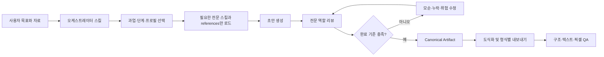
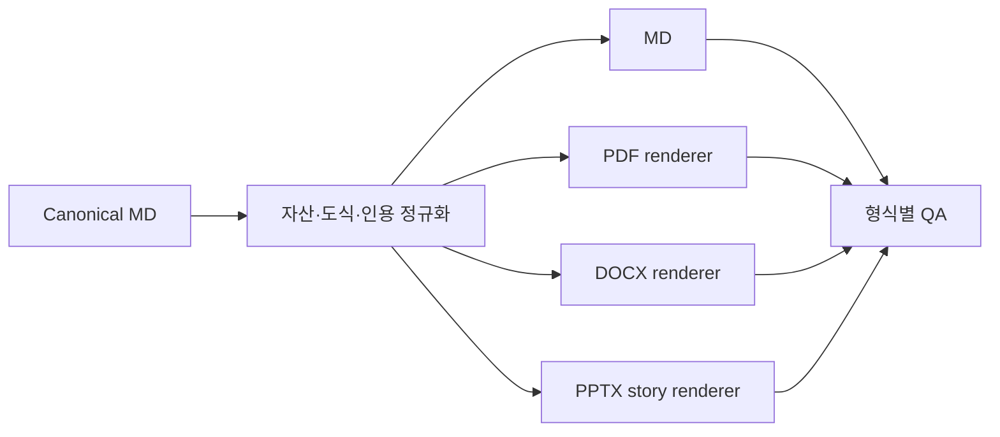

# Game Design Plugin Suite 설계

## 1. 결정 요약

이 프로젝트는 게임 기획 업무를 두 개의 독립 Codex 플러그인으로 제공한다.

- `game-design-studio`: 실제 게임 제작과 운영을 위한 전문 기획 플러그인
- `game-design-career`: 게임 기획자 입문, 취업, 성장과 이직을 위한 전문 플러그인

두 플러그인은 저장소에서 지식, 템플릿, 내보내기 계약, 품질 기준과 도식화 도구를 공동 관리한다. 빌드 시 필요한 공통 파일을 각 플러그인에 복제하여, 설치된 패키지는 서로에게 의존하지 않고 독립 실행된다.

기본 구조는 워크플로 중심 모듈형이다. 일반 작업은 필요한 스킬과 전문 역할만 순차 실행하고, 복합 분석이나 대형 리뷰에만 2~3개 전문 역할을 병렬 호출한다.

## 2. 목표

1. `docs/`의 49개 한국어 문서를 게임 기획 지식으로 활용하되 중복, 경험담, 오탈자와 오래된 주장을 구분한다.
2. 현업 제작과 커리어 지원을 별도 제품으로 제공해 각 플러그인의 목적과 문맥을 선명하게 유지한다.
3. Canonical Markdown을 기준 원본으로 삼고 MD, PDF, DOCX, PPTX를 일관되게 생성한다.
4. Skillstead의 `svg-infographic` 0.8.3을 양쪽 플러그인에 포함하고, 게임 기획에 필요한 구조·흐름·로드맵을 SVG와 PNG로 시각화한다.
5. 접근성, AI 권리와 인간 승인, 경제 투명성, LiveOps 실험, UGC와 AI NPC 안전, 범위 통제를 기본 품질 게이트로 둔다.
6. 두 플러그인을 같은 저장소에서 병렬 개발·검증하면서도 각각 단독 설치할 수 있게 한다.

## 3. 비목표

- v1에서 별도 MCP 서버, 영속 데이터베이스, 웹 협업 서비스 또는 외부 SaaS를 운영하지 않는다.
- 플러그인이 법률 준수, 채용 합격, 흥행 또는 매출을 보장하지 않는다.
- 오래된 로컬 문서를 최신 시장 사실로 취급하지 않는다.
- 네이티브 커스텀 에이전트 자동 설치를 플러그인의 필수 동작으로 가정하지 않는다.
- 장문 Markdown을 기계적으로 분할해 PPTX라고 부르지 않는다.
- AI가 생성한 규칙, 대사, 자산 또는 경제 변경을 인간 승인 없이 출시 가능한 결과로 판정하지 않는다.

## 4. 모노레포 아키텍처

```text
gamedesign-plugin/
├── .agents/plugins/marketplace.json
├── docs/                               # 사용자 제공 원문 49개와 설계 문서
├── shared/                             # 공통 편집 원천
│   ├── knowledge/
│   │   ├── core/                       # 중복 제거·검증 상태가 표시된 핵심 지식
│   │   ├── reference-index.yml         # 원문/주장/시점/출처 인덱스
│   │   └── trends/                     # 공식 근거의 검토 스냅샷과 갱신 정책
│   ├── templates/
│   ├── responsible-design/
│   ├── export/
│   │   ├── schema/
│   │   ├── themes/
│   │   └── qa-contracts/
│   └── vendor/
│       └── skillstead/svg-infographic/0.8.3/
├── products/
│   ├── game-design-studio/             # Studio 전용 overlay
│   └── game-design-career/             # Career 전용 overlay
├── tooling/                             # sync/build/index/validate 도구
├── tests/
│   ├── unit/
│   ├── contracts/
│   ├── golden/
│   ├── formats/
│   ├── isolation/
│   └── e2e/
└── plugins/                             # marketplace가 소비하는 빌드 스냅샷
    ├── game-design-studio/
    └── game-design-career/
```

`shared/`와 `products/`만 사람이 편집하는 원천이다. `plugins/`는 깨끗한 staging 디렉터리에서 재현 가능하게 생성되는 배포 스냅샷이다. 빌드 중 같은 경로를 두 원천이 서로 다른 내용으로 제공하면 덮어쓰지 않고 실패한다.

`docs/`의 원문은 저장소에서 중복 보관하지 않는다. 빌드가 필요한 원문을 각 플러그인의 `references/source/`로 복사한다.

## 5. 패키지 독립성 계약

각 배포 플러그인은 다음을 자체 포함한다.

- `.codex-plugin/plugin.json`
- 제품별 `skills/`
- 전문 역할 정의 `agents/`
- 기본 발견 경로의 `hooks/hooks.json`
- 런타임 검증과 내보내기 보조 `scripts/`
- 핵심 지식, 원문, 최신성 정책 `references/`
- 템플릿, 테마, 로고와 내보내기 자산 `assets/`
- Skillstead 라이선스와 제3자 고지

빌드 결과에는 symlink, `../shared`, sibling 플러그인 경로 또는 저장소 절대 경로가 없어야 한다. 각 플러그인을 빈 임시 환경에 단독 추출한 상태에서 스킬 탐색, 참조 로딩, Markdown 생성과 패키지 검증이 성공해야 한다.

## 6. 플러그인 실행 흐름



전문 역할은 `agents/*.md`에 역할, 입력, 검토 질문, 금지 행동과 출력 계약을 정의한다. 호스트가 서브에이전트를 지원하면 오케스트레이터가 해당 역할 프롬프트를 전달해 병렬 실행한다. 지원하지 않으면 같은 역할 검토를 현재 에이전트가 순차 수행한다. 따라서 네이티브 에이전트 자동 발견은 성능 최적화일 뿐 정확성의 필수 조건이 아니다.

## 7. 지식 아키텍처

### 7.1 3층 references

1. **Core**: 중복을 제거한 실무 원칙, 템플릿, 체크리스트와 적용 한계. 대부분의 요청은 이 계층만 읽는다.
2. **Source**: 사용자 제공 원문 49개. 사례나 원문 맥락이 필요할 때만 읽는다.
3. **Current**: 채용시장, 플랫폼 정책, 접근성, AI 권리, 수익화와 규제 등 시점 의존 정보의 공식 출처와 갱신 정책.

Core 문서는 Source를 대체하지 않는다. 모든 핵심 항목은 원문 경로와 연결되고, 수정된 해석은 파생 지식임을 표시한다.

### 7.2 근거 메타데이터

```yaml
id: claim-or-reference-id
claim_type: evergreen | contextual | time-sensitive
source_path: docs/...
source_date: unknown
verified_at: null
primary_sources: []
confidence: low | medium | high
limitations: []
```

- `evergreen`: 기획 의도, 규칙·예외, 문서 명료성 등 비교적 안정적인 원칙
- `contextual`: 포트폴리오 선호, 면접 방식, 특정 장르 사례처럼 조직과 상황에 따라 달라지는 조언
- `time-sensitive`: 채용시장, 도구·엔진, 법률·정책, 플랫폼 심사, 게임 지표와 시장 전망

최신 1차 출처와 로컬 문서가 충돌하면 최신 근거를 우선하고 `source-conflict`를 기록한다. 법률과 규제 자료는 준수 판정이 아니라 적용 지역과 법무 검토가 필요한 지점을 알려준다.

## 8. Canonical Artifact 계약

모든 주요 작업은 다음 패키지를 기준 결과로 남긴다.

```text
artifact-name/
├── content.md
├── evidence.yml
├── decisions/
├── assets/
└── export-manifest.yml
```

`content.md`는 내용의 유일한 기준 원본이다. 문서에는 YAML frontmatter, 정확히 하나의 H1, 안정적인 heading ID, 로컬 자산 링크와 alt text가 있어야 한다. 파일명과 본문은 Unicode NFC를 사용한다.

`evidence.yml`은 시점 의존 주장, 외부 사례, 수치, 규제와 채용 정보를 추적한다. `decisions/`는 선택한 대안, 배제한 대안, 부작용, 승인자와 변경 이력을 기록한다. `export-manifest.yml`은 청중, 목적, 출력 형식, 테마, 페이지 또는 슬라이드 구조와 QA 상태를 담는다.

## 9. 도식화 통합

Skillstead `svg-infographic` 0.8.3 전체를 `shared/vendor/skillstead/svg-infographic/0.8.3/`에 무수정 보관하고 각 플러그인의 `skills/svg-infographic/`으로 복제한다.

각 패키지는 다음을 포함한다.

- 원본 `LICENSE.txt`
- `THIRD_PARTY_NOTICES.md`
- upstream URL, 버전 0.8.3과 Apache-2.0 표시
- `Copyright 2026 Kyungseo Park`
- 파일별 SHA-256을 기록한 `vendor.lock.json`

게임 기획 전용 wrapper 스킬은 원본을 수정하지 않고 다음 프리셋을 추가한다.

- 코어 루프와 동기 루프
- 시스템 상태와 규칙 흐름
- 퀘스트·콘텐츠 진행
- 게임 경제 source/sink
- LiveOps 로드맵
- 개발 프로세스와 역할 구조
- 역량 맵과 커리어 로드맵
- 포트폴리오 정보 구조

SVG는 upstream lint를 통과해야 하며, PNG는 Chromium 2× 렌더와 정확한 크기 검증 후 픽셀 QA를 수행한다. 브라우저가 없으면 편집 가능한 SVG만 제공하고 PNG 검증이 실행되지 않았음을 명시한다.

## 10. Hooks와 scripts

### 10.1 Hook 원칙

플러그인 manifest에는 현재 로컬 `plugin-creator` validator가 거부하는 `hooks` 필드를 넣지 않는다. 대신 공식 기본 발견 경로인 `hooks/hooks.json`을 사용한다.

v1 hook은 두 종류로 제한한다.

1. `SessionStart`: Node 18+, Chromium, 문서·PDF·프레젠테이션 capability를 읽기 전용으로 점검하고 사용 가능한 출력 정보를 컨텍스트에 추가한다.
2. `Stop`: 플러그인 식별자가 있는 active artifact만 검사한다. 근거, 접근성, 권리, 범위, 내보내기 QA 누락이 있으면 한 번만 추가 검토를 요청하며 재진입 표식으로 무한 반복을 막는다.

훅은 사용자 신뢰 전 실행되지 않는다. 훅이 비활성화되어도 각 스킬의 완료 기준과 명시적 검증 명령만으로 같은 품질을 얻을 수 있어야 한다.

### 10.2 Repository tooling

- `sync-shared`: 공통 원천과 제품 overlay를 staging에 합성
- `build-snapshots`: 두 독립 플러그인 생성
- `index-references`: 원문과 Core 항목의 연결 인덱스 생성
- `audit-evidence`: 시점, 출처, 신뢰도와 충돌 상태 검사
- `verify-vendor-hash`: Skillstead 파일과 잠금 정보 검증
- `validate-suite`: 스킬, manifest, marketplace, 라이선스와 경로 계약 검증
- `isolation-smoke`: 각 패키지를 단독 환경에 설치해 sibling 의존성 검사

## 11. 문서 내보내기



- **MD**: frontmatter, H1, 링크, 로컬 자산과 Unicode 검증
- **PDF**: 텍스트 추출, 폰트 포함, 페이지 수와 전 페이지 이미지 렌더 검증
- **DOCX**: OOXML/relationship 검사, 본문 의미 비교, PDF 또는 PNG 렌더 검증
- **PPTX**: 청중과 메시지를 위한 별도 스토리라인, 슬라이드 경계, overflow, 전체 슬라이드 렌더 검증

현재 Codex 앱의 문서·PDF·프레젠테이션 런타임을 우선 사용한다. export 스킬은 capability를 확인하고 지원되는 도구에 위임한다. MD는 항상 제공한다. 다른 renderer가 없거나 QA가 실패하면 Canonical 패키지를 보존하고 생성되지 않은 형식과 필요한 capability를 명시한다.

PPTX는 `export-manifest.yml`에 청중, 목적과 슬라이드 아웃라인이 있어야 한다. 없으면 슬라이드 파일을 만들기 전에 프레젠테이션 구조를 먼저 설계한다.

## 12. 오류 처리

| 상황 | 보존할 것 | 동작 |
| --- | --- | --- |
| 최신 근거를 확인할 수 없음 | 로컬 근거와 초안 | 사실과 가정을 분리하고 미검증으로 표시 |
| 출처가 충돌함 | 양쪽 출처 | `source-conflict`와 결정 필요 항목 기록 |
| Office/PDF renderer 부재 | Canonical MD | 누락 형식과 필요 capability 보고 |
| SVG lint 또는 render 실패 | 편집 가능한 SVG | 검증되지 않은 PNG를 성공 결과로 제공하지 않음 |
| 권리·동의가 불명확함 | 아이디어와 요구사항 | 출시 승인 차단, 책임자와 검토 트리거 추가 |
| 공통 원천과 snapshot drift | 공통 원천 | 패키징 중단 후 clean build 요구 |
| Skillstead hash 불일치 | 고정 버전 잠금 정보 | vendored package 갱신 절차 없이는 빌드 중단 |

## 13. 검증 전략

1. **Unit**: 메타데이터, 인덱스, 경로, evidence와 canonical lint
2. **Contract**: 스킬 이름, references 링크, 역할, 템플릿, hook 입력/출력 계약
3. **Golden**: 대표 입력에 대한 Markdown 구조와 필수 내용 비교
4. **Format**: MD/PDF/DOCX/PPTX/SVG/PNG 구조, 텍스트와 픽셀 검증
5. **Isolation**: 각 플러그인을 빈 환경에 단독 설치하고 실행
6. **Package**: 모든 스킬의 `quick_validate`, 두 플러그인의 `validate_plugin`, marketplace 정책과 라이선스 검사
7. **Install smoke**: repo marketplace에서 각 플러그인을 설치하고 새 대화에서 대표 요청 실행

## 14. 병렬 개발 경계

구현은 다음 세 lane으로 병렬화한다.

- **Shared lane**: knowledge, templates, export contract, visualization vendor, build와 validation
- **Studio lane**: Studio 스킬, 역할, 프로필, 템플릿과 E2E fixture
- **Career lane**: Career 스킬, 역할, 근거 감사, 템플릿과 E2E fixture

Shared lane은 계약 파일과 생성 스크립트를 소유한다. 제품 lane은 `products/<plugin>/`만 편집한다. `plugins/`는 병렬 작업 중 직접 편집하지 않고 통합 단계에서 clean build로 생성한다.

## 15. 완료 기준

- 두 plugin manifest와 repo marketplace가 검증된다.
- 20개 제품 스킬과 vendored `svg-infographic`이 각각 올바르게 탐색된다.
- 전문 역할이 병렬 지원 환경과 순차 fallback 환경에서 같은 검토 계약을 지킨다.
- 원문 49개가 인덱스에 누락 없이 연결되고 시점 의존 주장이 표시된다.
- 두 플러그인의 대표 E2E 시나리오 3개씩 통과한다.
- 각 플러그인이 단독 설치 상태에서 Canonical MD를 생성한다.
- 현재 Codex 앱 환경에서 MD, PDF, DOCX, PPTX와 대표 SVG/PNG 출력이 실제 렌더 검증된다.
- README에 구조, 설치, 사용, 트리거, 출력 형식, 라이선스, 제한과 문제 해결이 문서화된다.

