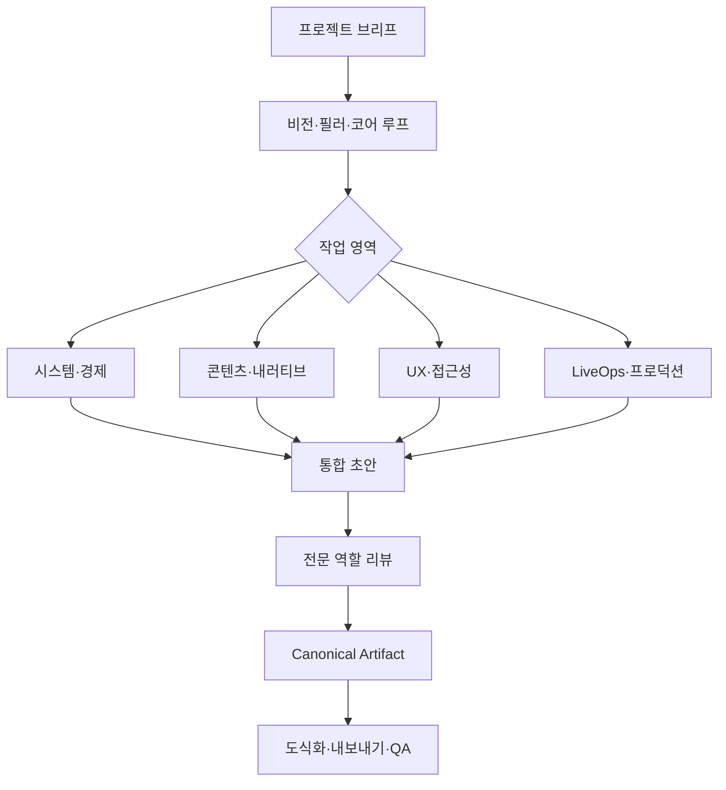

# Game Design Studio Plugin 설계

## 1. 제품 정의

`game-design-studio`는 아이디어를 실제 제작 가능한 게임 기획과 운영 계획으로 전환하는 현업용 플러그인이다. 장르에 종속되지 않는 범용 코어를 제공하고, `live-service-rpg`, `mobile`, `pc-console` 프로필을 필요에 따라 합성한다.

플러그인의 판단 기준은 “기능이 많아 보이는가”가 아니라 다음 질문이다.

- 어떤 플레이어에게 어떤 경험을 제공하는가?
- 규칙, 콘텐츠, UI, 데이터와 운영이 같은 기획 의도를 지지하는가?
- 팀이 구현하고 검증할 수 있는가?
- 접근성, 권리, 경제 투명성과 안전을 해치지 않는가?
- 출시 이후의 유지 비용과 중단 조건이 명확한가?

## 2. 주요 사용자와 사용 시점

- 리드 게임 디자이너와 디렉터: 비전, 필러, 범위와 의사결정
- 시스템·밸런스·경제 기획자: 규칙, 상태, 수치, 데이터와 악용 방지
- 콘텐츠·내러티브 기획자: 퀘스트, NPC, 캐릭터, 전투, 몬스터와 제작 명세
- UX/UI 기획자: 정보 구조, 상호작용, 온보딩과 접근성
- LiveOps·서비스 기획자: 이벤트, 실험, 경제, 지표와 롤백
- 프로듀서·PM: 일정, 의존성, 리스크, 프로토타입과 컷 리스트

대표 사용 시점은 컨셉 수립, 프리프로덕션, 기능 상세 기획, 프로토타입 검증, 프로덕션 핸드오프, 출시 준비, LiveOps 실험과 기존 기획서 리뷰다.

## 3. 스킬 구성

### 3.1 `orchestrate-game-design-project`

모든 복합 요청의 진입점이다. 다음을 확정한다.

- 게임과 플레이어 목표
- 플랫폼, 장르, 비즈니스 모델, 온라인 여부
- 현재 개발 단계, 팀 규모, 일정과 기술 제약
- 이번 작업의 범위와 비목표
- 필요한 프로필과 전문 스킬
- 산출물 형식과 완료 기준

요청이 충분히 구체적이면 질문 없이 합리적인 가정을 기록하고 진행한다. 결과를 크게 바꾸는 정보만 한 번에 하나씩 확인한다.

### 3.2 `define-game-vision`

타깃 플레이어, 문제, 기획 의도, 목표 감정, 핵심 재미, 디자인 필러, 코어 루프, 동기·몰입 루프, 경쟁·협동 경험과 성공 지표를 설계한다. 선택이 플레이어 통제감과 의미 있는 결과를 만드는지 검토한다.

### 3.3 `design-game-systems`

시스템을 입력, 사전조건, 규칙, 상태 변화, 출력과 피드백으로 정의한다. 기능·속성 분해, 코어/서브/예외 규칙, 우선순위, 동시성, 실패·복구, 악용, UI 상태, PK/FK와 데이터 스키마, 테이블-UI-런타임 매핑을 포함한다.

### 3.4 `design-game-content`

내러티브, 세계관, 플롯, 퀘스트, NPC, 플레이어 캐릭터, 전투 스킬, 액션, 몬스터, 보스와 레벨 콘텐츠를 설계한다. 콘텐츠의 목적, 시스템 입력, 제작 리소스, 플레이어 공략, 텔레그래프, 성공·실패, 보상과 반복 가능성을 명세한다.

### 3.5 `design-player-experience`

정보 우선순위, 화면 흐름, UI 요소 상태, 상호작용, 오류 메시지, 첫 5분, 첫 성공, 튜토리얼 건너뛰기·재열람, 입력 장치, 성능 제약과 크로스플랫폼 차이를 설계한다. 접근성은 후처리가 아니라 초기 요구사항으로 포함한다.

### 3.6 `design-game-economy-and-liveops`

재화 source/sink, 목표 재고, 성장 시간, 인플레이션, 상점, 확률, 천장, 실질 가격, 이벤트 캘린더와 세그먼트를 설계한다. 실험은 가설, 대조군, 단일 변경, 표본·기간, 성공 지표, 보호 지표, 중단·롤백 조건을 갖춰야 한다.

### 3.7 `plan-game-production`

기능을 핵심 루프 기여, 제작 난이도, 운영 부담, 외주·라이선스 위험과 유지 비용으로 평가한다. 프로토타입 가설, 마일스톤, 의존성, 담당, 완료 정의, 폐기 조건과 must/should/could/won't 범위를 만든다.

### 3.8 `review-game-design`

기획 의도, 플레이어 경험, 규칙 일관성, 구현 가능성, 데이터, 문서 탐색성, 차별성, 악용, 접근성, 권리, 경제 투명성과 운영 위험을 검토한다. 발견 사항은 심각도, 근거, 영향과 최소 수정안으로 작성한다.

### 3.9 `visualize-game-design`

vendored `svg-infographic`을 게임 기획 프리셋으로 호출한다. 복잡한 시스템, 상태, 루프, 경제, 퀘스트, 역할, 로드맵처럼 공간 관계가 이해를 실질적으로 개선할 때만 사용한다.

### 3.10 `export-game-design-documents`

Canonical Artifact를 GDD, 시스템 기획서, 콘텐츠 명세, LiveOps 계획, 리뷰 보고서, 임원용 프레젠테이션으로 변환한다. MD, PDF, DOCX, PPTX 각각의 구조와 렌더 QA를 수행한다.

## 4. 전문 역할

| 역할 | 책임 | 대표 검토 질문 |
| --- | --- | --- |
| Lead Game Designer | 의도, 필러, 우선순위와 범위 | 이 기능이 핵심 경험에 필요한가? |
| System & Economy Designer | 규칙, 수치, 상태, 경제와 악용 | 예외·우선순위·source/sink가 닫혀 있는가? |
| Content & Narrative Designer | 퀘스트, NPC, 전투, 제작 명세 | 시스템과 이야기, 공략과 제작 비용이 연결되는가? |
| UX & Accessibility Reviewer | UI 흐름, 온보딩, 입력과 접근성 | 주요 행동을 다양한 플레이어가 이해하고 수행할 수 있는가? |
| LiveOps & Data Designer | 지표, 실험, 이벤트와 롤백 | 가설·보호 지표·중단 조건이 있는가? |
| Production & Feasibility Critic | 일정, 의존성, 위험과 컷 | 현재 팀과 일정으로 검증 가능한가? |

오케스트레이터는 단순 작성에 1개 역할, 시스템-콘텐츠 경계 작업에 2개 역할, 출시·경제·안전 리뷰에 최대 3개 역할을 선택한다. 모든 역할을 매번 실행하지 않는다.

## 5. 장르·플랫폼 프로필

### 5.1 범용 코어

기획 의도, 코어 루프, 입력-규칙-출력, 콘텐츠 제작, UI 상태, 데이터, 검증과 변경 관리는 모든 프로젝트에 적용한다.

### 5.2 Live-service RPG

- 성장·전투·수집·사회 시스템의 장기 루프
- 재화 source/sink와 경제 인플레이션
- 캐릭터·장비·스킬·퀘스트·몬스터 데이터
- 이벤트, 시즌, 복귀, 신규/고인물 격차
- 밸런스 변경, 보상, 공정성과 롤백

### 5.3 Mobile

- 터치 입력, 화면 크기, 세션 길이와 중단·복귀
- 성능, 네트워크, 배터리와 다운로드 크기
- 온보딩, 알림, 접근성, 스토어 정책
- 실제 가격, 확률, 미성년자 보호와 과금 후회 지표

### 5.4 PC/Console

- 키보드·마우스·패드와 리매핑
- 저장, 업적, 플랫폼 권한과 크로스세이브
- 화면 거리, 해상도, 성능 모드와 카메라 편안함
- 온라인 매치풀, 입력 공정성과 UGC/모딩

프로필은 절대 규칙이 아니라 질문과 검증 항목을 추가한다. 여러 프로필을 합성할 때 충돌 항목을 결정 기록에 남긴다.

## 6. 표준 산출물과 템플릿

- Game Design Brief
- Vision & Design Pillars
- Core Loop / Motivation Loop
- System Specification
- Rule & Exception Matrix
- UI/UX Flow and State Specification
- Data Schema and Table Contract
- Narrative / Quest / NPC Specification
- Character / Skill / Combat / Monster Specification
- Economy Model and Balance Sheet
- LiveOps Experiment Card and Event Plan
- Accessibility and Platform Compatibility Matrix
- Production Scope, Milestone and Risk Plan
- Game Design Review Report
- Decision Log and Change History

시스템 명세의 기본 장 구조는 개요·의도·범위·용어, 입력·사전조건·규칙·상태 변화·출력, 기능/속성 분해, 예외·오류·우선순위, 플로우, UI 상태, 데이터 스키마, 런타임 매핑, 변경 이력과 담당이다.

## 7. 책임 있는 설계 게이트

모든 관련 템플릿에 다음 항목을 포함한다.

### AI 권리와 인간 승인

- 입력·학습·출력의 권리와 라이선스
- 모델, 프롬프트, 생성·수정 이력
- 인간의 표현적 기여와 승인자
- 실존 인물, 성우, 초상과 보이스 동의
- 플레이어 노출 전 안전·품질 검토

### 접근성

- 자막, 텍스트 크기, 색 외 정보 전달
- 입력 리매핑, 대체 입력과 보조 기능
- 난이도, 카메라, 모션, 오디오와 인지 부하 옵션
- 실제 장애 당사자 또는 접근성 플레이테스트 계획

### 경제와 수익화

- 실제 통화 환산가, 확률, 보장·천장, 만료와 환불
- 미성년자 보호, 부모 동의, 지출 한도와 구매 이력
- 다중 가상화폐 변환과 다크 패턴 위험
- 세그먼트별 가격·난이도 차이의 공정성 검토

### UGC와 AI NPC

- 허용 데이터·외형·맵·스크립트 범위
- 권한, 검증, 샌드박스와 서버 권위
- 신고, 차단, 삭제, 이의제기와 kill switch
- AI NPC의 역할, 상태, 허용 행동, 기억 범위, 폴백, 비용·지연 예산

## 8. 작업 흐름

## 9. 오류와 중단 조건

- 핵심 의도나 대상 플레이어가 없으면 가정을 기록하고 초안을 만들되, 대규모 제작 결정을 확정하지 않는다.
- 플랫폼 또는 법적 적용 범위가 불명확하면 관련 항목을 미확정으로 표시한다.
- 통계적 근거가 없는 LiveOps 실험은 출시 권고를 하지 않는다.
- 경제 변경에 실제 가격·확률·롤백 정보가 없으면 검토를 실패시킨다.
- AI/UGC 권리 또는 동의가 불명확하면 플레이어 공개 승인을 차단한다.
- 문서 변환 또는 시각 QA가 실패하면 Canonical Artifact를 보존하고 실패한 형식을 보고한다.

## 10. E2E 완료 시나리오

### 10.1 Live-service RPG 성장·경제

입력: 캐릭터 성장, 장비 강화와 두 종류 재화를 가진 신규 시스템 브리프.

합격 조건: 기획 의도, 코어 루프, source/sink, 성장 시간, 악용·선의 피해, 확률·천장, 데이터 스키마, LiveOps 지표, 롤백, 접근성·경제 게이트, MD/DOCX와 경제 흐름 SVG가 검증된다.

### 10.2 Mobile 온보딩·LiveOps 실험

입력: 첫 10분 이탈을 개선하려는 모바일 게임.

합격 조건: 첫 5분 목표, 첫 성공, 튜토리얼 재열람, 입력·화면·접근성, 실험 가설·대조군·보호 지표·중단 조건, PDF와 임원용 PPTX가 검증된다.

### 10.3 PC/Console 퀘스트·AI NPC

입력: 자유대화 AI NPC가 분기 퀘스트를 안내하는 싱글/온라인 혼합 게임.

합격 조건: NPC 역할·상태·기억·폴백·금지 행동, 퀘스트의 결정론적 규칙, 서버 권위, 안전 필터, 권리·개인정보, 비용·지연, 플랫폼 입력, 퀘스트 플로우 SVG와 전체 기획 패키지가 검증된다.

## 11. 제품 완료 기준

- 10개 Studio 스킬이 독립적으로 검증되고 오케스트레이터가 대표 요청을 올바르게 라우팅한다.
- 6개 전문 역할이 병렬 및 순차 fallback 계약을 지킨다.
- 범용 코어와 세 프로필이 충돌 없이 합성된다.
- 15개 표준 산출물 템플릿이 Canonical Artifact 계약을 지킨다.
- 세 E2E 시나리오와 단독 설치 smoke가 통과한다.
- 현재 Codex 앱 환경에서 대표 MD, PDF, DOCX, PPTX, SVG와 PNG가 실제 렌더 검증된다.
