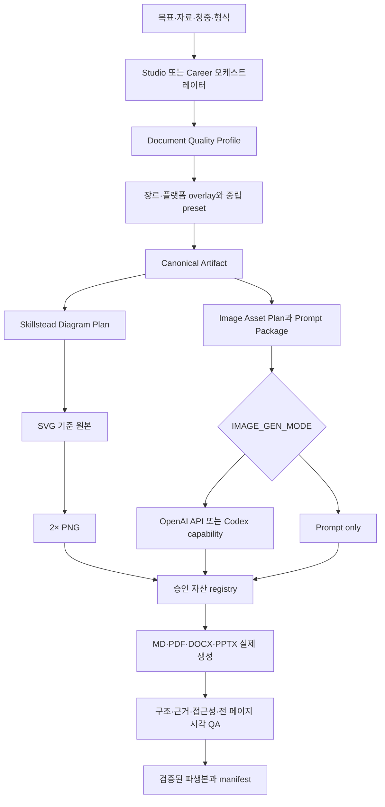

# 문서 Quality Profile 및 이미지 자산 파이프라인 설계

## 1. 결정 요약

Game Design Studio와 Game Design Career에 다음 기능을 추가한다.

1. 문서 유형별 `Document Quality Profile`로 필수 구조, 표, 도식, 이미지 슬롯, 분량 지침, 수용 기준과 출력 규격을 고정한다.
2. 장르·플랫폼 overlay와 저작권 문제가 없는 범위에서 일반화한 중립 reference preset을 선택적으로 적용한다.
3. 모든 이미지 자산에 구조화된 art brief, 생성 프롬프트, 상태, 권리·출처와 승인 기록을 만든다.
4. `IMAGE_GEN_MODE`의 네 모드로 자동 생성 범위를 제어한다.
5. `OPENAI_API_KEY`가 있으면 OpenAI Images API만 사용하고, 없으면 호스트 Codex 이미지 생성 capability를 사용한다.
6. Skillstead `svg-infographic` 0.8.3은 구조적 도식의 전용 생성기이며 일반 생성형 이미지는 이를 대체하지 않는다.
7. 승인된 도식과 이미지를 MD, PDF, DOCX, PPTX에 삽입하고 전 페이지·슬라이드 QA를 수행한다.

두 플러그인은 공통 계약과 실행 자산을 각각 패키지에 포함한다. 한 제품만 설치해도 다른 제품이나 저장소 원천에 의존하지 않는다.

## 2. 현재 상태와 보완할 차이

현재 suite에는 다음 기능이 이미 있다.

- 49개 로컬 게임 기획 문서와 검토된 Core·Current 지식
- 제품별 Canonical Artifact 템플릿 15개
- Canonical Artifact 구조·근거·경로 검증
- MD, PDF, DOCX, PPTX 준비 계약과 대표 형식 검증
- Skillstead 기반 SVG와 2× PNG 도식화
- 전 페이지·슬라이드 렌더 결속과 fail-closed QA
- 자산의 상대 경로, alt text, 권리·출처를 기록하라는 템플릿 지침

현재 보완이 필요한 차이는 다음과 같다.

- 템플릿이 공통 안전 섹션은 갖지만 문서 유형별 분량, 필수 표·도식·이미지와 수용 기준을 충분히 강제하지 않는다.
- PPTX 준비 계약은 독립 스토리를 요구하지만 seed schema는 slide title 이상의 메시지 계약을 충분히 검증하지 않는다.
- 설치된 플러그인은 format job을 준비하지만 실제 renderer 실행과 terminal QA를 하나의 완결된 product workflow로 제공하지 않는다.
- 일반 이미지의 art brief, 프롬프트 패키지, provider routing, 생성, 검토와 승인 lifecycle이 없다.
- `.env`를 읽는 이미지 설정 계약과 `.env.example`이 없다.

이 설계는 기존 Canonical Artifact와 형식별 보안 검증을 대체하지 않고 그 위에 추가한다.

## 3. 리서치 결론과 사용 경계

### 3.1 문서 표준화 결론

게임 업계 전체를 강제하는 단일 GDD 표준은 확인되지 않았다. 공개 실무 자료에서 반복되는 방식은 하나의 거대 문서가 아니라 목적별 문서 포트폴리오다.

- 짧은 Vision·One-pager가 대상 플레이어, 경험 약속, pillar와 범위 거절 기준을 제공한다.
- Master GDD는 상세 구현값을 중복하지 않고 상위 경험, 공통 규칙과 상세 명세의 인덱스를 유지한다.
- System, Content, UI, Economy, LiveOps, Production 명세는 독립적으로 구현·검토 가능한 계약을 가진다.
- Playtest, telemetry와 decision log가 문서의 가설과 변경 이유를 갱신한다.
- 모든 문서는 ID, owner, 상태, 버전, 의존성, 미확정 사항, 수용 기준과 변경 이력을 가진다.

연구 근거는 다음과 같다.

- [Prince of Persia 2 Project Bible](https://www.jordanmechner.com/downloads/library/pop2bible.pdf): 버전·교체 페이지·공통 참조 구조를 보여 주는 원저자 공개 실제 문서
- [GDC Single-Player RTS Design](https://media.gdcvault.com/gdc07/slides/S4607i1.pdf): one-pager에서 상세 설계와 반복 리뷰로 진행하는 공개 실무 사례
- [GDC Level and Quest Design Collaboration](https://media.gdcvault.com/gdc2024/Slides/GDC%2Bslide%2Bpresentations/Shen_Will_LevelandQuest.pdf): 퀘스트와 레벨·전투·NPC·내러티브의 교차 의존성
- [Xbox Accessibility Guidelines](https://learn.microsoft.com/en-us/xbox/accessibility/guidelines): goal, scoping question, implementation guideline, example과 player impact의 검토 구조
- [Steamworks Microtransactions Implementation Guide](https://partner.steamgames.com/doc/features/microtransactions/implementation?l=english): 주문·아이템·통화·환불·회수·감사 상태의 플랫폼별 실행 계약

### 3.2 프로젝트 사례에서 추출한 품질 원칙

공식 발표·개발 블로그·회고에서 다음 연결이 반복된다.

```text
Player promise
→ Design pillars
→ Core loop와 단·중·장기 목표
→ 플레이어가 읽어야 할 신호
→ Playtest 질문과 지표
→ 출시 후 조정 규칙
→ Art·Audio·Tech handoff와 완료 기준
```

대표 근거에는 [Valve Left 4 Dead GDC 발표](https://steamcdn-a.akamaihd.net/apps/valve/2009/GDC2009_ReplayableCooperativeGameDesign_Left4Dead.pdf), [Riot Champion Insights: Rell](https://www.leagueoflegends.com/en-us/news/dev/champion-insights-rell/), [Blizzard Overwatch 2 Beta Analysis](https://news.blizzard.com/en-us/article/23787377/overwatch-2-pvp-beta-analysis-how-data-and-community-feedback-inform-game-balance), [Bungie Director's Cut](https://www.bungie.net/7/en/News/article/48758), [Epic UEFN Notes](https://dev.epicgames.com/documentation/fortnite/using-notes-in-unreal-editor-for-fortnite)가 있다.

이 자료는 내부 기획서 원본이나 재배포 허가로 취급하지 않는다. 공개 원칙을 연구하여 독창적인 중립 계약으로 다시 작성한다.

### 3.3 이미지 생성 결론

2026-08-05 기준 OpenAI 공식 문서는 `gpt-image-2`와 `quality: low`를 지원한다.

- [Image generation guide](https://developers.openai.com/api/docs/guides/image-generation)
- [GPT Image prompting guide](https://developers.openai.com/cookbook/examples/multimodal/image-gen-models-prompting-guide)
- [GPT Image 2 model](https://developers.openai.com/api/docs/models/gpt-image-2)

단발 생성은 Images API의 `v1/images/generations`를 사용한다. `gpt-image-2` 결과는 base64로 반환되며 `low`, `medium`, `high`, `auto` 품질을 지원한다. `low`는 빠른 초안·썸네일·반복에 적합하다. `gpt-image-2`는 transparent background와 조정 가능한 `input_fidelity`를 지원하지 않는다. 생성형 이미지에는 반복 캐릭터 일관성, 정밀 텍스트와 배치의 한계가 있으므로 최종 승인 전 시각 검토가 필요하다.

## 4. 목표

1. 같은 문서 유형은 작성 시점과 실행 환경이 달라도 같은 필수 구조와 품질 게이트를 가진다.
2. 문서 유형에 맞는 전문성을 유지하면서 표지, 메타데이터, typography, 표·도식, 캡션과 근거 표기를 일관되게 한다.
3. 이미지 생성 여부와 무관하게 모든 필요한 자산 명세와 재사용 가능한 프롬프트를 제공한다.
4. 캐릭터, NPC, 몬스터, 스킬·VFX, 배경, 아이템, UI 아이콘, 스토리와 문서용 이미지를 계획·생성·검토한다.
5. Skillstead 도식과 생성형 이미지를 역할별 lane으로 분리한다.
6. API 키와 사용자 데이터가 로그·manifest·배포 snapshot에 노출되지 않게 한다.
7. 생성 실패나 renderer 실패가 Canonical Artifact 또는 기존 승인 출력을 손상하지 않게 한다.
8. 두 플러그인의 설치 독립성과 기존 release gate를 유지한다.

## 5. 비목표

- 특정 회사의 내부 기획 문서, 고유 문구, 로고, 이미지나 레이아웃을 복제하지 않는다.
- 중립 preset을 특정 회사의 공식 양식이나 인증된 프로세스로 표현하지 않는다.
- 생성 이미지를 인간 검토 없이 출시 승인, 권리 승인 또는 최종 제작 자산으로 판정하지 않는다.
- 이미지 생성 서비스의 성공, 비용, 처리 시간이나 모델의 완전한 일관성을 보장하지 않는다.
- 일반 생성형 이미지로 상태 전이, 경제 흐름과 같은 구조적 도식을 대체하지 않는다.
- 이미지 안의 로고, UI text와 정밀 typography를 최종 조판 원본으로 사용하지 않는다.
- v1에서 별도 영속 서비스, 외부 데이터베이스 또는 자체 이미지 모델 서버를 운영하지 않는다.

## 6. 전체 아키텍처



실행 순서는 항상 profile 선택, Canonical 작성·검증, 자산 계획, 자산 생성·검토, 형식 생성·검증 순이다. renderer 결과를 다시 내용 기준 원본으로 사용하지 않는다.

## 7. Document Quality Profile

### 7.1 공통 계약

모든 주요 문서는 다음 필드를 가진다.

```text
문서 ID · 문서 유형 · 버전 · 상태 · 작성/검토일
대상 독자 · 목적 · owner · reviewer · approver
범위 · 비범위 · 가정 · 의존성 · 미확정 사항
근거 · 결정 기록 · 수용 기준 · 변경 이력
도식 계획 · 이미지 자산 계획 · 내보내기 계획
```

Profile schema의 핵심 구조는 다음과 같다.

```yaml
profile_id: system-specification
version: 1
artifact_types: [system-specification]
audiences: [design, engineering, qa]
required_sections: []
required_tables: []
required_diagrams: []
required_images: []
recommended_images: []
length_guidance: {}
ppt_story_contract: {}
acceptance_criteria: []
export_rules: {}
quality_checks: []
```

Profile은 closed schema다. 알 수 없는 key, 중복 section ID, 존재하지 않는 diagram·asset slot과 모순된 출력 규칙을 거부한다.

### 7.2 Studio profile catalog

- `vision-one-pager`
- `game-design-brief`
- `master-gdd`
- `core-motivation-loop`
- `system-feature-specification`
- `rule-state-exception-matrix`
- `data-table-contract`
- `narrative-quest-npc-specification`
- `character-skill-combat-monster-specification`
- `ui-ux-flow-state-specification`
- `economy-balance-specification`
- `liveops-event-experiment-plan`
- `accessibility-platform-matrix`
- `production-scope-milestone-risk-plan`
- `playtest-metrics-report`
- `design-review-decision-log`
- `executive-pitch`

### 7.3 Career profile catalog

- `career-stage-role-map`
- `competency-matrix`
- `learning-roadmap`
- `job-posting-evidence`
- `reverse-design-document`
- `game-analysis-report`
- `portfolio-project-brief`
- `portfolio-case-study`
- `portfolio-review-backlog`
- `interview-question-answer-report`
- `junior-growth-review`
- `transition-readiness`
- `recruiter-portfolio-presentation`

### 7.4 Profile 선택

오케스트레이터는 사용자 목표, 대상 독자와 요청 형식에서 정확히 하나의 primary profile을 선택한다. 장르·플랫폼 overlay와 reference preset은 primary profile을 보강하지만 필수 항목이나 안전 게이트를 제거할 수 없다.

알 수 없는 문서 요청은 가장 가까운 profile, 차이와 추가할 section을 보고한다. 임의로 Master GDD에 끼워 넣지 않는다. 사용자는 profile을 명시적으로 override할 수 있다.

### 7.5 문서 품질 상태

```text
draft
→ structurally-complete
→ evidence-reviewed
→ visual-reviewed
→ document-approved
```

- 필수 section·table·diagram·acceptance criterion이 없으면 `structurally-complete`가 될 수 없다.
- material claim, 가정과 미확정 정보가 분리되지 않으면 `evidence-reviewed`가 될 수 없다.
- 도식과 이미지의 alt text, 배치와 가독성이 검증되지 않으면 `visual-reviewed`가 될 수 없다.
- 실제 파생 파일과 전 페이지·슬라이드 QA가 없으면 `document-approved`가 될 수 없다.

## 8. 중립 reference preset

선택적 preset은 공개 사례에서 반복되는 일반 원칙만 종합한 원본 계약이다.

- `competitive-live-service`
- `replayable-coop`
- `evolving-world`
- `function-first`
- `player-validated-small-team`
- `cinematic-narrative`
- `ugc-production-tooling`

Preset은 emphasis, review question, 권장 diagram, output story hint와 추가 acceptance criterion만 제공한다. 고유 문구, 고유 layout, 회사·프로젝트명, trademark, logo, image 또는 source URL을 포함하지 않는다.

연구 source와 preset의 내부 mapping은 authoring-only evidence다. `docs/` 아래의 설계·연구 기록에만 남고 `plugins/` snapshot에는 복사하지 않는다. 배포 preset schema에는 source name, source URL과 trademark field 자체가 없다. 생성 문서, PPT, prompt package와 manifest에는 중립 preset ID만 기록한다.

이 비노출 규칙은 사용자 원문에 실제 회사명이 있는 경우 이를 삭제하라는 뜻이 아니다. preset이 사용자 입력에 없던 참고 회사를 결과에 추가하지 않는다는 계약이다.

## 9. Canonical Artifact 확장

```text
artifact-name/
├── content.md
├── evidence.yml
├── decisions/
├── assets/
│   ├── diagrams/
│   ├── generated/
│   ├── prompts/
│   │   ├── image-prompts.md
│   │   └── image-prompts.json
│   ├── image-assets.yml
│   └── README.md
└── export-manifest.yml
```

`image-prompts.md`와 `image-prompts.json`은 이미지 생성 여부와 관계없이 항상 만든다. `image-assets.yml`은 계획, 선택, 생성, 검토, 권리와 승인 상태의 기준 원본이다.

## 10. 이미지 자산 계약

### 10.1 지원 유형

- player character와 character sheet
- NPC, monster와 boss
- skill·VFX의 telegraph, activation과 aftermath
- background, environment와 level landmark
- item, equipment와 UI icon
- story beat와 storyboard
- key art와 pitch concept
- 문서 표지와 section 설명 이미지
- Skillstead 구조적 diagram

### 10.2 Image asset manifest

```yaml
schema_version: 1
artifact_id: combat-system
assets:
  - asset_id: boss-telegraph-front
    document_slot: combat-readability.telegraph
    asset_type: skill-vfx
    requirement: required
    purpose: "보스 광역기의 예고 범위와 회피 방향 설명"
    source_section_ids: [combat-readability]
    visual_brief:
      scene: "원형 전투장"
      subject: "보스와 광역기 예고"
      composition: "탑다운, 플레이어와 안전지대 동시 표시"
      visual_language: "위험도, 방향, 대비"
      gameplay_readability: "색 외의 윤곽·패턴 신호"
    prompt: "기획 문서용 탑다운 전투 판독성 이미지. 원형 전투장 중앙의 보스와 광역기 예고 범위, 플레이어 위치와 안전지대를 한눈에 보이게 구성한다. 위험 영역은 윤곽과 반복 패턴을 함께 사용하며 로고, 워터마크와 불필요한 문자는 넣지 않는다."
    preserve: []
    exclude: ["logo", "watermark", "unrequested text", "third-party IP"]
    size: "1536x1024"
    aspect_ratio: "3:2"
    output_format: png
    background: opaque
    provider: unresolved
    model: null
    quality: null
    status: prompt-ready
    rights_and_provenance:
      ai_generated: true
      input_sources: []
      human_approver: null
    approval:
      state: concept-draft
      approved_by: null
      approved_at: null
```

Manifest는 relative path만 허용하고 prompt, output과 QA evidence를 stable `asset_id`로 연결한다. API key, Authorization header와 base64 응답은 manifest에 기록하지 않는다.

### 10.3 프롬프트 구조

모든 생성 프롬프트는 다음 순서를 사용한다.

```text
목적과 매체
→ 게임·서사·게임플레이 목적
→ 장면과 배경
→ 주제와 실루엣
→ 시점·구도·카메라
→ 팔레트·조명·재질·표정·동작
→ 플레이 거리와 가독성
→ 산출물 크기와 variant
→ 보존할 불변 조건
→ 금지 조건
```

캐릭터 반복 장면은 승인된 character anchor를 edit input으로 사용한다. 한 iteration에서는 바꿀 축을 제한하고 preserve 조건을 다시 명시한다. 이미지 안의 필수 text는 최소화하며 최종 문서의 제목·설명·UI label은 renderer에서 별도 조판한다.

`gpt-image-2`는 transparent background를 직접 지원하지 않는다. 투명 UI icon이나 sprite가 필요한 profile은 opaque concept를 생성한 뒤 별도의 검증된 배경 제거·alpha 정리 단계와 edge QA를 요구한다. 해당 후처리 capability가 없으면 이미지는 `concept-draft`를 넘을 수 없고 production asset slot은 미완료로 남는다. 이미지 속 text는 별도 조판과 문자 검증 전에는 `document-approved`가 될 수 없다.

## 11. 이미지 생성 설정

### 11.1 `.env.example`

각 독립 플러그인은 다음 설명을 포함한 `.env.example`을 제공한다.

```dotenv
# Image generation mode
#
# prompt-only (default): 외부 이미지 생성을 호출하지 않고 자산 명세,
# 프롬프트 패키지와 placeholder만 만든다.
#
# required: selected Document Quality Profile에서 required로 선언한
# 이미지만 자동 생성한다.
#
# all: image-assets.yml에 선언된 required, recommended, variant 이미지를
# 모두 생성한다. manifest 밖의 무제한 변형은 만들지 않는다.
#
# select: 이미지 목록, 예상 수량과 프롬프트를 먼저 제공하고 사용자가
# 선택한 asset ID만 생성한다.
#
# Allowed: required | all | select | prompt-only
IMAGE_GEN_MODE=prompt-only

# OPENAI_API_KEY가 있을 때 사용할 Images API 모델.
# Default: gpt-image-2
IMAGE_MODEL=gpt-image-2

# Allowed: low | medium | high | auto
# Default: low
IMAGE_QUALITY=low

# 값이 있으면 OpenAI Images API만 사용한다. 실제 key를 example이나
# Git 저장소에 기록하지 않는다.
OPENAI_API_KEY=
```

실제 `.env.example`은 각 mode의 비용·시간 영향, provider 선택, 실패·fallback과 승인 상태도 주석으로 설명한다.

### 11.2 해석 규칙

설정 우선순위는 다음과 같다.

```text
현재 process environment
→ task workspace root의 .env
→ 안전한 기본값
```

- 플러그인 설치 디렉터리와 workspace 상위 디렉터리를 임의 탐색하지 않는다.
- `.env` symlink는 거부한다.
- POSIX 환경에서 group 또는 other readable `.env`는 경고한다.
- trimmed empty mode, model과 quality는 미설정으로 보고 기본값을 사용한다.
- trimmed empty API key는 API key가 없는 상태다.
- `IMAGE_GEN_MODE`는 `required`, `all`, `select`, `prompt-only`만 허용한다.
- `IMAGE_QUALITY`는 `low`, `medium`, `high`, `auto`만 허용한다.
- `IMAGE_MODEL`은 비어 있지 않은 안전한 model identifier만 허용하고 실제 API 지원 여부는 provider 응답으로 확인한다.
- 사용하지 않는 `IMAGE_GEN_ENABLE`과 모호한 `IMAGE_GENERATOR`가 있으면 `IMAGE_GEN_MODE` migration 안내를 출력한다.
- 저장소 `.gitignore`는 `.env`와 실제 secret variant를 제외하고 `.env.example`만 허용한다.

## 12. 이미지 생성 모드

### 12.1 `prompt-only`

- 기본값이다.
- 외부 API와 Codex 이미지 도구를 호출하지 않는다.
- 모든 asset에 art brief, prompt, 예상 수량과 placeholder를 만든다.
- 문서 export는 placeholder와 prompt package 위치를 명시한다.

### 12.2 `required`

- selected Quality Profile의 `required` asset만 생성한다.
- `recommended`와 `variant`는 prompt-ready 상태로 유지한다.
- 생성 결과는 `concept-draft`이며 승인 전 최종 문서에 삽입하지 않는다.

### 12.3 `all`

- 검증된 manifest에 이미 선언된 `required`, `recommended`, `variant`를 생성한다.
- manifest 밖의 변형을 반복적으로 추가하지 않는다.
- 생성 전 exact asset count와 provider를 결과에 기록한다.

### 12.4 `select`

```text
asset list·prompt·예상 수량 생성
→ 사용자에게 stable asset ID 제공
→ 사용자 선택을 manifest에 기록
→ 선택된 asset만 생성
→ 시각 QA와 승인
→ 문서 삽입
```

선택은 비용과 문서 표현을 바꾸는 material decision이므로 사용자 입력 없이 추정하지 않는다.

## 13. Provider routing

```text
OPENAI_API_KEY가 nonempty
└─ OpenAI Images API만 시도
   ├─ 성공: 결과 저장·검증
   └─ 실패: Codex로 우회하지 않고 실패 기록

OPENAI_API_KEY가 없음
└─ Codex image generation capability 확인
   ├─ 사용 가능: 동일 prompt와 asset contract로 생성
   └─ 사용 불가: prompt와 placeholder 유지
```

Provider routing은 `required`, `all`, 그리고 선택이 완료된 `select`에만 적용한다. `prompt-only`는 API key와 host capability가 있어도 외부 이미지 생성을 호출하지 않는다. 안전 정책 차단은 다른 provider로 우회하지 않는다. OpenAI API는 native HTTPS client로 호출하고 normal test suite에서 실제 network를 사용하지 않는다.

일시적인 429·5xx는 `Retry-After`를 존중하며 최대 3회 total attempt로 제한한다. 인증, 결제·quota, invalid request와 policy block은 재시도하지 않는다. 성공 응답의 base64는 bounded decode 후 staging에 저장한다. API key, authorization header와 image bytes는 로그에 남기지 않는다.

Codex provider는 host capability다. 로컬 script가 비공개 endpoint를 추측하지 않는다. 사용할 수 있는 이미지 생성 skill·tool을 orchestration skill이 호출하고 실제 provider identity와 지원된 설정만 기록한다. `IMAGE_MODEL`과 `IMAGE_QUALITY`의 정확한 적용을 host가 보장하지 않으면 applied로 보고하지 않는다.

## 14. 이미지 승인 lifecycle

```text
planned
→ prompt-ready
├─ select: selected → generation-pending → generated
├─ required·all: generation-pending → generated
└─ prompt-only: 외부 생성 없이 prompt-ready 유지

generated
→ concept-draft
→ document-approved
→ production-candidate
```

생성 실행 상태는 `planned`, `prompt-ready`, `selected`, `generation-pending`, `generated`, `generation-unavailable`, `generation-failed`, `policy-blocked`, `qa-failed`의 closed enum이다. 승인 상태는 `concept-draft`, `document-approved`, `production-candidate`의 별도 field로 관리한다. 생성 성공과 승인 성공을 하나의 status로 합치지 않는다.

- `concept-draft`: 기획 탐색용 결과. 생성 자체가 승인이 아니다.
- `document-approved`: 사용자와 visual reviewer가 특정 문서·슬라이드의 목적, 배치, alt text와 가독성을 승인했다.
- `production-candidate`: 기술 규격, 게임플레이 가독성, 권리·출처와 인간 검토를 모두 통과한 제작 후보다.

`production-candidate`는 출시 승인, 법률 승인, 독점권 또는 최종 엔진 자산 상태가 아니다. 해당 승인은 이 plugin 범위 밖의 named owner가 별도로 기록한다.

최종 문서에는 `document-approved` 이상의 이미지만 삽입한다. 생성 직후에는 review sheet와 preview를 제공하고, 승인되지 않은 slot은 placeholder를 유지한다.

## 15. Skillstead 도식화

Skillstead `svg-infographic` 0.8.3은 다음 구조적 시각화의 전용 lane이다.

- core·motivation loop
- system state와 rule flow
- UI·UX screen flow
- quest와 content dependency
- economy source·sink
- LiveOps와 production roadmap
- competency, learning과 career roadmap
- portfolio information architecture

각 Quality Profile은 `required_diagrams`와 `recommended_diagrams`를 선언한다. wrapper는 preset을 선택하고 packaged Skillstead를 호출한다.

SVG는 editable canonical visual이며 title, description, alt text, source mapping, reading order와 upstream lint를 통과해야 한다. PNG는 Chromium 2× render 후 exact dimension, empty/crop, connector, glyph와 대비 QA를 통과한 파생본이다. 일반 이미지 생성 provider는 Skillstead 도식을 대신 만들지 않는다.

## 16. 문서 layout 및 export

### 16.1 공통 render contract

문서 유형마다 content contract와 render contract를 분리한다.

- page·slide size와 margin
- heading·body·caption type scale
- cover와 metadata block
- table, decision, warning과 evidence callout
- diagram과 image slot의 비율·캡션·alt text
- header, footer, page·slide number
- source note와 appendix
- orphan heading, table split, overflow와 empty page 규칙

같은 내용을 모든 형식에 기계적으로 복제하지 않는다. PDF와 DOCX는 읽기·검토용 문서 구조를, PPTX는 대상 독자와 decision을 위한 독립 story를 사용한다.

### 16.2 PPTX story contract

모든 slide는 다음을 가진다.

```yaml
id: recommendation
title: "권장 방향"
message: "이번 milestone에서는 한 가지 loop만 검증한다"
purpose: "결정 요청"
source_section_ids: [scope, prototype]
visual_slots: [core-loop-diagram]
speaker_notes_required: true
```

Markdown heading을 그대로 slide title로 복제하지 않는다. 한 slide에는 하나의 주된 message와 분명한 decision purpose를 둔다. source note, overflow, contrast, glyph와 full-slide render를 검증한다.

### 16.3 실제 생성과 QA

기존 export skill은 canonical validation과 renderer-neutral preparation 경계로 유지한다. 새 `render-and-verify-documents` skill이 trusted downstream execution, actual-file inspection, digest, count, visual evidence와 terminal status를 소유한다.

모든 출력은 새 staging 디렉터리에 만든다. 구조·semantic·visual QA를 통과한 결과만 destination에 원자적으로 반영한다. 실패한 format은 기존 승인본을 덮어쓰지 않는다.

## 17. 추가 skill과 전문 역할

각 제품에 다음 skill을 추가한다.

- `apply-document-quality-profile`
- `plan-image-assets`
- `generate-image-assets`
- `review-image-assets`
- `render-and-verify-documents`

기존 Studio·Career 오케스트레이터가 필요한 최소 체인을 선택한다. 기존 design, review, visualization과 export skill은 각자의 책임 경계를 유지한다.

추가 role prompt는 다음과 같다.

- `document-quality-editor`: 문서 구조, 독자, 분량, 필수 table·diagram, acceptance criterion과 story 검토
- `art-brief-director`: 자산 목적, gameplay readability, prompt와 variant 계획
- `visual-asset-reviewer`: 이미지·도식의 시각 품질, 접근성, 권리와 lifecycle 승격 검토

각 role은 replacement content를 임의 작성하거나 자신의 책임 밖 승인을 부여하지 않는다. finding은 stable section·asset ID, evidence, impact와 최소 수정안을 가진다.

## 18. Hook과 script

### 18.1 Hook

`SessionStart`는 다음을 읽기 전용으로 점검한다.

- 설정 key의 존재와 허용값
- API key 존재 여부만 확인하고 값은 출력하지 않음
- Codex image generation, Skillstead와 document renderer capability
- `.env` symlink와 권한 경고

시작 hook은 API 호출이나 이미지 생성을 실행하지 않는다.

`Stop`은 active Canonical Artifact의 profile, asset, diagram, approval와 export gate를 검사한다. 최대 한 번 추가 검토를 요청하며 외부 생성 호출을 임의로 시작하지 않는다.

### 18.2 Script

- `validate-image-config.mjs`
- `resolve-quality-profile.mjs`
- `validate-quality-profile.mjs`
- `build-image-asset-plan.mjs`
- `compile-image-prompts.mjs`
- `generate-openai-images.mjs`
- `validate-image-assets.mjs`
- `compose-document-layout.mjs`
- `bind-assets-to-exports.mjs`
- `render-and-verify-documents.mjs`

Script는 closed input schema, bounded files, safe relative path와 atomic staging 규칙을 공유한다.

## 19. 오류 처리

| 상황 | 결과 |
| --- | --- |
| `IMAGE_GEN_MODE` 미설정 | `prompt-only` 사용 |
| 잘못된 mode·quality·model ID | 명시적 configuration error |
| API key 있음, API 실패 | Codex 우회 금지, prompt와 failure evidence 보존 |
| API key 없음, Codex 가능 | Codex capability로 생성 |
| API key 없음, Codex 불가 | prompt와 placeholder 제공 |
| policy block | 다른 provider로 우회하지 않음 |
| 일부 이미지 실패 | 성공 자산과 전체 prompt 보존, 실패 slot은 미승인 |
| SVG lint·render 실패 | canonical SVG 또는 실패 evidence 보존, PNG 성공 주장 금지 |
| document renderer 실패 | Canonical Artifact와 기존 승인 출력 보존 |
| output path 충돌·traversal·symlink | 생성 전 차단 |
| preset source 누출 | build·release 중단 |

실패 상태를 `prompt-only`로 조용히 바꾸지 않는다. requested mode, attempted provider, exact failed asset·format과 재개 조건을 manifest에 남긴다.

## 20. 보안·권리·개인정보

- 실제 `.env`를 Git과 plugin snapshot에서 제외한다.
- API key, Authorization, base64 image와 secret-like value를 log·manifest·test fixture에 기록하지 않는다.
- prompt에는 미공개 프로젝트 정보가 포함될 수 있으므로 prompt package는 기본적으로 local owner data다.
- input image는 source, creator, license·permission, use purpose, privacy와 approval을 기록한다.
- AI output은 model, quality, provider, prompt digest, request ID, generation time, file digest와 human approval을 기록한다.
- OpenAI 또는 Codex output을 독점권·무침해 보장으로 표현하지 않는다.
- reference preset은 원칙만 종합하며 회사명, trademark, source URL, 고유 문구, 원본 layout과 image를 배포하지 않는다.
- 직접 인용·이미지·도표를 사용하게 되면 preset 경로가 아니라 기존 evidence·rights workflow로 별도 출처와 권리를 기록한다.

## 21. 검증 전략

### 21.1 Unit·schema

- Quality Profile closed schema와 정확히 하나의 primary profile
- required·recommended·variant slot 해석
- 네 `IMAGE_GEN_MODE`와 default
- env precedence, empty value, legacy key migration과 secret redaction
- provider routing decision table
- image manifest 상태 전이와 승인 권한
- prompt compiler의 stable ID와 구조

### 21.2 Contract·product

- 모든 profile의 필수 section, table, diagram, asset와 acceptance criterion
- Studio와 Career skill·role·reference 경로
- neutral preset에 source name·URL·trademark field가 없는지 확인
- authoring research mapping이 built snapshot에 포함되지 않는지 확인
- 기존 Canonical Artifact, export preparation과 Skillstead contract 회귀

### 21.3 Provider failure matrix

| 조건 | 기대 결과 |
| --- | --- |
| API key 있음 + mock API 성공 | OpenAI output만 사용 |
| API key 있음 + mock API 실패 | Codex 호출 0회, failure 상태 |
| API key 없음 + mock Codex 가능 | Codex output 사용 |
| API key 없음 + Codex 불가 | prompt·placeholder |
| policy block | provider 우회 0회 |
| `select` 승인 전 | image generation 호출 0회 |
| `required` | required asset만 호출 |
| `all` | manifest의 finite asset만 호출 |
| `prompt-only` | 모든 외부 호출 0회 |

Normal test suite는 실제 OpenAI API를 호출하지 않는다. 명시적인 별도 live smoke만 `gpt-image-2`, `low`, 한 이미지로 제한하며 API key가 없어도 release gate는 mock contract 증거로 완료할 수 있다.

### 21.4 Format·visual

- MD의 profile structure, local asset, alt text와 Unicode
- PDF의 page별 semantic hash, source set과 full-page visual QA
- DOCX의 bounded ZIP, CRC, OOXML relationships, semantic·full-page QA
- PPTX의 story schema, notes, source set, overflow와 full-slide QA
- Skillstead SVG lint, source mapping과 2× PNG QA
- generated image의 signature, dimensions, aspect ratio, empty·corrupt detection
- character silhouette, VFX telegraph, background contrast, UI icon readability와 document placement review
- `document-approved` 미만 asset이 final derivative에 포함되지 않는지 확인

AI image는 비결정적이므로 pixel equality를 품질 기준으로 사용하지 않는다. deterministic manifest·file contract와 전문 visual review를 결합한다.

### 21.5 Isolation·release

- 두 plugin을 각각 빈 environment에 단독 설치
- sibling, source tree와 host absolute path 의존성 차단
- `.env.example` 존재와 실제 `.env` 부재
- source leakage, secret, symlink와 build drift 검사
- 대표 Studio·Career artifact의 MD/PDF/DOCX/PPTX/SVG/PNG 생성·검증
- 기존 `npm run validate:release`에 새 profile·image·provider·visual gate 통합

## 22. 편집 원천과 제안 파일 구조

```text
shared/
├── document-quality/
│   ├── schema/
│   ├── profiles/
│   ├── overlays/
│   ├── presets/
│   └── render-contracts/
├── image-assets/
│   ├── schema/
│   ├── prompt-patterns/
│   ├── qa-contracts/
│   └── .env.example
├── hooks/
└── scripts/

products/<product>/plugin/
├── skills/
├── agents/
├── assets/templates/
└── references/profiles/
```

`shared/`와 `products/`만 편집한다. `plugins/`는 clean build snapshot이며 직접 수정하지 않는다. 두 built plugin은 필요한 schema, profile, preset, prompt pattern, script, `.env.example`과 QA contract를 byte-identical하게 포함한다.

## 23. 구현 순서

1. profile·image schema, env contract와 실패 matrix를 테스트로 고정한다.
2. 기존 30개 product template을 새 Quality Profile에 mapping한다.
3. 중립 preset과 source-exclusion build contract를 추가한다.
4. image plan·prompt package와 네 mode를 구현한다.
5. OpenAI API와 Codex capability adapter를 구현한다.
6. asset review lifecycle과 Skillstead slot binding을 구현한다.
7. trusted document renderer·QA skill을 추가한다.
8. 두 plugin snapshot, README, `.env.example`, E2E와 release evidence를 갱신한다.

각 단계는 이전 단계의 schema·contract test가 통과한 뒤 진행한다.

## 24. 완료 기준

1. Studio와 Career가 독립 설치·실행된다.
2. 모든 주요 문서가 정확히 하나의 Quality Profile을 가진다.
3. profile별 필수 section, table, diagram, image slot과 acceptance criterion이 검증된다.
4. `required`, `all`, `select`, `prompt-only`가 정확한 생성 범위를 가진다.
5. `IMAGE_GEN_MODE` 미설정 기본값은 `prompt-only`다.
6. API key가 있으면 OpenAI API만 사용하고 실패 시 Codex로 우회하지 않는다.
7. API key가 없으면 Codex image capability를 사용하고 불가능하면 prompt·placeholder를 제공한다.
8. `IMAGE_MODEL` 기본값은 `gpt-image-2`, `IMAGE_QUALITY` 기본값은 `low`다.
9. 이미지 생성 여부와 관계없이 Markdown·JSON prompt package를 제공한다.
10. `concept-draft → document-approved → production-candidate` 상태와 승인 근거가 추적된다.
11. Skillstead SVG와 2× PNG 도식이 profile slot에 연결되고 검증된다.
12. 승인된 자산이 MD, PDF, DOCX, PPTX에 삽입되고 full render QA를 통과한다.
13. reference 회사·프로젝트 정보가 preset, built plugin과 생성 결과에 추가되지 않는다.
14. 실제 `.env`와 API secret이 Git, package, log와 manifest에 노출되지 않는다.
15. unit, contract, product, provider, format, visual, isolation과 release gate가 모두 통과한다.

## 25. 확정된 선택

사용자가 다음을 명시적으로 승인했다.

- Quality Profile을 기본으로 하고 장르·플랫폼 및 중립 preset을 선택적으로 적용한다.
- 참고 회사·프로젝트는 원칙 연구에만 사용하며 배포 preset과 결과 문서에 노출하지 않는다.
- Skillstead는 필요한 구조적 도식 생성에 적극 사용한다.
- 이미지 mode는 영문 `required`, `all`, `select`, `prompt-only`를 사용한다.
- 미설정 기본 mode는 `prompt-only`다.
- API key가 있으면 API만 시도하고, 없으면 Codex 이미지 생성을 사용한다.
- asset lifecycle은 `production-candidate`까지 지원하되 출시 승인은 자동화하지 않는다.
- `.env.example`, 오류 처리와 검증·완료 기준을 본 문서와 같이 적용한다.

구현 계획을 작성하는 데 필요한 제품 결정은 남아 있지 않다.
