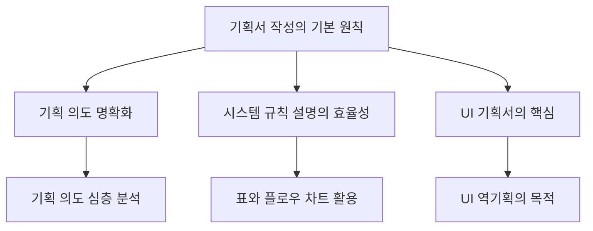

​

## 1. 개요

### 1.1 서론

- 게임 기획 지망생들이 제출한 기획서에 대한 전문가의 피드백을 통해, 실무에서 요구하는 기획서 작성 역량을 파악하고 개선 방향을 제시합니다.
- 본 보고서는 <mark>게임 기획서의 구조, 내용, 표현 방식</mark>에 대한 구체적인 조언을 담고 있습니다.
- 효과적인 기획서 작성법을 익히는 것은 취업 성공뿐만 아니라 실무 역량 강화에도 매우 중요합니다.

### 1.2 전체 구조

## 2. 기획서 작성의 기본 원칙

### 2.1 기획서의 전반적인 구성 및 가독성

- 기획서의 목차는 시스템, UI, 테이블 순서로 고정될 필요가 없으며, 오히려 불편할 수 있습니다. 
- 하나의 큰 시스템을 작은 단위로 나누고, 각 단위 안에서 시스템, UI, 테이블 순서로 전개하는 것이 효율적입니다. 
- 문서의 첫인상이 되는 페이지에서는 게임 고유 명사보다 시스템의 기능을 직관적으로 이해할 수 있는 이름을 사용하는 것이 좋습니다. 
  - 예를 들어, '세공'보다는 '랜덤 옵션 부여 시스템'이 더 이해하기 쉽습니다. 
- 독자가 원하는 내용을 쉽고 빠르게 찾을 수 있도록 가독성을 높이는 연구가 지속적으로 필요합니다. 
  - 이는 기획서를 많이 쓸수록 느는 부분이므로, 꾸준히 작성하는 훈련이 중요합니다. 
- 불필요하거나 내용이 중복되는 페이지는 최대한 줄여 콤팩트하게 만들어야 독자가 읽기 편하고 필요한 내용을 빨리 찾을 수 있습니다. 

### 2.2 기획 의도의 중요성

- 신입 기획 지망생 포트폴리오의 일반적인 단점은 기획 의도가 식상하고 단순하다는 점입니다. 
- 합격을 위해서는 평균 이상의 기획 의도를 보여주어야 하며, 이를 위해 기획 의도 파트에 집중하는 것이 가장 효과적입니다. 
- 기획 의도에는 다음과 같은 구체적인 내용이 포함되어야 합니다. 
  - 어떤 형상, 수준의 플레이어가 어떤 맥락과 목적으로 시스템을 이용할 것인가
  - 게임 내 다른 성장 요소 대비 세공 시스템의 비중, 위상, 차이점
  - 플레이어가 세공 시스템을 통해 얻게 되는 경험과 감정
  - 플레이어가 세공 시스템 사용 시 내리는 의사결정과 도전 과제
- 더 나아가 다음과 같은 내용도 추가할 수 있습니다. 
  - 랜덤 옵션 부여의 의미와 플레이어에게 불러일으키는 충동
  - 다른 유사 시스템과의 차이점 및 그로 인한 플레이어 감정
- 보스 콘텐츠 기획서의 경우, 플레이어가 겪게 될 경험뿐만 아니라 플레이어의 재미 포인트를 구체적으로 다루어야 합니다. 
  - 플레이어가 느꼈으면 하는 감정, 성취감을 느낄 부분 등을 명확히 해야 합니다. 
  - 기획자는 재미를 설계하는 직업이므로, 어떤 부분에서 어떤 재미를 의도했는지 설계하는 것을 빼먹지 않아야 합니다. 
- 보스 기획 의도에 플레이어의 재미와 감정 포인트를 반영하는 것이 중요합니다. 

### 2.3 실무 능력 어필

- 역기획서를 통해 본인의 역량을 어필하려면, 기획 의도 내용을 보강하여 분석력, 통찰력, 게임 이해도를 보여주거나, UI, 그림, 상세하고 가독성 좋은 규칙 설명을 통해 실무 능력을 어필해야 합니다. 
- UI 역기획서의 목적은 UI 사용법 설명이 아니라, 각 UI 항목에 담긴 기획자의 의도를 추측하고 답을 맞추는 것입니다. 
  - 인터페이스 제공 이유, 설계 형태, 편리성 등에 대한 기획 의도를 중심으로 재구성해야 합니다. 
  - 토글 버튼의 기본 값 설정 이유 등 UI 엘리먼트의 상세 규칙도 포함해야 합니다. 
- 인게임 사진 대신 UI 피그마 같은 툴을 활용해 그린 사진을 넣는 것이 실무에서도 UI 이해도를 어필하는 데 도움이 됩니다. 
- 보스 창작 기획서의 경우, 보스 제작에 필요한 실무 작업(맵 기획, 액션 기획, 테이블 기획 등)에 대한 이해도를 보여주는 것이 중요합니다. 

## 3. 시스템 규칙 설명의 효율성 높이기

### 3.1 표 활용의 중요성

- 시스템 규칙을 설명할 때 표를 활용하면 중복된 문장을 줄이고 필요한 내용을 빠르게 찾을 수 있어 가독성이 높아집니다. 
- 표를 활용하면 작업자가 구현에 필요한 내용을 체크리스트로 활용하고, 필요한 정보를 항목별로 빠르게 찾을 수 있습니다. 
- 테이블을 기획서에 넣을 때는 각 테이블을 만들어야 하는 이유와 해당 방식으로 만들어야 하는 이유를 함께 설명해야 합니다. 
- 예시 테이블을 넣을 때는 예시 데이터에 대한 해석도 함께 작성해야 이해하기 쉽습니다. 
  - 현재로서는 무엇을 위한 테이블인지, 게임에 어떻게 반영되는 것인지 이해하기 어려운 부분이 많습니다. 
- 테이블을 왜 설계해야 하는지, 게임에 어떻게 반영되어야 하는지, 시스템과 어떻게 연계되는지, 왜 해당 구조로 설계되어야 하는지에 대한 기획 의도가 데이터를 입력하는 것보다 더 중요합니다. 
- 테이블을 아주 잘 다루지 못한다면 오히려 역효과가 날 수 있으므로, 콘텐츠 기획서에서는 테이블 챕터를 빼는 것을 고려할 수 있습니다. 

### 3.2 플로우 차트의 적절한 활용

- 플로우 차트에서 '세공 옵션 시작'과 '세공 옵션 종류'와 같이 의미가 명확하지 않은 용어 사용은 지양해야 합니다. 
- 무엇을 설명하기 위한 플로우 차트인지 명확히 작성하고, '플로우 차트 시작'과 '플로우 차트 종료'와 같이 명확한 용어를 사용하는 것이 좋습니다. 
- 규칙 설명이 세공 옵션 테이블을 통해 정의되는 경우, 플로우 차트 대신 테이블 참조 방식을 설명하는 것이 더 적합합니다. 
- 플로우 차트가 한 페이지를 넘어간다면, 차트 범위가 너무 넓거나 불필요한 정보가 많거나, 테이블과 설명으로 해결 가능한 부분을 포함했을 가능성이 높으므로 재검토해야 합니다. 

### 3.3 데이터 관리의 효율성

- 세공 소모 골드량과 같이 특별한 규칙 없이 변하는 가격은 별도의 테이블보다는 '게임 컨피규레이션' 테이블에 포함하는 것이 맞습니다. 
- 스킬 지속 시간을 지정하기 위해 칼럼을 전부 따로 만드는 것은 비효율적입니다. 
  - 지속 시간 칼럼은 하나로 충분하며, 군중 제어 스킬 효과 칼럼에 지속 시간을 명시하는 방식으로 프로그래머와 협의할 수 있습니다. 
- 테이블 설계 시, 칼럼만 나열하기보다는 예시 데이터를 실제로 작성해보고 필요한 칼럼을 연구하는 순서가 맞습니다. 
  - 이렇게 작성된 예시 데이터를 기획서에 포함해야 합니다. 

## 4. UI 역기획서의 핵심

### 4.1 UI 역기획의 본질

- UI 역기획서의 목적은 단순히 UI 사용법을 설명하는 것이 아니라, 각 UI 항목에 담긴 기획자의 의도를 파악하고 추측하는 것입니다. 
- 왜 특정 UI를 제공하는지, 왜 그런 형태로 설계했는지에 대한 기획 의도를 중심으로 재구성해야 합니다. 
- 인터페이스 제공 이유, 설계 형태, 편리성 등에 대한 기획 의도를 포함해야 합니다. 
- 토글 버튼의 기본 값 설정 이유 등 UI 엘리먼트의 상세 규칙도 포함해야 합니다. 

### 4.2 UI 레이아웃 및 표현 방식

- UI 레이어 구조를 기획자가 기획서에 작성하는 경우는 드물며, 특별한 의도가 없다면 불필요한 페이지가 될 수 있습니다. 
- 인게임 사진보다는 UI 피그마 같은 툴을 활용해 그린 사진을 사용하는 것이 실무에서 UI 이해도를 어필하는 데 도움이 됩니다. 
- 전반적으로 UI 사용 설명서 느낌이 강한 것은 지양해야 합니다. 
- 예외 사항 알림 문구, 토스 스위치와 같이 게임의 공용 시스템을 문서에서 다루는 것은 페이지 낭비이므로 불필요합니다. 

## 5. 보스 창작 기획서의 심층 분석

### 5.1 문서 구성 및 내용 배치

- 보스 기획 의도, 외형, 맵, 플레이 시나리오 등을 한 챕터에 포함하면 내용을 찾기 어렵습니다. 
- 문서 앞부분에 보스 컨셉과 패턴을 요약하고 의도한 재미 요소를 설명하여 문서의 내용을 간략하게 파악할 수 있도록 해야 합니다. 
- 보스 공략법을 함께 설명하면 독자는 플레이어 입장에서 보스가 어떻게 보일지, 어떤 부분이 재미있을지 미리 상상할 수 있어 뒷내용 이해에 도움이 됩니다. 
- 보스 및 맵 아트 디자인을 한 챕터로 묶어 보스의 크기, 외형 설정, 던전 형태, 아트 콘셉트 등을 설명하는 것이 좋습니다. 
- 보스 스킬 목록을 요약한 뒤, 각 스킬의 역할과 기획 의도, 발동 조건(패턴)을 설명하는 챕터를 구성합니다. 
- 아티스트가 제작해야 할 액션과 이펙트, 기획자가 입력해야 할 보스 관련 스테이터스 및 계수 데이터를 마지막으로 정리합니다. 

### 5.2 기획 의도와 재미 요소 강화

- 보스 등장 배경 설정이 플레이어 입장에서 감정적으로 받아들여질지 고민하고, 필요하다면 전투 기믹 외에 인간적인 면모를 더 넣어 상황을 비극적으로 연출하는 것이 좋습니다. 
- 보스 클리어 방식을 '보스 사망'이 아닌 '해방'으로 바꾸어 플레이어가 공격하는 것이 보스에게도 좋은 일이라는 점을 납득시키는 설정을 추가하는 것을 고려할 수 있습니다. 
- 플레이어가 겪게 될 경험뿐만 아니라, 플레이어의 재미 포인트를 구체적으로 다루어야 합니다. 
  - 플레이어가 느꼈으면 하는 감정, 성취감을 느낄 부분 등을 명확히 해야 합니다. 
  - 기획자는 재미를 설계하는 직업이므로, 어떤 부분에서 어떤 재미를 의도했는지 설계하는 것을 빼먹지 않아야 합니다. 
- 두 개의 보스를 잡는 듯한 전투 경험이 왜 재미있는지, 패턴 파괴 성공 시 이득, 실패 시 손해 구조가 정말 재미있는지에 대한 고민과 설득이 필요합니다. 
- 즉사 패턴이 재미있는지, 즉사 패턴을 막는 방법이 하나뿐일 때 플레이어들이 재미있다고 여길 만한 즉사 패턴 극복을 위해 무엇이 더 추가되어야 하는지에 대한 심도 있는 고민과 설득이 필요합니다. 
- 즉사 패턴 성공 경험에 대한 레퍼런스를 다른 장르의 게임에서도 가져와 설득하면 효과적입니다. 

### 5.3 기믹 디자인 및 표현

- 보스 레이드 디자인 시 맵 형태뿐만 아니라 대략적인 아트 콘셉트에도 의도된 부분이 있어야 합니다. 
  - 기둥 디자인, 맵이 좁아지는 구조에 대한 납득 가능한 콘셉트 디자인 고민이 필요합니다. 
- 긴장감 끝에 성취감을 주는 기믹은 좋지만, 구조물에 부딪혀 기절시키는 패턴은 흔하고 무게감 있는 보스 패턴으로 넣기에는 컨셉이 약할 수 있습니다. 
  - 'Mothership(모스피스)' 같은 레퍼런스를 찾아보는 것을 추천합니다. 
- 즉사 패턴을 막는 과정이 단순히 모래시계 근처에 서 있는 것만으로는 밋밋할 수 있습니다. 
  - 타이밍 맞춰 파괴하거나 피하면 보호막이 등장하는 시계와 같은 기믹이 더 흥미로울 수 있습니다. 
  - 컨셉을 유지한다면, 모래시계 모양이 차오르는 것이 플레이어 피해 면역으로 이어지는 점을 개연성 있게 포장하는 연출이 필요합니다. 

### 5.4 스킬 및 데이터 표현

- 긴 문장을 쓸 때는 가운데 정렬보다 좌측 정렬이 가독성에 좋습니다. 
- 스킬들이 어떤 식으로, 어느 시점에, 어떤 조건으로 등장하는지에 대한 설명이 문서에 포함되어야 합니다. 
  - '비헤이비어 트리'와 같은 시스템 활용을 추천합니다. 
- 모션 제작 참고 시, 쿼터뷰 게임임을 고려하여 유저 입장에서 모션이 어떻게 보일지 연구하고, 쿼터뷰 시점의 모션 사진을 추가로 첨부하는 것이 좋습니다. 
- 모든 스킬의 그래프를 한 페이지에 모아 스킬별 특징을 비교하는 것이 페이지 낭비를 줄이고 효율적입니다. 
- 주요 아트를 나열하는 것은 지원자의 역량을 드러내는 데 큰 의미가 없으므로 공간 절약을 위해 빼는 것이 좋습니다. 
- 이펙트는 레퍼런스 사진만으로는 부족하며, 어떤 느낌을 주고 싶은지에 대한 텍스트 설명을 포함해야 합니다. 
- 보스가 추적 대상을 정하는 기준(범위 랜덤 등), 시스템적 결정 방식, 플레이어의 인지 또는 피해 감소 방법 등을 명확히 해야 합니다. 
- 스킬의 범위도 함께 작성하여, 설정상 플레이어가 맞지 않게 되는 상황을 방지해야 합니다. 

## 6. 총평 및 제언

### 6.1 역기획서 피드백 종합

- 제출된 기획서들은 신입 지망생들의 전형적인 작성 습관이 나타나는 경우가 많습니다. 
  - 목차 구성, 식상한 기획 의도, UI 레이어 구조 등이 대표적입니다. 
- 기획 의도에 대한 상세한 빌드업이 중요하며, 왜 이 시스템을 만들어야 하는가뿐만 아니라 왜 이런 방향으로 만들어야 하는가에 대한 설명이 전반에 잘 녹아 있어야 합니다. 
- UI 역기획서가 사용 설명서처럼 느껴지는 것은 지양해야 합니다. 
- 테이블 이해도는 신입 치고 나쁘지 않으나, 문서를 다루는 방식이 아쉽습니다. 
- 보스 제작에 필요한 실무 작업에 대한 이해도는 있으나, 너무 무난한 느낌이라 창의성을 발휘하여 두각을 드러낼 필요가 있습니다. 

### 6.2 합격 가능한 기획서 수준으로 나아가기

- 현재 문서 수준은 학원 출신 지망생 평균치에 가까우나, 합격 가능한 수준에는 아직 부족합니다. 
- 독학으로 이만큼 끌어올린 점을 볼 때, 앞으로 더 공부하고 노력하면 충분히 가능성이 있습니다. 
- 기획 의도 내용을 대폭 보강하여 분석력, 통찰력, 게임 이해도를 어필하거나, UI, 그림, 상세하고 가독성 좋은 규칙 설명을 통해 실무 능력을 어필해야 합니다. 
- 테이블을 다룰 줄 아는 점을 강조하는 것도 좋지만, 콘텐츠 기획서에서는 재미 측면에 더 힘을 쓰는 것이 취업 전략에 유리합니다. 
- 기본기는 갖추었으므로, 꾸준히 노력하면 원하는 팀에 합격하는 데 오래 걸리지 않을 것입니다. 
- 현업인 중에서도 기획서 작성에 어려움을 겪는 경력자들이 있을 정도로 잘 하셨지만, 원하는 팀 합격을 위해서는 더 준비가 필요합니다. 
