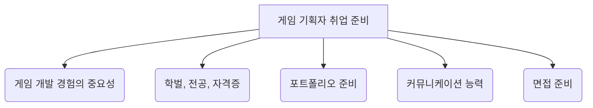

## 1. 개요

### 1.1. 서론
게임 기획자가 되기 위한 길은 생각보다 다양하며, 많은 지망생들이 '게임 개발 경험이 필수인지', '학벌이나 전공이 중요한지', '어떤 포트폴리오를 준비해야 하는지' 등 다양한 궁금증을 가지고 있습니다. 이 보고서는 게임 기획자 유리링의 경험과 조언을 바탕으로, 이러한 질문들에 대한 명확한 해답을 제시하고 게임 기획자로서 성공적인 커리어를 쌓기 위한 실질적인 가이드라인을 제공합니다. <mark>게임 기획자에게 필요한 핵심 역량과 준비 과정</mark>을 이해하는 것은 게임 업계 취업을 희망하는 모든 이들에게 매우 중요합니다.

### 1.2. 전체 구조

## 2. 게임 기획 지망생에게 게임 개발 경험은 필수일까?

### 2.1. 게임 개발 경험의 이점

- **관심과 열정의 증거**: 게임을 직접 만들어 본 경험은 게임 제작에 대한 높은 관심과 열정을 보여주는 확실한 증거가 됩니다. 
- 개발 프로세스** 이해**: 게임 개발 과정을 직접 겪으면서 개발 프로세스에 대한 기본적인 이해를 쌓을 수 있습니다. 
- **현실적인 **기획** 능력**: 개발 비용이나 환경을 고려하지 않는 비현실적인 아이디어만 제시하는 기획자보다 훨씬 나은 평가를 받을 수 있습니다. 
- **협업 경험**: 공모전이나 동아리 활동 등을 통해 협업하며 개발한 경험은 신입에게 흔치 않은 개발 관련 커뮤니케이션 경험으로 어필할 수 있습니다. 
- 취업** 경쟁력 강화**: 최근 신입 기획자 채용의 허들이 높아지면서 간단한 개발 경험은 기본적으로 갖춘 지원자들이 많습니다. 
- 프로토타입** 제작 및 게임성 검증**: 프로토타입을 직접 제작할 수 있는 수준이라면 본격적인 개발 이전에 게임성을 검증하여 더 높은 퀄리티의 기획을 할 수 있습니다. 
- 기획 의도** 세밀한 반영**: 언리얼 엔진의 블루프린트와 같은 시스템을 활용할 줄 안다면 기획 의도를 더욱 세밀하게 반영한 결과물을 만들 수 있습니다. 
- **장기적인 커리어 유리**: 취업뿐만 아니라 장기적인 커리어 발전에도 매우 유리하게 작용합니다. 

### 2.2. 개발 경험의 오해와 진실

- **개발 경험이 좋다는 것의 의미**: 단순히 프로그래밍 언어를 다룰 줄 아는 인재라서 좋다는 뜻이 아닙니다. 
- **기획 역량이 우선**: 기획 역량이 보통인데 프로그래밍 언어를 다룰 줄 아는 사람보다, 프로그래밍 언어를 전혀 모르지만 기획 역량이 뛰어난 사람을 우선적으로 채용합니다. 
- 코딩** 공부의 시간적 비효율성**: 게임 기획자가 되기 위해 지금 당장 코딩 공부를 시작하는 것은 시간 대비 효율이 낮습니다. 
  - 현업에서 커뮤니케이션에 직접적인 도움이 되는 수준의 프로그래밍 지식은 단순히 언어 학습을 넘어 유니티 엔진과 같은 다양한 컴퓨터 사이언스 지식이 뒷받침되어야 합니다. 
  - 이는 취업 준비 기간인 반년에서 1년 안에 달성하기 어려운 수준입니다. 
- 기획 역량** 부족을 코딩 실력으로 상쇄 불가**: 코딩 실력이 기획적 역량 부족을 상쇄해주지는 못하며, 코딩 실력 어필로 기획 업무를 해보겠다는 생각은 접는 것이 좋습니다. 
- **개발 경험의 본질**: 게임 기획 지망생에게 개발 경험이 있으면 좋다는 것은, 기획을 실체화하는 과정에서의 다양한 문제 해결 경험이 매우 의미 있기 때문입니다. 
  - 결과보다는 과정이 중요합니다. 

### 2.3. 개발 경험을 기획 역량으로 연결하기

- **포트폴리오의 중요성**: "간단한 미니 게임을 만들어 보았다"는 경험 자체만으로는 지원자의 기획적 역량을 보여주기 어렵습니다. 
  - 개발 과정을 세세하게 작성한 포트폴리오를 만드는 것이 중요합니다. 
- **포트폴리오에 담아야 할 내용**:
  - 게임 개발 과정에서의 다양한 기획적 고민 
  - 기획 의도를 게임에 녹여낸 방법 
  - 마주한 난관과 극복 경험 
  - 예시: "게임에서 이런 느낌을 주기 위해 여기를 이렇게 만들었다", "초기 기획 의도를 구현하는 것이 어려워 타협한 부분과 그 결과", "추후 개선 계획 및 추가 학습 분야" 등 의식의 흐름을 기록하고 정리해야 합니다. 
- **면접관이 궁금해하는 것**: 단순히 게임을 만들어 보았다는 사실 자체가 아니라, 그 과정에서의 기획적 고민과 디테일에 대한 소개입니다. 
- **빠른 취업을 위한 대안**:
  - 시언어, 파이썬 등 프로그래밍 언어에 매몰되지 마세요. 
  - 얼리 억세스나 유니티 에셋 스토어의 게임 제작 키트를 활용하여 기획 의도를 담아내는 연습을 합니다. 
  - 게임메이커 툴, 로블록스 등 코딩 없이 게임을 만들 수 있는 툴을 이용해 핵심 재미 요소를 담은 프로토타입을 만듭니다. 
  - 생성형 AI를 활용하여 게임 기획 단계부터 완성까지의 과정을 체감해 봅니다. 
- **결론**: 코딩 공부는 어디까지나 서브이며, 취업 후 장기적으로 컴퓨터 사이언스 지식을 공부하는 것이 자기 개발에 더 도움이 됩니다. 
  - 지금은 코딩 공부보다는 게임 디자인 공부에 집중해야 합니다. 
  - 게임 개발 역시 게임 디자인 공부의 일환으로, 프로그래밍 언어 공부보다는 다양한 게임 만들기 툴과 엔진을 활용해 기획 의도를 담아내는 과정을 포트폴리오화하는 것이 좋습니다. 

## 3. 게임 기획자는 학벌이 좋아야 할까요? 유리한 전공이나 자격증이 있을까요?

### 3.1. 학벌에 대한 현실적인 조언

- 학벌** 선호 경향**: 대체로 학벌이 좋은 사람을 선호하는 경향이 있습니다. 
  - 이는 학교생활을 착실하게 했다는 증거이며, 회사에서도 그럴 가능성이 높다고 보기 때문입니다. 
  - 높은 학업 성취도는 일을 효율적으로 하는 방법을 깨우쳤다는 뜻으로, 일머리가 좋을 가능성이 높습니다. 
  - 성실성과 일머리를 간접적으로 증명해주는 학벌을 선호하는 것이 사실입니다. 
- **학벌이 전부가 아님**: 학벌이 별로인 사람을 채용에서 배제하는 것은 절대 아니므로, 학벌을 바꾸기 위해 무리할 필요는 없습니다. 
  - 고등학생이라면 본인 성적으로 갈 수 있는 최대치의 학교를 가는 것이 좋습니다. 
  - 이미 대학을 다니거나 졸업한 경우, 학벌을 바꾸려는 노력은 가성비가 뛰어나지 않습니다. 
- **고졸에 대한 편견**: 최고의 기획자 중 고졸 출신도 많으며, 고졸에 대한 편견은 없습니다. 
  - 오히려 목표 없이 애매한 대학교 인문 계열을 간 사람보다, 어린 나이부터 확고한 목표를 위해 대학을 포기한 고졸을 선호하기도 합니다. 
- **업계 현실**:
  - 대기업이든 소기업이든 공채에서 학벌이 아주 뛰어난 사람을 많이 보지 못했습니다. 
  - 저자 본인도 학벌이 우수하지 않으며, 업계에서 학벌로 주눅 들어본 적이 없습니다. 
  - 비율상 지방대, 지방 분교, 전문대, 고졸, 비슷한 수준의 학교 출신이 많습니다. 
  - 학벌이 뛰어난 사람들은 게임 업계가 아닌 다른 대기업으로 가는 경우가 많습니다. 
- **실력으로 뒤집기 가능**: 학벌이 좋으면 돋보일 수 있지만, 학벌이 기획 역량과 직결되는 것은 아닙니다. 
  - 학벌이 좋은데 포트폴리오와 면접이 그저 그런 사람보다, 학벌이 나쁘거나 고졸인데 포트폴리오가 좋고 면접을 잘 본 사람이 압승합니다. 
  - 기획 분야만큼은 실력으로 뒤집는 것이 가능합니다. 

### 3.2. 전공 선택에 대한 조언

- 게임 기획** 학과의 필요성**: 게임 기획 학과가 있는 대학보다 더 높은 입결의 대학에 갈 수 있다면, 굳이 목표를 낮춰 게임 기획 학과에 갈 필요는 없습니다. 
  - 게임 기획 학과 출신이 많지만 절대적인 다수는 아니며, 그렇게까지 우대받는 느낌은 받지 못했습니다. 
  - 대기업에서는 게임 기획 학과 출신보다 공대, 상경계, 자연계, 어문계, 예술 계열 출신을 더 많이 봅니다. 
- **최고 대학 및 학과 선택**: 자신이 갈 수 있는 최고점의 대학교와 학과에서 공부하고, 게임 기획은 독학이나 학원 도움으로 충분히 준비할 수 있습니다. 
  - 면접 시 전공을 살리지 않고 게임 기획을 선택한 이유에 대해 솔직하고 차분하게 설명하고, 전공 경험을 게임 기획에 어떻게 녹여낼지 미리 생각해 두어야 합니다. 
  - 게임과 거리가 멀어 보이는 전공이라도, 그 본질을 들여다보면 게임 기획 과정과 닮은 부분이 분명히 있습니다. 
- **추천 전공**:
  - 개인적으로 컴퓨터 공학을 가장 추천합니다. 
  - 프로그래밍 언어 자체를 배우기보다는 논리력, 사고력, 문제 해결력을 기르기 좋은 학문이기 때문입니다. 
  - 기획자에게 필요한 역량(논리력, 사고력, 통찰력, 문제 해결력)을 기를 수 있는 학과라면 무엇이든 좋습니다. 
  - 수리통계학, 경제학, 건축, 토목학, 어문 계열, 디자인 계열도 도움이 될 수 있습니다. 
- **핵심은 학습 경험**: 중요한 것은 전공 자체보다는, 무엇인가를 노력해서 숙달시켜 나가는 학습 경험입니다. 

### 3.3. 자격증에 대한 현실적인 조언

- **자격증의 중요도**: 게임 기획자에게 자격증보다 더 중요한 것들이 많습니다. 
- **자격증에 대한 **평가:
  - 다방면에 관심이 많고 학습 능력이 뛰어나다는 긍정적인 인상을 줄 수 있습니다. 
  - 하지만 일반적으로 잡다한 자격증은 오히려 게임 기획에 대한 진정성이 부족하다는 증거로 보일 수 있습니다. 
- **경험적 사례**:
  - 저자는 토익, 일본어, 정보 처리 기사, 경제 금융 자격증 등을 보유하고 있지만, 이를 통해 빠르게 직무를 얻지 못했습니다. 
  - 한국사, 금융 자격증 등 게임 기획과 무관한 자격증은 오히려 게임 기획에 대한 뜻이 없다는 증거로 보일 수 있습니다. 
- **결론**: 자격증은 있으면 나쁠 건 없지만, 시간을 들여 딸 정도는 아닙니다. 
  - 기획 지망생에게는 기획의 기초를 다지고, 자신만의 게임 철학을 가지며, 재미를 설계하고 구체화하는 연습이 우선입니다. 
- **추천 자격증**: 해외 취업의 길을 열어둘 수 있도록 외국어 자격증 정도를 추천합니다. 

### 3.4. 외적 스펙보다 중요한 것

- 기획 역량** 강화**: 학벌, 전공, 자격증 같은 외적 스펙보다는 기획 역량을 키우는 데 집중해야 합니다. 
- **좋은 인성**: 좋은 인성을 갖춰 기존 기획자들이 함께 일하고 싶은 사람으로 느끼게 만드는 것이 가장 중요합니다. 

## 4. 게임 기획 신입 지망생을 위한 포트폴리오 가이드

### 4.1. 포트폴리오의 목적

- 기획 역량** 증명**: 자기소개서와는 별개로, 본인의 게임 디자인 역량을 보여주기 위해 작성하는 것이 기획 포트폴리오입니다. 
- **신입에게 요구되는 것**: 경력자와 달리, 신입은 자신의 잠재력과 성장 가능성을 보여주는 것이 중요합니다.

### 4.2. 포트폴리오 구성 요소

- **직접 만든 게임의 **기획 문서:
  - 팀으로 만든 게임이든, 직접 코딩하거나 게임 메이커 툴 등을 이용해 만든 게임이든 모두 가능합니다. 
  - "내가 이 게임을 만들어 봤다"에서 그치지 않고, 아이디어 발상부터 구체화, 실제 구현 과정까지 문서에 잘 정리해야 합니다. 
  - 이러한 과정이 의미 있는 포트폴리오가 됩니다. 
  - **담아야 할 내용**:
  - 기획 의도가 반영된 디테일한 부분 
  - 구현이 어려워 타협하거나 뭉갠 부분까지도 기획 의도가 될 수 있음을 인지 
  - 문제 발생 시 해결 방법 제시 및 기획 의도에 가까운 대안 모색 
  - **어필 가능한 역량**: 열정, 구현 능력, 행동력, 개발 경험, 문제 해결 능력 
- 신규 게임 개발 제안서:
  - 신입에게는 개발 알못이라는 약점을 드러낼 수 있고, 현업에서 신입이 제안하는 경우는 드물어 적절하지 않습니다. 
  - 만약 작성한다면, 핵심 게임성과 재미 포인트를 설득하는 방향으로 작성해야 합니다. 
  - 설정, 컨셉, 수익화 등 부수적인 요소보다는 핵심 게임 시스템에 집중해야 합니다. 
  - 하이퍼 캐주얼 게임의 시스템과 규칙 창작이 효과적입니다. 
  - MMORPG와 같이 스케일이 큰 장르 제안은 신입의 눈으로 보이는 부분만 담겨 역량을 어필하기 어렵습니다. 
  - 겉핥기식 내용만 담겨 있다면 폐기하는 것이 좋습니다. 
- 역기획서:
  - 호불호가 갈리지만, 잘 세워진 역기획서는 분석력과 실무적 게임 이해도를 어필할 수 있어 좋습니다. 
  - **주의점**: 유저 인터페이스 사용 설명서처럼 버튼 누르면 강화된다는 수준에서 끝나지 않아야 합니다. 
  - 강화란 무엇인지, 왜 좋은지, 왜 이런 방식으로 만들어야 하는지, 다른 방식은 안 되는지, 유저는 어떤 경험을 하게 되는지 등을 다루어야 합니다. 
  - 유저 시야를 넘어 개발자 시야로 내부 구조를 해체하고, 시스템을 만들기 위해 필요한 세부 기능, 기획 의도 등을 유추하는 것이 중요합니다. 
  - 잘 쓴 역기획서는 창작 기획서를 쓸 때도 도움이 됩니다. 
  - 역기획서만 보여줄 수 있는 영향의 한계가 있으므로, 하나 정도를 끼워 넣는 식으로 지원하는 것이 좋습니다. 
- **창작 **기획서:
  - 게임의 일부를 개선하거나 새로운 시스템/콘텐츠를 추가하는 기획서입니다. 
  - **주의점**:
  - 자기 머릿속에만 있는 가상의 게임 속에서 새로운 캐릭터, 던전 등을 창작하는 것은 피해야 합니다. 
  - 제약 조건 없이 자유롭게 만들면 어떤 역량도 어필하기 어렵습니다. 
  - 현업에서는 이미 존재하는 시스템과의 충돌, 캐릭터 간 겹침 등 수많은 제약 조건 속에서 통찰력과 문제 해결력을 발휘하는 것이 중요합니다. 
  - **이상적인 방향**: 기존 유명 게임의 신규 시스템이나 콘텐츠를 제안하고 상세 기획을 진행하는 것입니다. 
  - 억지로 끼워 맞춘 비약이 심하고 설득력 없는 기획서가 되지 않도록 주의해야 합니다. 
  - "왜 만들어야 하는가"에 무게를 두어야 합니다. 
  - 통찰력, 실무 문제 해결력, 논리력 등 다양한 역량을 어필하기 좋습니다. 
- 게임 분석서:
  - 단순한 게임 소개와 뻔한 장단점 나열은 피해야 합니다. 
  - 유저 시야로 보이지 않는 부분, 기획자의 시야로 보이는 부분을 면밀히 분석해야 합니다. 
  - **담아야 할 내용**:
  - 왜 그렇게 했는지, 앞으로 어떤 방향으로 나아갈 것 같은지, 그 방향이 좋은지 등 자신만의 결론 
  - 타 게임에서 벤치마킹할 포인트 
  - 어떤 게임이 성공/실패했는지 깊이 있게 분석 (예: 왜 그 게임을 제치고 이 게임으로 유저가 몰렸는지, 옛날 유저 감성을 어떻게 건드렸는지 등) 
  - 분석력, 통찰력, 게임 이해도를 보여주기 좋습니다. 

### 4.3. 포트폴리오 주제 선정

- **자신의 **강점** 파악**: 본인이 보여주고 싶은 역량이나 강점이 무엇인지부터 정하고, 그 강점을 어필할 수 있는 주제를 선정해야 합니다. 
- **합격 가능성을 높이는 주제**:
  - 취업에 특별히 유리한 '킬링 파트' 같은 주제는 존재하지 않습니다. 
  - 자신이 가장 잘 아는 것 또는 기획자가 되기로 결심한 계기를 담은 주제를 선택하는 것이 좋습니다. 
- **주제가 없다면**: 기획자라는 직업에 대해 다시 한번 진지하게 생각해 보는 것이 좋습니다. 
  - 쓰고 싶은 것이 있는데 실력이 부족하다면, 가장 쉬운 부분부터 접근해야 합니다. 
  - 유리한 주제를 찾기 위해 시간을 낭비하지 말고, 지금 당장 시작하는 것이 좋습니다. 

## 5. 게임 기획자에게 필요한 커뮤니케이션 능력

### 5.1. 커뮤니케이션 능력에 대한 오해

- **신입 **기획** 지망생의 오해**: 커뮤니케이션 능력을 단순히 말발이 좋아서 팀을 이끌어가는 능력 전부라고 오해하는 경우가 많습니다. 
  - 면접 시 "커뮤니케이션 능력"을 말 잘하고 팀 갈등을 잘 중재하는 것이라고 답변하는 경우가 많습니다. 
  - "설득을 하는 직업, 팀 내 다양한 의견을 조율하는 직업"이라고 답하는 사례도 많습니다. 
- **진정한 의미**: 게임 기획자에게 필요한 커뮤니케이션 능력은 말솜씨가 전부가 아니며, 중요도 역시 생각보다 높지 않습니다. 
  - 화려한 말솜씨로 청중을 휘어잡아야 하는 일은 PD에게 해당되는 일입니다. 
  - 말로 설득해야 하는 상황 자체가 내 기획이 설득력이 떨어진다는 반증이기도 합니다. 
  - 좋은 기획은 기획서 설명 단계에서 납득과 공감이 가야 합니다. 
  - 의견 조율은 팀장이나 파트장 등 관리자의 주요 업무입니다. 

### 5.2. 기획자에게 필요한 진정한 커뮤니케이션 능력

- **핵심**: 무엇을 왜 어떻게 하고 싶은가를 논리적인 근거를 가지고, 본인의 의도를 명확하고 이해하기 쉽게 전달하는 것입니다. 
  - 전달 방식은 말이나 글 모두 상관없지만, 기록이 남는 글이 일반적으로 더 선호됩니다. 
- **전달력이 좋은 문서의 특징**:
  - 필요한 내용을 쉽고 빠르게 찾을 수 있도록 잘 정돈된 체계적인 구성 
  - 군더더기 비문이 없는 명료하고 간결한 문장 
  - 텍스트만으로 이해하기 어려운 부분은 다이어그램, 이미지, 표 등을 활용 
  - 궁극적인 목표와 비전이 납득 가능한 논리적 근거와 함께 명시 
- 문제 해결 능력: 어떤 문제가 발생했을 때 효과적이고 효율적인 해결 방법을 주도적으로 찾아 제시하는 것입니다. 
  - 여기서 말하는 문제는 팀원 간의 인간적인 갈등이 아닙니다. 
  - 기획 단계에서 발견하지 못한 새로운 문제, 연계 시스템 간 충돌, 중요도 낮은 기능 구현에 큰 공수가 드는 경우, 예외 처리 필요성 등입니다. 
  - 혼자 끙끙대기보다 관련 실무자들이 함께 머리를 맞대고 최선의 답을 찾아내는 것이 효과적입니다. 
  - 이 과정을 주도할 줄 아는 사람이 커뮤니케이션 능력이 좋은 기획자입니다. 
- 문제 해결** 능력의 구체적인 내용**:
  - 문제의 근본 원인, 중요도, 영향력 파악 
  - 업무 관련자들에게 투명하게 공유 
  - 증상만 덮는 미봉책이 아닌, 다각도에서 해결책 모색 및 부작용 고려 
  - 해결책 목표 달성을 위한 구체적인 업무 순서 파악 및 신속한 실행 
- **말을 통해 의견을 표현하는 방법**:
  - 상대방의 의견에 근본 의도와 맥락을 잘 짚을 줄 알아야 합니다. 
  - 개발자의 반대 의견 이유(기술적 어려움, 일정 문제, 설득력 부족 등)를 파악해야 합니다. 
  - 개선 의견 제시 시, 상황과 맥락, 경험을 먼저 이해하고 기획 의도에 부합하면 재고, 아니면 근본적인 해결책을 고민하여 답변해야 합니다. 
  - 결정된 사항에 대해 "해야 합니다" 또는 "~으로 결정했습니다"와 같이 구체적이고 명확한 표현을 사용해야 합니다. 
  - 모르는 부분은 "잘 모르겠습니다", "자세히 설명해 주실 수 있을까요?", "확인 후 답변 드리겠습니다"라고 말하고 추가 조사를 통해 정확한 정보를 제공해야 신뢰를 높일 수 있습니다. 
  - 내 의견이 틀릴 수도 있음을 인정하고, 프로젝트 최종 목표와 더 나은 결과를 위해 타인의 의견을 유연하게 수용하며 자신의 생각을 바꿀 준비가 되어 있어야 합니다. 
  - "제 의견은 이렇지만, 더 좋은 아이디어가 있으면 고려해 보겠습니다."라는 태도를 갖는 것이 중요합니다. 

### 5.3. 말솜씨가 부족해도 괜찮다

- **핵심은 명확하고 솔직한 소통**: 커뮤니케이션 능력이란 화려한 말솜씨를 의미하는 것이 아니며, 말솜씨가 없더라도 명확하고 솔직하게 소통하는 것이 가장 중요합니다. 
- **글쓰기 능력 강화**: 말솜씨가 좋지 않다면 글쓰기 문제 해결력을 키우면 됩니다. 
- **용기를 주는 사례**: 저자 본인도 말솜씨가 일반인 수준 이하이지만 성공한 기획자가 될 수 있었던 것처럼, 말솜씨가 전부는 아니며 더 중요한 것이 있습니다. 

## 6. 게임 기획 신입 면접 준비

### 6.1. 필수 질문 및 답변 방향

- 1분 자기소개:
  - 핵심만 짧고 강하게 구성하며, 면접관이 호기심을 갖도록 여지를 남겨야 합니다. 
  - 기억에 남을 만한 독특한 경험이나 이야기를 하는 것이 좋습니다. 
  - **피해야 할 내용**: "어릴 적부터 게임을 좋아했고, 게임 기획자가 되는 것을 알게 되어 지원했다"와 같이 흔하고 뻔한 내용은 피해야 합니다. 
  - **예시**: 저자는 월드 오브 워크래프트의 스테이터스(힘, 민첩, 지력 등)에 빗대어 자신을 '하이브리드 기획자'로 어필했습니다. 
  - **주의점**: 알맹이 없는 뜬구름 잡는 답변은 피하고, 발전 가능성을 증명할 수 있는 부가적인 설명이나 근거를 함께 제시해야 합니다. 
  - 예시: 다양한 분야의 자격증 취득 경험을 통해 빠른 적응력과 학습 능력을 증명했습니다. 
- 기획자가 되고 싶은 이유:
  - **절대 금지 답변**: 게임을 만들고 싶은데 프로그래밍이나 그림 실력이 없어서 기획자를 선택했다는 답변, 게임이 좋아서라는 답변은 피해야 합니다. 
  - 게임이 좋으면 프로게이머, QA, GM 등 다른 직업도 많기 때문입니다. 
  - **답변 방향**: 게임 개발에 관련된 다른 직무들이 할 수 없는, 오직 기획자만이 할 수 있는 것에 대해 하고 싶은 이유와 그것을 잘 할 수 있다고 생각하는 이유를 이야기해야 합니다. 
  - 플레이어에게 전달하고 싶은 경험과 그것을 어떤 형태로 전달하고 싶은지에 초점을 맞춰야 합니다. 
- **기획자로서 본인의 **강점:
  - 꼼꼼함, 깊이 파고드는 성향 등 구체적으로 증명 가능한 역량 위주로 답변을 구성해야 합니다. 
  - 피해야 할 답변: 논리적이고 객관적이라는 추상적이고 흔한 답변은 피해야 합니다. 
  - 어떤 경험이든 기획자에게 필요한 역량으로 연결 지을 수 있습니다. 
  - 예시: 남들이 하지 않는 빌드를 타서 플레이 영상을 찍고 공유하는 취미를 창의성으로 연결했습니다. 
- **이 회사에 지원한 동기**:
  - **피해야 할 답변**: 연봉 등 외적인 장점, 이 회사 게임에 대한 좋은 추억, 업계에서 잘 나가는 회사라서 등 흔한 답변은 피해야 합니다. 
  - **답변 방향**: 이 회사가 갈망하는 인재 유형이 바로 본인임을 어필해야 합니다. 
  - 지원 팀의 게임을 플레이해보고 아쉬웠던 점을 파악하여, 그 아쉬움을 채울 수 있는 기획을 본인이 할 수 있음을 보여주어야 합니다. 
- **좋아하는 게임과 그 이유**:
  - 솔직하게 답변하는 것이 가장 좋습니다. 
  - 지원 팀의 게임과 동떨어진 장르라도 괜찮습니다. 
  - **답변 시 유의점**: 그래픽 등 기획 외적인 부분보다는, 기획 직무와 가까운 기획적인 강점을 들어 지원 직무 수행 인사이트를 보여주는 것이 유리합니다. 

### 6.2. 면접 준비의 핵심

- **함께 일하기 좋은 사람 어필**: 면접은 본인이 함께 일하기 좋은 사람임을 어필하는 중요한 기회입니다. 
- **답변 준비**: 질문에 대한 답변을 통으로 외우기보다는 핵심 위주로 정리하는 것이 좋습니다. 
