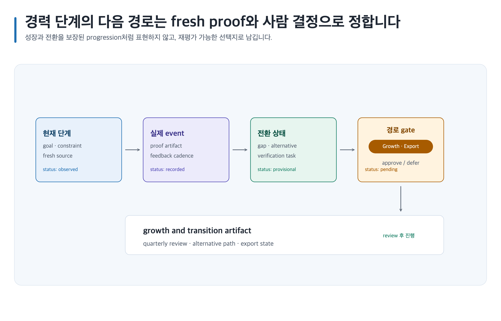

# Game Design Career 사용자 가이드

Game Design Career는 목표 역할과 경력 단계를 진단하고, 현재 채용 근거와 역량 격차를 학습·증거 프로젝트·포트폴리오·면접·성장 계획으로 연결합니다. 합격이나 한 가지 정답 진로를 약속하지 않고 사실, 추론, 공백과 다음 검증 작업을 분리합니다.

## 처음 시작하기

1. [설치](installation.md)에서 App 또는 CLI 중 한 환경의 절차만 따라 설치합니다.
2. [5분 빠른 시작](quick-start.md)의 요청문 하나를 복사합니다.
3. [전체 워크플로](workflow.md)에서 현재 경력 단계와 다음 증거 작업을 확인합니다.
4. 막히면 [문제 해결](troubleshooting.md)에서 보존된 결과로 재개합니다.

## 목적별 레시피

- [역할·학습 로드맵](recipes/role-learning-roadmap.md)
- [공고 조사·gap](recipes/job-research-gap.md)
- [관찰 기반 역기획](recipes/reverse-design.md)
- [portfolio 구축·검토](recipes/portfolio-build-review.md)
- [근거 연결 면접 연습](recipes/interview-preparation.md)
- [주니어 성장·전환](recipes/junior-growth-transition.md)

대표 도식:

- 
- 

## 가이드 목차

현재 사용할 수 있는 진입 문서:

- [설치](installation.md)
- [5분 빠른 시작](quick-start.md)
- [전체 워크플로](workflow.md)
- [문제 해결](troubleshooting.md)

전체 제품 레퍼런스:

- [스킬 레퍼런스](skills/README.md)
- [Canonical Artifact 템플릿](templates.md)
- [문서 품질 profile](document-quality.md)
- [이미지 자산](image-assets.md)
- [Career 시각화](visualization.md)
- [MD·PDF·DOCX·PPTX 내보내기](exports.md)

목적별 레시피의 안정 경로는 `recipes/`입니다. 각 레시피는 current evidence의 출처·검색일·지역·표본 경계·재검색 시점을 보존하며, 생성·렌더 결과와 사람 승인을 분리합니다.

각 스킬 ID는 [스킬 레퍼런스](skills/README.md)에서 해당 상세 가이드로 직접 연결됩니다. 각 템플릿의 용도와 복사 가능한 요청문은 [Canonical Artifact 템플릿](templates.md)에 있습니다.

## 작업 원칙

- 개인정보, 회사 비공개 자료와 제3자 저작물을 입력하기 전에 사용 권한과 공유 범위를 확인합니다.
- 현재 채용·회사·도구 사실은 날짜와 출처를 기록하고, 관찰과 추론을 구분합니다.
- 경험과 성과를 발명하지 않습니다. 없는 증거는 gap과 다음 프로젝트로 남깁니다.
- 생성 이미지와 렌더 결과는 자동 승인되지 않습니다. 권리와 품질을 확인한 이름 있는 사람의 결정이 필요합니다.
