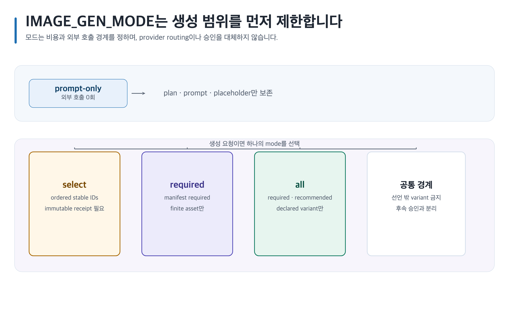
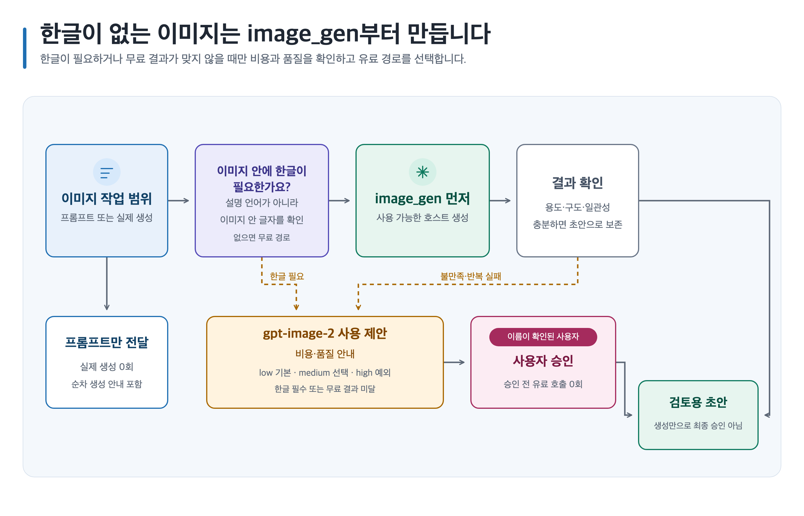
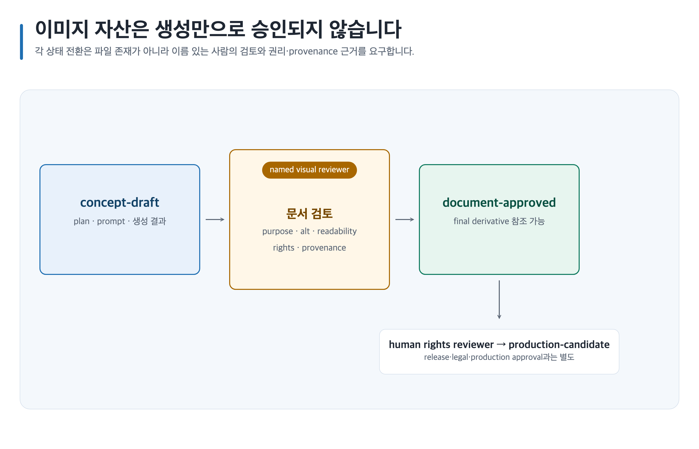

# Career 이미지 자산

Career image workflow는 planning, generation, review를 분리합니다. 모든 mode에서 `assets/image-assets.yml`, Markdown/JSON prompt, declared count와 placeholder를 보존하며 생성 asset은 `concept-draft`로 시작합니다.

## 안전한 기본 설정

```dotenv
IMAGE_GEN_MODE=prompt-only
IMAGE_PROVIDER=codex-first
IMAGE_EMBEDDED_TEXT_LOCALE=none
# 다음 값은 IMAGE_PROVIDER=openai를 명시적으로 선택했을 때만 사용합니다.
IMAGE_MODEL=gpt-image-2
IMAGE_QUALITY=low
```

기본 경로는 호스트 `image_gen`을 먼저 쓰는 `codex-first`입니다. `OPENAI_API_KEY`가 있어도 유료 사용 승인으로 보지 않습니다. key는 문서·prompt·tracked `.env`에 넣지 않습니다. 유료 model 기본값은 `gpt-image-2`, quality는 `low`입니다.

## 키와 설정 파일의 사용자 경계

- API key를 쓰는 경우 workspace root의 `.env`는 **regular file이고 symlink가 아니며 Git 비추적**이어야 합니다. 빈 API key 예시와 placeholder는 허용되지만 실제 값을 문서·명령·commit에 넣지 않습니다.
- `.env`를 만들거나 바꾼 뒤에는 Codex App에서는 **새 채팅**, Codex CLI에서는 **새 세션**을 열어 설정을 다시 읽습니다. 이미 열린 대화·세션에 값이 자동 주입되었다고 가정하지 않습니다.
- workflow 호출 때마다 workspace root의 `.env`를 읽습니다. 다만 현재 process environment가 .env보다 우선하므로, 이미 설정된 process 값은 `.env`의 같은 이름 값을 덮어씁니다. 새 채팅·새 세션 권고는 설치 또는 환경 변경을 안전하게 반영하기 위한 지침이지 유일한 로딩 조건은 아닙니다.
- host image capability는 API key 보유 여부와 관계없이 `codex-first`에서 우선합니다. host가 `available`을 보고한 경우에만 사용합니다.
- 설정 파일은 64 KiB를 넘기면 거부될 수 있습니다. parser 오류·권한 경고·symlink 경고가 나오면 값을 복사해 붙이지 말고, workspace root의 regular non-symlink 파일·소유자 읽기 권한·추적 제외 상태를 확인한 뒤 새 세션에서 재개합니다.

## IMAGE_GEN_MODE

| Mode | 생성 범위 | 사용자·비용 경계 |
| --- | --- | --- |
| `prompt-only` | 외부 호출 0회; plan, prompt, placeholder만 작성 | 안전한 기본값입니다. |
| `select` | 실제 사용자가 선택한 ordered stable asset IDs만 | immutable host-user receipt 전에는 호출하지 않습니다. |
| `required` | profile/manifest가 required로 선언한 finite assets만 | required count 밖 작업을 만들지 않습니다. |
| `all` | declared required, recommended, variant assets | 선언되지 않은 variant를 발명하지 않습니다. |

label, position, inferred intent, agent selection과 arbitrary JSON은 `select` 증거가 아닙니다.

[](../assets/shared/image-generation-mode-routing.svg)

## Provider routing과 비용 절약

- `IMAGE_PROVIDER=codex-first`는 API key가 있어도 available 호스트 `image_gen`을 우선합니다. host가 반환하지 않은 applied model/quality는 기록하지 않습니다.
- host가 없거나 반복 실패하거나 결과가 만족스럽지 않으면 기존 결과를 보존하고 유료 `gpt-image-2`의 비용·품질 선택을 제안합니다. 자동 전환하지 않습니다.
- `IMAGE_PROVIDER=openai`와 현재 사용자 승인이 함께 있을 때만 유료 API를 사용하며, 실패 뒤 자동 fallback을 쓰지 않습니다.
- 이미지 안에 한글 문자가 필요하면 `IMAGE_EMBEDDED_TEXT_LOCALE=ko-KR`, `IMAGE_PROVIDER=openai`, `IMAGE_MODEL=gpt-image-2`가 필수입니다.
- 유료 품질은 `low`가 기본입니다. `medium`은 선택된 마스터·키 이미지에만, `high`는 영상용 핵심 프레임이나 게임 원화처럼 예외적으로 필요한 경우에만 비용과 이유를 확인한 뒤 사용합니다.
- API key, authorization, base64, raw image bytes와 private config는 public 결과나 log에 노출하지 않습니다.

[](../assets/shared/image-provider-cost-routing.svg)

도식은 `prompt-only`, 무료 우선 생성, 유료 전환 제안과 승인 후 생성 경계를 함께 보여 줍니다.

## Career planning

portfolio proof, recruiter presentation, 역기획 evidence와 roadmap에 이미지를 쓸 때 target role/level과 source section을 연결합니다. current evidence를 이미지가 대신하지 못하며 실제 project·employer identity를 prompt에 유출하지 않습니다. 사실·추론·제안과 검색일·지역·표본 boundary는 canonical artifact가 authority입니다.

Skillstead는 source-backed role/competency/learning dependency의 editable SVG와 정확한 2× PNG를 위한 별도 slot입니다. portfolio illustration, screenshot, cover와 서로 다른 provenance·alt text·approval evidence를 유지합니다.

## 승인 경계

[](../assets/shared/image-asset-lifecycle.svg)

```text
concept-draft → document-approved → production-candidate
```

- `document-approved`: named visual reviewer가 purpose, placement, alt text, readability, rights/provenance와 artifact-local evidence를 승인합니다.
- `production-candidate`: named human rights/provenance reviewer가 technical fit, gameplay readability와 active rights를 추가 검토합니다.
- `production-candidate`는 release, legal, 채용 제출 또는 합격 승인이 아닙니다.

final MD/PDF/DOCX/PPTX는 `document-approved` 이상 asset만 참조합니다. restricted/revoked rights는 현재 eligibility를 차단합니다.

## 개인정보와 fairness

제3자·AI·performer·UGC 자료는 source, creator/contributor, attribution, use purpose, rights/consent, privacy, approver와 revocation을 기록합니다. 얼굴·이름·회사 비공개 UI 같은 개인정보나 confidential source를 portfolio 자산으로 자동 전환하지 않습니다.

## 복사 가능한 요청문

```text
@Game Design Career prompt-only로 portfolio case study의 required proof image와 Skillstead diagram을 계획해. stable ID, 수량, source section, alt text, rights/privacy owner와 placeholder를 만들고 생성·승인은 하지 마.
```
