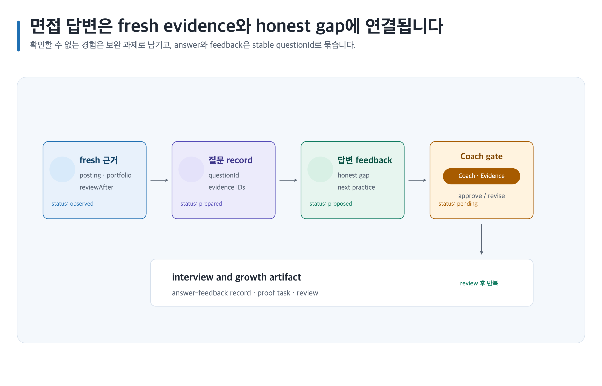

# 근거 연결형 면접 연습하기

> 본문에 쓰인 고정 한국 이름은 모두 **가상 예시 담당자**입니다. 실제 실행에서는 host user-decision receipt에 기록된 named human을 사용합니다.



## 완료 목표

공고와 portfolio evidence ID에 질문·답변을 연결하고, 확인하지 못한 내용은 honest gap으로 남긴 면접 연습 log를 만듭니다. 채용 결과를 보장하지 않습니다.

## 준비할 입력

- posting evidence IDs, portfolio evidence IDs, target role, 공개 가능한 경험 경계와 feedback goal
- Canonical Artifact family: `game-design-career/<career-id>/interview-question-answer-log/`
- 템플릿: `interview-question-answer-log`, `job-posting-evidence`, `five-axis-review`

## 복사 가능한 요청문

Codex App 자연어 요청:

```text
@Game Design Career 개인정보·실명·회사기밀 raw input은 입력하지 말고 익명화된 posting·portfolio evidence ID만 사용해 질문 연습을 만들어. 관찰 사실·추론·제안과 honest gap을 같은 questionId에 남겨.
```

Codex CLI 명시 호출:

```text
$game-design-career:practice-game-design-interview game-design-career/<career-id>/interview-question-answer-log/에서 $game-design-career:research-game-design-jobs, $game-design-career:review-game-design-portfolio evidence를 연결해.
```

## 단계별 진행

1. posting requirement와 portfolio record를 `관찰 사실`으로 두고 `sourceUrl`, `location`, `retrievalDate`, `region`, `sample boundary`, `reviewAfter`를 연결합니다.
2. 적합성 해석은 `추론`, 다음 답변 연습·proof task는 `제안`으로 기록하며 answer와 feedback은 같은 `questionId`를 재사용합니다.
3. stale evidence는 재검색 전에는 current claim에 사용하지 않습니다. 재검색 후 새 evidence IDs를 연결합니다.
4. 면접 연습은 이미지가 기본 산출물이 아니므로 `prompt-only`는 prompt와 placeholder만 만들고 생성하지 않습니다. `select`는 사람이 제출한 receipt의 stable ID만 생성하고, `required`는 finite required asset만 생성하며, `all`은 declared asset만 생성합니다. [이미지 자산 흐름](../image-assets.md)을 따릅니다.

## 사람이 결정할 지점

Interview Coach **최유진**이 honest answer boundary를, Evidence Reviewer **박도현**이 posting freshness와 portfolio claim 연결을 승인합니다.

## 예상 결과

모범 답안을 대량 생성하지 않고, 근거와 연결된 연습 기록만 남깁니다.

### 예상 파일 트리

```text
game-design-career/<career-id>/interview-question-answer-log/
├── content.md
├── evidence.yml
├── decisions/
└── export-manifest.yml
```

### 대표 내용 예시

`content.md`에 stable `question-id`, `posting-evidence-id`, `portfolio-evidence-id`, `answer-status`, `honest-answer`, `verification-task`를 한 record로 연결합니다.

### 완료 기준

각 답변이 같은 `question-id`의 evidence locator 또는 `honest-answer`와 연결되고, `answer-status`와 하나의 `verification-task`, 사람 검토자가 있으며, 경험·수치·팀 기여를 발명하지 않으면 완료입니다.

### 포트폴리오·면접 활용

portfolio의 claim ID를 면접 질문으로 다시 찾아볼 수 있게 하고, interview에서는 답변의 근거·한계·다음 확인 작업을 짧고 정직하게 말할 수 있습니다.

### 읽는 순서

`game-design-career/<career-id>/interview-question-answer-log/content.md → game-design-career/<career-id>/interview-question-answer-log/evidence.yml → game-design-career/<career-id>/interview-question-answer-log/decisions/ → game-design-career/<career-id>/interview-question-answer-log/export-manifest.yml` 순서로 `question-id`, `answer-status`, 근거와 검토 결정을 확인합니다.

## 실패와 재개

Chromium renderer 또는 필요한 capability가 unavailable이면 PNG unavailable 상태로 남기고 Canonical Artifact와 기존 output을 보존합니다. stale record 재검색과 questionId 보존을 먼저 수행해 재개합니다.

## 관련 기능

- [면접 연습](../skills/practice-game-design-interview.md), [공고 조사](../skills/research-game-design-jobs.md), [portfolio 검토](../skills/review-game-design-portfolio.md)
- [Career workflow](../workflow.md)
