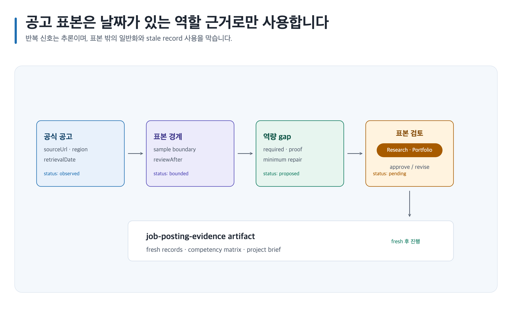

# 현재 공고 근거로 역할 gap 조사하기

> 본문에 쓰인 고정 한국 이름은 모두 **가상 예시 담당자**입니다. 실제 실행에서는 host user-decision receipt에 기록된 named human을 사용합니다.



## 완료 목표

공식 공고 표본의 required·preferred를 날짜와 범위가 있는 evidence record로 남기고, 일반화하지 않은 gap과 다음 증거 작업을 정리합니다. 채용 결과를 보장하지 않습니다.

## 준비할 입력

- 역할, seniority, 지역, 조사일, official HTTPS source 후보와 공개 가능한 portfolio evidence
- Canonical Artifact family: `game-design-career/<career-id>/job-posting-evidence/`, `game-design-career/<career-id>/competency-matrix/`, `game-design-career/<career-id>/portfolio-project-brief/`
- 템플릿: `job-posting-evidence`, `competency-matrix`, `portfolio-project-brief`

## 복사 가능한 요청문

Codex App 자연어 요청:

```text
@Game Design Career 개인정보·실명·회사기밀 raw input은 입력하지 말고 익명화된 공개 evidence ID와 한국의 공개 공식 공고만 사용해. 관찰 사실·추론·제안, 출처와 표본 한계를 분리해 역할 gap과 portfolio project brief를 만들어.
```

Codex CLI 명시 호출:

```text
$game-design-career:research-game-design-jobs game-design-career/<career-id>/job-posting-evidence/를 만들고 $game-design-career:map-game-design-career, $game-design-career:build-game-design-portfolio로 competency-matrix와 portfolio-project-brief를 연결해.
```

## 단계별 진행

1. 공고별 `관찰 사실`은 `sourceUrl`, `location`, `retrievalDate`, `region`, `sample boundary`, `reviewAfter`와 source ID를 가진 record로만 기록합니다.
2. 반복 신호는 제한된 표본의 `추론`으로 표시하고, 개인 evidence 부족은 `제안`인 portfolio-project-brief proof task로 전환합니다.
3. stale evidence는 재검색 전에는 current claim에 사용하지 않습니다. 같은 source location을 재검색해 새 ID로 연결합니다.
4. 공고 evidence는 원문·URL 중심이므로 `prompt-only`는 prompt와 placeholder만 만들고 생성하지 않습니다. `select`는 사람이 제출한 receipt의 stable ID만 생성하고, `required`는 finite required asset만 생성하며, `all`은 declared asset만 생성합니다. [이미지 자산 흐름](../image-assets.md)을 따릅니다.

## 사람이 결정할 지점

Research Owner **이민아**가 조사 지역·표본 경계를, Portfolio Reviewer **최유진**이 공개 가능한 evidence와 backlog 우선순위를 승인합니다.

## 예상 결과

완성된 지원용 프로젝트를 복제하지 않고, 공고 표본과 개인 evidence의 연결만 남깁니다.

### 예상 파일 트리

```text
game-design-career/<career-id>/
├── job-posting-evidence/
│   ├── content.md
│   ├── evidence.yml
│   ├── decisions/
│   │   └── README.md
│   ├── assets/
│   │   └── README.md
│   └── export-manifest.yml
├── competency-matrix/
│   ├── content.md
│   ├── evidence.yml
│   ├── decisions/
│   │   └── README.md
│   ├── assets/
│   │   └── README.md
│   └── export-manifest.yml
└── portfolio-project-brief/
    ├── content.md
    ├── evidence.yml
    ├── decisions/
    │   └── README.md
    ├── assets/
    │   └── README.md
    └── export-manifest.yml
```

### 대표 내용 예시

`job-posting-evidence/content.md`에는 `source-url`, `retrieval-date`, `sample-geography`와 반복 requirement를, `competency-matrix/content.md`에는 `gap`, `minimum-repair`, `re-evaluation-date`를, `portfolio-project-brief/content.md`에는 `target-competency`, `implementation-test`를 기록합니다.

### 완료 기준

각 반복 신호가 실제 표본 record로 되돌아가고 `sample-geography` 밖의 일반화가 없으며, `explicit gaps`마다 `minimum-repair`, `re-evaluation-date`, 다음 `proof artifact`와 `inspectabilityGate`가 있으면 완료입니다.

### 포트폴리오·면접 활용

portfolio에서는 공고 문구를 복제하지 않고 proof task와 근거 주소를 제시하며, interview에서는 표본의 지역·시점·한계와 다음 검증 계획을 설명합니다.

### 읽는 순서

`game-design-career/<career-id>/job-posting-evidence/content.md → game-design-career/<career-id>/job-posting-evidence/evidence.yml → game-design-career/<career-id>/job-posting-evidence/decisions/README.md → game-design-career/<career-id>/job-posting-evidence/assets/README.md → game-design-career/<career-id>/job-posting-evidence/export-manifest.yml`, `game-design-career/<career-id>/competency-matrix/content.md → game-design-career/<career-id>/competency-matrix/evidence.yml → game-design-career/<career-id>/competency-matrix/decisions/README.md → game-design-career/<career-id>/competency-matrix/assets/README.md → game-design-career/<career-id>/competency-matrix/export-manifest.yml`, `game-design-career/<career-id>/portfolio-project-brief/content.md → game-design-career/<career-id>/portfolio-project-brief/evidence.yml → game-design-career/<career-id>/portfolio-project-brief/decisions/README.md → game-design-career/<career-id>/portfolio-project-brief/assets/README.md → game-design-career/<career-id>/portfolio-project-brief/export-manifest.yml` 순서로 읽습니다.

## 실패와 재개

Chromium renderer 또는 필요한 capability가 unavailable이면 PNG unavailable 상태로 남기고 Canonical Artifact와 기존 output을 보존합니다. stale record는 재검색 후 새 source ID를 추가하고 삭제하지 않은 기존 기록에서 재개합니다.

## 관련 기능

- [공고 조사](../skills/research-game-design-jobs.md), [역할 매핑](../skills/map-game-design-career.md), [portfolio 구축](../skills/build-game-design-portfolio.md), [템플릿](../templates.md)
- [공통 Artifact 수명주기](../../assets/shared/canonical-artifact-lifecycle.png)

<!-- PROMPT-TEMPLATES:START game-design-career:recipe:job-research-gap -->
<!-- PROMPT-CARD: career:recipe:job-research-gap -->
#### career:recipe:job-research-gap

**job-research-gap recipe**

job-research-gap recipe의 ordered CLI calls와 artifact read order를 보존한다.

##### 사용하는 경우
canonical artifact의 안전한 다음 작업 순서가 필요할 때 사용한다.

##### 사용하지 않는 경우
evidence, rights, 또는 approval gate를 건너뛸 때는 사용하지 않는다.

##### 준비 입력
###### 필수 입력
- 공개 가능한 canonical artifact

###### 선택 입력
- named human decision receipt

##### 바꿀 자리표시자
- [경력 ID]

##### Codex App 완성 예시
```text
@Game Design Career 개인정보·실명·회사기밀 raw input은 입력하지 말고 익명화된 공개 evidence ID와 한국의 공개 공식 공고만 사용해. 관찰 사실·추론·제안, 출처와 표본 한계를 분리해 역할 gap과 portfolio project brief를 만들어.
```

##### Codex App 재사용 템플릿
```text
@Game Design Career 개인정보·실명·회사기밀 raw input은 입력하지 말고 익명화된 공개 evidence ID와 한국의 공개 공식 공고만 사용해. 관찰 사실·추론·제안, 출처와 표본 한계를 분리해 역할 gap과 portfolio project brief를 만들어. [경력 ID]의 fact, inference, recommendation과 미정 blocker를 보존해.
```

##### Codex CLI 완성 예시
```text
$game-design-career:research-game-design-jobs game-design-career/<career-id>/job-posting-evidence/를 만들고 $game-design-career:map-game-design-career, $game-design-career:build-game-design-portfolio로 competency-matrix와 portfolio-project-brief를 연결해.
```

##### Codex CLI 재사용 템플릿
```text
$game-design-career:research-game-design-jobs game-design-career/[경력 ID]/job-posting-evidence/를 만들고 $game-design-career:map-game-design-career, $game-design-career:build-game-design-portfolio로 competency-matrix와 portfolio-project-brief를 연결해. fact, inference, recommendation을 보존해.
```

##### 스킬·전문 역할 흐름
- 기본 스킬: research-game-design-jobs
- 스킬 흐름: research-game-design-jobs → map-game-design-career → build-game-design-portfolio
- 전문 역할: career-strategist

##### 중간 산출물
- job-posting-evidence
- competency-matrix
- portfolio-project-brief

##### 예상 결과물
###### 최소 결과물
- job-posting-evidence canonical artifact
- blocker와 resume receipt

###### 선택 결과물
- 공개 가능한 evidence summary

###### 확장 결과물
- downstream handoff

##### 파일 구조
- game-design-career/[경력 ID]/job-posting-evidence/content.md
- game-design-career/[경력 ID]/job-posting-evidence/evidence.yml
- game-design-career/[경력 ID]/job-posting-evidence/decisions/README.md
- game-design-career/[경력 ID]/job-posting-evidence/assets/README.md
- game-design-career/[경력 ID]/job-posting-evidence/export-manifest.yml
- game-design-career/[경력 ID]/competency-matrix/content.md
- game-design-career/[경력 ID]/competency-matrix/evidence.yml
- game-design-career/[경력 ID]/competency-matrix/decisions/README.md
- game-design-career/[경력 ID]/competency-matrix/assets/README.md
- game-design-career/[경력 ID]/competency-matrix/export-manifest.yml
- game-design-career/[경력 ID]/portfolio-project-brief/content.md
- game-design-career/[경력 ID]/portfolio-project-brief/evidence.yml
- game-design-career/[경력 ID]/portfolio-project-brief/decisions/README.md
- game-design-career/[경력 ID]/portfolio-project-brief/assets/README.md
- game-design-career/[경력 ID]/portfolio-project-brief/export-manifest.yml

##### 읽는 순서
- game-design-career/[경력 ID]/job-posting-evidence/content.md
- game-design-career/[경력 ID]/job-posting-evidence/evidence.yml
- game-design-career/[경력 ID]/job-posting-evidence/decisions/README.md
- game-design-career/[경력 ID]/job-posting-evidence/assets/README.md
- game-design-career/[경력 ID]/job-posting-evidence/export-manifest.yml
- game-design-career/[경력 ID]/competency-matrix/content.md
- game-design-career/[경력 ID]/competency-matrix/evidence.yml
- game-design-career/[경력 ID]/competency-matrix/decisions/README.md
- game-design-career/[경력 ID]/competency-matrix/assets/README.md
- game-design-career/[경력 ID]/competency-matrix/export-manifest.yml
- game-design-career/[경력 ID]/portfolio-project-brief/content.md
- game-design-career/[경력 ID]/portfolio-project-brief/evidence.yml
- game-design-career/[경력 ID]/portfolio-project-brief/decisions/README.md
- game-design-career/[경력 ID]/portfolio-project-brief/assets/README.md
- game-design-career/[경력 ID]/portfolio-project-brief/export-manifest.yml

##### 도식 바인딩
- ID: ca-s05
- SVG: guides/assets/game-design-career/skills/map-game-design-career.svg
- PNG: guides/assets/game-design-career/skills/map-game-design-career.png
- 대체 텍스트: Career recipe flow

##### 사람 검토
###### 승인 경계
named human decision owner가 job-research-gap의 approval 또는 보류를 결정한다.

###### 보류 조건
- canonical evidence, rights, 또는 owner receipt가 없으면 보류

###### 안전 경계
모르는 정보는 미정으로 남긴다. Do not request credentials, personal data, or private materials.

##### 실패와 재개
```text
job-research-gap의 보존 canonical artifact와 blocker를 읽고 공개 정보만으로 재개해.
```
<!-- PROMPT-TEMPLATES:END game-design-career:recipe:job-research-gap -->
