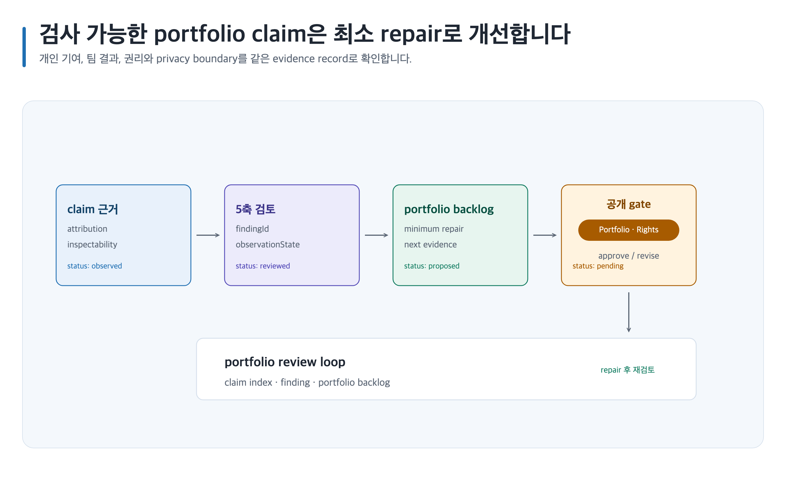

# portfolio를 만들고 5축으로 검토하기

> 본문에 쓰인 고정 한국 이름은 모두 **가상 예시 담당자**입니다. 실제 실행에서는 host user-decision receipt에 기록된 named human을 사용합니다.



## 완료 목표

개인 기여와 팀 결과를 분리한 case study를 만들고, 5축 finding을 최소 repair backlog로 연결합니다. 채용 결과를 보장하지 않습니다.

## 준비할 입력

- target competency, 공개 가능한 claim·evidence address, 개인/팀 attribution, rights·privacy 범위
- Canonical Artifact family: `game-design-career/<career-id>/creative-design-portfolio/`, `game-design-career/<career-id>/five-axis-review/`, `game-design-career/<career-id>/portfolio-backlog/`
- 템플릿: `creative-design-portfolio`, `five-axis-review`, `portfolio-backlog`

## 복사 가능한 요청문

Codex App 자연어 요청:

```text
@Game Design Career 개인정보·실명·회사기밀 raw input은 입력하지 말고 익명화된 공개 evidence ID만 사용해 portfolio case study와 5축 review를 만들어. 관찰 사실·추론·제안과 attribution을 분리해.
```

Codex CLI 명시 호출:

```text
$game-design-career:build-game-design-portfolio game-design-career/<career-id>/creative-design-portfolio/를 작성하고 $game-design-career:review-game-design-portfolio, $game-design-career:plan-image-assets로 five-axis-review, portfolio-backlog와 asset plan을 연결해.
```

## 단계별 진행

1. claim과 evidence address를 `관찰 사실`로 두고, 외부 current evidence는 `sourceUrl`, `location`, `retrievalDate`, `region`, `sample boundary`, `reviewAfter`를 기록합니다.
2. reviewer finding은 `추론`, 다음 repair는 `제안`으로 구분하고 `review-game-design-portfolio`의 minimum repair를 `portfolio-backlog/`에 기록합니다. inspectability가 없는 impact는 gap으로 남깁니다.
3. stale evidence는 재검색 전에는 current claim에 사용하지 않습니다. 새 locator를 추가하고 원래 claim과 review history는 보존합니다.
4. `prompt-only`는 prompt와 placeholder만 처리합니다. `select`는 사람이 제출한 receipt의 stable ID만 처리합니다. `required`는 finite required asset만 처리하고, `all`은 declared asset만 처리합니다.

## 사람이 결정할 지점

Portfolio Owner **정하늘**이 claim·attribution을, Rights Reviewer **윤태호**가 이미지 rights·privacy와 공개 상태를 승인합니다.

## 예상 결과

`creative-design-portfolio/content.md`, `five-axis-review/content.md`, `portfolio-backlog/content.md`에 evidence index와 minimum repair가 남습니다.

## 실패와 재개

Chromium renderer 또는 필요한 capability가 unavailable이면 PNG unavailable 상태로 남기고 Canonical Artifact와 기존 output을 보존합니다. unsupported claim은 삭제로 숨기지 않고 missing evidence와 owner action으로 재개합니다.

## 관련 기능

- [portfolio 구축](../skills/build-game-design-portfolio.md), [portfolio 검토](../skills/review-game-design-portfolio.md), [이미지 자산](../image-assets.md)
- [이미지 자산 수명주기](../../assets/shared/image-asset-lifecycle.png)
