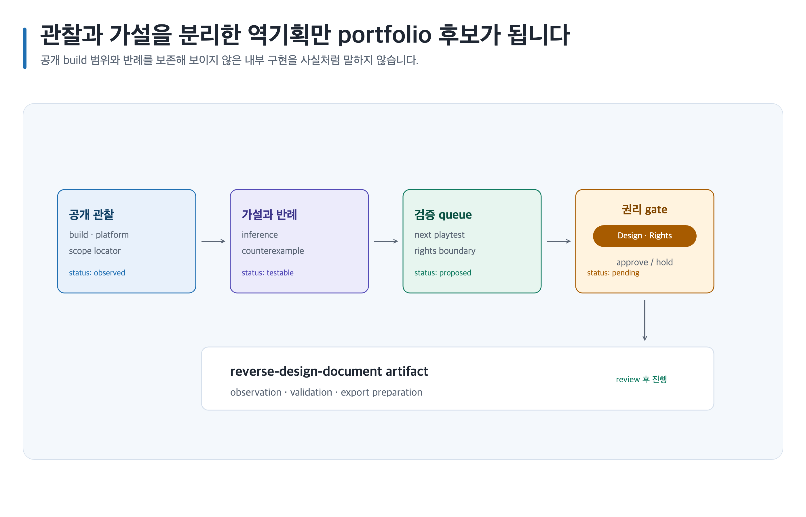

# 관찰 기반 역기획을 portfolio 증거로 만들기

> 본문에 쓰인 고정 한국 이름은 모두 **가상 예시 담당자**입니다. 실제 실행에서는 host user-decision receipt에 기록된 named human을 사용합니다.



## 완료 목표

플레이 가능한 공개 build의 관찰과 가설을 구분한 역기획서를 만들고, 검증 가능한 부분만 portfolio 후보로 연결합니다. 채용 결과를 보장하지 않습니다.

## 준비할 입력

- 공개 build, 플랫폼·버전·관찰 시점, 허용된 screenshot/source와 검증 질문
- Canonical Artifact family: `game-design-career/<career-id>/reverse-design-document/`
- 템플릿: `reverse-design-document`, `game-analysis-report`

## 복사 가능한 요청문

Codex App 자연어 요청:

```text
@Game Design Career 개인정보·실명·회사기밀 raw input은 입력하지 말고 익명화된 공개 evidence ID와 공개 build 관찰만 사용해 crafting system 역기획을 써 줘. 관찰 사실·추론·제안과 반례·검증 방법을 분리해.
```

Codex CLI 명시 호출:

```text
$game-design-career:reverse-engineer-game-design game-design-career/<career-id>/reverse-design-document/에서 관찰 record를 만들고 $game-design-career:visualize-career-roadmap, $game-design-career:export-career-documents로 검토용 SVG와 export manifest를 준비해.
```

## 단계별 진행

1. 직접 본 행동을 `관찰 사실`로 기록하고 `sourceUrl` 또는 build `location`, `retrievalDate`, `region`, `sample boundary`, `reviewAfter`를 명시합니다.
2. 의도·내부 구현은 확정하지 않고 `추론`과 confidence, counterexample을 붙이며, 다음 playtest는 `제안`으로 둡니다.
3. stale evidence는 재검색 전에는 current claim에 사용하지 않습니다. 재검색 또는 재관찰해 version·location을 갱신하고 이전 record는 보존합니다.
4. 관찰 screenshot의 `reverse-design-evidence-image` slot은 `prompt-only`에서 prompt와 placeholder만 만들고 생성하지 않습니다. `select`는 사람이 제출한 receipt의 stable ID만 생성하고, `required`는 finite required asset만 생성하며, `all`은 declared asset만 생성합니다. [이미지 자산 흐름](../image-assets.md)을 따릅니다.

## 사람이 결정할 지점

Design Reviewer **한지훈**이 inference 공개 범위를, Rights Reviewer **오지은**이 screenshot·source 사용 권한과 export 범위를 승인합니다.

## 예상 결과

완성된 게임 기획서를 흉내 내지 않고, 공개 관찰과 반증 가능한 해석만 남깁니다.

### 예상 파일 트리

```text
game-design-career/<career-id>/reverse-design-document/
├── content.md
├── evidence.yml
├── decisions/
│   └── README.md
├── assets/
│   └── README.md
└── export-manifest.yml
```

### 대표 내용 예시

`content.md`에 `observation`: 제작 재료가 부족할 때 craft 버튼이 비활성, `inference`: 재료 gate가 진행 속도를 조절할 수 있음, `counterexample`, `validation-method`를 별도 필드로 기록합니다.

### 완료 기준

모든 inference가 최소 하나의 `observation` locator와 counterexample 또는 unknown을 갖고 `falsifiable`하며, `validation-method`와 사람 검토자가 있고, 권리 결정을 확인하기 전에는 공개 대상으로 표시하지 않으면 완료입니다.

### 포트폴리오·면접 활용

portfolio에서는 관찰과 추론의 경계를 읽을 수 있게 하고, interview에서는 무엇을 직접 보았는지·무엇이 가설인지·어떤 반례가 남았는지 설명합니다.

### 읽는 순서

`game-design-career/<career-id>/reverse-design-document/content.md → game-design-career/<career-id>/reverse-design-document/evidence.yml → game-design-career/<career-id>/reverse-design-document/decisions/README.md → game-design-career/<career-id>/reverse-design-document/assets/README.md → game-design-career/<career-id>/reverse-design-document/export-manifest.yml` 순서로 읽습니다.

## 실패와 재개

Chromium renderer 또는 필요한 capability가 unavailable이면 PNG unavailable 상태로 남기고 Canonical Artifact와 기존 output을 보존합니다. missing observation은 만들지 말고 validation queue와 기존 record에서 재개합니다.

## 관련 기능

- [역기획](../skills/reverse-engineer-game-design.md), [Career 시각화](../skills/visualize-career-roadmap.md), [내보내기](../exports.md)
- [문서 내보내기 흐름](../../assets/shared/document-export-flow.png)

<!-- PROMPT-TEMPLATES:START game-design-career:recipe:reverse-design -->
<!-- PROMPT-CARD: career:recipe:reverse-design -->
#### career:recipe:reverse-design

**관찰에서 검증 가능한 역기획까지 (reverse-design)**

reverse-design recipe의 ordered CLI calls와 artifact read order를 보존한다.

##### 간단 요청 예시
```text
@Game Design Career 개인정보·실명·회사기밀 raw input은 입력하지 말고 익명화된 공개 evidence ID와 공개 build 관찰만 사용해 crafting system 역기획을 써 줘. 관찰 사실·추론·제안과 반례·검증 방법을 분리해.
```

##### 짧은 흐름
- 작업 순서: reverse-engineer-game-design → visualize-career-roadmap → export-career-documents
- 함께 검토하는 역할: career-strategist

##### 이 요청으로 받는 결과
플레이 장면을 기록하고 규칙 가설, 반례, 확인 방법 순서로 역기획 문서를 구성했습니다. 내부 의도처럼 보일 수 있는 문장은 추론으로 표시했으며 공개 범위는 권리 검토 뒤 정합니다. (ID: career:recipe:reverse-design; 파일: game-design-career/[경력 ID]/reverse-design-document/content.md)

<details>
<summary>고급 정보: 명령어·안전 경계·재개 기록</summary>

##### 사용하는 경우
canonical artifact의 안전한 다음 작업 순서가 필요할 때 사용한다.

##### 사용하지 않는 경우
evidence, rights, 또는 approval gate를 건너뛸 때는 사용하지 않는다.

##### 준비 입력
###### 필수 입력
- 공개 가능한 canonical artifact

###### 선택 입력
- named human decision receipt

##### 바꿀 자리표시자
- [경력 ID]

##### Codex App 완성 예시
위의 간단 요청 예시를 그대로 사용합니다.

##### Codex App 재사용 템플릿
```text
@Game Design Career 개인정보·실명·회사기밀 raw input은 입력하지 말고 익명화된 공개 evidence ID와 공개 build 관찰만 사용해 crafting system 역기획을 써 줘. 관찰 사실·추론·제안과 반례·검증 방법을 분리해. [경력 ID]의 fact, inference, recommendation과 미정 blocker를 보존해.
```

##### Codex CLI 완성 예시
```text
$game-design-career:reverse-engineer-game-design game-design-career/<career-id>/reverse-design-document/에서 관찰 record를 만들고 $game-design-career:visualize-career-roadmap, $game-design-career:export-career-documents로 검토용 SVG와 export manifest를 준비해.
```

##### Codex CLI 재사용 템플릿
```text
$game-design-career:reverse-engineer-game-design game-design-career/[경력 ID]/reverse-design-document/에서 관찰 record를 만들고 $game-design-career:visualize-career-roadmap, $game-design-career:export-career-documents로 검토용 SVG와 export manifest를 준비해. fact, inference, recommendation을 보존해.
```

##### 스킬·전문 역할 흐름
- 기본 스킬: reverse-engineer-game-design
- 스킬 흐름: reverse-engineer-game-design → visualize-career-roadmap → export-career-documents
- 전문 역할: career-strategist

##### 중간 산출물
- reverse-design-document

##### 예상 결과물
###### 최소 결과물
- reverse-design-document canonical artifact
- blocker와 resume receipt

###### 선택 결과물
- 공개 가능한 evidence summary

###### 확장 결과물
- downstream handoff

##### 파일 구조
- game-design-career/[경력 ID]/reverse-design-document/content.md
- game-design-career/[경력 ID]/reverse-design-document/evidence.yml
- game-design-career/[경력 ID]/reverse-design-document/decisions/README.md
- game-design-career/[경력 ID]/reverse-design-document/assets/README.md
- game-design-career/[경력 ID]/reverse-design-document/export-manifest.yml

##### 읽는 순서
- game-design-career/[경력 ID]/reverse-design-document/content.md
- game-design-career/[경력 ID]/reverse-design-document/evidence.yml
- game-design-career/[경력 ID]/reverse-design-document/decisions/README.md
- game-design-career/[경력 ID]/reverse-design-document/assets/README.md
- game-design-career/[경력 ID]/reverse-design-document/export-manifest.yml

##### 도식 바인딩
- ID: ca-s05
- SVG: guides/assets/game-design-career/skills/map-game-design-career.svg
- PNG: guides/assets/game-design-career/skills/map-game-design-career.png
- 대체 텍스트: Career recipe flow

##### 사람 검토
###### 승인 경계
named human decision owner가 reverse-design의 approval 또는 보류를 결정한다.

###### 보류 조건
- canonical evidence, rights, 또는 owner receipt가 없으면 보류

###### 안전 경계
모르는 정보는 미정으로 남긴다. Do not request credentials, personal data, or private materials.

##### 실패와 재개
```text
reverse-design의 보존 canonical artifact와 blocker를 읽고 공개 정보만으로 재개해.
```

</details>
<!-- PROMPT-TEMPLATES:END game-design-career:recipe:reverse-design -->
