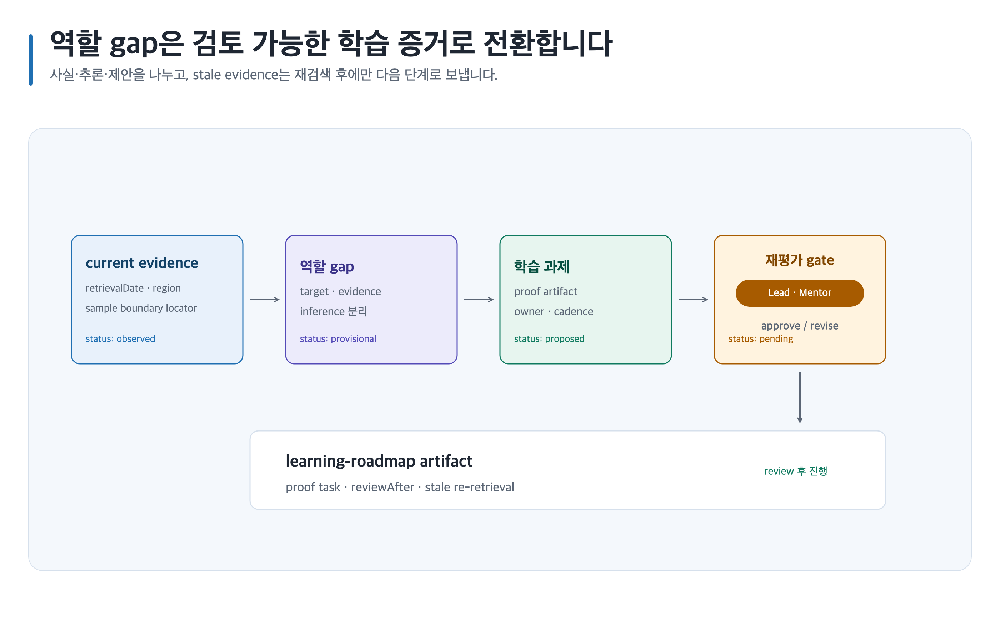

# 역할과 학습 로드맵을 증거 과제로 연결하기

> 본문에 쓰인 고정 한국 이름은 모두 **가상 예시 담당자**입니다. 실제 실행에서는 host user-decision receipt에 기록된 named human을 사용합니다.



## 완료 목표

목표 역할의 요구와 현재 증거를 분리해, 검토 가능한 학습 과제와 재평가 시점을 가진 로드맵을 만듭니다. 채용 결과를 보장하지 않습니다.

## 준비할 입력

- 목표 역할, 현재 단계, 공개 가능한 work sample, 시간·지역 제약
- Canonical Artifact family: `game-design-career/<career-id>/career-stage-goal/`, `game-design-career/<career-id>/learning-roadmap/`
- 템플릿: `career-stage-goal`, `game-design-role-map`, `learning-roadmap`

## 복사 가능한 요청문

Codex App 자연어 요청:

```text
@Game Design Career 개인정보·실명·회사기밀 raw input은 입력하지 말고 익명화된 공개 evidence ID만 사용해 시스템 기획 역할과 현재 증거의 gap을 로드맵으로 정리해. 관찰 사실, 추론, 제안을 분리하고 검토자를 지정해.
```

Codex CLI 명시 호출:

```text
$game-design-career:orchestrate-game-design-career game-design-career/<career-id>/career-stage-goal/를 기준으로 $game-design-career:map-game-design-career, $game-design-career:apply-document-quality-profile를 실행하고 game-design-career/<career-id>/learning-roadmap/에 저장해.
```

## 단계별 진행

1. 공개 가능한 evidence를 `관찰 사실`로 기록하고, 필요한 current evidence에는 `sourceUrl`, `location`, `retrievalDate`, `region`, `sample boundary`, `reviewAfter`를 함께 남깁니다.
2. `map-game-design-career`로 evidence가 지지하는 경로만 `추론`으로 표시하고, 빈 부분은 `제안`인 proof task로 둡니다.
3. `learning-roadmap`의 prerequisite, owner, proof artifact, cadence를 정합니다. stale evidence는 재검색 전에는 current claim에 사용하지 않습니다.
4. role/learning 관계는 Skillstead 도식이 우선이며 illustration slot은 `prompt-only`에서 prompt와 placeholder만 만들고 생성하지 않습니다. `select`는 사람이 제출한 receipt의 stable ID만 생성하고, `required`는 finite required asset만 생성하며, `all`은 declared asset만 생성합니다. 실제 career-work-context image가 필요할 때도 이 finite manifest 범위에서만 재개합니다. [이미지 자산 흐름](../image-assets.md)을 따릅니다.

## 사람이 결정할 지점

Career Lead **김서윤**이 목표 역할과 공개 범위를, Mentor **박도현**이 proof task·cadence와 재평가 기준을 승인하거나 보류합니다. 생성 결과는 이 결정을 대신하지 않습니다.

## 예상 결과

완성된 샘플 프로젝트를 복제하지 않고, 현재 Artifact에 다음의 검토 가능한 최소 기록만 남깁니다.

### 예상 파일 트리

```text
game-design-career/<career-id>/
├── career-stage-goal/
│   ├── content.md
│   ├── evidence.yml
│   ├── decisions/
│   │   └── README.md
│   ├── assets/
│   │   └── README.md
│   └── export-manifest.yml
└── learning-roadmap/
    ├── content.md
    ├── evidence.yml
    ├── decisions/
    │   └── README.md
    ├── assets/
    │   └── README.md
    └── export-manifest.yml
```

### 대표 내용 예시

`career-stage-goal/content.md`의 `target-role`, `success-evidence`와 `learning-roadmap/content.md`의 `proof-artifact`, `re-evaluation-date`를 함께 기록합니다. 역할은 가설이며 채용 결과를 뜻하지 않습니다.

### 완료 기준

각 gap과 `evidence gaps`에 하나의 `proof-artifact`(`proof artifact`), 공개 가능한 evidence locator, 담당 owner와 `re-evaluation-date`가 연결되고, current claim에는 source URL·retrieval date·region·sample boundary·review-after가 있으면 완료입니다.

### 포트폴리오·면접 활용

portfolio에서는 역할을 선언한 문구 대신 gap을 어떻게 작은 증거로 바꿨는지 보여 주고, interview에서는 해당 proof artifact의 선택 이유·한계·다음 검토를 정직하게 설명합니다.

### 읽는 순서

`game-design-career/<career-id>/career-stage-goal/content.md → game-design-career/<career-id>/career-stage-goal/evidence.yml → game-design-career/<career-id>/career-stage-goal/decisions/README.md → game-design-career/<career-id>/career-stage-goal/assets/README.md → game-design-career/<career-id>/career-stage-goal/export-manifest.yml`, 이어서 `game-design-career/<career-id>/learning-roadmap/content.md → game-design-career/<career-id>/learning-roadmap/evidence.yml → game-design-career/<career-id>/learning-roadmap/decisions/README.md → game-design-career/<career-id>/learning-roadmap/assets/README.md → game-design-career/<career-id>/learning-roadmap/export-manifest.yml` 순서로 읽습니다.

## 실패와 재개

Chromium renderer 또는 필요한 capability가 unavailable이면 PNG unavailable 상태로 남기고 Canonical Artifact와 기존 output을 보존합니다. stale current evidence는 재검색하며, 기존 evidence ID와 차단 이유를 유지한 채 `content.md`에서 재개합니다.

## 관련 기능

- [전체 워크플로](../workflow.md), [역할 매핑](../skills/map-game-design-career.md), [Career 시각화](../visualization.md)
- [학습 로드맵](../templates.md), [공통 이미지 모드](../../assets/shared/image-generation-mode-routing.png)
