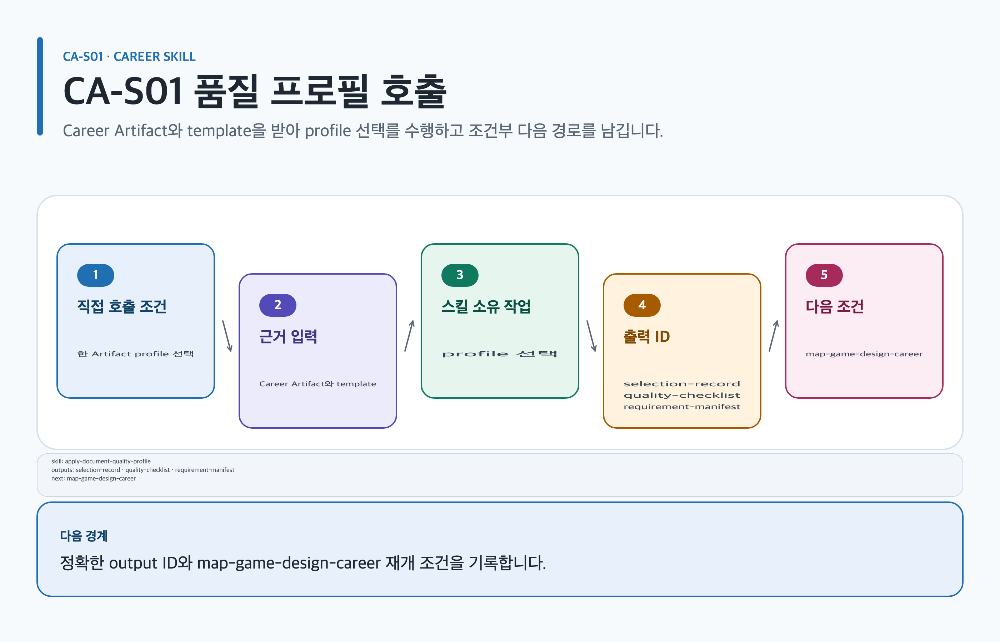

# apply-document-quality-profile

## 목적과 최종 산출물

Career canonical artifact마다 primary profile 하나를 결정하고 additive source를 검증해 selection record, stable checklist와 requirement manifest를 만듭니다.

## 사용할 때

- 역기획서, portfolio case study, 면접 report, 성장 review의 구조를 쓰기 전에 고정할 때
- 서로 다른 대상의 MD·PDF·DOCX·PPTX가 각각 어떤 profile을 써야 하는지 결정할 때

### Career 직접 호출 활용 — apply-document-quality-profile

[](../../assets/game-design-career/skills/apply-document-quality-profile.svg)

#### 직접 호출 조건

한 Career Artifact의 template·quality profile 선택만 확정할 때 직접 호출합니다. 여러 route가 함께 남았을 때만 `$game-design-career:orchestrate-game-design-career`로 범위를 나눕니다. 선택 기록은 승인 자체가 아닙니다.

#### 입문 App 요청문

```text
@Game Design Career 역할 map Artifact의 template과 quality profile, 누락 입력만 선택해.
```

#### 입문 CLI 요청문

```text
$game-design-career:apply-document-quality-profile artifact=artifacts/role-map template=game-design-role-map
```

#### 응용 App 요청문

```text
@Game Design Career 기존 selection record를 보존하고 portfolio brief의 checklist를 갱신해.
```

#### 응용 CLI 요청문

```text
$game-design-career:apply-document-quality-profile artifact=artifacts/portfolio template=portfolio-project-brief
```

#### 고급 App 요청문

```text
@Game Design Career conflict와 blocked requirement를 분리한 profile manifest를 만들어.
```

#### 고급 CLI 요청문

```text
$game-design-career:apply-document-quality-profile artifact=artifacts/career-review template=five-axis-review
```

#### 예상 파일과 읽는 순서

`content.md → evidence.yml → export-manifest.yml` 순서로 읽습니다. `selection-record`, `quality-checklist`, `requirement-manifest`은 논리 결과이며 임의 파일 생성을 가정하지 않습니다. 검토 owner: `document-quality-editor`.

#### 실패·재개와 다음 스킬 조건

unknown ID 또는 profile conflict면 기존 기록을 보존합니다. 재개: 설치된 template과 artifact ID를 확인해 같은 선택 기록에서 재개합니다. map·research·portfolio·reverse·interview·review·growth·visualization·export·image plan route일 때만 각각 `$game-design-career:map-game-design-career`, `$game-design-career:research-game-design-jobs`, `$game-design-career:build-game-design-portfolio`, `$game-design-career:reverse-engineer-game-design`, `$game-design-career:practice-game-design-interview`, `$game-design-career:review-game-design-portfolio`, `$game-design-career:plan-junior-growth`, `$game-design-career:visualize-career-roadmap`, `$game-design-career:export-career-documents`, `$game-design-career:plan-image-assets`로 넘깁니다.

## 사용하지 않을 때

- 본문, 이미지, SVG나 파생 문서를 직접 만들 때
- 비호환 deliverable 두 개에 primary profile 하나를 공유하려 할 때

## 필수 입력과 선택 입력

- 필수: artifact ID, goal, audience, artifact type, requested format, template ID
- 선택: 알려진 explicit profile override, `mobile`·`live-service`·`pc-console` overlay, neutral preset 하나
- 기존 artifact가 있으면 selection record, checklist와 digest-bound state를 제공합니다.

## Codex App 요청 예시

**복사 가능한 요청문**

```text
@Game Design Career reverse-design-document와 recruiter용 portfolio presentation을 서로 다른 artifact로 나눠 primary profile을 선택해. 각 selection 이유와 section/table/diagram/image/acceptance checklist를 먼저 보여 줘.
```

## Codex CLI 요청 예시

```text
$game-design-career:apply-document-quality-profile goal=시스템 역기획 case study, audience=portfolio-reviewer, artifactType=career-document, requestedFormat=md, templateId=reverse-design-document
```

## 내부 진행 흐름

packaged Career index와 template-profile map만 읽고 compatible template, artifact type, format, audience, goal 순으로 점수화합니다. primary 하나를 선택한 뒤 알려진 additive source만 합성하고 stable IDs와 digest를 묶습니다. unknown override는 nearest profile과 차이를 보고하고 explicit fallback 전에는 선택하지 않습니다. 완료 뒤에는 `routing.json.routes`, `scenarioChains`, `routeSkills`에서 caller/scenario가 고른 실제 skill로 돌아가며, 이 단계가 항상 role map으로 route를 바꾸지 않습니다.

각 selected route는 아래 같은 행의 CLI handoff 하나에만 결합됩니다.

| routing.json route 조건 | 다음 CLI handoff |
| --- | --- |
| `entry-role-map` 또는 `new-hire-role-map` | `$game-design-career:map-game-design-career` |
| `new-hire-job-research` 또는 `transition-job-research` | `$game-design-career:research-game-design-jobs` |
| `new-hire-portfolio-build` | `$game-design-career:build-game-design-portfolio` |
| `new-hire-reverse-design` | `$game-design-career:reverse-engineer-game-design` |
| `new-hire-interview-practice` 또는 `transition-interview-practice` | `$game-design-career:practice-game-design-interview` |
| `new-hire-portfolio-review` 또는 `transition-portfolio-review` | `$game-design-career:review-game-design-portfolio` |
| `junior-growth-plan` 또는 `transition-growth-plan` | `$game-design-career:plan-junior-growth` |
| `entry-competency-visualization` 또는 `junior-growth-visualization` 또는 `transition-readiness-visualization` | `$game-design-career:visualize-career-roadmap` |
| `entry-roadmap-export` 또는 `new-hire-reverse-design-export` 또는 `junior-growth-export` 또는 `transition-export` | `$game-design-career:export-career-documents` |

## 생성 파일과 결과 구조

selection record, composed requirements, checklist, requirement manifest와 immutable state envelope을 반환합니다. 내용·이미지·SVG·PNG·PDF·DOCX·PPTX는 만들지 않습니다. 예상 결과 요약: Career artifact가 충족해야 할 구조와 검증 항목이 결정됩니다.

## 관련 템플릿·품질 프로필·전문 역할

- Template ID: `caller-selected template` — [템플릿 카탈로그](../templates.md).
- Quality Profile ID: `caller-selected template의 template-profile-map 결과`.
- Reviewer/role ID: `document-quality-editor`.

이 조합은 [문서 품질 프로필](../document-quality.md)의 선택 기록과 함께 유지하며, profile을 새로 고르지 않는 경우는 위처럼 현재 artifact 상속 사유를 명시합니다.

## 이미지·도식화 조건

이미지·도식 슬롯은 caller-selected template의 requirement manifest가 정합니다. slot이 없으면 생성하지 않으며 Skillstead compatible slot만 구조 도식 후보입니다.

[이미지 자산 흐름](../image-assets.md)과 [도식화 안내](../visualization.md)의 승인·검증 경계를 따릅니다.

## 검토·승인 기준

상태는 `draft → structurally-complete → evidence-reviewed → visual-reviewed → document-approved` 순서입니다. external artifact inspection, evidence audit, renderer/rights evidence와 이름 있는 사람의 receipt가 같은 digest에 묶여야 합니다. 생성 이미지, 렌더 파일, self-attestation은 승인 증거가 아닙니다.

## 실패·fallback·재개 방법

unknown ID, raw object, schema 오류, scalar conflict, symlink·path escape는 fail-closed입니다. 기존 artifact와 기록을 보존하고 설치된 호환 profile로 다시 선택합니다.

```text
$game-design-career:apply-document-quality-profile 이전 selection record와 오류를 유지하고 unknown override만 제거해 같은 artifactId에서 재개해.
```

## 다음 작업 요청문

> `<artifact-path>`, `<export-manifest-path>`, `<selected-skill>`은 실제 경로·ID로 바꿔야 하는 자리표시자입니다. [공통 규칙](../../README.md#용어)을 따릅니다.

**복사 가능한 조건부 다음 handoff**

`<selected-skill>`은 caller/scenario가 `routing.json`에서 고른 실제 skill ID로 바꿉니다. 아래 role-map·job-research 예시는 전체 route를 대신하지 않으며 한 번에는 선택된 skill 하나만 호출합니다.

@Game Design Career role gap이면 map-game-design-career로, current posting 증거가 필요하면 research-game-design-jobs로 현재 Artifact를 이어 진행해.

```text
$game-design-career:map-game-design-career artifact=artifacts/entry-role-map role gap route일 때만 기존 evidence/decision을 보존하고 진행해.
```

```text
$game-design-career:research-game-design-jobs artifact=artifacts/job-evidence current posting route일 때만 fresh evidence를 이어 수집해.
```

```text
$game-design-career:<selected-skill> artifact=artifacts/<artifact-id> routing.json에서 선택한 skill ID로 바꿔 한 route만 실행해.
```

## 관련 문서

[템플릿 카탈로그](../templates.md), [스킬 선택표](README.md), [문서 placeholder 규칙](../../README.md#용어), [제품 workflow](../workflow.md)
