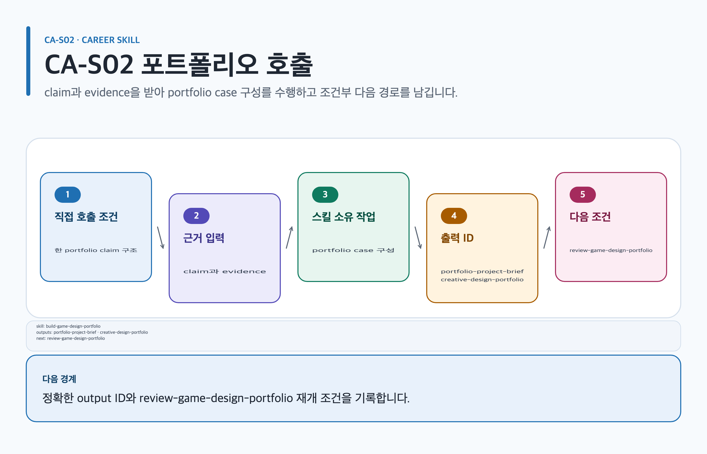

# build-game-design-portfolio

## 목적과 최종 산출물

프로젝트의 문제·판단·실험·협업·결과를 recruiter가 독립적으로 검사할 수 있는 portfolio case study와 claim-to-evidence index로 구성합니다.

## 사용할 때

- 흩어진 기획 문서와 피드백을 목표 역량 중심 case study로 묶을 때
- 팀 결과와 개인 기여, 검증된 결과와 회고를 분리해야 할 때

### 직접 호출 활용 — build-game-design-portfolio

[](../../assets/game-design-career/skills/build-game-design-portfolio.svg)

#### 직접 호출 조건

한 portfolio project의 claim·evidence 구조만 만들 때 직접 호출합니다. 여러 artifact의 우선순위가 섞였을 때만 `$game-design-career:orchestrate-game-design-career`로 범위를 나눕니다. 합격을 보장하지 않습니다.

#### 입문 App 요청문

```text
@Game Design Career 개인 기여와 공개 권리를 분리한 portfolio project brief를 작성해.
```

#### 입문 CLI 요청문

```text
$game-design-career:build-game-design-portfolio artifact=artifacts/portfolio claimId=C-01
```

#### 응용 App 요청문

```text
@Game Design Career evidence ID와 observation·inference·proposal을 case study에 연결해.
```

#### 응용 CLI 요청문

```text
$game-design-career:build-game-design-portfolio artifact=artifacts/portfolio evidenceIds=E-01,E-02
```

#### 고급 App 요청문

```text
@Game Design Career 공개 가능성, attribution, review gate를 유지한 portfolio를 갱신해.
```

#### 고급 CLI 요청문

```text
$game-design-career:build-game-design-portfolio artifact=artifacts/portfolio review=portfolio-reviewer
```

#### 예상 파일과 읽는 순서

`content.md → evidence.yml → decisions/ → export-manifest.yml` 순서로 읽습니다. `portfolio-project-brief`, `creative-design-portfolio`은 논리 결과입니다. 검토 owner: `portfolio-reviewer`.

#### 실패·재개와 다음 스킬 조건

claim 또는 evidence ID가 없으면 unknown과 gap을 보존합니다. 재개: 확인 가능한 개인 기여와 public rights를 추가한 뒤 같은 claimId에서 재개합니다. 검토·면접·export 조건일 때만 `$game-design-career:review-game-design-portfolio`, `$game-design-career:practice-game-design-interview`, `$game-design-career:export-career-documents`로 넘깁니다.

## 사용하지 않을 때

- 근거 없는 성과를 매끄러운 서사로 보충할 때
- 완성된 portfolio의 5축 finding만 필요하면 `review-game-design-portfolio`를 사용합니다.

## 필수 입력과 선택 입력

- 필수: target competency, intended reviewer, material claims, 개인·팀 attribution, evidence address, rights/privacy 범위
- 선택: prototype, playtest, implementation handoff, decision log, annotated image
- 각 claim에는 stable `claimId`, provenance, strength, status, recovery owner/action과 `inspectabilityGate`가 필요합니다.

## Codex App 요청 예시

**복사 가능한 요청문**

```text
@Game Design Career 이 제작 시스템 프로젝트를 recruiter용 case study로 구성해. 내 결정, 대안, 테스트와 협업 기여를 evidence ID로 연결하고 확인할 수 없는 결과는 gap으로 남겨 줘.
```

## Codex CLI 요청 예시

```text
$game-design-career:build-game-design-portfolio targetCompetency=system-design, reviewer=recruiter, source=artifacts/crafting-project
```

## 내부 진행 흐름

`target competency → problem/user → evidence → hypothesis/intent → rules·UI·data·content → constraints/alternatives → implementation/test → result/decision → retrospective` 순서를 지킵니다. 사실, 참여자 진술, 해석과 unsupported claim을 나누고 팀·개인 소유를 별도 표시합니다.

## 생성 파일과 결과 구조

`creative-design-portfolio` 또는 `portfolio-project-brief`의 `content.md`, claim-evidence index, attribution/rights notes, recovery queue와 reviewer checklist를 만듭니다. 예상 결과 요약: 설명 없이도 핵심 역량과 증거를 찾을 수 있는 case study가 생깁니다.

## 관련 템플릿·품질 프로필·전문 역할

- Template ID: `creative-design-portfolio` 또는 `portfolio-project-brief` — [creative-design-portfolio 템플릿](../templates.md#creative-design-portfolio), [portfolio-project-brief 템플릿](../templates.md#portfolio-project-brief).
- Quality Profile ID: `portfolio-case-study` 또는 `portfolio-project-brief`.
- Reviewer/role ID: `game-design-mentor · portfolio-reviewer · evidence-auditor`.

이 조합은 [문서 품질 프로필](../document-quality.md)의 선택 기록과 함께 유지하며, profile을 새로 고르지 않는 경우는 위처럼 현재 artifact 상속 사유를 명시합니다.

## 이미지·도식화 조건

`portfolio-direction-image`은 evidence와 rights가 있을 때만 illustration lifecycle로 계획합니다. decision chain은 `skillstead-portfolio-roadmap-dependency-diagram`이 검토를 돕는 경우에만 Skillstead로 도식화합니다.

[이미지 자산 흐름](../image-assets.md)과 [도식화 안내](../visualization.md)의 승인·검증 경계를 따릅니다.

## 검토·승인 기준

visual polish는 역량 증거가 아닙니다. source URL, section anchor, file/version, test record나 annotated image로 material claim을 찾을 수 있어야 하며 공개 전 권리·privacy owner가 결정합니다. portfolio가 합격을 보장하지 않습니다.

## 실패·fallback·재개 방법

essential claim이 `inspectabilityGate`를 통과하지 못하면 incomplete로 유지하고 `strength: none`, `status: missing`, recovery owner와 action을 같은 record에 남깁니다.

```text
$game-design-career:build-game-design-portfolio 기존 claimId를 유지하고 missing인 테스트 결과만 새 evidence address에 연결해 재개해.
```

## 다음 작업 요청문

> `<artifact-path>`, `<export-manifest-path>`, `<selected-skill>`은 실제 경로·ID로 바꿔야 하는 자리표시자입니다. [공통 규칙](../../README.md#용어)을 따릅니다.

**복사 가능한 다음 handoff**

@Game Design Career review-game-design-portfolio로 현재 Artifact의 검증된 기록을 이어 다음 작업을 진행해.

```text
$game-design-career:review-game-design-portfolio artifact=<artifact-path> 기존 evidence/decision을 보존하고 다음 handoff를 실행해.
```

## 관련 문서

[portfolio-project-brief 템플릿](../templates.md#portfolio-project-brief), [review-game-design-portfolio 스킬](./review-game-design-portfolio.md), [스킬 선택표](README.md), [제품 workflow](../workflow.md)

<!-- PROMPT-TEMPLATES:START game-design-career:build-game-design-portfolio -->
### 재사용 프롬프트 템플릿

- [beginner: 문제·판단·근거로 포트폴리오 사례 시작](../../prompt-templates/career/build-game-design-portfolio.md#careerbuild-game-design-portfoliobeginner)
- [standard: claim-evidence index로 사례 검증](../../prompt-templates/career/build-game-design-portfolio.md#careerbuild-game-design-portfoliostandard)
- [advanced: 사례 선택·기여·공개 gate](../../prompt-templates/career/build-game-design-portfolio.md#careerbuild-game-design-portfolioadvanced)
<!-- PROMPT-TEMPLATES:END game-design-career:build-game-design-portfolio -->
