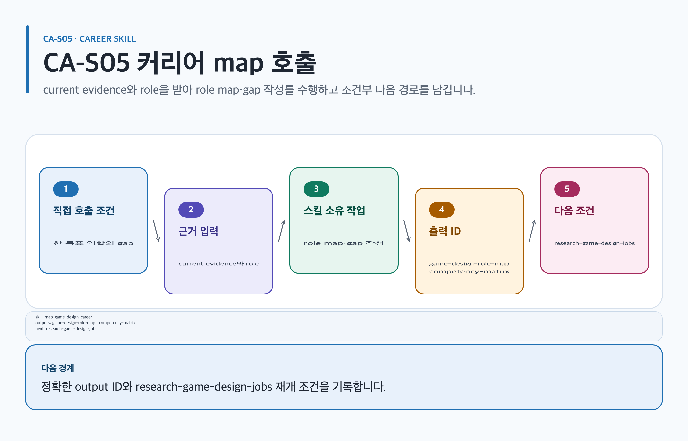

# map-game-design-career

## 목적과 최종 산출물

현재 증거와 제약을 여러 역할군·목표 수준에 비교해 provisional role paths, 역량 gap과 가장 작은 증거 과제를 만듭니다.

## 사용할 때

- 시스템·콘텐츠·경제·UX 등 목표 역할을 비교할 때
- 입문, new-hire, junior 또는 transition 단계의 `targetLevel`과 evidence gap을 정할 때

### 직접 호출 활용 — map-game-design-career

[](../../assets/game-design-career/skills/map-game-design-career.svg)

#### 직접 호출 조건

한 목표 역할의 current evidence와 competency gap만 정리할 때 직접 호출합니다. 여러 역할·단계의 우선순위가 섞였을 때만 `$game-design-career:orchestrate-game-design-career`로 범위를 나눕니다. 사실·추론·제안을 분리합니다.

#### 입문 App 요청문

```text
@Game Design Career 현재 경험을 사실·추론·제안으로 나누고 시스템 기획 role map을 만들어.
```

#### 입문 CLI 요청문

```text
$game-design-career:map-game-design-career role=systems targetLevel=foundation
```

#### 응용 App 요청문

```text
@Game Design Career current evidence ID와 gap을 competency matrix로 연결해.
```

#### 응용 CLI 요청문

```text
$game-design-career:map-game-design-career role=systems evidenceIds=E-01,E-02
```

#### 고급 App 요청문

```text
@Game Design Career stale source를 current claim과 분리하고 다음 research 조건을 기록해.
```

#### 고급 CLI 요청문

```text
$game-design-career:map-game-design-career role=systems targetLevel=junior
```

#### 예상 파일과 읽는 순서

`content.md → evidence.yml → decisions/ → export-manifest.yml` 순서로 읽습니다. `game-design-role-map`, `competency-matrix`를 반환합니다. 검토 owner: `career-strategist`.

#### 실패·재개와 다음 스킬 조건

current evidence가 stale이면 current claim을 멈추고 원래 source를 보존합니다. 재개: fresh evidence와 retrievalDate를 확인한 route에서 재개합니다. research·portfolio·visualization 조건일 때만 `$game-design-career:research-game-design-jobs`, `$game-design-career:build-game-design-portfolio`, `$game-design-career:visualize-career-roadmap`로 넘깁니다.

## 사용하지 않을 때

- 현재 공고 수요를 조사 없이 단정할 때
- 학력·나이·전공·고용 공백·prestige로 적합성을 순위화할 때

## 필수 입력과 선택 입력

- 필수: 관심 역할, 제약, 현재 artifact/evidence, 가능한 시간, uncertainty
- 선택: target role/level, current posting IDs, reviewer와 feedback source
- 현재 claim은 검색일, 지역, 표본과 source location을 기록하고 사실·추론·제안을 구분합니다.

## Codex App 요청 예시

**복사 가능한 요청문**

```text
@Game Design Career 시스템·콘텐츠 기획 경로를 비교해. 내 역기획서와 팀 프로젝트 기록만 현재 증거로 쓰고 target level, gap, 4주 증거 과제와 주별 feedback cadence를 제안해.
```

## Codex CLI 요청 예시

```text
$game-design-career:map-game-design-career roles=systems,content, targetLevel=entrant-portfolio, evidence=artifacts/current-work
```

## 내부 진행 흐름

목표가 고정되지 않았으면 최소 두 role family를 만듭니다. 각 path에 `roleFamily`, `currentEvidence`, `targetLevel`, `gaps`, `learningTasks`, `proofArtifacts`, tradeoffs와 uncertainties를 기록합니다. 현재 employer·posting·tool claim은 `research-game-design-jobs`로 보내고, 각 gap을 observable exercise와 task별 `feedbackCadence`로 전환합니다.

## 생성 파일과 결과 구조

`game-design-role-map` 또는 `competency-matrix`에 role paths, gap-to-evidence chain, verification tasks와 next smallest exercise를 남깁니다. 예상 결과 요약: 한 진로를 선언하는 대신 강화하거나 반증할 수 있는 역할 가설이 생깁니다.

## 관련 템플릿·품질 프로필·전문 역할

- Template ID: `game-design-role-map` — [game-design-role-map 템플릿](../templates.md#game-design-role-map).
- Quality Profile ID: `career-stage-role-map`.
- Reviewer/role ID: `career-strategist · game-design-mentor`.

이 조합은 [문서 품질 프로필](../document-quality.md)의 선택 기록과 함께 유지하며, profile을 새로 고르지 않는 경우는 위처럼 현재 artifact 상속 사유를 명시합니다.

## 이미지·도식화 조건

`career-work-context-image`은 실제 포트폴리오 맥락이 필요할 때만 illustration lifecycle로 계획합니다. role/gap/dependency는 `skillstead-career-role-roadmap-diagram`이 비교를 명확히 할 때만 Skillstead로 만듭니다.

[이미지 자산 흐름](../image-assets.md)과 [도식화 안내](../visualization.md)의 승인·검증 경계를 따릅니다.

## 검토·승인 기준

source의 검색일·지역·표본이 convenience sample이면 그 한계를 표시합니다. candidate statement는 사실과 다르며 agent의 추론과 학습 제안도 별도 label을 가집니다. 어떤 path도 합격을 보장하지 않습니다.

## 실패·fallback·재개 방법

target role이나 current evidence가 부족하면 `unclear`와 multiple provisional paths를 유지하고 owner·source/exercise·decision date가 있는 verification task를 남깁니다.

```text
$game-design-career:map-game-design-career 기존 두 role path를 유지하고 새 공고 evidence ID만 연결해 tradeoff 비교부터 재개해.
```

## 다음 작업 요청문

> `<artifact-path>`, `<export-manifest-path>`, `<selected-skill>`은 실제 경로·ID로 바꿔야 하는 자리표시자입니다. [공통 규칙](../../README.md#용어)을 따릅니다.

**복사 가능한 조건부 다음 handoff**

- 조건: `entry-12-week-roadmap` scenario에서 role map 뒤 관계를 공간적으로 확인해야 할 때.

```text
$game-design-career:visualize-career-roadmap artifact=<artifact-path> 기존 evidence/decision을 보존하고 entry-12-week-roadmap의 competency 관계만 도식화해.
```

- 조건: `new-graduate-system-design` scenario에서 target competency를 inspectable portfolio evidence로 전환할 때.

@Game Design Career `new-graduate-system-design`이면 build-game-design-portfolio로 현재 Artifact의 검증된 기록을 이어 다음 작업을 진행해.

```text
$game-design-career:build-game-design-portfolio artifact=<artifact-path> 기존 evidence/decision을 보존하고 new-graduate-system-design의 다음 handoff를 실행해.
```

## 관련 문서

[game-design-role-map 템플릿](../templates.md#game-design-role-map), [build-game-design-portfolio 스킬](./build-game-design-portfolio.md), [스킬 선택표](README.md), [제품 workflow](../workflow.md)
