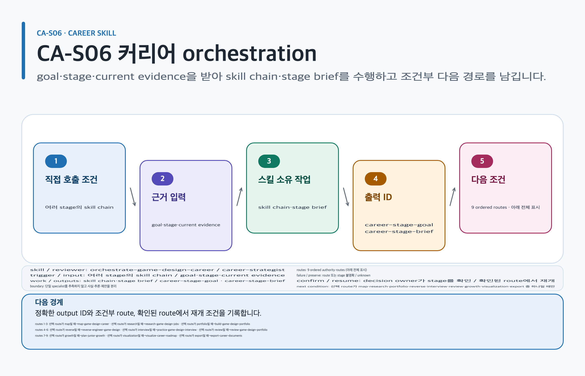

# orchestrate-game-design-career

## 목적과 최종 산출물

Career 요청을 `entry`, `new-hire`, `junior-growth`, `transition` 또는 `unclear`로 진단하고 필요한 최소 skill chain과 review gate를 정합니다.

## 사용할 때

- 시스템 기획 입문자의 역할 조사·학습·portfolio·면접 준비를 함께 연결할 때
- stage나 target role이 불명확해 여러 provisional path가 필요할 때

### 직접 호출 활용 — orchestrate-game-design-career

[](../../assets/game-design-career/skills/orchestrate-game-design-career.svg)

#### 직접 호출 조건

여러 Career 단계와 completion gate를 하나의 brief로 묶어야 할 때 직접 호출합니다. 한 output과 입력이 분명할 때는 해당 specialist를 직접 호출합니다. 사실·추론·제안을 분리합니다.

#### 입문 App 요청문

```text
@Game Design Career 목표 역할, 현재 증거, 제약을 받아 최소 skill chain과 stage brief를 정해.
```

#### 입문 CLI 요청문

```text
$game-design-career:orchestrate-game-design-career goal=systems-designer stage=foundation
```

#### 응용 App 요청문

```text
@Game Design Career research·portfolio·interview gate를 분리하고 선택 route만 정해.
```

#### 응용 CLI 요청문

```text
$game-design-career:orchestrate-game-design-career goal=transition evidenceIds=E-01
```

#### 고급 App 요청문

```text
@Game Design Career blocked gate만 재개하고 existing evidence와 decision을 보존해.
```

#### 고급 CLI 요청문

```text
$game-design-career:orchestrate-game-design-career artifact=artifacts/career-stage resume=blocked
```

#### 예상 파일과 읽는 순서

`content.md → evidence.yml → decisions/ → export-manifest.yml` 순서로 읽습니다. `career-stage-goal`, `career-stage-brief`을 반환합니다. 검토 owner: `career-strategist`.

#### 실패·재개와 다음 스킬 조건

route 또는 stage가 불명확하면 unknown을 보존하고 단일 specialist를 추측하지 않습니다. 재개: decision owner가 stage를 확인한 route에서 재개합니다. 선택 route일 때만 `$game-design-career:map-game-design-career`, `$game-design-career:research-game-design-jobs`, `$game-design-career:build-game-design-portfolio`, `$game-design-career:reverse-engineer-game-design`, `$game-design-career:practice-game-design-interview`, `$game-design-career:review-game-design-portfolio`, `$game-design-career:plan-junior-growth`, `$game-design-career:visualize-career-roadmap`, `$game-design-career:export-career-documents`로 넘깁니다.

## 사용하지 않을 때

- 단일 artifact나 검토 목표가 이미 분명하면 해당 specialist skill을 직접 사용합니다.
- 사람 대신 진로, 공개, 권리 또는 합격 결정을 내릴 때

## 필수 입력과 선택 입력

- 필수: 목표, 현재 단계, target role/level, 보유 evidence, 시간·지역·공개 제약, requested artifact
- 선택: current posting, portfolio, interview/growth goal, image·export 필요
- current claim에는 검색일, 지역, 표본, source location을 보존하고 사실·추론·제안을 분리합니다.

## Codex App 요청 예시

**복사 가능한 요청문**

```text
@Game Design Career 시스템 기획 입문자의 현재 단계를 진단하고 역할 근거 조사, 12주 증거 프로젝트, portfolio와 면접 준비까지 가장 작은 순서로 연결해.
```

## Codex CLI 요청 예시

```text
$game-design-career:orchestrate-game-design-career stage=entry, targetRole=systems-designer, output=12-week-evidence-roadmap
```

## 내부 진행 흐름

intake를 정규화하고 route를 바꾸는 질문만 하나 묻습니다. stage가 불명확하면 `unclear`와 multiple paths를 만듭니다. `scenarioChains`와 `routeSkills`에서 선택한 가장 작은 skill chain만 확장하며, 한 실행에서는 선택된 chain 밖 skill을 호출하지 않습니다. artifact별로 quality profile을 먼저 적용하고 current employer·project·posting·tool claim은 registry-bound `asOfDate`로 조사합니다. portfolio review는 `portfolio-reviewer`, `evidence-auditor`, `document-quality-editor` 세 역할을 같은 질문으로 실행하며 findings를 severity, evidence-gap ID, section ID, role priority 순으로 합칩니다.

선택 가능한 계열은 map, current job research, reverse design, interview, junior growth, visualization, export, portfolio build/review입니다. 각 selected route는 아래 같은 행의 CLI handoff 하나에만 결합됩니다.

| routing.json route 조건 | 다음 CLI handoff |
| --- | --- |
| `entry-role-map` 또는 `new-hire-role-map` | `$game-design-career:map-game-design-career` |
| `new-hire-job-research` 또는 `transition-job-research` | `$game-design-career:research-game-design-jobs` |
| `new-hire-portfolio-build` | `$game-design-career:build-game-design-portfolio` |
| `new-hire-reverse-design` | `$game-design-career:reverse-engineer-game-design` |
| `new-hire-interview-practice` 또는 `transition-interview-practice` | `$game-design-career:practice-game-design-interview` |
| `new-hire-portfolio-review` 또는 `transition-portfolio-review` | `$game-design-career:review-game-design-portfolio` |
| `junior-growth-plan` 또는 `transition-growth-plan` | `$game-design-career:plan-junior-growth` |
| `entry-competency-visualization` 또는 `junior-growth-visualization` 또는 `transition-readiness-visualization` | `$game-design-career:visualize-career-roadmap` |
| `entry-roadmap-export` 또는 `new-hire-reverse-design-export` 또는 `junior-growth-export` 또는 `transition-export` | `$game-design-career:export-career-documents` |

## 생성 파일과 결과 구조

normalized intake, stage rationale, assumptions, provisional paths, ordered skill chain, 최대 3 roles, review envelopes, evidence gaps, gates와 next action을 담은 Career Stage & Goal Brief를 반환합니다. 예상 결과 요약: 다음 workflow가 증거를 발명하지 않고 시작할 수 있습니다.

## 관련 템플릿·품질 프로필·전문 역할

- Template ID: `career-stage-goal` — [career-stage-goal 템플릿](../templates.md#career-stage-goal).
- Quality Profile ID: `career-stage-role-map`.
- Reviewer/role ID: `career-strategist`.

이 조합은 [문서 품질 프로필](../document-quality.md)의 선택 기록과 함께 유지하며, profile을 새로 고르지 않는 경우는 위처럼 현재 artifact 상속 사유를 명시합니다.

## 이미지·도식화 조건

초기 stage artifact의 `career-work-context-image` slot이 선언된 경우에만 image plan으로 넘깁니다. stage routing 관계는 `skillstead-career-role-roadmap-diagram`이 더 명확할 때만 Skillstead로 만듭니다.

[이미지 자산 흐름](../image-assets.md)과 [도식화 안내](../visualization.md)의 승인·검증 경계를 따릅니다.

## 검토·승인 기준

검색일·지역·표본 한계를 포함한 current source, candidate fact, agent 추론과 실행 제안을 분리합니다. missing evidence는 approval이 아니며 portfolio, hiring, promotion 또는 transition 성공을 보장하지 않습니다.

## 실패·fallback·재개 방법

optional review, visualization 또는 export가 unavailable이어도 canonical artifact를 보존하고 unavailable step과 resumable handoff를 기록합니다. stage나 role이 불명확하면 단일 답을 강제하지 않습니다.

```text
$game-design-career:orchestrate-game-design-career 기존 stage brief와 evidence IDs를 유지하고 blocked인 current posting refresh부터 재개해.
```

## 다음 작업 요청문

> `<artifact-path>`, `<export-manifest-path>`, `<selected-skill>`은 실제 경로·ID로 바꿔야 하는 자리표시자입니다. [공통 규칙](../../README.md#용어)을 따릅니다.

**복사 가능한 조건부 다음 handoff**

`<selected-skill>`은 선택된 scenario chain의 실제 skill ID로 바꿉니다. stage/증거 조건에 맞는 다음 skill 하나만 호출하며, role map은 여러 가능한 첫 route 중 하나입니다.

@Game Design Career entry role gap이면 map-game-design-career로, current job evidence면 research-game-design-jobs로, 이미 검증된 roadmap 관계면 visualize-career-roadmap로 이어 진행해.

```text
$game-design-career:map-game-design-career artifact=artifacts/entry-role-map entry role-gap route일 때만 진행해.
```

```text
$game-design-career:research-game-design-jobs artifact=artifacts/job-evidence current-job research route일 때만 진행해.
```

```text
$game-design-career:<selected-skill> artifact=artifacts/<artifact-id> scenario chain에서 선택한 skill ID로 바꿔 한 route만 실행해.
```

## 관련 문서

[career-stage-goal 템플릿](../templates.md#career-stage-goal), [스킬 선택표](README.md), [문서 placeholder 규칙](../../README.md#용어), [제품 workflow](../workflow.md)

<!-- PROMPT-TEMPLATES:START game-design-career:orchestrate-game-design-career -->
### 재사용 프롬프트 템플릿

- [beginner: 단계와 목표를 정하는 Career orchestration brief](../../prompt-templates/career/orchestrate-game-design-career.md#careerorchestrate-game-design-careerbeginner)
- [standard: research에서 portfolio로 잇는 Career orchestration](../../prompt-templates/career/orchestrate-game-design-career.md#careerorchestrate-game-design-careerstandard)
- [advanced: 역할 검토·handoff·재개를 관리하는 Career orchestration](../../prompt-templates/career/orchestrate-game-design-career.md#careerorchestrate-game-design-careeradvanced)
<!-- PROMPT-TEMPLATES:END game-design-career:orchestrate-game-design-career -->
