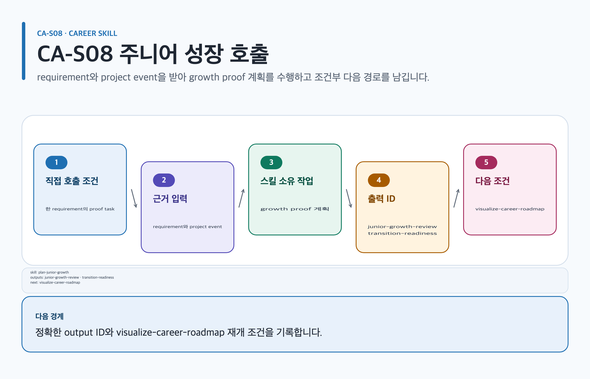

# plan-junior-growth

## 목적과 최종 산출물

target-role requirement와 실제 project event를 분기 목표, 증거 프로젝트, feedback cycle과 re-evaluation decision으로 연결합니다.

## 사용할 때

- new-hire·junior의 다음 분기 성장 목표를 만들 때
- transition 준비에서 현재 evidence와 target requirement의 차이를 검토할 때

### 직접 호출 활용 — plan-junior-growth

[](../../assets/game-design-career/skills/plan-junior-growth.svg)

#### 직접 호출 조건

한 target requirement의 gap과 proof task만 계획할 때 직접 호출합니다. 여러 단계·역할의 우선순위가 섞였을 때만 `$game-design-career:orchestrate-game-design-career`로 범위를 나눕니다. 사실·추론·제안을 분리합니다.

#### 입문 App 요청문

```text
@Game Design Career 확인 가능한 현재 경험과 한 분기 proof task를 분리해 성장 계획을 만들어.
```

#### 입문 CLI 요청문

```text
$game-design-career:plan-junior-growth requirementId=R-01 targetLevel=junior
```

#### 응용 App 요청문

```text
@Game Design Career fresh posting requirement와 eventId를 학습 증거 일정에 연결해.
```

#### 응용 CLI 요청문

```text
$game-design-career:plan-junior-growth requirementId=R-01 eventId=EV-01
```

#### 고급 App 요청문

```text
@Game Design Career stale evidence를 갱신하고 개인 기여·권리 gate를 유지한 transition readiness를 작성해.
```

#### 고급 CLI 요청문

```text
$game-design-career:plan-junior-growth requirementId=R-01 proofArtifact=portfolio-01
```

#### 예상 파일과 읽는 순서

`content.md → evidence.yml → decisions/ → export-manifest.yml` 순서로 읽습니다. `junior-growth-review`, `transition-readiness`를 반환합니다. 검토 owner: `game-design-mentor`.

#### 실패·재개와 다음 스킬 조건

stale evidence 또는 requirement가 있으면 current claim을 보류합니다. 재개: `research-game-design-jobs`의 fresh sourceId와 requirementId를 확인한 뒤 proof task에서 재개합니다. visualization·export 조건일 때만 `$game-design-career:visualize-career-roadmap`, `$game-design-career:export-career-documents`로 넘깁니다.

## 사용하지 않을 때

- 활동 수를 readiness나 승진 증거로 바꿀 때
- source 없는 desired skill을 current market requirement로 단정할 때

## 필수 입력과 선택 입력

- 필수: requirement IDs/status, posting evidence IDs, project-event evidence, owner, feedback source와 review date
- current 채용 근거 필수: stable `sourceId`, official HTTPS `sourceUrl`(source location), `postedDate`, `retrievalDate`, `reviewAfter`와 trusted 기준일
- 선택: target depth/breadth, proof artifact, past feedback와 transition target
- current requirement에는 검색일, 지역, 표본을 기록하고 사실·추론·제안을 분리합니다.

## Codex App 요청 예시

**복사 가능한 요청문**

```text
@Game Design Career 주니어 시스템 기획자의 다음 분기 목표를 만들어. fresh posting requirement와 실제 project event만 연결하고 각 목표에 observable project, owner, 격주 feedback, proof artifact와 재평가 결정을 넣어.
```

## Codex CLI 요청 예시

```text
$game-design-career:plan-junior-growth targetRole=systems-designer, period=quarter, evidence=artifacts/project-events
```

## 내부 진행 흐름

현재 primary posting source가 있는 `requirementId`는 `approved`, 없으면 `provisional`로 둡니다. trusted 기준일이 `reviewAfter`를 넘으면 stale evidence는 current claim에 사용하지 않습니다. 이 경우 `research-game-design-jobs`로 공고를 재수집하고 validator 재검증을 통과한 새 evidence IDs를 해당 `requirementId`에 다시 결합합니다. project event마다 stable `eventId`, attribution, source와 verification status를 기록합니다. goal은 `requirementId`에 연결하고 observable project, owner, cadence, `proofArtifact`와 `continue|revise|replace|approve-ready|retire` 결정을 포함합니다.

## 생성 파일과 결과 구조

target requirement register, project-event evidence ledger, quarterly goal records, feedback calendar, proof-artifact index와 verification tasks를 `junior-growth-review`에 남깁니다. 예상 결과 요약: 다음 분기에 관찰·검토할 수 있는 성장 evidence loop가 생깁니다.

## 관련 템플릿·품질 프로필·전문 역할

- Template ID: `junior-growth-review` 또는 `transition-readiness` — [junior-growth-review 템플릿](../templates.md#junior-growth-review), [transition-readiness 템플릿](../templates.md#transition-readiness).
- Quality Profile ID: `junior-growth-review` 또는 `transition-readiness`.
- Reviewer/role ID: `game-design-mentor · career-strategist`.

이 조합은 [문서 품질 프로필](../document-quality.md)의 선택 기록과 함께 유지하며, profile을 새로 고르지 않는 경우는 위처럼 현재 artifact 상속 사유를 명시합니다.

## 이미지·도식화 조건

`growth-work-sample-image`은 권리·공개 범위가 확인된 경우에만 illustration lifecycle로 계획합니다. goal/evidence cadence는 `skillstead-growth-roadmap-diagram`이 순서를 명확히 할 때만 Skillstead로 도식화합니다.

[이미지 자산 흐름](../image-assets.md)과 [도식화 안내](../visualization.md)의 승인·검증 경계를 따릅니다.

## 검토·승인 기준

검색일·지역·표본의 freshness와 blind spot을 보여 줍니다. project fact, candidate interpretation, 성장 추론과 다음 행동 제안을 구분합니다. unverified plan은 승진·합격·전환 readiness를 보장하지 않습니다.

## 실패·fallback·재개 방법

requirement source 또는 proof가 없으면 provisional ID와 verification task를 유지합니다. stale evidence의 기존 기록, stale 상태와 한계를 삭제하지 않고 보존합니다. `research-game-design-jobs`의 재수집·validator 재검증 뒤 새 evidence IDs가 downstream growth `requirementId`와 goal에 다시 결합된 후에만 재개합니다. contradictory feedback과 missing proof도 삭제하지 않습니다.

```text
$game-design-career:plan-junior-growth 기존 goalId와 eventId를 유지하고 새 mentor feedback만 연결해 re-evaluation부터 재개해.
```

## 다음 작업 요청문

> `<artifact-path>`, `<export-manifest-path>`, `<selected-skill>`은 실제 경로·ID로 바꿔야 하는 자리표시자입니다. [공통 규칙](../../README.md#용어)을 따릅니다.

**복사 가능한 다음 handoff**

@Game Design Career visualize-career-roadmap로 현재 Artifact의 검증된 기록을 이어 다음 작업을 진행해.

```text
$game-design-career:visualize-career-roadmap artifact=<artifact-path> 기존 evidence/decision을 보존하고 다음 handoff를 실행해.
```

## 관련 문서

[junior-growth-review 템플릿](../templates.md#junior-growth-review), [visualize-career-roadmap 스킬](./visualize-career-roadmap.md), [스킬 선택표](README.md), [제품 workflow](../workflow.md)
