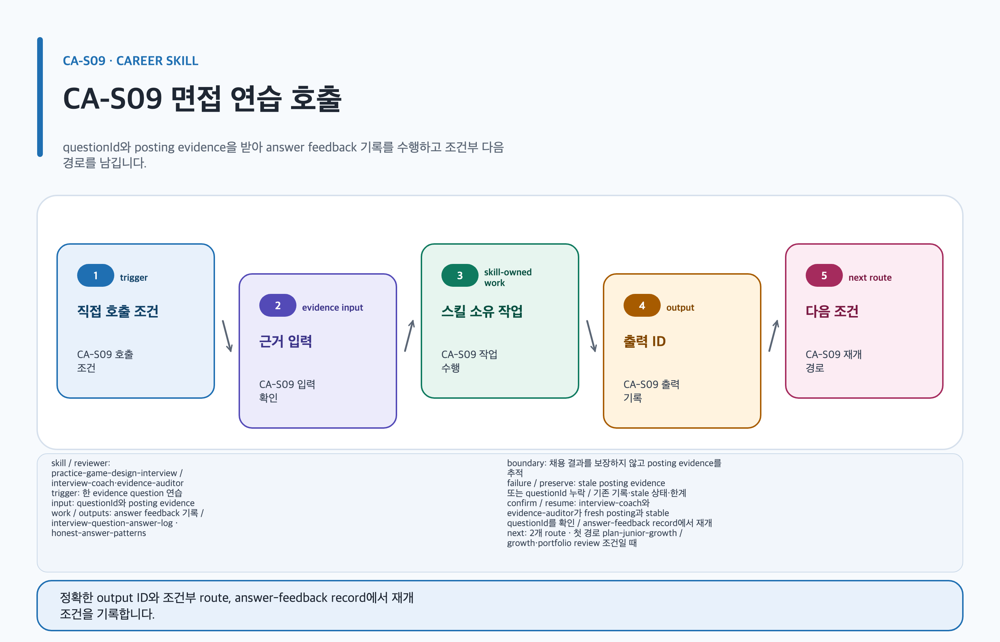

# practice-game-design-interview

## 목적과 최종 산출물

target posting과 portfolio evidence ID에 근거한 4종 질문, 답변 기록, evidence-qualified feedback와 honest-answer pattern을 만듭니다.

## 사용할 때

- 특정 공고의 required·preferred 항목을 기준으로 면접을 연습할 때
- 답변에서 개인 기여, 팀 결과, 선택·대안·결과를 분리할 때

### 직접 호출 활용 — practice-game-design-interview

[](../../assets/game-design-career/skills/practice-game-design-interview.svg)

#### 직접 호출 조건

한 posting·portfolio evidence set의 question record만 연습할 때 직접 호출합니다. 여러 준비 단계와 proof task가 섞였을 때만 `$game-design-career:orchestrate-game-design-career`로 범위를 나눕니다. 합격을 보장하지 않습니다.

#### 입문 App 요청문

```text
@Game Design Career evidence ID가 있는 질문 하나와 honest answer feedback을 기록해.
```

#### 입문 CLI 요청문

```text
$game-design-career:practice-game-design-interview questionId=Q-01 postingEvidenceIds=E-01
```

#### 응용 App 요청문

```text
@Game Design Career 개인 기여와 팀 성과를 분리한 question-answer record를 연습해.
```

#### 응용 CLI 요청문

```text
$game-design-career:practice-game-design-interview questionId=Q-02 portfolioEvidenceIds=P-01
```

#### 고급 App 요청문

```text
@Game Design Career stale posting을 갱신한 뒤 동일 questionId의 answer-feedback을 검토해.
```

#### 고급 CLI 요청문

```text
$game-design-career:practice-game-design-interview questionId=Q-03 review=interview-coach,evidence-auditor
```

#### 예상 파일과 읽는 순서

`content.md → evidence.yml → decisions/ → export-manifest.yml` 순서로 읽습니다. `interview-question-answer-log`, `honest-answer-patterns`를 반환합니다. 검토 owner: `interview-coach` · `evidence-auditor`; 코치는 질문·feedback을, auditor는 posting·portfolio evidence trace를 각각 검토합니다.

#### 실패·재개와 다음 스킬 조건

stale posting evidence 또는 questionId가 없으면 기존 기록을 보존합니다. 재개: fresh posting evidence와 stable questionId를 확인해 answer-feedback record에서 재개합니다. growth·portfolio review 조건일 때만 `$game-design-career:plan-junior-growth`, `$game-design-career:review-game-design-portfolio`로 넘깁니다.

## 사용하지 않을 때

- posting이 없는데 회사별 질문이나 요구를 사실로 만들 때
- 확인되지 않은 metric·ownership·implementation을 설득력 있는 답변으로 포장할 때

## 필수 입력과 선택 입력

- 필수: stable posting evidence IDs, portfolio evidence IDs, target role/level, answer claim
- current 채용 근거 필수: stable `sourceId`, official HTTPS `sourceUrl`(source location), `postedDate`, `retrievalDate`, `reviewAfter`와 trusted 기준일
- 선택: previous feedback, objection focus, interviewer context
- current posting에는 검색일, 지역, 표본을 보존하고 사실·추론·제안을 분리합니다.

## Codex App 요청 예시

**복사 가능한 요청문**

```text
@Game Design Career 이 시스템 기획 공고와 portfolio evidence ID로 base, follow-up, objection, situational 질문을 만들어. 답변의 claim·evidence·choice·alternative·result·reflection을 검토해.
```

## Codex CLI 요청 예시

```text
$game-design-career:practice-game-design-interview posting=JP-12, portfolioEvidence=E-07,E-12, questionTypes=base,follow-up,objection,situational
```

## 내부 진행 흐름

posting과 portfolio record를 inventory하고 stable IDs를 유지합니다. trusted 기준일이 `reviewAfter`를 넘으면 stale evidence는 current claim에 사용하지 않습니다. 이 경우 `research-game-design-jobs`로 공고를 재수집하고 validator 재검증을 통과한 새 evidence IDs만 질문과 claim에 결합합니다. 모든 question record는 stable unique `questionId`, `questionType`, 서로 독립적인 `postingEvidenceIds`와 `portfolioEvidenceIds`, `prompt`, `verificationStatus`를 가집니다. answer record와 feedback record는 같은 `questionId`를 재사용합니다. 답변은 claim, evidence, choice, alternative, verified result 또는 `not-verified`, reflection으로 기록합니다.

## 생성 파일과 결과 구조

evidence inventory, stable `questionId`로 결합된 question record와 answer-feedback record, blocked claims, verification tasks와 honest-answer patterns를 `interview-question-answer-log`에 남깁니다. 예상 결과 요약: 공고와 portfolio 근거를 다시 찾을 수 있는 면접 연습 기록이 생깁니다.

## 관련 템플릿·품질 프로필·전문 역할

- Template ID: `interview-question-answer-log` — [interview-question-answer-log 템플릿](../templates.md#interview-question-answer-log).
- Quality Profile ID: `interview-question-answer-report`.
- Reviewer/role ID: `interview-coach · evidence-auditor`.

이 조합은 [문서 품질 프로필](../document-quality.md)의 선택 기록과 함께 유지하며, profile을 새로 고르지 않는 경우는 위처럼 현재 artifact 상속 사유를 명시합니다.

## 이미지·도식화 조건

면접 연습은 illustration 생성이 필요하지 않습니다. question/evidence 구조가 복잡할 때만 `skillstead-answer-structure-diagram`을 Skillstead로 만들며, 사진·포트폴리오 이미지는 별도 권리 검토를 거칩니다.

[이미지 자산 흐름](../image-assets.md)과 [도식화 안내](../visualization.md)의 승인·검증 경계를 따릅니다.

## 검토·승인 기준

검색일·지역·표본이 한정된 posting evidence임을 표시합니다. 관찰된 사실, candidate 해석, reviewer 추론과 답변 개선 제안을 구분합니다. 답변 연습은 합격을 보장하지 않습니다.

## 실패·fallback·재개 방법

posting이 없으면 posting-specific claim을 `blocked`로 유지하고 role-general question과 posting 확보 task만 만듭니다. stale evidence의 기존 기록, stale 상태와 한계를 삭제하지 않고 보존합니다. `research-game-design-jobs`의 재수집·validator 재검증 뒤 새 evidence IDs가 downstream question의 `postingEvidenceIds`, 같은 `questionId`의 answer-feedback record와 claim에 다시 결합된 후에만 재개합니다. missing result에는 “확인할 수 없는 X 대신 내 결정 Y와 evidence E-12를 설명한다” 같은 honest boundary를 씁니다.

```text
$game-design-career:practice-game-design-interview 기존 questionId를 유지하고 새 posting evidence JP-12를 연결해 blocked 질문부터 재개해.
```

## 다음 작업 요청문

> `<artifact-path>`, `<export-manifest-path>`, `<selected-skill>`은 실제 경로·ID로 바꿔야 하는 자리표시자입니다. [공통 규칙](../../README.md#용어)을 따릅니다.

**복사 가능한 다음 handoff**

@Game Design Career plan-junior-growth로 현재 Artifact의 검증된 기록을 이어 다음 작업을 진행해.

```text
$game-design-career:plan-junior-growth artifact=<artifact-path> 기존 evidence/decision을 보존하고 다음 handoff를 실행해.
```

## 관련 문서

[interview-question-answer-log 템플릿](../templates.md#interview-question-answer-log), [plan-junior-growth 스킬](./plan-junior-growth.md), [스킬 선택표](README.md), [제품 workflow](../workflow.md)

<!-- PROMPT-TEMPLATES:START game-design-career:practice-game-design-interview -->
### 재사용 프롬프트 템플릿

- [beginner — 근거 질문 한 개 연습](../../prompt-templates/career/practice-game-design-interview.md#careerpractice-game-design-interviewbeginner)
- [standard — 네 질문 유형과 답변 기록](../../prompt-templates/career/practice-game-design-interview.md#careerpractice-game-design-interviewstandard)
- [advanced — stale 갱신·정직한 답변·coach 검토](../../prompt-templates/career/practice-game-design-interview.md#careerpractice-game-design-interviewadvanced)
<!-- PROMPT-TEMPLATES:END game-design-career:practice-game-design-interview -->
