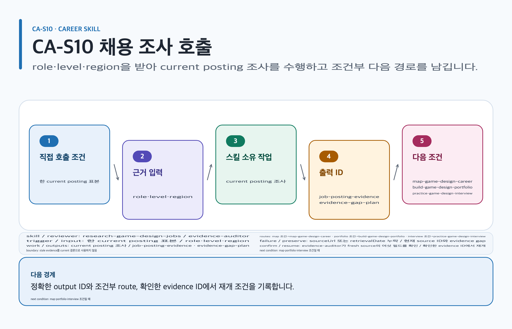

# research-game-design-jobs

## 목적과 최종 산출물

현재 게임 기획 공고를 dated primary evidence collection으로 만들고 required·preferred requirement, repeated signal, applicant evidence와 gap을 분리합니다.

## 사용할 때

- 특정 role·level·지역의 현재 공고와 tool preference를 조사할 때
- transition이나 portfolio gap을 fresh posting source에 연결할 때

### 직접 호출 활용 — research-game-design-jobs

[](../../assets/game-design-career/skills/research-game-design-jobs.svg)

#### 직접 호출 조건

한 role·level·region의 current posting sample만 조사할 때 직접 호출합니다. 여러 role·stage의 우선순위가 섞였을 때만 `$game-design-career:orchestrate-game-design-career`로 범위를 나눕니다. stale evidence는 current claim에 사용하지 않습니다.

#### 입문 App 요청문

```text
@Game Design Career 한 역할의 공식 공고 표본을 sourceUrl과 retrievalDate로 기록해.
```

#### 입문 CLI 요청문

```text
$game-design-career:research-game-design-jobs role=systems level=entry region=KR
```

#### 응용 App 요청문

```text
@Game Design Career location, region, sample boundary와 reviewAfter를 포함해 evidence gap을 정리해.
```

#### 응용 CLI 요청문

```text
$game-design-career:research-game-design-jobs role=systems region=KR retrievalDate=2026-08-07
```

#### 고급 App 요청문

```text
@Game Design Career stale source를 재검색하고 새 evidence ID만 current claim에 연결해.
```

#### 고급 CLI 요청문

```text
$game-design-career:research-game-design-jobs role=systems reviewAfter=2026-09-07
```

#### 예상 파일과 읽는 순서

`content.md → evidence.yml → decisions/ → export-manifest.yml` 순서로 읽습니다. `job-posting-evidence`, `evidence-gap-plan`을 반환합니다. 검토 owner: `evidence-auditor`.

#### 실패·재개와 다음 스킬 조건

sourceUrl 또는 retrievalDate가 없으면 current conclusion을 만들지 않습니다. 재개: official source를 재검색하고 fresh `sourceUrl`, `location`, `retrievalDate`, `region`, `sample boundary`, `reviewAfter`를 확인한 evidence ID에서 재개합니다. map·portfolio·interview 조건일 때만 `$game-design-career:map-game-design-career`, `$game-design-career:build-game-design-portfolio`, `$game-design-career:practice-game-design-interview`로 넘깁니다.

## 사용하지 않을 때

- 단일 공고나 convenience sample로 전체 시장·채용량·성장·보상·적합성을 일반화할 때
- secondary source, stale record 또는 insecure URL을 current claim 근거로 사용할 때

## 필수 입력과 선택 입력

- 필수: target role/level, 지역, employment type, 검색일(`retrievalDate`), trusted `asOfDate`, evidence question
- 선택: candidate artifacts와 employer/project scope
- 모든 결과는 사실·추론·제안을 분리하고 표본 크기·표본 지역·source location·blind spot을 기록합니다.

## Codex App 요청 예시

**복사 가능한 요청문**

```text
@Game Design Career 한국의 신입 시스템 기획 공고를 공식 회사 채용 페이지에서 조사해. required와 preferred를 분리하고 검색일, 지역, 표본, 반복 신호와 일반화 한계를 기록해.
```

## Codex CLI 요청 예시

```text
$game-design-career:research-game-design-jobs role=systems-designer, level=entry, region=KR, retrievalDate=2026-08-06, asOfDate=2026-08-06
```

## 내부 진행 흐름

official company career page를 우선하고 posting마다 unique `sourceId`, HTTPS URL, `postedDate ≤ retrievalDate ≤ asOfDate ≤ reviewAfter`를 기록합니다. 같은 normalized requirement가 서로 다른 공식 공고 2개 이상에 있을 때만 repeated signal로 표시하고 exact statement·field·index·requirement ID를 보존합니다. nonempty collection은 skill directory에서 `node scripts/validate-job-evidence.mjs collection.json --as-of 2026-08-06`으로 검증합니다.

## 생성 파일과 결과 구조

schema-valid posting records, posting-specific required/preferred, repeated signals, applicant evidence, gaps, non-generalizable constraints, sample size/geography와 inference limits를 `job-posting-evidence`에 남깁니다. 예상 결과 요약: 현재 claim을 source와 날짜까지 재현할 수 있는 evidence set이 생깁니다.

## 관련 템플릿·품질 프로필·전문 역할

- Template ID: `job-posting-evidence` — [job-posting-evidence 템플릿](../templates.md#job-posting-evidence).
- Quality Profile ID: `job-posting-evidence`.
- Reviewer/role ID: `evidence-auditor · career-strategist`.

이 조합은 [문서 품질 프로필](../document-quality.md)의 선택 기록과 함께 유지하며, profile을 새로 고르지 않는 경우는 위처럼 현재 artifact 상속 사유를 명시합니다.

## 이미지·도식화 조건

공고 조사 자체는 이미지를 생성하지 않습니다. source/sample/requirement 관계가 표보다 복잡할 때만 `skillstead-job-evidence-dependency-diagram`을 Skillstead로 만들고, screenshot은 권리·출처 슬롯이 있을 때만 계획합니다.

[이미지 자산 흐름](../image-assets.md)과 [도식화 안내](../visualization.md)의 승인·검증 경계를 따릅니다.

## 검토·승인 기준

byte-exact source statement가 사실이고, repeated pattern·candidate fit은 별도 추론이며 exercise·proof artifact는 제안입니다. 표본 밖 prevalence나 합격을 보장하지 않습니다. 개인정보·공개 범위와 refresh owner는 사람이 승인합니다.

## 실패·fallback·재개 방법

stale, undated, secondary, insecure, future-retrieved source나 count/denominator/geography mismatch는 completion blocker입니다. `reviewAfter` 이후에는 다시 검색하고 검증합니다.

```text
$game-design-career:research-game-design-jobs 기존 sourceId를 유지하고 reviewAfter가 지난 공고만 재검색한 뒤 validator부터 재개해.
```

## 다음 작업 요청문

> `<artifact-path>`, `<export-manifest-path>`, `<selected-skill>`은 실제 경로·ID로 바꿔야 하는 자리표시자입니다. [공통 규칙](../../README.md#용어)을 따릅니다.

**복사 가능한 조건부 다음 handoff**

- 조건: `new-graduate-system-design` scenario에서 fresh posting evidence를 role gap에 연결할 때.

```text
$game-design-career:map-game-design-career artifact=<artifact-path> 기존 evidence/decision을 보존하고 new-graduate-system-design의 role map으로 진행해.
```

- 조건: `junior-transition` scenario에서 fresh posting evidence로 interview practice를 시작할 때.

```text
$game-design-career:practice-game-design-interview artifact=<artifact-path> 기존 evidence/decision을 보존하고 junior-transition의 interview handoff를 실행해.
```

## 관련 문서

[job-posting-evidence 템플릿](../templates.md#job-posting-evidence), [map-game-design-career 스킬](./map-game-design-career.md), [스킬 선택표](README.md), [제품 workflow](../workflow.md)

<!-- PROMPT-TEMPLATES:START game-design-career:research-game-design-jobs -->
### 재사용 프롬프트 템플릿

- [beginner — 공식 공고 한 개를 근거로 읽는 채용 조사](../../prompt-templates/career/research-game-design-jobs.md#careerresearch-game-design-jobsbeginner)
- [standard — 날짜·지역·표본을 경계로 하는 채용 조사](../../prompt-templates/career/research-game-design-jobs.md#careerresearch-game-design-jobsstandard)
- [advanced — 최신성·blind spot·일반화 한계를 검토하는 채용 조사](../../prompt-templates/career/research-game-design-jobs.md#careerresearch-game-design-jobsadvanced)
<!-- PROMPT-TEMPLATES:END game-design-career:research-game-design-jobs -->
