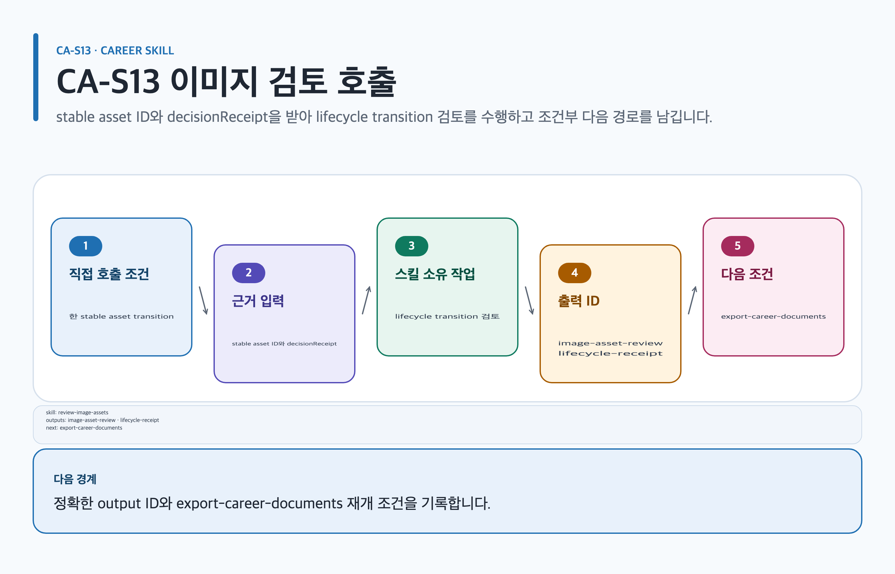

# review-image-assets

## 목적과 최종 산출물

Career image의 권리·provenance·가독성·accessibility·placement를 검토하고 named-human evidence가 있을 때만 lifecycle transition을 적용합니다.

## 사용할 때

- portfolio proof image를 document에 넣기 전 권리와 alt text를 검토할 때
- `concept-draft → document-approved → production-candidate` 전환을 기록할 때

### Career 직접 호출 활용 — review-image-assets

[](../../assets/game-design-career/skills/review-image-assets.svg)

#### 직접 호출 조건

검증된 `assets/image-assets.yml`의 한 stable asset ID와 requested lifecycle transition만 검토할 때 직접 호출합니다. 여러 artifact의 image·export 우선순위가 섞였을 때만 `$game-design-career:orchestrate-game-design-career`로 범위를 나눕니다. agent 권고와 asset bytes는 actual user decision이나 승인 증거가 아닙니다.

#### 입문 App 요청문

```text
@Game Design Career 검증된 `assets/image-assets.yml`의 asset 하나에 actual user decision, named reviewer, reviewedAt, artifact-local evidence paths와 rightsDecision=approved가 있는지 확인해.
```

#### 입문 CLI 요청문

```text
$game-design-career:review-image-assets assetId=portfolio-proof-01 targetState=document-approved reviewer="[이름 있는 검토자]" reviewedAt=2026-08-07T10:00:00+09:00 rightsDecision=approved evidencePaths=assets/evidence/review-01.yml decisionReceipt=<host-user-image-decision>
```

#### 응용 App 요청문

```text
@Game Design Career actual user decision과 artifact-local evidence paths를 stable asset ID, placement, alt text, readability, rightsDecision=approved에 연결해 lifecycle receipt를 검토해.
```

#### 응용 CLI 요청문

```text
$game-design-career:review-image-assets assetId=portfolio-proof-01 targetState=document-approved reviewer="[이름 있는 검토자]" reviewedAt=2026-08-07T10:00:00+09:00 decisionReceipt=<host-user-image-decision> evidencePaths=assets/evidence/review-01.yml rightsDecision=approved
```

#### 고급 App 요청문

```text
@Game Design Career `concept-draft` → `document-approved` → `production-candidate` 순서를 건너뛰지 않고, host-user-image-decision receipt의 from_state, target_state, decision=approved, reviewer, decided_at, evidence paths와 rights decision을 확인해 재개해.
```

#### 고급 CLI 요청문

```text
$game-design-career:review-image-assets assetId=portfolio-proof-01 targetState=production-candidate reviewer="[이름 있는 검토자]" reviewedAt=2026-08-07T10:00:00+09:00 rightsDecision=approved evidencePaths=decisions/image-rights-review.yml decisionReceipt=<host-user-image-decision>
```

#### 예상 파일과 읽는 순서

`content.md → evidence.yml → assets/image-assets.yml` 순서로 읽습니다. `image-asset-review`, `lifecycle-receipt`을 반환합니다. 검토 owner: `named-human-reviewer`. `visual-asset-reviewer`와 `art-brief-director`는 finding·recommendation만 제공합니다. `production-candidate`가 되려면 rightsDecision은 `approved`이고 결과 asset의 `rights.effective_status=active`여야 하며, `active`는 rights decision 값이 아닙니다.

#### 실패·재개와 다음 스킬 조건

actual user decision, named reviewer, reviewedAt, artifact-local evidence paths 또는 rightsDecision이 없으면 state를 바꾸지 않습니다. 재개: 누락된 evidence를 같은 stable asset ID의 lifecycle receipt에 연결하고 targetState transition부터 재개합니다. document-approved일 때만 `$game-design-career:export-career-documents`로 넘깁니다.

## 사용하지 않을 때

- agent 추천, 생성 성공, file existence 또는 timestamp만으로 승인할 때
- 이미지를 career evidence나 portfolio claim의 증명으로 바꿀 때

## 필수 입력과 선택 입력

- 필수: validated manifest, stable asset ID, requested state, actual user decision evidence, named human reviewer/time, artifact-local evidence paths, placement, alt text, readability, scope, rights/provenance decision
- `production-candidate` 추가 필수: technical fit, gameplay readability와 active rights evidence
- 선택: prior findings, prompt/variant notes와 revocation history

## Codex App 요청 예시

**복사 가능한 요청문**

```text
@Game Design Career portfolio-proof-01의 provenance, 권리, alt text, placement와 가독성을 검토해. 내 실제 결정 receipt가 없으면 승인하지 말고 blocker만 남겨.
```

## Codex CLI 요청 예시

```text
$game-design-career:review-image-assets assetId=portfolio-proof-01 targetState=document-approved reviewer="[실제 담당자 이름]" reviewedAt=2026-08-07T10:00:00+09:00 rightsDecision=approved evidencePaths=assets/evidence/review-01.yml decisionReceipt=<host-user-image-decision>
```

## 내부 진행 흐름

manifest와 artifact-local evidence를 검증합니다. `visual-asset-reviewer`와 `art-brief-director`는 findings와 recommendation만 냅니다. 사용자는 stable asset ID와 실제 승인/거부 결정을 입력하고, host adapter가 immutable structured `host-user-image-decision` receipt를 수집한 뒤 reviewer, reviewedAt, evidencePaths와 rightsDecision을 묶어 순차 transition을 적용합니다. 임의 JSON·문자열 receipt는 거부됩니다.

## 생성 파일과 결과 구조

stable asset ID, evidence-bounded findings, named-human decision record, targetState transition, decisionReceipt, blockers와 derivative eligibility를 반환합니다. 예상 결과 요약: 권고와 사람 승인이 분리된 lifecycle receipt 기록이 생깁니다.

## 관련 템플릿·품질 프로필·전문 역할

- Template ID: `current artifact profile` — [템플릿 카탈로그](../templates.md).
- Quality Profile ID: `current artifact profile을 상속하며 review가 profile을 바꾸지 않음`.
- Reviewer/role ID: `visual-asset-reviewer · art-brief-director`.

이 조합은 [문서 품질 프로필](../document-quality.md)의 선택 기록과 함께 유지하며, profile을 새로 고르지 않는 경우는 위처럼 현재 artifact 상속 사유를 명시합니다.

## 이미지·도식화 조건

기존 illustration asset의 provenance·rights·alt text·placement만 검토합니다. 새 구조 도식이나 이미지를 만들지 않으며 `document-approved`가 된 asset만 export binding 후보입니다.

[이미지 자산 흐름](../image-assets.md)과 [도식화 안내](../visualization.md)의 승인·검증 경계를 따릅니다.

## 검토·승인 기준

named reviewer가 없는 경우 transition하지 않습니다. `production-candidate`는 release, legal, 채용 제출 또는 production approval이 아닙니다. `document-approved` 미만 asset을 final MD/PDF/DOCX/PPTX에 binding하지 않습니다.

## 실패·fallback·재개 방법

provenance, placement, alt text, rights, accessibility 또는 actual user receipt가 없으면 현재 state를 유지합니다. arbitrary disk JSON과 product specialist ID는 human evidence가 아닙니다.

```text
$game-design-career:review-image-assets 기존 findings와 state를 유지하고 named-human rights receipt가 추가된 지점부터 재개해.
```

## 다음 작업 요청문

> `<artifact-path>`, `<export-manifest-path>`, `<selected-skill>`은 실제 경로·ID로 바꿔야 하는 자리표시자입니다. [공통 규칙](../../README.md#용어)을 따릅니다.

**복사 가능한 조건부 다음 handoff**

@Game Design Career requested transition이 document-approved가 되어 export binding 조건을 만족할 때만 export-career-documents로 진행해. 그렇지 않으면 review finding을 보존해.

```text
$game-design-career:export-career-documents artifact=<artifact-path> 기존 evidence/decision을 보존하고 다음 handoff를 실행해.
```

`document-approved` export binding 조건을 만족한 경우의 허용 대상은 `export-career-documents`뿐입니다. 그 외 상태에서는 이 review artifact와 finding만 유지합니다.

## 관련 문서

[템플릿 카탈로그](../templates.md), [export-career-documents 스킬](./export-career-documents.md), [스킬 선택표](README.md), [제품 workflow](../workflow.md)

<!-- PROMPT-TEMPLATES:START game-design-career:review-image-assets -->
### 재사용 프롬프트 템플릿

- [beginner: 문서 concept 이미지 검토 요청](../../prompt-templates/career/review-image-assets.md#careerreview-image-assetsbeginner)
- [standard: 공개 권리·가독성 document approval](../../prompt-templates/career/review-image-assets.md#careerreview-image-assetsstandard)
- [advanced: production candidate·review cycle 증빙](../../prompt-templates/career/review-image-assets.md#careerreview-image-assetsadvanced)
<!-- PROMPT-TEMPLATES:END game-design-career:review-image-assets -->
