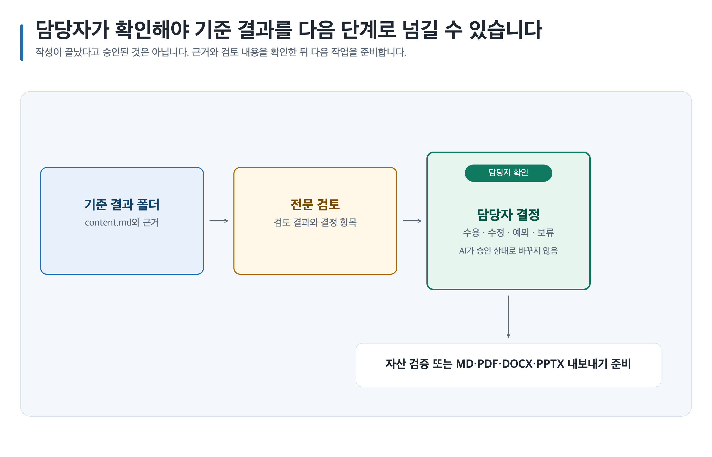

# Game Design Career 전체 워크플로

Career는 현재 단계를 진단한 뒤 필요한 근거만 조사하고, 작은 증거 프로젝트를 포트폴리오·면접·성장 계획으로 연결합니다.

[한국어 Archify 증거·포트폴리오 워크플로 열기](../assets/archify/career/career-evidence-workflow.html)

각 작업은 현재 프로젝트에서 승인된 Career·공통 기억을 먼저 조회하되 출처가 달라졌거나 검토·만료 시점을 지난 기록은 제외합니다. 역기획이나 포트폴리오 비교가 필요하면 [레퍼런스 분석](reference-analysis.md)으로 관찰과 추론을 분리하고, 직무·시스템 용어가 흔들리면 [용어 사전](glossary.md)으로 후보와 문서 영향을 검토합니다. 결과를 검증한 뒤에는 재사용 가치가 있는 교훈만 후보로 남기며 자동 승인하지 않습니다. 기억을 끄거나 조회·저장에 문제가 생기면 아래 워크플로는 기억 없이 그대로 진행됩니다. 설정과 관리 방법은 [Career 프로젝트 기억](memory.md)을 확인하세요.

```text
단계 진단
→ 승인된 기억·레퍼런스·용어 확인
→ 현재 근거 조사
→ 증거 프로젝트
→ 포트폴리오·면접·성장
→ 전문 검토
→ MD/PDF/DOCX/PPTX 내보내기
```

[](../assets/shared/canonical-artifact-lifecycle.svg)

## 1. 단계 진단

목표 역할, 경력 상태, 보유 자료, 시간과 지역·플랫폼 제약을 정규화해 `entry`, `new-hire`, `junior-growth`, `transition` 중 하나를 고릅니다. 역할이나 단계가 불명확하면 `unclear`로 두고 여러 임시 경로와 기회비용을 비교합니다.

**사람 결정:** 목표 역할을 확정할지, 어떤 대안을 더 조사할지 정합니다.

## 2. 현재 근거 조사

현재 채용공고, 회사, 프로젝트, 도구 또는 시장 사실이 필요할 때만 조사합니다. 각 claim에 출처, 기준 날짜, 적용 범위와 한계를 연결합니다. 공고가 없으면 공고별 요구사항을 일반적인 역할 사실로 바꾸지 않습니다.

**사람 결정:** 조사 범위와 사용할 수 있는 공고·개인 자료의 권리와 공개 범위를 승인합니다.

레퍼런스 게임 분석은 시스템 존재와 근거를 먼저 목록화한 뒤 연결 관계·루프·영향도를 검토합니다. 확인되지 않은 규칙은 사실처럼 쓰지 않습니다. 용어 사전도 한국어·영어 후보와 영향 목록을 먼저 만들고, 이름이 기록된 사람의 승인 전에는 포트폴리오 원문을 자동 치환하지 않습니다.

## 3. 증거 프로젝트

역량 격차를 읽기 목록만으로 끝내지 않고, 1~12주 안에 검토 가능한 작은 산출물로 바꿉니다. 예: 규칙·상태·예외 명세, 역기획서, 데이터 테이블, UX 흐름, 피드백 반영 기록입니다.

각 프로젝트에는 목표 역량, 시작 자료, 주별 행동, 완료 기준, 검토자와 포트폴리오에 남길 증거를 기록합니다. 실제로 하지 않은 기여나 성과는 쓰지 않습니다.

## 4. 포트폴리오·면접·성장

| 경로 | 연결 방식 | 완료 기준 |
| --- | --- | --- |
| 포트폴리오 | 문제, 판단, 기여, 결과와 근거를 case study로 연결 | claim마다 확인 가능한 증거 또는 명시적 gap이 있음 |
| 면접 | 공고 요구와 포트폴리오 evidence ID로 질문·답변을 연결 | 사실과 가정, 개인 기여와 팀 결과가 구분됨 |
| 주니어 성장 | 프로젝트 영향, 피드백, 다음 실험을 분기 계획으로 연결 | 목표와 관찰 가능한 성장 증거가 있음 |
| 이직·전환 | 새 역할 요구와 현재 증거의 차이를 비교 | 전환 준비도와 보완 작업이 분리됨 |

## 5. 검토

포트폴리오 검토는 내용, 증거와 문서 품질 관점을 분리합니다. 서로 충돌하는 권고는 삭제하지 않고 결정 항목으로 남깁니다. 개인정보, 제3자 권리, 회사 비공개 정보와 과장된 claim은 승인 전에 해결합니다.

## 6. 내보내기

Canonical Artifact의 `content.md`에서 MD, PDF, DOCX 또는 PPTX 작업을 준비합니다. renderer가 없으면 지원하지 못한 형식만 `unavailable`로 남기고 Markdown, 근거, 결정과 기존 검증 결과를 보존합니다. 파일 생성과 채용 제출 승인은 별도입니다.

## 재개 계약

중단할 때 Artifact 경로, 진단 단계, 사용한 근거 날짜, 완료된 증거, 차단 claim과 다음 검증 작업을 보존합니다.

```text
system-designer-12-week-roadmap/content.md를 기준으로 기존 evidence ID를 유지하고, blocked인 채용공고 최신성 확인부터 재개해줘.
```
