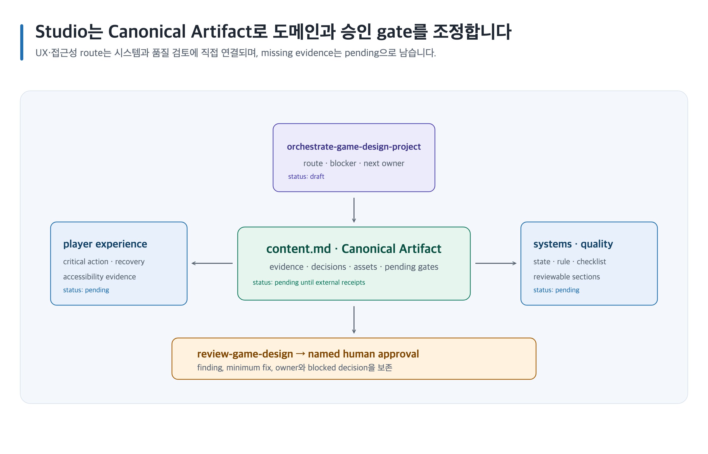
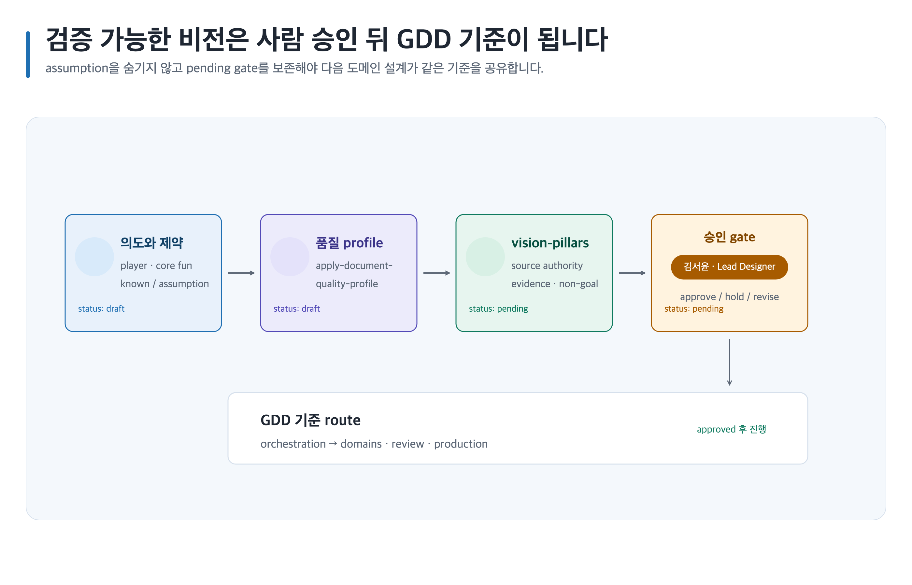

# Game Design Studio 사용자 가이드

Game Design Studio는 게임 디자인 문서(GDD)를 게임 비전에서 시스템·콘텐츠·플레이어 경험·경제·LiveOps·제작 계획, 검토, 자산과 내보내기까지 연결합니다. `content.md`를 기준으로 근거, 결정, 미해결 위험과 사람 승인 상태를 보존하는 Canonical Artifact(기준 작업 폴더)를 사용합니다. [공통 용어](../README.md#용어)를 먼저 확인하세요.

## 처음 시작하기

1. [설치](installation.md)에서 App 또는 CLI 중 한 환경의 절차만 따라 설치합니다.
2. [5분 빠른 시작](quick-start.md)의 요청문 하나를 복사합니다.
3. [템플릿 15개](templates.md)와 [스킬 15개](skills/README.md)에서 필요한 한 쌍을 고릅니다.
4. [목적별 레시피](#목적별-레시피) 하나를 선택합니다.
5. [전체 워크플로](workflow.md)에서 현재 단계와 다음 사람 결정을 확인합니다.
6. [이미지 자산](image-assets.md)에서 image slot과 사람 승인 경계를 계획합니다.
7. [시각화](visualization.md)에서 Skillstead SVG와 PNG 검증을 준비합니다.
8. [MD·PDF·DOCX·PPTX 내보내기](exports.md)에서 필요한 형식만 준비합니다.
9. 막히면 [문제 해결](troubleshooting.md)에서 보존된 결과로 재개합니다.

## 목적별 레시피

- [새 게임 GDD](recipes/new-game-gdd.md)
- [시스템 기능 명세](recipes/system-feature-spec.md)
- [콘텐츠·퀘스트 설계](recipes/content-quest-design.md)
- [UX·접근성](recipes/ux-accessibility.md)
- [경제·LiveOps](recipes/economy-liveops.md)
- [제작 검토·내보내기](recipes/production-review-export.md)

대표 도식:

- 
- [편집 가능한 SVG 열기](../assets/game-design-studio/studio-orchestration-map.svg)
- 
- [편집 가능한 SVG 열기](../assets/game-design-studio/vision-to-gdd-approval.svg)

## 가이드 목차

현재 사용할 수 있는 진입 문서:

- [설치](installation.md)
- [5분 빠른 시작](quick-start.md)
- [전체 워크플로](workflow.md)
- [문제 해결](troubleshooting.md)

전체 레퍼런스:

- [스킬 15개](skills/README.md)
- [템플릿 15개](templates.md)
- [문서 품질 profile](document-quality.md)
- [이미지 자산](image-assets.md)
- [시각화](visualization.md)
- [MD·PDF·DOCX·PPTX 내보내기](exports.md)

각 스킬 ID는 [스킬 15개](skills/README.md)에서 해당 상세 가이드로 직접 연결됩니다. 각 템플릿의 용도와 복사 가능한 요청문은 [템플릿 15개](templates.md)에 있습니다.

## 작업 원칙

- 게임 아이디어 한두 문장으로 시작할 수 있지만, 가정은 사실과 분리합니다.
- Canonical Artifact의 `content.md`가 내용 기준입니다. 렌더 결과나 대화만을 새 기준으로 삼지 않습니다.
- 이미지 생성, 도식 렌더, 문서 내보내기가 실패해도 검증된 Markdown과 기존 자산을 보존합니다.
- 생성 이미지와 렌더 결과는 자동 승인되지 않습니다. 권리와 품질을 확인한 이름 있는 사람의 결정이 필요합니다.
