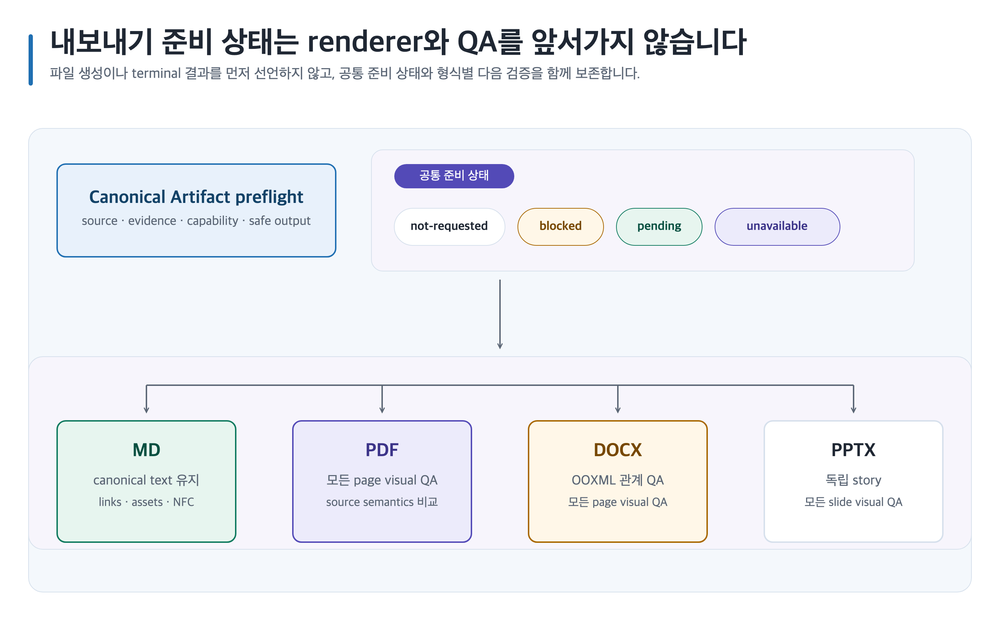

# MD·PDF·DOCX·PPTX 내보내기

Studio export skill은 Canonical Artifact를 검증하고 renderer-neutral 작업을 준비합니다. 실제 생성, renderer와 terminal QA는 별도 trusted workflow가 소유합니다.

[](../assets/shared/document-export-flow.svg)

## 공통 preflight

artifact directory/version, recipe, requested formats, safe output directory, capability snapshot, audience, purpose와 overwrite policy를 수집합니다. canonical validation이 실패하면 형식 작업을 중단하고 source path, command, exit code와 결과를 보존합니다.

## 형식 비교

| 형식 | 준비 capability | Downstream 검증 | 주요 경계 |
| --- | --- | --- | --- |
| MD | packaged `canonical-markdown` | canonical structure, links, asset/alt text, NFC, stable IDs | canonical text를 보존합니다. |
| PDF | probed `pdf` | 실제 PDF, source semantics, 모든 page render와 visual QA | 계획 단계에서는 renderer를 선택하지 않습니다. |
| DOCX | probed `documents` | OOXML package/relationships, semantics, 모든 page render와 visual QA | package와 relation을 실제 검사해야 합니다. |
| PPTX | probed `presentations` | 독립 story, overflow, 모든 slide render와 visual QA | Markdown heading을 slide로 기계 분할하지 않습니다. |

## Presentation story

PPTX는 audience, purpose와 독립 story outline이 필수입니다. conclusion → stakes → evidence → alternatives/trade-offs → recommendation → next gate로 decision story를 구성합니다. 각 slide는 unique stable `id`, `title`, `message`, `purpose`를 가지며 canonical structural heading을 복사하지 않습니다.

## Asset binding

final derivative는 `document-approved` 이상 image asset만 참조합니다. Skillstead diagram은 editable SVG authority, 정확한 2× PNG, source mapping, alt text, lint, renderer identity와 two-pass visual QA evidence를 갖춰야 합니다. 생성·렌더 사실은 approval이 아닙니다.

## Preparation 상태

Studio 준비 manifest가 허용하는 format 상태는 `not-requested`, `blocked`, `unavailable`, `pending`뿐입니다.

- 지원되는 요청: `pending`
- capability 부재: `unavailable`
- canonical preflight 실패: `blocked`
- generation·renderer·QA: 항상 `not-run`
- output path·digest·page/slide count: null
- format evidence: 빈 배열

이 validator는 format-level `passed`와 `failed`를 fail-closed로 거부합니다. terminal 결과는 별도 renderer-and-QA workflow만 결정합니다.

## 보존과 실패

path traversal, symlink, unsafe output과 implicit overwrite를 거부합니다. capability가 없거나 preflight가 실패해도 canonical artifact와 기존 owner output을 바꾸지 않습니다.

## 복사 가능한 요청문

```text
@Game Design Studio 이 승인된 Canonical Artifact의 MD, PDF, DOCX와 의사결정자용 PPTX 작업을 준비해. PPTX는 독립 story로 만들고 renderer-neutral manifest에는 passed/failed를 쓰지 마.
```
