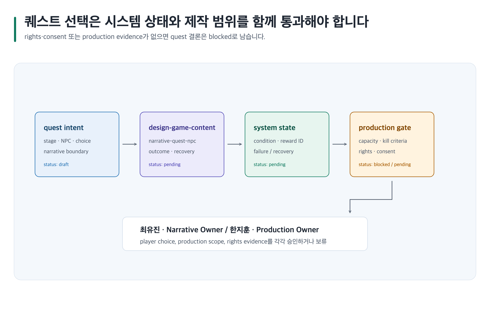

# 콘텐츠·퀘스트를 플레이 가능한 제작 계약으로 만들기

> 본문에 쓰인 고정 한국 이름은 모두 **가상 예시 담당자**입니다. 실제 실행에서는 host user-decision receipt에 기록된 named human을 사용합니다.



## 완료 목표

퀘스트 stage, NPC, 선택, 보상, 시스템 state와 제작 범위를 한 artifact에 연결하고 권리·동의·production risk를 드러냅니다.

## 준비할 입력

- 콘텐츠 목적, system/data ID, narrative boundary, NPC/UGC 권리 정보와 제작 제약
- Canonical Artifact 경로 family: `game-design/<project-id>/narrative-quest-npc/`
- 템플릿: `narrative-quest-npc`; 전투 콘텐츠면 `character-skill-combat-monster`

## 복사 가능한 요청문

Codex App 자연어 요청:

```text
@Game Design Studio 폐광 퀘스트의 stage, branch, NPC, choice, reward와 실패 복구를 시스템 state ID에 연결해. 외부 원작·UGC·AI 대사는 rights와 consent가 없으면 blocker로 남겨.
```

Codex CLI 명시 호출:

```text
$game-design-studio:design-game-content game-design/<project-id>/narrative-quest-npc/를 작성하고 $game-design-studio:design-game-systems 및 $game-design-studio:plan-game-production으로 의존성과 제작 위험을 검토해.
```

## 단계별 진행

1. template과 quality profile을 선택하고 퀘스트의 source stable section과 system/data ID를 고정합니다.
2. `design-game-content`로 stage, gate, branch, outcome, repeat path와 failure-recovery를 작성합니다.
3. `design-game-systems`으로 state·reward·condition 연결을 검증하고 `plan-game-production`으로 capacity와 kill criteria를 기록합니다.
4. `review-game-design` finding에 narrative consistency, fairness, rights/consent, production risk를 분리해 남깁니다.
5. 퀘스트 관계는 `visualize-game-design` SVG로만 도식화합니다. 권리·동의가 아직 없으므로 이 사례의 권장 mode는 `prompt-only`이며 prompt/placeholder만 남깁니다. 실제 illustration을 선택할 때만 사람 `select` receipt의 stable asset ID 범위로 재개합니다. `required`는 finite required asset만, `all`은 declared asset만 생성합니다. [이미지 자산 흐름](../image-assets.md)을 따릅니다.

## 사람이 결정할 지점

Narrative Owner **최유진**이 player choice와 ending boundary를, Production Owner **한지훈**이 제작 범위와 kill criteria를 승인합니다. 권리·동의 증거가 없으면 두 사람 모두 승인할 수 없습니다.

## 예상 결과

`game-design/<project-id>/narrative-quest-npc/content.md`에 quest contract, asset placeholder, dependency와 blocked gate가 남습니다. Chromium renderer가 없으면 SVG source와 alt text만 보존하고 PNG는 fallback 상태로 기록합니다.

### 예상 파일 트리

```text
game-design/<project-id>/
├── narrative-quest-npc/
│   ├── content.md
│   ├── evidence.yml
│   ├── decisions/README.md
│   ├── assets/README.md
│   └── export-manifest.yml
└── character-skill-combat-monster/
    └── content.md
```

`game-design/<project-id>/narrative-quest-npc/`에 quest 상태와 권리 gate를, 연결 전투가 있으면 별도 `content.md`에 전투 계약을 둡니다.

### 대표 내용 예시

`narrative-quest-npc`와 `character-skill-combat-monster`는 이야기 선택을 시스템 조건과 제작 경계에 연결합니다.

```md
Q-ARCH-01: entry=SYS-WATER-02, choice=records-returned, reward=archive-key.
rights-consent evidence가 없으면 NPC 대사 asset record는 blocked로 유지한다.
전투 연결은 ATK-GUARD-02의 telegraph와 counterplay를 참조한다.
```

### 완료 기준

최유진이 player choice와 ending boundary를, 한지훈이 제작 범위와 kill criteria를 승인하거나 보류합니다. system/data ID, rights·consent evidence, dependency owner가 `content.md`에 연결되기 전에는 실제 asset이나 공개를 완료로 선언하지 않습니다.

### 포트폴리오 또는 팀 전달 포인트

Canonical Artifact의 `content.md`, 선택 결과, dependency와 blocker 결정을 전달해 팀이 재개 조건과 남은 위험을 찾을 수 있게 합니다. 포트폴리오에는 공개 권한이 있는 quest 구조와 개인 기여만 요약하고, 원작·UGC·NDA 자료는 제외합니다.

## 실패와 재개

system ID가 바뀌거나 rights evidence가 빠지면 해당 stage를 `blocked`로 두고 나머지 canonical text를 덮어쓰지 않습니다. artifact path와 blocked decision ID로 재개합니다. Chromium 또는 필요한 renderer/capability가 unavailable이면 PNG는 `unavailable` 상태로 남기고 Canonical Artifact와 기존 owner output을 보존합니다.

## 관련 기능

- [콘텐츠 스킬](../skills/design-game-content.md), [제작 스킬](../skills/plan-game-production.md), [이미지 자산](../image-assets.md)
- [이미지 자산 수명주기](../../assets/shared/image-asset-lifecycle.png)는 illustration 승인 경계를 설명합니다.

<!-- PROMPT-TEMPLATES:START game-design-studio:recipe:content-quest-design -->
<!-- PROMPT-CARD: studio:recipe:content-quest-design -->
#### studio:recipe:content-quest-design

**content-quest-design recipe**

content-quest-design recipe의 ordered CLI calls와 artifact read order를 보존한다.

##### 사용하는 경우
canonical artifact의 안전한 다음 작업 순서가 필요할 때 사용한다.

##### 사용하지 않는 경우
evidence, rights, image, export 또는 approval gate를 건너뛸 때는 사용하지 않는다.

##### 준비 입력
###### 필수 입력
- 공개 가능한 canonical artifact

###### 선택 입력
- named human decision receipt

##### 바꿀 자리표시자
- [프로젝트 ID]

##### Codex App 완성 예시
```text
@Game Design Studio 폐광 퀘스트의 stage, branch, NPC, choice, reward와 실패 복구를 시스템 state ID에 연결해. 외부 원작·UGC·AI 대사는 rights와 consent가 없으면 blocker로 남겨.
```

##### Codex App 재사용 템플릿
```text
@Game Design Studio 폐광 퀘스트의 stage, branch, NPC, choice, reward와 실패 복구를 시스템 state ID에 연결해. 외부 원작·UGC·AI 대사는 rights와 consent가 없으면 blocker로 남겨. [프로젝트 ID]의 fact, inference, recommendation과 미정 blocker를 보존해.
```

##### Codex CLI 완성 예시
```text
$game-design-studio:design-game-content game-design/<project-id>/narrative-quest-npc/를 작성하고 $game-design-studio:design-game-systems 및 $game-design-studio:plan-game-production으로 의존성과 제작 위험을 검토해.
```

##### Codex CLI 재사용 템플릿
```text
$game-design-studio:design-game-content game-design/[프로젝트 ID]/narrative-quest-npc/를 작성하고 $game-design-studio:design-game-systems 및 $game-design-studio:plan-game-production으로 의존성과 제작 위험을 검토해. fact, inference, recommendation을 보존해.
```

##### 스킬·전문 역할 흐름
- 기본 스킬: design-game-content
- 스킬 흐름: design-game-content → design-game-systems → plan-game-production
- 전문 역할: lead-game-designer

##### 중간 산출물
- narrative-quest-npc
- character-skill-combat-monster

##### 예상 결과물
###### 최소 결과물
- narrative-quest-npc canonical artifact
- blocker와 resume receipt

###### 선택 결과물
- 공개 가능한 evidence summary

###### 확장 결과물
- downstream handoff

##### 파일 구조
- game-design/[프로젝트 ID]/narrative-quest-npc/content.md
- game-design/[프로젝트 ID]/narrative-quest-npc/evidence.yml
- game-design/[프로젝트 ID]/narrative-quest-npc/decisions/README.md
- game-design/[프로젝트 ID]/narrative-quest-npc/assets/README.md
- game-design/[프로젝트 ID]/narrative-quest-npc/export-manifest.yml
- game-design/[프로젝트 ID]/character-skill-combat-monster/content.md

##### 읽는 순서
- game-design/[프로젝트 ID]/narrative-quest-npc/content.md
- game-design/[프로젝트 ID]/narrative-quest-npc/evidence.yml
- game-design/[프로젝트 ID]/narrative-quest-npc/decisions/README.md
- game-design/[프로젝트 ID]/narrative-quest-npc/assets/README.md
- game-design/[프로젝트 ID]/narrative-quest-npc/export-manifest.yml
- game-design/[프로젝트 ID]/character-skill-combat-monster/content.md

##### 도식 바인딩
- ID: st-s01
- SVG: guides/assets/game-design-studio/skills/apply-document-quality-profile.svg
- PNG: guides/assets/game-design-studio/skills/apply-document-quality-profile.png
- 대체 텍스트: Studio recipe flow

##### 사람 검토
###### 승인 경계
named human decision owner가 content-quest-design의 approval 또는 보류를 결정한다.

###### 보류 조건
- canonical evidence, rights, image/export receipt, 또는 owner approval receipt가 없으면 보류

###### 안전 경계
모르는 정보는 미정으로 남긴다. Do not request credentials, personal data, or private materials.

##### 실패와 재개
```text
content-quest-design의 보존 canonical artifact와 blocker를 읽고 공개 정보만으로 재개해.
```
<!-- PROMPT-TEMPLATES:END game-design-studio:recipe:content-quest-design -->
