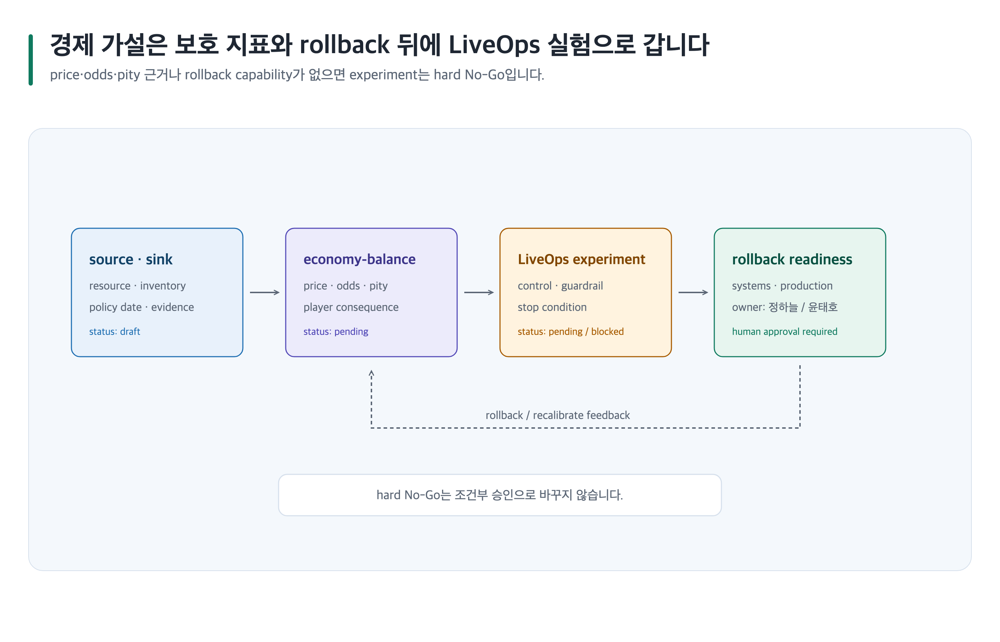

# 경제·LiveOps를 가설·보호 지표·rollback으로 설계하기

> 본문에 쓰인 고정 한국 이름은 모두 **가상 예시 담당자**입니다. 실제 실행에서는 host user-decision receipt에 기록된 named human을 사용합니다.



## 완료 목표

통화 source/sink, progression, price·probability 가정, player protection, 실험·stop·rollback을 분리해 reversible한 경제 artifact를 만듭니다.

## 준비할 입력

- resource ID, telemetry, current price/probability policy, experiment hypothesis와 보호 지표
- Canonical Artifact 경로 family: `game-design/<project-id>/economy-balance/` 및 `game-design/<project-id>/liveops-experiment-event/`
- 템플릿: `economy-balance`, `liveops-experiment-event`

## 복사 가능한 요청문

Codex App 자연어 요청:

```text
@Game Design Studio 골드와 토큰의 source/sink, target inventory, progression, price·odds·pity 가정을 기록하고 LiveOps 실험의 control, guardrail, stop과 rollback을 설계해. 근거 없는 수치와 monetization 승인은 만들지 마.
```

Codex CLI 명시 호출:

```text
$game-design-studio:design-game-economy-and-liveops game-design/<project-id>/economy-balance/와 liveops-experiment-event/를 작성한 뒤 $game-design-studio:design-game-systems 및 $game-design-studio:plan-game-production으로 rollback dependency를 검토해.
```

## 단계별 진행

1. economy quality profile을 적용하고 source, policy date, region/scope, telemetry limitation을 기록합니다.
2. `design-game-economy-and-liveops`로 source/sink, target inventory, probability/pity, inflation risk와 recovery를 명세합니다.
3. 실험마다 hypothesis, control, changed variable, guardrail, stop, rollback과 owner를 분리합니다.
4. `design-game-systems`으로 authority와 data mapping을, `plan-game-production`으로 rollback readiness를 확인합니다.
5. value-flow와 feedback loop는 `visualize-game-design` SVG로 도식화하고 imagegen으로 대체하지 않습니다. 이 사례의 event communication slot은 승인 전 `prompt-only`로 두며, 선택 생성은 `select` receipt와 finite manifest 범위가 있을 때만 허용합니다. [이미지 자산 흐름](../image-assets.md)을 따릅니다.

## 사람이 결정할 지점

Economy Owner **정하늘**이 price/probability evidence와 player consequence를, LiveOps Owner **윤태호**가 guardrail·stop·rollback을 승인합니다. hard No-Go는 조건부 승인으로 바꾸지 않습니다.

## 예상 결과

두 Canonical Artifact의 `content.md`에 가설·근거·보호 지표·rollback decision이 남고, 현재 renderer가 없으면 SVG와 source mapping은 유지하되 PNG를 verified로 표시하지 않습니다.

## 실패와 재개

telemetry, 가격 정책 또는 rollback capability가 없으면 affected experiment를 `blocked`로 기록합니다. Artifact path와 stop-condition ID를 요청해 그 지점에서 재개합니다. Chromium 또는 필요한 renderer/capability가 unavailable이면 PNG는 `unavailable` 상태로 남기고 Canonical Artifact와 기존 owner output을 보존합니다.

## 관련 기능

- [경제·LiveOps 스킬](../skills/design-game-economy-and-liveops.md), [시스템 스킬](../skills/design-game-systems.md), [시각화](../visualization.md)
- [문서 내보내기 흐름](../../assets/shared/document-export-flow.png)은 승인 이후 delivery 준비 경계를 설명합니다.
