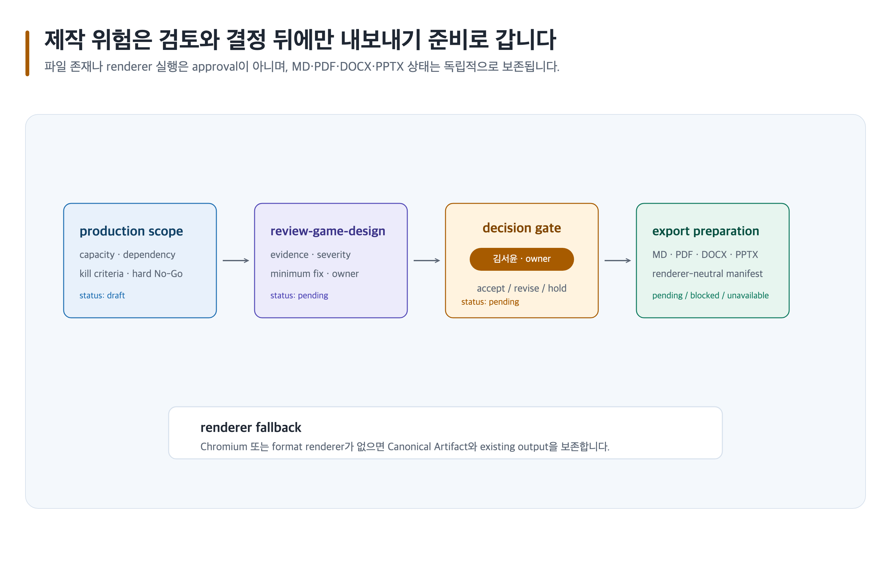

# 제작 위험을 검토하고 안전하게 내보내기 준비하기

> 본문에 쓰인 고정 한국 이름은 모두 **가상 예시 담당자**입니다. 실제 실행에서는 host user-decision receipt에 기록된 named human을 사용합니다.



## 완료 목표

제작 scope·risk·owner·kill criteria를 review finding과 export preflight에 연결해, 승인된 Canonical Artifact만 delivery 준비 상태로 만듭니다.

## 준비할 입력

- 목표 경험, capacity, dependency, milestone, risk, decision owner, 요청 format과 audience
- Canonical Artifact 경로 family: `game-design/<project-id>/production-scope-risk/` 및 `game-design/<project-id>/game-design-review/`
- 템플릿: `production-scope-risk`, `game-design-review`, 필요 시 `decision-change-log`

## 복사 가능한 요청문

Codex App 자연어 요청:

```text
@Game Design Studio 현재 feature set의 scope, capacity, dependency, milestone, hard No-Go와 kill criteria를 검토해. blocker를 owner와 최소 수정으로 남기고, 승인된 content.md만 MD·PDF·DOCX·PPTX 준비 manifest로 보내 줘.
```

Codex CLI 명시 호출:

```text
$game-design-studio:plan-game-production game-design/<project-id>/production-scope-risk/를 작성하고 $game-design-studio:review-game-design, $game-design-studio:plan-image-assets, $game-design-studio:visualize-game-design 뒤 $game-design-studio:export-game-design-documents로 renderer-neutral export manifest를 준비해.
```

## 단계별 진행

1. `plan-game-production`으로 scope, prototype, dependency, capacity, milestone, owner, kill criteria와 hard No-Go를 기록합니다.
2. `review-game-design`으로 traceable finding, severity, direct evidence, minimal fix와 decision owner를 만듭니다.
3. named human이 blocker의 수용·수정·예외 승인·보류를 결정하기 전에는 export를 성공으로 선언하지 않습니다.
4. `export-game-design-documents`가 `content.md` preflight, capability snapshot, safe output directory와 MD/PDF/DOCX/PPTX job manifest를 준비합니다. renderer와 terminal QA가 없으면 형식 상태는 `pending`, `blocked` 또는 `unavailable`로 남습니다.
5. production handoff 관계는 `visualize-game-design` SVG로, diagram 아닌 illustration은 `plan-image-assets`로 분리합니다. 이 delivery 사례는 `document-approved` asset만 필요하므로 새 생성은 `prompt-only`로 보류하고, 필요해지면 receipt와 finite manifest로 `select`를 재개합니다. `required`는 finite required asset만, `all`은 declared asset만 생성합니다. [이미지 자산 흐름](../image-assets.md)을 따릅니다.

## 사람이 결정할 지점

Production Owner **한지훈**이 scope와 kill criteria를, Review Decision Owner **김서윤**이 blocker disposition을, Export Owner **오지은**이 실제 renderer QA evidence를 승인합니다. 생성 파일 존재나 PNG render는 어느 승인도 대체하지 않습니다.

## 예상 결과

`production-scope-risk/content.md`, `game-design-review/content.md`, 그리고 승인된 두 Artifact의 `export-manifest.yml`에서 계산한 renderer-neutral export preparation 결과가 남습니다. SVG lint를 통과해도 Chromium renderer가 없으면 SVG source, fallback reason, PNG `unavailable`을 보존합니다.

### 예상 파일 트리

```text
game-design/<project-id>/
├── production-scope-risk/
│   ├── content.md
│   ├── evidence.yml
│   ├── decisions/README.md
│   ├── assets/README.md
│   └── export-manifest.yml
├── game-design-review/
│   ├── content.md
│   ├── evidence.yml
│   ├── decisions/README.md
│   ├── assets/README.md
│   └── export-manifest.yml
└── decision-change-log/
    └── content.md
```

`game-design/<project-id>/production-scope-risk/`와 `game-design/<project-id>/game-design-review/`의 `content.md`를 승인 전 delivery 파일로 바꾸지 않습니다. export preparation manifest는 별도 Canonical Artifact 파일명이 아니라, 승인된 두 Artifact의 `export-manifest.yml`을 읽어 만든 논리 결과입니다.

### 대표 내용 예시

`production-scope-risk`, `game-design-review`, `decision-change-log`는 scope 결정을 finding과 재개 조건에 연결합니다.

```md
SCOPE-04: 협동 탐험은 prototype, 꾸미기 상점은 defer, UGC는 exclude로 둔다.
F-12: evidence=PLAY-07, impact=출시 blocker, minimal-fix=offline recovery 검증.
DEC-08: renderer QA가 unavailable이면 MD와 SVG source만 delivery 후보로 보존한다.
```

### 완료 기준

한지훈이 scope와 kill criteria를, 김서윤이 blocker disposition을, 오지은이 실제 renderer QA evidence를 승인하거나 보류합니다. `content.md`, finding ID, decision log와 export manifest가 연결되고, format job의 존재·lint 성공만으로 사람 승인이나 delivery 완료를 대체하지 않습니다.

### 포트폴리오 또는 팀 전달 포인트

Canonical Artifact의 `content.md`, review finding, 결정과 미해결 위험을 읽는 순서로 전달합니다. 포트폴리오에는 공개 가능한 scope 판단과 검증 과정을 요약하고, NDA·권리 불명 asset·미승인 PDF/PPTX를 성과물처럼 포함하지 않습니다.

## 실패와 재개

unsafe output, preflight failure 또는 unavailable renderer는 canonical text와 기존 owner output을 변경하지 않습니다. Artifact path, finding ID, requested format을 지정해 실패한 gate부터 재개합니다. Chromium 또는 필요한 renderer/capability가 unavailable이면 PNG는 `unavailable` 상태로 남기고 Canonical Artifact와 기존 owner output을 보존합니다.

## 관련 기능

- [제작 스킬](../skills/plan-game-production.md), [검토 스킬](../skills/review-game-design.md), [내보내기](../exports.md)
- [공통 내보내기 흐름](../../assets/shared/document-export-flow.png), [이미지 자산](../image-assets.md)

<!-- PROMPT-TEMPLATES:START game-design-studio:recipe:production-review-export -->
<!-- PROMPT-CARD: studio:recipe:production-review-export -->
#### studio:recipe:production-review-export

**production-review-export recipe**

production-review-export recipe의 ordered CLI calls와 artifact read order를 보존한다.

##### 간단 요청 예시
```text
@Game Design Studio 현재 feature set의 scope, capacity, dependency, milestone, hard No-Go와 kill criteria를 검토해. blocker를 owner와 최소 수정으로 남기고, 승인된 content.md만 MD·PDF·DOCX·PPTX 준비 manifest로 보내 줘.
```

##### 짧은 흐름
- 작업 순서: plan-game-production → review-game-design → plan-image-assets → visualize-game-design → export-game-design-documents
- 함께 검토하는 역할: lead-game-designer

##### 이 요청으로 받는 결과
예: `game-design/[프로젝트 ID]/production-scope-risk/content.md`에 production-scope-risk canonical artifact, blocker와 resume receipt을 기록하고, 확인되지 않은 값은 `미정`으로 남깁니다.

<details>
<summary>고급 정보: 명령어·안전 경계·재개 기록</summary>

##### 사용하는 경우
canonical artifact의 안전한 다음 작업 순서가 필요할 때 사용한다.

##### 사용하지 않는 경우
evidence, rights, image, export 또는 approval gate를 건너뛸 때는 사용하지 않는다.

##### 준비 입력
###### 필수 입력
- 공개 가능한 canonical artifact

###### 선택 입력
- named human decision receipt

##### 바꿀 자리표시자
- [프로젝트 ID]

##### Codex App 완성 예시
위의 간단 요청 예시를 그대로 사용합니다.

##### Codex App 재사용 템플릿
```text
@Game Design Studio 현재 feature set의 scope, capacity, dependency, milestone, hard No-Go와 kill criteria를 검토해. blocker를 owner와 최소 수정으로 남기고, 승인된 content.md만 MD·PDF·DOCX·PPTX 준비 manifest로 보내 줘. [프로젝트 ID]의 fact, inference, recommendation과 미정 blocker를 보존해.
```

##### Codex CLI 완성 예시
```text
$game-design-studio:plan-game-production game-design/<project-id>/production-scope-risk/를 작성하고 $game-design-studio:review-game-design, $game-design-studio:plan-image-assets, $game-design-studio:visualize-game-design 뒤 $game-design-studio:export-game-design-documents로 renderer-neutral export manifest를 준비해.
```

##### Codex CLI 재사용 템플릿
```text
$game-design-studio:plan-game-production game-design/[프로젝트 ID]/production-scope-risk/를 작성하고 $game-design-studio:review-game-design, $game-design-studio:plan-image-assets, $game-design-studio:visualize-game-design 뒤 $game-design-studio:export-game-design-documents로 renderer-neutral export manifest를 준비해. fact, inference, recommendation을 보존해.
```

##### 스킬·전문 역할 흐름
- 기본 스킬: plan-game-production
- 스킬 흐름: plan-game-production → review-game-design → plan-image-assets → visualize-game-design → export-game-design-documents
- 전문 역할: lead-game-designer

##### 중간 산출물
- production-scope-risk
- game-design-review
- decision-change-log

##### 예상 결과물
###### 최소 결과물
- production-scope-risk canonical artifact
- blocker와 resume receipt

###### 선택 결과물
- 공개 가능한 evidence summary

###### 확장 결과물
- downstream handoff

##### 파일 구조
- game-design/[프로젝트 ID]/production-scope-risk/content.md
- game-design/[프로젝트 ID]/production-scope-risk/evidence.yml
- game-design/[프로젝트 ID]/production-scope-risk/decisions/README.md
- game-design/[프로젝트 ID]/production-scope-risk/assets/README.md
- game-design/[프로젝트 ID]/production-scope-risk/export-manifest.yml
- game-design/[프로젝트 ID]/game-design-review/content.md
- game-design/[프로젝트 ID]/game-design-review/evidence.yml
- game-design/[프로젝트 ID]/game-design-review/decisions/README.md
- game-design/[프로젝트 ID]/game-design-review/assets/README.md
- game-design/[프로젝트 ID]/game-design-review/export-manifest.yml
- game-design/[프로젝트 ID]/decision-change-log/content.md

##### 읽는 순서
- game-design/[프로젝트 ID]/production-scope-risk/content.md
- game-design/[프로젝트 ID]/production-scope-risk/evidence.yml
- game-design/[프로젝트 ID]/production-scope-risk/decisions/README.md
- game-design/[프로젝트 ID]/production-scope-risk/assets/README.md
- game-design/[프로젝트 ID]/production-scope-risk/export-manifest.yml
- game-design/[프로젝트 ID]/game-design-review/content.md
- game-design/[프로젝트 ID]/game-design-review/evidence.yml
- game-design/[프로젝트 ID]/game-design-review/decisions/README.md
- game-design/[프로젝트 ID]/game-design-review/assets/README.md
- game-design/[프로젝트 ID]/game-design-review/export-manifest.yml
- game-design/[프로젝트 ID]/decision-change-log/content.md

##### 도식 바인딩
- ID: st-s01
- SVG: guides/assets/game-design-studio/skills/apply-document-quality-profile.svg
- PNG: guides/assets/game-design-studio/skills/apply-document-quality-profile.png
- 대체 텍스트: Studio recipe flow

##### 사람 검토
###### 승인 경계
named human decision owner가 production-review-export의 approval 또는 보류를 결정한다.

###### 보류 조건
- canonical evidence, rights, image/export receipt, 또는 owner approval receipt가 없으면 보류

###### 안전 경계
모르는 정보는 미정으로 남긴다. Do not request credentials, personal data, or private materials.

##### 실패와 재개
```text
production-review-export의 보존 canonical artifact와 blocker를 읽고 공개 정보만으로 재개해.
```

</details>
<!-- PROMPT-TEMPLATES:END game-design-studio:recipe:production-review-export -->
