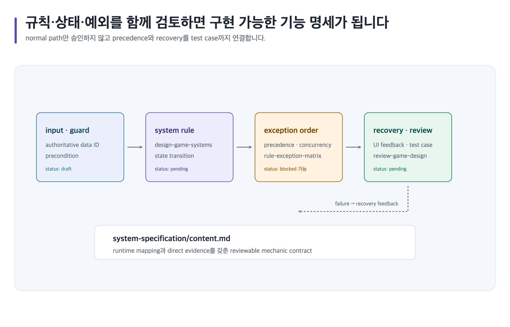

# 시스템 기능을 규칙·상태·예외 명세로 만들기



## 완료 목표

한 기능의 입력, 규칙, 상태 전이, 예외 우선순위, 실패 복구와 runtime mapping을 검토 가능한 명세로 연결합니다.

## 준비할 입력

- 기능 목표, authoritative data ID, precondition, 실패 기대와 플랫폼 제약
- Canonical Artifact 경로 family: `game-design/<project-id>/system-specification/`
- 템플릿: `system-specification`; 예외 충돌이 크면 `rule-exception-matrix`

## 복사 가능한 요청문

Codex App 자연어 요청:

```text
@Game Design Studio 제작 기능의 input, rule, state, exception precedence, failure/recovery와 table/runtime mapping을 명세해. 접근성 critical action도 누락하지 말고 design owner 검토 전에는 승인하지 마.
```

Codex CLI 명시 호출:

```text
$game-design-studio:design-game-systems game-design/<project-id>/system-specification/에서 rule과 state를 명세한 뒤 $game-design-studio:design-player-experience 및 $game-design-studio:review-game-design으로 검토해.
```

## 단계별 진행

1. quality profile을 적용하고 stable section ID와 data authority를 정합니다.
2. `design-game-systems`으로 normal path, guard, transition, precedence, exception과 test case를 `content.md`에 씁니다.
3. `design-player-experience`로 UI feedback, error, offline/interruption과 accessible alternative를 연결합니다.
4. `review-game-design`으로 implementation blocker와 최소 수정을 finding으로 남깁니다.
5. 구조 관계는 `visualize-game-design`으로 SVG로 작성하고 wrapper lint 뒤 Chromium으로 정확한 2× PNG를 만듭니다. 이 구조 도식에는 imagegen을 사용하지 않습니다.
6. 이미지 slot이 별도로 필요하면 `IMAGE_GEN_MODE=prompt-only`에서 계획만 하고, `select`/`required`/`all`은 이미지 manifest와 사람 선택·범위 조건을 각각 지킵니다.

## 사람이 결정할 지점

Systems Owner **박도현**이 rule precedence와 exception policy를 승인하고, Accessibility Reviewer **이민아**가 critical action의 대체 경로를 확인합니다.

## 예상 결과

`game-design/<project-id>/system-specification/content.md`와 testable state/exception record가 생깁니다. renderer가 없으면 source-mapped SVG, lint 결과와 `png: unavailable`을 남기고 PNG 승인으로 가장하지 않습니다.

## 실패와 재개

권위 데이터나 precedence가 없으면 `blocked`로 기록하고 구현 규칙을 추측하지 않습니다. 같은 Artifact의 `decisions/README.md`와 blocker ID를 요청문에 넣어 재개합니다.

## 관련 기능

- [시스템 스킬](../skills/design-game-systems.md), [플레이어 경험 스킬](../skills/design-player-experience.md), [시각화](../visualization.md)
- [이미지 mode 라우팅](../../assets/shared/image-generation-mode-routing.png)은 별도 image slot의 생성 경계를 보여 줍니다.
