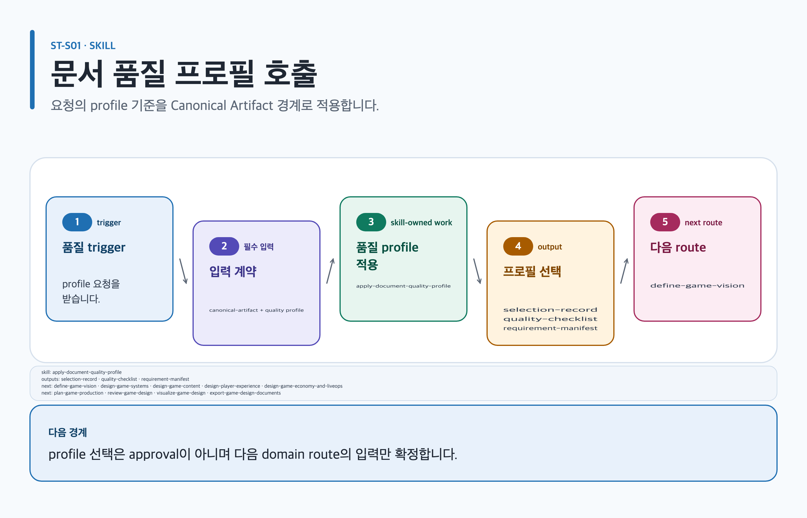

# apply-document-quality-profile

## 목적과 최종 산출물

Studio artifact마다 primary profile 하나를 결정하고 additive overlay와 neutral preset을 검증해 선택 기록, stable checklist, requirement manifest를 만듭니다.

## 사용할 때

- live-service RPG 시스템 명세의 profile을 고를 때
- GDD, review report, presentation, MD·PDF·DOCX·PPTX 준비 전에 구조 계약이 필요할 때

### 직접 호출 활용 — apply-document-quality-profile

[](../../assets/game-design-studio/skills/apply-document-quality-profile.svg)

#### 직접 호출 조건

한 Artifact의 템플릿·품질 profile 선택만 확정할 때 직접 호출합니다. 여러 도메인의 순서가 아직 섞였으면 `orchestrate-game-design-project`로 범위를 먼저 나눕니다.

#### 입문 요청문

```text
$game-design-studio:apply-document-quality-profile artifact=game-design/island/brief template=game-design-brief 대상과 플랫폼 가정을 기록하고 적용 가능한 품질 profile과 누락 입력만 선택해.
```

#### 응용 요청문

```text
$game-design-studio:apply-document-quality-profile artifact=game-design/island/system template=system-specification 기존 selection record를 보존하고 규칙·상태 검토에 필요한 checklist와 requirement manifest를 갱신해.
```

#### 고급 요청문

```text
$game-design-studio:apply-document-quality-profile artifact=game-design/island/review template=game-design-review profile=design-review-decision-log 근거 상태와 named decision owner를 유지해 profile 충돌과 blocked requirement를 분리해.
```

#### 예상 파일과 읽는 순서

`content.md → evidence.yml → export-manifest.yml` 순서로 canonical Artifact를 읽습니다. `selection-record`, `quality-checklist`, `requirement-manifest`은 trusted application이 반환하는 논리 결과이며 임의 artifact-local 파일명으로 가정하지 않습니다. profile 선택은 승인 자체가 아닙니다.

#### 다음 스킬 조건

비전 입력이 확정되었을 때만 `$game-design-studio:define-game-vision`으로, 규칙 범위일 때만 `$game-design-studio:design-game-systems`로, 여러 route가 함께 남았을 때만 `$game-design-studio:orchestrate-game-design-project`로 넘깁니다.

## 사용하지 않을 때

- 본문, 이미지, 도식이나 파생 파일 자체를 만들 때
- 두 비호환 deliverable에 primary profile 하나를 공유하려 할 때

## 필수 입력과 선택 입력

- 필수: goal, audience, artifact type, requested format, template ID, artifact ID
- 선택: 알려진 explicit profile override, `mobile`·`live-service`·`pc-console` overlay, neutral preset 하나
- 기존 문서: selection record와 checklist가 있으면 그대로 제공해 digest-bound 상태를 보존합니다.

## Codex App 요청 예시

**복사 가능한 요청문**

```text
@Game Design Studio live-service RPG의 스태미나 시스템 명세에 맞는 primary profile 하나를 선택하고 live-service overlay를 적용해. 선택 이유와 section/table/diagram/image/acceptance checklist를 먼저 보여 줘.
```

## Codex CLI 요청 예시

```text
$game-design-studio:apply-document-quality-profile goal=live-service RPG 스태미나 시스템 명세, audience=design·engineering·QA, artifactType=design-document, requestedFormat=md, templateId=system-specification, overlayIds=live-service
```

## 내부 진행 흐름

설치된 index와 template-profile map만 읽고 후보를 점수화합니다. primary 하나를 고른 뒤 알려진 additive source만 합성하고 stable ID checklist와 manifest를 만듭니다. 관련 역할은 `document-quality-editor`이며, 완료 뒤에는 `routing.json.routes`에서 caller가 고른 실제 domain skill로 돌아갑니다. 이 단계가 시스템 설계로 route를 바꾸지 않습니다.

| routing.json route 조건 | 다음 CLI handoff |
| --- | --- |
| `vision` | `$game-design-studio:define-game-vision` |
| `systems` | `$game-design-studio:design-game-systems` |
| `content` | `$game-design-studio:design-game-content` |
| `player-experience` | `$game-design-studio:design-player-experience` |
| `economy` 또는 `liveops` | `$game-design-studio:design-game-economy-and-liveops` |
| `production` | `$game-design-studio:plan-game-production` |
| `review` | `$game-design-studio:review-game-design` |
| `visualization` | `$game-design-studio:visualize-game-design` |
| `export` | `$game-design-studio:export-game-design-documents` |
| `reference-game-analysis` | `$game-design-studio:analyze-game-design-references` |
| `project-glossary-maintenance` | `$game-design-studio:maintain-game-design-glossary` |
| `cutscene-visual-preproduction` | `$game-design-studio:design-cutscene-visual-preproduction` |

## 생성 파일과 결과 구조

선택 기록, composed requirements, checklist, requirement manifest, immutable state envelope을 반환합니다. 이 단계는 artifact 내용, SVG·PNG, 생성 이미지, PDF·DOCX·PPTX를 만들지 않습니다. 예상 결과 요약: live-service 시스템 명세에 적용할 구조와 검증 항목이 결정됩니다.

## 관련 템플릿·품질 프로필·전문 역할

- Template ID: `caller-selected template` — [템플릿 카탈로그](../templates.md).
- Quality Profile ID: `caller-selected template의 template-profile-map 결과`.
- Reviewer/role ID: `document-quality-editor`.

이 조합은 [문서 품질 프로필](../document-quality.md)의 선택 기록과 함께 유지하며, profile을 새로 고르지 않는 경우는 위처럼 현재 artifact 상속 사유를 명시합니다.

## 이미지·도식화 조건

이미지·도식 슬롯은 caller-selected template의 requirement manifest가 정합니다. slot이 없으면 생성하지 않으며 구조 도식은 Skillstead compatible slot일 때만 계획합니다.

[이미지 자산 흐름](../image-assets.md)과 [도식화 안내](../visualization.md)의 승인·검증 경계를 따릅니다.

## 검토·승인 기준

근거와 가정을 분리하고 unknown override는 nearest profile 차이와 explicit fallback을 기록합니다. 상태는 `draft → structurally-complete → evidence-reviewed → visual-reviewed → document-approved` 순서이며 external inspection, evidence, renderer/rights/gate, 이름 있는 사람 receipt 없이는 전진하지 않습니다.

## 실패·fallback·재개 방법

unknown ID, schema 오류, scalar conflict, raw object, symlink·path escape는 fail-closed입니다. 기존 artifact와 기록을 보존합니다.

```text
$game-design-studio:apply-document-quality-profile 이전 selection record와 오류를 유지하고, unknown override를 제거한 뒤 설치된 호환 profile만으로 같은 artifactId에서 재개해.
```

## 다음 작업 요청문

> `<artifact-path>`, `<export-manifest-path>`, `<selected-skill>`은 실제 경로·ID로 바꿔야 하는 자리표시자입니다. [공통 규칙](../../README.md#용어)을 따릅니다.

**복사 가능한 조건부 다음 handoff**

`<selected-skill>`은 routing record의 실제 skill ID로 바꿉니다. profile 적용 뒤에는 선택된 route 하나만 호출하며, 아래 시스템·콘텐츠 예시는 전체 route 목록을 대신하지 않습니다.

@Game Design Studio systems route면 design-game-systems로, content route면 design-game-content로 현재 Artifact의 검증된 기록을 이어 진행해.

```text
$game-design-studio:design-game-systems artifact=artifacts/stamina-system systems route일 때만 기존 evidence/decision을 보존하고 진행해.
```

```text
$game-design-studio:design-game-content artifact=artifacts/quest-brief content route일 때만 기존 evidence/decision을 보존하고 진행해.
```

```text
$game-design-studio:<selected-skill> artifact=artifacts/<artifact-id> routing.json.routes에서 선택한 skill ID로 바꿔 한 route만 실행해.
```

## 관련 문서

[템플릿 카탈로그](../templates.md), [스킬 선택표](README.md), [문서 placeholder 규칙](../../README.md#용어), [제품 workflow](../workflow.md)

<!-- PROMPT-TEMPLATES:START game-design-studio:apply-document-quality-profile -->
### 재사용 프롬프트 템플릿

- [beginner: 문서 목적과 대상에 맞는 품질 프로필 선택](../../prompt-templates/studio/apply-document-quality-profile.md#studioapply-document-quality-profilebeginner)
- [standard: Overlay와 preset manifest를 갖춘 품질 프로필 선택](../../prompt-templates/studio/apply-document-quality-profile.md#studioapply-document-quality-profilestandard)
- [advanced: Fallback과 state receipt를 가진 품질 프로필 검토](../../prompt-templates/studio/apply-document-quality-profile.md#studioapply-document-quality-profileadvanced)
<!-- PROMPT-TEMPLATES:END game-design-studio:apply-document-quality-profile -->
