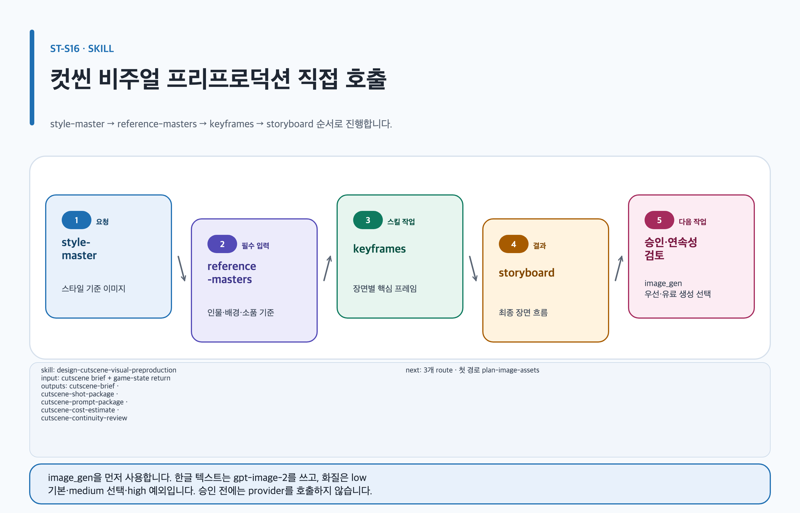

# design-cutscene-visual-preproduction

## 목적과 최종 산출물

컷씬의 brief, beat, shot list, continuity bible, 마스터 프롬프트와 승인 경계를 재개할 수 있는 하나의 패키지로 정리합니다. 최종 산출물은 `cutscene-brief`, `cutscene-shot-package`, `cutscene-prompt-package`, `cutscene-cost-estimate`, `cutscene-continuity-review`입니다.

## 사용할 때

- 컷씬의 감정 변화와 조작 반환 지점을 shot 단위로 고정할 때
- 이미지 생성 전에 연속성, 수량, 비용과 승인 범위를 명확히 할 때

### 직접 호출 활용 — design-cutscene-visual-preproduction

[](../../assets/game-design-studio/skills/design-cutscene-visual-preproduction.svg)

컷씬 범위와 wave별 검토 경계가 한 작업으로 분명할 때 직접 호출합니다. 시스템·콘텐츠·제작 범위가 함께 불명확하면 `orchestrate-game-design-project`에서 route를 먼저 고릅니다.

## 사용하지 않을 때

- 실시간 provider 호출이나 이름 없는 포괄 승인으로 이미지를 만들 때는 사용하지 않습니다.
- 대사만 바뀌는 variant에는 새 이미지를 계획하지 않고 overlay를 사용합니다.

## 필수 입력과 선택 입력

- 필수: 컷씬 목적, player state, beat, shot, 등장 인물·배경·소품 continuity 조건, rights 상태, model·quality·size, finite USD cap, decision owner
- 선택: 참고 이미지, 음성 길이, 자막 언어, camera·lighting 참고, 기존 receipt
- 모르는 값은 미정으로 남기며 reference hash나 승인 receipt를 추정하지 않습니다.

## Codex App 요청 예시

**복사 가능한 요청문**

```text
@Game Design Studio 컷씬의 beat와 shot list, continuity bible, 마스터 프롬프트와 비용·승인 계획만 작성해. 이미지는 생성하지 마.
```

## Codex CLI 요청 예시

```text
$game-design-studio:design-cutscene-visual-preproduction artifact=game-design/island/opening-cutscene mode=prompt-only 컷씬 brief, shot, continuity, 마스터 프롬프트와 approval plan만 작성하고 provider는 호출하지 마.
```

## 내부 진행 흐름

| 조건 | 다음 작업 | CLI target | 보존할 근거 |
| --- | --- | --- | --- |
| `style-master`의 current estimate와 이름 있는 실시간 승인이 있을 때 | style master dispatch | `$game-design-studio:generate-image-assets` | estimate, approval |
| style master가 완료되어 reference binding이 갱신됐을 때 | `reference-masters` 비용·승인 초안 | `$game-design-studio:design-cutscene-visual-preproduction` | current binding, pricing snapshot |
| `reference-masters`의 current estimate·이름 있는 승인과 style master 완료가 있을 때 | reference master dispatch | `$game-design-studio:generate-image-assets` | predecessor receipt, estimate, approval |
| `keyframes`의 current estimate·이름 있는 승인과 모든 선행 wave 완료가 있을 때 | keyframe dispatch | `$game-design-studio:generate-image-assets` | predecessor receipt, estimate, approval |
| `storyboard`의 current estimate·이름 있는 승인과 모든 선행 wave 완료가 있을 때 | storyboard dispatch | `$game-design-studio:generate-image-assets` | predecessor receipt, estimate, approval |
| immutable manifest가 준비됐을 때 | 이미지 manifest handoff | `$game-design-studio:plan-image-assets` | `validateCutsceneManifestHandoff` 결과 |
| continuity finding이 있을 때 | 생성 결과 검토 | `$game-design-studio:review-image-assets` | lineage, review finding |

계획·견적 초안은 다음 wave까지 만들 수 있습니다. 유료 dispatch에는 현재 wave의 current estimate와 이름 있는 실시간 승인이 필요합니다. `style-master`에는 선행 조건이 없습니다. 뒤의 wave에는 모든 선행 wave 완료가 필요합니다. provider가 실제 호출 뒤 실패하면 성공 bytes·receipt와 retryable/terminal outcome을 보존하고 추가 호출 없이 멈춥니다.

## 생성 파일과 결과 구조

`content.md`, `evidence.yml`, `export-manifest.yml`, `assets/image-assets.yml`, `assets/prompts/image-prompts.md`, `assets/prompts/image-prompts.json`, receipt와 continuity review를 artifact 아래에 둡니다. 예상 결과는 각 wave의 stable ID, 수량, costStatus와 사람 검토 경계가 추적되는 컷씬 패키지입니다.

## 관련 템플릿·품질 프로필·전문 역할

- Template ID: `cutscene-visual-preproduction`: [템플릿 카탈로그](../templates.md)
- Quality Profile ID: `cutscene-visual-preproduction`
- Reviewer/role ID: `content-narrative-designer`, `art-brief-director`, `lead-game-designer`

## 이미지·도식화 조건

Prompt Only와 Estimate Only의 provider 호출은 0회입니다. Generate After Approval은 정확한 현재 wave의 count, model, quality, size, USD min/expected/max, finite cap, retryReserve, pricing time, costStatus를 포함한 이름 있는 실시간 승인 뒤에만 가능합니다. `unavailable` costStatus 또는 finite cap 부재는 provider 0회 중단입니다. [이미지 자산 가이드](../image-assets.md)의 권리·receipt 경계도 함께 적용합니다.

## 검토·승인 기준

각 wave는 `style-master → reference-masters → keyframes → storyboard` 순서입니다. `style-master`는 current estimate와 이름 있는 실시간 승인 뒤에 dispatch하고, 뒤의 wave는 같은 조건에 더해 선행 wave 완료가 필요합니다. 승인에는 승인자 이름·시각·wave·estimate snapshot이 묶여야 하며, 이전 wave의 승인이나 포괄 승인은 재사용하지 않습니다. continuity gate가 lineage, 인물·배경·소품, beat와 조작 반환을 확인한 뒤에만 사람이 `document-approved` 또는 제작 후보를 결정합니다.

## 실패·fallback·재개 방법

승인·가격·선행 조건이 불일치하면 provider 호출 0회로 멈춥니다. provider 실패 뒤에는 최신 retryable stable ID만 같은 현재 full-wave estimate·pricing snapshot·request schedule에서 재시도하며, subset estimate나 새 epoch를 만들지 않습니다. terminal failure와 성공 asset은 덮어쓰지 않습니다.

```text
$game-design-studio:design-cutscene-visual-preproduction 기존 receipt와 stable ID를 보존하고 최신 retryable 실패 ID만 같은 current full-wave estimate와 named live approval으로 재개해.
```

## 다음 작업 요청문

> `<artifact-path>` 자리표시자는 실제 artifact 경로로 바꿉니다. [공통 규칙](../../README.md#용어)을 따릅니다.

**복사 가능한 조건부 다음 handoff**

- 조건: immutable cutscene manifest가 `validateCutsceneManifestHandoff`를 통과했을 때.

```text
$game-design-studio:plan-image-assets artifact=<artifact-path> 승인된 cutscene manifest의 stable ID와 prompt package를 보존해 image handoff만 준비해.
```

- 조건: current wave가 이름 있는 승인과 함께 dispatch된 뒤 continuity finding이 있을 때.

```text
$game-design-studio:review-image-assets artifact=<artifact-path> 컷씬 lineage와 continuity finding을 검토하고 사람 승인 전에는 상태를 승격하지 마.
```

## 관련 문서

[컷씬 비주얼 프리프로덕션 How-to](../cutscene-visual-preproduction.md), [이미지 자산](../image-assets.md), [문서 품질](../document-quality.md), [스킬 선택표](README.md), [제품 workflow](../workflow.md)

<!-- PROMPT-TEMPLATES:START game-design-studio:design-cutscene-visual-preproduction -->
### 재사용 프롬프트 템플릿

- [beginner: 컷씬 개요와 장면 박자를 생성 없이 정리](../../prompt-templates/studio/design-cutscene-visual-preproduction.md#studiodesign-cutscene-visual-preproductionbeginner)
- [standard: 장면 목록과 연속성 기준을 갖춘 프롬프트 패키지](../../prompt-templates/studio/design-cutscene-visual-preproduction.md#studiodesign-cutscene-visual-preproductionstandard)
- [advanced: 4단계 비용·실시간 승인·연속성 관문 계획](../../prompt-templates/studio/design-cutscene-visual-preproduction.md#studiodesign-cutscene-visual-preproductionadvanced)
<!-- PROMPT-TEMPLATES:END game-design-studio:design-cutscene-visual-preproduction -->
