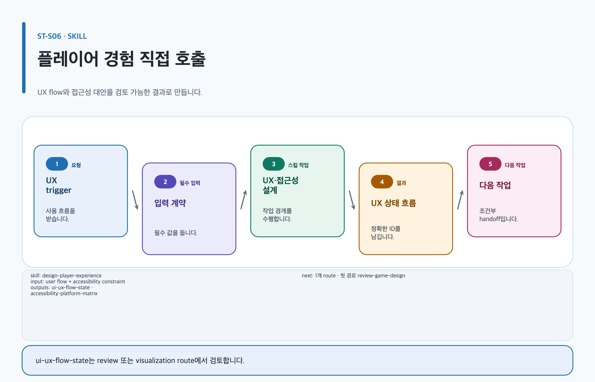

# design-player-experience

## 목적과 최종 산출물

첫 세션 onboarding, UI state, input, performance, cross-platform과 accessibility를 `ui-ux-flow-state` 계약으로 만듭니다.

## 사용할 때

- 첫 5분과 first success, tutorial skip/revisit를 설계할 때
- critical action별 UI state와 접근 가능한 대체 경로를 검토할 때

### 직접 호출 활용 — design-player-experience

[](../../assets/game-design-studio/skills/design-player-experience.svg)

#### 직접 호출 조건

`ST-C04`처럼 first session, UI state, tutorial recovery 또는 accessibility alternative를 한 흐름으로 다룰 때 직접 호출합니다. authoritative rule이 비어 있으면 systems에서 먼저 확인합니다.

#### 입문 요청문

```text
$game-design-studio:design-player-experience artifact=game-design/island/first-session 첫 critical action, feedback, 오류와 recovery를 ui-ux-flow-state로 정리해.
```

#### 응용 요청문

```text
$game-design-studio:design-player-experience artifact=game-design/island/first-session ST-C04의 tutorial skip/revisit, input alternative와 sensory cue를 accessibility-platform-matrix에 연결해.
```

#### 고급 요청문

```text
$game-design-studio:design-player-experience artifact=game-design/island/first-session 기존 관찰 evidence를 보존하고 UI feedback이 authoritative game state를 발명하는 지점을 finding으로 분리해.
```

#### 예상 결과와 파일 읽는 순서

`content.md → evidence.yml → export-manifest.yml` 순서로 읽고 `ui-ux-flow-state`, `accessibility-platform-matrix`는 별도 YAML 파일이 아니라 `content.md`의 안정 섹션과 stable ID로 검토합니다. `decisions/`은 실제 결정 기록이 있을 때만 그 뒤에 읽습니다.

#### 다음 스킬 조건

critical action, error recovery 또는 접근성 대안의 근거가 부족할 때만 `$game-design-studio:review-game-design`으로 넘깁니다.

## 사용하지 않을 때

- authoritative rule은 `design-game-systems`, 경제·가격·확률은 `design-game-economy-and-liveops`를 사용합니다.
- milestone과 staffing은 `plan-game-production`을 사용합니다.

## 필수 입력과 선택 입력

- 필수: target experience, critical actions, players, platforms, devices, input, UI surfaces, owner
- 선택: performance measurements, current accessibility evidence, test participants, 기존 flow, review questions
- 검증되지 않은 threshold는 provisional입니다.

## Codex App 요청 예시

**복사 가능한 요청문**

```text
@Game Design Studio 모바일 협동 RPG 첫 세션 onboarding을 설계해. 첫 5분, first success, tutorial skip/revisit, 모든 UI state와 critical action의 접근 가능한 대체 경로를 포함해.
```

## Codex CLI 요청 예시

```text
$game-design-studio:design-player-experience 첫 세션 onboarding과 UI state를 ui-ux-flow-state로 작성하고 입력·접근성·오류 복구를 검토해.
```

## 내부 진행 흐름

정보 우선순위와 각 critical action의 상태를 추적하고 첫 성공, 실패 feedback, recovery, device 차이와 accessibility evidence를 연결합니다. 주 템플릿/profile은 `ui-ux-flow-state`/`ui-ux-flow-state-specification`, 관련 역할은 `ux-accessibility-reviewer`와 `lead-game-designer`, 다음 스킬은 `review-game-design`입니다.

## 생성 파일과 결과 구조

interaction/UI states, onboarding, input, performance, cross-platform, accessibility, assumptions와 gates를 Canonical Artifact에 기록합니다. 예상 결과 요약: QA 가능한 첫 세션과 접근성 경로가 명확해집니다.

## 관련 템플릿·품질 프로필·전문 역할

- Template ID: `ui-ux-flow-state` — [ui-ux-flow-state 템플릿](../templates.md#ui-ux-flow-state).
- Quality Profile ID: `ui-ux-flow-state-specification`.
- Reviewer/role ID: `ux-accessibility-reviewer · lead-game-designer`.

이 조합은 [문서 품질 프로필](../document-quality.md)의 선택 기록과 함께 유지하며, profile을 새로 고르지 않는 경우는 위처럼 현재 artifact 상속 사유를 명시합니다.

## 이미지·도식화 조건

`ui-key-screen-image`은 화면 맥락을 검토할 필요가 있을 때만 illustration lifecycle로 계획합니다. critical action의 state/focus 관계는 `skillstead-ui-flow-state-diagram`으로 설명 가치가 있을 때만 Skillstead를 사용합니다.

[이미지 자산 흐름](../image-assets.md)과 [도식화 안내](../visualization.md)의 승인·검증 경계를 따릅니다.

## 검토·승인 기준

critical action의 state, cue, input, recovery 또는 sensory alternative가 빠지면 `inaccessible-critical-action` blocker입니다. current 요구사항에 최신 1차 근거가 없으면 release를 승인하지 않습니다.

## 실패했을 때와 재개 방법

플랫폼 근거나 test participant 정보가 없으면 해당 target을 승인하지 않고 validation task를 보존합니다.

```text
$game-design-studio:design-player-experience 기존 ui-ux-flow-state를 유지하고, 새 플랫폼 접근성 근거와 controller 테스트 결과를 연결해 blocked critical action만 재개해.
```

## 다음 작업 요청문

> `<artifact-path>`, `<export-manifest-path>`, `<selected-skill>`은 실제 경로·ID로 바꿔야 하는 자리표시자입니다. [공통 규칙](../../README.md#용어)을 따릅니다.

**복사 가능한 다음 handoff**

@Game Design Studio review-game-design로 현재 Artifact의 검증된 기록을 이어 critical action과 accessibility blocker를 검토해.

```text
$game-design-studio:review-game-design artifact=<artifact-path> 기존 evidence/decision을 보존하고 다음 handoff를 실행해.
```

## 관련 문서

[ui-ux-flow-state 템플릿](../templates.md#ui-ux-flow-state), [review-game-design 스킬](./review-game-design.md), [스킬 선택표](README.md), [제품 workflow](../workflow.md)

<!-- PROMPT-TEMPLATES:START game-design-studio:design-player-experience -->
### 재사용 프롬프트 템플릿

- [beginner: 행동과 피드백이 있는 첫 세션 UX](../../prompt-templates/studio/design-player-experience.md#studiodesign-player-experiencebeginner)
- [standard: Onboarding과 접근성을 검토하는 플레이어 경험](../../prompt-templates/studio/design-player-experience.md#studiodesign-player-experiencestandard)
- [advanced: 멀티모달 UX와 책임 gate를 갖춘 플레이어 경험](../../prompt-templates/studio/design-player-experience.md#studiodesign-player-experienceadvanced)
<!-- PROMPT-TEMPLATES:END game-design-studio:design-player-experience -->
