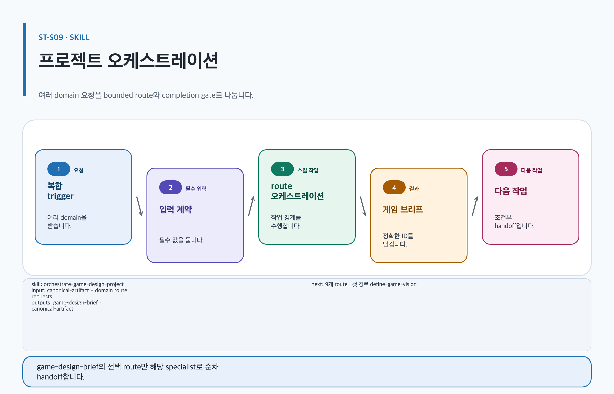

# game-design-studio

## 목적과 최종 산출물

요청을 owner 하나, route 하나, 영수증 하나로 바꿉니다. 최종 산출물은 라우팅 영수증과 위임된 스킬의 산출물입니다. 이 스킬 자체는 설계 문서를 만들지 않습니다.

## 사용할 때

- 요청이 넓거나 섞여 있거나 모호해서 어떤 스킬이 소유자인지 분명하지 않을 때
- `ST-G04`처럼 사례 ID만 있고 실행할 스킬 이름이 없을 때
- 두 제품의 근거가 모두 필요해 소유 제품을 먼저 정해야 할 때

### 직접 호출 활용 — game-design-studio

[](../../assets/game-design-studio/skills/orchestrate-game-design-project.svg)

#### 직접 호출 조건

무엇을 불러야 할지 모르는 상태에서 시작할 때 직접 호출합니다. 결과가 하나로 분명한 요청은 그 결과를 소유한 전문 스킬을 바로 호출합니다.

#### 입문 요청문

```text
$game-design-studio:game-design-studio 협동 탐험 게임을 어디서부터 시작할지 모르겠어. 요청을 정규화하고 route 하나를 골라 라우팅 영수증으로 남겨.
```

#### 응용 요청문

```text
$game-design-studio:game-design-studio 전투·경제·콘텐츠가 섞인 요청을 소유 제품 하나와 route 하나로 좁히고 나머지는 후속 결정으로 라우팅 영수증에 적어.
```

#### 고급 요청문

```text
$game-design-studio:game-design-studio ST-G04를 실행 경로로 바꾸고 커리어 근거가 필요한 부분은 공급자 요청으로 나눠 라우팅 영수증에 적어.
```

#### 예상 파일과 읽는 순서

이 스킬은 자기 파일을 만들지 않습니다. 위임된 스킬이 만든 Canonical Artifact를 `content.md → evidence.yml → export-manifest.yml` 순서로 읽고, workspace에 `route-receipt.json`이 있으면 그 안의 `routeId`만 채웁니다.

#### 다음 스킬 조건

선택된 route가 다분야 조정을 요구할 때만 `$game-design-studio:orchestrate-game-design-project`로 넘기고, 그 밖에는 선택된 route가 지목한 `$game-design-studio:<selected-skill>`을 직접 호출합니다.

## 사용하지 않을 때

- 결과가 하나로 분명한 요청은 그 결과를 소유한 전문 스킬을 직접 사용합니다.
- 이미 범위가 정해진 다분야 조정은 `orchestrate-game-design-project`를 사용합니다.
- 커리어 영역 요청은 [Career 제품 가이드](../../game-design-career/README.md)의 대표 진입 스킬을 사용합니다.

## 필수 입력과 선택 입력

- 필수: 원하는 최종 결과, 이미 가진 자료, 공개 범위, 사람 결정 담당자, 출력 형식
- 선택: 사례 ID, 기존 Artifact 경로, 대상 플랫폼, 마감 조건
- 사용자가 주지 않은 값은 만들지 않고 `미정`으로 남기며, 라우팅 전 질문은 한 번만 합니다.

## Codex App 요청 예시

**복사 가능한 요청문**

```text
@Game Design Studio 게임 기획을 시작하고 싶은데 어떤 스킬을 불러야 할지 모르겠어. 요청을 다섯 항목으로 정리하고 담당 스킬 하나를 골라 라우팅 영수증을 남겨 줘. 모르는 정보는 미정으로 남겨 줘.
```

## Codex CLI 요청 예시

```text
$game-design-studio:game-design-studio 전투와 경제가 섞인 요청의 소유 제품과 실행 경로를 하나로 정하고 라우팅 영수증을 남겨.
```

## 내부 진행 흐름

요청 정규화 다섯 항목을 기록하고, route를 고르고, 사례 ID를 실행 경로로 바꾼 뒤 라우팅 영수증을 공개합니다. route 후보는 [스킬 선택표](README.md)에 실린 설치 스킬로 제한하며, 그 목록에 없는 스킬은 설치되지 않은 것으로 취급합니다.

## 생성 파일과 결과 구조

이 스킬이 만드는 파일은 없습니다. workspace에 `route-receipt.json`이 있으면 `schemaVersion`, `requestSha256`, `bindingNonce`를 그대로 두고 `routeId`만 채웁니다. 예상 결과 요약: 소유 제품, 선택된 스킬 ID, 인계 필요 여부, 생성될 Artifact 경로, 다음 사람 결정이 한 화면에 남습니다.

## 관련 템플릿·품질 프로필·전문 역할

- Template ID: 이 스킬은 템플릿을 직접 채우지 않고 위임된 스킬의 템플릿을 그대로 따릅니다 — [템플릿 목록](../templates.md).
- Quality Profile ID: 위임된 스킬이 선택한 profile을 그대로 유지합니다.
- Reviewer/role ID: `lead-game-designer`.

## 이미지·도식화 조건

이 스킬은 이미지를 만들지 않습니다. 이미지가 필요하면 계획과 생성을 소유한 스킬로 라우팅하고 [이미지 자산 흐름](../image-assets.md)의 승인 경계를 그대로 적용합니다.

## 검토·승인 기준

라우팅은 승인이 아니며 위임된 스킬의 승인 규칙이 그대로 적용됩니다. 이미지 생성, 용어 승인, 기억 승인, 문서 공개는 라우팅 이후에도 사람 앞에서 멈춥니다.

## 실패·fallback·재개 방법

사례 ID를 찾지 못하면 이웃 사례를 추측하지 않고, 한 번만 되묻거나 일반 자연어 라우팅으로 되돌아간 뒤 어느 쪽을 택했는지 밝힙니다. 상대 제품 조회 결과는 설치·활성, 미설치나 비활성, 확인 불가 셋으로 구분해 적습니다. 뒤의 둘은 같은 degrade를 타지만 사용자에게는 서로 다른 사실이므로, 무엇이 확인됐고 무엇을 확인하지 못했는지 밝히고 이 제품만으로 가능한 범위를 보고합니다.

```text
$game-design-studio:game-design-studio 기존 라우팅 영수증의 정규화 항목과 선택된 route를 보존하고 새로 확인된 입력만 반영해 다시 정리해.
```

## 다음 작업 요청문

> `<artifact-path>`, `<selected-skill>`은 실제 경로·ID로 바꿔야 하는 자리표시자입니다. [공통 규칙](../../README.md#용어)을 따릅니다.

**복사 가능한 다음 handoff**

@Game Design Studio 라우팅 영수증이 지목한 스킬로 이어서 작업을 진행해.

```text
$game-design-studio:orchestrate-game-design-project artifact=<artifact-path> 라우팅 영수증의 정규화 항목과 선택된 route를 보존하고 다음 handoff를 실행해.
```

## 관련 문서

[설치 안내](../installation.md), [orchestrate-game-design-project 스킬](./orchestrate-game-design-project.md), [Career 제품 가이드](../../game-design-career/README.md), [스킬 선택표](README.md), [제품 workflow](../workflow.md)

<!-- PROMPT-TEMPLATES:START game-design-studio:game-design-studio -->
### 재사용 프롬프트 템플릿

- [beginner: 어떤 스킬을 부를지 모르는 요청을 route 하나로](../../prompt-templates/studio/game-design-studio.md#studiogame-design-studiobeginner)
- [standard: 여러 도메인이 섞인 요청을 owner 하나로](../../prompt-templates/studio/game-design-studio.md#studiogame-design-studiostandard)
- [advanced: 사례 ID와 교차 제품 인계를 정리하는 진입](../../prompt-templates/studio/game-design-studio.md#studiogame-design-studioadvanced)
<!-- PROMPT-TEMPLATES:END game-design-studio:game-design-studio -->
