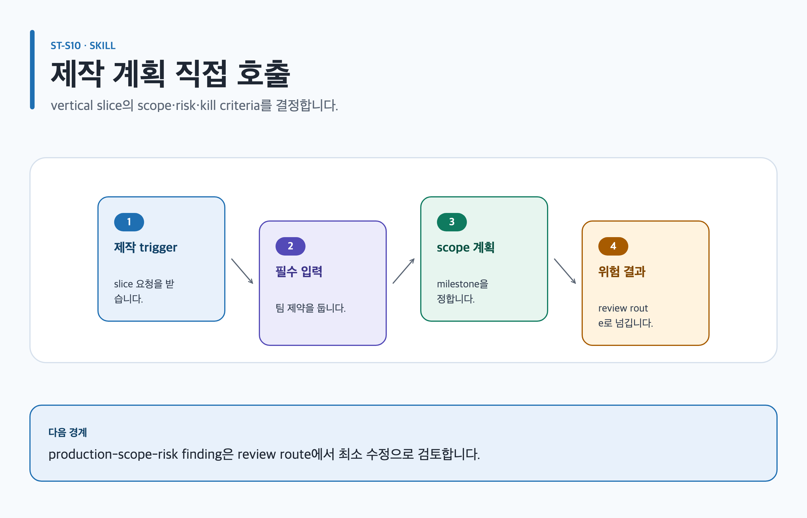

# plan-game-production

## 목적과 최종 산출물

vertical slice의 범위, owner, gate와 kill criteria를 근거에 묶은 `production-scope-risk` 계획으로 만듭니다.

## 사용할 때

- prototype, milestone, effort range, dependency와 scope 우선순위를 정할 때
- commit, defer, reduce, outsource, license 또는 kill 결정을 준비할 때

### 직접 호출 활용 — plan-game-production

[](../../assets/game-design-studio/skills/plan-game-production.svg)

#### 직접 호출 조건

`ST-C08`처럼 이미 정의된 경험을 milestone·risk·kill criteria로 좁힐 때 직접 호출합니다. 아직 core loop가 없으면 먼저 vision 또는 systems를 정합니다.

#### 입문 요청문

```text
$game-design-studio:plan-game-production artifact=game-design/island/production 핵심 경험, 팀 제약, prototype 범위와 decision owner로 최소 제작 계획을 작성해.
```

#### 응용 요청문

```text
$game-design-studio:plan-game-production artifact=game-design/island/production ST-C08의 scope, dependency, milestone, risk와 rollback 질문을 production-scope-risk에 연결해.
```

#### 고급 요청문

```text
$game-design-studio:plan-game-production artifact=game-design/island/production 기존 결정 로그를 보존하고 변경 요청의 core-loop 기여, owner, done, kill criteria를 비교해.
```

#### 예상 파일과 읽는 순서

`content.md → evidence.yml → export-manifest.yml` 순서로 읽고 `production-scope-risk`는 별도 YAML 파일이 아니라 `content.md`의 안정 섹션으로 검토합니다. 사람의 `decisions/` 기록이 존재할 때만 그 뒤에 읽습니다.

#### 다음 스킬 조건

scope·risk 또는 done 정의에 finding이 남을 때만 `$game-design-studio:review-game-design`으로 넘기며, 일정 성공을 자동으로 단정하지 않습니다.

## 사용하지 않을 때

- target experience가 없으면 `define-game-vision`을 먼저 사용합니다.
- mechanic 규칙이나 economy balance 자체를 설계하지 않습니다.

## 필수 입력과 선택 입력

- 필수: target experience, core loop, approved scope, team capacity, throughput, constraints, dependency, owner
- 선택: maintenance horizon, license/outsource terms, prototype evidence, 기존 production plan, review questions
- 인원·일정·비용·성능 수치는 source, range basis와 validation gate가 없으면 provisional입니다.

## Codex App 요청 예시

**복사 가능한 요청문**

```text
@Game Design Studio 4인 협동 RPG vertical slice의 Must/Should 범위, owner, dependency, milestone gate, definition of done과 kill criteria를 계획해. capacity 근거가 없는 일정은 provisional로 남겨 줘.
```

## Codex CLI 요청 예시

```text
$game-design-studio:plan-game-production vertical slice 범위와 prototype hypothesis, owner, gate, DoD, kill criteria를 production-scope-risk로 작성해.
```

## 내부 진행 흐름

각 scope를 core-loop 기여와 target-experience evidence에 연결하고 observable unit과 측정된 rate로 effort range를 만듭니다. 주 템플릿/profile은 `production-scope-risk`/`production-scope-milestone-risk-plan`, 관련 역할은 `production-feasibility-critic`과 `lead-game-designer`, 다음 스킬은 `review-game-design`입니다.

## 생성 파일과 결과 구조

scope, dependency, maintenance, license/outsource risk, prototype, milestone, DoD, kill criterion과 decision owner를 Canonical Artifact에 기록합니다. 예상 결과 요약: 큰 약속 전에 검증할 가장 싼 vertical slice와 중단 조건이 명확해집니다.

## 관련 템플릿·품질 프로필·전문 역할

- Template ID: `production-scope-risk` — [production-scope-risk 템플릿](../templates.md#production-scope-risk).
- Quality Profile ID: `production-scope-milestone-risk-plan`.
- Reviewer/role ID: `production-feasibility-critic · lead-game-designer`.

이 조합은 [문서 품질 프로필](../document-quality.md)의 선택 기록과 함께 유지하며, profile을 새로 고르지 않는 경우는 위처럼 현재 artifact 상속 사유를 명시합니다.

## 이미지·도식화 조건

`scope-reference-image`은 production-scope-milestone-risk-plan profile에서 agreed slice를 확인할 때만 계획합니다. dependency·milestone·risk 관계가 복잡할 때 `skillstead-production-roadmap-dependency-diagram`을 만들고, 별도 asset slot은 계획 manifest에 있을 때만 illustration lifecycle로 넘깁니다.

[이미지 자산 흐름](../image-assets.md)과 [도식화 안내](../visualization.md)의 승인·검증 경계를 따릅니다.

## 검토·승인 기준

target experience, prototype evidence, capacity 근거 또는 owner가 없으면 큰 commitment를 승인하지 않습니다. 자동화는 procurement, staffing, outsourcing과 irreversible scope expansion을 승인하지 않습니다.

## 실패·fallback·재개 방법

근거 부족 항목은 `missing-target-experience`, `missing-prototype-evidence`, `unsupported-large-estimate`로 보존합니다.

```text
$game-design-studio:plan-game-production 기존 production-scope-risk를 유지하고, 새 prototype 결과와 최근 throughput 근거를 연결해 Must 범위와 kill criteria만 재평가해.
```

## 다음 작업 요청문

> `<artifact-path>`, `<export-manifest-path>`, `<selected-skill>`은 실제 경로·ID로 바꿔야 하는 자리표시자입니다. [공통 규칙](../../README.md#용어)을 따릅니다.

**복사 가능한 다음 handoff**

@Game Design Studio review-game-design로 현재 Artifact의 검증된 기록을 이어 다음 작업을 진행해.

```text
$game-design-studio:review-game-design artifact=<artifact-path> 기존 evidence/decision을 보존하고 다음 handoff를 실행해.
```

## 관련 문서

[production-scope-risk 템플릿](../templates.md#production-scope-risk), [review-game-design 스킬](./review-game-design.md), [스킬 선택표](README.md), [제품 workflow](../workflow.md)

<!-- PROMPT-TEMPLATES:START game-design-studio:plan-game-production -->
### 재사용 프롬프트 템플릿

- [beginner — 범위와 제외 항목을 갖춘 최소 제작 계획](../../prompt-templates/studio/plan-game-production.md#studioplan-game-productionbeginner)
- [standard — Milestone 의존성과 owner를 갖춘 제작 계획](../../prompt-templates/studio/plan-game-production.md#studioplan-game-productionstandard)
- [advanced — Kill criteria와 외주·license 위험을 검토하는 제작 계획](../../prompt-templates/studio/plan-game-production.md#studioplan-game-productionadvanced)
<!-- PROMPT-TEMPLATES:END game-design-studio:plan-game-production -->
