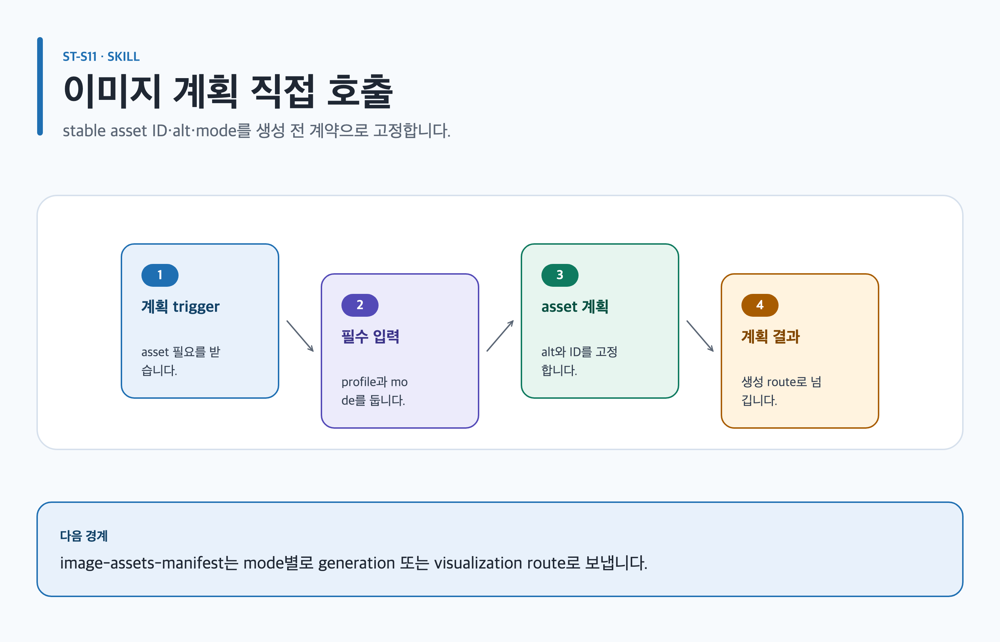

# plan-image-assets

## 목적과 최종 산출물

선택된 품질 profile의 image·Skillstead slot에 맞춰 stable asset ID, prompt package와 placeholder를 계획합니다.

## 사용할 때

- profile이나 explicit brief가 이미지 자산을 요구할 때
- 생성 전에 수량, placement, alt text와 preserve/exclude 제약을 고정할 때

### 직접 호출 활용 — plan-image-assets

[](../../assets/game-design-studio/skills/plan-image-assets.svg)

#### 직접 호출 조건

선택된 profile에 finite image 또는 Skillstead slot이 있고 생성 전에 ID·수량·alt text를 고정할 때 직접 호출합니다. 계획은 bytes 생성이나 승인 상태 변경을 하지 않습니다.

#### 입문 요청문

```text
$game-design-studio:plan-image-assets artifact=game-design/island/brief profile=game-design-brief needs=design-context-image:1 mode=prompt-only stable asset ID와 prompt·placeholder만 계획하고 생성하지 마.
```

#### 응용 요청문

```text
$game-design-studio:plan-image-assets artifact=game-design/island/brief profile=game-design-brief needs=design-context-image:2 mode=select finite illustration job의 수량, alt text, preserve/exclude와 named decision owner를 기록해.
```

#### 고급 요청문

```text
$game-design-studio:plan-image-assets artifact=game-design/island/brief profile=game-design-brief needs=skillstead-design-flow-diagram:1 mode=required Skillstead diagram slot의 source mapping과 SVG/2× PNG QA handoff만 계획해.
```

#### 예상 파일과 읽는 순서

`content.md → evidence.yml → export-manifest.yml → assets/image-assets.yml → assets/prompts/image-prompts.md → assets/prompts/image-prompts.json` 순서로 읽고 stable ID와 mode를 확인합니다. `image-assets-manifest`, `image-prompts`는 별도 파일명이 아니라 이 세 artifact-local 파일이 담는 논리 결과입니다.

#### 다음 스킬 조건

`prompt-only`면 생성 handoff 없이 보존하고, `select`·`required`·`all`의 finite illustration job일 때만 `$game-design-studio:generate-image-assets`, Skillstead diagram slot일 때만 `$game-design-studio:visualize-game-design`으로 넘깁니다.

## 사용하지 않을 때

- 이미지 bytes 생성, provider 호출 또는 승인 상태 변경에는 사용하지 않습니다.
- profile에 없는 slot을 임의로 추가하지 않습니다.

## 필수 입력과 선택 입력

- 필수: artifact root, quality profile/selection record, image need, stable source ID, audience, placement, 수량, decision owner
- 선택: dimensions, variants, accessibility intent, 기존 manifest와 human decisions
- 알려지지 않은 수량과 identity는 placeholder로 남깁니다.

## Codex App 요청 예시

**복사 가능한 요청문**

```text
@Game Design Studio 이 협동 RPG brief의 profile slot에 맞는 concept art와 UI key screen을 계획해. stable asset ID, 명시적 수량, alt text, preserve/exclude와 placeholder를 작성하고 생성은 하지 마.
```

## Codex CLI 요청 예시

```text
$game-design-studio:plan-image-assets artifact=artifacts/coop-rpg-brief, profile=game-design-brief, needs=design-context-image:1, mode=prompt-only
```

## 내부 진행 흐름

`apply-document-quality-profile` 결과를 검증하고 slot별 manifest를 만든 뒤 Markdown/JSON prompt를 모두 컴파일합니다. Skillstead slot은 별도 source mapping·lint·renderer·QA handoff를 만듭니다. 관련 역할은 `art-brief-director`, 주 템플릿/profile은 현재 canonical artifact의 선택값, 다음 스킬은 `generate-image-assets` 또는 `visualize-game-design`입니다.

## 생성 파일과 결과 구조

`assets/image-assets.yml`, `assets/prompts/image-prompts.md`, `assets/prompts/image-prompts.json`을 생성·갱신합니다. 기존 stable ID, 결정, output과 provenance는 보존합니다. 예상 결과 요약: provider 호출 전 비용과 검토 범위가 유한하게 고정됩니다.

## 관련 템플릿·품질 프로필·전문 역할

- Template ID: `current artifact profile` — [템플릿 카탈로그](../templates.md).
- Quality Profile ID: `current artifact profile을 상속하며 plan이 profile을 바꾸지 않음`.
- Reviewer/role ID: `art-brief-director`.

이 조합은 [문서 품질 프로필](../document-quality.md)의 선택 기록과 함께 유지하며, profile을 새로 고르지 않는 경우는 위처럼 현재 artifact 상속 사유를 명시합니다.

## 이미지·도식화 조건

template의 declared image slot과 finite stable asset ID만 illustration lifecycle에 넣습니다. Skillstead diagram slot은 이미지 plan에서 생성하지 않고 visualization lane으로 유지합니다.

[이미지 자산 흐름](../image-assets.md)과 [도식화 안내](../visualization.md)의 승인·검증 경계를 따릅니다.

## 검토·승인 기준

새 자산은 모두 `concept-draft`이며 계획은 승인 증거가 아닙니다. 문서 삽입이나 production candidacy에는 이름 있는 사람의 검토와 artifact-local evidence가 필요합니다.

## 실패·fallback·재개 방법

slot mismatch나 필수 입력 누락 시 manifest를 억지로 완성하지 않고 기존 결과와 placeholder를 보존합니다.

```text
$game-design-studio:plan-image-assets 기존 image-assets.yml과 stable IDs를 보존하고, 새로 확정한 image slot·수량·source section만 반영해 prompt package를 다시 작성해.
```

## 다음 작업 요청문

> `<artifact-path>`, `<export-manifest-path>`, `<selected-skill>`은 실제 경로·ID로 바꿔야 하는 자리표시자입니다. [공통 규칙](../../README.md#용어)을 따릅니다.

**복사 가능한 조건부 다음 handoff**

각 조건은 바로 아래 command 하나에만 결합됩니다.

- 조건: `prompt-only`면 생성 handoff 없이 이 planning artifact의 prompt·placeholder만 보존할 때.

- 조건: `select`/`required`/`all`의 finite illustration job일 때.

```text
$game-design-studio:generate-image-assets artifact=<artifact-path> 기존 evidence/decision을 보존하고 finite illustration job만 생성해.
```

- 조건: Skillstead diagram slot일 때.

```text
$game-design-studio:visualize-game-design artifact=artifacts/coop-rpg-brief Skillstead diagram slot의 source mapping·SVG/2× PNG QA만 진행해.
```

`prompt-only`일 때는 생성 handoff 없이 이 planning artifact의 prompt·placeholder만 유지합니다.

## 관련 문서

[템플릿 카탈로그](../templates.md), [generate-image-assets 스킬](./generate-image-assets.md), [visualize-game-design 스킬](./visualize-game-design.md), [스킬 선택표](README.md), [제품 workflow](../workflow.md)
