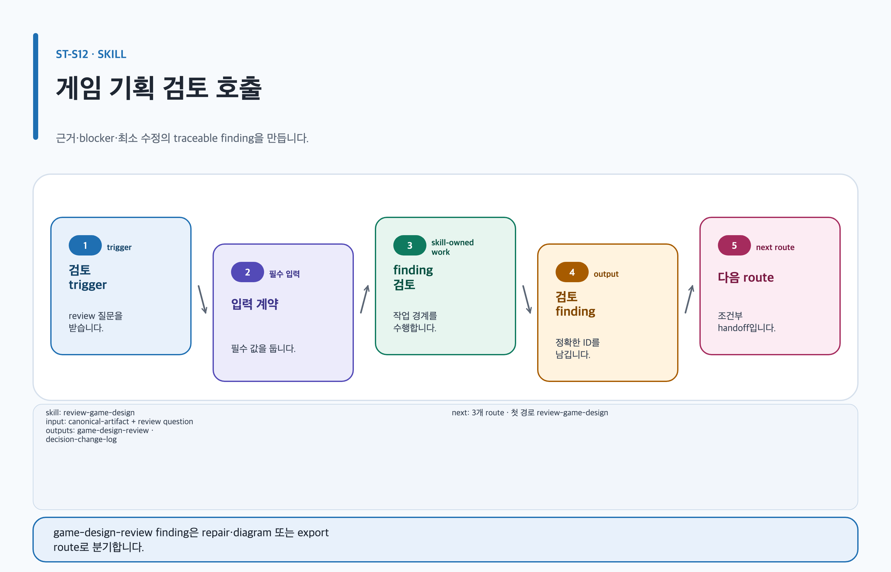

# review-game-design

## 목적과 최종 산출물

Canonical Artifact를 evidence와 launch blocker 중심으로 검토해 traceable finding, 최소 수정과 미해결 decision item을 만듭니다.

## 사용할 때

- 설계의 readiness, evidence, risk 또는 blocker를 점검할 때
- 전체 재작성 대신 영향이 분명한 최소 수정을 원할 때

### 직접 호출 활용 — review-game-design

[](../../assets/game-design-studio/skills/review-game-design.svg)

#### 직접 호출 조건

명확한 review question과 decision owner가 있는 Canonical Artifact를 최소 수정 단위로 점검할 때 직접 호출합니다. artifact가 없거나 범위가 미정이면 먼저 해당 domain 또는 오케스트레이터를 사용합니다.

#### 입문 요청문

```text
$game-design-studio:review-game-design artifact=game-design/island/vision player promise, pillar와 non-goal의 근거·가정·결정 owner를 finding으로 점검해.
```

#### 응용 요청문

```text
$game-design-studio:review-game-design artifact=game-design/workbench/system ST-C03의 rule precedence, failure recovery와 data mapping을 최소 수정과 영향으로 검토해.
```

#### 고급 요청문

```text
$game-design-studio:review-game-design artifact=game-design/island/review 모든 blocker를 evidence·impact·owner에 연결하고 최소 fix, diagram gap, export readiness를 분리해.
```

#### 예상 파일과 읽는 순서

`content.md → evidence.yml → export-manifest.yml` 순서로 읽고 `game-design-review`는 별도 YAML 파일이 아니라 `content.md`의 안정 섹션에서 unresolved blocker를 확인합니다. 사람의 변경 결정이 실제로 있을 때만 `decisions/`을 그 뒤에 읽습니다.

#### 다음 스킬 조건

minimum fix가 남았을 때만 `$game-design-studio:review-game-design`, diagram gap일 때만 `$game-design-studio:visualize-game-design`, all blocker가 해소되고 요청 형식이 남을 때만 `$game-design-studio:export-game-design-documents`로 넘깁니다.

## 사용하지 않을 때

- source artifact를 새로 만들거나 크게 재설계할 때
- source가 없는데 가상의 내용을 review finding처럼 만들 때

## 필수 입력과 선택 입력

- 필수: canonical artifact path/version, stable section IDs, evidence locators, review questions, boundary, owner
- 선택: target stage, responsible gates, 기존 role envelopes와 review package
- source가 없거나 invalid이면 substantive review를 멈춥니다.

## Codex App 요청 예시

**복사 가능한 요청문**

```text
@Game Design Studio 이 시스템 명세를 직접 evidence와 launch blocker 중심으로 검토해. severity, impact, affected section, 최소 수정, owner를 기록하고 source를 재작성하지 마.
```

## Codex CLI 요청 예시

```text
$game-design-studio:review-game-design artifact=artifacts/stamina-system, questions=실행 가능성·접근성·launch blocker, decisionOwner=game-director
```

## 내부 진행 흐름

source validation 후 최대 세 역할에 stable section 기반 질문을 보냅니다. finding을 정규화하고 severity·section ID·role priority로 정렬하며 disagreement는 decision item으로 보존합니다. 주 템플릿/profile은 `game-design-review`/`design-review-decision-log`, 관련 역할은 범위에 맞는 최대 3개, 다음 스킬은 최소 수정 후 재검토 또는 `export-game-design-documents`입니다.

## 생성 파일과 결과 구조

review package와 decision log만 변경하고 원본은 별도 승인 없이는 바꾸지 않습니다. 예상 결과 요약: 출시를 막는 근거 기반 문제와 가장 작은 수리 경로가 남습니다.

## 관련 템플릿·품질 프로필·전문 역할

- Template ID: `game-design-review` — [game-design-review 템플릿](../templates.md#game-design-review).
- Quality Profile ID: `design-review-decision-log`.
- Reviewer/role ID: `lead-game-designer · production-feasibility-critic · ux-accessibility-reviewer`.

이 조합은 [문서 품질 프로필](../document-quality.md)의 선택 기록과 함께 유지하며, profile을 새로 고르지 않는 경우는 위처럼 현재 artifact 상속 사유를 명시합니다.

## 이미지·도식화 조건

검토 자체는 이미지를 만들지 않습니다. finding이 image slot 또는 diagram slot의 부족을 지적하면 각각 illustration lifecycle 또는 Skillstead visualization handoff로만 넘깁니다.

[이미지 자산 흐름](../image-assets.md)과 [도식화 안내](../visualization.md)의 승인·검증 경계를 따릅니다.

## 검토·승인 기준

finding에는 id, severity, direct evidence, impact, affectedSectionId, minimalFix, owner, status, reviewerRole이 필요합니다. reviewer 권고와 self-attestation은 readiness 승인이나 gate 승인이 아닙니다.

## 실패·fallback·재개 방법

source가 missing·unreadable·invalid·unversioned이면 `source-unavailable`로 blocked 상태를 남기고 finding을 만들지 않습니다.

```text
$game-design-studio:review-game-design 이전 blocked review를 유지하고, 복구된 canonical artifact 경로와 version을 사용해 같은 review questions에서 재개해.
```

## 다음 작업 요청문

> `<artifact-path>`, `<export-manifest-path>`, `<selected-skill>`은 실제 경로·ID로 바꿔야 하는 자리표시자입니다. [공통 규칙](../../README.md#용어)을 따릅니다.

**복사 가능한 조건부 다음 handoff**

각 조건은 바로 아래 command 하나에만 결합됩니다.

- 조건: minimum fix가 남아 같은 review artifact의 수정 반영 여부를 재검토할 때.

```text
$game-design-studio:review-game-design artifact=<artifact-path> finding의 minimum fix 반영 여부만 재검토해.
```

- 조건: diagram gap finding이 source·slot·visual QA 보완을 요구할 때.

```text
$game-design-studio:visualize-game-design artifact=artifacts/reviewed-gdd diagram gap finding의 source mapping과 visual QA만 보완해.
```

- 조건: all blockers가 승인 가능하고 파생 형식이 필요할 때.

```text
$game-design-studio:export-game-design-documents artifact=<artifact-path> 승인 가능한 review evidence가 있을 때만 renderer-neutral preflight를 준비해.
```

## 관련 문서

[game-design-review 템플릿](../templates.md#game-design-review), [도식화](./visualize-game-design.md), [내보내기](./export-game-design-documents.md), [스킬 선택표](README.md), [제품 workflow](../workflow.md)

<!-- PROMPT-TEMPLATES:START game-design-studio:review-game-design -->
### 재사용 프롬프트 템플릿

- [beginner — 누락과 모순을 질문으로 남기는 기획 검토](../../prompt-templates/studio/review-game-design.md#studioreview-game-designbeginner)
- [standard — Evidence gap과 severity를 owner에게 배정하는 검토](../../prompt-templates/studio/review-game-design.md#studioreview-game-designstandard)
- [advanced — 교차 도메인 finding과 decision queue를 분리하는 검토](../../prompt-templates/studio/review-game-design.md#studioreview-game-designadvanced)
<!-- PROMPT-TEMPLATES:END game-design-studio:review-game-design -->
