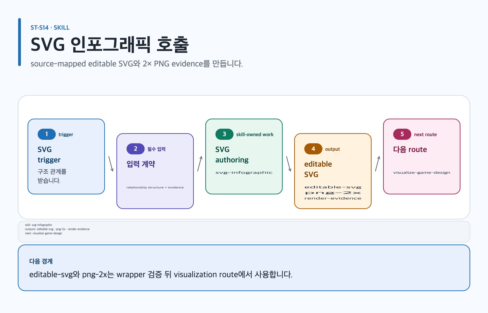

# svg-infographic

## 목적과 최종 산출물

고급 사용자가 구조적 SVG를 직접 authoring하고 canonical Chromium renderer로 정확한 2× PNG를 만드는 vendored Skillstead 0.10.0 레퍼런스입니다.

## 사용할 때

- `visualize-game-design`이 preset과 source mapping을 먼저 선택한 뒤 세부 구조를 직접 authoring할 때
- topology, flow, layer, roadmap, qualitative matrix와 technical one-pager가 필요할 때

### 직접 호출 활용 — svg-infographic

[](../../assets/game-design-studio/skills/svg-infographic.svg)

#### 직접 호출 조건

`visualize-game-design` wrapper가 preset과 source mapping을 선택한 뒤 고급 structural SVG를 직접 authoring할 때만 호출합니다. illustration이나 의미가 확정되지 않은 diagram에는 wrapper를 우선합니다.

#### 입문 요청문

```text
$game-design-studio:svg-infographic artifact=game-design/workbench/system source=rule-exception-matrix state-rule-flow를 1400×900 editable SVG로 작성하고 source mapping을 유지해.
```

#### 응용 요청문

```text
$game-design-studio:svg-infographic artifact=game-design/island/roadmap source=production-scope-risk roadmap 관계를 SVG title·desc와 함께 authoring하고 canonical renderer 2× PNG QA를 기록해.
```

#### 고급 요청문

```text
$game-design-studio:svg-infographic artifact=game-design/workbench/system Node 18+가 부재하면 manual source checklist를 완료하고 Node-free Chromium으로 exact 2× PNG를 검증해. Chromium도 없을 때만 SVG-only draft와 lint·PNG visual verification 미실행을 정확히 표시해.
```

#### 예상 결과와 파일 읽는 순서

`content.md → evidence.yml → export-manifest.yml` 순서로 읽고 `assets/ 아래 source-mapped editable SVG`를 확인합니다. Node 18+ packaged wrapper branch에서는 machine lint와 packaged wrapper Chromium render를 통과했을 때만 같은 assets 아래 2× PNG와 wrapper evidence를 읽습니다. Node-free Chromium branch에서는 manual source checklist를 완료하고 machine lint와 packaged wrapper를 실행하지 않습니다. 직접 Chromium으로 2× PNG를 렌더한 뒤 manual evidence와 visual QA를 읽습니다. Chromium도 없을 때만 SVG-only draft로 제한하며 PNG visual verification은 미실행으로 기록합니다. `editable-svg`, `png-2x`, `render-evidence`는 별도 파일명이 아닌 논리 결과입니다.

#### 다음 스킬 조건

wrapper의 semantic validation과 diagram index가 필요할 때만 `$game-design-studio:visualize-game-design`으로 넘기며 Node-free Chromium fallback은 machine-linted 결과로 표시하지 않습니다.

## 사용하지 않을 때

- 일반적인 Studio 작업에서는 product wrapper를 우선합니다.
- character art, background scene illustration, mascot, logo, photo-heavy graphic 또는 data-accurate statistical chart를 대체하지 않습니다.

## 필수 입력과 선택 입력

- 필수: visual intent, audience, ratio, language, 구조, project 내부 output directory
- 선택: brief/source/research-first mode, brand color, dark mode, sketch preset, SVG-only 여부
- source-first이면 핵심 메시지를 합의하고 box-by-box transcription을 피합니다.

## Codex App 요청 예시

**복사 가능한 요청문**

```text
@Game Design Studio product wrapper가 고른 state-rule-flow preset과 source mapping을 유지해서 고급 구조 SVG를 작성해. exact 2× PNG render와 fit-to-page·close-up QA까지 수행해.
```

## Codex CLI 요청 예시

```text
$game-design-studio:svg-infographic source-mapped system state flow를 1400×900 editable SVG로 작성하고 canonical renderer로 exact 2× PNG를 검증해.
```

## 내부 진행 흐름

archetype과 authoring reference를 읽고 숫자 layout을 먼저 계산합니다. SVG에 `<title>`/`<desc>`와 planned `<tspan>`을 작성하고 source lint 후 canonical Chromium renderer로 2× 렌더한 다음 두 번의 pixel QA를 합니다. 관련 역할은 Studio wrapper의 `lead-game-designer`; 주 profile/template은 wrapper가 선택한 artifact; 다음 스킬은 `visualize-game-design` evidence validation입니다.

## 생성 파일과 결과 구조

editable SVG가 authority이고 PNG는 derivative입니다. renderer executable/version, lint·render 명령, exact dimensions와 QA 결과를 handoff합니다. 예상 결과 요약: 구조 도식의 원본과 재현 가능한 렌더 증거가 생깁니다.

## 관련 템플릿·품질 프로필·전문 역할

- Template ID: `no Canonical Artifact template` — [템플릿 카탈로그](../templates.md).
- Quality Profile ID: `no Quality Profile: vendored Skillstead tool`.
- Reviewer/role ID: `lead-game-designer` (Studio `visualize-game-design` wrapper가 의미·결정 강조를 검토합니다).

이 조합은 [문서 품질 프로필](../document-quality.md)의 선택 기록과 함께 유지하며, profile을 새로 고르지 않는 경우는 위처럼 현재 artifact 상속 사유를 명시합니다.

## 이미지·도식화 조건

이 도구는 structural SVG와 2× PNG에만 사용합니다. illustration lifecycle·character art·background scene을 생성하지 않으며, 관계가 prose/표보다 분명할 때만 사용합니다.

[이미지 자산 흐름](../image-assets.md)과 [도식화 안내](../visualization.md)의 승인·검증 경계를 따릅니다.

## 검토·승인 기준

먼저 `node --version`으로 Node 18+인지 확인합니다. Node는 SVG authoring에는 필요하지 않지만 bundled source lint와 machine-linted handoff에는 필요합니다. Node가 없으면 OS와 신뢰 가능한 package manager를 확인하고 candidate가 Node 18+를 제공하는지 검증한 뒤 정확한 설치 명령을 제시합니다. 사용자에게 명시적 승인을 받기 전에는 설치하지 않으며 `curl | sh`는 사용하지 않습니다. elevated privilege가 필요하면 그 승인도 별도로 드러냅니다. 설치 뒤 version을 다시 확인하고, 실패하거나 구버전이면 다른 source로 재시도하기 전에 다시 승인을 받습니다.

Chromium availability도 확인합니다. lint warning은 의도적으로 처리하며 PNG만 patch하지 않습니다. 생성된 SVG/PNG는 artifact, 이미지 권리 또는 사람 승인 증거가 아닙니다.

## 실패했을 때와 재개 방법

사용자가 Node 설치를 거절하거나 안전한 route가 없으면 manual source checklist를 완료하고 `render.sh`를 호출하지 않습니다. 문서화된 Node-free Chromium 경로로 정확한 2× PNG를 렌더하고 visual QA를 수행하되 machine-linted라고 표시하지 않습니다. 결과에는 automated source lint가 실행되지 않았고 manual source checklist와 PNG render/visual QA가 통과했는지 정확히 명시합니다.

Chromium도 없으면 SVG-only draft로 전달하고 automated source lint와 PNG visual verification이 모두 실행되지 않았다고 표시합니다. sandbox launch가 막히면 동일 render command를 보존하며 다른 renderer를 Chromium 결과로 표시하지 않습니다.

```text
$game-design-studio:svg-infographic 기존 editable SVG를 보존하고 Node 18+ 설치 승인 여부와 Chromium availability를 다시 확인해. 승인된 branch의 마지막 검증 단계부터 exact 2× PNG와 two-pass QA를 재개해.
```

## 다음 작업 요청문

> `<artifact-path>`, `<export-manifest-path>`, `<selected-skill>`은 실제 경로·ID로 바꿔야 하는 자리표시자입니다. [공통 규칙](../../README.md#용어)을 따릅니다.

**복사 가능한 다음 handoff**

@Game Design Studio visualize-game-design로 현재 Artifact의 검증된 기록을 이어 다음 작업을 진행해.

```text
$game-design-studio:visualize-game-design artifact=<artifact-path> 기존 evidence/decision을 보존하고 다음 handoff를 실행해.
```

## 관련 문서

[템플릿 카탈로그](../templates.md), [visualize-game-design 스킬](./visualize-game-design.md), [스킬 선택표](README.md), [제품 workflow](../workflow.md)

<!-- PROMPT-TEMPLATES:START game-design-studio:svg-infographic -->
### 재사용 프롬프트 템플릿

- [beginner: 간단한 source-mapped SVG 흐름](../../prompt-templates/studio/svg-infographic.md#studiosvg-infographicbeginner)
- [standard: source-backed 2× PNG가 있는 SVG handoff](../../prompt-templates/studio/svg-infographic.md#studiosvg-infographicstandard)
- [advanced: lint 0 warning/error·접근성·human approval SVG QA](../../prompt-templates/studio/svg-infographic.md#studiosvg-infographicadvanced)
<!-- PROMPT-TEMPLATES:END game-design-studio:svg-infographic -->
