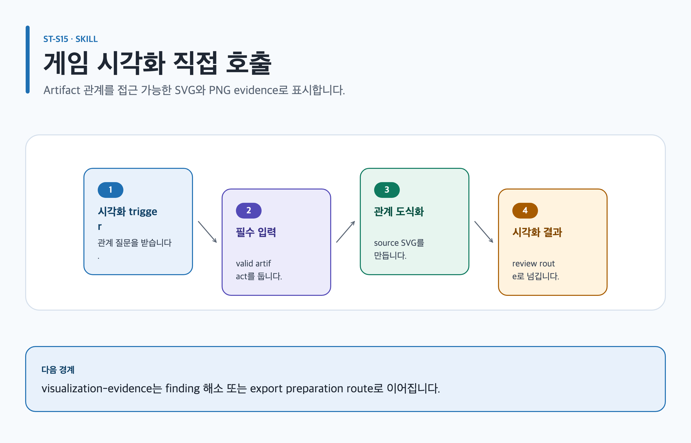

# visualize-game-design

## 목적과 최종 산출물

경제 flow와 system state처럼 공간 표현이 유용한 source-backed 관계를 accessible SVG와 정확한 2× PNG 증거로 만듭니다.

## 사용할 때

- loop, state transition, progression, source/sink, timeline, dependency와 role 구조를 설명할 때
- 문서·발표에 editable SVG와 검증된 PNG가 필요할 때

### 직접 호출 활용 — visualize-game-design

[](../../assets/game-design-studio/skills/visualize-game-design.svg)

#### 직접 호출 조건

관계가 prose·표보다 명확해지는 valid Canonical Artifact의 loop, state, roadmap 또는 dependency를 설명할 때 직접 호출합니다. 장식용 이미지나 source mapping 없는 차트에는 사용하지 않습니다.

#### 입문 요청문

```text
$game-design-studio:visualize-game-design artifact=game-design/island/vision relationship=player-promise-to-pillar 대상 독자가 이해할 필요가 있는 관계만 source-mapped SVG로 보여 줘.
```

#### 응용 요청문

```text
$game-design-studio:visualize-game-design artifact=game-design/workbench/system relationship=state-transition ST-C03의 authoritative state와 failure recovery를 editable SVG와 exact 2× PNG로 검증해.
```

#### 고급 요청문

```text
$game-design-studio:visualize-game-design artifact=game-design/island/roadmap relationship=scope-risk Node 18+ 또는 Node-free Chromium fallback의 실제 lint·renderer·visual QA 상태를 evidence에 정확히 기록해.
```

#### 예상 파일과 읽는 순서

`content.md → evidence.yml → export-manifest.yml` 순서로 읽고 `assets/ 아래 source-mapped editable SVG`를 확인합니다. Node 18+ packaged wrapper branch에서는 machine lint와 packaged wrapper Chromium render를 통과했을 때만 같은 assets 아래 2× PNG와 wrapper evidence를 읽습니다. Node-free Chromium branch에서는 manual source checklist를 완료하고 machine lint와 packaged wrapper를 실행하지 않습니다. 직접 Chromium으로 2× PNG를 렌더한 뒤 manual evidence와 visual QA를 읽습니다. Chromium도 없을 때만 SVG-only draft로 제한하며 PNG visual verification은 미실행으로 기록합니다. `editable-svg`, `png-2x`, `visualization-evidence`는 별도 파일명이 아닌 논리 결과입니다.

#### 다음 스킬 조건

diagram이 review finding을 해결해야 할 때만 `$game-design-studio:review-game-design`, 모든 blocker가 해소되고 형식 전달이 남을 때만 `$game-design-studio:export-game-design-documents`로 넘깁니다.

## 사용하지 않을 때

- 간단한 prose나 표가 더 명확할 때
- 통계 chart, character art, background scene illustration, marketing illustration, mascot 또는 logo에는 사용하지 않습니다.

## 필수 입력과 선택 입력

- 필수: validated artifact path/version, stable source IDs, 관계, audience, intent, language, ratio, output directory, acceptance criteria
- 선택: brief-first/source-first/research-first mode, 기존 SVG, requested assets와 review question
- source에 없는 node, edge, date나 statistic은 canonical evidence로 만들지 않습니다.

## Codex App 요청 예시

**복사 가능한 요청문**

```text
@Game Design Studio 검증된 economy section의 두 통화 source·sink와 system state만 source mapping해 도식화해. preset 선택 이유, editable SVG, 정확한 2× PNG와 two-pass QA 증거를 남겨 줘.
```

## Codex CLI 요청 예시

```text
$game-design-studio:visualize-game-design artifact=artifacts/economy, sources=economy-flow,state-rules, relationship=source-sink-and-state, assets=svg,png
```

## 내부 진행 흐름

diagram이 필요한지 먼저 판단하고 packaged preset 하나와 source mapping을 고릅니다. product wrapper를 통해 vendored Skillstead를 lint/render하고 fit-to-page·close-up QA 뒤 evidence validator를 실행합니다. 주 profile은 현재 artifact 선택값, 관련 역할은 `lead-game-designer`와 필요한 reviewer 최대 2개, 다음 스킬은 `review-game-design` 또는 `export-game-design-documents`입니다.

## 생성 파일과 결과 구조

artifact `assets/`에 editable SVG, adjacent alt text, 검증 시 PNG와 execution evidence를 남깁니다. `requested`, `generated`, `linted`, `rendered`, `verified`는 별도 상태입니다. 예상 결과 요약: source 관계를 왜곡하지 않는 검증 가능한 도식이 생깁니다.

## 관련 템플릿·품질 프로필·전문 역할

- Template ID: `current artifact profile` — [템플릿 카탈로그](../templates.md).
- Quality Profile ID: `current artifact profile을 상속하며 visualization이 profile을 바꾸지 않음`.
- Reviewer/role ID: `lead-game-designer`.

이 조합은 [문서 품질 프로필](../document-quality.md)의 선택 기록과 함께 유지하며, profile을 새로 고르지 않는 경우는 위처럼 현재 artifact 상속 사유를 명시합니다.

## 이미지·도식화 조건

선택한 preset의 Skillstead diagram slot만 authoring하고, SVG/2× PNG를 검증합니다. character·scene illustration이 필요한 경우에만 별도 image-assets lifecycle로 넘기며 구조 도식과 혼합하지 않습니다.

[이미지 자산 흐름](../image-assets.md)과 [도식화 안내](../visualization.md)의 승인·검증 경계를 따릅니다.

## 검토·승인 기준

모든 node·connector·label·수치는 source locator가 필요합니다. 먼저 `node --version`으로 Node 18+인지 확인합니다. Node는 SVG authoring에는 필요하지 않지만 bundled source lint와 machine-linted handoff에는 필요합니다. Node가 없으면 OS와 신뢰 가능한 package manager를 확인하고 candidate가 Node 18+를 제공하는지 검증한 뒤 정확한 설치 명령을 제시합니다. 사용자에게 명시적 승인을 받기 전에는 설치하지 않고 `curl | sh`를 사용하지 않으며, elevated privilege가 필요하면 별도 승인을 요청합니다. 설치 뒤 version을 다시 확인하고 실패하거나 구버전이면 다른 source로 재시도하기 전에 다시 승인을 받습니다.

SVG `<title>`/`<desc>`, lint, renderer identity, exact dimensions와 two-pass visual QA 없이는 verified가 아닙니다. 렌더와 reviewer 권고는 문서 승인도 아닙니다.

## 실패·fallback·재개 방법

사용자가 Node 설치를 거절하거나 안전한 route가 없으면 manual source checklist를 완료하고 `render.sh`를 호출하지 않습니다. Node-free Chromium 경로로 정확한 2× PNG와 visual QA를 수행하되 machine-linted라고 표시하지 않습니다. automated source lint 미실행, manual source checklist, PNG render/visual QA의 실제 상태를 각각 명시합니다.

Chromium도 없으면 SVG-only draft로 전달하고 automated source lint와 PNG visual verification이 모두 실행되지 않았다고 표시합니다. 그 밖의 lint·browser·render·pixel review 실패에서도 canonical artifact와 통과한 SVG evidence를 보존하고 PNG 성공을 주장하지 않습니다.

```text
$game-design-studio:visualize-game-design 기존 SVG와 source mapping을 보존하고 Node 18+ 설치 승인 여부와 Chromium availability를 확인해. 선택된 fallback branch의 마지막 검증 단계부터 재개해.
```

## 다음 작업 요청문

> `<artifact-path>`, `<export-manifest-path>`, `<selected-skill>`은 실제 경로·ID로 바꿔야 하는 자리표시자입니다. [공통 규칙](../../README.md#용어)을 따릅니다.

**복사 가능한 조건부 다음 handoff**

diagram source/evidence 또는 visual QA가 부족하면 먼저 `review-game-design`으로 finding을 남깁니다. SVG·2× PNG evidence가 검증되고 파생 형식이 필요할 때만 `export-game-design-documents`를 호출합니다.

```text
$game-design-studio:review-game-design artifact=<artifact-path> diagram source mapping과 visual QA blocker를 검토해.
```

```text
$game-design-studio:export-game-design-documents artifact=<artifact-path> verified diagram evidence가 있을 때만 export preflight를 준비해.
```

## 관련 문서

[템플릿 카탈로그](../templates.md), [export-game-design-documents 스킬](./export-game-design-documents.md), [스킬 선택표](README.md), [제품 workflow](../workflow.md)
