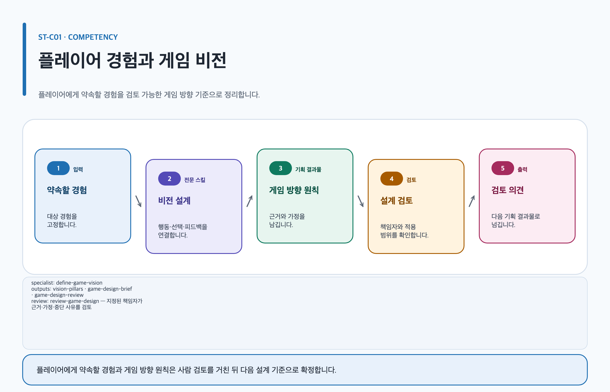
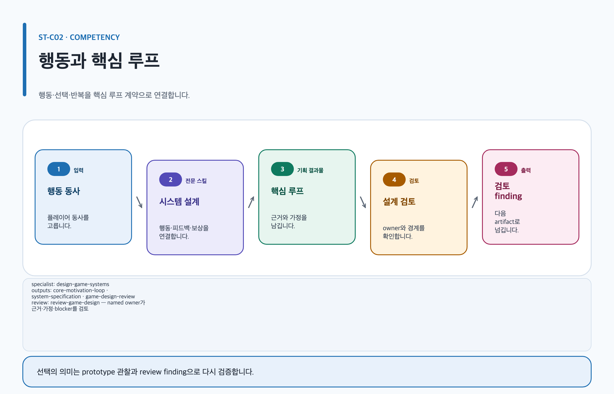
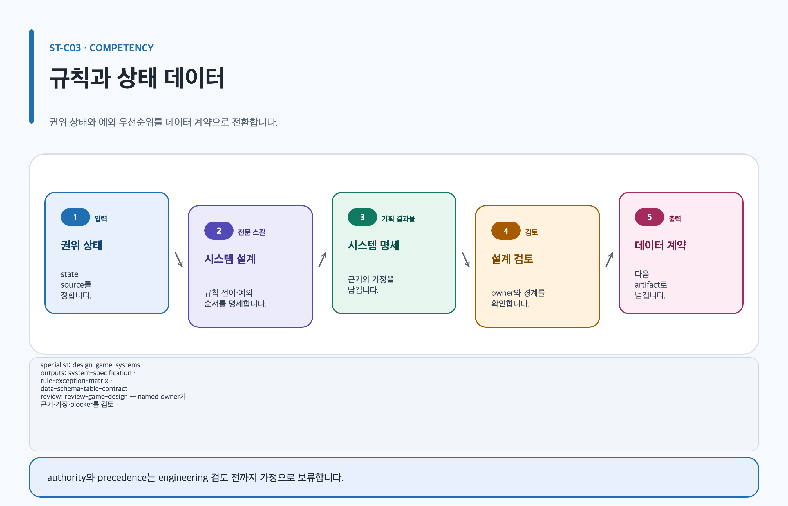
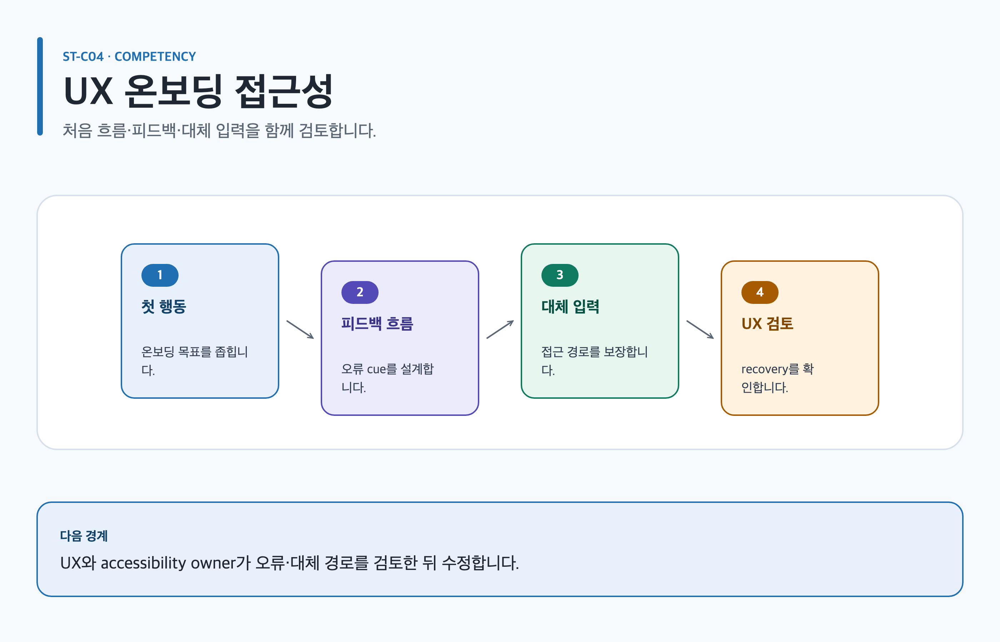
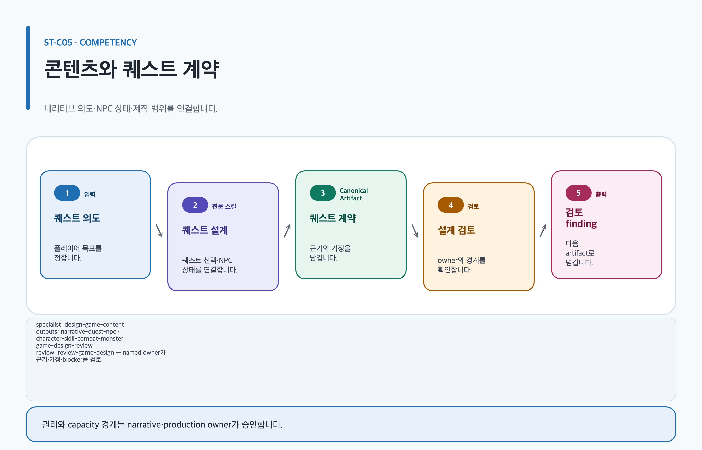
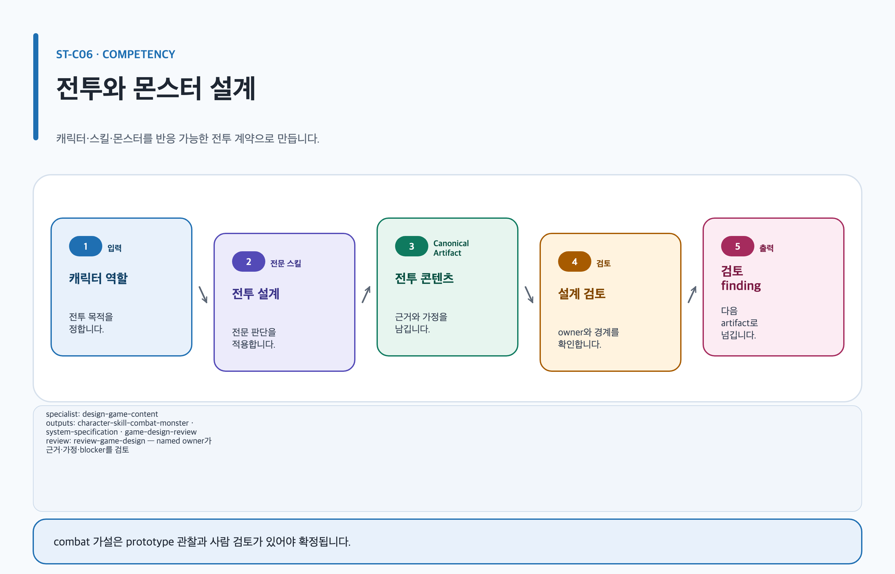
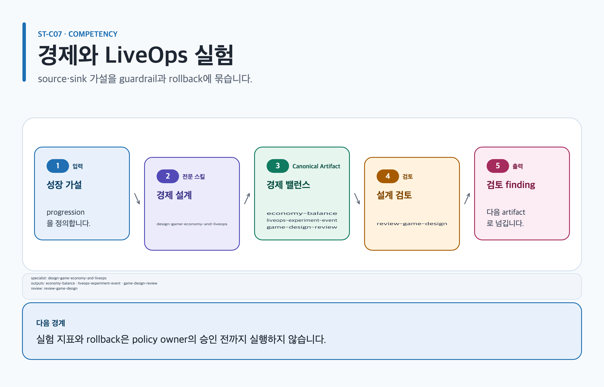
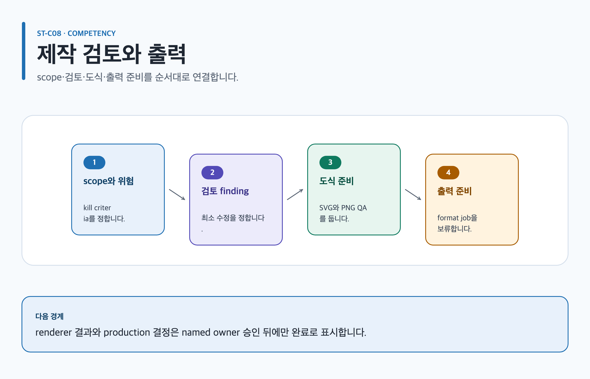

# Studio 역량 학습 경로

이 문서는 장르와 회사 양식에 종속되지 않는 여덟 가지 게임 기획 역량을 작은 실습에서 검토 가능한 Artifact까지 확장합니다. 모든 예시는 가상·중립 사례입니다. 재미, 시장성, retention, 일정과 수치는 결론이 아니라 prototype 또는 telemetry로 검증할 가정이며, 자동화와 전문 역할의 finding은 이름 있는 사람의 승인을 대신하지 않습니다.

## ST-C01 플레이어 경험과 게임 비전

[](../../assets/game-design-studio/use-cases/st-c01.svg)

### 현재 상황과 목표

**사용자와 상황:** 한 문장짜리 “낯선 섬을 함께 복구하는 탐험 게임” 아이디어가 있지만 대상 플레이어와 판단 기준이 없습니다.

**학습 목표:** player promise, desired emotion, pillar, anti-pillar, non-goal과 관찰 가능한 success signal을 구분합니다. 핵심 개념은 “재미있다”는 주장과 “플레이어가 어떤 행동·선택·피드백을 경험하는가”라는 검증 가능한 가정의 경계입니다.

### 적합한 경우와 적합하지 않은 경우

- 적합: 아이디어를 시스템·콘텐츠·제작 판단의 공통 기준으로 바꾸거나, 상충하는 기능 제안을 비전으로 비교할 때.
- 부적합: 이미 승인된 비전의 세부 runtime 규칙을 쓰거나, 근거 없이 시장 규모·재미·retention을 단정할 때. 세부 규칙은 `ST-C03`으로 이동합니다.

### 준비 입력

- 선수 지식: 게임에서 확인한 사실과 자신의 해석을 분리하는 방법.
- 최소 입력: 아이디어 한 문장, 예상 대상, 플랫폼 가정, 원하는 감정, 알려진 제약, 실제 decision owner.
- 선택 입력: 인터뷰·플레이테스트 기록, 유사 경험 관찰, 기존 범위 결정. 제3자 자료는 출처와 이용 범위를 기록합니다.

### 10분 미니 실습

1. 익숙한 게임 한 장면에서 플레이어 행동, 시스템 반응, 보이는 피드백만 관찰로 적습니다.
2. 새 예시의 player promise를 한 문장으로 쓰고 pillar 하나와 anti-pillar 하나를 만듭니다.
3. “재미있다” 같은 형용사를 지우고 prototype에서 관찰할 질문으로 바꿉니다.

### 표준 실습

1. 관찰과 추론을 분리하고, 대상 플레이어 근거가 없으면 `assumption`으로 표시합니다.
2. player promise → verb → decision → feedback을 연결한 `vision-pillars` 초안을 만듭니다.
3. 그 약속에 기여하지 않는 기능을 non-goal로 분리한 `game-design-brief`를 작성합니다.
4. 반례 과제로 “협동이 대기와 지시 따르기로만 변하는 상황”을 찾고 validation task를 만듭니다.
5. 생성 결과에서 가정, 누락, 모순과 검증되지 않은 주장을 찾아 review 질문으로 넘깁니다.

### 포트폴리오·실무 확장

최종 문구보다 처음의 모호한 아이디어, 비교한 대안, 포기한 기능, prototype 질문과 사람 결정 기록을 보여 줍니다. 실무에서는 pillar를 기능 승인 기준으로 쓰되 회사 고유 문서나 문체를 복제하지 않고 현재 팀의 공개 가능한 계약에 맞춥니다.

### Codex App 요청문

```text
@Game Design Studio 낯선 섬을 함께 복구하는 탐험 게임 아이디어를 대상 플레이어, player promise, pillar, anti-pillar, non-goal과 prototype 검증 질문으로 나눠 줘. 근거 없는 재미와 시장 주장은 assumption으로 남겨 줘.
```

### Codex CLI 요청문

```text
$game-design-studio:define-game-vision artifact=game-design/island-restoration/vision-pillars 아이디어 한 문장을 vision-pillars와 game-design-brief로 정리하고 실제 design owner의 결정을 기다려.
```

### 스킬·템플릿 흐름

`apply-document-quality-profile` → `define-game-vision` → 필요 시 `orchestrate-game-design-project` → `review-game-design` 순서입니다. 템플릿은 `vision-pillars`, `game-design-brief`입니다. **역할 경계:** `document-quality-editor`는 구조 누락, `lead-game-designer`와 `content-narrative-designer`는 근거 연결 finding, `production-feasibility-critic`은 범위 위험을 보고합니다. 전문 역할은 원본을 승인하거나 재작성하지 않고, 실제 design owner가 pillar와 non-goal을 결정합니다.

### 결과물

**최소 결과:** `vision-pillars`, `game-design-brief`, `game-design-review` 내용을 가진 Canonical Markdown과 근거·결정 기록.

**선택 결과:** 검토 목적이 분명한 이미지 prompt 또는 source-backed 도식 계획. 생성·렌더 성공은 승인이 아닙니다.

**확장 결과:** 사람 검토와 형식별 QA를 통과한 팀 brief 또는 공개 가능한 판단 증거.

**파일 트리:**

```text
game-design/island-restoration/vision-pillars/
├── content.md
├── evidence.yml
├── decisions/README.md
├── assets/README.md
└── export-manifest.yml
```

**대표 내용:** `P-01 | 약속: 함께 복구 방향을 선택한다 | 근거: assumption | 검증: prototype에서 선택 이유와 갈등 지점을 관찰 | owner: pending`

### 검토와 승인

**읽는 순서:** `content.md → evidence.yml → decisions/ → assets/ → export-manifest.yml`. 중간 결과에서는 player promise와 각 pillar가 verb·decision·feedback에 연결되는지 먼저 봅니다. **사람 결정:** 실제 design owner가 대상, pillar, anti-pillar, non-goal과 다음 prototype 범위를 승인·수정·보류합니다. 스킬 실행, reviewer finding과 파일 생성은 자동 승인하지 않습니다.

### 실패·재개

대상 근거가 없거나 pillar가 형용사뿐이면 확정하지 않고 질문과 validation task로 남깁니다. **보존:** 기존 `content.md`, evidence ID, 결정 기록과 통과한 review finding.

**재개 요청문:**

```text
$game-design-studio:define-game-vision 기존 game-design/island-restoration/vision-pillars를 보존하고 새 플레이테스트 관찰을 evidence.yml에 연결해 P-01의 provisional 검증 기준부터 재개해.
```

### 자기점검과 다음 학습

- 대상 플레이어 근거와 가정을 구분했는가? 선택한 pillar가 실제 기능 결정 하나를 거절할 수 있는가?
- 회고: 채택한 대안, 포기한 조건, 필요한 다음 관찰을 자신의 말로 설명합니다.
- 다음 학습: 행동을 루프로 구체화하려면 `ST-C02`, 규칙으로 내리려면 `ST-C03`으로 이동합니다.
- 관련 문서: [새 게임 GDD 레시피](../recipes/new-game-gdd.md), [비전 스킬](../skills/define-game-vision.md), [템플릿](../templates.md).

## ST-C02 행동·핵심 루프·의미 있는 선택

[](../../assets/game-design-studio/use-cases/st-c02.svg)

### 현재 상황과 목표

**사용자와 상황:** “재료를 찾아 고장 난 시설을 복구한다”는 목표는 있지만 반복 행동과 선택의 차이가 불분명합니다.

**학습 목표:** player verb, goal, opposition, rule, feedback, reward, motivation과 meaningful choice를 구분합니다. 반복 횟수나 보상이 곧 동기라는 가정을 피하고, 서로 다른 선택이 결과와 trade-off를 갖는지 검토합니다.

### 적합한 경우와 적합하지 않은 경우

- 적합: 핵심 행동의 순서, 시스템 반응, 실패 복구와 반복 이유를 설계할 때.
- 부적합: 확률·가격·retention을 근거 없이 최적화하거나, coercive loop를 성공 공식으로 제시할 때. 경제는 `ST-C07`에서 별도 검토합니다.

### 준비 입력

- 선수 지식: `ST-C01`의 player promise 또는 이에 준하는 목표 경험.
- 최소 입력: 가능한 player verbs, 목표, 방해 조건, 입력 방식, feedback, 실패 후 복구, decision owner.
- 선택 입력: 관찰 기록, prototype 영상, 입력 장치 제약, player-protection 질문.

### 10분 미니 실습

관찰 가능한 동사만 사용해 `탐색 → 선택 → 운반 → 복구 → 변화 확인`을 적습니다. 각 단계에 시스템 반응 하나와 플레이어가 읽을 수 있는 feedback 하나를 붙이고, 선택 두 개가 같은 결과라면 meaningful choice로 세지 않습니다.

### 표준 실습

1. 기존 게임의 짧은 장면에서 입력, 응답, feedback만 관찰합니다.
2. `core-motivation-loop`에 action·feedback·reward·motivation need·recovery를 연결합니다.
3. `system-specification`에 루프를 지탱하는 규칙과 state를 provisional로 적습니다.
4. 반례로 최적 행동 하나가 모든 선택을 지우거나 실패가 회복 불가능한 조건을 찾습니다.
5. prototype에서 선택 분포, 포기 이유, 이해 오류를 관찰할 계획을 만들고 수치는 목표가 아니라 검증 대상으로 둡니다.

### 포트폴리오·실무 확장

루프 도식의 모양보다 verb 후보를 줄인 근거, 의미 없는 선택을 제거한 판단, 실패 복구 변경 전후의 관찰 계획을 남깁니다. 실무 handoff에는 시스템 rule ID와 UX feedback state를 연결합니다.

### Codex App 요청문

```text
@Game Design Studio 시설 복구 아이디어의 player verbs, goal, opposition, feedback, reward와 meaningful choice를 core loop로 정리해. 강제 반복이나 retention 주장은 넣지 말고 prototype으로 검증할 가정을 표시해 줘.
```

### Codex CLI 요청문

```text
$game-design-studio:design-game-systems artifact=game-design/island-restoration/core-loop core-motivation-loop의 각 단계에 provisional rule, feedback state와 failure recovery를 연결해.
```

### 스킬·템플릿 흐름

`define-game-vision` → `design-game-systems` → `design-player-experience` → `review-game-design` 순서이며 템플릿은 `core-motivation-loop`, `system-specification`입니다. **역할 경계:** `lead-game-designer`는 비전 연결, `system-economy-designer`는 rule·state, `ux-accessibility-reviewer`는 feedback·입력·복구 finding을 제출합니다. 실제 design owner가 loop와 보호 경계를 결정합니다.

### 결과물

**최소 결과:** `core-motivation-loop`, `system-specification`, `game-design-review`와 검증 질문.

**선택 결과:** source-backed loop 도식 계획이나 장면 reference prompt.

**확장 결과:** prototype 관찰과 사람 결정을 반영한 loop handoff.

**파일 트리:**

```text
game-design/island-restoration/core-loop/
├── content.md
├── evidence.yml
├── decisions/README.md
├── assets/README.md
└── export-manifest.yml
```

**대표 내용:** `L-02 | verb: 운반 경로 선택 | trade-off: 안전한 우회/위험한 지름길 | feedback: 경로 상태 표시 | 검증: 선택 이유 관찰`

### 검토와 승인

**읽는 순서:** `content.md`의 loop와 rule ID, `evidence.yml`의 관찰, `decisions/`의 대안 순서입니다. 중간 결과에서 모든 단계가 입력과 feedback을 갖고 실패 뒤 복구 가능한지 확인합니다. **사람 결정:** design owner와 player-protection owner가 의미 있는 선택, stop condition과 다음 prototype을 승인하거나 보류합니다. 자동화는 재미나 retention을 승인하지 않습니다.

### 실패·재개

verb가 추상적이거나 모든 분기가 같은 결과면 해당 단계는 `blocked`로 남기고 관찰 과제로 돌아갑니다. **보존:** 확정된 verb, rule ID, 반례, decision log.

**재개 요청문:**

```text
@Game Design Studio 기존 core-loop Artifact를 유지하고 새 prototype 관찰에서 확인된 선택 이유만 evidence로 추가해 L-02의 trade-off와 recovery부터 다시 검토해 줘.
```

### 자기점검과 다음 학습

- 모든 verb가 관찰 가능한가? 보상 없이도 선택의 결과를 설명할 수 있는가? 반례가 규칙 수정으로 이어졌는가?
- 회고에서 선택한 loop, 버린 대안과 다음 실험을 설명합니다.
- 다음 학습은 `ST-C03`의 규칙 계약 또는 `ST-C04`의 첫 세션 feedback입니다.
- 관련 문서: [비전 스킬](../skills/define-game-vision.md), [시스템 스킬](../skills/design-game-systems.md), [플레이어 경험 스킬](../skills/design-player-experience.md).

## ST-C03 규칙·상태·예외·데이터

[](../../assets/game-design-studio/use-cases/st-c03.svg)

### 현재 상황과 목표

**사용자와 상황:** 공동 작업대의 제작 기능을 설명했지만 동시 입력, 재료 부족, 취소와 연결 끊김의 처리 규칙이 없습니다.

**학습 목표:** rule, authoritative state, transition, precedence, exception, recovery, UI feedback과 data schema의 경계를 배웁니다. 문서 순서가 rule priority를 대신하지 않도록 stable ID와 test case를 사용합니다.

### 적합한 경우와 적합하지 않은 경우

- 적합: 구현·QA handoff에 필요한 결정적 시스템 계약을 만들 때.
- 부적합: 전체 비전, 단일 퀘스트 서술, 실제 schema를 모르는 상태에서 database 구조를 확정할 때.

### 준비 입력

- 선수 지식: 입력·상태·출력을 분리하고 happy path만으로 완료하지 않는 태도.
- 최소 입력: system boundary, actor, input, precondition, authoritative state, 예상 output, 실패와 recovery, owner.
- 선택 입력: 기존 API/schema, concurrency 관찰, platform 상태, engineering·QA 질문. 실제 schema가 없으면 design meaning만 provisional로 둡니다.

### 10분 미니 실습

제작 요청 하나를 `idle → validating → crafting → completed|failed|cancelled`로 나눕니다. “재료가 동시에 소비됨”, “취소와 완료가 겹침” 반례를 추가하고 어떤 authority가 최종 상태를 정하는지 질문으로 남깁니다.

### 표준 실습

1. 관찰 가능한 input과 system boundary를 고정합니다.
2. `system-specification`에 ordered rule, transition, output, feedback을 기록합니다.
3. `rule-exception-matrix`에서 concurrency·precedence·failure·recovery와 test case를 연결합니다.
4. `data-schema-table-contract`에는 field ID, design meaning, authority, runtime consumer, migration·rollback을 적되 미확인 type은 확정하지 않습니다.
5. UX state가 authoritative game state를 발명하지 않는지 교차 검토합니다.

### 포트폴리오·실무 확장

완성 표보다 충돌 규칙을 찾은 과정, 선택한 precedence, engineering과 합의하지 못한 open decision, executable test case를 보여 줍니다. 실무에서는 schema와 runtime owner를 명시하고 변경 영향을 decision log에 남깁니다.

### Codex App 요청문

```text
@Game Design Studio 공동 제작 작업대의 input, state transition, rule precedence, 동시성 exception, failure recovery와 data meaning을 명세해. 확인하지 못한 runtime schema는 provisional로 남겨 줘.
```

### Codex CLI 요청문

```text
$game-design-studio:design-game-systems artifact=game-design/shared-workbench/system-specification system-specification, rule-exception-matrix와 data-schema-table-contract를 stable rule ID와 test case로 연결해.
```

### 스킬·템플릿 흐름

`apply-document-quality-profile` → `design-game-systems` → `design-player-experience` → `review-game-design` 순서입니다. 템플릿은 `system-specification`, `rule-exception-matrix`, `data-schema-table-contract`입니다. **역할 경계:** `document-quality-editor`는 필수 계약, `system-economy-designer`는 rule·authority, `ux-accessibility-reviewer`는 feedback·recovery finding을 냅니다. design·engineering owner가 precedence와 runtime mapping을 결정합니다.

### 결과물

**최소 결과:** `system-specification`, `rule-exception-matrix`, `data-schema-table-contract`.

**선택 결과:** 상태 관계가 prose보다 명확할 때만 source mapping이 있는 도식 계획.

**확장 결과:** owner 결정과 test evidence가 연결된 개발·QA handoff.

**파일 트리:**

```text
game-design/shared-workbench/system-specification/
├── content.md
├── evidence.yml
├── decisions/README.md
├── assets/README.md
└── export-manifest.yml
```

**대표 내용:** `R-CRAFT-03 | condition: cancel과 complete 동시 수신 | precedence: unresolved | authority: server owner 확인 필요 | recovery test: TC-09`

### 검토와 승인

**읽는 순서:** system boundary → rule table → exception matrix → data mapping → evidence·decisions입니다. 중간 결과에서 rule ID마다 state, feedback, failure와 test case가 있는지 봅니다. **사람 결정:** design owner와 engineering owner가 authority, precedence, migration과 rollback을 승인합니다. reviewer finding과 lint는 자동 승인하지 않습니다.

### 실패·재개

authority나 schema source가 없으면 값을 발명하지 않고 unresolved decision과 질문을 보존합니다. **보존:** stable IDs, 확인된 rule, exception, test case와 기존 owner output.

**재개 요청문:**

```text
$game-design-studio:design-game-systems game-design/shared-workbench/system-specification의 기존 rule ID를 보존하고 확인된 authority와 schema source를 연결해 R-CRAFT-03 precedence부터 재개해.
```

### 자기점검과 다음 학습

- happy path 외에 동시성·취소·실패·복구가 있는가? UI state와 authoritative state를 혼동하지 않았는가?
- 회고에서 선택한 precedence와 기각한 대안, 재검토 조건을 설명합니다.
- 다음 학습은 `ST-C04`에서 상태를 플레이어 경험으로 검토하거나 `ST-C06`에서 전투 규칙에 적용합니다.
- 관련 문서: [시스템 기능 명세 레시피](../recipes/system-feature-spec.md), [시스템 스킬](../skills/design-game-systems.md), [템플릿](../templates.md).

## ST-C04 UI·UX·온보딩·접근성

[](../../assets/game-design-studio/use-cases/st-c04.svg)

### 현재 상황과 목표

**사용자와 상황:** 첫 세션에 이동, 상호작용과 저장을 소개하려 하지만 loading, empty, error, interruption과 대체 입력이 빠져 있습니다.

**학습 목표:** user goal, information priority, critical action, UI state, input, feedback, recovery, onboarding과 accessibility를 하나의 검증 계약으로 연결합니다. 접근성은 마지막 체크가 아니라 critical action의 동등한 경로입니다.

### 적합한 경우와 적합하지 않은 경우

- 적합: 첫 입력부터 성공·오류·복귀까지 상태와 플랫폼별 접근 경로를 설계할 때.
- 부적합: authoritative game rule이나 제작 일정을 UI 문서로 결정하거나, 근거 없이 규정 준수를 선언할 때.

### 준비 입력

- 선수 지식: user goal과 system state를 분리하는 방법.
- 최소 입력: 대상 플레이어, critical actions, 화면·상태, 플랫폼, 입력 장치, feedback, recovery, owner.
- 선택 입력: current platform·accessibility 1차 근거, usability 관찰, device 제약, interruption 사례.

### 10분 미니 실습

첫 상호작용 하나를 default, focus, loading, error, success, interrupted 상태로 적습니다. 각 상태에 보이는·들리는 cue, non-pointer input과 recovery를 붙이고, 정보 없이 플레이어를 막는 상태를 표시합니다.

### 표준 실습

1. 기존 게임의 첫 세션에서 화면에 실제로 나타난 cue와 입력만 관찰합니다.
2. `ui-ux-flow-state`로 entry·exit, information priority, critical action과 오류 복구를 명세합니다.
3. `accessibility-platform-matrix`로 focus, text scale, sensory alternative, safe area, offline·interruption 경로를 비교합니다.
4. 반례로 tutorial cue를 놓쳤거나 특정 감각·입력을 사용할 수 없는 상황을 설계합니다.
5. visualization은 관계를 명확히 할 때만 계획하고, source와 접근성 설명 없이 화면 이미지를 증거로 쓰지 않습니다.

### 포트폴리오·실무 확장

화면 미관보다 critical action, 상태 누락을 발견한 근거, 접근 가능한 대안, usability 검증과 수정 결정을 보여 줍니다. 실제 참여자 정보는 동의와 비식별화 경계를 지킵니다.

### Codex App 요청문

```text
@Game Design Studio 첫 세션의 이동과 상호작용을 default, loading, empty, error, success, interruption과 recovery 상태로 나누고 플랫폼별 입력과 accessible alternative를 검토해 줘.
```

### Codex CLI 요청문

```text
$game-design-studio:design-player-experience artifact=game-design/first-session/ui-ux-flow-state critical action별 UI state, input, feedback, onboarding과 accessibility-platform-matrix를 작성해.
```

### 스킬·템플릿 흐름

`apply-document-quality-profile` → `design-player-experience` → `review-game-design` → 설명 가치가 있을 때 `visualize-game-design` 순서입니다. 템플릿은 `ui-ux-flow-state`, `accessibility-platform-matrix`입니다. **역할 경계:** `document-quality-editor`는 구조, `ux-accessibility-reviewer`는 critical action과 대체 경로, `lead-game-designer`는 목표 경험 연결을 검토합니다. 실제 accessibility·design owner가 지원 범위와 blocker disposition을 결정합니다.

### 결과물

**최소 결과:** `ui-ux-flow-state`, `accessibility-platform-matrix`, `game-design-review`.

**선택 결과:** source-backed interaction 도식 계획이나 검토용 화면 reference prompt.

**확장 결과:** usability evidence와 사람 승인을 반영한 UX·QA handoff.

**파일 트리:**

```text
game-design/first-session/ui-ux-flow-state/
├── content.md
├── evidence.yml
├── decisions/README.md
├── assets/README.md
└── export-manifest.yml
```

**대표 내용:** `UX-ACT-01 | state: interrupted | cue: 저장 상태 텍스트+비시각 알림 | input: controller/keyboard | recovery: 마지막 확인 지점 | verification: pending`

### 검토와 승인

**읽는 순서:** user goal → critical action table → state coverage → platform matrix → evidence·decision입니다. 중간 결과에서 loading·empty·error·interruption과 대체 입력 누락을 먼저 봅니다. **사람 결정:** accessibility owner와 design owner가 지원 플랫폼, 검증 방법과 blocker를 승인·수정·보류합니다. mockup, renderer와 reviewer는 자동 승인하지 않습니다.

### 실패·재개

current platform 근거나 테스트 환경이 없으면 compliance를 주장하지 않고 verification을 `pending`으로 남깁니다. **보존:** flow state, matrix, evidence gap과 통과한 finding.

**재개 요청문:**

```text
@Game Design Studio game-design/first-session/ui-ux-flow-state를 보존하고 새 device test evidence를 연결해 UX-ACT-01의 input과 recovery verification부터 재개해 줘.
```

### 자기점검과 다음 학습

- critical action마다 상태, cue, 입력, sensory alternative와 recovery가 있는가? 관찰과 규정 추정을 분리했는가?
- 회고에서 선택한 onboarding 순서와 제외한 cue, 다음 usability 질문을 설명합니다.
- 다음 학습은 콘텐츠 흐름의 상태가 필요하면 `ST-C05`, 전체 review와 출력은 `ST-C08`입니다.
- 관련 문서: [UX·접근성 레시피](../recipes/ux-accessibility.md), [플레이어 경험 스킬](../skills/design-player-experience.md), [시각화](../visualization.md).

## ST-C05 콘텐츠·내러티브·퀘스트·NPC

[](../../assets/game-design-studio/use-cases/st-c05.svg)

### 현재 상황과 목표

**사용자와 상황:** 침수된 기록 보관소를 복구하는 퀘스트와 안내 NPC 아이디어가 있지만 진입 조건, 선택 결과, state와 제작 dependency가 없습니다.

**학습 목표:** content purpose, setup, telegraph, choice, consequence, quest·NPC state, reward, repeatability, system/data dependency, rights·consent와 production evidence를 연결합니다.

### 적합한 경우와 적합하지 않은 경우

- 적합: 서사 의도와 플레이 가능한 상태·규칙·제작 계약을 함께 만들 때.
- 부적합: canonical system 없이 대사를 확정하거나, AI·UGC provenance·권리·consent를 추정하거나, 특정 회사 문체를 모사할 때.

### 준비 입력

- 선수 지식: 퀘스트 서술과 실행 상태를 구분하는 방법.
- 최소 입력: player purpose, entry condition, system/data IDs, 선택, consequence, state, reward, failure·recovery, owner.
- 선택 입력: tone 범위, production rate evidence, localization·accessibility 요구, 권리와 consent 근거.

### 10분 미니 실습

퀘스트를 available, active, choice-pending, resolved, failed 상태로 나눕니다. NPC의 정보 제공과 플레이어 결정이 같은 역할을 하지 않도록 분리하고, 한 분기가 제작 불가능하거나 권리 근거가 없는 반례를 표시합니다.

### 표준 실습

1. 기존 콘텐츠에서 관찰한 entry cue, player choice와 state 변화만 기록합니다.
2. `narrative-quest-npc`로 목적, 상태, choice·consequence, telegraph, reward와 repeatability를 연결합니다.
3. 필요한 combat 또는 actor 계약을 `character-skill-combat-monster`에 분리합니다.
4. `design-game-systems`에서 참조할 system/data ID를 확인하고 `plan-game-production`에서 제작 dependency와 capacity 근거를 provisional로 평가합니다.
5. 반례, rights·consent, accessibility와 실패 복구를 전문 review에 보냅니다.

### 포트폴리오·실무 확장

대사량보다 콘텐츠 목적, 상태와 dependency, 선택의 영향, 제작 trade-off와 변경 기록을 제시합니다. 공개본에는 회사 내부 설정, NDA, 팀 PII, 권리 불명 텍스트·이미지를 포함하지 않습니다.

### Codex App 요청문

```text
@Game Design Studio 침수 기록 보관소 퀘스트와 안내 NPC를 purpose, entry condition, choice consequence, quest/NPC state, system dependency, production evidence와 rights-consent 경계로 명세해 줘.
```

### Codex CLI 요청문

```text
$game-design-studio:design-game-content artifact=game-design/archive-quest/narrative-quest-npc narrative-quest-npc와 character-skill-combat-monster의 stable content ID, system dependency와 review gate를 연결해.
```

### 스킬·템플릿 흐름

`apply-document-quality-profile` → `design-game-content` → `design-game-systems` → `plan-game-production` → `review-game-design` 순서입니다. 템플릿은 `narrative-quest-npc`, `character-skill-combat-monster`입니다. **역할 경계:** `content-narrative-designer`는 choice·state, `lead-game-designer`는 목표 경험, `production-feasibility-critic`은 dependency·제작 근거 finding을 냅니다. 실제 content·rights·production owner가 결정을 내립니다.

### 결과물

**최소 결과:** `narrative-quest-npc`, `character-skill-combat-monster`, `game-design-review`.

**선택 결과:** 승인 전 narrative image prompt 또는 source-backed quest flow 계획.

**확장 결과:** system/data/production owner 검토를 통과한 콘텐츠 handoff.

**파일 트리:**

```text
game-design/archive-quest/narrative-quest-npc/
├── content.md
├── evidence.yml
├── decisions/README.md
├── assets/README.md
└── export-manifest.yml
```

**대표 내용:** `Q-ARCH-01 | entry: SYS-WATER restored | choice: 기록 공개/보존 | consequence: provisional | NPC state: waiting | rights-consent: pending`

### 검토와 승인

**읽는 순서:** purpose → entry/state → choice·consequence → dependency → production·rights evidence → decisions입니다. 중간 결과에서 연결되지 않은 system/data ID와 근거 없는 제작 비용을 blocker로 봅니다. **사람 결정:** content owner, system owner, production owner와 권리 담당자가 분기, 범위, provenance·consent를 승인합니다. 생성된 서사나 이미지가 자동 승인되지는 않습니다.

### 실패·재개

dependency, production evidence 또는 rights가 없으면 해당 콘텐츠를 확정하지 않고 `blocked`로 보존합니다. **보존:** content ID, state, 확인된 dependency, finding과 decision log.

**재개 요청문:**

```text
$game-design-studio:design-game-content 기존 Q-ARCH-01과 승인된 state를 보존하고 확인된 SYS-WATER ID와 rights evidence를 연결해 blocked dependency부터 재개해.
```

### 자기점검과 다음 학습

- 모든 선택이 state와 consequence에 연결되는가? 콘텐츠가 참조하는 system/data ID가 실제로 확인됐는가?
- 회고에서 버린 분기, 제작 trade-off와 다음 검증을 설명합니다.
- 다음 학습은 전투 단위를 깊게 다루는 `ST-C06` 또는 제작 범위를 검토하는 `ST-C08`입니다.
- 관련 문서: [콘텐츠·퀘스트 레시피](../recipes/content-quest-design.md), [콘텐츠 스킬](../skills/design-game-content.md), [템플릿](../templates.md).

## ST-C06 캐릭터·스킬·전투·몬스터

[](../../assets/game-design-studio/use-cases/st-c06.svg)

### 현재 상황과 목표

**사용자와 상황:** 훈련용 수호체 encounter에 방어 역할 캐릭터와 돌진 스킬을 넣고 싶지만 telegraph, counterplay, state rule과 readability가 없습니다.

**학습 목표:** combat role, player strategy, input timing, skill rule, telegraph, counterplay, failure·recovery, monster state, data key와 balance test를 하나의 계약으로 묶습니다.

### 적합한 경우와 적합하지 않은 경우

- 적합: 캐릭터·스킬·적의 상호작용을 읽고 대응 가능한 encounter로 명세할 때.
- 부적합: 전체 game vision을 전투 수치표로 대신하거나, prototype·telemetry 없이 최적 수치와 재미를 확정할 때.

### 준비 입력

- 선수 지식: `ST-C03`의 rule·state·exception과 `ST-C04`의 feedback 개념.
- 최소 입력: entity IDs, combat role, desired strategy, input, rule/state, telegraph, counterplay, failure recovery, owner.
- 선택 입력: prototype capture, balance observation, platform input, accessibility·readability evidence, production constraint.

### 10분 미니 실습

수호체 공격 하나를 wind-up, active, recovery 상태로 나누고 각 상태의 시각 외 cue와 대응 행동을 적습니다. 플레이어가 cue를 보지 못하거나 대응 수단이 cooldown 상태인 반례를 추가합니다.

### 표준 실습

1. 기존 encounter에서 실제로 관찰한 cue, timing, player response를 분리합니다.
2. `character-skill-combat-monster`에 role, strategy, skill rule, telegraph, counterplay와 test를 기록합니다.
3. `system-specification`으로 authority, transition, precedence, data mapping을 연결합니다.
4. 대안 build가 하나의 최적 선택에 지워지는지, 실패 원인을 읽을 수 있는지 반례 검토합니다.
5. 수치와 난이도는 provisional hypothesis로 두고 prototype·telemetry 검증과 stop condition을 정합니다.

### 포트폴리오·실무 확장

화려한 수치표보다 strategy 목표, telegraph/counterplay 대안, state contract, readability test와 반복 수정 근거를 보여 줍니다. 실무에서는 combat/data/accessibility owner가 같은 ID를 사용하게 합니다.

### Codex App 요청문

```text
@Game Design Studio 훈련용 수호체와 방어 캐릭터의 combat role, 돌진 skill rule, state, telegraph, counterplay, failure recovery와 provisional balance test를 명세해 줘.
```

### Codex CLI 요청문

```text
$game-design-studio:design-game-content artifact=game-design/training-guardian/character-skill-combat-monster combat entity ID를 system-specification의 rule/state/data key와 연결하고 readability blocker를 검토해.
```

### 스킬·템플릿 흐름

`apply-document-quality-profile` → `design-game-content` → `design-game-systems` → `review-game-design` 순서입니다. 템플릿은 `character-skill-combat-monster`, `system-specification`입니다. **역할 경계:** `content-narrative-designer`는 encounter purpose, `system-economy-designer`는 rule·data, `ux-accessibility-reviewer`는 telegraph·readability, `lead-game-designer`는 전략 연결 finding을 냅니다. 실제 combat/design owner가 provisional 값과 test gate를 결정합니다.

### 결과물

**최소 결과:** `character-skill-combat-monster`, `system-specification`, `game-design-review`.

**선택 결과:** 검토용 telegraph image prompt 또는 source-backed combat state 계획.

**확장 결과:** prototype evidence와 owner 결정을 가진 combat·QA handoff.

**파일 트리:**

```text
game-design/training-guardian/character-skill-combat-monster/
├── content.md
├── evidence.yml
├── decisions/README.md
├── assets/README.md
└── export-manifest.yml
```

**대표 내용:** `ATK-GUARD-02 | state: wind-up | telegraph: 형태+음향 cue | counterplay: interrupt/evade | data key: pending | balance test: prototype`

### 검토와 승인

**읽는 순서:** role·strategy → skill/monster state → telegraph·counterplay → system/data mapping → test evidence입니다. 중간 결과에서 읽을 수 없는 위협, 대응 없는 공격, 미확인 data key를 blocker로 봅니다. **사람 결정:** combat owner와 accessibility owner가 strategy, cue, counterplay, provisional test 범위를 승인합니다. reviewer나 prototype 파일은 자동 승인하지 않습니다.

### 실패·재개

canonical rule 또는 prototype evidence가 없으면 숫자를 채우지 않고 test hypothesis와 owner 질문을 남깁니다. **보존:** entity/rule ID, 확인된 state, telegraph 대안과 finding.

**재개 요청문:**

```text
@Game Design Studio ATK-GUARD-02의 기존 state와 counterplay를 보존하고 새 prototype 관찰을 evidence로 연결해 readability와 provisional balance test부터 재개해 줘.
```

### 자기점검과 다음 학습

- 공격마다 읽을 수 있는 cue와 실행 가능한 counterplay가 있는가? 수치를 사실처럼 단정하지 않았는가?
- 회고에서 선택한 role, 버린 skill 대안, failure readability와 다음 test를 설명합니다.
- 다음 학습은 경제·성장 연결이 필요하면 `ST-C07`, 제작·검토는 `ST-C08`입니다.
- 관련 문서: [콘텐츠 스킬](../skills/design-game-content.md), [시스템 스킬](../skills/design-game-systems.md), [템플릿](../templates.md).

## ST-C07 성장·경제·밸런스·LiveOps

[](../../assets/game-design-studio/use-cases/st-c07.svg)

### 현재 상황과 목표

**사용자와 상황:** 공동체 축제에서 활동 토큰을 얻고 장식에 쓰는 흐름과 작은 이벤트를 계획하지만 source/sink, 보호 지표와 rollback이 없습니다.

**학습 목표:** resource source/sink, inventory target, progression, price/probability, balance hypothesis와 LiveOps의 control·single variable·guardrail·stop·rollback을 구분합니다.

### 적합한 경우와 적합하지 않은 경우

- 적합: 경제 흐름의 player consequence를 모델링하거나 통제 가능한 운영 실험을 설계할 때.
- 부적합: 실제 가격·확률·매출·retention을 근거 없이 만들거나, 여러 변수를 섞은 rollout을 승인할 때.

### 준비 입력

- 선수 지식: system boundary와 가정·evidence 구분.
- 최소 입력: resource IDs, source, sink, inventory/progression 의도, eligibility, hypothesis, control, guardrail, stop·rollback, owner.
- 선택 입력: current policy, consent basis, telemetry definition, tested rollback, prototype/simulation result. 실제 수치는 source locator와 freshness가 있을 때만 사용합니다.

### 10분 미니 실습

토큰 하나의 source와 sink를 화살표 대신 표로 적고, 무한 축적·진입 장벽·실수 복구 실패의 반례를 찾습니다. 이벤트는 “한 변수만 바꾸면 무엇을 관찰할까?”라는 질문과 즉시 중단 조건만 작성합니다.

### 표준 실습

1. `economy-balance`에 resource ID, source/sink, target inventory, progression과 recovery를 기록합니다.
2. price·probability·pity가 있다면 current evidence와 owner를 연결하고 없으면 `unknown`으로 둡니다.
3. `liveops-experiment-event`에 하나의 hypothesis, control, changed variable, guardrail, stop과 tested rollback을 적습니다.
4. `design-game-systems`로 authority·state·data dependency를 확인합니다.
5. 반례와 player-protection finding을 검토하고, simulation·telemetry가 결론을 뒷받침하는지 사람이 판단합니다.

### 포트폴리오·실무 확장

높은 성과 주장이 아니라 모델의 가정, source/sink 모순, 보호 기준, 기각한 실험과 rollback 검증을 보여 줍니다. 실무 수치와 내부 정책은 공개본에서 제거하고 공개 가능한 synthetic example로 구조만 설명합니다.

### Codex App 요청문

```text
@Game Design Studio 공동체 축제 토큰의 source, sink, progression과 recovery를 정리하고 한 변수만 바꾸는 LiveOps 실험의 guardrail, stop과 rollback을 설계해. 수치와 retention은 telemetry로 검증할 가정으로 남겨 줘.
```

### Codex CLI 요청문

```text
$game-design-studio:design-game-economy-and-liveops artifact=game-design/community-festival/economy-balance economy-balance와 liveops-experiment-event를 authoritative system ID, 보호 지표와 rollback gate로 연결해.
```

### 스킬·템플릿 흐름

`apply-document-quality-profile` → `design-game-economy-and-liveops` → `design-game-systems` → `review-game-design` 순서입니다. 템플릿은 `economy-balance`, `liveops-experiment-event`입니다. **역할 경계:** `system-economy-designer`는 value flow, `liveops-data-designer`는 experiment·telemetry, `ux-accessibility-reviewer`는 player protection finding을 제출합니다. 실제 economy·LiveOps·policy owner가 가격·확률·실험과 rollback을 결정합니다.

### 결과물

**최소 결과:** `economy-balance`, `liveops-experiment-event`, `game-design-review`.

**선택 결과:** source-backed economy/experiment 관계 계획 또는 communication image prompt.

**확장 결과:** current evidence, tested rollback과 사람 결정을 가진 운영 검토 패키지.

**파일 트리:**

```text
game-design/community-festival/economy-balance/
├── content.md
├── evidence.yml
├── decisions/README.md
├── assets/README.md
└── export-manifest.yml
```

**대표 내용:** `EXP-FEST-01 | hypothesis: provisional | control: baseline rules | changed variable: reward presentation | guardrail: player-protection owner 정의 필요 | rollback: pending test`

### 검토와 승인

**읽는 순서:** resource flow → progression/recovery → price·probability evidence → experiment → guardrail·rollback → decisions입니다. 중간 결과에서 source 없는 수치, 다중 변수, 복구 불가 변경을 blocker로 봅니다. **사람 결정:** economy, LiveOps, policy와 accessibility owner가 실험 실행·중단·rollback을 승인합니다. simulation, telemetry 수집과 reviewer 권고는 자동 승인하지 않습니다.

### 실패·재개

current policy, telemetry definition 또는 tested rollback이 없으면 rollout하지 않고 계획과 prompt를 보존합니다. **보존:** resource IDs, model assumptions, experiment contract, guardrail gap과 decisions.

**재개 요청문:**

```text
$game-design-studio:design-game-economy-and-liveops EXP-FEST-01의 가정과 control을 보존하고 승인된 telemetry definition과 rollback test evidence를 연결해 blocked gate부터 재개해.
```

### 자기점검과 다음 학습

- 모든 source와 sink에 player consequence와 recovery가 있는가? 실험은 한 변수와 명시적 stop을 갖는가?
- 회고에서 선택한 가정, 기각한 rollout, 보호 기준과 다음 telemetry 검증을 설명합니다.
- 다음 학습은 `ST-C08`에서 production risk, review와 승인 가능한 출력으로 연결합니다.
- 관련 문서: [경제·LiveOps 레시피](../recipes/economy-liveops.md), [경제 스킬](../skills/design-game-economy-and-liveops.md), [이미지 자산](../image-assets.md).

## ST-C08 제작·검토·이미지·출력

[](../../assets/game-design-studio/use-cases/st-c08.svg)

### 현재 상황과 목표

**사용자와 상황:** 작은 탐험 prototype의 기획 원본은 있지만 범위·dependency·risk·review finding, 이미지 상태와 파생 출력 준비가 섞여 있습니다.

**학습 목표:** prototype hypothesis, scope, capacity evidence, owner, kill criterion, evidence-backed review, 이미지 planning/review, source-backed visualization과 renderer-neutral export를 분리합니다. 파일 존재는 승인이나 배포 성공이 아닙니다.

### 적합한 경우와 적합하지 않은 경우

- 적합: 승인 가능한 Canonical Artifact를 정리하고 미해결 위험부터 파생 형식 준비까지 추적할 때.
- 부적합: capacity 근거 없는 일정 확정, reviewer에게 승인 위임, 생성 이미지를 production-ready로 간주하거나 renderer 없이 PDF·DOCX·PPTX 성공을 선언할 때.

### 준비 입력

- 선수 지식: 앞선 사례 중 필요한 domain Artifact와 `content.md` 기준 원칙.
- 최소 입력: target experience, scope 후보, dependency, capacity evidence 또는 공백, owner, review 질문, image 목적, 요청 형식.
- 선택 입력: prototype result, measured throughput, rights·consent evidence, current renderer capability, 실제 named-human decision receipt.

### 10분 미니 실습

기능 후보를 commit이 아니라 `prototype / defer / exclude`로 나누고 각각의 dependency, definition of done과 kill question을 적습니다. 기존 이미지가 있다면 stable asset ID, provenance, 상태를 기록하되 승인 상태를 추정하지 않습니다.

### 표준 실습

1. `production-scope-risk`에 core-loop 기여, capacity evidence, prototype hypothesis, dependency, DoD와 kill criterion을 기록합니다.
2. `game-design-review`로 direct locator가 있는 finding과 minimal fix를 만들고 disagreement를 `decision-change-log`에 보존합니다.
3. `plan-image-assets`에서 purpose·slot·stable ID·prompt·rights gap을 계획합니다. `IMAGE_GEN_MODE`의 `prompt-only`는 외부 호출 없이 prompt/placeholder만, `select`는 실제 사용자의 immutable receipt에 든 ordered stable IDs만, `required`는 manifest의 finite required assets만, `all`은 manifest에 선언된 required·recommended·variant만 대상으로 합니다.
4. provider routing은 바꾸지 않습니다. non-empty `OPENAI_API_KEY`가 있으면 OpenAI only이며 실패 후 Codex fallback을 하지 않습니다. key가 없고 host capability가 `available`일 때만 해당 경로를 쓰며, 그 외에는 prompt와 placeholder를 보존합니다.
5. 구조 관계가 prose보다 명확할 때만 `visualize-game-design`을 계획하고, `export-game-design-documents`로 MD와 요청 형식의 renderer-neutral job을 준비합니다.

### 포트폴리오·실무 확장

완성 이미지나 PDF보다 범위 결정, 기각한 대안, review finding, 권리·승인 상태, 실패 형식과 재개 조건을 보여 줍니다. 공개본에는 NDA, 팀 PII, 권리 불명 자산과 검증되지 않은 성과·retention·일정 주장을 넣지 않습니다.

### Codex App 요청문

```text
@Game Design Studio 작은 탐험 prototype의 scope, dependency, evidence gap과 kill criteria를 검토하고 IMAGE_GEN_MODE=prompt-only로 이미지 계획만 보존한 뒤 승인 가능한 content.md의 MD와 renderer-neutral 출력 준비 상태를 정리해 줘.
```

### Codex CLI 요청문

```text
$game-design-studio:plan-game-production artifact=game-design/exploration-prototype/production-scope-risk scope와 risk를 작성하고 review-game-design, plan-image-assets, visualize-game-design, export-game-design-documents의 차단 상태와 다음 owner를 기록해.
```

### 스킬·템플릿 흐름

`plan-game-production` → `review-game-design` → `plan-image-assets` → 필요할 때 `visualize-game-design` → `export-game-design-documents` 순서입니다. 템플릿은 `production-scope-risk`, `game-design-review`, `decision-change-log`입니다. **역할 경계:** `production-feasibility-critic`은 범위·출력 위험, `lead-game-designer`는 목표 연결, `art-brief-director`는 이미지 계획, `ux-accessibility-reviewer`는 접근성 finding을 제출합니다. 전문 역할과 자동화는 staffing, scope, 비용, 권리, 이미지 transition, document approval 또는 release를 결정하지 않습니다.

### 결과물

**최소 결과:** `production-scope-risk`, `game-design-review`, `export-preparation-manifest`에 해당하는 canonical 내용, finding과 renderer-neutral 준비 상태.

**선택 결과:** mode와 receipt가 허용한 prompt·이미지, source-backed SVG·PNG, PDF·DOCX·PPTX 준비 job.

**확장 결과:** 이름 있는 사람의 승인과 asset·format·visual QA evidence가 있는 전달 패키지.

**파일 트리:**

```text
game-design/exploration-prototype/production-scope-risk/
├── content.md
├── evidence.yml
├── decisions/README.md
├── assets/
│   ├── README.md
│   └── image-assets.yml
└── export-manifest.yml
```

**대표 내용:** `SCOPE-04 | state: prototype | capacity evidence: missing | dependency: UX-ACT-01 | kill criterion: owner decision pending | export: MD pending, derived formats unavailable`

### 검토와 승인

**읽는 순서:** `content.md → evidence.yml → decisions/ → assets/ → export-manifest.yml`. 중간 결과에서 blocker, capacity gap, image lifecycle, renderer capability와 형식별 QA를 따로 봅니다. **사람 결정:** production owner가 scope·kill, review decision owner가 finding disposition, rights/asset owner가 이미지 transition, export owner가 실제 format QA를 승인합니다. 생성, render, lint, reviewer finding과 state 문자열은 자동 승인하지 않습니다.

### 실패·재개

renderer 또는 provider가 unavailable이거나 review·rights gate가 막히면 canonical text와 성공한 owner output을 덮어쓰지 않습니다. 실패한 stable asset ID 또는 format job만 재시도합니다. **보존:** `content.md`, evidence, decisions, prompt, placeholder, SVG source, 성공한 자산, manifest와 blocker.

**재개 요청문:**

```text
$game-design-studio:export-game-design-documents game-design/exploration-prototype/production-scope-risk의 승인 가능한 content.md와 decisions를 보존하고 unavailable인 PDF job만 새 renderer capability evidence로 재개해.
```

### 자기점검과 다음 학습

- scope마다 evidence, owner, DoD와 중단 조건이 있는가? 이미지 네 mode와 provider routing을 바꾸지 않았는가? 실제 파일과 QA 없이 성공을 주장하지 않았는가?
- 회고에서 commit하지 않은 범위, review disagreement, 이미지·형식별 blocker와 다음 사람 결정을 설명합니다.
- 다음 학습은 [결과물 카탈로그](../../use-cases/output-catalog.md)로 파일 읽기 순서를 확인하고 필요한 domain 사례로 돌아가는 것입니다.
- 관련 문서: [제작·검토·내보내기 레시피](../recipes/production-review-export.md), [이미지 자산](../image-assets.md), [내보내기](../exports.md).
