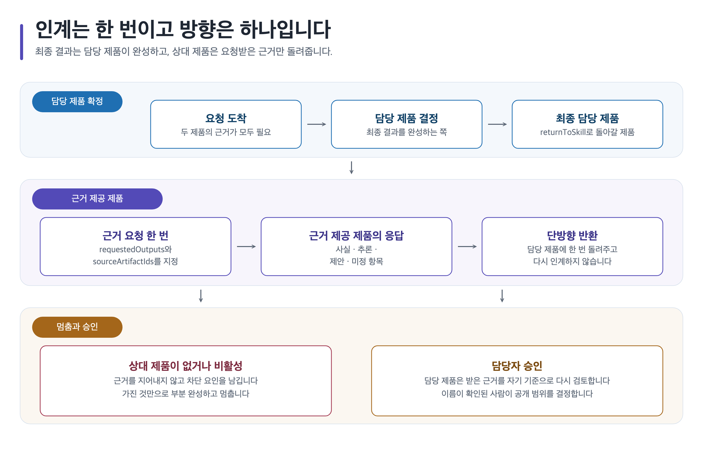

# 결과물 카탈로그

이 문서는 요청마다 무엇을 원본으로 보존하고, 어떤 자산과 파생 형식을 더할 수 있으며, 어느 단계에서 담당자가 검토해야 하는지 정리합니다. 템플릿의 정확한 구조와 스킬 입력 규칙은 각 제품의 설치 가이드에서 확인하세요.

## 최소 결과

최소 결과는 문서 변환 도구나 이미지 생성 기능을 사용할 수 없어도 기준 결과 폴더에 남아야 하는 원본입니다. `content.md`에는 문제, 가정, 근거, 결정과 미해결 사항을 적고, 근거·결정·자산은 파일 경로와 상태를 나눠 보관합니다.

## 선택 결과

선택 결과는 요청과 설정, 사용할 수 있는 기능, 사용자의 선택에 따라 더하는 프롬프트·생성 이미지·SVG·PNG·PDF·DOCX·PPTX 준비 자료입니다. 생성 이미지는 항상 `concept-draft` 상태로 시작합니다. SVG·PNG도 출처, 접근성 설명, 문법 검사·렌더링·화면 검수 근거를 모두 확인하기 전에는 승인된 결과로 보지 않습니다.

## 확장 결과

확장 결과는 담당자 검토와 형식별 품질 검사를 통과한 전달용 문서 또는 공개 가능한 Career 근거입니다. PDF·DOCX·PPTX는 후속 변환과 형식·화면 검수를 모두 마쳐야 완성으로 기록합니다. 그전에는 준비 상태와 재개 조건만 남깁니다.

## Studio 요청과 결과

| 사용자 요청 | 템플릿 | 최소 파일 경로 | 내용 범위 | 선택 이미지·도식 자산 | 파생 형식 | 사람 검토 | 포트폴리오·팀 활용 |
| --- | --- | --- | --- | --- | --- | --- | --- |
| 핵심 경험과 비전 정리 | `game-design-brief`, `vision-pillars` | `content.md`, `evidence.yml`, `decisions/` | `content.md`의 문제, 가정, 근거와 결정 | `concept-draft` 이미지 프롬프트, 비전 흐름 SVG·PNG | MD, PDF·DOCX·PPTX 준비 | 대상·제약·검증 기준 | 팀 착수 회의와 공개 가능한 문제 정의 |
| 규칙·상태·예외 명세 | `system-specification`, `rule-exception-matrix`, `data-schema-table-contract` | `content.md`, `decisions/` | `content.md`의 규칙, 상태, 예외와 검증 표 | 상태 흐름 SVG·PNG | MD, PDF·DOCX 준비 | 규칙 모순, 구현·검증 가능성 | 팀 인계와 개인 판단 근거 |
| UX·콘텐츠·경제 검토 | `ui-ux-flow-state`, `narrative-quest-npc`, `economy-balance` | `content.md`, `evidence.yml`, `decisions/` | `content.md`의 가정, 검토 목록과 미해결 위험 | `concept-draft` 이미지, 흐름·의존성 SVG·PNG | MD, PDF·PPTX 준비 | 접근성, 밸런스 가정, 미해결 위험 | 검토 기록과 반복 개선 근거 |
| 제작 범위·위험·출력 준비 | `production-scope-risk`, `decision-change-log`, `game-design-review` | `content.md`, `decisions/`, `export-manifest.yml` | `content.md`의 위험과 결정, `export-manifest.yml`의 형식 준비 상태 | 승인 전 도식 원본, 이미지 프롬프트 | MD, PDF·DOCX·PPTX 준비 | 담당자, 승인, 형식 검사 | 팀 전달. 공개 가능한 근거만 Career로 인계 |

## Career 요청과 결과

| 사용자 요청 | 템플릿 | 최소 파일 경로 | 내용 범위 | 선택 이미지·도식 자산 | 파생 형식 | 사람 검토 | 포트폴리오·팀 활용 |
| --- | --- | --- | --- | --- | --- | --- | --- |
| 역할·공고·학습 경로 정리 | `game-design-role-map`, `job-posting-evidence`, `learning-roadmap` | `content.md`, `evidence.yml`, `decisions/` | `content.md` 내 역할, 공고 표본과 학습 경로 | 역할·경로 SVG·PNG | MD, PDF·PPTX 준비 | 확인일, 지역, 표본 경계 | 학습 계획과 직무 대화 준비 |
| 관찰 기반 게임 분석 | `game-analysis-report`, `reverse-design-document` | `content.md`, `evidence.yml`, `decisions/` | `content.md`의 관찰, 추론과 반례 | 분석 도식 SVG·PNG, 증명용 이미지 프롬프트 | MD, PDF·DOCX 준비 | 사실·추론·반례, 권리 | 공개 가능한 분석 사례 |
| 포트폴리오 프로젝트 구성 | `portfolio-project-brief`, `creative-design-portfolio`, `portfolio-backlog` | `content.md`, `evidence.yml`, `decisions/` | `content.md`의 개인 기여와 검증 근거 | `concept-draft` 증명 이미지, 사례 흐름 SVG·PNG | MD, PDF·PPTX 준비 | 공개 가능성, 개인 기여, 발표 메시지 | 포트폴리오와 면접 근거 |
| 검토·면접·성장 기록 | `five-axis-review`, `interview-question-answer-log`, `junior-growth-review` | `content.md`, `evidence.yml`, `decisions/` | `content.md`의 검토 결과와 다음 검증 | 수정 우선순위 도식, 발표 이미지 프롬프트 | MD, PDF·PPTX 준비 | 주장·근거 연결, 다음 검증 | 검토 목록, 면접 연습, 성장 기록 |

## 기준 결과 폴더를 읽는 순서

원본을 먼저 읽고, 어떤 근거와 결정이 자산·파생 형식에 연결되는지 확인합니다.

```text
content.md
→ evidence.yml
→ decisions/
→ assets/
→ export-manifest.yml
```

`content.md`와 Markdown 원본은 문서 변환 도구가 없어도 남습니다. 자산이 없거나 파생 형식 만들기에 실패해도 원본, 근거, 결정 기록과 재개 조건을 덮어쓰거나 폐기하지 않습니다.

<a id="studio-career-handoff"></a>

## Studio에서 Career로 인계

[](../assets/shared/suite-handoff-ownership-flow.svg)

Studio와 Career의 기준 결과 폴더는 서로 분리합니다. Studio에서 Career로는 공개 가능한 **문제**, **결정**, **대안**, **검증 근거**만 요약해 별도의 Career 포트폴리오 프로젝트 요약서로 전달합니다. Studio 원본을 포트폴리오 원본으로 복제하거나 두 결과 폴더를 하나로 합치지 않습니다.

다음 자료는 인계하거나 공개하지 않습니다.

- NDA 또는 회사 비공개 자료
- 팀원의 개인 식별 정보와 연락처 등 개인정보
- 소유권·사용 허가가 확인되지 않은 이미지, 화면, 기타 자산
- 확인되지 않은 팀 성과, 매출, 재방문율, 일정 또는 개인 기여 주장

Career에서 다시 검토하더라도 Studio 결과의 공개 가능성·품질·성과가 자동으로 승인되지는 않습니다. 권리, 개인 기여, 사실과 가정의 경계, 검증 근거를 다시 확인한 뒤에만 확장 결과로 사용합니다.
